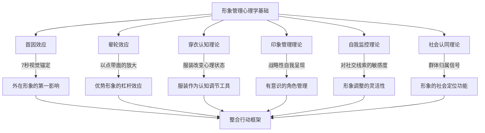

## 第一节 形象管理的心理学基础

形象管理不是"表面功夫"，而是建立在坚实心理学研究之上的系统性自我呈现策略。理解这些底层心理机制，能让你从"凭感觉穿衣"升级为"有策略地经营形象"。本节将系统梳理与形象管理密切相关的六大心理学理论，从认知偏差到社会动机，从神经机制到日常应用，构建完整的理论认知框架。

### 一、首因效应：7秒钟定终身

#### 1. 什么是首因效应

首因效应（Primacy Effect），也称为"第一印象效应"，是由美国心理学家洛钦斯（A.S. Lochins）在1957年通过经典实验首次系统论证的心理学现象。洛钦斯向两组被试呈现同一个人的两段描述——一段正面、一段负面——仅改变呈现顺序。结果显示：先接收正面描述的被试对该人的评价显著更积极，而先接收负面描述的被试评价则显著更消极。**相同的客观信息，仅仅因为呈现顺序不同，就导致了截然不同的判断结论。**

在人际交往领域，首因效应表现为：**人们在初次见面的极短时间内形成对他人的第一印象，而这一印象一旦形成，具有极强的稳定性和持续性，需要大量的后续信息才能被修正。**

美国普林斯顿大学的心理学家亚历山大·托多罗夫（Alexander Todorov）在2005年的研究进一步揭示，人们在看到一张面孔后仅需100毫秒（0.1秒）就能做出关于此人是否值得信任、是否有能力、是否有攻击性的判断。后续研究中，他让被试仅凭1秒的静态面部照片预测国会选举结果，预测准确率高达约70%。虽然这种判断的准确性在道德品质维度上存在很大争议，但其对后续交往行为的影响却是真实而深远的。

#### 2. 首因效应的神经科学基础

现代神经科学为首因效应提供了解释。大脑的杏仁核（Amygdala）是情绪处理的核心区域，它会在意识层面还未做出判断之前，就已经对视觉信息进行了快速的情绪评估。这种"快速评估"是人类进化过程中形成的生存机制——快速判断一个陌生人是"朋友"还是"敌人"，对生存至关重要。

大脑前额叶皮层（Prefrontal Cortex）负责更高级的认知处理，但它的工作速度远慢于杏仁核。fMRI研究表明，杏仁核在看到面孔后约30毫秒就已激活，而前额叶皮层需要至少200-300毫秒才能开始参与评估。**这意味着，在你"理性地"评估一个人之前，你的大脑已经"感性地"做出了初步判断。** 这就是为什么第一印象如此难以改变——它不仅仅是"想法"，更是深植于神经回路中的"感觉"。

此外，大脑的海马体（Hippocampus）会对首次接触的信息进行优先编码和强化存储，使得"第一次"的记忆在神经层面就比后续同类记忆更加深刻。这就是为什么"初恋"、"第一次面试"、"第一次见家长"等场景中的形象表现，其影响力远超日常状态。

#### 3. 首因效应的时间窗口

研究表明，第一印象的形成遵循以下时间规律：

| 时间窗口 | 主导信息通道 | 形成的判断维度 | 可控性 |
|---------|------------|--------------|-------|
| 0-7秒 | 视觉（外形、穿着、体态） | 外貌吸引力、社会地位、可信度 | 高——通过穿着、仪态直接控制 |
| 7-30秒 | 听觉（音色、语速、语调） | 亲和力、自信度、情绪状态 | 中——需要刻意练习 |
| 30秒-4分钟 | 语言内容（逻辑、知识、表达） | 智力水平、专业能力、思维深度 | 高——取决于知识储备和表达能力 |
| 4分钟以后 | 行为模式（互动、反应、习惯） | 性格特质、社交能力、真实品格 | 低——难以长期伪装 |

**前7秒的视觉印象是最具决定性的，它为后续的所有信息设定了"解释框架"。** 一个人如果在前7秒给人留下了"专业"的印象，后续的言行会被放在"专业"的框架中解读；反之，如果前7秒给人留下了"随意"的印象，即使后续表现优秀，也需要花费更多的努力来扭转这一印象。认知心理学将这种现象称为"锚定效应"（Anchoring Effect）——第一印象就是那个"锚"。

#### 4. 首因效应在形象管理中的应用

**第一，重视"出场"时机。** 每一次出现在他人面前，都是一次"首因效应"的发生场。即使是老朋友，久别重逢后的第一次见面也会产生类似首因效应的心理反应。因此，保持形象的一致性和高标准，不是"虚荣"，而是对人际交往规律的尊重。具体来说：参加重要社交活动前，预留至少30分钟准备时间，检查服装整洁度、发型、妆容和口气。

**第二，管理"视觉优先"策略。** 既然前7秒的视觉印象是决定性的，那么在外在形象上的投入就是"高杠杆"的。一件得体的衣服、一个挺拔的姿态、一个温暖的微笑，可能比一个小时的谈话更能影响他人对你的判断。操作层面：建立3-5套"零失误"的标准搭配，覆盖工作日、商务社交、休闲社交等常见场景，确保在任何场合都能在前7秒交出合格答卷。

**第三，一致性是关键。** 首因效应的核心机制是"认知锚定"——第一印象会成为后续信息的"锚点"。如果你今天给人的印象和明天完全不同，对方就无法形成稳定的认知，这会增加社交摩擦成本。建议：确定2-3个核心形象标签（如"专业"、"温暖"、"精致"），确保每次出现都传递一致的信号。

#### 5. 首因效应的局限性与突破

首因效应虽然强大，但并非不可逆转。以下情况可以削弱其影响：

- **长期交往**：随着交往时间增加，持续的行为模式信息会逐渐覆盖第一印象。心理学研究显示，约50小时的深度互动足以显著修正初始印象。
- **强烈反差**：如果后续信息与第一印象形成强烈且持续的反差（至少3次以上），印象会被修正。单次反差往往被视为"例外"而被忽略。
- **情境变化**：在不同情境中看到一个人的不同面向（工作场合的严谨 + 休闲场合的幽默），会形成更立体、更全面的认知。
- **认知动机**：当一个人有强烈的动机去了解另一个人时（如潜在合作伙伴），会主动寻找更多元的信息，此时首因效应的权重会降低。

### 二、晕轮效应：以点带面的认知捷径

#### 1. 什么是晕轮效应

晕轮效应（Halo Effect），也称为"光环效应"，是由美国心理学家爱德华·桑代克（Edward Thorndike）在1920年提出的概念。它指的是：**人们倾向于根据某人的某一突出特质，推断其其他方面的特质也具有类似的水平。**

桑代克在研究军队人事评价时发现了一个令人惊讶的现象：当军官被要求评价士兵的体格时，体格好的士兵在智力、领导力、忠诚度等方面的评分也显著更高——尽管这些特质之间并没有实际的相关性。一个身材高大、仪表堂堂的士兵，即使在智力测试中表现平平，在军官的主观评分中仍然被赋予了更高的智力分。这种"光环"般的认知偏差，就是晕轮效应。

#### 2. 晕轮效应的心理机制

晕轮效应的产生有三个相互关联的心理机制：

**认知捷径（Heuristic）**：人类大脑的信息处理带宽是有限的。赫伯特·西蒙（Herbert Simon）的"有限理性"理论指出，人类不可能对每个人进行全方位的深入评估。因此，大脑会使用"捷径"——根据最容易获取的信息（如外貌）来推断其他信息（如能力）。这是一种节省认知资源的策略，但在快速判断的同时也引入了系统性偏差。

**一致性需求**：人类有追求认知一致性的内在需求，心理学家费斯廷格（Leon Festinger）将其称为"认知一致性理论"。当我们认为一个人"好看"时，我们会不自觉地寻找支持"他/她各方面都好"的证据，而忽略相反的证据。这种现象被称为"确认偏差"（Confirmation Bias）。实验表明，一旦形成正面的第一印象，人们在后续互动中会自动过滤掉80%以上的矛盾信息。

**情感转移**：心理学中的"情感启发法"（Affect Heuristic）表明，当我们对一个人的某一方面产生积极情感时，这种情感会"溢出"到其他方面的评价上。一个人的微笑让你感到温暖，你会不自觉地将这种温暖感扩展到对他整体性格的评价上。

#### 3. 晕轮效应的经典研究与真实数据

**外貌与能力的关联**：大量的社会心理学研究一致表明，外貌更具吸引力的人在以下方面会被赋予更高的评价——

| 评价维度 | "美貌溢价"幅度 | 研究来源 | 备注 |
|---------|-------------|---------|-----|
| 能力水平 | +15%~25% | Dion et al., 1972 | 实际能力可能并无差异 |
| 社交能力 | +20%~30% | Walster et al., 1966 | "美即善"刻板印象 |
| 心理健康 | +10%~20% | 马太效应综述 | 社会正向反馈的累积 |
| 职业成功率 | +3%~4%收入差 | Hamermesh, 2011 | 控制教育、经验等因素后 |
| 道德品质 | +15%~30% | 后续重复实验 | 审判中的"美貌减刑"效应 |

这种现象被称为"美即好"（Beautiful-is-Good）刻板印象。虽然这种推断在逻辑上不成立，但它是跨文化、跨年龄的普遍现象。

**外貌与收入的关系**：经济学家丹尼尔·哈默梅什（Daniel Hamermesh）在其著作《美貌买单》（Beauty Pays）中，基于美国、加拿大、英国、中国和日本五国的大样本数据指出，在控制了教育、经验、种族等其他因素后，外貌最具吸引力的人收入比平均水平高出约3%-4%，而外貌吸引力较低的人收入则低于平均水平约5%-10%。换算成终身收入差，这个差距可以达到数十万美元。

**外貌与司法判决**：美国心理学家斯图尔特（Stewart）在1980年的研究发现，在交通违章案件中，外貌吸引力较低的被告被判处的罚金平均比外貌吸引力较高的被告高出约130美元。后续在更严重案件中也发现了类似的"美貌减刑"效应。这种偏见虽然令人不安，但确实是晕轮效应在现实中的深刻体现。

#### 4. 晕轮效应的正反两面

**正面：利用晕轮效应放大优势。** 当你在某一方面建立了良好的形象（如专业能力、外在形象、社交能力），晕轮效应会让他人对你在其他方面也形成积极的预期。这就是为什么形象管理的投入是"高杠杆"的——它不仅改善了他人对你外在形象的评价，还会"免费"提升对你整体能力和品质的评价。

**反面：警惕晕轮效应的陷阱。** 不要因为某人在某一方面表现优秀就盲目推断他在所有方面都优秀。同时，也要意识到自己可能正在被他人的晕轮效应所影响。一个包装精美的"能力平庸者"比一个穿着随意的"技术天才"更容易获得机会——这不是公平的，但这是现实。

#### 5. 晕轮效应在形象管理中的应用

**建立"核心光环"**：找到你最突出的优势（可以是专业能力、外在形象、社交能力等），将其放大到极致，让这个"光环"照亮你形象的其他方面。例如：如果你的核心优势是专业能力，那么在穿着上追求"专业感"而非"时尚感"，让两者形成协同效应。

**消除"负面光环"**：一个负面印象（如不守时、穿着邋遢、谈吐粗俗）也会产生"负面光环"，让他人对你在其他方面也形成负面评价。**消除形象中的"致命弱点"与放大优势同样重要，甚至更重要。** 因为负面光环的"辐射半径"往往大于正面光环。

**一致性强化**：当你的各个形象维度（外在、内在、线上、线下）都保持一致的高水准时，晕轮效应会被层层放大，形成"全方位优秀"的整体印象。这种"全方位优秀感"比单一方面的卓越更能产生强大的影响力。

### 三、穿衣认知理论：衣服如何改变你的大脑

#### 1. 理论的提出

2012年，西北大学的Adam和Galinsky教授在《实验社会心理学杂志》（Journal of Experimental Social Psychology）上发表了一篇里程碑式的论文，正式提出了"穿衣认知"（Enclothed Cognition）理论。该理论的核心观点是：**穿着特定的服装不仅会改变他人对你的看法，还会改变你自己的心理状态、认知能力和行为表现。**

这一发现将服装从"外部装饰品"升级为"心理调节工具"，为形象管理提供了全新的理论支撑。

#### 2. 经典实验

研究者设计了一个巧妙的实验：让参与者穿着白色大衣进行注意力测试（STROOP任务）。实验分为三组——

- **第一组**：被告知这是"医生的白大褂"
- **第二组**：被告知这是"画家的工作服"
- **第三组**：只是看到白大褂但没有穿上

结果发现，第一组（穿"医生白大褂"）的注意力测试成绩显著高于其他两组，注意力持续时间平均提升了约25%。第二组（穿"画家工作服"）与第三组（未穿衣）之间没有显著差异。

**这意味着：同样是白大褂，当它被赋予"医生"的意义时，穿着者的注意力表现会提升；当它被赋予"画家"的意义时，这种效应就消失了。** 穿衣认知不仅仅与服装的物理属性有关，更与服装的**象征意义**密切相关。

#### 3. 穿衣认知的双重机制

穿衣认知通过两个协同运作的机制发挥作用：

**象征意义机制（Symbolic Meaning）**：每件服装都承载着文化赋予的象征意义。西装象征"专业"和"权威"，运动服象征"活力"和"放松"，白大褂象征"科学"和"严谨"。当你穿上某件服装时，你的大脑会自动激活与之相关的心理图式（Schema），使你的思维方式和行为模式向该图式靠拢。这个过程大部分是无意识的——你不会"决定"变得专业，而是穿着象征专业的衣服时，你的大脑自动切换到了"专业模式"。

**身体体验机制（Physical Experience）**：服装不仅通过视觉传递信息，还通过触觉、温度、重量、束缚感等身体体验影响穿着者的心理状态。身体体验对心理的影响比大多数人想象的更深刻。合体的西装会让你感到"挺拔"和"有力"，这种挺拔感会反馈到心理层面，提升你的自信水平和决策果断度；宽松的T恤会让你感到"放松"和"随意"，但同时也可能降低你在正式场合中的自我要求。

**两个机制缺一不可。** 仅仅在象征意义上理解"西装=专业"是不够的——你必须真正穿上它，让身体体验与象征意义同时作用，才能产生完整的穿衣认知效应。这也解释了为什么试穿新衣服时会有"感觉完全不一样"的体验。

#### 4. 穿衣认知的扩展研究

后续研究进一步验证了这一理论的广泛适用性：

- **正式着装与抽象思维**：2015年的研究表明，穿着正式服装的被试在抽象思维测试中表现更优，思考方式更倾向于"大局观"而非"细节导向"。
- **运动服与体能表现**：穿着品牌运动装备的人在体能测试中表现更好——不是因为装备本身提升了体能，而是"运动员"的心理图式激活了更强的毅力和自我效能感。
- **内衣与自我认知**：一项有趣的研究发现，穿着自己认为"好看"的内衣的女性在社交互动中表现出更高的自信度和更强的社交主动性。

#### 5. 穿衣认知在形象管理中的应用

**为重要场合"穿对衣服"**：在面试、演讲、谈判等重要场合，选择能够激活你"最佳状态"的服装。判断标准不是"最贵的衣服"，而是"穿上它你最自信、最有力量感的衣服"。建议：提前确定重要场合的着装，并在正式场合前至少试穿一次，让大脑提前适应这套服装所激活的心理图式。

**建立"仪式感"**：将穿着特定服装与特定的心理状态关联起来，形成条件反射式的心理切换。例如：穿上某件深蓝色衬衫就进入"工作模式"，换上运动服就进入"放松模式"，穿上正装就进入"社交模式"。这种"仪式感"是高效的认知状态管理工具。

**注意服装的"反向效应"**：穿着过于随意的服装参加正式场合，不仅会影响他人对你的评价，还会通过穿衣认知机制降低你自己的心理状态和表现水平。"穿得像那么回事"，你才更容易"做得像那么回事"。

**居家办公的穿衣策略**：远程工作时代，很多人习惯了穿睡衣工作。但从穿衣认知的角度看，这会持续激活"放松"心理图式，降低工作效率和专业判断力。建议即使在家办公，也换上"轻正式"的服装（如Polo衫+休闲裤），保持"半正式"的认知状态。

### 四、印象管理理论：主动塑造他人眼中的你

#### 1. 印象管理的概念

印象管理（Impression Management）是由社会学家欧文·戈夫曼（Erving Goffman）在其经典著作《日常生活中的自我呈现》（The Presentation of Self in Everyday Life, 1959）中系统阐述的概念。戈夫曼将社会互动比喻为"戏剧表演"，每个人都在日常生活中扮演着不同的"角色"，而印象管理就是我们"管理"自己在他人面前"演出效果"的过程。

戈夫曼将互动场景分为"前台"（Front Stage）和"后台"（Back Stage）。在前台，人们有意识地控制自己的言行举止，呈现出符合期望的角色形象；在后台，人们则可以放松下来，做回"真实的自己"。**形象管理的核心问题就是：你的"前台"设计得是否高效？**

#### 2. 六种印象管理策略

心理学家琼斯（Edward E. Jones）在1990年的研究中提出了六种系统化的印象管理策略：

| 策略 | 核心手段 | 适用场景 | 潜在风险 | 形象管理应用 |
|-----|---------|---------|---------|------------|
| 讨好（Ingratiation） | 赞美、帮助、同意他人观点 | 社交破冰、建立关系初期 | 过度会显得谄媚、失去自我 | 真诚的赞美配合得体的形象 |
| 自我提升（Self-Promotion） | 展示能力和成就 | 求职、竞标、合作谈判 | 过度会显得自大 | 用形象"外化"专业能力 |
| 示范（Exemplification） | 表现勤奋、自律、牺牲 | 团队领导、长期合作 | 难以长期维持高标准 | 形象的稳定一致性本身就是"示范" |
| 恳求（Supplication） | 展示弱点和困难 | 寻求帮助、建立亲近感 | 过度会降低可信度 | 特定场景的"脆弱"可以增强真实感 |
| 威慑（Intimidation） | 表现强势、不可预测 | 谈判、威慑对手 | 可能破坏长期关系 | 深色、硬朗的视觉信号 |
| 声明（Entitlement） | 直接声明权利或资格 | 正式场合、权利主张 | 缺乏支撑会显得空洞 | 正装+自信体态+清晰语言 |

**关键是策略组合与场景匹配。** 没有单一策略适用于所有场景。一个成熟的形象管理者会根据场景、对象和目标，灵活选择和组合不同策略。

#### 3. 印象管理与形象管理的关系

印象管理是形象管理的理论基础之一。两者的关系可以用一句话概括：

> **印象管理是"战术"，形象管理是"战略"。**

- **印象管理**更侧重于单次场景——在特定场合中使用特定策略来影响特定对象
- **形象管理**更侧重于长期经营——建立稳定的、一致的、有辨识度的个人品牌形象

一个优秀形象管理者，既有战略性的长期定位（我想要什么样的形象），也有战术性的场景应变（在这个场合，我应该如何调整策略）。两者缺一不可：没有战略，战术就会变成"见人说人话"的投机；没有战术，战略就会变成"一招鲜吃遍天"的僵化。

### 五、自我监控理论：你对"形象信号"的敏感度

#### 1. 理论概述

自我监控理论（Self-Monitoring Theory）由心理学家马克·斯奈德（Mark Snyder）在1974年提出。该理论关注的核心问题是：**人们在多大程度上关注并调节自己在社交场合中的自我呈现？**

斯奈德设计了"自我监控量表"（Self-Monitoring Scale），将人们分为两种极端类型：

**高自我监控者**（High Self-Monitor）：
- 对社交线索高度敏感，能迅速捕捉到场合的"着装规范"和"行为期待"
- 善于根据场合调整自己的表现，在不同社交场景中呈现不同的面向
- 对自己的外在形象关注度高，服装选择具有明确的场景意识
- 社交适应性强，但可能给人"不真诚"的感觉

**低自我监控者**（Low Self-Monitor）：
- 不太关注社交线索，倾向于保持一贯的自我呈现
- 对外在形象的关注度较低，穿着主要基于个人喜好而非场合需要
- 行为模式稳定，给人"真实"的感觉，但可能在不同场合中显得"格格不入"
- 社交灵活性较低，但内在一致性较高

#### 2. 自我监控与形象管理的关系

自我监控水平直接影响一个人形象管理的"天赋"和"起点"：

- **高自我监控者**天然适合形象管理——他们能快速识别"什么场合穿什么"，但需要注意避免"过度适应"导致自我迷失
- **低自我监控者**在形象管理上需要更多的刻意学习——但他们一旦形成自己的风格，往往更加真实和持久

**理想的平衡点是"策略性自我监控"**：保持对社交线索的敏感度，能够根据场合做出适当调整，但不丢失核心的个人风格和价值观。

#### 3. 自我评估：你的自我监控水平

以下问题可以帮助你快速评估自己的自我监控倾向（每题回答"是"或"否"）：

1. 你是否经常根据场合改变自己的穿着风格？
2. 你是否能快速判断一个场合的"着装规范"？
3. 你是否会为了融入群体而调整自己的言行举止？
4. 你是否善于在不同人面前展现不同的面向？
5. 你是否经常观察别人的反应来调整自己的表现？
6. 你是否会花较多时间准备"见不同人穿什么"？
7. 你是否认为"在不同场合表现不同"是正常的社交技能？

**评分**：回答5个及以上"是"——你偏向高自我监控者；3个及以下——你偏向低自我监控者。无论哪种类型，理解自己的倾向都是制定有效形象管理策略的第一步。

### 六、社会认同理论：形象作为群体归属信号

#### 1. 理论概述

社会认同理论（Social Identity Theory）由亨利·泰弗尔（Henri Tajfel）和约翰·特纳（John Turner）在1979年提出。该理论的核心观点是：**个体的自我概念不仅来源于个人特质，还强烈依赖于他所属的社会群体。人们倾向于通过群体成员身份来定义"我是谁"，并努力维持积极的社会认同。**

这一理论对形象管理的启示是深刻的：**你的穿着打扮不仅是"个人品味"的表达，更是"群体归属"的信号。** 你穿什么，决定了你被归入哪个群体。

#### 2. 形象的"群体编码"功能

每个社会群体都有其视觉符号系统——特定的穿着风格、配饰偏好、色彩选择、品牌倾向等。这些视觉符号构成了群体的"编码系统"，成员通过穿着来表达"我属于这个群体"，而外部人员则通过这些信号来识别"这个人属于哪个群体"。

| 社会群体 | 典型视觉编码 | 传递的身份信号 |
|---------|------------|-------------|
| 科技行业从业者 | 连帽衫+牛仔裤+运动鞋 | 创新、实用主义、反传统 |
| 金融从业者 | 深色西装+白衬衫+领带 | 专业、可靠、严谨 |
| 创意行业从业者 | 个性化混搭+设计感单品 | 审美力、独特性、创造力 |
| 学术研究者 | 休闲但整洁的层叠搭配 | 内涵、学术严肃、低调 |
| 健身爱好者 | 运动装备+紧身剪裁 | 自律、健康、活力 |

#### 3. 社会认同理论在形象管理中的应用

**理解你的"目标群体"**：形象管理的第一步不是"选衣服"，而是明确"你想被归入哪个群体"。你的目标群体决定了你的形象编码系统。如果你想被科技行业认可，穿着连帽衫可能比穿西装更有效；如果你想在金融圈立足，情况则正好相反。

**避免"群体冲突"信号**：同时传递多个矛盾的群体信号会让人产生"认知失调"——他们不知道该如何"归类"你，这种不确定性会导致社交距离的增加。例如：在银行会议上穿着过于前卫的时尚单品，可能会让客户产生不信任感，不是因为你不够专业，而是因为你的视觉编码让他们无法识别你是"同类人"。

**善用"群体跨越"策略**：当你需要在不同群体之间切换时，可以通过调整视觉编码的核心元素来实现"群体跨越"。保留一些中性元素（如基础色系、整洁的剪裁），替换表达群体归属的关键单品（如领带vs圆领T恤），可以在不产生剧烈视觉冲突的前提下完成身份切换。

### 七、理论整合：构建你的形象管理心理框架

#### 1. 六大理论的关系图谱

#### 2. 从理论到行动的转化矩阵

| 心理学理论 | 核心洞察 | 对应的形象管理行动 | 常见误区 |
|-----------|---------|-----------------|---------|
| 首因效应 | 前7秒的视觉印象锚定一切 | 建立"零失误"标准搭配；重视出场准备 | 认为"内涵够就行，外表不重要" |
| 晕轮效应 | 一个优势可以辐射到所有方面 | 找到并放大核心光环；消除致命弱点 | 只追求单一维度的卓越而忽略整体协调 |
| 穿衣认知 | 服装改变你自己的认知和行为 | 根据场景选择能激活最佳状态的服装 | 认为穿衣只影响别人的看法 |
| 印象管理 | 战略性自我呈现优于随意表现 | 制定长期形象战略+场景战术库 | 把形象管理等同于"表演"或"虚伪" |
| 自我监控 | 理解自己对社交线索的敏感度 | 根据自我监控水平制定个性化策略 | 低自我监控者忽视场合差异 |
| 社会认同 | 穿着是群体归属的视觉信号 | 明确目标群体，匹配视觉编码 | 传递矛盾的群体信号导致认知失调 |

#### 3. 实操清单：立即可用的形象心理策略

理解了理论之后，以下是可立即实施的行动建议：

**日常层面：**
1. 清晨出门前，用10秒从"首因效应"的角度审视自己——如果一个陌生人此刻看到你，会在7秒内形成什么印象？
2. 建立3-5套"零失误"的标准搭配，覆盖你的核心社交场景（工作、社交、休闲）
3. 利用穿衣认知原理，在需要高效工作时穿上"工作服装"，即使在家办公

**场景层面：**
4. 参加任何重要场合前，先研究该场合的"视觉编码"——这个群体的人通常怎么穿？
5. 为每个重要场景准备一个"首因效应检查清单"：服装整洁？体态端正？微笑到位？
6. 在需要"切换身份"的场景中，通过更换1-2个关键单品来实现平滑过渡

**长期层面：**
7. 评估自己的自我监控水平，据此制定适合自己的形象管理策略
8. 确定2-3个核心形象标签，确保长期一致性
9. 定期反思：我的外在形象与我想要传递的身份信号是否一致？

### 八、常见误区与纠正

#### 误区一："形象管理就是虚荣"

**纠正**：形象管理是基于人类认知规律的务实策略。首因效应、晕轮效应、穿衣认知等理论都有大量实验支撑。忽视形象管理不是"真实"，而是"无视人性"。一个技术人员如果因为穿着随意而在关键商务场合失去合作机会，这不是对方"肤浅"，而是首因效应在起作用。尊重人性规律，才能更好地实现自己的目标。

#### 误区二："只要能力强，外表不重要"

**纠正**：晕轮效应的研究明确表明，外在形象会影响他人对你能力的评价。穿着邋遢的天才，其能力会被系统性地低估；穿着得体的普通人，其能力会被系统性地高估。这不是公平的，但这是真实的。你当然可以选择"不参与这个游戏"，但你需要清楚地知道这种选择的真实成本。

#### 误区三："找到一个固定风格就够了"

**纠正**：社会认同理论告诉我们，不同的社交场合对应不同的群体编码系统。一个在所有场合都穿同样风格的人，可能在某些场合中被完美接纳，但在另一些场合中会被视为"格格不入"。有效的形象管理不是"一招鲜"，而是"一核多元"——有一个核心风格内核，但能根据场景灵活调整。

#### 误区四："形象管理就是模仿别人"

**纠正**：穿衣认知理论的关键发现是——穿衣的效果取决于穿着者自己对服装的"象征意义"认知。如果一件衣服你自己觉得"不像自己"，那么即使它在外人看来很得体，也无法产生正向的穿衣认知效应。形象管理的核心不是"复制别人的风格"，而是"找到适合自己的、能激活最佳状态的形象组合"。

#### 误区五："形象管理是一次性的事"

**纠正**：形象管理是一个持续优化的过程。你的目标群体可能会变化，你的个人风格会演化，社会的审美标准会更新。每年至少做一次全面的形象审视——你的外在形象是否仍然与你的目标和身份一致？

***

**本节小结**：形象管理的心理学基础由六大理论支撑——首因效应告诉我们"第一印象的决定性力量"，晕轮效应揭示了"以点带面的放大机制"，穿衣认知理论证明了"服装改变大脑"，印象管理理论提供了"战略性自我呈现的框架"，自我监控理论帮助我们理解"个人差异"，社会认同理论阐明了"形象的群体编码功能"。理解这些理论，是将形象管理从"凭感觉"升级为"有策略"的关键一步。
