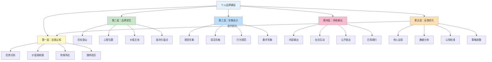
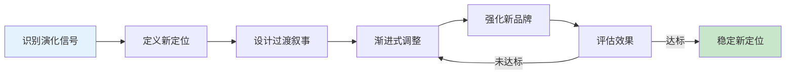

## 第二节 个人品牌理论

个人品牌是形象管理的理论内核。形象管理不是孤立的穿衣打扮或话术练习，而是服务于一个更高目标——在他人的心智中占据一个清晰、独特、有价值的位置。本节从个人品牌的起源、构成、建设模型、定位方法、测量体系、危机管理到长期演化，系统构建完整的个人品牌理论框架。

### 一、个人品牌的起源与本质

#### 1. 概念溯源

个人品牌（Personal Branding）的概念最早由管理学家汤姆·彼得斯（Tom Peters）在1997年发表于《快公司》杂志（Fast Company）的文章《品牌英雄》（The Brand Called You）中提出。他指出："你就是你自己的CEO……你最重要的工作就是做自己的品牌经理。"这一观点打破了品牌只属于企业和产品的传统认知，开创了个人品牌理论的先河。

在彼得斯之前，"声誉管理"（Reputation Management）的概念早已存在，但它更多是一种被动的、防御性的思维——关注的是"别人怎么看我"，而非"我要主动塑造别人怎么看我"。个人品牌理论的革命性在于，它将市场营销中的品牌战略思维引入了个人发展领域：你不是被动地被评价，而是主动地被构建。

2000年代以后，随着社交媒体的兴起，个人品牌理论经历了三个发展阶段：

| 阶段 | 时间 | 核心特征 | 代表事件 |
|------|------|----------|----------|
| 萌芽期 | 1997-2005 | 概念提出，精英圈层关注 | 彼得斯发表《品牌英雄》 |
| 成长期 | 2005-2015 | 社交媒体普及，人人可品牌化 | LinkedIn、微博、微信公众号兴起 |
| 成熟期 | 2015至今 | 系统化理论成型，跨领域应用 | 个人品牌咨询成为独立行业 |

#### 2. 个人品牌的本质定义

个人品牌的本质，是他人对你形成的**一致的、可预期的、有价值的认知**。它不是你自认为的样子，也不是你希望别人认为的样子，而是别人在与你互动后实际形成的关于你的"心智占位"。一个清晰的个人品牌，能够帮助你在信息过载的时代被快速识别、记住和信任。

杰夫·贝索斯有一句被广泛引用的话："你的品牌就是别人在你背后怎么说你。"这句话精准地揭示了个人品牌的核心特征——它不由你定义，而由他人感知。你能做的是通过持续的、一致的行为来影响这种感知。

#### 3. 个人品牌的四个核心维度

从学术角度看，个人品牌可以从以下四个维度来理解：

**认知维度——你在他人头脑中的"认知地图"**

当别人想到你时，脑海中浮现的是怎样的画面？是"那个穿得很得体的项目经理"，还是"那个总是迟到的设计师"？认知心理学中的"启发式加工"（Heuristic Processing）理论指出，人们在形成对他人的印象时，往往依赖简化的认知捷径。你的穿着、说话方式、行为习惯中的任何一个细节，都可能成为他人构建你"认知地图"的锚点。

关键在于：认知地图一旦形成就具有强大的惯性。心理学中的"首因效应"（Primacy Effect）和"确认偏误"（Confirmation Bias）使得人们倾向于用最初形成的印象来解释后续观察到的行为。这意味着你给别人的"第一印象"和"关键印象"对你的个人品牌具有不成比例的影响力。

**价值维度——你为他人提供的独特价值**

个人品牌代表你为他人提供的独特价值。这种价值可以是专业能力、人格魅力、审美品味、社交能力，或是这些要素的独特组合。价值维度回答的核心问题是："认识你、与你建立关系，对别人来说有什么好处？"

这里需要区分三种价值类型：
- **功能价值**：你能帮别人解决什么问题？（如技术能力、专业知识）
- **情感价值**：和你相处让人有什么感受？（如安全感、愉悦感、被尊重感）
- **身份价值**：和你关联能提升别人什么身份？（如社交资本、圈层归属）

高段位的个人品牌往往同时提供多种价值。一个优秀的技术leader不仅提供功能价值（解决技术问题），还提供情感价值（让团队感到安心）和身份价值（"我在他手下干过"本身就是一种职业背书）。

**一致性维度——个人品牌的基石**

个人品牌的核心在于"一致性"。如果你今天是这样，明天是那样，别人就无法对你形成稳定的认知，也就谈不上品牌。一致性体现在三个层面：

- **跨时间一致性**：你在不同时间点的表现是否稳定？
- **跨场景一致性**：你在工作、社交、私人场合的形象是否统一？
- **跨渠道一致性**：你在线上和线下的形象是否一致？

需要澄清的是，一致性不等于一成不变。品牌可以进化，但进化应该是渐进的、有方向的，而不是随机的、矛盾的。苹果从彩虹logo到单色logo的转变是一次品牌进化，但其"创新、简洁、高端"的核心定位从未改变。

**差异化维度——个人品牌的生命线**

在同质化竞争日益激烈的今天，差异化是个人品牌的生命线。你需要找到自己与他人不同的地方——不一定是"更好"，而是"不同"。这种差异化可以来自你的经历、视角、风格或价值观。

差异化的核心不是标新立异，而是找到你独有的"交叉点"。单一维度上很难做到独一无二，但两个或多个维度的交叉组合可以创造独特的定位。例如："懂技术的销售"、"会讲故事的工程师"、"有商业sense的设计师"——这些交叉定位本身就是差异化。

### 二、个人品牌的构成要素

一个完整的个人品牌由五个核心要素构成，它们共同支撑起品牌的完整性：

#### 1. 核心价值（Core Value）

这是你个人品牌的"灵魂"。它回答的问题是："你代表什么？"核心价值通常与你的深层信念、人生使命和核心优势相关。例如，有的人的核心价值是"创新"，有的人是"可靠"，有的人是"温暖"。

核心价值不是你随口说出的口号，而是经过深度自我审视后提炼出的、真正驱动你行为的内在力量。判断一个核心价值是否"真实"的标准是：它是否在你过去的重大选择中反复出现过？如果你说自己重视"创新"，但你的每一次职业选择都倾向于稳定和安全，那"创新"就不是你的核心价值。

提炼核心价值的三步法：

1. **回溯关键时刻**：列出你人生中做过的5-10个重大选择（职业、关系、生活方式），分析每个选择背后的核心驱动力
2. **寻找共同线索**：在这些驱动力中寻找反复出现的主题词
3. **压力测试**：用这些主题词反问自己——如果为了维护这个价值，我愿意付出什么代价？如果答案是"什么代价都愿意"，那它就是你的核心价值

#### 2. 视觉形象（Visual Identity）

这是个人品牌最直观的表达。它包括你的穿着风格、发型妆容、配饰选择、色彩偏好等。视觉形象需要与你的核心价值保持一致——如果你的核心价值是"专业可靠"，那么你的穿着就不应该过于前卫和张扬。

视觉形象的力量在于其"无意识传递"能力。神经科学研究表明，人类大脑处理视觉信息的速度比文字快6万倍，且视觉印象的形成往往在100毫秒以内完成。这意味着在你开口说话之前，你的视觉形象已经在"替你说话"了。

视觉形象的管理不是追求好看，而是追求"准确"。一个程序员穿着三件套西装去创业公司上班，和一个金融从业者穿着连帽衣去见客户，都是视觉形象与定位不匹配的典型错误。

#### 3. 语言风格（Verbal Style）

这是你通过语言传递的品牌信息。它包括你说话的方式、用词习惯、话题偏好、幽默感类型等。语言风格是个人品牌的重要载体，它直接影响他人对你的认知。

语言风格可以从以下维度来拆解：

| 维度 | 说明 | 示例对比 |
|------|------|----------|
| 正式程度 | 用语的正式或随意 | "我认为这个方案可行" vs "这方案能整" |
| 信息密度 | 每句话包含的信息量 | 简洁直说 vs 铺垫详述 |
| 情感色彩 | 表达中的情感温度 | 理性克制 vs 热情洋溢 |
| 修辞偏好 | 惯用的修辞手法 | 喜欢用类比 vs 喜欢用数据 |
| 互动模式 | 对话中的主导程度 | 主动引导话题 vs 倾听回应 |

语言风格的管理要点在于找到"舒适区内的品牌化表达"。你不需要完全改变自己的说话方式，但需要有意识地强化那些与品牌定位一致的表达习惯，弱化那些与定位矛盾的表达习惯。

#### 4. 行为模式（Behavioral Pattern）

这是你通过行为传递的品牌信息。你是否守时？你是否信守承诺？你如何对待服务员？你如何面对压力？这些行为模式构成了他人对你最真实的认知基础。

行为模式之所以重要，是因为它是个人品牌中"最难伪造"的部分。视觉形象可以精心设计，语言风格可以刻意练习，但行为模式——尤其是压力下的行为模式——往往暴露你的真实特质。正如巴菲特所说："潮水退去才知道谁在裸泳。"

行为模式的管理不是表演，而是通过建立习惯系统来让正确的行为成为默认反应。例如，如果你的品牌定位是"可靠"，那就建立一套时间管理系统来确保你真的能做到守时，而不是靠意志力强撑。

#### 5. 数字形象（Digital Presence）

在数字化时代，你的线上形象已经成为个人品牌不可分割的一部分。你的社交媒体内容、头像选择、发帖风格、互动方式等，都在持续塑造你的数字形象。

数字形象的特殊性在于三个特征：

- **可搜索性**：任何人只要搜索你的名字，就能看到你过去几年的公开言论
- **可传播性**：一条不恰当的内容可能在几小时内被成千上万人看到
- **持久性**：互联网是有记忆的，删除不等于消失

因此，数字形象的管理需要比线下形象更加谨慎。一个实用的管理框架是"3秒规则"——在发布任何内容之前，问自己三个问题：（1）如果老板看到这条内容，我会尴尬吗？（2）如果三年后的我看到这条内容，我会后悔吗？（3）如果这条内容被截图传播出去，我能承受后果吗？三个问题中有任何一个答案是"会"，就不要发布。

### 三、个人品牌的建设模型

基于上述理论框架，个人品牌的建设可以分为五个层次，形成一个"由内而外、循环迭代"的闭环模型：

#### 第一层：自我认知（内核）

了解自己的优势、劣势、价值观和热情所在。这一层是整个品牌建设的地基——地基不牢，上层建筑必然坍塌。

自我认知的常见陷阱是"自我欺骗"。很多人以为自己了解自己，但实际上他们的自我认知可能来自父母的期望、社会的标准、或者某个阶段的成功经验，而非来自深度的自我审视。

可靠的自我认知工具：
- **盖洛普优势识别器**（CliftonStrengths）：识别你的34个主题才干，找到前5大优势
- **MBTI/大五人格测试**：作为自我探索的起点（而非标签化的终点）
- **生命线练习**：画出你从出生到现在的"人生曲线"，标注高峰和低谷，分析背后的驱动因素
- **360度反馈**：向10-15个了解你的人（上级、同事、朋友、家人）收集关于你的真实印象

#### 第二层：品牌定位

明确你要在谁的心目中建立怎样的认知。这一层回答的核心问题是："我想让谁觉得我是什么样的人？"

品牌定位需要明确三个要素：
- **目标受众**：你主要面对的是谁？（职场同事、行业同行、客户、社交圈）
- **心智位置**：你想在他们心中占据什么位置？（最可靠的技术顾问、最有创意的策划人）
- **价值承诺**：你承诺持续提供的核心价值是什么？

#### 第三层：形象设计

将品牌定位转化为可感知的视觉、语言和行为表达。这一层是"翻译层"——把抽象的品牌定位翻译成具体可感知的信号。

#### 第四层：持续输出

通过各种渠道和场景持续传递一致的品牌信息。品牌不是一次性建立的，而是通过无数次重复和强化逐渐固化的。每一次与他人的互动——开会、聊天、发朋友圈、写邮件——都是品牌输出的机会。

#### 第五层：反馈优化

收集外部反馈，不断调整和优化个人品牌。品牌建设不是一条直线，而是一个螺旋上升的过程。你需要定期检视：别人对我的认知是否与我的定位一致？如果不一致，是我输出的问题还是定位的问题？

这个模型的核心逻辑是：**从内到外，由己及人**。很多人在形象管理上失败，根本原因是从第三层开始，忽略了前两层的基础建设。没有清晰的自我认知和品牌定位，再精致的外表也只是"没有灵魂的空壳"。

### 四、个人品牌的差异化定位

#### 1. 定位理论在个人品牌中的应用

杰克·特劳特和阿尔·里斯在《定位》一书中提出的定位理论，虽然是针对企业品牌的，但其核心原理完全适用于个人品牌。定位理论的核心观点是：**品牌不是你做了什么，而是你在消费者心智中占据了什么位置。**

应用到个人品牌中：你的个人品牌不是你做了什么，而是你在他人的心智中占据了什么位置。你需要找到一个独特的、有价值的、可持续的"心智位置"，然后围绕这个位置构建你的一切形象表达。

定位理论中的"品类第一"法则在个人品牌中同样适用。人们最容易记住的是"第一个"——第一个做某件事的人、某个领域的开创者、某种风格的代表。如果你无法在大品类中做到第一，那就创造一个你能做第一的小品类。例如，你可能不是"最好的程序员"，但你可以是"最懂心理学的程序员"。

#### 2. 差异化定位的四步法

**第一步：扫描竞争环境**

了解你所处的社交圈、职业圈中，其他人通常建立怎样的形象。具体做法是列出你直接竞争或比较的10-15个人，分析每个人的"品牌关键词"（如果用三个词形容他们，你会用什么？），然后画出一张"竞争格局图"，标注每个人占据的心智位置。

**第二步：识别空白位置**

在竞争格局图中找到未被占据的、有价值的"心智位置"。空白位置的判断标准：
- 它是否真的没有人占据？（不是你觉得没有，而是目标受众觉得没有）
- 占据这个位置是否能为你带来实际价值？（影响力、机会、信任）
- 你是否有能力持续占据这个位置？（不是装出来的，而是真实具备的）

例如，如果周围的同事都走"技术专家"路线，你是否可以走"技术+沟通"的路线？如果所有同行都在展示"成功"，你是否可以通过展示"从失败中学习的真实过程"来差异化？

**第三步：验证可行性**

你找到的"空白位置"是否与你的真实优势和特质相匹配？验证方法是"3M测试"：
- **Match（匹配）**：这个定位与你的核心优势和价值观匹配吗？
- **Market（市场）**：目标受众真的需要这个定位吗？
- **Moat（护城河）**：别人模仿你的难度有多大？

如果你的真实优势是技术能力，却要定位为"社交达人"，这个定位就是不可持续的——它通过不了Match测试。

**第四步：持续强化**

一旦确定了定位，就需要通过持续的、一致的行为来强化这个定位。品牌强化的"10000次重复法则"——你需要在不同的场合、通过不同的渠道、用不同的方式反复传递同一个核心信息，才能让别人真正记住并相信你的品牌定位。

强化品牌定位的具体策略：
- **内容策略**：围绕你的定位主题持续产出内容（文章、演讲、分享）
- **社交策略**：主动参与与定位相关的社交场合和社群
- **项目策略**：争取与定位相关的关键项目和机会，用成果背书
- **联结策略**：与定位领域的关键人物建立关联，借力放大

#### 3. 个人品牌画布

为了帮助你系统地梳理和设计个人品牌，以下提供一个"个人品牌画布"工具：

| 画布模块 | 核心问题 | 你的回答 |
|----------|----------|----------|
| 核心价值 | 我代表什么？ |  |
| 目标受众 | 我为谁而存在？ |  |
| 价值主张 | 我能提供什么独特价值？ |  |
| 差异化优势 | 我与他人有何不同？ |  |
| 信任证据 | 什么能证明我的品牌？ |  |
| 关键渠道 | 我通过什么触达受众？ |  |
| 品牌故事 | 我的核心叙事是什么？ |  |
| 视觉标签 | 别人看到什么会想到我？ |  |
| 语言标签 | 别人听到什么会想到我？ |  |
| 行为标签 | 别人经历什么会想到我？ |  |

建议每季度花1-2小时填写一次这个画布，随着你的成长和环境的变化，画布的内容也应该随之迭代。

### 五、个人品牌的测量与评估

品牌不能只凭感觉，需要有可衡量的指标体系。以下是个人品牌评估的四个层级：

#### 1. 认知度（Awareness）

衡量"多少人知道你"。具体指标：
- 社交媒体粉丝数、关注者增长趋势
- 搜索引擎中你的名字出现的结果数量和质量
- 行业活动中被邀请的频率
- 被他人主动提及或引用的频率

#### 2. 美誉度（Favorability）

衡量"知道你的人对你评价如何"。具体指标：
- 正面评价与负面评价的比例
- 被推荐给第三方的频率（"你应该认识一下XX"）
- 求助请求的类型和频率（别人因为什么来找你）
- 拒绝合作的比率（越低越好）

#### 3. 关联度（Association）

衡量"别人是否将你与你的品牌定位关联"。具体指标：
- 当别人用三个词形容你时，是否包含你的品牌关键词？
- 当别人提到某个领域时，是否会主动提到你？
- 当你的目标受众有相关需求时，你是否是第一个被想到的人？

关联度是个人品牌最核心的衡量指标——它直接反映了你的品牌定位是否成功植入了他人的心智。

#### 4. 忠诚度（Loyalty）

衡量"与你建立关系的人是否持续选择你"。具体指标：
- 复购率（如果你提供服务，客户是否持续合作）
- 长期关系维护率（你的人脉关系是否稳定增长）
- 在你犯错时，别人是否愿意给你第二次机会（品牌容忍度）

### 六、个人品牌的危机管理

#### 1. 品牌危机的三种类型

**一致性危机**：你的行为与你建立的品牌形象不一致。例如，一个以"专业"著称的人在重要会议上犯了低级错误。这类危机的本质是"预期落差"——别人对你有特定预期，而你的表现未能满足。

**信任危机**：你的行为损害了他人对你的信任。例如，一个以"可靠"著称的人多次失信于人，或一个以"真诚"著称的人被发现说谎。信任危机是最严重的品牌危机，因为信任是所有品牌关系的基础。

**形象危机**：你的外在形象出现了重大问题。例如，不雅照片被公开、不当言论被传播等。在社交媒体时代，这类危机的传播速度和影响范围都远超以往。

#### 2. 危机应对的四个原则

**原则一：快速响应**

危机发生后，不要逃避，要快速做出回应。沉默往往被解读为"默认"或"不在意"。响应的速度比内容更重要——你可以在第一时间表达"我知道这件事，我正在认真对待"，而不是等到想出完美回应才开口。

最佳响应时间窗口：
- 小型危机（个别人知道）：24小时内
- 中型危机（圈内传播）：6-12小时内
- 大型危机（公开传播）：2-4小时内

**原则二：真诚道歉**

如果确实是自己的错误，真诚地道歉。道歉的结构应该是：
1. 承认事实（"我做了XX"）
2. 表达悔意（"这是错误的，我感到抱歉"）
3. 理解影响（"我理解这对你造成了XX影响"）
4. 承诺行动（"我会通过XX来纠正/弥补"）

绝对不要在道歉中使用"如果"（"如果伤害了你，我很抱歉"）——这个字暗示你不确定自己是否真的做错了，会严重削弱道歉的诚意。

**原则三：行动修复**

道歉只是第一步，更重要的是用行动来修复受损的品牌形象。承诺改进，并用实际行动证明。行动修复的关键是"可见性"——你的改进行为必须让受影响的人能够看到，否则就等于没有改进。

**原则四：时间耐心**

品牌修复需要时间，不要期望一夜之间就能恢复如初。心理学中的"近因效应"（Recency Effect）意味着，只要你持续输出正面行为，最近的正面印象会逐渐覆盖旧的负面印象。但这个过程需要时间——通常，一次中等程度的品牌危机需要6-18个月才能基本修复。

#### 3. 危机预防的日常机制

最好的危机管理是预防。以下是日常可以建立的预防机制：

- **定期自检**：每月花30分钟回顾自己的公开言行，是否存在与品牌定位不一致的内容
- **信任账户**：把信任想象成一个银行账户，平时多"存款"（守信、帮忙、真诚），危机时才有"余额"可扣
- **社交审计**：定期检查自己的社交媒体内容，删除可能引起误解的旧帖
- **关系维护**：与核心人脉保持定期互动，不要等到需要帮助时才联系

### 七、个人品牌的长期演化

个人品牌不是一成不变的。随着你的成长、环境的变化、人生阶段的转变，你的品牌也需要相应的演化。但品牌的演化应该是有意识的、有计划的，而不是被动的、混乱的。

#### 1. 品牌演化的三种模式

**渐进式演化**：核心定位不变，但表达方式随时代更新。这是最安全的演化模式。例如，一个"技术专家"的品牌定位不变，但表达渠道从博客转向视频号，内容形式从长文转向短视频。

**跃迁式演化**：在人生重大转折时（转行、创业、搬迁），品牌定位发生根本性转变。这种演化需要更大的勇气和更系统的规划。关键是要给受众一个"过渡叙事"——"为什么我变了"，而不是让人感觉"你突然变了一个人"。

**分层式演化**：在不同的社会角色中展现不同的品牌层次。例如，你在职场中的品牌是"严谨的技术专家"，在朋友圈中的品牌是"幽默的美食达人"。这种模式是可行的，前提是不同层次的品牌之间不存在根本矛盾。

#### 2. 品牌演化的信号

以下信号提示你可能需要进行品牌演化：

- 你当前的品牌定位不再能代表真实的你
- 你的目标受众发生了变化（新行业、新圈层）
- 你的核心优势发生了变化（新的技能、新的经历）
- 外部环境发生了变化（行业变革、技术颠覆）
- 你感到当前品牌"束缚"了你，限制了你的发展空间

#### 3. 品牌演化的执行框架

品牌演化不是"推倒重来"，而是"有控制地过渡"。执行框架如下：

在这个过程中，最关键的一步是"设计过渡叙事"——你需要为品牌的变化编一个合理的"故事"，让受众能够理解和接受。人是叙事动物，一个好故事比一百个解释都有效。

### 八、个人品牌建设中的常见误区

#### 误区一：把品牌等同于包装

很多人把个人品牌理解为"给自己贴标签"或"学会包装自己"。这是最大的误区。个人品牌的根基是真实价值——没有真实价值支撑的品牌，就像没有地基的高楼，看着好看但经不起任何风雨。

**纠正方法**：品牌建设的起点永远是"我能提供什么真实价值"，而不是"我想让别人觉得我是什么"。先修炼内功，再谈包装。

#### 误区二：追求"人设"而非"人格"

"人设"是刻意构建的、与真实自我不完全一致的公共形象。短期来看，人设可以快速吸引关注；但长期来看，人设的维护成本极高，且一旦"翻车"，后果比没有品牌更严重。

**纠正方法**：不要构建与真实自我脱节的人设，而是在真实自我的基础上进行有策略的强化和表达。最好的个人品牌是"真实自我的最佳版本"。

#### 误区三：忽视一致性

有些人在不同场合展示完全不同的形象——在朋友圈是文艺青年，在LinkedIn上是商业精英，在微信群里是段子手。这种分裂式的形象会让别人对你产生困惑，无法形成清晰的品牌认知。

**纠正方法**：品牌的一致性不要求你在所有场合都一模一样，但要求核心定位保持统一。你可以在朋友圈展示更多个人生活，在LinkedIn展示更多专业内容，但两者传达的核心信息应该是兼容的。

#### 误区四：只建不维护

很多人花大量精力在品牌建设的初期，一旦品牌初步建立就松懈了。品牌的本质是"持续的承诺"，一旦你停止兑现承诺，品牌就会逐渐贬值。

**纠正方法**：把品牌维护纳入你的日常习惯——定期检视自己的公开形象、持续产出与品牌一致的内容、主动收集外部反馈。

#### 误区五：害怕曝光真实弱点

有些人认为个人品牌就是展示完美，因此刻意隐藏自己的弱点和失败经历。事实上，适度展示真实弱点反而能增强品牌的真实感和亲和力。心理学中的"出丑效应"（Pratfall Effect）表明，一个能力出众的人展示出小缺点时，反而会让人觉得更真实、更可爱。

**纠正方法**：策略性地分享你的失败经历和教训，但注意分享的方式应该是"我已经从中学到了什么"，而不是"我现在还在挣扎"。展示弱点的目的是增强真实感，而不是让人担心你。

#### 误区六：忽视"反向品牌"

你的个人品牌不仅是你想建立的样子，还包括你主动拒绝的样子。"反向品牌"（Inverse Brand）是你通过说"不"来强化的品牌信号。例如，一个拒绝接低质量项目的设计师，通过拒绝本身强化了"高品质"的品牌定位。

**纠正方法**：明确你的"不做什么"清单——哪些合作你不接、哪些场合你不参加、哪些行为你不做。这些"拒绝"本身就是品牌建设的一部分。

### 九、核心要点总结

| 层次 | 核心问题 | 关键行动 |
|------|----------|----------|
| 自我认知 | 我是谁？ | 深度自省 + 360度反馈 |
| 品牌定位 | 我在别人心中是什么？ | 差异化分析 + 品牌画布 |
| 形象设计 | 我如何被感知？ | 视觉/语言/行为/数字四维设计 |
| 持续输出 | 我如何被记住？ | 一致性重复 + 多渠道传播 |
| 反馈优化 | 我的品牌有效吗？ | 四级测量体系 + 定期迭代 |
| 危机管理 | 品牌受损怎么办？ | 快速响应 + 真诚修复 |
| 长期演化 | 品牌如何与时俱进？ | 有控制的渐进式演化 |

个人品牌的本质是一场"与他人心智的长期对话"。你不是在推销自己，而是在帮助别人更好地理解你——你是谁、你能做什么、和你建立关系对他们有什么价值。当你把品牌建设的焦点从"我想让别人觉得我是什么"转向"我能为别人提供什么真实价值"时，个人品牌就不再是一种表演，而是一种真诚的自我表达。
