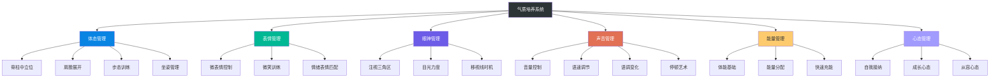
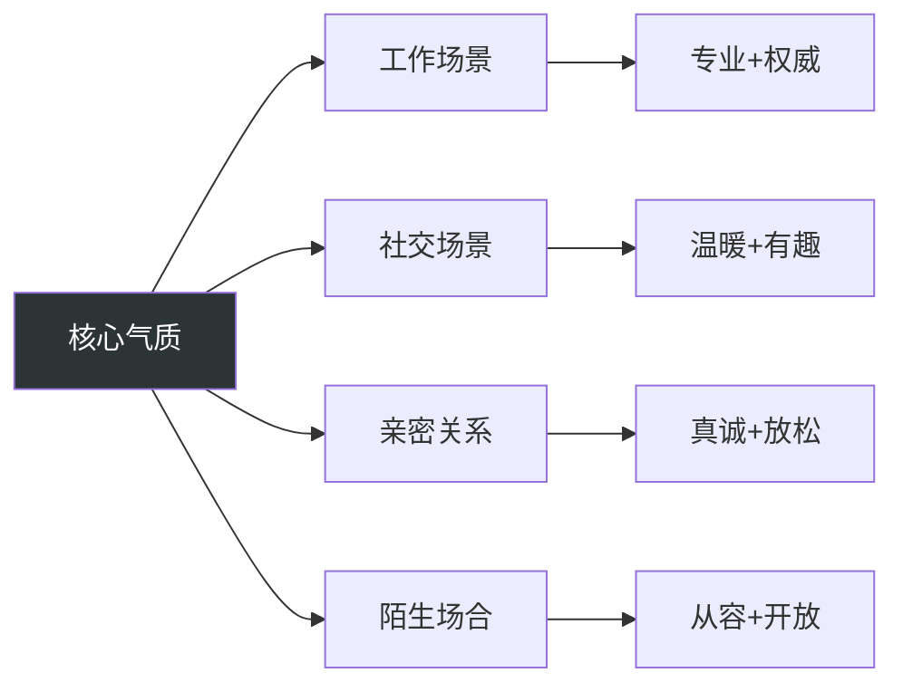
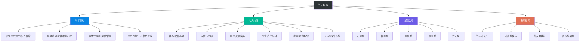

## 第三节 气质培养理论

### 一、气质的本质

#### 1. 什么是气质

气质（Temperament/Charisma）是一个经常被使用却很少被明确定义的概念。在心理学中，气质通常指个体在情绪反应、活动水平、注意力和情绪自我调节方面表现出的先天倾向。而在日常语境中，我们说一个人"有气质"，通常是指这个人散发出的一种难以言喻却真实可感的魅力。

从形象管理的角度，气质可以定义为：**一个人通过外在表现传递出的内在品质的综合感受**。它不是单一维度的美丑或胖瘦，而是一个多维度的"感觉场"，包括但不限于：

- **从容感**：面对各种场景时的淡定与自如——别人慌乱时你能稳住，别人急躁时你能沉住气
- **力量感**：言行中透露出的自信与掌控力——不是强硬，而是一种"我知道我在做什么"的笃定
- **温暖感**：让人感到亲近和舒适的亲和力——不需要刻意讨好，自然散发出善意
- **知性感**：言谈举止中流露的智慧与学识——不是卖弄，而是不经意间展示的思维深度
- **品味感**：在细节中展现出的审美与格调——可能是一块合适的手表，也可能是说话时的一个精准用词
- **独特感**：区别于他人的个性化特质——让人记住你的那个"不一样"的点

#### 2. 气质与外貌的关系

一个关键认知：**气质不等于外貌**。外貌是先天的、硬件层面的，而气质是后天培养的、软件层面的。现实中存在大量反例——五官精致但气质平庸的人，相貌普通但气质出众的人。这说明气质有独立于外貌的运作机制。

从信息传递的角度理解，外貌传递的是"生物信号"（健康、年龄、基因），而气质传递的是"社会信号"（能力、地位、性格）。在人际交往中，社会信号的权重往往高于生物信号——这就是为什么一个相貌平平但气场强大的人，比一个长相出众但畏畏缩缩的人更有吸引力。

#### 3. 气质与性格的区别

气质和性格常被混淆，但两者有本质区别：

| 维度 | 气质 | 性格 |
|------|------|------|
| 形成机制 | 先天气质底色 + 后天刻意培养 | 先天气质 + 成长环境 + 人生经历 |
| 可变性 | 可通过训练显著改变 | 核心性格较难改变，行为模式可调整 |
| 表现场景 | 主要在社交互动中被感知 | 贯穿所有生活场景 |
| 可控性 | 高度可控——可以选择在特定场合展示特定气质 | 较难刻意控制——压力下会暴露真实性格 |
| 培养路径 | 体态、表情、声音、能量管理等外在训练 | 价值观、信念、认知模式等内在修炼 |

简单来说：**性格是"你是谁"，气质是"你看起来像谁"**。两者的理想状态是一致的，但气质的可塑性远高于性格——你可以通过训练在三个月内让自己的气质发生显著变化，但性格的改变可能需要数年。

### 二、气质培养的科学基础

现代神经科学和心理学研究为气质培养提供了坚实的科学依据。理解这些底层机制，能让你的训练更有方向感，避免盲目练习。

#### 1. 镜像神经元理论

意大利神经科学家里佐拉蒂（Giacomo Rizzolatti）在1996年发现的镜像神经元系统，是理解气质如何"传染"的关键。镜像神经元是大脑中一类特殊的神经细胞，它们在你执行某个动作时激活，在你**观察别人执行同样的动作时也会激活**。

这意味着：当你看到一个人挺直脊柱、目光坚定地走进房间时，你的大脑会"模拟"对方的状态——你自己也会不自觉地挺直身体、集中注意力。这就是气质能够被"感知"的神经基础。

**实践启示**：你不需要"说服"别人你有气质，你只需要展示出正确的状态，对方的大脑会自动"镜像"你的状态。这就是为什么真正的气质高手从不刻意表演——他们只是持续地处于正确状态，周围的人自然会被"感染"。

#### 2. 具身认知理论

具身认知（Embodied Cognition）理论指出：**身体状态会直接影响心理状态**，而非仅仅是心理状态影响身体。这不是鸡汤，而是有严格实验支撑的结论。

经典实验一：哈佛大学教授Amy Cuddy的"力量姿势"（Power Pose）实验。参与者被要求保持扩展性姿势（双手叉腰、身体展开）仅两分钟，结果体内的睾酮水平上升了20%，皮质醇水平下降了25%。睾酮与自信和支配感相关，皮质醇与压力相关——也就是说，仅仅改变身体姿势，就能让你变得更自信、更抗压。

经典实验二：德国心理学家Fritz Strack的"咬笔实验"。参与者被要求用牙齿咬住一支笔（模拟微笑的面部肌肉），结果报告了更高的快乐水平。面部肌肉的运动状态直接影响了情绪体验。

经典实验三：走路速度与情绪的关系。研究发现，当人们被诱导以更慢、更从容的速度行走时，他们报告了更低的焦虑水平和更高的幸福感。

**实践启示**：气质培养可以从"身体"入手。你不需要先"变得自信"再"表现自信"——你可以先"表现自信"（挺直身体、放慢语速、稳定目光），然后你的大脑会自动"补上"自信的心理状态。这就是"由外而内"培养气质的科学依据。

#### 3. 情绪传染理论

情绪传染（Emotional Contagion）是指一个人的情绪状态会通过非语言信号"传染"给周围的人。这个过程大部分是无意识的——你甚至不知道自己在"感染"别人的情绪，或者在被别人"感染"。

加州大学圣地亚哥分校的Fowler和Christakis在2008年发表于《英国医学杂志》的研究发现：当你感到快乐时，你社交网络中朋友感到快乐的概率增加15%，朋友的朋友感到快乐的概率增加10%。情绪的传染可以延伸到三度社交距离。

**实践启示**：有气质的人往往是"情绪源"——他们散发的是稳定、积极、从容的情绪状态，而周围的人会被这种状态"感染"。培养气质的本质，就是培养一种能够持续散发积极情绪信号的内在状态。

#### 4. 社会渗透理论

心理学家阿尔特曼（Irwin Altman）和泰勒（Dalmas Taylor）提出的社会渗透理论指出，人际关系的发展是一个由浅入深的"渗透"过程——从表面信息的交换，逐步深入到核心价值观和情感的分享。

在这个过程中，气质扮演的角色是**"持续性筛选器"**：

- **初见阶段**（0-5分钟）：气质是第一印象的核心组成部分，决定对方是否愿意继续交往
- **试探阶段**（5-30分钟）：气质的一致性验证初见印象——"这个人是不是表里如一？"
- **深入阶段**（30分钟+）：气质的深度支撑关系升级——"和这个人在一起感觉很舒服"
- **维持阶段**（长期）：气质的稳定性巩固信任——"这个人始终如一"

**实践启示**：气质不仅要"好"，更要"一致"。初见时的气质如果与深入交往后的气质差距过大，反而会破坏信任。最好的气质策略是"展示最好的真实自我"，而不是"表演一个完美的假自我"。

#### 5. 气质培养的神经可塑性基础

神经可塑性（Neuroplasticity）是气质培养的根本保障。大脑不是固定不变的硬件，而是可以通过重复训练不断重塑的"活系统"。伦敦大学学院对出租车司机的研究发现，经过数年的空间导航训练，司机的海马体（与空间记忆相关的脑区）显著增大。

同样的原理适用于气质培养：当你反复练习挺直站立、稳定目光、从容说话时，相关的神经回路会不断强化，最终这些行为会变成"自动化"的习惯——到那时，你不需要刻意控制就能自然地展现良好的气质。

关键数据：根据行为心理学研究，一个新习惯的形成平均需要66天（伦敦大学学院Phillippa Lally的研究），而非流行的"21天"。气质培养是一个持续2-3个月的刻意训练过程，而非一朝一夕的顿悟。

### 三、气质培养的六大核心维度

基于上述科学理论，气质培养可以从以下六个核心维度展开。这六个维度构成了一个完整的系统——体态是硬件基础，表情和眼神是显示器，声音是声学载体，能量是动力系统，心态是操作系统。

#### 1. 体态管理——气质的"硬件基础"

体态是气质的底层载体。一个人的站姿、坐姿、走姿，会直接传递关于自信程度、精神状态和社会地位的信息。研究表明，保持"力量姿势"（Power Pose）仅两分钟，就能使体内的睾酮水平上升20%，皮质醇水平下降25%，从而显著提升自信感和抗压能力。

**体态管理的核心原则：**

**脊柱中立位**：保持脊柱的自然曲线——颈椎微微前凸、胸椎微微后凸、腰椎微微前凸、骶椎微微后凸。既不前倾也不后仰，既不左偏也不右偏。检测方法：背靠墙壁站立，后脑勺、肩胛骨、臀部、小腿、脚跟五点贴墙，保持这个姿态30秒，感受脊柱中立位的身体记忆。

**肩膀展开**：双肩自然下沉并向后微展，避免含胸驼背。很多人因为长期伏案工作，肩膀已经习惯了前扣的姿势。纠正方法：每天做"肩胛骨夹铅笔"练习——想象两块肩胛骨之间夹着一支铅笔，努力把铅笔夹紧，保持5秒后放松，重复20次。

**头部正位**：下巴微收（不是低头），头顶向上延伸，避免前探。现代人普遍存在"前探头"（Forward Head Posture）问题——头部位置前于肩膀，这会让人的气质大打折扣。自测方法：侧面拍照，耳垂是否在肩膀正上方，如果明显前移，说明存在前探头问题。

**步伐稳定**：步幅适中（约为身高的45%），节奏均匀（每秒1.5-2步），脚掌平稳着地（先脚跟后脚尖）。步伐是体态中最具"信息量"的部分——匆忙、拖沓、摇晃的步伐会立刻暴露一个人的紧张或懒散。

**日常体态训练计划：**

| 训练项目 | 动作描述 | 每日时间 | 见效周期 |
|---------|---------|---------|---------|
| 靠墙站立 | 五点贴墙，保持脊柱中立位 | 5分钟 | 2周 |
| 肩胛骨训练 | 夹铅笔练习+肩部环绕 | 3分钟 | 3周 |
| 颈部拉伸 | 四方向拉伸+下巴回收 | 3分钟 | 2周 |
| 步态训练 | 节拍器辅助匀速行走 | 5分钟 | 4周 |
| 平衡训练 | 单脚站立+闭眼平衡 | 3分钟 | 6周 |
| 核心力量 | 平板支撑+死虫式 | 5分钟 | 4周 |

#### 2. 表情管理——气质的"显示器"

面部表情是气质的实时"显示器"。一个自然、温暖、有控制力的表情，能够瞬间提升他人对你的好感度。表情管理不是"假笑"，而是学会有意识地调控面部肌肉，传递恰当的情绪信息。

**表情管理的三个层次：**

**基础层（硬件维护）**：保持面部清洁、皮肤健康。这是表情管理的"地基"——再好的表情控制，如果皮肤状态糟糕，效果也会大打折扣。基础护肤三步：洁面、保湿、防晒。

**技术层（肌肉控制）**：学会控制眉眼、嘴角、面部肌肉的细微运动。关键技巧包括：
- **杜乡微笑（Duchenne Smile）**：嘴角上扬+眼角鱼尾纹同时出现的微笑，被视为"真诚微笑"的标志。练习方法：对着镜子，先只用嘴微笑（假笑），再同时用眼微笑（想一件真正开心的事），感受两者的区别
- **眉毛微抬**：表示"我在认真听你说"——幅度约3-5毫米，配合微微前倾的身体
- **下巴微收**：表示谦逊和开放——避免"鼻孔看人"的傲慢感
- **面部放松**：有意识地放松咬肌和额头——很多人在紧张时会不自觉地咬紧牙关

**艺术层（自然流露）**：让表情成为内心状态的自然流露，达到"不着痕迹"的境界。这需要长期修炼，不是技巧层面能解决的，而是需要配合心态管理（见第六维度）。

**表情自检清单：**

对着镜子或录像检查以下问题：
- [ ] 自然状态下面部是放松的还是紧绷的？
- [ ] 微笑时嘴角是否对称？（不对称可能传递不真诚的信号）
- [ ] 说话时眉毛是否过度移动？（频繁挑眉会显得不自信）
- [ ] 倾听时是否保持了适度的"回应性表情"？（点头、微笑、皱眉等）
- [ ] 不同情绪状态下，表情是否与情绪匹配？

#### 3. 眼神管理——气质的"灵魂窗口"

眼神是气质中最具"穿透力"的元素。坚定而温和的眼神，能够传递自信、真诚和力量。眼神管理包括：注视的方向、注视的时长、眼神的力度、眨眼的频率等。

**眼神交流的黄金法则：**

**注视区域**：与人交谈时，目光落在对方双眼与鼻尖形成的"三角区"。这个区域既不会显得过于侵入（直视双眼），也不会显得心不在焉（看其他地方）。

**注视时长**：保持60%-70%时间的眼神接触。低于50%会显得不自信或不真诚，高于80%会显得有压迫感或攻击性。一个实用技巧：在对方说话时保持眼神接触，在自己说话时可以适度移开（看向前方或略微向下），这会显得你在"思考"而非"背诵"。

**眼神力度**：眼神要"软"而非"硬"。硬眼神（瞳孔收缩、眼睑紧绷）传递的是紧张或攻击性，软眼神（瞳孔微微放大、眼睑放松）传递的是温暖和信任。练习方法：想象你在看一个你非常喜爱的人，感受此刻眼神的"温度"，然后在社交场景中调用这种感觉。

**移开视线的时机**：在对话中适时移开视线是正常的，但移开的方式很重要——向下移开传递的是"害羞"或"不自信"，向侧面移开传递的是"思考"或"回忆"，向上移开传递的是"不确定"。最自然的方式是向侧面略微移开，然后自然地回到对方的眼神。

**眼神训练方法：**

- **烛光训练**：在安静的环境中点燃一支蜡烛，保持目光注视烛火3-5分钟不眨眼。这个训练能增强眼神的稳定性和"穿透力"
- **镜子对视**：对着镜子中的自己保持稳定的眼神接触1分钟，感受"坚定"和"温和"的平衡
- **三角区扫描**：在与人交谈时，有意识地将目光在对方的左眼、右眼、鼻尖之间缓慢"扫描"，而不是死盯一个点
- **远近交替**：看远处10秒，看近处10秒，交替进行。这个训练能增强眼部肌肉的灵活性和控制力

#### 4. 声音管理——气质的"声学载体"

声音是气质的"声学载体"。你的音量、语速、语调、音色，都在传递关于你的信息。研究表明，低沉、稳定、有节奏的声音会被感知为更有权威感和可信度。

普渡大学的语音研究发现，人们在听到一个人的声音后仅需390毫秒就能形成关于此人可信度的判断——这比看到面孔后做出判断（100毫秒）只慢一点点，说明声音在气质传递中的权重极高。

**声音管理的四个关键要素：**

**音量**：根据场合调整，核心原则是"清晰而不费力"。声音太小传递不自信，声音太大传递攻击性。在一个10人左右的会议室中，理想的音量是最后一排的人能清晰听到你的每一个字，但不需要你"喊"出来。

**语速**：中等偏慢的语速传递从容感。正常语速约为每分钟150-170个汉字，建议控制在每分钟130-150个汉字。过快的语速（>180字/分钟）传递焦虑和紧张，过慢的语速（<120字/分钟）传递犹豫或不熟练。一个实用技巧：在关键句之前停顿0.5-1秒，能显著提升话语的份量感。

**语调**：适当的抑扬顿挫传递热情和感染力。单调的语调（始终一个频率）会让人昏昏欲睡，过度的抑扬顿挫会显得浮夸。核心原则：在强调关键词时略微提高音调，在表达结论时略微降低音调。

**停顿**：善用停顿，它是力量感的来源之一。高手与新手最大的区别之一，就是对停顿的运用——新手害怕沉默，总想用话语填满每一秒；高手知道，一个恰到好处的停顿，比一千句话更有力量。

**声音自测方法**：
用手机录下自己一段1分钟的自由发言，然后回答：
- [ ] 声音是稳定的还是颤抖的？
- [ ] 语速是均匀的还是忽快忽慢的？
- [ ] 有没有频繁的"嗯""啊""那个"等填充词？
- [ ] 句子之间的停顿是否自然？
- [ ] 整体感觉是"从容"还是"赶时间"？

**声音训练方法：**

- **腹式呼吸训练**：每天练习5分钟腹式呼吸（吸气时腹部膨胀，呼气时腹部收缩），这是所有声音训练的基础
- **朗读训练**：每天朗读10分钟散文或诗歌，注意控制语速和停顿
- **回声训练**：录下自己的发言，然后回放，针对不足之处进行改进
- **音域扩展**：练习从低音到高音的滑音，扩展声音的表现力
- **停顿练习**：在一段话中刻意在关键位置停顿1-2秒，感受停顿带来的"份量感"

#### 5. 能量管理——气质的"动力系统"

能量是气质的"动力系统"。一个有气质的人，往往散发着稳定而积极的能量。这种能量不是亢奋或高调，而是一种内在的充盈和从容。

**能量的三个层次：**

**体能层**：身体的物理能量。睡眠不足、营养不良、缺乏运动的人，不可能展现出良好的气质。体能是气质的"电池"——电池没电，再好的系统也跑不起来。基础要求：每天7-8小时睡眠，每周3次以上中等强度运动，均衡饮食。

**情绪层**：情绪状态产生的能量。积极情绪（热情、好奇、感恩）产生正向能量，消极情绪（焦虑、愤怒、嫉妒）消耗能量。情绪管理不是"压抑负面情绪"，而是学会快速"消化"负面情绪，不让它持续消耗你的能量储备。

**精神层**：信念和意义感产生的能量。当一个人清楚地知道"我要什么"、"我在为什么努力"时，会散发出一种深沉而持久的能量。这种能量不受外界环境影响，是最稳定、最有感染力的气质来源。

**能量管理的实操策略：**

| 场景 | 能量问题 | 解决方案 |
|------|---------|---------|
| 早上起床 | 能量低谷 | 5分钟阳光照射+冷水洗脸+轻度拉伸 |
| 重要会议前 | 需要快速提升能量 | 2分钟力量姿势+3次深呼吸+积极自我对话 |
| 长时间社交 | 能量持续消耗 | 每45分钟找机会独处3-5分钟（去洗手间、阳台） |
| 社交疲劳后 | 能量透支 | 独处+安静活动（阅读、散步）+充足睡眠 |
| 高压环境 | 焦虑消耗能量 | 4-7-8呼吸法（吸气4秒，屏气7秒，呼气8秒） |

#### 6. 心态管理——气质的"操作系统"

心态是气质的"软件系统"。再好的外在表现，如果缺乏内在心态的支撑，也会显得空洞和虚假。真正有气质的人，往往拥有以下心态特质：

**自我接纳**：不完美但真实的自我认知。自我接纳不是"我很好"的盲目乐观，而是"我知道我的优点和缺点，我接受真实的自己"。一个不接纳自己的人，会在社交中表现出一种"讨好型"的气质——过度在意别人的评价，缺乏稳定感。自我接纳的练习方法：每周写3件你欣赏自己的事情，不需要"大事"，小事也可以（比如"今天我在会议上提出了一个有价值的问题"）。

**成长心态**：相信能力可以通过努力提升。斯坦福大学心理学家Carol Dweck的研究发现，拥有"成长心态"的人比拥有"固定心态"的人在各个领域都表现更好。成长心态对气质的影响是：面对批评和失败时不会崩溃，而是保持从容——这种从容本身就是一种气质。

**从容心态**：不焦虑、不急躁、不攀比。从容不是"不在乎"，而是"在乎但不焦虑"。从容的人知道：很多事情不需要立刻得到答案，很多人不需要立刻给出评价，很多结果不需要立刻看到。练习方法：每天给自己安排10分钟"无目的时间"——不看手机、不想工作、不做任何"有用"的事。

**开放心态**：愿意接受新事物和不同观点。开放心态让一个人显得"有弹性"——不会因为一点变化就焦虑，不会因为不同意见就封闭。这种弹性是一种高级的气质特质。

### 四、气质的类型学

#### 1. 古典气质分类

古希腊医学家希波克拉底（Hippocrates）在公元前5世纪提出的四种气质类型，是西方最早的气质理论。虽然在现代心理学中已经被更精细的理论所替代，但它提供了一个有用的框架来理解气质的多样性：

| 类型 | 核心特征 | 典型表现 | 优势 | 需注意 |
|------|---------|---------|------|--------|
| 多血质 | 活泼、热情、善于社交 | 善于表达、反应快、喜欢新鲜事物 | 社交能力强，感染力高 | 可能显得肤浅，缺乏深度和持续性 |
| 胆汁质 | 果断、有魄力、目标导向 | 行动力强、决策快、喜欢掌控 | 领导力强，执行力高 | 可能过于强势，忽略他人感受 |
| 粘液质 | 沉稳、可靠、有耐心 | 情绪稳定、做事细致、不急不躁 | 可信赖，抗压能力强 | 可能显得缺乏活力和决断力 |
| 抑郁质 | 深思、敏感、有创造力 | 思维深入、观察力强、审美细腻 | 洞察力强，创造力高 | 可能过于内向，容易陷入过度思考 |

**现代解读**：大多数人不是纯粹的某一种类型，而是两种或多种类型的混合。了解自己的气质底色，不是为了给自己贴标签，而是为了找到最自然的气质发展方向——从自己的"舒适区"出发，逐步扩展气质的边界。

#### 2. 现代气质类型

基于现代心理学研究，可以将气质分为以下五种主要类型。每种类型都有其独特的魅力和适用场景：

**力量型气质**：散发着权威感和掌控力。特点是坚定的眼神、有力的声音、果断的决策、稳健的体态。这种气质让人感到"这个人可以依靠"。适合领导者、管理者、律师、军人等需要展现权威感的职业。核心修炼方向：体态管理+声音管理+眼神管理。

**智慧型气质**：散发着深度和洞察力。特点是专注的眼神、有条理的表达、独到的见解、从容的节奏。这种气质让人感到"这个人有料"。适合学者、专业人士、咨询顾问、技术人员等需要展现专业深度的职业。核心修炼方向：声音管理+心态管理+能量管理。

**温暖型气质**：散发着亲和力和同理心。特点是温暖的微笑、倾听的姿态、关怀的语气、柔和的眼神。这种气质让人感到"这个人可以信任"。适合教育者、服务行业、心理咨询师、人力资源等需要展现亲和力的职业。核心修炼方向：表情管理+眼神管理+心态管理。

**优雅型气质**：散发着品味和格调。特点是得体的穿着、从容的举止、精致的细节、舒展的体态。这种气质让人感到"这个人有品位"。适合社交场合、创意行业、奢侈品行业、艺术领域等需要展现审美品味的场景。核心修炼方向：体态管理+表情管理+能量管理。

**活力型气质**：散发着能量和感染力。特点是明亮的眼神、热情的表达、积极的态度、充满活力的体态。这种气质让人感到"这个人有能量"。适合销售、公关、创业、媒体等需要展现感染力的职业。核心修炼方向：能量管理+声音管理+表情管理。

#### 3. 气质类型的选择策略

选择哪种气质类型，应该基于以下三个因素的综合考量：

**个人特质**：你的性格、天赋和优势是什么？气质类型应该与你的真实特质相匹配，否则会显得不自然。一个天生内向的人强行表演"活力型"气质，会让人感到"这个人很累"。自测方法：回顾过去一年中，你在什么状态下表现最好？那个状态接近哪种气质类型？

**职业需求**：你的职业需要什么样的气质？不同职业对气质有不同的期待。一个程序员不需要"力量型"气质，但一个部门经理可能需要。分析方法：观察你所在行业/岗位中最成功的3-5个人，他们的气质有什么共同特征？

**社交场景**：你主要的社交场景是什么？不同场景需要不同的气质表现。一个在工作中需要展现"力量型"气质的人，在家庭聚会中可能需要展现"温暖型"气质。

**最佳策略**：找到一个核心气质类型作为你的"默认模式"，然后根据不同场景进行灵活调整。这就是所谓的"一致而灵活"——在核心特质上保持一致（别人能预测你），在具体表现上灵活应对（你能适应场景）。

#### 4. 气质自评量表

以下是一个简化版的气质自评工具。对每个项目打分（1-5分，1=完全不符合，5=完全符合），然后计算每个维度的总分：

**体态维度（满分25）**：
1. 我的站姿挺拔，不含胸驼背
2. 我的坐姿端正，不瘫坐或翘二郎腿
3. 我的走路步伐稳定，节奏均匀
4. 我的身体动作协调，不僵硬也不松散
5. 我在长时间保持某种姿势后，仍能保持良好体态

**表情维度（满分25）**：
1. 我的面部表情自然，不紧绷
2. 我能根据场合调整表情（严肃/微笑/专注）
3. 我的微笑看起来真诚而非刻意
4. 我在倾听时能给出恰当的回应性表情
5. 我在压力下仍能保持表情的控制

**眼神维度（满分25）**：
1. 与人交谈时我能保持适度的眼神接触
2. 我的眼神传递的是温暖而非攻击性
3. 我知道何时移开视线是合适的
4. 我能通过眼神表达关注和兴趣
5. 我在公众场合能保持稳定的眼神

**声音维度（满分25）**：
1. 我的音量适中，清晰而不费力
2. 我的语速均匀，不急不慢
3. 我的语调有变化，不单调
4. 我能善用停顿来增强表达力
5. 我的声音听起来稳定而自信

**能量维度（满分25）**：
1. 我在社交场合能保持稳定的能量状态
2. 我知道如何在需要时快速提升能量
3. 我能在长时间社交后快速恢复能量
4. 我的日常作息（睡眠/运动/饮食）支撑了我的能量水平
5. 我在压力下不会明显"掉能量"

**心态维度（满分25）**：
1. 我能接纳自己的不完美
2. 我面对批评时不会崩溃或防御
3. 我在不确定的情境中能保持从容
4. 我不与他人进行无意义的攀比
5. 我对未来保持积极而现实的期待

**评分解读**：

| 分数区间 | 水平 | 建议 |
|---------|------|------|
| 110-125 | 优秀 | 保持并精进，可以开始指导他人 |
| 85-109 | 良好 | 识别最弱维度，重点突破 |
| 60-84 | 中等 | 需要系统性训练，建议从体态和声音开始 |
| 35-59 | 初级 | 需要基础训练，建议先关注体能和基本习惯 |
| 25-34 | 起步 | 建议从每天5分钟的体态训练开始 |

### 五、气质培养的常见误区

#### 误区一：气质是天生的，无法培养

真相：气质的先天成分确实存在（约40%来自基因），但后天培养的影响更大（约60%）。更重要的是，气质的"可感知部分"——也就是别人实际感受到的部分——几乎完全可以通过训练来改善。一个先天条件一般但经过系统训练的人，在气质表现上完全可以超越一个先天条件优越但从未训练的人。

#### 误区二：模仿气质偶像就能拥有气质

真相：模仿是学习的起点，但不是终点。每个人的骨架、肌肉、声带、性格都不同，照搬别人的体态和说话方式，结果往往是"东施效颦"。正确的做法是：研究气质偶像的**原则**（为什么他们这样做有效），然后根据自己的特点**适配**（如何在自己的基础上应用这些原则）。

#### 误区三：气质就是"装"——装冷酷、装高冷、装文艺

真相：气质不是表演，而是一种"真实自我的最佳状态"。装出来的气质有两个致命问题：第一，维持成本极高——你不可能24小时都在"演"；第二，一旦"穿帮"，信任崩塌的代价远大于从未"装"过。真正的气质培养，是在你真实性格的基础上，放大你的优势，弱化你的不足。

#### 误区四：外在改变就能改变气质

真相：外在改变（穿衣、化妆、健身）确实能改善气质的"表面层"，但不能触及"深层"。一个穿着名牌但眼神闪躲、声音颤抖的人，不会被认为"有气质"。气质的深层来源是心态和能量——一个内心充盈、心态从容的人，即使穿着朴素，也会散发出不可忽视的气质。

#### 误区五：气质培养需要很长时间才能见效

真相：体态的改善在2周内就能被人感知到，声音的调整在1周内就能看到变化，眼神的训练在3天内就能感受到不同。气质培养不是"十年磨一剑"的苦修，而是"今天练、明天用"的即时技能。当然，要把这些改进内化为自动化习惯，需要2-3个月的持续练习。

#### 误区六：只关注单一维度就能提升气质

真相：气质是一个系统，六个维度相互影响。一个体态完美但声音颤抖的人，气质会"打折"；一个声音好听但眼神闪躲的人，气质也会"打折"。最高效的气质培养策略是：先评估自己六个维度的得分，然后从最弱的维度开始突破——短板的提升对整体气质的边际贡献最大。

### 六、气质培养的进阶框架

#### 1. 从刻意到自然的四阶段模型

气质培养遵循一个从"刻意"到"自然"的四阶段模型：

| 阶段 | 状态 | 特征 | 时间 |
|------|------|------|------|
| 无意识不胜任 | 不知道自己哪里有问题 | "我觉得我挺好的" | — |
| 有意识不胜任 | 知道问题但还改不了 | "我知道我应该挺直，但总是忘记" | 第1-2周 |
| 有意识胜任 | 能做到但需要刻意控制 | "我能做到，但需要时刻提醒自己" | 第3-8周 |
| 无意识胜任 | 自动化习惯，不需要控制 | "这就是我平时的样子" | 第9周+ |

大多数人在第二阶段就放弃了——因为"知道自己有问题但改不了"是最痛苦的阶段。坚持到第三阶段的人会发现，气质的提升开始进入"正反馈循环"——你的改善会被周围的人感知到，他们的正面反馈会强化你的行为，进一步提升你的气质。

#### 2. 气质的"场景切换"能力

高级的气质管理不是只有一种气质模式，而是能在不同场景间灵活切换：

- **工作场景**：力量型+智慧型——专业、果断、有深度
- **社交场景**：温暖型+活力型——亲和、有趣、有感染力
- **亲密关系**：温暖型+真诚——放松、真实、有安全感
- **陌生场合**：优雅型+从容——得体、开放、不卑不亢

场景切换的关键不是"换一张脸"，而是"调整能量的分配"。你在工作中调用了更多"力量型"的能量，在家庭中调用了更多"温暖型"的能量——底层的你没有变，只是调用的"频道"不同。

#### 3. 气质与微表情的深度关联

微表情（Micro-expression）是持续时间不到1/5秒的面部表情，通常在人试图隐藏真实情绪时短暂出现。研究表明，高情商的人能够更准确地捕捉他人的微表情，而气质好的人通常也是微表情控制的高手。

气质与微表情的关系：
- **一致性**：你的微表情和宏表情是否一致？如果不一致，即使别人说不出来，也会感觉到"哪里不对"
- **控制力**：你能否在压力下控制负面微表情的泄露？比如在听到不喜欢的评价时，能否避免短暂的皱眉或嘴角下拉
- **回应性**：你能否通过微表情快速回应对方的情绪变化？比如对方突然变得紧张时，你能否通过一个微小的点头或微笑来传递安抚信号

### 七、气质培养的每日行动计划

将气质培养融入日常生活，需要一个可执行的每日计划。以下是建议的时间安排：

**晨间（10分钟）**：
1. 起床后做3分钟拉伸（肩部、颈部、脊柱）
2. 对着镜子做1分钟微笑练习（杜乡微笑）
3. 深呼吸3次，设定今天的"能量基调"

**日间（融入日常）**：
1. 每次坐下时检查坐姿（脊柱中立位）
2. 每次与人交谈时检查眼神接触（60%-70%）
3. 每次说话前在心里默数1秒（培养停顿习惯）
4. 每2小时做一次"肩膀归位"（向下向后展开）

**晚间（10分钟）**：
1. 回顾今天的三个"气质时刻"——做得好的和做得不好的
2. 做5分钟声音训练（朗读或自言自语）
3. 写下一件今天欣赏自己的事情（心态管理）

**每周（30分钟）**：
1. 录一段1分钟的自由发言视频，回放自评
2. 更新气质自评量表，追踪进步
3. 选择下周的重点突破维度

### 八、本节核心要点回顾

**一句话总结**：气质不是天赋，而是训练的结果。通过系统性地提升体态、表情、眼神、声音、能量和心态六个维度，任何人都能在2-3个月内显著改善自己的气质表现。关键是从今天开始，从最小的改变开始——挺直脊柱、稳定目光、放慢语速——然后让这些改变自然地生长为你的"默认状态"。

***
