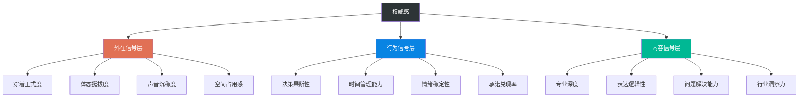
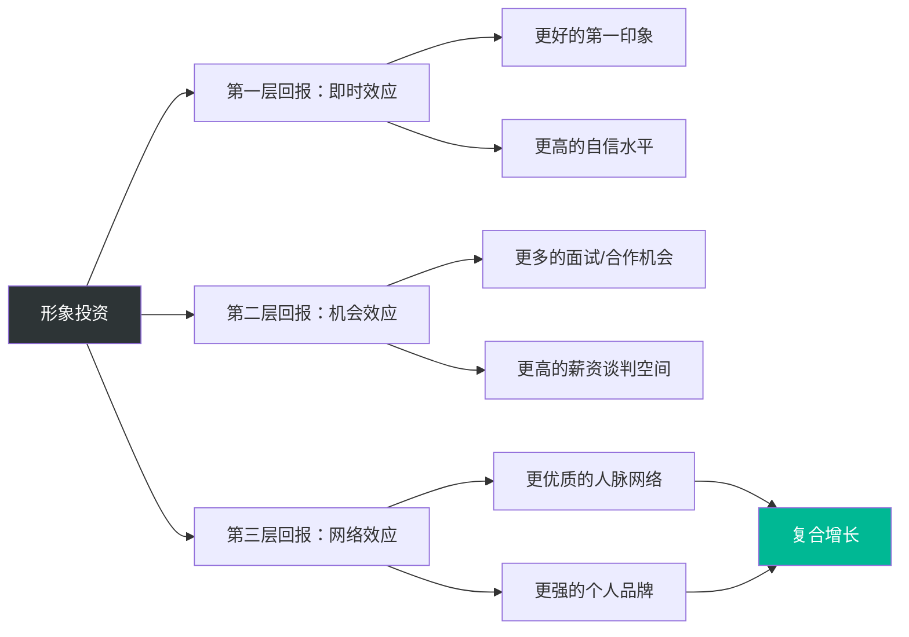

## 第五节 形象与职业发展

### 本节导言

职业发展是一个多维度的竞争过程。在硬技能（学历、证书、技术能力）日趋同质化的今天，形象管理作为一种"软实力"，正在成为职业竞争中越来越重要的差异化因素。本节将从招聘筛选、职场晋升、薪资谈判、行业差异、职业转型、领导力塑造和经济学分析等多个维度，系统剖析形象与职业发展之间的深层关系，并提供可落地的策略框架。

理解一个基本事实：**形象不是能力的替代品，但它是能力被看见、被信任、被选择的放大器。** 一个能力为90分、形象为60分的人，在职业竞争中往往不如一个能力为80分、形象为85分的人。这不是公平与否的问题，而是人类认知机制的客观规律。

---

### 一、形象对职业成功的影响机制

形象对职业成功的影响不是单一维度的，而是一条完整的因果链：**注意力获取 → 信任建立 → 机会分配 → 收益积累**。下面分别拆解每个环节。

#### 1. 招聘中的形象筛选效应

招聘是形象发挥作用的第一个关键场景。大多数人以为招聘是"能力筛选"，但研究表明，它更准确地说是"形象初筛 + 能力验证"的两阶段过程。

**简历照片效应**

在需要附照片的简历中，外貌更具吸引力的候选人获得面试邀请的概率显著更高。德国的一项大规模研究（Ruffle & Shtudiner, 2015）发现，外貌吸引力高的男性简历获得回调率比平均水平高出约19%。更值得注意的是，即使在不要求照片的简历中，名字的"听觉吸引力"也会产生微弱但可测量的影响——名字更容易发音的候选人，获得的面试邀请略多。

这背后的机制是"认知流畅性"（Cognitive Fluency）：大脑倾向于偏好容易处理的信息。一个好发音的名字、一张赏心悦目的照片，都降低了认知处理难度，从而产生了微弱但真实的偏好。

**面试中的首因效应**

普林斯顿大学心理学家亚历山大·托多罗夫的研究发现，人们在看到一张面孔后仅需100毫秒就能做出关于此人是否值得信任、是否有能力的判断。在面试场景中，这意味着面试官在你走进门的前几秒钟内，已经对你形成了一个"锚定印象"。

后续的面试内容，在认知心理学中被称为"确认性信息加工"（Confirmatory Information Processing）——面试官倾向于关注、记住和过度重视那些与初始印象一致的信息，而忽视或低估那些不一致的信息。你的回答、案例、成就，都在这个已被锚定的框架下被解读。

具体而言，以下非语言因素在面试前3分钟内对面试官的判断影响最大：

| 因素 | 影响权重 | 说明 |
|------|---------|------|
| 穿着得体度 | 高 | 不是"穿得贵"，而是"穿得对"——与公司文化和岗位级别匹配 |
| 体态语言 | 高 | 挺拔的站姿、稳健的步伐、有力的握手传递自信和能力信号 |
| 眼神接触 | 中高 | 稳定但不压迫的眼神接触传递自信和真诚 |
| 微笑质量 | 中 | 自然、适度的微笑传递亲和力和情绪稳定性 |
| 声音质量 | 中 | 清晰、稳定的语速和音量传递冷静和专业 |
| 时间管理 | 中 | 准时到达（不早不晚，提前3-5分钟最佳）传递尊重和自律 |

**能力推断偏差（"美即好"效应）**

心理学中的"晕轮效应"（Halo Effect）在招聘中表现为：外貌更具吸引力的候选人会被认为更有能力、更值得信赖、更善于社交——即使这些推断没有实际依据。Dion、Berscheid和Walster在1972年的经典研究中发现，人们会自动将"有吸引力"与"善良、有趣、成功、有社交能力"等正面特质关联。

这种效应的强度因行业而异。在需要大量客户接触的岗位（销售、公关、咨询）中，形象的权重更高；在纯技术岗位（工程师、数据分析师）中，权重相对较低，但仍然存在——技术团队的面试官同样会受到非语言线索的影响，只是他们自己可能没有意识到。

**实操建议：面试形象准备清单**

1. **提前调研着装规范**：查看公司官网、LinkedIn员工照片、Glassdoor评价，判断公司的正式程度。如果没有把握，"比日常着装高半级"是安全策略。
2. **准备"面试战袍"**：选择一套你穿着最自信、最合身的衣服作为面试专用。不要在面试当天尝试新衣服——不熟悉的衣物会增加你的不自然感。
3. **模拟进门30秒**：对着镜子或视频练习进门、微笑、握手、坐下的过程。这30秒的"表演"比你准备的100个面试问题都重要。
4. **控制"紧张微表情"**：面试紧张时，最容易出现的微表情是皱眉、抿嘴、频繁眨眼。提前练习在紧张时保持面部放松。

#### 2. 职场晋升中的形象因素

如果说招聘中的形象是"入场券"，那么晋升中的形象就是"加速器"。

**领导力形象的认知原型**

组织行为学研究表明，人们心中存在一个"领导者原型"（Leader Prototype），这个原型包含一系列外在特征：挺拔的体态、坚定的眼神、沉稳的声音、得体的穿着、自信的步态。当一个人的外在形象与这个原型越吻合，他被识别为"潜在领导者"的概率就越高。

这不是说"长得像领导就能当领导"，而是说：**当你的能力已经达到晋升标准时，形象上的"领导者信号"会显著加速你被决策层注意到的速度。** 反过来，如果你能力很强但形象上不传递"领导者信号"，你可能需要更长时间才能被识别。

Sydney Finkelstein在达特茅斯学院的研究发现，在高管选拔中，"看起来像领导"（looking the part）是影响最终决策的前三大因素之一，仅次于业绩记录和人际网络。

**权威感的三层建构**

权威感不是一个单一维度，而是由三层信号共同建构的：

关键洞察：**外在信号层是"门票"，行为信号层是"基础设施"，内容信号层是"核心竞争力"。** 三层缺一不可，但外在信号层是最容易被忽视的——很多技术能力强、业绩出色的人，因为不重视外在信号层，导致权威感始终建立不起来。

**专业形象与客户信任**

在面向客户的职业中（咨询、销售、金融、法律、医疗等），专业形象是建立客户信任的第一道门槛。Gallup的研究表明，客户对服务提供者的专业能力评价中，约35%来自其外在形象和行为举止，而非实际的服务质量。

具体而言，在B2B场景中，以下形象信号对客户信任的影响最大：

- **穿着与客户正式程度匹配**：比客户穿得稍正式，但不要差距过大。穿三件套去见穿Polo衫的创业公司CEO，反而会制造距离感。
- **材料的精致度**：你递出的名片、展示的PPT、携带的笔记本电脑，都在传递你"对细节的重视程度"。
- **时间管理信号**：准时到达、会议高效、承诺的交付时间精确兑现——这些行为信号比任何穿着都更能建立信任。

#### 3. 薪资谈判中的形象效应

薪资谈判是形象管理回报最直接、最可量化的场景。

**自信形象的议价效应**

哥伦比亚商学院的Adam Galinsky教授的研究发现，在谈判中展现高水平自信的参与者，平均能获得比低自信参与者高出8%-20%的谈判结果。自信形象的核心信号包括：

- **体态**：坐直但放松，占据合理的空间（不要缩成一团，也不要过度后仰）
- **眼神**：稳定、平和的眼神接触，不回避也不压迫
- **声音**：语速适中、音量稳定、句尾不升调（升调暗示不确定和寻求认同）
- **停顿**：在提出数字后保持沉默——沉默传递的是"我的要求是合理的，不需要解释"

**穿着对谈判预期的影响**

当你穿着得体地出现在谈判桌上时，对方会形成两个预期：第一，你有更强的能力；第二，你有更高的底线。这两个预期会直接影响对方的出价策略——他们会倾向于给出更合理的初始报价，而不是试探性的低价。

一项发表在《Journal of Experimental Social Psychology》上的研究发现，穿着西装的谈判者比穿着休闲装的谈判者，在同样的谈判条件下平均多获得11%的收益。这不是因为西装本身有魔力，而是因为西装传递了"我重视这场谈判"和"我有更高的社会地位预期"这两个信号。

**薪资谈判中的形象准备清单**

1. **着装策略**：穿比日常高一级的正式度。如果你日常穿Business Casual，谈判时穿Business Formal。
2. **材料准备**：用精美的文档整理你的业绩数据、市场薪资对比、个人价值主张。材料的质感本身就在传递"我认真对待这件事"。
3. **场景选择**：如果可能，选择在你的"主场"（你的办公室、你熟悉的咖啡厅）进行谈判。环境熟悉感会增强你的自信感。
4. **预演对话**：对着镜子或录视频练习谈判中的关键对话，特别关注声音质量、面部表情和手势。

---

### 二、不同职业阶段的形象策略

职业发展不是一条直线，而是分阶段、有转折的曲线。每个阶段的形象策略都应该服务于该阶段的核心目标。

#### 1. 职业初期（0-3年）：建立"潜力股"形象

**核心目标**：在能力尚未充分展现的阶段，通过形象传递"我有潜力、我可塑、我值得投资"的信号。

**为什么这个阶段的形象策略是"穿高半级"**

"穿高半级"的逻辑不是"装"，而是"信号"。在你还没有足够的业绩和口碑来证明自己的阶段，形象是你为数不多的可控信号之一。研究发现，在职场的前3年，形象管理良好的新人获得高价值项目分配的概率高出约25%。

**具体执行策略**

| 维度 | 具体做法 | 避免 |
|------|---------|------|
| 穿着 | 比同级别同事正式半级，但不超过主管的正式度 | 过于名牌化（给人"不务实"印象）、过于随意 |
| 体态 | 每天花10分钟练习挺拔站立和行走 | 驼背、拖沓的走路方式、频繁低头看手机 |
| 沟通 | 在会议中发言时声音清晰、逻辑简明 | 说得太多（暴露弱点）或完全沉默（缺乏存在感） |
| 行为 | 准时到达、主动承担小事、信守每个承诺 | 过度承诺、回避困难任务、推卸责任 |
| 社交 | 主动与同事和上级建立工作关系 | 过度讨好、卷入办公室政治、过早建立"小圈子" |

**常见错误：用力过猛**

职业初期最常见的形象错误不是"不够好"，而是"过度"。穿得太好显得"不接地气"，表现太积极显得"功利"，社交太主动显得"油滑"。平衡的诀窍是：**在"想要更多"和"尊重现状"之间找到一个合理的中间点。** 具体而言，穿着比同级高半级但不越级，表现积极但不张扬，主动社交但不过度。

#### 2. 职业发展期（3-8年）：建立"专业品牌"形象

**核心目标**：在能力开始得到认可的阶段，通过形象管理将"能力"转化为"品牌"——从"能做事的人"升级为"值得信赖的专家"。

**从"执行者"到"专家"的形象转型**

这个阶段的核心转变是：你不再需要通过形象来"证明自己的潜力"，而是需要通过形象来"强化自己的专业定位"。这意味着你的形象策略应该从"向上兼容"转向"精准定位"。

**具体执行策略**

1. **确立视觉标识**：找到属于你的"视觉签名"——可以是一种标志性的配色方案、一种特定的穿着风格、一种独特的配饰。这种辨识度能帮助你在众多同事中被记住。
2. **建立数字形象**：在LinkedIn、知乎、行业论坛等平台上，建立与你线下形象一致的线上专业形象。内容输出是这个阶段最重要的形象投资之一——写行业文章、分享专业见解、参与行业讨论。
3. **提升"会议存在感"**：在会议中的表现直接影响你的可见度。具体方法包括：提前准备1-2个有深度的观点、在讨论中做结构化总结、在关键决策点明确表达立场。
4. **建立"影响力半径"**：从直接团队扩展到跨部门、跨公司。参加行业会议、加入专业社群、建立外部人脉网络。

**案例：从技术骨干到技术负责人**

张某，28岁，某互联网公司高级工程师。技术能力在团队中排名前三，但在晋升技术负责人时连续两次被跳过。经过形象诊断发现以下问题：穿着过于随意（每天T恤+运动鞋），在跨部门会议中很少主动发言，汇报时习惯性低头看电脑屏幕，与上级的沟通仅限于工作汇报。

调整策略执行6个月后：工作日穿着Smart Casual（衬衫+修身裤+皮鞋），每周至少在跨部门会议上主动发言一次，汇报时改为面对听众+使用翻页笔，每月与上级进行一次非正式的一对一沟通。结果：在下一次晋升周期中顺利晋升为技术负责人。

#### 3. 职业成熟期（8年以上）：建立"领导者"形象

**核心目标**：在职业高度已基本建立的阶段，通过形象管理传递"力量型温暖"——既有权威感，又有亲和力，让下属愿意追随、同级愿意合作、上级愿意授权。

**"力量型温暖"的理论基础**

哈佛商学院Amy Cuddy教授的研究发现，人们在评价他人时有两个基本维度：**温暖（Warmth）** 和 **能力（Competence）**。这两个维度的不同组合会产生截然不同的印象：

| 温暖程度 | 能力程度 | 他人印象 | 职场影响 |
|---------|---------|---------|---------|
| 高 | 高 | 钦佩、信任 | 最理想的领导者形象 |
| 高 | 低 | 怜悯、同情 | 被喜欢但不被尊重 |
| 低 | 高 | 嫉妒、警惕 | 被尊重但不被亲近 |
| 低 | 低 | 轻蔑、忽视 | 最糟糕的形象组合 |

职业成熟期的形象管理，就是要同时提升温暖和能力两个维度，达到"高温暖+高能力"的理想状态。

**"力量型温暖"的平衡方法**

- **权威信号**：挺拔的体态、沉稳的声音、有力的握手、保持适度的眼神接触。在做决策时果断明确，在面对压力时保持冷静。
- **温暖信号**：真诚的微笑、主动倾听的身体语言（微微前倾、点头）、记住团队成员的名字和个人信息、在关键时刻表达关心和支持。
- **平衡原则**：在正式场合（战略会议、客户谈判）侧重权威信号，在非正式场合（团建、一对一沟通）侧重温暖信号。不要在同一场景中快速切换——频繁切换会让人觉得你在"演戏"，而不是真实的。

**从"告诉"到"引导"的沟通转型**

随着职业成熟度的提升，你的沟通风格应该从"指令式"（告诉别人做什么）转向"教练式"（引导别人自己找到答案）。这种转变在形象上表现为：

- 说话时更多使用问题而非陈述："你觉得这个问题的核心是什么？"而非"这个问题的核心是……"
- 给出反馈时使用"三明治结构"：肯定 → 建议 → 鼓励
- 在团队面前展示"适度的脆弱性"——承认自己的不足和犯过的错误，这反而会增强你的领导力（Brené Brown的研究证实了这一点）

**长期个人品牌投资**

职业成熟期的形象管理不再是日常的穿着搭配，而是系统性的个人品牌建设：

1. **行业影响力**：出版专业文章或书籍、在行业会议上做主题演讲、成为行业媒体的评论专家
2. **社会影响力**：参与行业协会、公益组织、导师计划
3. **数字影响力**：维护高质量的LinkedIn主页、定期发布行业洞察、建立个人专业网站

---

### 三、不同行业的形象标准差异

形象管理没有放之四海而皆准的模板。不同行业有完全不同的"形象密码"——在金融行业被视为"得体"的穿着，在科技公司可能被视为"古板"。

#### 1. 金融/法律/咨询行业

**形象基调**：保守、专业、可信赖

这类行业的客户将大量资金和决策权交给你，因此"信任感"是形象的第一优先级。保守的穿着风格传递的信号是："我不会拿你的利益冒险。"

| 要素 | 男性标准 | 女性标准 |
|------|---------|---------|
| 正式会议 | 深色西装+白色/浅蓝衬衫+保守领带 | 套装（裙装或裤装）+浅色衬衫 |
| 日常办公 | 西裤+衬衫（可解开领带） | 优雅的衬衫+西裤/半裙 |
| 配饰 | 经典手表、简洁袖扣 | 简约首饰、低跟皮鞋 |
| 禁忌 | 运动鞋、牛仔裤、夸张配饰 | 过短裙装、浓烈香水、过多露肤 |

#### 2. 科技/互联网行业

**形象基调**：创新、实用、高效

科技行业的形象密码是"把时间花在做事上而不是打扮上"。但这不意味着不注意形象——乔布斯的黑色高领毛衣、扎克伯格的灰色T恤，都是精心设计的"反形象的形象"。

| 要素 | 标准 |
|------|------|
| 日常穿着 | 干净整洁的Smart Casual（衬衫/Polo+休闲裤+干净运动鞋） |
| 重要场合 | 休闲西装+衬衫（不打领带）或高品质针织衫 |
| 配饰 | 实用型手表、简洁背包 |
| 禁忌 | 过于正式的三件套（在技术公司会显得格格不入）、不修边幅 |

#### 3. 创意/设计/媒体行业

**形象基调**：个性、品味、创造力

创意行业的形象本身就是"作品集"的一部分。你的穿着需要展示你的审美品味和设计能力，但要避免"过度表演"——追求个性不等于奇装异服。

#### 4. 教育/医疗/公共服务行业

**形象基调**：亲和、可靠、专业

这类行业的形象需要在"专业可信"和"平易近人"之间找到平衡。过于正式会产生距离感，过于随意会降低专业信任。

#### 5. 跨行业通用原则

无论身处哪个行业，以下三条原则是通用的：

1. **匹配原则**：你的正式程度应该与所在环境的正式程度匹配，可略高半级，但不要差距过大
2. **一致性原则**：周一到周五的形象风格应该保持一致，不要让人觉得你"今天怎么不一样了"
3. **升级原则**：当你准备晋升或跳槽时，提前1-3个月开始调整形象到目标级别的标准

---

### 四、职业转型中的形象重塑

职业转型是形象管理最具挑战性的场景之一。你需要在维持"旧身份"可信度的同时，建立"新身份"的认同感。

#### 1. 转型期的形象挑战

**认知锁定效应**：当你在某个行业或岗位工作多年后，同事和行业圈子里的人对你的认知已经被"锁定"。当你转型时，旧的形象标签会成为新身份的障碍。一个穿了10年西装的银行经理转型做户外教育，如果继续穿着西装去见客户，传递的信号是"我还没有真正转变"。

**信任重建成本**：在新领域，你没有积累的信任资本。你的形象需要更积极地传递"我属于这里"的信号，来弥补信任赤字。

#### 2. 转型期的形象策略

**渐进转换法**

不要一次性彻底改变形象——这会让人觉得你"变了一个人"，反而增加不信任感。正确的方法是渐进转换：

1. **第一阶段（1-2个月）**：在保持基本风格的基础上，加入新领域的元素。例如，从西装改为Smart Casual，增加一些行业标志性的配饰。
2. **第二阶段（3-4个月）**：逐步增加新风格的比重，减少旧风格的比重。开始模仿新领域中受尊重的前辈的穿着风格。
3. **第三阶段（5-6个月）**：完全切换到新领域的形象标准，同时保留一些你个人标志性的元素（一种配色、一个配饰）以保持辨识度。

**身份信号切换**

不同行业有不同的"身份密码"。转型时需要快速学会新行业的视觉语言：

- 从金融到科技：摘掉领带，换上干净的运动鞋，背包从公文包换成双肩包
- 从技术到管理：在Smart Casual的基础上增加衬衫和皮鞋的比例
- 从企业到创业：穿着从"公司标准"切换到"个人标准"，展现你的个性和判断力
- 从线下到线上：数字形象（头像、简介、内容风格）的权重急剧上升

#### 3. 案例分析：跨行业转型的形象调整

**案例：从传统媒体到短视频行业**

王某，32岁，某报社资深记者，转型做短视频内容创业。初期依然保持传统媒体人的形象——衬衫、西裤、公文包——在与MCN机构和品牌方合作时，经常被误认为是"来采访的"而不是"来合作的"。

调整方案：
- 外在：从正装转为有设计感的Smart Casual，佩戴简约但有辨识度的配饰（一顶标志性的棒球帽）
- 行为：在短视频中展现更多个人风格和情感表达，不再用"新闻播报"式的语气
- 数字形象：重新设计个人logo、统一所有平台的视觉风格、制作专业但有个性的个人介绍页

结果：3个月内，品牌方对他的认知从"前记者"转变为"内容创作者"，合作转化率提升约40%。

---

### 五、数字时代的职业形象管理

数字时代从根本上改变了职业形象的管理方式。你的形象不再只是你"本人的样子"，还包括你在互联网上留下的所有痕迹。

#### 1. 线上形象的职业影响力

**搜索引擎就是你的"第二简历"**

根据CareerBuilder的调查，70%的雇主会在做出招聘决定前搜索候选人的社交媒体。其中，57%的雇主表示他们在社交媒体上发现了导致他们"不录用"某候选人的内容。这意味着你的线上形象已经不是一个"加分项"，而是一个"风险项"。

**线上形象的三个特性**

| 特性 | 说明 | 对策 |
|------|------|------|
| 持久性 | 你发布的内容可能被永久保存、截图、转发 | 发布前三问：这是我想让未来雇主/客户看到的吗？ |
| 可搜索性 | 搜索引擎可以聚合你所有平台的内容 | 定期搜索自己的名字，了解"搜索结果中的你"是什么样 |
| 不可控性 | 他人发布关于你的内容你无法完全控制 | 积极创建高质量内容，用正面信息"稀释"潜在的负面信息 |

#### 2. 职业形象的线上管理框架

**四大平台的职业形象策略**

**LinkedIn**

LinkedIn是职业形象的"核心阵地"。优化要点：
- **头像**：使用专业的半身照，背景简洁（纯色或办公室环境），面部清晰、光线充足、微笑自然
- **标题**：不要只写职位名称，写你的"价值主张"。例如，不要写"产品经理"，而是写"帮助B2B企业提升用户留存的产品策略师"
- **经历描述**：每段经历用"动作+结果"的格式，量化你的成就。例如，"主导了XX项目，用户活跃度提升35%"
- **推荐信**：主动请3-5位前同事/上级写推荐信，并为他们写推荐信作为回报
- **内容发布**：每周至少发布1篇与行业相关的观点或文章，保持活跃度

**微信**

微信是中国职场中最重要的"半公开"社交平台。职业形象管理要点：
- **头像**：使用清晰、专业的个人照或有辨识度的个人标识。避免使用动漫头像、风景照、群像（让人不确定哪个是你）
- **朋友圈**：控制发布频率和内容质量。建议的比例是：行业洞察/专业内容（40%）> 生活品味展示（30%）> 转发他人内容（20%）> 个人情绪表达（10%）
- **微信名**：使用真名或真名+职业标识（如"张三｜产品经理"），避免使用非主流昵称
- **群聊行为**：在工作群中保持专业，在行业群中积极分享有价值的内容，在社交群中展现适度的个性

**知乎/行业论坛**

知识分享平台是建立"专业深度"形象的最佳渠道：
- **回答质量**：宁可少答，不要答质量不高的问题。每个回答都应该有结构、有论据、有实操建议
- **专业认证**：完成平台的专业认证（如知乎的身份认证、行业认证）
- **内容风格**：保持客观、专业、有深度的风格，避免情绪化表达和极端观点

**小红书/微博**

这些平台更偏"个人生活展示"，但仍需注意职业形象的一致性：
- 发布的内容应该与你的个人品牌一致
- 如果你的职业需要"创意人设"，可以展现更多个人风格
- 如果你的职业需要"权威人设"，建议减少生活化内容的比例

#### 3. 远程/混合办公时代的形象管理

疫情后的远程办公模式，创造了全新的形象管理场景。

**视频会议形象管理**

视频会议已经成为职场沟通的主要方式之一。在视频会议中，你的形象由以下要素组成：

1. **画面构图**：摄像头应与眼睛平齐或略高，画面上半身为佳（胸部以上）。避免仰拍（显得不专业）或俯拍（显得有压迫感）
2. **背景**：简洁、整洁的背景。可以是书架、纯色墙壁或虚拟背景。避免杂乱的房间、过于个人化的装饰
3. **光线**：面对光源（自然光最佳），避免背光（面部发黑）和顶光（产生阴影）
4. **穿着**：至少上半身保持专业。即使下半身穿休闲裤，上半身也应该穿着得体的衬衫或针织衫
5. **声音**：使用外接麦克风或耳机，确保声音清晰。在不说话时静音

**"Zoom疲劳"与形象管理的平衡**

长时间的视频会议会导致"Zoom疲劳"——一种因为持续看到自己的画面而产生的焦虑和疲惫。应对方法：
- 关闭"自我视图"（Self View），只在开始时检查一下自己的画面即可
- 在会议间隙安排5-10分钟的屏幕休息
- 每天的视频会议时间控制在4小时以内，超过的改为语音或异步文字沟通

---

### 六、领导力形象的深度建构

领导力形象是职业形象的最高形态。它不是简单的"穿得像领导"，而是一种从内到外、从个体到系统的综合能力。

#### 1. 领导力形象的科学模型

**GLOBE研究项目的发现**

GLOBE（Global Leadership and Organizational Behavior Effectiveness）是一项覆盖62个国家的大规模跨文化领导力研究。研究发现，不同文化对"有效领导者"的形象期待有显著差异：

| 文化维度 | 偏好"强势领导"的文化 | 偏好"参与式领导"的文化 |
|---------|-------------------|---------------------|
| 权力距离 | 中国、印度、墨西哥 | 北欧国家、以色列 |
| 形象特征 | 正式、权威、保持距离 | 平等、亲近、随和 |
| 穿着要求 | 更正式 | 更随意 |

这意味着：**没有放之四海而皆准的"领导力形象模板"。** 你需要根据所在的文化环境和组织类型，调整你的领导力形象策略。

**"温暖-能力"矩阵在领导力中的应用**

在团队管理中，温暖和能力的平衡需要根据情境动态调整：

- **危机时刻**：提高能力信号，降低温暖信号。果断决策、快速行动、明确指令。
- **团队建设**：提高温暖信号，保持能力信号。倾听成员的想法、表达关心、给予支持。
- **创新场景**：平等化两种信号。鼓励实验、容忍失败、展示好奇心。
- **绩效评估**：平衡两种信号。给出客观的评价（能力），同时表达对个人成长的关注（温暖）。

#### 2. 领导者的"微表情管理"

领导者的情绪具有"传染性"——心理学中的"情绪传染"（Emotional Contagion）理论指出，人们会自动模仿和同步身边人的情绪状态。领导者作为团队的"情绪中心"，其微表情和情绪表达对团队士气有着不成比例的巨大影响。

**领导者需要管理的关键微表情**

| 场景 | 你的真实感受 | 你应展示的微表情 | 原因 |
|------|------------|----------------|------|
| 听到坏消息 | 震惊/愤怒 | 冷静、专注 | 你的恐慌会迅速传染给整个团队 |
| 团队成员犯错 | 失望/恼火 | 理解、引导 | 公开的失望会摧毁心理安全感 |
| 面对不确定 | 焦虑/迷茫 | 从容、开放 | 团队需要从你这里获得"安全感锚点" |
| 取得成功 | 兴奋/骄傲 | 满意、感恩 | 过度兴奋会显得"没见过世面" |

这不意味着你要"演戏"或"压抑情绪"。正确的方式是：**先在内心处理情绪，再选择合适的方式和时机表达。** 在公开场合保持情绪稳定，在私下场合（一对一、信任的同事）可以更真实地表达感受。

#### 3. 领导力形象的常见陷阱

**陷阱一：距离感过度**

一些领导者误以为"权威=距离"，刻意与团队保持疏远。这在短期内可能增强权威感，但长期会降低团队的信任和忠诚度。研究发现，被认为"过于疏远"的领导者，其团队离职率比平均水平高出约20%。

**修正方法**：在保持专业的同时，适度展示"人性化"的一面——分享一些个人经历、偶尔参与团队的非正式活动、在一对一中表达对成员个人发展的关心。

**陷阱二："好人"陷阱**

与距离感过度相反，一些领导者过度追求"被喜欢"，避免给出负面反馈、不愿做艰难决策、过度迎合团队成员的喜好。这会导致权威感崩塌，团队执行力下降。

**修正方法**：记住一个原则——**"你可以被喜欢，也可以被尊重，但如果两者冲突，选择被尊重。"** 学会用"温暖但坚定"的方式给出负面反馈、做出艰难决策。

**陷阱三：形象固化**

一些领导者在晋升后保持了"执行者"时期的形象，没有随着角色的变化而升级。这会导致"角色错位"——你看起来还像一个"做事的人"而不是"带团队的人"。

**修正方法**：每当你晋升一个层级，都应该花时间研究新层级的"形象密码"，并制定渐进式的形象升级计划。

---

### 七、形象管理的经济学分析

将形象管理纳入"人力资本投资"的框架来分析，能够帮助你更理性地进行形象投资决策。

#### 1. 形象投资的回报率

**"美貌溢价"的经济学研究**

经济学家丹尼尔·哈默梅什（Daniel Hamermesh）在其著作《Beauty Pays》中，基于多个国家的大规模数据分析得出以下结论：

- 外貌吸引力高于平均水平的人，终身收入比平均水平高出约23万美元（美国数据）
- 外貌吸引力低于平均水平的人，终身收入比平均水平低约14万美元
- 这一"美貌溢价"在控制了教育、经验、行业等变量后依然显著

需要强调的是，这里的"外貌吸引力"不仅仅是天生的长相，还包括穿着、体态、表情、气质等可以通过后天管理改善的因素。形象管理的投资，本质上是在提升你的"外貌吸引力"这个可变因素。

**形象投资的复合效应**

形象投资具有"复利效应"——今天的投资不仅产生今天的回报，还会在未来持续产生回报。具体而言：

第一层回报是即时的——你今天穿得更好，今天就会获得更好的反馈。第二层回报是中期的——更好的形象带来更多机会，更多机会带来更好的职业轨迹。第三层回报是长期的——通过形象建立的人脉和个人品牌，会产生指数级的复合增长。

#### 2. 形象投资的成本效益矩阵

不是所有的形象投资都有相同的回报率。以下矩阵帮助你做出更理性的投资决策：

| 投资类别 | 成本 | 回报速度 | 回报幅度 | 适用人群 |
|---------|------|---------|---------|---------|
| 体态矫正 | 低（每天10分钟） | 快（1-2周） | 高 | 所有人 |
| 微笑和眼神管理 | 零 | 快（即时） | 中高 | 所有人 |
| 基础社交礼仪 | 低（学习1-2天） | 快（即时） | 中 | 所有人 |
| 头像/社交媒体优化 | 低（1小时） | 快（即时） | 中高 | 所有人 |
| 基础款衣橱建设 | 中（一次性） | 快（即时） | 中 | 所有人 |
| 发型和护肤 | 中（持续） | 中（1-3个月） | 中 | 所有人 |
| 沟通能力培训 | 中（系统学习） | 中（1-3个月） | 高 | 需要大量沟通的岗位 |
| 专业形象咨询 | 高 | 快（即时） | 高 | 中高层管理者、客户型岗位 |
| 领导力培训 | 高 | 慢（3-6个月） | 高 | 管理者、创业者 |

**投资优先级建议**

如果你的预算有限，按以下优先级投资：
1. **第一优先级（零/低成本，高回报）**：体态矫正、微笑管理、社交媒体头像优化
2. **第二优先级（中等成本，高回报）**：基础款衣橱建设（"胶囊衣橱"策略——用15-20件百搭单品覆盖所有场景）
3. **第三优先级（视情况投资）**：沟通能力培训、专业形象咨询

#### 3. 形象管理的机会成本

**不投资形象的真实成本**

形象管理的机会成本是一个经常被忽视但影响巨大的因素。不进行形象管理的成本包括：

1. **隐性收入损失**：根据哈默梅什的研究，外貌吸引力低于平均水平的人，终身收入损失约14万美元。即使只考虑穿着和体态等可改善因素，损失也在数万美元的量级。
2. **机会流失成本**：因形象不佳而错失的面试、晋升、合作机会。这些机会的价值往往远超形象投资的成本。
3. **社交效率成本**：形象不一致或不得体，会增加社交中的"摩擦成本"——你需要花更多的时间和精力来建立信任和好感。
4. **心理成本**：对自身形象的不满和焦虑，会消耗认知资源，降低工作表现和生活质量。

**"形象ROI"计算框架**

简单的形象投资ROI计算方法：

形象投资ROI = (因形象改善带来的预期收益 - 形象投资成本) / 形象投资成本 × 100%

其中：
- **预期收益** = 薪资增长 + 机会增量价值 + 社交效率提升价值 + 心理健康价值
- **形象投资成本** = 物质投入 + 时间投入（折算为机会成本）

举例：如果你每月投入500元在服装和个人护理上，投入30分钟/天在体态训练上，通过形象改善在一年内获得了一次薪资涨幅10%的机会（假设月薪2万），那么你的年化形象投资ROI约为：(2000×12 - 500×12) / (500×12) × 100% = 200%。这还没有计算机会扩展、社交资本增加等间接收益。

---

### 八、形象管理的常见误区与纠正

#### 误区一："能力够强就不需要形象管理"

**现实**：能力是基础，但能力需要通过形象被"看见"和"信任"。很多技术大牛因为在形象管理上的忽视，导致其能力的"可见度"远低于实际水平。在硅谷，有一个讽刺性的说法："The best engineer is not the one who writes the best code, but the one whose code gets noticed."（最好的工程师不是写最好代码的人，而是代码被注意到的人。）

**纠正方法**：将形象管理视为"能力的包装和传递机制"。你的能力是"产品"，你的形象是"包装"——好的包装不是为了掩盖劣质产品，而是为了让更多人发现和信任好产品。

#### 误区二："形象管理就是穿名牌"

**现实**：形象管理的核心是"得体"，而不是"昂贵"。穿一件500元但合身的衬衫，效果远好于穿一件5000元但不合身的大牌。研究表明，穿着对印象的影响中，"合身度"和"整洁度"的权重远高于"品牌"和"价格"。

**纠正方法**：投资于"适合自己"而不是"贵的"。找到适合你体型、肤色、气质的穿着风格，比盲目追求品牌重要100倍。

#### 误区三："形象管理是一次性的"

**现实**：形象管理是一个持续的过程，不是一次性的"改造"。你的体型会变化，职业阶段会变化，行业趋势会变化，你的形象也需要相应调整。

**纠正方法**：建立"形象维护习惯"——每季度审视一次自己的形象策略，每年做一次全面的形象评估和调整。

#### 误区四："数字形象不重要"

**现实**：在数字时代，你的线上形象可能是别人对你的"第一印象"。很多雇主、客户、合作伙伴在第一次接触你之前，已经通过搜索引擎和社交媒体对你形成了初步判断。

**纠正方法**：定期搜索自己的名字，了解"搜索结果中的你"是什么形象。主动创建高质量的数字内容来塑造你希望被看到的形象。

#### 误区五："领导力形象就是强势和权威"

**现实**：最有效的领导力形象是"力量型温暖"——既有权威感，又有亲和力。只追求强势和权威，会让下属敬而远之，降低团队的创新力和忠诚度。

**纠正方法**：有意识地练习"温暖信号"——真诚的微笑、主动倾听、表达关心、适度展示脆弱性。

---

### 本节核心要点回顾

1. **形象是能力的放大器**：它不是能力的替代品，但它是能力被看见、被信任、被选择的关键因素
2. **形象管理要分阶段**：职业初期建"潜力股"形象，发展期建"专业品牌"形象，成熟期建"领导者"形象
3. **行业差异很大**：金融行业的"得体"和科技行业的"得体"完全不同，必须匹配行业密码
4. **数字形象不可忽视**：70%的雇主会搜索候选人社交媒体，线上形象已经是"第二简历"
5. **领导力形象是"力量型温暖"**：权威感和亲和力缺一不可，平衡是关键
6. **形象投资有高ROI**：低成本的形象投入（体态、微笑、穿着合身）往往有最高的回报率
7. **持续维护比一次改造重要**：形象管理是习惯，不是事件

***
