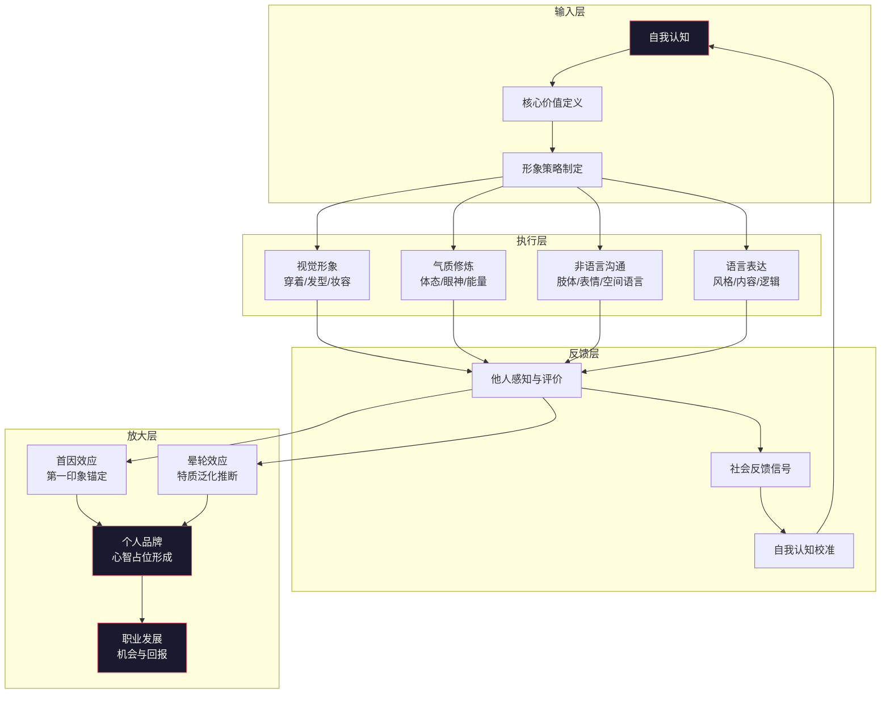
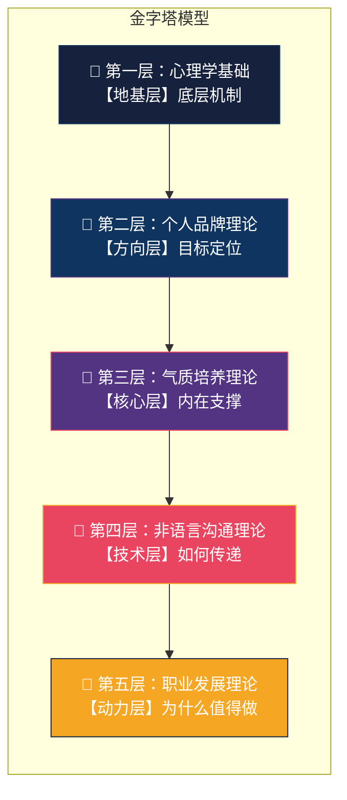
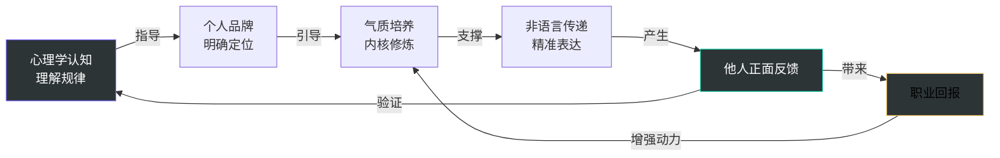
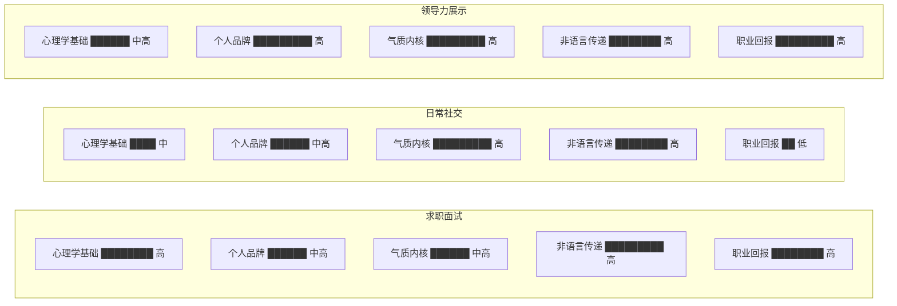

## 理论整合：形象管理的系统观

前五节分别从心理学基础、个人品牌、气质培养、非语言沟通、职业发展五个维度解构了形象管理的理论基础。但现实中，这五个维度从来不是独立运作的——它们构成一个相互耦合、彼此增强的动态系统。本节将这五条理论线索编织成统一的系统框架，帮助你建立"整体大于部分之和"的形象管理认知。

### 一、为什么需要系统观

#### 1. 碎片化理论的困境

很多人学了不少形象管理知识，却依然在实践中感到困惑：

- 买了很多"高级感"单品，穿上后却总觉得哪里不对
- 知道第一印象重要，但不确定该优先优化哪个方面
- 在不同场合切换风格时失去了个人辨识度
- 投入大量时间在外表上，职场发展却没有明显改善

这些问题的根源在于**缺乏系统观**——把形象管理当作一系列独立技巧的拼凑，而非一个有机运作的整体系统。

#### 2. 系统思维的核心要义

系统论的创始人贝塔朗菲（Ludwig von Bertalanffy）指出：**系统的整体行为不能通过分析各部分的独立行为来预测，因为系统的关键特征来自于各部分之间的相互关系。** 这一原理直接适用于形象管理：

一个人的形象不是"衣服好看 + 表情自然 + 说话得体"的简单相加，而是一个由内在认知、外在表达、环境反馈构成的闭环系统。只有理解这个系统的运作机制，才能做到"牵一发而动全身"的高效管理。

### 二、五维理论的系统架构

将前五节的理论整合，可以构建出形象管理的**五维金字塔模型**：

#### 1. 地基层：心理学基础——理解"为什么有效"

心理学理论（首因效应、晕轮效应、认知偏差等）回答的核心问题是：**形象管理为什么能起作用？** 它揭示的是人类认知的底层运作机制——这些机制不以个人意志为转移，是客观存在的心理规律。

地基层的功能是**建立认知框架**：
- 首因效应告诉你：前7秒的视觉印象是"认知锚点"，会框定后续所有信息的解读方向
- 晕轮效应告诉你：一个突出的正面特征会辐射到对其他特征的评价上
- 认知捷径理论告诉你：大脑默认用最少信息做最多推断，你的形象就是别人推断的起点

**没有地基层，其他四层就失去了科学支撑。** 你可能知道"穿得体面很重要"，但不知道为什么重要，也就不知道该如何有策略地分配精力。

#### 2. 方向层：个人品牌理论——明确"要去哪里"

个人品牌理论回答的核心问题是：**我的形象应该指向什么目标？** 它提供的是方向感和目标感——在无限多的形象可能性中，找到属于你的"北极星"。

方向层的功能是**设定目标锚点**：
- 核心价值定义了"你想代表什么"——这是所有形象决策的判断基准
- 差异化定位解决了"跟别人有什么不同"——避免沦为面目模糊的平均值
- 一致性原则解决了"怎样被稳定记住"——品牌的核心是可预期性

**没有方向层，你就只是一个"好看的路人"，而不是一个有辨识度的个人品牌。** 很多人的形象管理停留在"买好看的衣服"层面，根本原因就是缺乏品牌方向。

#### 3. 核心层：气质培养理论——夯实"内核是什么"

气质培养理论回答的核心问题是：**什么样的内在状态能支撑外在形象？** 它解决的是"有形无神"的根本困境——穿着再精致，如果体态僵硬、眼神游离、气场虚弱，形象依然是破碎的。

核心层的功能是**提供内在支撑**：
- 镜像神经元理论解释了气质如何"感染"他人——你的真实内在状态会通过微表情、肌肉张力、呼吸节奏等无意识信号传递出去
- 具身认知理论揭示了身心的双向通道——挺拔的体态可以反向激活自信的心理状态
- 六维气质模型（从容感、力量感、温暖感、知性感、品味感、独特感）提供了具体的能力开发方向

**没有核心层，形象就只是"壳"，经不起近距离和长时间的检验。** 这就是为什么有些人照片好看、见面却让人失望——照片可以修，气质修不了。

#### 4. 技术层：非语言沟通理论——掌握"怎么传递"

非语言沟通理论回答的核心问题是：**如何将内在品质有效传递给他人？** 它提供的是"传递技术"——不是你觉得自己如何，而是别人感受到你如何。

技术层的功能是**实现精准传递**：
- 梅拉比安法则量化了信息传递的通道权重——55%视觉 + 38%声音 + 7%语言内容
- 肢体语言分类提供了可观察、可训练的行为变量——姿态、手势、眼神、空间距离
- 微表情和声音控制提供了精细调节的切入点

**没有技术层，你的内在优势可能无法被他人感知。** 很多内秀的人在社交中吃亏，不是因为他们不够好，而是因为不善于用非语言手段"广播"自己的好。

#### 5. 动力层：职业发展理论——回答"为什么值得投入"

职业发展理论回答的核心问题是：**形象管理的投入产出比是多少？** 它提供了经济学视角的理性论证——形象管理不是"虚荣消费"，而是有明确回报的"自我投资"。

动力层的功能是**提供持续动力**：
- 薪酬数据证明了形象的经济价值——形象更专业的求职者起薪平均高出8-12%
- 晋升研究揭示了形象在领导力评估中的隐性权重
- 社交资本理论论证了形象对人脉网络质量的影响

**没有动力层，你会在遇到困难时放弃——觉得"花这些功夫不值得"。** 只有清楚地知道回报在哪里，才能在日常中坚持投入。

### 三、五维之间的耦合关系

金字塔模型给出了层级结构，但五个维度之间并非简单的自下而上的线性关系。它们之间存在复杂的**双向耦合**——每一层都会影响其他四层，形成一个动态平衡的系统。

#### 1. 正向增强回路

当五维协调运作时，会形成自我强化的正向循环：

**增强回路的运作示例**：

当你理解了晕轮效应的心理机制（心理学基础），你就会有策略地确定自己的核心形象标签（个人品牌），比如"专业+亲和"。围绕这个定位，你开始修炼与之匹配的从容气质和温暖表达（气质培养），并通过体态训练、眼神管理、声音控制等技术手段将其外化（非语言沟通）。当他人接收到这些一致的信号后，会形成"这个人既专业又亲切"的认知（首因效应 + 晕轮效应），进而愿意与你合作、向你推荐机会（职业发展）。这些正向反馈又会增强你的自信心，让气质更加自然（气质培养），形成"做得好→得到好反馈→做得更好"的增强螺旋。

#### 2. 负向衰减回路

当某一维度出现短板时，会引发连锁衰减：

| 短板维度 | 衰减路径 | 典型表现 |
|---------|---------|---------|
| 心理学认知缺失 | 不理解规律 → 盲目尝试 → 收效甚微 → 放弃 | "形象管理是虚荣"的认知误区 |
| 个人品牌模糊 | 没有方向 → 风格混乱 → 无法形成辨识度 → 被忽视 | 今天文艺明天商务，让人摸不着头脑 |
| 气质内核空虚 | 有形无神 → 空洞感 → 被识破"装" → 信任崩塌 | 穿着精致但一开口就露怯 |
| 非语言传递低效 | 内秀不出 → 被低估 → 机会流失 → 沮丧 | 很有能力但面试总是不过 |
| 职业动力不足 | 不愿投入 → 形象平庸 → 机会少 → 更不愿投入 | "反正我靠实力说话"的自我安慰 |

#### 3. 关键耦合节点

在五个维度的交互中，存在三个**关键耦合节点**——这些节点是多条反馈路径的交汇点，对系统整体影响最大：

**节点一：气质 × 非语言的"真实性阈值"**

气质培养提供内在状态，非语言沟通提供外在表达。二者的交汇点是**真实性**——当外在表达与内在状态一致时，传递出的信号是"真实的"，会被信任；当二者不一致时，传递出的信号是"做作的"，会触发防御。

心理学研究中有一个重要发现：人类大脑的眶额皮层（Orbitofrontal Cortex）能够自动检测表情与情境的不匹配。即使你笑得很灿烂，但如果眼神中没有对应的温度，观察者的大脑会在无意识层面标记为"假笑"。这就是为什么"表演型"的形象管理效果有限——你可以控制嘴角的弧度，但无法控制12块眼轮匝肌的微妙收缩。

**实操启示**：形象管理的最高境界不是"表演你不是的样子"，而是"放大你真实拥有的优势"。先修炼内在，再优化外在，顺序不能颠倒。

**节点二：品牌 × 反馈的"认知校准环"**

个人品牌提供目标形象，社会反馈提供现实信号。二者的交汇点是**校准**——你的自我认知（我想成为什么）和社会认知（别人认为你是什么）之间的差距。

当两个认知一致时，系统处于"稳态"，形象管理效率最高。当二者出现偏差时，需要做出调整：

- 自我认知 > 社会认知：你对自己的评价高于外界对你的评价。说明"表达"环节出了问题——你的好没有被传递出来。解决方案：强化非语言沟通技术和个人品牌的可见度。
- 社会认知 > 自我认知：外界对你的评价高于你的自我评价。说明你可能低估了自己，或者存在"冒名顶替综合征"（Impostor Syndrome）。解决方案：更新自我认知，同时确保能持续兑现外界期待。

**节点三：心理学 × 职业的"杠杆效应"**

心理学规律和职业回报的交汇点是**杠杆**——理解心理规律越多，同样的形象投入能撬动更大的职业回报。

举例：如果不懂首因效应，你可能在每次面试前花1小时准备内容、5分钟准备外表。但如果你理解了"前7秒视觉锚定"的机制，就会把准备时间重新分配——20分钟优化外表（建立正面锚点），40分钟准备内容（在正面框架下强化印象）。同样的时间投入，效果可能翻倍。

### 四、系统观的实践应用框架

理解了系统架构后，如何将其转化为日常可执行的行动？

#### 1. 五维自评诊断

在开始任何形象优化之前，先对五个维度进行自评：

| 诊断维度 | 自评问题 | 评分标准(1-5) |
|---------|---------|-------------|
| 心理学认知 | 我是否清楚首因效应、晕轮效应等核心概念及其运作机制？ | 1=完全不了解；5=能灵活应用 |
| 个人品牌 | 我能否用一句话说清"我希望别人如何看待我"？ | 1=完全没有概念；5=有清晰的品牌定位且得到外界验证 |
| 气质内核 | 在重要场合中，我是真实的自我呈现还是在"表演"？ | 1=完全在演；5=内外完全一致 |
| 非语言传递 | 录一段自我介绍视频，我看起来/听起来如何？ | 1=僵硬不自然；5=自信从容有感染力 |
| 职业回报 | 我的形象是否在为我的职业目标加分？ | 1=完全没有意识；5=形象与职业高度协同 |

**关键原则**：优先补齐短板维度。根据"木桶效应"，系统的整体水平受限于最短板。一个气质很好但穿着邋遢的人，和一个穿着精致但气质虚弱的人，面临的困境本质相同——系统中存在短板，拖累了整体效能。

但这里有一个重要的修正：**并不是所有短板都值得立刻补齐**。应该优先修复"耦合节点"相关的短板——即气质与非语言传递的真实性问题、品牌定位与社会反馈的校准问题。这些节点上的短板对系统伤害最大。

#### 2. 场景区分策略

形象管理系统并非在所有场景下都以相同方式运作。不同场景对五个维度的权重需求不同：

**求职面试场景**：心理学基础（尤其是首因效应的时间窗口控制）和非语言传递是权重最高的维度。面试官在前7秒就形成了初步判断，后续30分钟的面试内容更多是在"确认"而非"修正"这个判断。所以，面试前的形象准备应该占据不低于30%的总准备时间。

**日常社交场景**：气质内核的权重最高。因为社交是长时间、近距离的互动，"表演"无法持续，真实的气质状态会被充分暴露。在社交场景中，与其花精力在穿搭上，不如花在让自己真正放松、愉悦、有能量上。

**领导力展示场景**：五个维度全部拉满。领导力场景对形象的要求最全面——既需要通过心理学规律建立权威（首因效应），又需要清晰的品牌辨识度（个人品牌），还需要真实的内在力量（气质），以及精准的表达（非语言沟通），最终转化为团队的追随和组织的认可（职业发展）。

#### 3. 时间维度的阶段性策略

形象管理系统的构建不是一次性工程，而是分阶段推进的长期过程：

**第一阶段：认知建设期（1-2周）**

目标：理解系统全貌，完成自评诊断。

核心行动：
- 系统学习前五节的理论知识，建立完整的认知框架
- 完成五维自评诊断，识别最短板和次短板
- 确定自己的个人品牌方向（用"我希望别人在背后这样形容我"来定义）

**第二阶段：基础搭建期（1-3个月）**

目标：补齐关键短板，建立基本盘。

核心行动：
- 如果最短板是"非语言传递"：从体态训练开始（每天5分钟靠墙站立），同时录视频回看自己的表情和手势
- 如果最短板是"气质内核"：开始规律运动（每周3次，每次30分钟），练习正念冥想（每天10分钟），培养一个能带来"知性感"的爱好
- 如果最短板是"个人品牌"：做一次完整的"形象审计"——收集5-10个了解你的人对你的三个关键词描述，对比自我定位

**第三阶段：整合优化期（3-6个月）**

目标：让五个维度开始协同运作，形成正向循环。

核心行动：
- 根据品牌定位建立标准化的"场合着装矩阵"——工作日、商务社交、休闲社交各2-3套搭配
- 每月做一次"形象复盘"——记录本月收到的形象相关反馈（正面和负面），分析系统中哪个维度在起作用
- 开始在不同场合之间建立"一致性锚点"——比如同一个发型、同一种配色倾向、同一种表达风格

**第四阶段：动态维护期（6个月以后）**

目标：维持系统稳态，适应环境变化。

核心行动：
- 每季度审视个人品牌是否需要随职业阶段变化而调整
- 关注新的心理学研究成果，更新自己的认知工具箱
- 当进入新的社交圈或职业环境时，重新进行一轮五维诊断

#### 4. 常见系统故障与修复

在实践中，形象管理系统可能出现以下典型故障：

**故障一：维度分裂**

症状：不同场景下的形象差异过大，让人觉得"这不是同一个人"。比如朋友圈里是文艺青年，工作中是严肃干部，相亲时是阳光男孩。

诊断：个人品牌维度出了问题——缺乏核心一致性。

修复方案：从五个维度中选出2-3个"不变量"（比如：整洁、温和、有逻辑），确保在任何场景下都保留这些不变量。场景差异只能体现在"变量"上（比如：正式场合穿西装但保持温和语气，休闲场合穿T恤但保持整洁感）。

**故障二：表演疲劳**

症状：形象管理坚持了一段时间后感到精疲力竭，开始"摆烂"。每周总有那么一两天完全不想维持形象标准。

诊断：气质内核和外在表达之间存在过大落差——一直在"演"，而不是"呈现"。

修复方案：降低外在表演的幅度，把精力转投到内核修炼上。一个实用的检验标准是：如果你不能在最差的状态下（疲惫、压力大、情绪低落）也保持某个形象习惯，那这个习惯就需要被替换成一个更贴合你真实状态的版本。比如，如果你坚持不了每天精致的妆容，那就把目标调整为"干净清爽的素颜+一支提气色的唇膏"——这比"精致妆容三天、邋遢两天"的模式要好得多。

**故障三：过度优化**

症状：过于关注形象管理的每个细节，导致决策疲劳。出门前花30分钟选衣服，在镜子前反复调整，在社交场合中持续监控自己的表情和姿态。

诊断：心理学认知维度出了问题——把"完美形象"当成了目标，而非"有效形象"。

修复方案：记住一个关键心理学原理——**聚光灯效应（Spotlight Effect）**。康奈尔大学的吉洛维奇（Thomas Gilovich）研究发现，人们会显著高估别人对自己的关注度。你以为所有人都在看你的穿搭细节，实际上大多数人的注意力根本不在你身上。把标准从"完美"调整为"得体"——够用就好，把省下来的认知精力用在真正有价值的事情上。

**故障四：反馈断路**

症状：不知道自己的形象管理有没有效果，因为从来没有收到过明确的反馈。

诊断：非语言沟通和社交互动层面的信息传递效率低。

修复方案：建立"反馈收集"机制。最简单的方法是找3-5个你信任的朋友，直接问他们："用三个关键词形容你对我的印象。"如果得到的关键词和你的品牌目标一致，说明系统在正常运作；如果不一致，就需要找到偏差来自哪个维度。另外，注意观察社交中的间接反馈——人们是否主动跟你打招呼？是否愿意跟你分享信息？是否在你面前表现得放松？这些都是形象效果的信号。

### 五、系统观的深层原理

#### 1. 涌现性：形象不是各部分的简单相加

系统论中有一个重要概念叫**涌现性（Emergence）**——系统整体表现出的特性，不能从各部分的特性中推导出来。形象管理中的"气质"就是一个典型的涌现属性。

你无法通过把"好看的五官 + 得体的衣服 + 自然的微笑 + 好听的声音"简单相加来获得"气质"。气质是这些要素在特定的内在状态下**涌现**出来的整体效果。这解释了为什么有些人的每个单点都不出色，但组合在一起却让人感到很有魅力——因为他们的系统在正确的位置上产生了涌现。

**实践启示**：不要试图逐项优化每一个细节。先确保系统的"架构"正确——内在状态、外在表达、品牌方向三者一致——然后让涌现自然发生。这比花大量时间在每一项上精雕细琢更有效。

#### 2. 鲁棒性：系统比单点更抗风险

一个由五维协调支撑的形象系统，比仅依赖单一维度的形象更具有**鲁棒性（Robustness）**——即面对干扰时的恢复能力。

举个例子：一个只靠"穿着好看"来建立形象的人，一旦遇到不能穿自己风格衣服的场合（比如穿制服的工作环境），形象就会崩塌。但一个由气质、非语言沟通、个人品牌、心理认知共同支撑的人，即使换了衣服，内在的从容感、自信的体态、清晰的表达依然存在——系统自动从其他维度补偿了"视觉形象"维度的损失。

**实践启示**：不要把所有鸡蛋放在一个篮子里。如果你的形象管理90%的精力都花在穿搭上，那你的系统是非常脆弱的。理想的精力分配是——每个维度至少投入10%-25%的精力。

#### 3. 非线性：投入与回报不成正比

形象管理系统的回报不是线性的。前20%的投入可能带来80%的效果（帕累托法则），而最后20%的效果可能需要80%的投入。

**高杠杆投入**（前20%精力，覆盖80%效果）：
- 理解首因效应和晕轮效应的核心机制（1小时阅读）
- 确定2-3个核心品牌标签（1次深度自我反思）
- 修正最明显的体态问题（靠墙站立训练，每天5分钟，持续2周）
- 建立3套标准化搭配（1个周末的集中采购和试穿）

**低杠杆投入**（后80%精力，争取剩余20%效果）：
- 追逐每一个穿搭热点和流行趋势
- 对每一个微表情和手势进行精细调控
- 追求零瑕疵的完美妆容
- 在已经足够得体的着装上继续升级面料和品牌

**实践启示**：先做高杠杆的事。如果你现在对形象管理完全没有概念，只需要做到"理解首因效应 + 确定品牌标签 + 穿整洁合身的衣服 + 保持挺拔的体态"，就已经超越了80%的人。细节的精进可以留到后面慢慢来。

#### 4. 路径依赖：早期选择影响后期方向

形象管理系统具有**路径依赖性（Path Dependence）**——你早期做出的形象选择，会塑造他人对你的稳定预期，进而限制你后续的选择空间。

如果你在入职第一天就展示了"严谨专业"的形象，那么之后你穿休闲装上班时，同事会感到不适——不是因为休闲装本身有问题，而是因为你打破了已经建立的预期。反过来，如果你一开始就建立了"随性亲和"的形象，之后突然穿正装也会让人感到奇怪。

**实践启示**：在建立形象的早期阶段，宁可"保守"也不要"随意"。因为从高往低调（从正式到休闲）比从低往高调（从随意到正式）容易得多。一个一直穿得体面的人偶尔穿一次T恤，大家会觉得"他今天放松了"；一个一直穿T恤的人突然穿西装，大家会觉得"他今天出什么事了"。

### 六、整合模型的自检清单

将系统观内化后，可以用以下清单进行日常自检：

【形象管理系统自检清单】

□ 定位清晰度：我能否用一句话说清"我是谁，我希望被如何看待"？
□ 内外一致性：我今天的穿着打扮，是否真实反映了我的内在状态？
□ 多场景一致性：我在不同场合的形象中，是否保留了2-3个不变的辨识元素？
□ 非语言效率：我的体态、表情、声音，是否在传递我想要传递的信号？
□ 反馈对齐度：最近一周收到的社会反馈，是否与我的品牌目标一致？
□ 系统均衡性：我是否在五个维度上都有投入，而非只在单一维度上堆资源？
□ 成本效益比：我当前的形象投入，是否在高杠杆区间（前20%精力）内？
□ 路径一致性：我最近的形象变化，是否与已建立的品牌预期兼容？

建议每周花5分钟过一遍这个清单。不需要每一项都满分，但要确保没有任何一项长期处于"0分"状态。

### 七、从理论到实践的桥梁

本节完成了"基础理论"部分的整合。五个理论维度——心理学基础、个人品牌、气质培养、非语言沟通、职业发展——不是五个独立的"知识点"，而是一个统一系统的五个"切面"。

真正掌握形象管理，不是"知道"这五个理论，而是能在日常中让它们协同运作：

- 当你在镜子前纠结穿什么时，你能想到"这件衣服是否符合我的品牌定位"
- 当你在社交场合感到紧张时，你能想到"调整体态可以反向影响心理状态"
- 当你收到负面反馈时，你能分析"是哪个维度出了问题"
- 当你决定投入精力提升形象时，你知道"优先做高杠杆的事"

这就是系统观的价值——**它不教你某一个具体的技巧，而是教你如何让所有技巧协同工作。** 正如建筑大师密斯·凡·德·罗所说："上帝在细节中。"但前提是，你得先有一张正确的蓝图。

***

*下一节：[具体方案](02-具体方案.md)*
