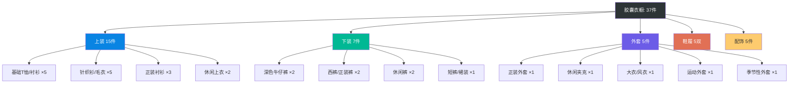
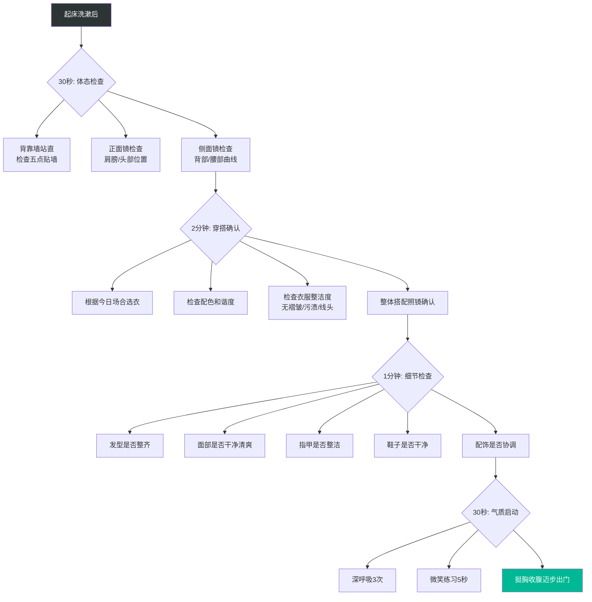

## 第三节 推荐工具与资源

形象管理是一项需要"认知+工具+习惯"三位一体支撑的能力。前两节推荐的书籍和课程解决的是"认知"问题——让你知道为什么要管理形象、管理什么、怎么管理。而本节要解决的是"工具"问题——在你已经具备认知之后，有哪些现成的工具可以大幅降低执行成本、提升管理效率。

工具的选择逻辑很简单：**好的工具应该让正确的行为变得更容易。** 如果你需要靠意志力来坚持形象管理，那说明工具链没有搭建好。本节将从色彩工具、身材与体态工具、衣橱管理工具、线上形象工具、习惯养成工具、专业测试与评估工具六个维度，为你构建一套完整的形象管理工具体系。

### 一、色彩搭配与诊断工具

色彩是形象管理中最容易"立竿见影"的杠杆。美国色彩研究所的研究表明，色彩占第一印象权重的60%-70%。穿对颜色能让人看起来更有气色、更专业、更值得信赖；穿错颜色则会显得憔悴、廉价或不合时宜。因此，色彩工具是形象管理工具箱中最优先需要配置的。

#### 1. 专业色彩诊断工具

**Color Me Beautiful 色卡系统**

这是全球最权威的个人色彩诊断体系之一，将人的肤色、发色、瞳孔色等特征归类为"春、夏、秋、冬"四个季节型，每个季节型对应一组最适合的色彩组合。

| 季节型 | 肤色特征 | 发色特征 | 最适合的色彩群 | 应避免的色彩 |
|--------|---------|---------|--------------|------------|
| 春季型 | 象牙白、蜜桃色，带暖调金底 | 浅棕至中棕，有光泽 | 珊瑚红、鹅黄、浅绿、暖粉、象牙白 | 深紫、黑色、灰蓝等冷暗色 |
| 夏季型 | 粉白、米色，带冷调蓝底 | 灰棕至深棕，哑光质感 | 薰衣草紫、玫瑰粉、灰蓝、柔白 | 橙色、明黄、深棕等暖亮色 |
| 秋季型 | 金黄、深蜜色，带暖调铜底 | 深棕至红棕，铜质光泽 | 铁锈红、芥末黄、橄榄绿、驼色 | 冰蓝、亮粉、纯白等冷亮色 |
| 冬季型 | 瓷白、橄榄色，带冷调对比 | 深黑至深棕，高对比度 | 正红、宝蓝、翠绿、纯白、黑色 | 驼色、橙色、米黄等暖浊色 |

**如何获取个人色卡：**

- **专业色彩诊断师**：最准确的方式。通过线下1对1诊断，用专业色布在自然光下对比测试，诊断师会给出详细的季节型分析和色彩推荐报告。国内主要城市都有认证色彩诊断师，费用一般在500-2000元/次。选择时认准AICI（国际形象顾问协会）或CMB（Color Me Beautiful）认证的诊断师。
- **线上色彩诊断工具**：成本更低。例如 Dressika APP 和 Colorwise.me，通过上传素颜自然光照片进行AI分析。准确率不如线下诊断，但作为初步筛选已经足够。Dressika 的准确率在自测中约为70%-80%，可以作为起点。
- **自测方法**：准备金色和银色的布料或首饰，分别贴近脸部观察——如果金色让你看起来更和谐，你偏向暖色调（春季/秋季）；如果银色更和谐，你偏向冷色调（夏季/冬季）。然后用亮色布和暗色布区分明暗——亮色和谐的是春季/冬季，暗色和谐的是秋季/夏季。

#### 2. 色彩搭配与配色工具

当你确定了自己的季节型之后，日常搭配还需要具体的配色方案。以下工具可以帮助你快速找到和谐的配色组合：

**Adobe Color**（color.adobe.com）

Adobe 出品的免费在线配色工具，支持五种配色规则：
- **互补色**：色轮上对立的两种颜色，对比强烈，适合需要醒目效果的场合
- **类似色**：色轮上相邻的颜色，和谐自然，适合日常搭配
- **三色组**：色轮上等距的三种颜色，丰富但不杂乱
- **分裂互补**：一种颜色与其互补色两侧的颜色，既有对比又不会过于生硬
- **自定义**：手动在色轮上选取颜色

**使用技巧**：将你常穿的颜色输入 Adobe Color，用"类似色"规则生成配色方案，保存为你的个人配色库。这样在每天选衣服时就有了参考依据。

**Coolors**（coolors.co）

快速生成配色方案的工具，按空格键即可随机生成一组和谐的五色配色方案。特点是速度快、操作简单，适合在灵感枯闷时快速获取配色思路。支持锁定喜欢的颜色后继续生成其他配色，逐步构建你的个人色板。

**中国色彩辞典/色卡**

对于中文用户，理解中国传统色彩对日常搭配有独特价值。中国色彩命名体系注重意境和文化联想，比如"月白"并非纯白而是略带蓝调的白，"黛色"是一种深灰带蓝的色调。推荐资源：
- **《中国传统色：故宫里的色彩美学》**（郭浩著）：系统收录了384种中国传统色彩，每种色彩都有详细的色值、文化出处和应用场景
- **Nippon Colors**（nipponcolors.com）：日本传统色彩网站，与中国传统色彩体系有相通之处，提供了精确的HEX色值

#### 3. AI 搭配助手

随着AI技术的发展，以下工具可以根据你的衣橱自动生成搭配方案：

- **Cladwell**：输入你的衣橱单品，AI每天为你推荐搭配方案，基于你的季节型、风格偏好和场合需求
- **Style DNA**：通过问卷分析你的风格偏好，生成个性化风格档案
- **小红书搜索"AI穿搭"**：国内有大量基于AI的穿搭服务小程序，上传照片即可获得搭配建议

### 二、身材测量与体态管理工具

身材是形象管理的"画布"——再好的色彩和搭配，也需要在一个健康、挺拔的身材上才能展现最佳效果。身材管理工具分为测量工具和矫正工具两类。

#### 1. 身材测量工具

**软尺（卷尺）**

最基本也最重要的身材测量工具。定期测量以下关键部位，可以帮助你追踪身材变化，避免因为体重波动导致衣服不合身：

| 测量部位 | 测量方法 | 正常范围参考（男性/女性） | 测量频率 |
|---------|---------|----------------------|---------|
| 肩宽 | 从左肩端到右肩端的直线距离 | 38-46cm / 36-42cm | 每月1次 |
| 胸围 | 经过胸部最高点水平绕一圈 | 86-102cm / 80-96cm | 每月1次 |
| 腰围 | 肚脐上方2cm处水平绕一圈 | 70-90cm / 60-80cm | 每月1次 |
| 臀围 | 臀部最宽处水平绕一圈 | 88-100cm / 86-100cm | 每月1次 |
| 腿围 | 大腿根部最粗处 | 48-58cm / 48-60cm | 每月1次 |
| 臂围 | 上臂最粗处（弯曲时） | 28-36cm / 24-30cm | 每月1次 |

**测量注意事项**：
- 每次测量在相同时间进行（建议早晨起床后，此时身体浮肿最少）
- 保持相同的站姿和呼吸状态
- 软尺贴紧皮肤但不勒紧
- 记录数据时标注日期，绘制趋势图

**三面镜**

一件被严重低估的形象管理工具。大多数人只在正面镜子里看自己，但别人看到的是你的三维形象。三面镜（或三面环绕的试衣间）能让你从正面、两侧、背面四个角度同时观察自己，发现：
- 背部是否挺拔
- 肩膀是否一高一低
- 衣服背面是否平整
- 整体轮廓是否协调

**购买建议**：不需要购买昂贵的专业三面镜。一个带三面镜子的穿衣镜即可，或者在试衣间里利用多面镜子观察。如果没有三面镜，用手机录一段自己转身360度的视频，也能达到类似效果。

**体态评估工具**

- **体态自测墙**：背靠墙站立，后脑勺、肩胛骨、臀部、小腿、脚后跟五点贴墙。如果腰部与墙之间的缝隙能插入一个拳头以上，说明骨盆前倾；如果完全贴不住墙，说明驼背或头前倾。
- **Posture Screen APP**：通过拍照分析体态偏差，生成体态评估报告，标注具体的问题部位和改善建议
- **白墙+手机定时拍照**：最简单的方式。每两周在同一位置、同一距离拍摄正面和侧面全身照，对比变化

#### 2. 体态矫正工具

**泡沫轴（Foam Roller）**

筋膜放松的核心工具，能够缓解肌肉紧张、改善体态。针对形象管理常用的使用方法：
- **胸椎灵活性**：将泡沫轴横放在肩胛骨下方，双手抱头，向后伸展，每次2分钟
- **髂腰肌放松**：俯卧，将泡沫轴放在大腿前侧髋关节位置，缓慢滚动，每侧2分钟
- **斜方肌放松**：侧躺，将泡沫轴放在肩颈交界处，缓慢滚动，每侧2分钟

**弹力带（Resistance Band）**

便携、便宜、高效的体态矫正工具。以下三个动作可以每天做，总耗时不超过10分钟：
- **面拉（Face Pull）**：弹力带固定在与面部等高处，双手拉向面部两侧，强化菱形肌和外旋肌群，改善圆肩
- **肩外旋**：大臂贴紧身体，肘弯90度，向外旋转小臂，强化肩袖肌群
- **YTWL练习**：俯卧在床上，双臂分别做出Y、T、W、L四个形状，强化中下斜方肌

**弹力带购买建议**：选择多阻力等级的套装（一般含5-15磅、15-30磅、30-50磅三根），初学者从最轻阻力开始。

**矫正带/姿势提醒器**

- **传统矫正带**：提供被动支撑，适合严重驼背的初期矫正。但不建议长期依赖，因为它会替代肌肉发力，导致核心肌群进一步弱化。
- **智能姿势提醒器**（如Upright GO）：贴在后背的传感器，在你驼背时通过震动提醒。优势是"主动提醒"而非"被动替代"，能帮助你建立正确姿势的肌肉记忆。使用建议：每天佩戴不超过4小时，在感觉疲劳时取下。

### 三、衣橱管理与搭配工具

衣橱管理是形象管理的"基础设施"。一个混乱的衣橱不仅浪费时间和金钱，还会让你在出门前陷入焦虑。研究表明，普通人每天花在"今天穿什么"上的决策时间平均为10-15分钟，一年下来相当于3-5天。衣橱管理工具的目标是将这个决策时间压缩到2-3分钟。

#### 1. 衣橱管理APP

**Wardrobe（iOS）/ Stylebook（iOS）**

功能最全面的衣橱管理应用。核心功能：
- **单品录入**：为每件衣服拍照，录入颜色、品牌、季节、场合等标签
- **搭配记录**：将不同单品组合成搭配方案并保存
- **穿着日历**：记录每天的穿搭，自动生成穿着频率统计
- **闲置提醒**：标记30天以上未穿的单品，提醒你重新搭配或处理
- **打包清单**：出差或旅行时生成打包建议

**使用建议**：花一个周末的时间把所有衣服拍照录入。前期投入2-3小时，后期每天只需30秒就能记录当日穿搭。

**小红书/蘑菇街**

国内用户的替代方案。虽然不是专业衣橱管理APP，但可以：
- 建立"我的穿搭"收藏夹，按季节和场合分类
- 关注与自己身材、风格相近的博主，获取搭配灵感
- 搜索"一衣多穿"话题，学习如何最大化单品利用率

#### 2. 搭配方法论工具

掌握几套核心搭配公式，可以大幅降低搭配难度：

**万能搭配公式**

| 公式 | 适用场景 | 操作方法 | 示例 |
|------|---------|---------|------|
| 基础色+一个亮点色 | 日常通勤 | 全身以黑/白/灰/藏蓝为主，加入一件亮色单品 | 黑色西装+白衬衫+红色领带 |
| 同色系深浅搭配 | 任何场合 | 选择同一色系的深浅不同单品叠穿 | 浅蓝衬衫+深蓝西裤+藏蓝外套 |
| 中性色+一个纹理 | 商务休闲 | 基础色单品搭配一件有纹理的单品 | 灰色毛衣+格纹围巾+深色牛仔裤 |
| 70-20-10配色法 | 任何场合 | 70%基础色+20%辅助色+10%点缀色 | 驼色大衣(70%)+黑色内搭(20%)+红色围巾(10%) |

**胶囊衣橱构建工具**

胶囊衣橱（Capsule Wardrobe）是一种极简衣橱管理理念：用最少的单品组合出最多的搭配。经典的胶囊衣橱构成：



**构建步骤**：
1. **清空衣橱**：把所有衣服拿出来，分成"经常穿""偶尔穿""几乎不穿"三堆
2. **淘汰闲置**：6个月以上未穿的衣服，除非是季节性单品或特殊场合服装，否则果断处理（捐赠、转卖、回收）
3. **识别缺口**：按照胶囊衣橱框架，找出缺失的品类
4. **制定采购清单**：优先补全基础款，再添加亮点单品
5. **控制总量**：维持37件左右的总量，每进一件出一件

### 四、线上形象与数字工具

在数字化时代，你的线上形象可能比线下形象被更多人看到。以下工具帮助你管理数字身份。

#### 1. 头像与照片工具

**专业头像的标准**：
- 背景干净（纯色或简洁环境）
- 光线充足（自然光最佳，避免顶光和侧光阴影）
- 面部清晰（占画面40%-60%）
- 表情自然（微笑但不夸张，眼神有光）
- 服装得体（与行业和用途匹配）

**工具推荐**：

| 工具 | 用途 | 特点 | 费用 |
|------|------|------|------|
| Remove.bg | 一键抠图换背景 | AI自动识别，3秒完成 | 免费（低分辨率） |
| Canva | 设计社交媒体头像和封面 | 模板丰富，拖拽操作 | 免费基础版 |
| Figma | 设计高质量个人品牌视觉 | 专业设计工具 | 免费个人版 |
| 醒图/VSCO | 照片调色和美化 | 自然的色彩调整 | 免费基础功能 |
| AI证件照（微信小程序） | 生成标准证件照 | 自动换背景、换正装 | 几元/张 |

**AI照片生成工具**：

近年来，AI生成的"职业照"越来越流行。以下工具可以生成专业的职业形象照：
- **妙鸭相机**：上传几张自拍，AI生成多风格职业照
- **Remini**：照片增强+AI职业照生成
- **HeyGen/Secta AI**：英文工具，生成高质量AI头像

**使用注意**：AI生成的照片可以在社交媒体和非正式场合使用，但不建议用于正式的求职简历或商务材料——如果被识别为AI生成，反而会降低可信度。

#### 2. 社交媒体形象管理工具

**内容日历工具**

保持社交媒体形象的一致性需要定期发布内容。以下工具帮助你规划和管理内容发布：

- **Notion / 飞书文档**：建立个人内容日历，规划每周/每月的发布主题
- **Buffer / Later**：社交媒体排期工具，可以提前安排多平台发布
- **微小宝 / 新榜**：针对微信公众号和小红书的内容管理工具

**社交媒体形象自检清单**：

每月花30分钟检查以下项目，确保你的数字形象是一致的、专业的：

- [ ] 各平台头像是否统一（或风格一致）
- [ ] 个人简介是否简洁、专业、有辨识度
- [ ] 最近3个月的内容是否与你的个人品牌定位一致
- [ ] 是否有不当的、与个人品牌矛盾的内容需要清理
- [ ] 朋友圈/微博/小红书的"置顶内容"是否展现了你最好的一面
- [ ] 搜索自己的名字，看搜索结果是否符合你希望展示的形象

#### 3. 个人网站与作品集工具

对于创意工作者、自由职业者、求职者来说，一个专业的个人网站是最强的形象管理工具之一：

- **Notion Site**：最简单的方式。用Notion建页面，一键发布为网站。零技术门槛，适合快速搭建个人主页
- **Carrd**：一页式网站构建器，适合做简洁的个人介绍页。模板设计感强，Pro版仅$19/年
- **GitHub Pages + Hugo**：免费、高性能的技术型个人网站方案。适合有技术背景的人，可以在GitHub上托管内容
- **Framer / Webflow**：无代码网站构建器，设计自由度高，适合追求视觉品质的用户

### 五、习惯养成与形象日记工具

形象管理的最终目标不是"偶尔好看"，而是"持续得体"。这就需要将形象管理从"项目"转变为"习惯"。以下工具帮助你建立日常化的形象管理流程。

#### 1. 形象日记模板

坚持写形象日记是提升审美敏感度最有效的方法之一。以下是一个经过验证的形象日记模板：

```markdown
## 日期：____年__月__日
## 天气：____
## 今日场合：□通勤 □正式会议 □社交活动 □休闲 □运动

### 今日穿搭
- 上装：
- 下装：
- 鞋履：
- 配饰：
- 外套（如需要）：

### 配色方案
- 主色：
- 辅助色：
- 点缀色：
- 整体和谐度（1-10分）：____

### 自我评估
- 今天这套搭配的效果如何？
- 收到了什么反馈（正面/负面）？
- 哪里可以改进？
- 这套搭配的灵感来源是什么？

### 今日体态
- 站姿/坐姿是否注意到了？ □是 □否
- 是否有意识地保持挺拔？ □是 □否
- 体态感受：____

### 今日气质
- 精神状态（1-10分）：____
- 情绪状态（1-10分）：____
- 自信程度（1-10分）：____
- 今天的"气质亮点"时刻：____

### 本周穿搭回顾（周末填写）
- 最满意的搭配：
- 最不满意的搭配：
- 下周改进方向：
- 新学到的搭配技巧：
```

**使用建议**：
- 工作日每天花2分钟填写核心部分（穿搭+评分）
- 周末花10分钟做周回顾
- 坚持一个月后回顾所有记录，你会发现明显的模式和偏好
- 将模板保存在Notion、飞书或Obsidian中，方便随时记录

#### 2. 习惯追踪工具

**Habitica**

将习惯养变成RPG游戏。你可以设置"每日体态检查""穿搭配色记录"等任务，完成任务获得经验值和金币，未完成则掉血。对于游戏化爱好者来说，这是最有趣的方式。

**Loop Habit Tracker（Android）/ Streaks（iOS）**

极简的习惯追踪工具。设置每日打卡项，追踪连续天数。特点是干净、无广告、专注。推荐设置以下形象管理相关的打卡项：
- 晨间形象自检（照镜子/三面镜检查）
- 体态意识提醒（每小时检查一次坐姿）
- 形象日记记录
- 体态矫正练习（弹力带/泡沫轴）

**Notion 习惯追踪模板**

如果你已经在用Notion管理生活，可以直接在Notion中建立习惯追踪数据库。优势是可以与形象日记、内容日历等其他数据库关联，形成完整的个人管理系统。

#### 3. 每日形象自检流程

将以下流程嵌入你的日常晨间例程，总耗时不超过5分钟：



### 六、专业测试与评估工具

形象管理不是"拍脑袋"的主观判断，一些专业的测试和评估工具可以帮助你更科学地认识自己。

#### 1. 风格测试

**时尚DNA测试（Fashion DNA）**

通过回答一系列关于颜色偏好、材质偏好、款式偏好、生活方式的问题，得出你的风格类型。常见的风格类型包括：
- **经典型**：偏好简洁线条、中性色、高品质面料
- **自然型**：偏好舒适面料、柔和色彩、休闲款式
- **戏剧型**：偏好大胆色彩、醒目配饰、有设计感的款式
- **浪漫型**：偏好柔和曲线、蕾丝丝绸、精致细节
- **前卫型**：偏好非对称设计、混搭风格、独特单品

**在线测试推荐**：
- Trunk Club Style Quiz（trunkclub.com/style-quiz）
- Stitch Fix Style Shuffle
- 小红书搜索"风格测试"，有大量中文版本的自测问卷

#### 2. 体型分析工具

**女性体型分类**：

| 体型 | 特征 | 搭配重点 | 避免 |
|------|------|---------|------|
| 沙漏型 | 肩臀等宽，腰细 | 突出腰线，选合身剪裁 | 宽松无腰线的衣服 |
| 梨型 | 臀宽于肩，下半身较丰满 | 强调上半身，A字裙遮胯 | 紧身裤/铅笔裙 |
| 苹果型 | 腰腹较丰满，四肢纤细 | V领拉长上半身，高腰裤 | 收腰过紧的衣服 |
| 矩形型 | 肩腰臀宽度接近 | 制造腰线，增加曲线感 | 直筒无结构的连衣裙 |
| 倒三角型 | 肩宽于臀，上半身较壮 | 深色上衣，增加下半身体量 | 垫肩/宽领口上衣 |

**男性体型分类**：

| 体型 | 特征 | 搭配重点 | 避免 |
|------|------|---------|------|
| 倒三角型 | 肩宽腰窄 | 选合身但不紧身的上衣 | 过于宽大的上衣 |
| 矩形型 | 肩腰臀宽度接近 | 用层次感增加上半身体量 | 完全合身无层次的搭配 |
| 椭圆型 | 腰腹较圆润 | 深色合身上衣，V领拉长 | 横条纹/浅色贴身上衣 |
| 三角型 | 臀宽于肩 | 肩部有结构的上衣（如垫肩西装） | 紧身裤/窄脚裤 |
| 梯形型 | 标准比例 | 几乎适合所有风格 | 无特别禁忌 |

#### 3. 声音与谈吐评估

形象管理不仅包含视觉形象，声音和谈吐同样重要。以下工具帮助你评估和改善：

- **手机录音回听**：最简单有效的方法。录下自己打电话、演讲或日常对话的音频，回听时关注语速（理想语速约每分钟150-180字）、音量、语调变化、口头禅频率
- **Speechify / 讯飞听见**：语音转文字工具，可以将你的演讲转为文字后分析用词习惯、冗余词频率、逻辑结构
- **Toastmasters评估表**：头马俱乐部使用的演讲评估表，涵盖语音语调、肢体语言、内容结构、时间控制等维度。可以自行下载模板进行自评

### 七、预算与采购策略工具

形象管理需要投入，但不代表需要大量花钱。以下工具和策略帮助你用最少的预算获得最大的效果。

#### 1. 聪明消费策略

**每次着装成本（Cost Per Wear, CPW）**

一个帮助你理性购物的计算公式：

$$CPW = \frac{单品价格}{预计穿着次数}$$

举例对比：

| 单品 | 价格 | 预计穿着次数 | CPW | 评价 |
|------|------|------------|-----|------|
| 快时尚T恤 | ¥79 | 5次后变形丢弃 | ¥15.8 | 高CPW，实际不划算 |
| 品质基础款T恤 | ¥299 | 50次 | ¥6.0 | 低CPW，真正划算 |
| 冲动购买的花哨外套 | ¥599 | 3次后发现不搭 | ¥199.7 | 极高CPW，浪费 |
| 经典款羊毛大衣 | ¥1999 | 100次（穿3年） | ¥20.0 | 低CPW，长期投资 |

**原则**：基础款买品质好的（低CPW），潮流款买平价的（即使只穿一季也不心疼），冲动消费前等24小时再决定。

#### 2. 二手与可持续时尚工具

- **闲鱼/转转**：出售闲置衣物，回笼资金用于购入更合适的单品
- **红布林/只二**：二手奢侈品平台，可以较低价格购入品质单品
- **多抓鱼/孔夫子旧书网**：购买二手形象管理书籍，降低学习成本

#### 3. 预算规划模板

建议按以下比例分配年度形象管理预算：

| 项目 | 预算占比 | 优先级 | 说明 |
|------|---------|--------|------|
| 基础款衣物 | 40% | 最高 | 白衬衫、深色西裤、合身外套等高频穿着单品 |
| 鞋履 | 15% | 高 | 好鞋影响整体形象，且直接影响舒适度和体态 |
| 配饰 | 10% | 中 | 领带、围巾、手表、首饰等点睛之笔 |
| 专业服务 | 15% | 中-高 | 色彩诊断、理发造型、皮肤护理 |
| 学习投资 | 10% | 中 | 书籍、课程、工作坊 |
| 潮流尝鲜 | 10% | 低 | 当季流行单品，控制预算不超支 |

### 八、工具组合推荐

根据你的预算和精力投入，以下是三种工具组合方案：

#### 入门方案（零成本启动）

适合刚开始接触形象管理、预算有限的读者。

| 工具 | 用途 | 成本 |
|------|------|------|
| 手机自带相机 | 每日穿搭记录、体态拍照对比 | 免费 |
| 手机镜子APP | 出门前快速自检 | 免费 |
| Coolors / Adobe Color | 学习配色基础 | 免费 |
| 小红书 | 灵感获取、搭配参考 | 免费 |
| 备忘录/Notion | 形象日记记录 | 免费 |
| 墙面自测 | 体态基础检查 | 免费 |
| 弹力带 | 体态矫正入门 | ¥20-50 |

#### 进阶方案（适度投入）

适合已经有一定基础、愿意投入时间和少量资金的读者。

| 工具 | 用途 | 成本 |
|------|------|------|
| 专业色彩诊断 | 确定个人色彩季型 | ¥500-1500 |
| 衣橱管理APP | 系统化管理衣物 | 免费-¥50 |
| 三面镜/穿衣镜 | 全方位形象检查 | ¥200-800 |
| 泡沫轴 | 深度筋膜放松 | ¥50-150 |
| 智能姿势提醒器 | 日常体态监控 | ¥200-500 |
| 个人网站（Carrd/Notion） | 数字形象展示 | 免费-¥150/年 |
| 形象管理书籍（3-5本） | 系统学习 | ¥100-300 |

#### 专业方案（系统投入）

适合希望系统化管理形象、甚至考虑形象管理作为副业的读者。

| 工具 | 用途 | 成本 |
|------|------|------|
| 形象管理师认证课程 | 系统学习+获得资质 | ¥5000-20000 |
| 专业摄影（个人形象照） | 高质量头像和形象素材 | ¥500-3000 |
| Figma/Canva Pro | 设计个人品牌视觉体系 | 免费-¥100/月 |
| 专业护肤/发型设计 | 外在形象的长期投资 | 持续投入 |
| Toastmasters会员 | 谈吐和公众表达训练 | ¥500-1000/年 |
| 专业衣橱整理服务 | 一次性全面优化 | ¥1000-3000 |

### 九、工具使用的核心原则

工具是为能力服务的，不是为了"拥有工具"本身。以下是使用任何形象管理工具时都应遵循的原则：

**原则一：先认知，后工具。** 在购买任何工具之前，先通过书籍和课程建立基本认知框架。没有认知基础的工具，就像没有地图的GPS——你知道自己的位置，但不知道该往哪里走。

**原则二：少即是多。** 不要同时使用10个APP和5个在线工具。选择2-3个核心工具，坚持使用，比频繁更换更有效。工具的价值在于"积累数据"——你用得越久，它就越了解你。

**原则三：行动优先于完美。** 不要花3天时间对比哪个衣橱管理APP最好。随便选一个开始用，用了2周不满意再换。行动中迭代，远胜于规划中停滞。

**原则四：定期回顾。** 每月花30分钟回顾你的工具使用情况：哪些工具在用？哪些被遗忘了？哪些真正产生了价值？淘汰无用的工具，保持工具链的精简和高效。

**原则五：成本意识。** 形象管理是一项长期投资，不是一次性消费。把预算花在高杠杆的地方（色彩诊断、基础款衣物、体态矫正），而不是低杠杆的地方（追逐潮流、购买华而不实的工具）。

***
*下一节：[学习路径](04-学习路径.md)*
