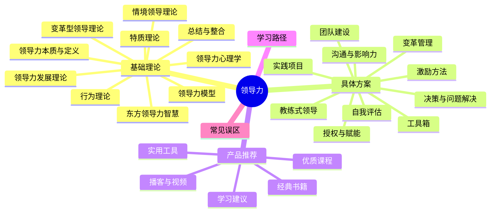
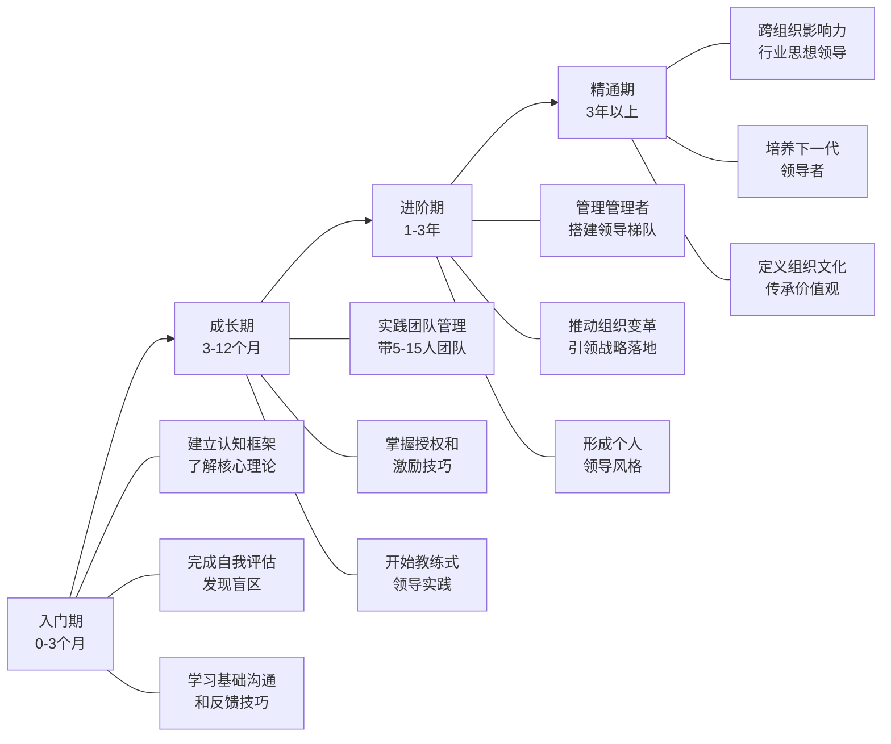

# 第十六章 领导力：从管理自我到引领他人

## 为什么需要学习领导力

在个人提升的旅程中，领导力是一个至关重要的能力维度。它不仅关乎你是否能管理一个团队，更关乎你如何影响他人、做出决策、承担责任并在复杂环境中推动变革。无论你是企业高管、中层管理者、创业者，还是一名普通员工，领导力都是你职业发展和个人成长中不可回避的核心能力。

领导力的本质不是权力和职位，而是影响力。一个没有正式管理职位的人同样可以展现出卓越的领导力，而一个身居高位的人也可能毫无领导力可言。领导力是一种可以通过学习、实践和反思不断提升的能力，它根植于自我认知、情商、沟通能力和战略思维之中。

### 领导力为什么是个人提升的关键维度

领导力并非只属于"管理者"的能力标签，而是贯穿个人成长全程的核心素质。从心理学角度看，领导力的本质是"在复杂环境中有效调动资源（包括人力、信息、注意力、情绪）实现目标的能力"。这种能力无处不在：

- **向上管理**：你需要"领导"你的上级，让他们理解你的价值、支持你的方案。这本质上是一种没有职权基础的影响力
- **跨部门协作**：你需要在没有指挥权的情况下推动其他部门配合你的工作，这需要说服力、共情力和项目管理能力
- **自我管理**：管理自己也是一种领导——你需要设定愿景（目标）、分配资源（时间精力）、激励执行（自律）、复盘改进（反思）
- **家庭与社会角色**：为人父母、组织社区活动、带领志愿者团队，都是领导力的真实场景

哈佛商学院教授约翰·科特（John Kotter）明确区分了"管理"与"领导"：管理是应对复杂性（维持秩序、控制偏差），领导是应对变革（设定方向、凝聚人心）。在当今快速变化的时代，光有管理能力远远不够，你需要具备领导力才能在不确定性中开辟道路。

### 领导力的可习得性：打破"天生领导者"的迷思

长期以来，人们倾向于认为领导者是"天生的"——有些人天生就有那种气质和魅力。但大量研究已经推翻了这一观点：

**特质理论的局限**：早期的领导力特质理论（如斯托格迪尔1948年的综述）试图找出领导者的共同特质——自信、果断、外向等。但后续研究发现，这些特质只能解释约10%-20%的领导效能差异，其余80%以上取决于情境、行为和学习。

**行为理论的启示**：俄亥俄州立大学和密歇根大学的研究（1950-60年代）表明，领导行为可以被分解为"关心人"和"关注任务"两个维度，而这些行为是完全可以学习和练习的。

**神经科学的证据**：现代神经科学研究显示，领导力相关的核心能力——共情、情绪调节、认知灵活性——都具有神经可塑性，可以通过刻意练习得到显著提升。理查德·戴维森（Richard Davidson）在威斯康星大学的研究证明，即使是冥想训练这样简单的练习，也能在8周内显著改变大脑中与共情和情绪调节相关的区域。

**实践数据**：Zenger Folkman对超过5万名领导者的360度评估数据进行分析后发现，领导力效能与年龄、性别、职位的相关性极低，而与"刻意发展行为"（如主动寻求反馈、承担挑战性任务、持续学习）的相关性极高。

这意味着：领导力是可以学习的，而且可以通过系统性的方法持续提升。本章的所有内容都建立在这一前提之上。

---

## 本章核心内容

本章将系统地探讨领导力的各个维度，帮助你建立完整的领导力认知框架，并提供切实可行的提升方案。以下是整章的知识地图：

### 一、基础理论篇：领导力的认知根基

理论不是空谈——它是你理解"为什么这样做有效"的根基。没有理论指导的领导实践就像没有地图的航行，你可能到达某个地方，但很难到达你想去的地方。

本篇从领导力的经典理论出发，梳理从特质理论、行为理论到情境领导理论的发展脉络，覆盖以下核心主题：

| 主题 | 核心问题 | 关键贡献者 | 实用价值 |
|------|---------|-----------|---------|
| 领导力本质与定义 | 什么是领导力？与管理有何区别？ | 科特、本尼斯、格林利夫 | 建立正确的心智模型，避免把管理当领导 |
| 特质理论 | 领导者有什么共同特质？ | 斯托格迪尔、柯克帕特里克 | 了解领导力的先天基础和发展方向 |
| 行为理论 | 领导者做什么？ | 布莱克&莫顿、俄亥俄/密歇根学派 | 行为可以学习，比特质论更可操作 |
| 情境领导理论 | 不同情境需要不同的领导方式吗？ | 赫塞&布兰查德、费德勒 | 根据下属成熟度和环境灵活调整领导风格 |
| 变革型领导理论 | 如何超越交易、激发追随者的内在动力？ | 伯恩斯、巴斯 | 在快速变化的环境中引领组织变革 |
| 领导力模型 | 有哪些综合性的领导力框架？ | GROW模型、五力模型、VUCA框架 | 获得系统化的领导力自检清单 |
| 领导力发展理论 | 领导力是如何成长的？ | 库泽斯&波斯纳、McCall | 理解领导力成长的阶段特征和瓶颈 |
| 领导力心理学 | 领导力背后有哪些心理机制？ | 戈尔曼、西奥迪尼 | 利用心理学原理提升影响力 |
| 东方领导力智慧 | 东方文化中有哪些独特的领导智慧？ | 老子、稻盛和夫、涩泽荣一 | 结合文化背景发展本土化的领导风格 |

理论篇的终极目标不是让你成为学术专家，而是让你在面对任何领导力挑战时，脑海中至少能调用两到三个理论框架来分析问题。当你面对一个不配合的下属时，你能想到情境领导理论——"也许不是他不行，而是我的领导方式不匹配"；当你接手一个士气低落的团队时，你能想到变革型领导——"他们需要的不是KPI，而是愿景和意义感"。

### 二、具体方案篇：从理论到行动的桥梁

理论学习的最终目的是指导实践。在具体方案篇中，我们聚焦十大核心能力，每个能力维度都提供具体的操作步骤、评估工具和真实案例：

**1. 领导力自我评估——认识你的领导力现状**

在提升之前，你需要知道自己在哪里。本节提供多维度的自评工具：

- **领导力风格自测**：基于布莱克-莫顿管理方格的改良版本，帮你定位自己的领导风格倾向（任务导向 vs 关系导向）
- **360度反馈模板**：如何设计问卷、收集上级/同级/下属的匿名反馈、分析结果
- **领导力优势-劣势矩阵**：SWOT分析在领导力自评中的应用
- **价值观排序工具**：明确你作为领导者的不可妥协原则

自我评估的目的不是给你打分，而是帮你建立"领导力觉察"——大多数领导力问题的根源是领导者缺乏对自己行为模式的认知。

**2. 团队建设策略——从一群个体到一个团队**

组建团队远不止"把人凑在一起"。本节覆盖团队建设的完整生命周期：

- **选人**：如何根据任务需求和互补原则选择团队成员（贝尔宾团队角色理论的实际应用）
- **建规**：团队章程（Team Charter）的编写模板和关键条款
- **磨合**：塔克曼模型（Forming-Storming-Norming-Performing）中每个阶段的应对策略
- **文化塑造**：如何通过仪式、符号、故事和制度来构建团队文化
- **远程团队**：分布式团队的特殊挑战——信任建立、异步沟通、文化融合

**3. 决策与问题解决——在不确定中做出判断**

领导者的每一个决策都可能影响整个团队的方向。本节提供结构化的决策框架：

- **决策矩阵**：如何在多选项中用加权评分法做出理性选择
- **OODA循环**：观察-定向-决策-行动的快速决策模型（源自军事决策理论）
- **预验尸法（Pre-mortem）**：在决策执行前假设失败，提前发现风险
- **数据驱动决策**：如何建立决策仪表盘，用数据而非直觉做判断
- **危机决策**：高压环境下的决策原则——快速、透明、可逆

**4. 沟通与影响力——领导力的核心载体**

领导力的落地几乎全部依赖沟通。本节覆盖：

- **愿景传达**：如何把抽象的战略目标翻译成每个人都能理解和认同的日常行动
- **一对一沟通**：高效1:1的结构（开场-核心-行动）和提问技巧
- **向上汇报**：如何让上级理解你的决策并支持你的资源请求
- **非职权影响力**：在没有正式权力的情况下如何推动他人配合（承诺一致性、互惠、社会认同六大原则）
- **困难对话**：如何处理绩效不佳、冲突调解、负面反馈等高难度场景

**5. 授权与赋能——释放杠杆效应**

不会授权的领导者终将成为团队的瓶颈。本节提供：

- **授权四象限**：根据任务重要性和下属能力决定授权程度
- **授权五步法**：说明目标→给予资源→设定检查点→容错空间→复盘反馈
- **反授权陷阱识别**：下属"反授权"的七种经典话术（"领导您看怎么办""这个我做不了"）及应对策略
- **赋能型授权**：从"我让你做"到"我帮你做"的心态转变

**6. 激励方法——点燃内在驱动力**

物质激励有天花板，精神激励才有持续性。本节覆盖：

- **需求层次的实战应用**：马斯洛需求理论在现代职场的重新解读——基础薪资满足生存需求，但成长机会和归属感才能激发真正投入
- **赫茨伯格双因素的落地**：识别你的团队中哪些是"保健因素"（缺了会不满），哪些是"激励因素"（有了才会投入）
- **自我决定理论（SDT）的三要素**：自主性（Autonomy）、胜任感（Competence）、归属感（Relatedness）——如何在日常管理中满足这三个基本心理需求
- **个性化激励方案设计**：不同世代（70后、80后、90后、00后）、不同性格类型（DISC/MBTI）的激励偏好差异
- **非物质激励工具箱**：认可仪式、成长机会、弹性工作、挑战性任务、影响力扩展

**7. 变革管理——引领团队穿越变革**

变革是领导者面临的最高难度挑战。本节基于科特的变革八步模型和ADKAR模型：

- **变革阻力分析**：为什么人们抗拒变革？（损失厌恶、不确定性恐惧、利益冲突、习惯惯性）
- **变革沟通策略**：如何创造紧迫感、描绘愿景、传递信心
- **变革阶段管理**：解冻-变革-再冻结（勒温模型）的实操要点
- **变革失败的五大原因**及预防措施

**8. 教练式领导——从给答案到问问题**

教练式领导是当下最受推崇的领导风格之一。本节覆盖：

- **GROW模型实操**：目标（Goal）→现状（Reality）→选择（Options）→行动（Will）的对话框架，附完整对话示例
- **有力提问的艺术**：开放式问题、假设性问题、挑战性问题的设计方法
- **深度倾听**：三个层次的倾听——听到内容、听到情绪、听到意图
- **教练对话 vs 管理对话**：什么时候该教练，什么时候该直接给指令

**9. 领导力实践项目——在实战中成长**

理论学得再好，不实践等于零。本节提供12个经过验证的领导力实践项目：

- 新团队90天融入计划
- 跨部门项目领导力实战
- 导师制（Mentoring）的启动和运营
- 领导力读书会的组织方法
- 社区/公益项目的领导力实践
- 向上管理专项练习

每个项目都有明确的目标、步骤、评估标准和预期收获。

**10. 领导力提升工具箱——即拿即用的效率工具**

将所有模板、清单和框架汇总为可直接使用的工具：

- 团队章程模板
- 360度反馈问卷
- 一对一会议记录模板
- 决策矩阵模板
- 授权计划表
- 团队健康度评估表
- 领导力自评量表
- 变革管理检查清单

### 三、产品推荐篇：站在巨人的肩膀上

我们精心筛选了领导力领域的经典书籍和优质课程，覆盖以下维度：

- **经典书籍**：彼得·德鲁克《卓有成效的管理者》、约翰·麦克斯韦尔《领导力21法则》、西蒙·斯涅克《从为什么开始》、丹尼尔·戈尔曼《情商》、帕特里克·兰西奥尼《团队协作的五大障碍》等15+本经典
- **优质课程**：哈佛商学院领导力课程、Coursera/edX上的领导力专项、混沌学园、得到App上的领导力专栏
- **实用工具**：Lattice、15Five等反馈工具；Trello/Asana等项目管理工具；Slack/飞书等协作工具中的领导力应用场景
- **播客与视频**：《哈佛商业评论》播客、TED领导力演讲精选、国内管理类公众号和播客推荐

### 四、常见误区篇：避开领导力成长的陷阱

在领导力提升的过程中，许多人会陷入各种误区。本章将揭示十大常见误区并逐一纠正：

| 误区 | 错误逻辑 | 正确认知 |
|------|---------|---------|
| 领导力 = 权力 | 有职位才有领导力 | 影响力才是领导力的核心，职位只是放大器 |
| 好领导必须事事亲力亲为 | 自己做才最放心 | 领导力的核心是通过他人完成任务 |
| 严厉才能服众 | 铁腕手段才能建立权威 | 尊重和信任比恐惧更能激发承诺 |
| 领导者需要有答案 | 团队期待领导者无所不知 | 承认不知道并引导团队找到答案，是更高级的领导力 |
| 团队冲突是坏事 | 和谐最重要 | 建设性冲突推动创新，关键是如何管理冲突 |
| 激励主要靠钱 | 有钱能使鬼推磨 | 薪酬是保健因素，成长和意义才是激励因素 |
| 领导力 = 公众演讲 | 演讲好就是好领导 | 沟通只是领导力的载体之一，决策和执行同样重要 |
| 只有外向者适合当领导 | 内向者不适合领导团队 | 内向领导者在倾听、深度思考和一对一关系上有独特优势 |
| 领导力培训 = 听课 | 听了就会了 | 领导力70%靠实践、20%靠反馈、10%靠课堂学习 |
| 领导风格可以一招鲜 | 找到"对的"风格就万事大吉 | 情境不同、团队不同、阶段不同，需要灵活切换风格 |

### 五、学习路径篇：领导力成长的阶梯

领导力的提升不是一蹴而就的，需要系统性的规划和持续的实践。我们为你设计了一条清晰的成长路径：

- **入门期（0-3个月）**：建立领导力认知框架，完成自我评估，学习基础的沟通和反馈技巧。重点阅读1-2本经典书籍，参加一次领导力工作坊
- **成长期（3-12个月）**：在实践中磨练核心技能——带领5-15人的团队，练习授权和激励，开始教练式领导的实践。定期进行360度反馈，发现进步和盲区
- **进阶期（1-3年）**：管理管理者，推动组织变革，引领战略落地。这一阶段的核心挑战是从"做事"转向"建体系"，从"管人"转向"育人"
- **精通期（3年以上）**：成为变革引领者，建立跨组织的影响力，培养下一代领导者，定义和传承组织文化

---

## 学习建议

学习领导力需要三个要素的结合：**知识输入**、**实践体验**和**反思迭代**。仅仅阅读书籍是不够的，你需要在实际工作和生活中刻意练习；仅仅埋头做事也是不够的，你需要定期反思和总结。

具体建议如下：

1. **带着情境阅读**：不要泛读，带着你当前面临的真实管理挑战去阅读本章，找到与你处境最相关的理论和方案优先学习
2. **每周一个实验**：从本章中选一个具体的技巧或方法，在下一周的工作中刻意练习。比如本周练习"有力提问"，下周练习"建设性反馈"
3. **找一个领导力伙伴**：找一个同频的学习伙伴或导师，定期交流领导力实践中的困惑和收获。领导力的成长不是孤独的旅程
4. **建立反思日志**：每周花15分钟写一段领导力反思日志——这周做了什么领导行为？效果如何？下次可以怎么改进？研究表明，定期反思的领导者成长速度是不反思者的2.5倍
5. **从你现在的位置开始**：不要等到"准备好了"再实践领导力。即使你现在没有管理职位，也可以从自我领导、项目领导、影响同级开始

领导力的提升是一场终身修行。每一次有意识的实践、每一次真诚的反思、每一次从失败中的恢复，都在塑造你的领导力肌肉。让我们从这里开始，踏上从管理自我到引领他人的旅程。
