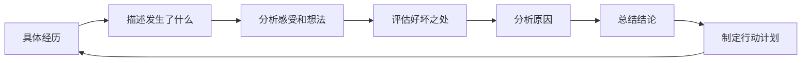
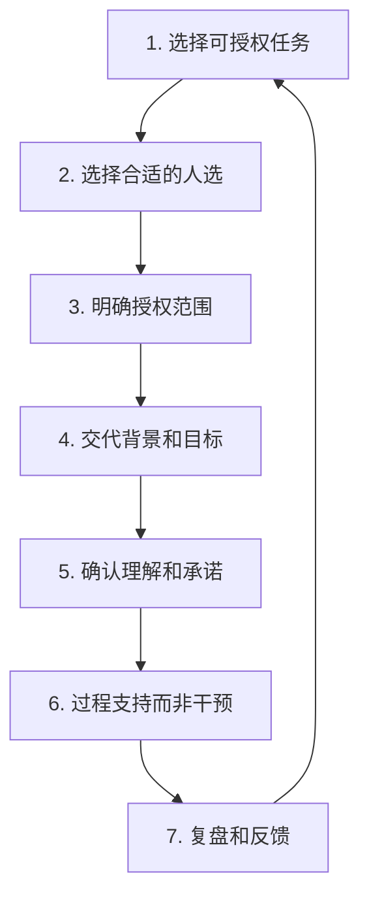

# 领导力学习路径：从新手到卓越领导者的完整修炼地图

领导力不是天赋，而是可以系统性习得的能力。但大多数人在学习领导力时陷入两个极端：要么只读书不实践，变成"理论巨人、行动矮子"；要么埋头干活不反思，重复犯同样的错误。本章为你设计一条**道法术器贯通**的学习路径——从认知底层原理（道），到系统方法论（法），到具体操作工具（术），到数字化辅助工具（器），确保每一步都有明确的方向、可衡量的标准和可执行的动作。

## 一、定位：你当前处于哪个阶段？

在开始任何学习之前，先诚实地评估自己当前的位置。以下是一份快速定位工具——回答以下10个问题，每个问题按1-5分评分（1=完全不符合，5=完全符合）：

### 领导力阶段自测量表

| 序号 | 陈述 | 评分(1-5) |
|------|------|-----------|
| 1 | 我能清晰说出自己的领导力优势和盲点 | |
| 2 | 我能根据下属的能力水平调整管理方式 | |
| 3 | 我能够有效地进行任务授权，而不是事必躬亲 | |
| 4 | 团队成员遇到困难时会主动找我沟通 | |
| 5 | 我能在信息不完整的情况下做出合理决策 | |
| 6 | 我能处理团队冲突，而不是回避它 | |
| 7 | 我有清晰的团队愿景，并能让团队认同 | |
| 8 | 我正在有意识地培养团队中的接班人 | |
| 9 | 我能在组织层面推动变革 | |
| 10 | 我的领导力理念得到了同行和上级的认可 | |

**评分解读：**

| 总分区间 | 当前阶段 | 建议起始点 |
|----------|----------|------------|
| 10-18分 | 第一阶段：入门筑基 | 从基础认知开始，扎实根基 |
| 19-30分 | 第二阶段：技能提升 | 跳过基础，聚焦实战技能 |
| 31-40分 | 第三阶段：风格形成 | 深化战略思维，塑造个人品牌 |
| 41-50分 | 第四阶段：持续精进 | 聚焦跨文化、组织级影响力 |

> **重要提醒**：即使总分较高，如果某项得分低于2分，建议回到对应阶段补齐短板。领导力发展的木桶效应非常明显——一个严重短板足以抵消多个优势。

## 二、学习原则：决定你能否坚持到底的底层逻辑

在具体的学习计划之前，必须先理解四个学习原则。这些原则不是"正确的废话"，而是经过领导力发展研究反复验证的底层机制：

### 原则一：70-20-10法则（CCL研究中心经典模型）

Center for Creative Leadership的研究表明，领导者的能力发展来源遵循以下比例：

- **70%来自工作实践**：真正的领导力是在真实挑战中锻造的，不是在教室里学来的。每一次带团队做项目、处理冲突、做艰难决策，都是一次微训练
- **20%来自人际互动**：导师的一句点拨、同事的一次反馈、同行的经验分享，往往能让你突破自己看不到的盲区
- **10%来自正式学习**：书籍、课程、工作坊提供框架和工具，但仅靠这一层远远不够

**实操含义**：如果你每周花5小时学领导力，其中3.5小时应该用在刻意实践上，1小时用在和他人的交流互动上，0.5小时用在阅读和课程上。大多数人把这个比例搞反了。

### 原则二：刻意练习（Ericsson理论的应用）

领导力的刻意练习不是"多做"，而是"有设计地做"。具体包含四个要素：

1. **明确的目标**：不是"今天练习沟通"，而是"今天在一对一会议中练习先问3个开放性问题再给出建议"
2. **即时反馈**：做完之后立刻回顾——哪些话有效？哪些话让对方表情变了？
3. **适度的挑战**：难度太低没有成长，太高容易挫败。选择比当前能力高10-20%的挑战
4. **重复与修正**：同一技能至少练习5-8次才能形成初步习惯，21次以上才能形成稳定模式

### 原则三：反思驱动（Gibbs反思循环）

经验不会自动变成能力。只有经过结构化反思的经验才能转化为成长。推荐使用Gibbs反思循环：

每次重要的领导力实践后，花10分钟按这个流程走一遍。坚持3个月，你会发现自己的成长速度是不反思时的3-5倍。

### 原则四：渐进超负荷

健身有渐进超负荷，领导力训练同样如此。不要试图同时提升所有能力维度，而是按照以下节奏：

- **每季度聚焦1-2个维度**：比如Q1专注沟通和反馈，Q2专注授权和决策
- **每个维度经历"学习→练习→内化"三个循环**：先学理论（1-2周），再刻意练习（4-6周），最后形成习惯（2-4周）
- **季度末进行综合评估**：确认该维度已达到稳定水平，再转向下一个

## 三、第一阶段：入门筑基（0-3个月）

### 阶段核心目标

这个阶段的核心不是"学很多"，而是**建立正确的领导力认知框架**和**养成两个关键习惯**（每日反思 + 每周一对一沟通）。跳过这个阶段直接学高级技巧，就像不练基本功直接学花式运球——看似高效，实则根基不稳。

### 月度学习计划

#### 第1个月：自我认知与基础框架

**理论学习（每周3-4小时）**

| 周次 | 学习主题 | 具体资源 | 输出成果 |
|------|----------|----------|----------|
| 第1周 | 领导力本质 | 本章基础理论01-02节 + 《领导力21法则》第1-5章 | 写出个人领导力定义（200字以上） |
| 第2周 | 自我认知 | 完成MBTI/DISC/盖洛普优势测评中的至少一个 | 产出自我认知报告 |
| 第3周 | 领导力风格 | 本章基础理论03-04节 + 布莱克-莫顿管理方格 | 确定自己当前的管理风格倾向 |
| 第4周 | 情商基础 | 《情商》丹尼尔·戈尔曼精选章节 | 完成情商自评，识别2个提升点 |

**实践任务清单**

**任务一：领导力自画像（第1-2周完成）**

用以下模板写下你的领导力自画像：

【我的领导力自画像】

核心价值观（我最看重的3件事）：
1. ___________
2. ___________
3. ___________

领导力优势（别人经常夸我的2-3个方面）：
1. ___________
2. ___________

领导力盲点（我最容易忽视的1-2个方面）：
1. ___________

我希望成为的领导者类型：
___________

我最敬佩的一位领导者及其原因：
___________

**任务二：团队成员画像（第2-4周完成）**

与每位团队成员进行30分钟的一对一沟通，使用以下对话框架：

开场（2分钟）：
"我想更好地了解你的想法，今天主要是听你说。"

核心问题（20分钟）：
1. "你目前工作中最有成就感的部分是什么？"
2. "什么在阻碍你发挥出更好的水平？"
3. "你希望在接下来半年里学到什么或做到什么？"
4. "你希望我以什么方式支持你？"
5. "你对团队有什么建议是我可能没看到的？"

收尾（3分钟）：
"谢谢你的坦诚。我整理一下今天聊的内容，下周和你分享我的想法。"

记录每位成员的以下信息：

| 成员 | 核心动力 | 发展目标 | 沟通偏好 | 潜在顾虑 |
|------|----------|----------|----------|----------|
| 成员A | | | | |
| 成员B | | | | |
| ... | | | | |

#### 第2个月：沟通与反馈核心技能

**理论学习（每周3-4小时）**

| 周次 | 学习主题 | 具体资源 | 输出成果 |
|------|----------|----------|----------|
| 第5周 | 深度倾听 | 《非暴力沟通》第1-4章 + 本章具体方案04节 | 制作个人倾听自检清单 |
| 第6周 | 有力提问 | 学习GROW模型 + 开放性/封闭性问题技巧 | 设计10个万能教练问题 |
| 第7周 | 结构化反馈 | SBI模型 + 本章具体方案04节反馈部分 | 练习5次SBI反馈并记录效果 |
| 第8周 | 困难对话 | 《关键对话》核心框架 | 模拟一次困难对话并复盘 |

**核心工具一：SBI反馈模型（逐句拆解）**

SBI模型之所以有效，是因为它把主观评价变成了客观描述。以下是完整的使用步骤：

情境(Situation)：描述具体的时间和场景
→ ❌ "上次开会的时候"（太模糊）
→ ✅ "昨天下午的项目周会上"（精确到时间地点）

行为(Behavior)：描述你观察到的具体行为，不加评判
→ ❌ "你态度不好"（评判性语言）
→ ✅ "当小王提出方案时，你连续三次打断了他的发言"（行为描述）

影响(Impact)：说明这个行为产生的具体影响
→ ❌ "这样不好"（无意义的影响描述）
→ ✅ "小王之后全程没有再发言，会议结束后我看到他单独找小王道歉"（具体影响）

【正面反馈示例】
"周三下午的客户演示中（S），你在客户质疑数据来源时，
没有急于辩护，而是先问了三个问题确认客户的真实顾虑（B），
这让我看到你已经能够做到先理解再回应，
客户最终对我们的专业度给了很高的评价（I）。继续保持。"

【改进反馈示例】
"昨天的代码评审会上（S），当新人提交的代码有bug时，
你说'这种低级错误不应该出现'（B），
这导致那位同事之后两周几乎没有再主动提交代码评审（I）。
我理解你对代码质量的追求，下次可以换成具体指出问题和改进方向。"

**核心工具二：每日反思日志模板**

【日期】：____年__月__日
【今日领导力意图】：今天我要刻意练习_______

【今日关键时刻】
事件：___________
我的反应：___________
效果如何：___________
如果重来我会：___________

【今日收获】
一个新发现：___________
一个待改进：___________

【明日计划】
明天要刻意练习：___________

#### 第3个月：团队认知与基础激励

**理论学习（每周3-4小时）**

| 周次 | 学习主题 | 具体资源 | 输出成果 |
|------|----------|----------|----------|
| 第9周 | 团队发展阶段 | 塔克曼团队发展模型(形成-风暴-规范-执行) | 诊断自己团队处于哪个阶段 |
| 第10周 | 信任建立 | 《信任的速度》核心框架 | 制定团队信任建设计划 |
| 第11周 | 基础激励 | 马斯洛需求层次 + 赫兹伯格双因素理论 | 完成每位成员的激励档案 |
| 第12周 | 阶段综合 | 回顾三个月全部学习 | 完成阶段总结报告 |

**实践工具：团队信任账户**

把信任想象成银行账户——每次积极互动是存款，每次失信是取款。

团队信任账户记录表

成员：___________
初始信任水平：□低 □中 □高

存款记录（积极行为）：
| 日期 | 行为 | 信任影响 |
|------|------|----------|
| | | +1/+2/+3 |

取款记录（失信行为）：
| 日期 | 行为 | 信任影响 |
|------|------|----------|
| | | -1/-2/-3 |

当前余额趋势：□上升 □平稳 □下降
需要采取的行动：___________

### 第一阶段里程碑检查清单

完成第一阶段前，确认以下每一项都已达到：

- [ ] 能用自己的话定义领导力，并说出自己的领导力理念（不是背诵名言）
- [ ] 完成至少一种性格/优势测评，并能说出3个优势和2个盲点
- [ ] 与每位团队成员完成至少2次一对一沟通，建立了个人档案
- [ ] 能够用SBI模型进行正面反馈和改进反馈，且至少练习了8次
- [ ] 坚持每日反思日志至少30天
- [ ] 能诊断团队当前处于塔克曼模型的哪个阶段
- [ ] 完成了阶段总结报告

**进入第二阶段的前提条件**：以上7项中至少完成5项。如果某项未完成，花2周时间补齐。

## 四、第二阶段：技能提升（3-12个月）

### 阶段核心目标

如果说第一阶段是"知道自己不知道"，第二阶段就是"从知道到做到"。这个阶段的核心是**将领导力工具内化为本能反应**——当你面对授权、决策、冲突等场景时，不需要刻意回忆框架，而是自然而然地做出有效反应。

### 月度学习计划

#### 第4-5月：授权与赋能

**理论学习重点**

授权不是"把活扔给别人"，而是一种系统性的能力发展工具。学习授权七步法：

**授权决策矩阵**——不是所有任务都适合授权：

| | 低风险 | 高风险 |
|------|--------|--------|
| **低复杂度** | ✅ 立即授权 | ✅ 授权 + 定期检查 |
| **高复杂度** | ✅ 授权 + 过程辅导 | ⚠️ 部分授权或暂不授权 |

**实践任务**：选择3项任务进行授权实验，按以下模板记录：

【授权实验记录 #1】

任务描述：___________
选择的原因（为什么适合授权）：___________
授权给谁：___________
选择此人的原因：___________

授权范围（可自主决定 / 需要请示 / 需要知会）：
___________

过程记录：
第1次检查点（日期）：进展___________，问题___________
第2次检查点（日期）：进展___________，问题___________
最终结果：___________

复盘：
做得好的：___________
可改进的：___________
下次会调整的：___________

#### 第6-7月：决策与问题解决

**核心工具一：决策矩阵实操**

面对多个选项时，用加权评分法消除直觉偏差：

决策矩阵示例：选择Q3重点项目

| 评估维度 | 权重 | 方案A得分 | 方案B得分 | 方案C得分 |
|----------|------|-----------|-----------|-----------|
| 战略对齐度 | 30% | 8 (2.4) | 6 (1.8) | 9 (2.7) |
| 团队能力匹配 | 25% | 7 (1.75) | 8 (2.0) | 5 (1.25) |
| ROI预期 | 25% | 6 (1.5) | 9 (2.25) | 7 (1.75) |
| 风险可控度 | 20% | 8 (1.6) | 5 (1.0) | 6 (1.2) |
| 加权总分 | 100% | 7.25 | 7.05 | 6.95 |

**核心工具二：OODA决策循环**

面对不确定环境时，使用约翰·博伊德的OODA循环：

- **Observe（观察）**：收集信息，不急于判断
- **Orient（定向）**：分析信息，理解当前形势
- **Decide（决策）**：选择行动方案
- **Act（执行）**：快速执行，快速反馈

关键在于：循环速度比决策完美度更重要。一个80分的决策如果比竞争对手快一周，效果远超一个100分但姗姗来迟的决策。

#### 第8-9月：冲突管理与向上管理

**冲突处理五种模式及适用场景**（Thomas-Kilmann模型）：

| 模式 | 适用场景 | 不适用场景 | 话术模板 |
|------|----------|------------|----------|
| 协作 | 双方利益都重要，有时间深入讨论 | 紧急情况 | "让我们找到一个双方都满意的方案" |
| 妥协 | 双方势均力敌，需要快速解决 | 涉及原则性问题 | "各让一步，先推进再说" |
| 竞争 | 紧急且涉及核心原则 | 需要维护长期关系 | "这个方向我需要坚持，原因是..." |
| 回避 | 问题不重要或时机不对 | 问题会持续恶化 | "这个问题我们先放一放" |
| 迁就 | 维护关系比结果更重要 | 对方持续越界 | "这次我同意你的方案" |

**向上管理核心策略**：

1. **了解上级的压力和目标**：你的上级也有上级，理解他的KPI和焦虑，你才能成为他的解决方案
2. **带着方案而非问题去沟通**：不要问"这个怎么办"，而是说"我有两个方案，分别是...，我倾向A因为..."
3. **管理预期**：承诺80分，交付90分，而不是承诺100分交付85分
4. **定期同步**：每周用15分钟同步进展，不要让上级来追你

#### 第10-12月：教练技术与影响力

**GROW教练模型完整对话示例**：

【Goal - 目标】
教练："你希望通过这次对话达到什么结果？"
被教练者："我想提升团队的交付速度。"
教练："具体来说，提升到什么程度你会满意？有没有可衡量的指标？"
被教练者："把当前的平均交付周期从4周缩短到3周。"

【Reality - 现状】
教练："目前交付周期是4周，瓶颈在哪里？"
被教练者："主要在需求评审阶段，平均要花1周。"
教练："评审阶段具体耗时在哪些环节？"
被教练者："等待排期2天，评审本身半天，修改2天。"
教练："还有其他影响因素吗？"
被教练者："技术债导致每次改动都要额外回归测试。"

【Options - 选择】
教练："针对评审等待的问题，有哪些可能的解决方案？"
被教练者："可以...（让被教练者自己提出选项）"
教练："还有吗？如果没有任何限制，你会怎么做？"
被教练者："（继续探索更多选项）"
教练："你觉得哪个方案最可行？"

【Will - 行动】
教练："你决定采取什么行动？"
被教练者："第一步我会..."
教练："什么时候开始？会遇到什么障碍？如何克服？"
被教练者："..."
教练："好的，我们下周这个时间回顾进展。"

### 第二阶段里程碑检查清单

- [ ] 完成至少5次成功的任务授权，能说出授权的关键判断标准
- [ ] 在团队决策中使用过决策矩阵、六顶思考帽等至少2种工具
- [ ] 独立处理过至少2次团队冲突，能选择合适的冲突处理模式
- [ ] 建立了稳定的向上沟通机制（至少每两周一次）
- [ ] 完成至少6次GROW教练对话，被教练者有明显进步
- [ ] 完成360度反馈评估，收到了具体的外部视角
- [ ] 团队关键指标（满意度/效率/质量）有可衡量的提升

## 五、第三阶段：风格形成（1-3年）

### 阶段核心目标

前两个阶段你学会了"用工具"，第三阶段你要学会"超越工具"。这个阶段的核心是**形成个人独特的领导风格**和**发展战略思维能力**。你不再是照着框架做，而是能够根据情境灵活组合甚至创造方法。

### 战略思维发展路径

#### 第13-18个月：从执行者到战略思考者

**学习重点**：理解战略不是"高层的事"，每个层级的领导者都需要战略思维。

**战略思维三层次训练法**：

| 层次 | 训练内容 | 具体方法 | 频率 |
|------|----------|----------|------|
| 战术层 | 如何更高效地完成任务 | 流程优化、自动化、效率提升 | 每日 |
| 战役层 | 如何选择正确的方向 | 季度OKR制定、优先级排序 | 每月 |
| 战略层 | 如何创造竞争优势 | 行业分析、趋势预判、差异化定位 | 每季度 |

**实践工具：战略画布（简化版）**

每半年填写一次，用于审视团队的战略定位：

【团队战略画布 - ____年H__】

我们的客户/服务对象是谁：___________
他们的核心需求是什么：___________
我们独特的价值主张是什么：___________

我们在以下方面投入过多（应该减少）：
1. ___________
2. ___________

我们在以下方面投入不足（应该增加）：
1. ___________
2. ___________

行业正在发生的3个变化：
1. ___________
2. ___________
3. ___________

这些变化对我们的机会/威胁：___________

未来6个月的战略重点：
1. ___________
2. ___________
3. ___________

#### 第19-24个月：变革管理能力

**科特变革八步法实战应用**：

| 步骤 | 关键动作 | 常见错误 |
|------|----------|----------|
| 1. 制造紧迫感 | 用数据说明为什么必须变 | 只讲道理不讲数据 |
| 2. 组建领导联盟 | 找到关键影响者并获得承诺 | 只找职位高的人 |
| 3. 创建变革愿景 | 用简洁有力的语言描述未来 | 愿景太抽象或太长 |
| 4. 传播变革愿景 | 多渠道、多形式、反复传播 | 只说一次就以为大家懂了 |
| 5. 授权行动 | 移除变革障碍，允许试错 | 鼓励变革但惩罚失败 |
| 6. 创造短期成果 | 选择容易出成果的领域先突破 | 等所有事情都完美才公布 |
| 7. 巩固成果 | 趁势推进更深层变革 | 过早宣布胜利 |
| 8. 融入文化 | 将新行为固化到制度和文化中 | 变革停在表面没有沉淀 |

#### 第25-30个月：文化建设

团队文化不是你写在墙上的标语，而是**当没有明文规定时，团队成员会怎么做**。

**文化建设四步法**：

1. **定义**：用具体行为描述你期望的文化（不是"创新"，而是"遇到问题时先尝试至少3种不同方案再上报"）
2. **示范**：领导者自己首先践行——文化是看领导做什么，不是听领导说什么
3. **强化**：在招聘、晋升、奖励中体现文化价值观
4. **淘汰**：对持续不符合文化价值观的行为说不，即使对方业绩很好

#### 第31-36个月：领导力传承

**接班人培养计划模板**：

【接班人培养计划】

候选人：___________
当前角色：___________
目标角色：___________
培养周期：___个月

优势评估：
1. ___________
2. ___________
3. ___________

待发展能力：
1. ___________ → 培养方式：___________ → 目标日期：___
2. ___________ → 培养方式：___________ → 目标日期：___
3. ___________ → 培养方式：___________ → 目标日期：___

培养路径：
第1-3月：___________
第4-6月：___________
第7-9月：___________
第10-12月：___________

阶段性检查点：
□ 3个月评估：___________
□ 6个月评估：___________
□ 9个月评估：___________
□ 12个月终评：___________

### 第三阶段里程碑检查清单

- [ ] 能够独立制定团队年度战略规划，且团队成员认同
- [ ] 成功主导过至少1个变革项目，经历了完整的变革周期
- [ ] 团队有明确的、被成员认同的文化价值观，且体现在日常行为中
- [ ] 培养了至少1名能独当一面的下属，能代理你处理80%的日常管理
- [ ] 在组织内有明确的个人领导力品牌，上级和跨部门同事认可你的独特价值
- [ ] 完成至少2次领导力主题的分享、写作或内部培训

## 六、第四阶段：持续精进（3年以上）

### 阶段核心目标

到了这个阶段，你已经是一位成熟的领导者。接下来的成长不再是线性的技能积累，而是**维度的跃迁**——从管理一个团队到影响一个组织，从解决已知问题到驾驭未知挑战，从自我发展到发展他人。

### 方向一：跨文化领导力

全球化和远程协作让跨文化领导力成为必修课，而非选修课。

**文化维度认知框架**（基于霍夫斯泰德文化维度理论）：

| 维度 | 低分文化特征 | 高分文化特征 | 管理启示 |
|------|-------------|-------------|----------|
| 权力距离 | 扁平化，可直呼其名 | 等级分明，尊重层级 | 调整决策方式和沟通风格 |
| 个人/集体主义 | 强调个人成就 | 强调团队和谐 | 调整激励和表彰方式 |
| 不确定性规避 | 接受模糊和变化 | 偏好规则和确定性 | 调整计划和沟通详细度 |
| 长期/短期导向 | 注重即时结果 | 注重长期关系 | 调整目标设定和评估周期 |

**跨文化团队管理实操清单**：

- 建立团队沟通公约（哪些用文字、哪些用语音、异步/同步的边界）
- 了解每个文化背景的节假日和禁忌
- 在评估绩效时考虑文化差异对表达方式的影响
- 定期组织跨文化交流活动，创造非正式连接

### 方向二：高层领导力跃迁

从管理团队到管理组织，需要的能力转变：

| 从 | 到 | 关键转变 |
|----|----|----------|
| 解决问题 | 定义问题 | 不是处理眼前的问题，而是识别哪些问题值得解决 |
| 制定计划 | 设定方向 | 不是做详细的项目计划，而是定义愿景和战略优先级 |
| 直接影响 | 间接影响 | 通过制度、文化、人才来影响，而不是亲自做 |
| 专业深度 | 跨域整合 | 不是在一个领域深耕，而是连接多个领域的知识 |
| 控制信息 | 透明分享 | 不是掌握信息作为权力，而是让信息自由流动 |

### 方向三：领导力研究与知识传承

**系统化你的领导力知识体系**：

1. **经验萃取**：回顾你最重要的10个领导力决策/事件，提取底层模式
2. **框架构建**：将零散的经验提炼为可教授的框架和方法论
3. **写作输出**：将你的领导力心得写成系列文章或内部手册
4. **教学相长**：通过培训和辅导他人来深化自己的理解

**导师角色的四个层次**：

| 层次 | 方式 | 适用对象 |
|------|------|----------|
| 示范 | 通过自身行为影响他人 | 所有接触的人 |
| 指导 | 提供建议和方向 | 直接下属和后辈 |
| 教练 | 通过提问帮助对方自己找到答案 | 有潜力的领导者 |
| 陪伴 | 长期关系中的持续支持 | 关键培养对象 |

### 方向四：社会责任与领导力

真正的领导力超越组织边界。到了这个阶段，考虑如何将你的领导力用于更广泛的社会影响：

- **行业贡献**：在行业协会、标准制定、知识分享中贡献专业力量
- **公益参与**：为非营利组织提供领导力咨询或担任理事
- **青年培养**：指导刚入行的年轻人，培养下一代领导者
- **思想领导力**：通过写作、演讲传播你的领导力理念

## 七、贯穿全程的学习节奏

### 日常节奏（每天15-30分钟）

【晨间启动】5分钟
- 今天我要刻意练习的领导力行为：___________
- 今天最重要的一个领导力决策/互动是：___________

【日间觉察】（随时）
- 遇到领导力场景时，暂停3秒再回应
- 记录一个关键时刻（用手机备忘录即可）

【晚间反思】10分钟
- 今天最有效的一个领导力行为：___________
- 今天可以改进的一个地方：___________
- 明天的调整：___________

### 周度节奏（每周3-5小时）

| 时间段 | 活动 | 时长 |
|--------|------|------|
| 周一 | 制定本周领导力发展重点 | 15分钟 |
| 周中 | 阅读/课程学习 | 1-2小时 |
| 周中 | 至少2次一对一沟通 | 1-2小时 |
| 周五 | 周度反思日志 | 30分钟 |
| 周末 | 下周计划调整 | 15分钟 |

### 月度节奏（每月1天）

1. **月度回顾**（2小时）
   - 本月学到了什么新知识/技能？
   - 本月最骄傲的领导力时刻是什么？
   - 本月最大的挫折和教训是什么？
   - 下月的重点发展领域是什么？

2. **反馈收集**（1小时）
   - 向2-3位信任的人收集简版反馈
   - "我这个月在____方面做得怎么样？有什么建议？"

3. **计划调整**（1小时）
   - 根据反馈和反思调整下月学习计划
   - 更新个人领导力发展计划

### 季度节奏（每季度2-3天）

1. **深度阅读**：集中时间读完1本领导力经典
2. **战略反思**：跳出日常，从更高视角审视自己的领导力发展
3. **360度反馈**：进行一次完整的多维度反馈收集
4. **计划更新**：更新季度和年度领导力发展计划

## 八、学习效果评估体系

### 五维度评估矩阵

| 维度 | 入门标准（能做） | 进阶标准（做好） | 精通标准（教人） |
|------|------------------|------------------|------------------|
| **自我认知** | 能说出自己的性格特点和2-3个优势 | 能识别自己的情绪触发点并主动管理 | 能帮助他人发现盲点并制定发展计划 |
| **团队管理** | 能带团队完成既定任务 | 能建设高效协作的团队 | 能培养出独立运作的团队 |
| **授权能力** | 能进行简单的任务分配 | 能根据人的发展阶段差异化授权 | 能创建赋能型组织架构 |
| **决策能力** | 能使用决策工具做出合理选择 | 能在信息不完整时做出及时决策 | 能在复杂模糊的战略环境中做出正确判断 |
| **影响力** | 能影响直接下属 | 能影响跨部门利益相关方 | 能影响组织战略方向和行业趋势 |

### 量化评估指标

**团队层面（每季度跟踪）**：

| 指标 | 衡量方式 | 目标方向 |
|------|----------|----------|
| 团队满意度 | 匿名问卷（1-10分） | 逐季度提升 |
| 主动离职率 | HR数据 | 低于行业平均 |
| 项目交付准时率 | 项目管理工具 | ≥85% |
| 团队成员晋升率 | HR数据 | 逐年提升 |
| 内部协作满意度 | 跨部门反馈 | 逐季度提升 |

**个人层面（每半年评估）**：

| 指标 | 衡量方式 | 目标方向 |
|------|----------|----------|
| 360度反馈得分 | 专业评估工具 | 逐半年提升 |
| 教练对话次数 | 自我记录 | 持续进行 |
| 变革项目成功数 | 项目复盘 | 逐年积累 |
| 培养出的接班人数 | 实际案例 | 逐步增加 |
| 领导力分享/写作数 | 公开记录 | 持续输出 |

### 专业评估工具推荐

| 工具 | 用途 | 费用 | 适用阶段 |
|------|------|------|----------|
| 盖洛普优势测评（CliftonStrengths） | 识别天赋优势 | ¥150-400 | 第一阶段起 |
| DISC行为风格评估 | 了解行为倾向 | 免费-¥200 | 第一阶段起 |
| 领导力实践清单（LPI） | 360度领导力评估 | ¥500-1500 | 第二阶段起 |
| 情商评估（EQ-i 2.0） | 情商全面评估 | ¥800-2000 | 第二阶段起 |
| CCL评估中心 | 综合领导力评估 | ¥5000+ | 第三阶段起 |

## 九、学习中的常见挑战与系统性应对

### 挑战一：时间不够

**根因分析**：大多数人不是"没有时间"，而是"没有把领导力学习排进优先级"。

**系统性应对**：

1. **时间审计**：记录一周的时间使用，你会发现自己每天至少有1小时用在了低价值活动上（刷手机、无效会议、过度纠结小决策）
2. **捆绑策略**：把领导力学习和已有工作捆绑——一对一沟通就是工作的一部分，项目复盘本身就是学习
3. **最小可行练习**：忙碌的日子里，只做5分钟的晨间意图设定和5分钟的晚间反思，这比什么都不做强100倍
4. **碎片时间利用**：通勤时间听领导力播客（推荐：《哈佛商业评论Ideacast》、《Manager Tools》）

### 挑战二：没有实践机会

**系统性应对**：

1. **向下挖掘**：你现有的每一个管理动作都是练习机会——一次审批、一次站会、一次绩效面谈
2. **横向拓展**：主动承担跨部门项目协调角色，这是锻炼影响力的最佳场景
3. **向上借力**：向上级申请参与更高层级的决策过程，哪怕只是旁听
4. **向外延伸**：在行业协会、志愿者组织、社区活动中实践领导力
5. **模拟训练**：和同样在学习领导力的伙伴进行角色扮演，模拟困难场景

### 挑战三：学习效果不明显

**系统性应对**：

1. **量化追踪**：没有数据就没有感知。用上面的评估指标定期测量，你会发现变化其实已经发生
2. **寻求反馈**：你眼中的自己和别人眼中的你可能有很大差距。定期收集反馈是校准的唯一方式
3. **找对标**：找到一位你欣赏的领导者，定期观察和对比自己的行为
4. **记录成长**：每3个月重读自己的反思日志，你会惊讶于自己的进步

### 挑战四：遇到挫折和失败

**系统性应对**：

1. **重新定义失败**：领导力的失败不是"做了错误的决定"，而是"从错误中什么都没学到"
2. **建立支持网络**：找到2-3位可以坦诚交流领导力困惑的人（导师、同行、教练）
3. **失败复盘模板**：

【失败复盘记录】

事件描述：___________
我的角色和责任：___________

如果重来，我会：
1. ___________
2. ___________
3. ___________

从中学到的核心教训：___________

这个教训如何应用到未来的场景：___________

需要更新的认知或假设：___________

### 挑战五：陷入"管理者陷阱"

很多人在学习领导力时会陷入一个典型困境——学了太多管理工具，却越来越像"高级执行者"而非"领导者"。

**识别信号**：
- 你的时间90%以上花在解决问题上
- 你觉得离开你团队就转不动
- 你的团队成员从不挑战你的想法
- 你对未来的思考不超过下个季度

**破解方法**：
1. 强制自己每周至少2小时做"只有你能做"的战略性工作
2. 有意识地减少自己的可替代性——如果某件事别人也能做80分，就放手
3. 创造团队成员挑战你的安全空间——"谁有不同看法？"是你最应该常说的一句话
4. 每季度做一次"我在做什么"的时间审计，把执行性工作逐步移除

## 十、个性化路径设计指南

不同背景的领导者需要不同的侧重：

### 按角色定制

| 角色 | 重点加强 | 可以延后 |
|------|----------|----------|
| 新晋技术管理者 | 沟通、反馈、授权 | 战略思维、文化建设 |
| 新晋非技术管理者 | 业务理解、决策、教练技术 | 变革管理、高层领导力 |
| 中层管理者 | 影响力、向上管理、变革管理 | 基础沟通（已具备） |
| 跨部门负责人 | 利益相关方管理、协调、政治敏感度 | 直接管理技能 |
| 创业公司CEO | 快速决策、文化建设、人才吸引 | 官僚体系下的管理技能 |

### 按行业定制

| 行业 | 特殊关注点 |
|------|------------|
| 互联网/科技 | 敏捷管理、自组织团队、技术领导力 |
| 金融/银行 | 合规意识、风险管理、稳健决策 |
| 制造业 | 安全文化、流程优化、一线管理 |
| 咨询/服务 | 客户导向、项目管理、知识管理 |
| 教育/医疗 | 使命驱动、专业权威与管理权力的平衡 |

### 个人领导力发展计划（IDP）模板

【个人领导力发展计划】

基本信息：
姓名：___________  当前角色：___________
日期：___________  计划周期：___个月

自评结果（来自阶段自测量表）：
总分：___  当前阶段：___________
最强维度：___________ (___分)
最弱维度：___________ (___分)

发展目标（SMART原则）：
1. 具体目标：___________
   衡量标准：___________
   截止日期：___________
   关键行动：___________

2. 具体目标：___________
   衡量标准：___________
   截止日期：___________
   关键行动：___________

3. 具体目标：___________
   衡量标准：___________
   截止日期：___________
   关键行动：___________

学习资源计划：
必读书目：___________
计划课程：___________
导师/教练：___________
实践机会：___________

检查点：
□ 1个月回顾：___________
□ 3个月评估：___________
□ 6个月中期检查：___________
□ 周期结束终评：___________

领导力的学习是一场终身修炼。这条路径不是一成不变的铁轨，而是根据你的实际情况不断调整的指南针。最重要的不是完美的计划，而是**今天就开始行动**——哪怕只是花10分钟完成那个领导力自测量表。每一步扎实的行动，都在把你推向更好的领导者。
