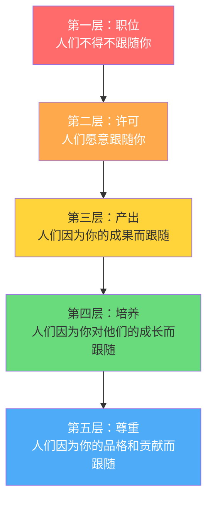
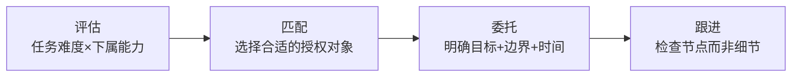
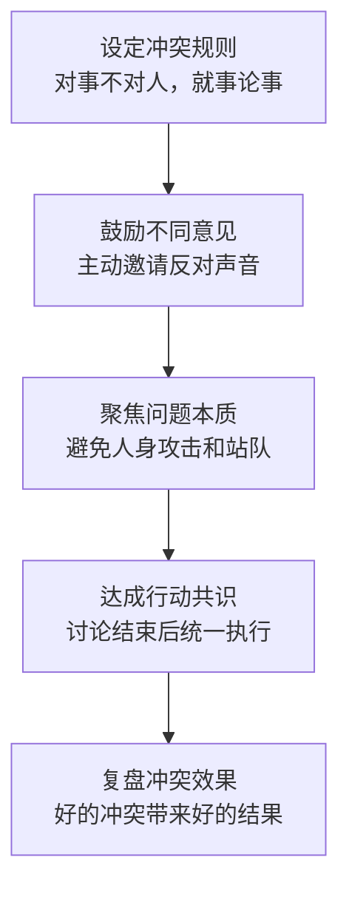
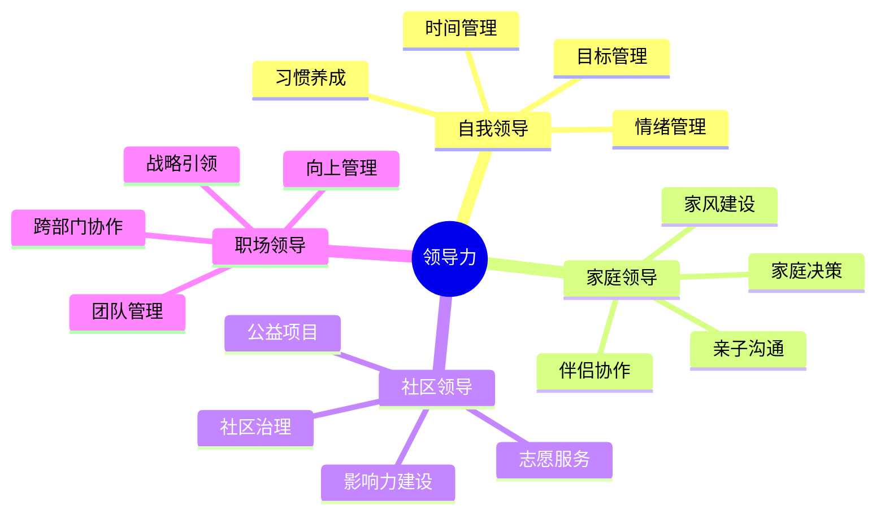
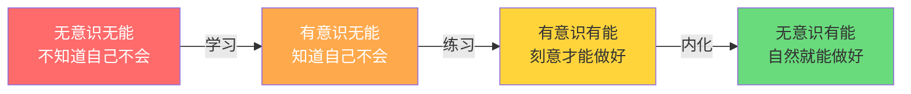
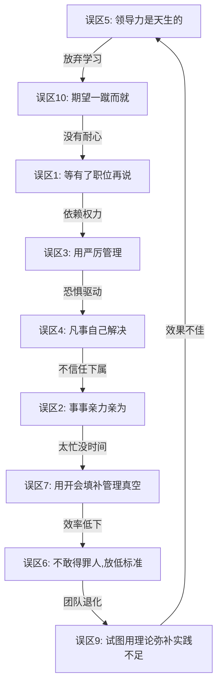

# 领导力提升的十大常见误区

在领导力提升的道路上，认知偏差是最大的敌人。你可能每天都在努力"做一个好领导"，但如果方向本身就是错的，越努力反而离目标越远。本章将系统性地揭示十个最常见的领导力误区，不仅告诉你"错在哪里"，更会解释"为什么会错"以及"如何纠正"。

## 误区自测：你中了几个？

在逐一分析之前，先做一个快速自测。对以下10个陈述，诚实地判断自己是否存在这种倾向：

| 序号 | 陈述 | 经常 | 有时 | 从不 |
|------|------|------|------|------|
| 1 | 我认为只有坐上管理岗位才算有领导力 | | | |
| 2 | 重要的事情我宁愿自己做，交给别人不放心 | | | |
| 3 | 我觉得下属应该怕我一点，这样才管得住 | | | |
| 4 | 团队遇到问题第一时间找我，我觉得这是我的价值 | | | |
| 5 | 我觉得领导力是天赋，有些人天生就不适合 | | | |
| 6 | 我尽量避免和下属发生冲突，维持和谐最重要 | | | |
| 7 | 我每周花大量时间在开会上 | | | |
| 8 | 我觉得领导力只在工作场景有用 | | | |
| 9 | 我相信只要找到正确的领导力模型就能成功 | | | |
| 10 | 我期望参加一次培训就能显著提升领导力 | | | |

**评分标准**：选"经常"得2分，"有时"得1分，"从不"得0分。

- **0-5分**：你对领导力有较好的认知基础，但仍需持续精进
- **6-12分**：你陷入了部分误区，需要有针对性地调整
- **13-20分**：你正深陷多个误区，建议认真阅读本章并制定纠正计划

下面逐一拆解每个误区的心理机制、典型表现、危害分析和纠正方案。

## 误区一：领导力等于权力和职位

### 误区表现

许多人认为，只有拥有正式管理职位的人才需要领导力，或者认为领导力就是发号施令的权力。这种观念导致两个问题：一是没有职位的人不去主动培养领导力，二是有职位的人过度依赖权力来推动工作。

**典型内心独白**：
- "我又不是领导，学什么领导力"
- "等我当上经理再说吧"
- "我是领导，我说了算"

### 心理机制

这种误区的根源是**权威崇拜**和**身份认同绑定**。中国传统文化中的"官本位"思想强化了"领导力=职位"的认知。人们习惯性地将"领导"理解为一个名词（职位），而非一个动词（行为）。

哈佛商学院教授琳达·希尔（Linda Hill）在《成为管理者》的研究中发现，新晋管理者最常见的认知偏差就是将管理权威等同于领导力。他们认为一旦获得正式任命，自然就拥有了领导力，结果在实际工作中遭遇巨大的落差。

### 危害分析

**对无职位者的影响**：
- 放弃在非正式场合发展影响力的机会
- 在跨部门协作中缺乏主动担当
- 错过晋升前的"领导力预演"阶段

**对有职位者的影响**：
- 过度依赖命令式管理，忽视团队意愿
- 一旦失去职位，影响力瞬间归零
- 难以获得团队的真心追随

### 纠正方案

**认知重建**：领导力的本质是影响力，而非权力。约翰·麦克斯韦尔（John Maxwell）提出了领导力的"五层模型"，从低到高分别是：

停留在第一层的领导者是最低效的。真正的领导力提升，是从第一层向第五层不断攀升的过程。

**具体行动**：
1. **在没有正式权力的情况下**：主动承担跨部门协调的角色，用专业能力赢得信任。比如主动组织技术分享会、牵头解决跨团队的流程问题
2. **建立专业影响力**：持续学习并输出，写技术博客、在团队内分享经验、成为某个领域的"go-to person"
3. **有职位的管理者**：有意识地减少"因为我是领导"这类权力暗示，改为"因为这个方案最合理"的影响力路径

**自测问题**：如果你明天失去了现在的职位，还有多少人会主动来找你请教和合作？如果答案是"很少"，说明你的领导力过度依赖职位。

## 误区二：好领导必须事事亲力亲为

### 误区表现

许多新晋管理者或技术出身的领导者，习惯于自己动手解决问题。他们认为，只有自己亲自做才能保证质量，或者觉得让下属做不如自己做来得快。结果是自己忙得不可开交，下属得不到成长，团队效率也无法提升。

**典型场景**：
- 代码审查时忍不住自己重写
- 方案设计时自己全盘搞定
- 下属的工作改了又改，最后还是自己做
- 加班到深夜，但团队准时下班

### 心理机制

这种行为背后有四层心理驱动：

| 心理驱动 | 表面理由 | 深层原因 |
|----------|----------|----------|
| 完美主义 | "他们做不好" | 对失控的恐惧 |
| 控制欲 | "我来做更快" | 不信任他人的能力 |
| 存在感需求 | "这事儿只有我能搞定" | 通过忙碌证明价值 |
| 身份焦虑 | "不做具体活就不算领导" | 对管理者角色的不适应 |

技术出身的领导者尤其容易陷入这种误区。他们从"个人贡献者"晋升为管理者，但内心仍然认同"做技术"而非"带团队"。迈克尔·沃特金斯（Michael Watkins）在《最初的90天》中称之为"专家陷阱"——领导者继续扮演专家角色，而忽略了管理者的真正职责。

### 危害分析

**个人层面**：长期超负荷工作导致身心俱疲，战略思考时间被压缩到零。你把自己变成了团队最大的瓶颈——你不在的时候，所有事情都停摆。

**团队层面**：下属失去了成长的机会，优秀的人才会离开。盖洛普的研究显示，"无法获得成长和发展"是员工离职的第二大原因，仅次于直接上级的管理方式。

**组织层面**：一个10人的团队，如果领导者事事亲为，实际产能可能只有2-3个人的效率。因为所有工作都要经过领导者的瓶颈，排队等待和返工消耗了大量时间。

### 纠正方案

**核心原则**：领导者的职责是"通过他人完成工作"，而非"自己完成所有工作"。

**授权四步法**：

**具体行动**：
1. **每周做一次工作审计**：列出本周所有工作，标注"只有我能做的"和"别人也能做的"。坚持一个月，你会发现至少50%的工作可以授权
2. **从低风险任务开始授权**：不要一上来就授权核心项目。先从文档编写、数据分析等任务开始，逐步增加授权范围
3. **建立"可接受标准"而非"完美标准"**：接受下属的工作方式可能与你不同，只要结果在可接受范围内就OK。用70分的标准要求下属，而不是你的95分
4. **将节省出的时间用于只有你能做的事**：战略思考、人才培养、跨部门协调、向上管理

**关键认知转变**：短期的效率损失（下属做得比你慢）是为了长期的团队能力建设。把授权看作"投资"，而不是"风险"。

## 误区三：严厉才能服众

### 误区表现

有些领导者认为，管理就是要严格，要让下属"怕"自己才能管得住。他们倾向于用批评、惩罚来驱动团队，很少给予正面反馈和鼓励。他们认为"慈不掌兵"，过于和善会被下属看轻。

**典型行为模式**：
- 公开批评下属的错误
- 很少说"做得好"
- 用威胁和恐吓来推动执行
- 把下属的服从误认为是尊重

### 心理机制

这种误区的根源往往是**安全感缺失**。有些领导者内心并不确信自己能赢得团队的尊重，于是转而用恐惧来控制。这是一种防御机制——"如果你怕我，就不会质疑我"。

另外，一些军事管理类书籍和影视剧强化了"铁血领导"的形象，让人误以为严厉是领导力的核心要素。但现代组织行为学的研究表明，恐惧驱动的管理方式在知识型团队中效果极差。

### 危害分析

谷歌的"亚里士多德项目"（Project Aristotle）研究了180多个团队，发现**心理安全感**是高效团队最重要的特征。在恐惧驱动的环境中：

- **创新被扼杀**：员工害怕犯错，不敢提出新想法，只做"安全"的事情
- **信息被屏蔽**：坏消息被隐瞒，领导成为最后一个知道问题的人。这是许多重大事故（如切尔诺贝利、挑战者号）的共同特征
- **信任被破坏**：员工与领导之间形成对抗关系，沟通成本大幅增加
- **人才流失**：优秀员工有更多选择，他们不会长期忍受恐惧驱动的管理

哈佛商学院教授艾米·埃德蒙森（Amy Edmondson）的研究表明，在心理安全感低的团队中，错误报告率下降60%以上，这意味着问题被掩盖直到失控。

### 纠正方案

**关键区分**：严格和严厉是两回事。

| 维度 | 严格 | 严厉 |
|------|------|------|
| 焦点 | 对事：坚持标准 | 对人：苛刻对待 |
| 动机 | 帮助团队达到高标准 | 展示自己的权威 |
| 方式 | 清晰的期望+支持 | 批评+威胁 |
| 结果 | 团队成长+高标准 | 恐惧+低士气 |
| 反馈 | 具体、建设性 | 模糊、攻击性 |

**具体行动**：
1. **建立"严而有爱"的领导风格**：对工作标准不降低，但表达方式更人性化。比如："这个方案的逻辑不够严谨，我们一起看看哪里可以改进"，而不是"这写的什么东西？"
2. **调整正负反馈比例**：研究表明最佳比例是5:1（正面反馈:负面反馈）。用"三明治反馈法"：肯定→改进→鼓励
3. **建立清晰的规则和期望**：让员工知道"边界"在哪里，而不是靠临时发火来纠正
4. **以身作则**：用自己的行为树立标准，而不是用嘴巴要求别人

**自我反思**：问问自己——你的团队成员是否敢于在你面前说"我犯了一个错误"？如果答案是否，说明你的团队缺乏心理安全感。

## 误区四：领导就是要解决所有问题

### 误区表现

有些领导者把自己定位为团队的"救火队长"，所有问题都要亲自处理，所有决策都要亲自做出。他们享受"被需要"的感觉，认为这是负责任的表现，但实际上是在剥夺团队成长的机会。

**典型场景**：
- 下属遇到技术难题，第一时间找你
- 客户投诉了，你立刻出面处理
- 两个部门有分歧，你去协调
- 任何需要决策的事情，都要等你拍板

### 心理机制

这种行为的核心是**英雄情结**。领导者通过"解决问题"来获得成就感和存在感。每次成功解决问题都会强化这种行为模式，形成正反馈循环。

但这个循环有一个隐蔽的副作用：**团队能力萎缩**。你越能干，下属越依赖你；下属越依赖你，你越忙；你越忙，越没有时间培养下属——形成恶性循环。

### 危害分析

**系统性瓶颈**：当团队的运转完全依赖领导者的个人能力时，这个团队的天花板就是领导者个人的处理能力。一个10人团队的领导者如果凡事亲力亲为，实际效能可能还不如一个5人但自主运转的团队。

**连锁反应**：
- 下属缺乏独立解决问题的能力 → 遇到问题就等领导
- 领导成为瓶颈 → 决策速度变慢 → 错过最佳处理时机
- 领导忙于救火 → 没有时间做预防 → 更多问题出现 → 更多救火

### 纠正方案

**思维转变**：从"我来解决这个问题"转变为"我来建立解决这类问题的机制"。

**问题升级矩阵**：

| 问题类型 | 处理方式 | 领导者角色 |
|----------|----------|------------|
| 常规问题 | 下属自行解决 | 建立SOP和培训 |
| 罕见但可预测的问题 | 下属按预案处理 | 制定应急预案 |
| 全新且低风险的问题 | 下属尝试解决，汇报结果 | 提供指导和反馈 |
| 全新且高风险的问题 | 领导参与决策 | 主导但不独占决策 |

**具体行动**：
1. **建立问题升级机制**：明确什么级别的问题需要上报，什么级别的问题下属可以自行决定。给下属一个"决策权限清单"
2. **用提问代替回答**：当下属带着问题来找你时，先问"你觉得应该怎么解决？"引导他们思考，而不是直接给答案
3. **定期分析高频问题**：每周回顾团队遇到的问题，识别反复出现的模式，从流程和机制层面解决根本原因
4. **培养团队的问题解决能力**：使用结构化的问题解决框架（如5Why、鱼骨图），教会下属方法论，而不是替他们做

**目标**：把自己从"救火队长"转变为"系统建设者"。理想的领导者应该做到"我在与不在，团队都能正常运转"。

## 误区五：领导力是天生的，无法后天培养

### 误区表现

有些人认为，领导者天生就具备某些特质（如魅力、自信、果断），普通人再怎么努力也无法成为优秀的领导者。这种观念导致两种结果：一是天生具有某些特质的人自满不前，二是缺乏这些特质的人放弃努力。

**典型内心独白**：
- "我不是那种天生有气场的人"
- "我性格内向，不适合当领导"
- "看看人家乔布斯，那是天赋，学不来的"

### 心理机制

这种误区的根源是**固定型思维模式**（Fixed Mindset）。斯坦福大学心理学家卡罗尔·德韦克（Carol Dweck）的研究表明，持有固定型思维的人相信能力是天生的、不可改变的；而持有成长型思维（Growth Mindset）的人相信能力可以通过努力来发展。

领导力的"伟人理论"（Great Man Theory）是19世纪的产物，认为领导者是天生的。但现代领导力研究已经充分否定了这一观点。

### 实证反驳

大量实证研究证明领导力是可以后天培养的：

- **情境领导理论**的创始人保罗·赫塞（Paul Hersey）的数据显示，经过系统培训的管理者，领导有效性平均提升30%以上
- **创造性领导力中心（CCL）** 的大规模研究发现，**挑战性工作经验**是领导力发展最重要的来源，占比约70%，而非先天特质
- 亚伯拉罕·林肯在成为总统前经历了多次竞选失败和深刻的性格磨练；温斯顿·丘吉尔在年轻时被认为是一个冲动、不成熟的政治家，经历了数十年的历练才成为二战中的伟大领袖
- **IBM的领导力发展项目**追踪数据显示，经过2年系统性发展计划的中层管理者，晋升率比对照组高40%

### 纠正方案

**认知重建**：领导力不是一个"有或没有"的开关，而是一个可以持续发展的能力谱系。每个人都有独特的领导优势，关键是找到并发展它。

**内向者的优势领导力**：

| 维度 | 外向型领导 | 内向型领导 |
|------|-----------|-----------|
| 沟通风格 | 大范围激励演讲 | 一对一深度对话 |
| 决策方式 | 快速决断 | 深思熟虑 |
| 团队管理 | 高能量驱动 | 倾听赋能 |
| 创新贡献 | 推动大胆尝试 | 深度思考创新 |
| 代表人物 | 杰克·韦尔奇 | 比尔·盖茨、蒂姆·库克 |

苏珊·凯恩（Susan Cain）在《安静：内向性格的竞争力》中指出，内向型领导者在管理主动型员工时，往往比外向型领导者更有效，因为他们更善于倾听和赋权。

**具体行动**：
1. **识别你的领导力优势**：通过测评工具（如盖洛普优势测评、MBTI、DISC）了解自己的天然优势
2. **从优势出发发展领导风格**：不要试图模仿别人，而是放大自己的优势。如果你善于倾听，就发展"教练式领导"；如果你善于分析，就发展"战略型领导"
3. **寻找导师和榜样**：找到与你性格类似的成功领导者，学习他们的方法
4. **刻意练习**：选择一个具体的领导技能（如反馈、授权、冲突管理），每周有意识地练习

## 误区六：领导力就是做好人

### 误区表现

有些领导者为了获得下属的喜爱和支持，避免做出不受欢迎的决策，回避必要的冲突和批评，对下属的错误过于宽容。他们误以为"好领导"就是让所有人都开心。

**典型行为模式**：
- 绩效面谈时只说好的，回避问题
- 团队成员犯错时"睁一只眼闭一只眼"
- 需要裁员或调整岗位时一拖再拖
- 讨论方案时不敢提出反对意见

### 心理机制

这种行为的根源是**讨好型人格**和**冲突回避**。领导者害怕被讨厌、害怕关系破裂，于是选择用"和稀泥"来维持表面的和谐。

但帕特里克·兰西奥尼（Patrick Lencioni）在《团队协作的五大障碍》中明确指出，"惧怕冲突"是团队效能的重大障碍。缺乏建设性冲突的团队，表面上一团和气，实际上问题被掩盖、创新被压抑、优秀人才被平庸稀释。

### 危害分析

**公平感崩塌**：当表现优秀的员工发现，表现差的员工和自己得到同样的对待时，他们的积极性会迅速下降。亚当斯的公平理论指出，人们不仅关注自己的绝对收益，更关注与他人比较的相对收益。

**标准螺旋下降**：
- 领导不指出问题 → 下属认为标准就是这样
- 标准持续下降 → 优秀员工不满或离开
- 留下的是接受低标准的人 → 整体能力下降
- 领导为了"和谐"继续降低标准 → 恶性循环

**真实案例**：一位新任部门经理为了"做个好领导"，半年内没有给任何下属负面反馈。结果：两个高绩效员工离职（因为觉得团队没有追求），三个低绩效员工依然我行我素，部门整体产出下降30%。

### 纠正方案

**核心认知**：好领导不是让所有人都开心，而是让团队达成目标。有时候，最好的领导行为是做出不受欢迎但正确的决定。

**建设性冲突的"安全框架"**：

**具体行动**：
1. **绩效对话不回避**：准备一份"绩效对话模板"，包含具体的事实、影响和期望。每季度至少进行一次正式的绩效对话
2. **练习"关怀式直率"**：先表达对对方的关心，再直接指出问题。比如："我很看重你的潜力，所以我要直说——你最近的项目质量有明显下滑，我想了解是什么原因"
3. **及时给予反馈**：不要等到年终考核才说。问题发生后48小时内给予反馈，效果最好
4. **做好"不受欢迎决定"的心理准备**：记住，你的职责是对整个团队和组织负责，而不是对某一个人的舒适度负责

## 误区七：开会就是领导力

### 误区表现

有些领导者把大量的时间花在开会上，认为开会越多越能体现领导力。他们频繁地召集各种会议，但会议效率低下，缺乏明确的议题和决策，变成了"为了开会而开会"。

**典型症状**：
- 日历被会议填满，没有整块的思考时间
- 会议没有明确议程，想到哪说到哪
- 同样的问题在不同会议上反复讨论
- 会议结束没有明确的行动项和责任人

### 数据警示

根据阿斯利康和哈佛商学院的联合研究：
- 普通管理者每周花**15小时**在会议上
- 其中**71%**的会议被认为是低效的
- **65%**的会议没有明确的行动计划
- 低效会议每年给美国企业造成**370亿美元**的损失

微软的Work Trend Index数据显示，自2020年以来，职场人士每周的会议时间增加了**252%**，而实际产出并没有同比提升。

### 纠正方案

**核心原则**：会议是一种工具，而非目的。好的领导者应该让会议更少、更高效。

**会议类型与最佳实践**：

| 会议类型 | 目的 | 最佳时长 | 最佳频率 | 关键要素 |
|----------|------|----------|----------|----------|
| 站会/日会 | 信息同步 | 10-15分钟 | 每日 | 3个问题：昨天做了什么、今天要做什么、有什么阻碍 |
| 周会 | 进度追踪+问题讨论 | 30-45分钟 | 每周 | 数据驱动，聚焦异常情况 |
| 专题讨论会 | 深入讨论特定议题 | 45-60分钟 | 按需 | 提前发材料，明确决策规则 |
| 头脑风暴会 | 创意生成 | 60-90分钟 | 按需 | 不批评、追求数量、延迟评判 |
| 一对一 | 个人发展+反馈 | 30分钟 | 每2周 | 以对方议程为主 |

**具体行动**：
1. **会前三问**：每次召集会议前问自己——①这个会议的目的是什么？②能否用邮件/文档替代？③谁必须参加（其他人可以看纪要）？
2. **严格执行议程**：提前发送议程和相关材料，会议开始时明确时间分配，严格控制超时
3. **会议必须有产出**：每个议题必须有结论——决策、行动项、责任人、截止时间。没有产出的讨论是浪费时间
4. **定期清理会议**：每季度审视团队的所有定期会议，取消不再需要的，缩短可以更短的
5. **设置"无会日"**：每周至少一天不安排任何会议，让团队有整块时间做深度工作

## 误区八：领导力只适用于工作场景

### 误区表现

有些人将领导力局限于工作场景，认为只有在管理团队时才需要运用领导力。他们忽略了领导力在生活中的广泛应用，如家庭、社区、社交等场景。

### 心理机制

这种误区的根源是**角色割裂**——把"工作中的自己"和"生活中的自己"当作两个完全不同的人。但领导力的核心能力（影响力、沟通、决策、冲突管理）是通用的，不会因为场景变化而失效。

### 危害分析

**能力迁移断裂**：如果你在工作中练习了"倾听"，但回到家仍然对孩子发号施令，说明你的领导力还停留在"表演"层面，没有内化为本能。

**自我领导缺失**：领导力的起点是"领导自己"。如果你无法管理自己的时间、情绪和目标，就无法有效地领导他人。彼得·德鲁克（Peter Drucker）说过："管理好自己，才能管理好别人。"

### 纠正方案

**领导力的四大应用场景**：

**具体行动**：
1. **从自我领导开始**：每天花10分钟做自我反思——今天的决策是理性的还是冲动的？我的时间花在了最重要的事情上吗？
2. **在家庭中练习领导力技巧**：用"非暴力沟通"的方式与伴侣和孩子交流；用"授权"的方式让孩子承担力所能及的责任
3. **参与社区或志愿者活动**：在没有正式权力的情况下影响他人，这是最好的领导力练习
4. **建立"生活实验室"意识**：把日常生活中的每个互动都当作领导力练习的机会

## 误区九：追随领导力理论就能成功

### 误区表现

有些领导者过度依赖某一种领导力理论或模型，试图机械地套用理论来解决所有问题。他们可能会说"情境领导理论说应该用S3风格"，而忽略了实际情况的复杂性。

**典型表现**：
- 学了一种理论就到处套用
- 用理论标签代替具体分析
- 忽视理论的适用条件和局限性
- 把理论当作"标准答案"

### 心理机制

这种行为的根源是**认知简化需求**。面对复杂的领导力挑战，人们渴望有一个"万能公式"来简化决策。理论框架提供了一种虚假的确定感——"只要按照这个模型做就对了"。

但领导力面对的是人，而人是复杂的、情境化的、不可完全预测的。任何理论都是对现实的简化，不可能覆盖所有情况。

### 危害分析

**理论崇拜的陷阱**：
- **忽略个体差异**：每个团队成员都有独特的背景、动机和需求，不能简单地分类处理
- **忽略情境因素**：同样的人在不同情境下需要不同的领导方式，理论模型无法完全捕捉这种复杂性
- **失去灵活性**：过度执着于理论框架，遇到框架之外的情况就手足无措
- **脱离实际**：花大量时间讨论"这是哪种领导风格"，而不是解决实际问题

### 纠正方案

**核心认知**：理论是认识世界的工具，不是行动的公式。好的领导者应该有多元的理论框架，根据实际情况灵活运用。

**理论与实践的正确关系**：

| 阶段 | 理论的作用 | 实践的要求 |
|------|-----------|-----------|
| 初学 | 建立认知框架 | 照搬理论试水 |
| 进阶 | 理解理论适用条件 | 根据情境调整 |
| 熟练 | 理论内化为直觉 | 灵活组合运用 |
| 精通 | 超越理论，形成个人方法论 | 创造性地解决问题 |

**具体行动**：
1. **学习多种理论**：建立多元的认知框架。至少掌握：变革型领导、服务型领导、情境领导、教练式领导的核心思想
2. **在实践中检验理论**：用PDCA循环来检验理论在你的团队中是否有效——计划（理论预测）→执行→检查（实际结果）→调整
3. **培养实践智慧**：理论无法替代的，是你在无数次实践中积累的直觉和判断力。这需要时间，没有捷径
4. **持续反思**：每周花15分钟回顾——这周我做了哪些领导决策？哪些有效？哪些无效？为什么？

## 误区十：领导力提升是一蹴而就的

### 误区表现

有些人在参加了一次领导力培训或读完一本领导力书籍后，就期望自己的领导力能够立即得到质的提升。当发现现实中没有立竿见影的效果时，就感到失望，甚至放弃继续学习和实践。

**典型内心独白**：
- "我上周刚参加了三天的领导力培训，怎么这周开会效果还是不好"
- "这本书我读完了，但感觉没什么变化"
- "领导力太虚了，不如学点实在的技术"

### 心理机制

这种期望的根源是**即时满足偏好**。我们生活在一个"即时反馈"的时代——发一条消息立刻就有回复，搜索一个关键词立刻就有结果。但领导力的提升不是这样的，它更像是健身——你不会因为去了一次健身房就拥有六块腹肌。

### 数据支撑

领导力发展的规律：

- **习惯形成周期**：伦敦大学学院的研究表明，将一个新行为内化为习惯平均需要**66天**，而非流行的"21天"
- **技能习得曲线**：根据安德斯·艾利克森（Anders Ericsson）的"刻意练习"理论，任何复杂技能的精通都需要约**10000小时**的刻意练习
- **领导力培训的衰减曲线**：如果不跟进，培训效果在**30天内衰减87%**（来源于ASTD研究）
- **行为改变的非线性**：进步往往是阶梯式的——长期的"平台期"后突然出现突破

### 纠正方案

**核心认知**：领导力提升是一场马拉松，而非短跑。

**领导力发展的四阶段模型**：

大多数人在B阶段就放弃了——因为他们"知道自己不会"而感到挫败。但这个阶段恰恰是成长最快的阶段。

**具体行动**：
1. **设定现实的期望**：将领导力提升视为以"年"为单位的长期投资，而不是以"天"为单位的速成项目
2. **建立每日微习惯**：每天花5-10分钟做一件与领导力相关的小事——读一篇文章、给一个下属正向反馈、做一次自我反思。微小的持续行动比偶尔的大动作更有效
3. **建立反馈机制**：找一个信任的同事或导师，定期请他们给你反馈。或者录制自己的会议发言，回放分析
4. **在遇到瓶颈时不要放弃**：平台期是突破的前兆。此时应该换一种学习方式——读书没用就去实践，实践没用就去请教高人
5. **寻找学习伙伴**：加入领导力学习小组，或找一个同级别的管理者互相支持和问责

## 误区之间的关联：系统性陷阱

以上十个误区并非孤立存在，它们往往会形成**系统性陷阱**——一个误区强化另一个误区，形成恶性循环：

打破这个循环的关键切入点是**误区五**——认识到领导力是可以学习的。一旦建立了成长型思维，你就不会因为短期的挫折而放弃，也不会依赖权力或恐惧来管理团队。

## 领导力误区纠正路线图

如果你发现自己陷入了多个误区，不要试图一次性全部纠正。以下是建议的优先级和时间线：

| 阶段 | 时间 | 重点纠正的误区 | 核心行动 |
|------|------|---------------|----------|
| 第一阶段 | 第1-4周 | 误区5（天生论）、误区10（速成论） | 建立成长型思维，设定长期目标 |
| 第二阶段 | 第5-8周 | 误区1（权力论）、误区2（亲力亲为） | 练习影响力，开始授权 |
| 第三阶段 | 第9-12周 | 误区3（严厉管理）、误区6（老好人） | 找到严与爱的平衡点 |
| 第四阶段 | 第13-16周 | 误区4（救火队长）、误区7（会议依赖） | 建立机制，优化会议 |
| 持续阶段 | 长期 | 误区8（生活应用）、误区9（理论依赖） | 全场景实践，多元理论融合 |

**每月自测一次**：回到本章开头的自测表，每月打分一次，观察自己的变化趋势。

## 总结

领导力误区的本质是**认知偏差**——我们对领导力的错误理解导致了错误的行为。识别误区是纠正的第一步，但更重要的是理解误区背后的**心理机制**，这样才能从根源上改变。

回顾这十个误区，我们可以提炼出**三条领导力的核心原则**：

**原则一：影响力优先于权力**
领导力的本质是影响力，而非职位和权力。无论你有没有正式的管理职位，都可以通过专业能力、人格魅力和真诚关怀来影响他人。

**原则二：赋能优先于控制**
领导者的真正价值不在于"自己多能干"，而在于"能让团队多能干"。通过授权、培养和建立机制，让团队具备自主运转的能力。

**原则三：成长优先于完美**
领导力的提升是一个持续的过程，没有捷径，也没有终点。接受不完美，在实践中学习，在反思中进步，这本身就是最好的领导力示范。

最后，记住彼得·德鲁克的话："领导力不是头衔、特权或金钱，领导力是责任。" 当你不再追求"做一个好领导"的形象，而是真正承担起"帮助团队成功"的责任时，领导力的误区自然就远离你了。
