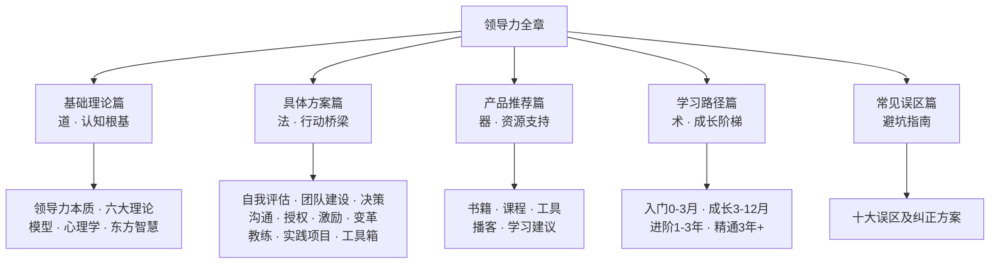
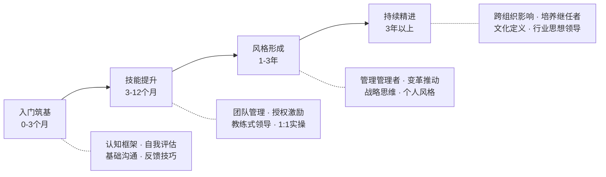

# 本章小结：从认知到行动的领导力全景回顾

## 全章知识地图

在进入具体内容回顾之前，先用一张知识地图串联本章的完整结构。领导力的学习遵循"道法术器"的层次逻辑：理论（道）告诉你"为什么"，方案（法）告诉你"做什么"，工具（器）告诉你"用什么做"，而学习路径则规划了"何时做、怎么做"的成长阶梯。



---

## 核心要点回顾

### 一、领导力的本质——影响力而非权力

本章开篇即确立了一个根本性认知：**领导力的本质是影响力，而非权力和职位**。这一判断有三重含义：

1. **无职位亦可领导**：一个没有正式管理头衔的人，通过专业能力、人格魅力和主动承担，完全可以展现出卓越的领导力。技术骨干推动团队采纳最佳实践、实习生在项目中协调各方资源——这些都是领导力的真实体现
2. **有职位未必领导**：约翰·麦克斯韦尔的判断一针见血——"如果人们只是因为你的职位而跟随你，那不是领导力，那是服从。"仅靠权力驱动的领导，短期能出结果，长期必然丧失信任
3. **领导力可习得**：特质理论只能解释10%-20%的领导效能差异，行为理论证明领导行为可以分解和学习，神经科学证实共情、情绪调节等核心能力具有可塑性。Zenger Folkman对5万名领导者的360度评估数据表明，刻意发展行为与领导效能高度相关

这一认知是一切后续学习的基石——只有当你相信领导力可以被学习和提升时，你才会真正投入时间和精力去发展它。

### 二、理论框架——六大经典理论与辅助模型

本章系统梳理了领导力领域的六大经典理论，每一理论都回答了一个核心问题：

| 理论 | 核心问题 | 关键贡献 | 实战价值 |
|------|---------|---------|---------|
| 特质理论 | 领导者有什么共同特质？ | 识别自信、果断、外向等领导力相关特质 | 明确自我发展的方向和起点 |
| 行为理论 | 领导者做什么？ | 将领导行为分解为"关心人"和"关注任务"两个维度 | 行为可学习，为刻意练习提供靶点 |
| 情境领导理论 | 不同情境需要什么风格？ | 根据下属能力和意愿匹配指导/支持/授权/教练四种风格 | 避免"一招鲜"，灵活应对不同下属 |
| 变革型领导理论 | 如何超越交易关系？ | 通过愿景激励、智力激发、个性化关怀、理想化影响推动变革 | 在VUCA时代引领团队穿越不确定性 |
| 服务型领导理论 | 如何通过服务实现领导？ | 领导者的首要角色是服务者，先问"我能为团队做什么" | 建立深层信任，激发内在承诺 |
| 真实型领导理论 | 如何在领导中保持真实？ | 自我觉察、关系透明、内化道德观、平衡信息加工 | 避免"面具领导"的疲惫和信任危机 |

除了六大理论，本章还介绍了三组辅助框架：

- **团队管理模型**：塔克曼模型（组建→风暴→规范→高效）描述团队发展的四个阶段特征和对应策略；贝尔宾团队角色理论帮你识别团队中的九种角色，实现能力互补
- **授权理论**：从"命令-控制"到"信任-赋能"的范式转变，授权四象限帮助你根据任务重要性和下属成熟度决定授权程度
- **激励理论**：马斯洛需求层次提供宏观框架，赫茨伯格双因素理论区分保健因素和激励因素，自我决定理论（SDT）聚焦自主性、胜任感、归属感三大基本心理需求

理论的价值不在于背诵，而在于**在关键时刻调用**。当你面对不配合的下属时，能想到情境领导理论——"也许不是他不行，而是我的领导方式不匹配"；当你接手士气低落的团队时，能想到变革型领导——"他们需要的不是更严格的KPI，而是愿景和意义感"。

### 三、实践方案——十大核心能力详解

理论落地为行动，本章在具体方案篇聚焦十大核心能力维度：

**1. 领导力自我评估——起点即觉察**

提升领导力的第一步不是学习新技能，而是看清自己在哪里。本章提供了多维度自评工具：基于布莱克-莫顿管理方格的风格自测、360度反馈问卷设计模板、SWOT分析在领导力中的应用、价值观排序工具。核心观点是——大多数领导力问题的根源不是能力不足，而是缺乏对自己行为模式的认知。

**2. 团队建设——从个体到团队的转化**

团队建设覆盖完整生命周期：选人（贝尔宾角色互补）、建规（团队章程编写）、磨合（塔克曼四阶段应对）、文化塑造（仪式、符号、故事、制度四要素）、远程团队管理（信任建立、异步沟通、文化融合）。核心洞察是——团队不是"把人凑在一起"，而是通过结构化设计让1+1>2。

**3. 决策与问题解决——在不确定中做出判断**

提供了五种决策工具：决策矩阵（多选项加权评分）、OODA循环（观察-定向-决策-行动的快速决策）、预验尸法（假设失败以提前发现风险）、数据驱动决策（建立决策仪表盘）、危机决策（快速、透明、可逆三原则）。核心观点是——领导者的每一个决策都影响团队方向，结构化工具能显著降低决策偏差。

**4. 沟通与影响力——领导力的核心载体**

领导力的落地几乎全部依赖沟通。本章覆盖愿景传达（将战略翻译为日常行动）、一对一沟通（开场-核心-行动结构）、向上汇报（让上级理解并支持你的决策）、非职权影响力（西奥迪尼六大原则的应用）、困难对话（绩效不佳、冲突调解、负面反馈）。核心观点是——沟通不是"把话说清楚"，而是"让对方愿意听、听得懂、愿意做"。

**5. 授权与赋能——释放杠杆效应**

不会授权的领导者终将成为团队瓶颈。本章提供了授权四象限、授权五步法（说明目标→给予资源→设定检查点→容错空间→复盘反馈）、反授权陷阱识别（下属七种经典推责话术及应对）、赋能型授权的心态转变。核心观点是——授权不是"甩手不管"，而是"我在你身后，但你来主导"。

**6. 激励方法——点燃内在驱动力**

物质激励有天花板，精神激励才有持续性。本章将三大激励理论落地为实操方案：马斯洛需求层次在现代职场的重新解读、赫茨伯格双因素的保健/激励区分、SDT三要素的日常管理应用。同时提供了个性化激励方案设计（按世代、按性格类型）和非物质激励工具箱（认可仪式、成长机会、弹性工作、挑战性任务）。核心观点是——钱只是保健因素，成长和意义感才是真正的激励因素。

**7. 变革管理——引领团队穿越变革**

变革是领导者的最高难度挑战。本章基于科特变革八步模型和ADKAR模型，覆盖变革阻力分析（损失厌恶、不确定性恐惧、利益冲突、习惯惯性四重根源）、变革沟通策略、勒温模型（解冻-变革-再冻结）的实操要点、变革失败五大原因及预防。核心观点是——变革失败的首要原因不是方案不好，而是人心没准备好。

**8. 教练式领导——从给答案到问问题**

教练式领导是当下最受推崇的领导风格之一。本章详解GROW模型实操（完整对话示例）、有力提问的设计方法（开放式/假设性/挑战性问题）、深度倾听三层次（听到内容、听到情绪、听到意图）、教练对话与管理指令的切换时机。核心观点是——最高级的领导力不是"我告诉你怎么做"，而是"我帮你找到你自己的答案"。

**9. 领导力实践项目——在实战中成长**

提供了六个经过验证的实践项目：新团队90天融入计划、跨部门项目领导力实战、导师制的启动和运营、领导力读书会组织、社区/公益项目领导力实践、向上管理专项练习。每个项目都有明确的目标、步骤、评估标准和预期收获。核心观点是——领导力70%靠实践，不实践等于零。

**10. 领导力提升工具箱——即拿即用**

将所有模板、清单和框架汇总为可直接使用的工具包：团队章程模板、360度反馈问卷、一对一会议记录模板、决策矩阵模板、授权计划表、团队健康度评估表、领导力自评量表、变革管理检查清单。

### 四、学习路径——四阶段成长阶梯

本章设计了一条清晰的四阶段成长路径，遵循70-20-10法则（70%实践、20%互动、10%课堂学习）：



每个阶段都有具体的周计划、推荐资源、实践任务和评估标准，确保学习的系统性和可操作性。

### 五、常见误区——十大陷阱与纠正方案

本章揭示了领导力提升中最常见的十大认知陷阱：

| # | 误区 | 错误逻辑 | 正确认知 |
|---|------|---------|---------|
| 1 | 领导力等于权力 | 有职位才有领导力 | 影响力才是核心，职位只是放大器 |
| 2 | 事事亲力亲为 | 自己做才最放心 | 领导力的核心是通过他人完成任务 |
| 3 | 严厉才能服众 | 铁腕手段建立权威 | 尊重和信任比恐惧更能激发承诺 |
| 4 | 领导要解决所有问题 | 好领导无所不能 | 引导团队自己找到答案更高级 |
| 5 | 领导力是天生的 | 基因决定论 | 80%以上取决于行为和学习 |
| 6 | 领导力就是做好人 | 讨好所有人 | 真正的领导力需要做艰难的正确决定 |
| 7 | 开会就是领导力 | 开会=管理 | 会议只是工具，过度开会是领导力缺失 |
| 8 | 只适用于工作场景 | 领导力是职场专属 | 生活处处是领导力场景 |
| 9 | 追随理论就能成功 | 照搬理论框架 | 理论是地图，实践才是旅程 |
| 10 | 提升是一蹴而就的 | 学一次就够了 | 领导力是终身修行 |

---

## 知识体系自检清单

读完本章，你可以用以下清单检验自己对知识体系的掌握程度。每一项如果能给出具体答案，说明你已掌握；如果犹豫或空白，建议回到对应章节复习。

**理论层（道）**
- [ ] 能用自己的话解释领导力与管理的核心区别
- [ ] 能列举并比较至少三种领导力理论的核心观点
- [ ] 能说出情境领导理论的四种风格及其适用条件
- [ ] 能解释变革型领导的四个维度
- [ ] 能说明塔克曼模型的四个阶段及对应策略
- [ ] 能区分赫茨伯格双因素中的保健因素和激励因素

**方案层（法）**
- [ ] 能描述自己的领导风格倾向（基于自评工具的结果）
- [ ] 能说出授权五步法的具体步骤
- [ ] 能描述GROW教练模型的四个环节
- [ ] 能说明决策矩阵的使用方法
- [ ] 能列举至少三种非职权影响力策略
- [ ] 能说出科特变革八步模型的前三个步骤

**工具层（器）**
- [ ] 使用过至少一个本章推荐的自评工具
- [ ] 写过或看过团队章程模板
- [ ] 使用过SBI反馈模型进行过至少一次反馈
- [ ] 用决策矩阵做过至少一次决策

---

## 关键行动建议：从知道到做到

领导力提升的最大鸿沟不是"不知道"，而是"知道但做不到"。以下三个行动建议，每一个都配有具体的执行模板，帮你跨越知行鸿沟。

### 行动一：从自我认知开始——建立你的领导力画像

**为什么重要**：没有自我认知的领导力提升是盲目的。你可能花大量时间学习沟通技巧，但真正阻碍你的是决策犹豫；你可能苦练演讲能力，但团队真正需要的是你学会倾听。

**执行步骤**：

1. **完成至少两种自评工具**（第1周）
   - DISC行为风格评估：了解你的行为倾向（支配型D/影响型I/稳健型S/谨慎型C）
   - 领导力风格自测（基于布莱克-莫顿方格）：定位你在"任务导向-关系导向"坐标中的位置

2. **发起一次360度反馈**（第2周）
   - 选择5-8位反馈者：1-2位上级、2-3位同级、2-3位下属
   - 使用本章提供的问卷模板，匿名收集
   - 重点看"自我认知"与"他人认知"之间的差距——那些差距就是你的盲区

3. **绘制领导力画像**（第3周）
   - 将自评结果和360度反馈汇总，用SWOT框架整理
   - 识别2-3个最突出的优势（继续发挥）和2-3个最关键的盲区（重点提升）
   - 写成一页纸的"我的领导力画像"，贴在你能每天看到的地方

```text
┌─────────────────────────────────────────────┐
│            我的领导力画像（示例）               │
├──────────┬──────────┬──────────┬──────────────┤
│  优势     │  盲区     │  机会     │  威胁        │
├──────────┼──────────┼──────────┼──────────────┤
│ 专业能力强 │ 授权不足  │ 新项目需要 │ 时间压力导致  │
│ 决策果断   │ 倾听不够  │ 带更大团队 │ 回到微观管理  │
│ 目标清晰   │ 激励单一  │ 学习教练  │              │
│           │          │ 式领导    │              │
└──────────┴──────────┴──────────┴──────────────┘
```

### 行动二：在实践中刻意练习——每周一个领导力实验

**为什么重要**：领导力不是知识，而是能力。能力只能通过实践获得，就像游泳不能靠看书学会。70-20-10法则告诉我们，70%的领导力成长来自于工作中的实际挑战。

**执行步骤**：

1. **选择练习焦点**（每周一）
   - 从本章内容中选一个具体的技巧或方法
   - 例如：本周练习"有力提问"，下周练习"建设性反馈"

2. **设计实验方案**（每周一）
   - 明确目标：这周我要在什么场景下练习什么行为？
   - 设定指标：我怎么知道自己做得好不好？
   - 例如："本周在3次一对一会议中，每次至少提出2个开放式问题，并观察对方的反应"

3. **执行并记录**（全周）
   - 每次练习后立即记录：做了什么、效果如何、对方反应
   - 用手机备忘录或专门的反思日志本

4. **周末复盘**（每周日15分钟）
   - 这周的实验成功了吗？为什么成功/失败？
   - 下周想练习什么？

**12周实验清单参考**：

| 周次 | 实验主题 | 具体练习 |
|------|---------|---------|
| 第1周 | 深度倾听 | 每次对话中不打断，复述对方核心观点 |
| 第2周 | 有力提问 | 每次1:1中使用开放式问题，避免封闭式 |
| 第3周 | SBI反馈 | 对3位同事给出具体的行为反馈 |
| 第4周 | 愿景传达 | 用1分钟向团队解释"为什么做这件事" |
| 第5周 | 授权练习 | 选一项任务完整执行授权五步法 |
| 第6周 | 认可激励 | 每天对一位同事表达具体认可 |
| 第7周 | 决策练习 | 用决策矩阵做一次真实的工作决策 |
| 第8周 | 教练对话 | 用GROW模型做一次教练式沟通 |
| 第9周 | 冲突处理 | 主动面对一次回避已久的冲突 |
| 第10周 | 向上管理 | 向上级做一次结构化的方案汇报 |
| 第11周 | 变革沟通 | 向团队传达一次变化并观察反应 |
| 第12周 | 综合复盘 | 回顾12周成长，更新领导力画像 |

### 行动三：建立持续反思的习惯——将经验转化为能力

**为什么重要**：哈佛商学院的研究表明，"反思"是将经验转化为能力的关键机制。没有反思的经验只是重复，有反思的经验才是成长。Zenger Folkman的研究进一步证实，定期反思的领导者成长速度是不反思者的2.5倍。

**执行步骤**：

1. **建立每日反思习惯**（5分钟）
   - 每天工作结束前，回答三个问题：
     - 今天我做了什么"领导行为"？（哪怕只是一次有意识的倾听）
     - 效果如何？对方的反应是什么？
     - 如果重来一次，我会怎么做？

2. **建立每周反思习惯**（15分钟）
   - 每周日花15分钟回顾：
     - 这周最大的领导力收获是什么？
     - 这周犯了什么错误？从中学到了什么？
     - 下周想重点提升哪个方面？

3. **建立季度反思习惯**（1小时）
   - 每季度做一次深度反思：
     - 重新做一次360度反馈，对比上次的结果
     - 更新"我的领导力画像"
     - 调整下一季度的学习重点

**反思日志模板**：

```text
日期：____年____月____日
场景：________________________________
领导行为：________________________________
效果评估：________________________________
改进方向：________________________________
一句话感悟：______________________________
```

---

## 领导力成长的关键转折点

在领导力成长的旅程中，有几个关键的认知转折点。识别并跨越这些转折点，往往意味着一次质的飞跃。

**转折点一：从"做事"到"通过他人做事"**

这是新晋管理者面临的第一个根本性转变。你之所以被提拔，往往是因为你个人能力强、执行力高。但成为领导者后，你的成功标准从"我做得多好"变成了"团队做得多好"。不会授权的领导者终将成为团队的天花板。

**转折点二：从"给答案"到"问问题"**

当团队成员带着问题来找你时，最本能的反应是给出答案。但每次你给答案，都在强化团队对你的依赖。教练式领导的核心转变是——通过有力的提问帮助对方自己找到答案。这需要更多耐心，但回报是团队能力的持续增长。

**转折点三：从"管理绩效"到"激发意义"**

初级管理者关注"做了没有、做得好不好"，高级领导者关注"为什么做、做的意义是什么"。当团队成员不仅仅为了薪水工作，而是为了一个有意义的目标而努力时，你获得的是承诺而不仅是服从。

**转折点四：从"个人英雄"到"培养英雄"**

最高层次的领导力不是你自己有多厉害，而是你能培养出多少比你更厉害的人。当你开始把"培养继任者"作为核心职责之一时，你就进入了领导力的精通阶段。

---

## 本章核心公式

将整章内容浓缩为三个核心公式：

```text
领导力 = 影响力 ≠ 权力

领导力成长 = 理论学习(10%) + 互动反馈(20%) + 实践锻炼(70%)

领导效能 = 自我认知 × 情境适应 × 持续学习
```

第一个公式定义了领导力的本质，第二个公式指明了成长路径，第三个公式揭示了效能的三个乘数——任何一项为零，整体效能为零。

---

## 寄语：一场值得终身投入的修行

领导力是一场终身的修行，而非一门可以速成的技能。

在这条路上，你会经历三个阶段的考验：**笨拙期**——第一次授权被反授权、第一次反馈被误解、第一次变革遭遇阻力，你会怀疑自己是否适合当领导者；**适应期**——你开始找到自己的节奏，某些领导行为变得自然，团队开始给你正反馈，但偶尔仍会退回到旧习惯；**内化期**——领导力不再是"额外的工作"，而成为你思考和行动的默认模式，你开始享受通过他人达成目标的成就感。

每一次挑战都是成长的机会，每一次错误都是学费，每一次反思都在积累。正如彼得·德鲁克所言："管理是把事情做对，领导是做对的事情。"愿你在领导力的道路上，既有做对事情的智慧，也有把事情做对的能力。

从今天开始，选择本章中你最认同的一个行动建议，立刻执行。不需要完美，不需要等到"准备好了"。领导力提升的旅程，从第一步开始。
