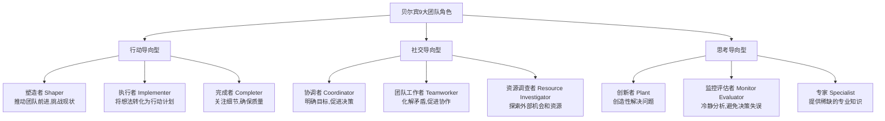
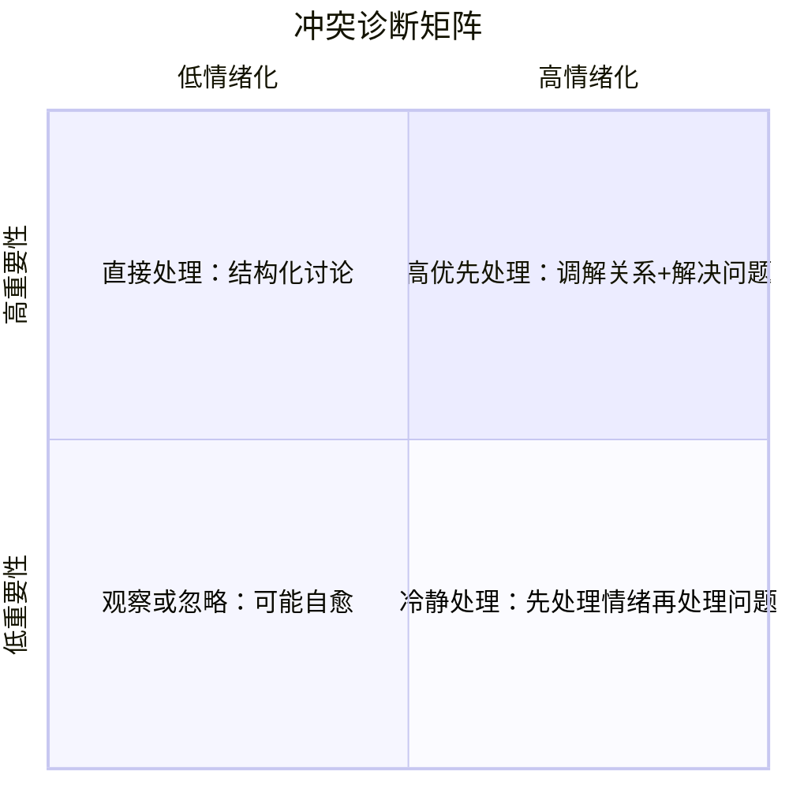
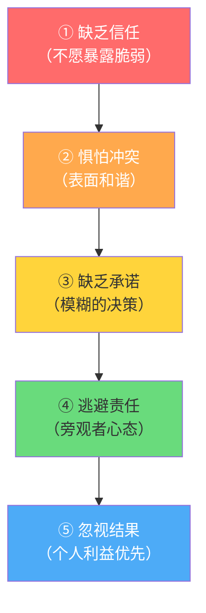
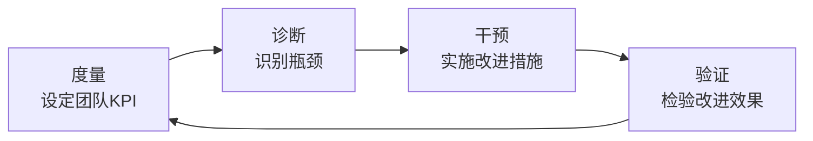
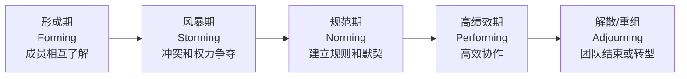

## 二、团队建设策略

团队不是一群人的简单聚合，而是一个有机的生命体。领导力大师帕特里克·兰西奥尼（Patrick Lencioni）说过："不是因为有了优秀的团队才能打胜仗，而是因为打胜仗的方式造就了优秀的团队。"团队建设不是一次性活动，而是一项贯穿团队生命周期的系统工程——从组建、磨合、规范到高绩效运转，每个阶段都有独特的挑战和策略。

本节将从团队组建的顶层设计出发，逐步深入文化塑造、冲突管理、效能提升、远程团队管理、团队进化与更新、领导者自我修炼等核心领域，为读者提供一套完整、可落地的团队建设方法论。

---

### 2.1 团队组建策略

#### 2.1.1 从"为什么"开始：使命与目标的顶层设计

组建团队的第一步不是招人，而是回答一个根本问题：**这个团队为什么存在？**

西蒙·斯涅克（Simon Sinek）的"黄金圆环"理论指出，高效的组织总是从"为什么"出发，然后才是"怎么做"和"做什么"。团队组建亦是如此。在招募第一个成员之前，领导者必须对以下四个核心问题有清晰的答案：

| 核心问题 | 说明 | 示例 |
|---------|------|------|
| 团队存在的目的是什么？ | 团队的终极使命 | "打造行业领先的用户体验" |
| 团队需要达成的核心目标是什么？ | 可衡量的具体目标 | "Q3前将用户留存率从45%提升至65%" |
| 成功的标准是什么？ | 判断团队是否成功的关键指标 | "NPS评分≥70，客户投诉率<2%" |
| 团队的时间框架是怎样的？ | 阶段性里程碑和最终截止日期 | "6个月内完成产品MVP上线" |

将这些答案凝练为一段简洁有力的**团队使命宣言**。好的使命宣言具备SMART特征：具体（Specific）、可衡量（Measurable）、可实现（Achievable）、相关性（Relevant）和有时限（Time-bound）。

**案例对比：**

| 类型 | 示例 | 问题 |
|------|------|------|
| ❌ 差的使命宣言 | "我们要做得更好" | 模糊、不可衡量、没有方向 |
| ✅ 好的使命宣言 | "在6个月内，通过优化核心功能和用户引导流程，将新用户7日留存率从30%提升至55%" | 具体、可衡量、有时限、可实现 |

使命宣言不仅仅是一段文字，它是团队的"北极星"。在后续的招聘、决策、优先级排序中，所有行动都应能追溯到这个使命。

#### 2.1.2 角色与能力的精准匹配

有了目标，下一步是回答：**实现这个目标需要什么样的人？**

**贝尔宾团队角色理论（Belbin Team Roles）** 是团队角色分配的经典框架。贝尔宾通过大量实证研究发现，成功的团队通常涵盖以下9种角色，且每个人通常擅长2-3种角色：



**四步完成能力匹配：**

**第一步：绘制能力地图**

列出达成目标所需的全部关键能力，分为"必须有"（Must-have）和"最好有"（Nice-to-have）两个层级。

示例——组建一个SaaS产品团队的能力地图：

必须有：
├── 产品规划与需求分析（产品负责人）
├── UI/UX设计（设计师）
├── 前端开发（React/Vue工程师）
├── 后端开发（Node/Go/Java工程师）
├── 项目管理与进度跟踪（项目经理）
└── 测试与质量保障（QA工程师）

最好有：
├── 数据分析能力（全员）
├── 技术写作（文档工程师）
├── 安全合规（安全工程师）
└── 用户研究（用研分析师）

**第二步：评估现有资源**

对每位候选人/现有成员进行多维度评估。评估方法包括：

- **一对一深度访谈**：了解过往经历、职业动机、工作风格
- **能力测评工具**：如DISC行为风格测试、MBTI性格测试、CliftonStrengths优势测评
- **过往工作成果审查**：看实际产出而非简历描述
- **试用任务（Work Sample Test）**：通过实际的小型任务观察真实能力
- **360度反馈**：向候选人的前同事、下属、上级收集多维度评价

**第三步：识别能力缺口**

将能力地图与现有资源进行比对，用红（缺）、黄（弱）、绿（强）三色标记每个能力项的覆盖程度。

**第四步：有针对性地补充**

补充缺口的方式不限于外部招聘，还可以通过：

| 方式 | 适用场景 | 成本 | 见效速度 |
|------|---------|------|---------|
| 外部招聘 | 关键能力完全缺失 | 高（时间+金钱） | 慢（1-3个月） |
| 内部调配 | 组织内有潜力人才 | 低 | 中（2-4周） |
| 外部培训 | 团队有基础但需要提升 | 中 | 中（1-2个月） |
| 顾问/外包 | 阶段性需求或专业领域 | 中-高 | 快（1-2周） |
| 工具替代 | 某些重复性工作 | 低-中 | 快（即刻） |

#### 2.1.3 团队规模的科学决策

团队规模是被严重低估的组建决策。哈佛商学院教授理查德·哈克曼（J. Richard Hackman）的研究表明，**团队规模与效能之间的关系是非线性的**——超过某个临界点，增加人员不仅不能提升效能，反而会降低。

**团队规模的"两个披萨"法则：**

亚马逊创始人杰夫·贝佐斯提出：如果两个大号披萨不够团队吃的，说明团队太大了。实际操作中，这对应6-10人的规模。

不同规模团队的特征对比：

| 维度 | 小团队（3-5人） | 中团队（6-10人） | 大团队（11+人） |
|------|----------------|-----------------|----------------|
| 沟通效率 | 极高，面对面即可 | 较高，需要结构化 | 低，需要正式机制 |
| 决策速度 | 快，容易达成共识 | 中等 | 慢，容易陷入委员会决策 |
| 创新能力 | 依赖成员多样性 | 最佳平衡点 | 容易出现群体思维 |
| 成员归属感 | 强 | 较强 | 弱，容易出现小圈子 |
| 管理难度 | 低 | 中等 | 高，需要层级结构 |
| 适用场景 | 创业初期、专项攻关 | 产品团队、业务团队 | 大型项目、矩阵组织 |

**实践建议：** 如果任务需要超过10人，不要组建一个大团队，而是将其拆分为多个小团队，每个团队有明确的职责边界和协调机制。

#### 2.1.4 团队画布：一页纸定义团队全景

团队画布（Team Canvas）是一个视觉化工具，帮助团队在组建初期对齐关键要素。建议在团队成立后的第一周内，由全体成员共同填写：

┌──────────────────────────────────────────────────────────────┐
│                      团队使命与目标                           │
│  我们为什么存在？要达成什么？成功的标志是什么？                │
├────────────────────┬────────────────┬────────────────────────┤
│     角色清单        │    能力需求     │     现有资源            │
│  每个人的职责边界   │  必须有 vs 好有 │  团队已有/待补充        │
│  谁负责最终决策？   │  短期 vs 长期   │  工具/预算/外部支持     │
├────────────────────┴────────────────┴────────────────────────┤
│                    团队运作规范与价值观                       │
│  3-5条核心价值观  │  沟通频率与方式  │  决策机制  │  冲突处理  │
├──────────────────────────────────────────────────────────────┤
│                   关键里程碑与阶段性目标                      │
│  第1个月：_____  │  第3个月：_____  │  第6个月：_____         │
│  关键风险：_____ │  依赖条件：_____ │  备选方案：_____        │
└──────────────────────────────────────────────────────────────┘

**填写技巧：** 不要由领导者单方面填写，而是组织一次2-3小时的工作坊，让所有成员共同参与。共识在过程中形成，比最终的文档更重要。

---

### 2.2 团队文化塑造

文化不是写在墙上的标语，而是团队在无人监督时的行为。正如管理学大师彼得·德鲁克所言："文化把战略当早餐吃掉。"（Culture eats strategy for breakfast.）再完美的战略，如果没有匹配的文化来执行，都只是空中楼阁。

#### 2.2.1 定义团队价值观：从口号到行为

价值观是文化的基石。但很多团队的价值观停留在"口号"阶段，根本原因是缺乏行为化的定义。

**三步将价值观从口号变为行为：**

**第一步：共同讨论确定3-5条核心价值观**

价值观不能由领导者单方面宣布，必须经过团队讨论达成共识。引导讨论的方法：

1. 每人写3个"你认为团队最重要的品质"（匿名）
2. 收集汇总，去重合并
3. 投票选出前5条
4. 对每条进行行为化定义

**第二步：为每条价值观定义"做"与"不做"**

这是关键步骤。每条价值观必须有具体的行为描述，否则无法执行。

| 价值观 | ✅ 我们这样做 | ❌ 我们不这样做 |
|--------|--------------|----------------|
| **坦诚沟通** | 发现问题在24小时内直接找当事人沟通 | 背后议论、通过第三方传话、沉默积累不满 |
| **结果导向** | 用数据和成果说话，每周复盘关键指标 | 用"我很忙"代替成果汇报，强调过程而非结果 |
| **持续学习** | 每月至少分享一次学习心得，鼓励尝试新方法 | 因为害怕失败而拒绝尝试，惩罚犯错的成员 |
| **互助协作** | 主动帮助遇到困难的队友，团队成功优先于个人 | 只扫门前雪，拒绝分享信息和资源 |
| **用户至上** | 每个决策先问"这对用户有什么好处" | 为了内部方便牺牲用户体验 |

**第三步：融入日常运作**

价值观不是月初提一次、月末忘掉的东西，必须嵌入团队的日常流程：

- **招聘**：面试中加入价值观匹配评估（行为面试题）
- **绩效评估**：价值观践行情况占绩效评估权重的20-30%
- **日常决策**：遇到两难选择时，用价值观作为决策依据
- **团队会议**：每次会议留5分钟分享"本周价值观践行故事"
- **表彰机制**：设立"价值观践行奖"，由团队成员互评

#### 2.2.2 建立团队仪式：文化的行为载体

仪式是文化的具象化表达。没有仪式的文化是空中楼阁，没有文化的仪式是形式主义。

**四大核心团队仪式：**

**仪式一：每日站会（Daily Standup）**

| 要素 | 说明 |
|------|------|
| 频率 | 每天同一时间 |
| 时长 | 严格控制在15分钟以内 |
| 形式 | 站着开（物理上或虚拟上），避免坐着闲聊 |
| 每人回答三个问题 | ① 昨天完成了什么？② 今天计划做什么？③ 遇到什么阻碍？ |
| 会后处理 | 阻碍事项由负责人跟进，不在站会上深入讨论 |

**站会的常见误区与纠正：**

| 误区 | 表现 | 纠正方法 |
|------|------|---------|
| 变成汇报会 | 成员向领导汇报，而不是团队同步 | 领导不要站在最显眼的位置，强调"这是团队的会" |
| 时间失控 | 一个人讲10分钟 | 使用计时器，每人限时2分钟 |
| 流于形式 | "昨天继续做那个，今天还是做那个" | 要求说具体任务和进度百分比 |
| 阻碍无人跟进 | 每天都说有阻碍但从不解决 | 指定阻碍负责人和解决截止时间 |

**仪式二：周度复盘（Weekly Review）**

周度复盘的核心结构（建议周五下午，45-60分钟）：

1. 目标回顾（10分钟）
   - 本周目标完成情况（完成率、偏差原因）
   - 关键数据指标变化

2. 亮点回顾（10分钟）
   - 本周做得好的3件事
   - 谁值得特别感谢？为什么？

3. 改进探讨（15分钟）
   - 本周最大的挑战/问题是什么？
   - 根因分析（连续追问5个为什么）
   - 下周如何避免类似问题？

4. 下周计划（10分钟）
   - 下周最重要的3个目标
   - 每个目标的负责人和完成标准

**仪式三：月度分享会（Monthly Sharing）**

每月由一位团队成员主导一次30-60分钟的分享。主题不限于专业领域，也可以是个人成长心得、行业趋势洞察、书籍读书分享。

**实施要点：**
- 提前一个月排好分享顺序，每人每年至少分享1-2次
- 分享者提前一周提交提纲，接受团队的反馈和建议
- 分享后留15分钟自由讨论时间
- 建立"知识库"，将分享内容沉淀为文档

**仪式四：季度团建（Quarterly Team Building）**

好的团建不是吃喝玩乐，而是有目的的"共同经历"。

| 团建类型 | 示例 | 核心价值 |
|---------|------|---------|
| 协作挑战 | 密室逃脱、野外定向、团队编程竞赛 | 培养协作默契 |
| 知识拓展 | 参观行业展览、邀请外部专家交流 | 拓宽视野 |
| 公益活动 | 社区服务、公益项目 | 建立使命感 |
| 休闲放松 | 短途旅行、运动比赛 | 增进情感连接 |

**团建的核心原则：** 自愿参加（强制参加的团建是反团建的）、有明确目的、结束后有复盘。

#### 2.2.3 营造心理安全感：谷歌的终极发现

谷歌耗资数百万美元的"亚里士多德项目"（Project Aristotle）研究了180多个团队后得出一个结论：**心理安全感是高效团队最重要的特征**，远超成员的个人能力、团队组成或管理结构。

心理安全感的定义：团队成员相信，自己可以自由地表达想法、提出质疑、承认错误，而不会因此受到惩罚、嘲笑或报复。

**领导者营造心理安全感的七个具体行为：**

**行为一：以身作则展示脆弱**

领导者主动承认自己的错误和不确定，是建立心理安全感最有力的行为。

场景对比：

❌ 缺乏安全感的领导：
  "这个方案是我深思熟虑的决定，执行就好。"

✅ 展示脆弱的领导：
  "这个方案我有70%的把握，但在技术实现上我不太确定。
   老张，你比我懂这块，你觉得有哪些风险我可能没考虑到？"

**行为二：鼓励提问而非惩罚无知**

在团队中建立"没有蠢问题"的文化。具体做法：

- 当有人提问时，先说"这是个好问题"，然后认真回答
- 领导者自己也要提问，尤其问"我有什么遗漏的吗？"
- 在会议中设置专门的"提问时间"

**行为三：用建设性反馈替代批评**

反馈公式：**观察 → 影响 → 期望 → 支持**

❌ 批评式反馈：
  "你这个报告写得太差了，逻辑混乱。"

✅ 建设性反馈：
  "我注意到报告第三部分的数据分析（观察），读起来有点跳跃，
   可能影响决策者的理解（影响）。我建议在每个数据结论后面
   加一段简要的解释（期望）。如果你需要，我可以帮你过一遍
   这部分（支持）。"

**行为四：区分"聪明的错误"和"愚蠢的错误"**

| 类型 | 定义 | 应对方式 |
|------|------|---------|
| 聪明的错误 | 在合理推断和充分准备后尝试新方法，但结果不如预期 | 包容、鼓励、复盘学习 |
| 愚蠢的错误 | 忽视已知规则、不做基本准备、重复犯同样的错 | 纠正、辅导、设定改进计划 |

**行为五：确保平等发言权**

会议中的发言分布是心理安全感的晴雨表。如果每次会议都是同样的2-3个人在说，其他人沉默，说明团队存在安全感问题。

**实践方法：**
- 使用"轮流发言"机制，确保每个人都有表达机会
- 对远程参与者给予额外关注（"小王，你那边有什么想法？"）
- 采用"先写后说"模式：先让所有人把想法写下来，再轮流分享
- 对内向的成员提供会后反馈的渠道（一对一、文字）

**行为六：对"坏消息"的即时回应**

当团队成员带来坏消息时，领导者的第一个反应决定了这个团队未来是否有人敢报告问题。

关键原则：永远奖励"报忧者"，惩罚"捂盖子的人"

✅ 正确反应："谢谢你提前告诉我，这给了我们时间应对。"
❌ 错误反应："怎么现在才说？""你是怎么搞的？"

**行为七：创建"无惩罚"复盘文化**

每次项目结束后，进行"无指责复盘"（Blameless Postmortem）。核心原则：

- 聚焦于"发生了什么"和"为什么会发生"，而非"谁的错"
- 将失败视为系统问题而非个人问题
- 每次复盘产出具体的改进措施，而非空泛的"下次注意"

---

### 2.3 冲突管理

冲突是团队成长的必然产物。管理学研究表明，完全避免冲突的团队通常绩效平庸，因为他们在回避真正需要讨论的问题。关键不是消除冲突，而是**将冲突从破坏性力量转化为建设性力量**。

#### 2.3.1 冲突的三种类型与诊断

| 冲突类型 | 内容 | 性质 | 处理策略 |
|---------|------|------|---------|
| **任务冲突** | 关于"做什么"和"目标"的分歧 | 通常是**有益的**，能提升决策质量 | 引导、结构化讨论、用数据说话 |
| **关系冲突** | 关于"人际关系"和"性格"的摩擦 | 通常是**有害的**，损害信任和士气 | 调解、建立边界、必要时调整团队 |
| **流程冲突** | 关于"怎么做"和"谁来做"的争议 | **中性**，需要及时解决 | 明确规范、重新定义职责、协商流程 |

**冲突诊断矩阵：**

当冲突发生时，首先用以下矩阵判断冲突的性质和应对策略：



#### 2.3.2 冲突解决五步法

**第一步：冷静期（Cool Down）**

在情绪激动时做出的决定通常是错误的。当冲突双方情绪激动时：

- 暂停讨论，明确告知"我们先休息15分钟"
- 给双方独立冷静的空间
- 领导者利用这段时间思考冲突的深层原因
- 设定恢复讨论的明确时间（不要无限期搁置）

**第二步：倾听理解（Understand）**

分别与双方进行一对一谈话，目标是理解每个人的：
- **事实认知**：在他们看来发生了什么？
- **情感体验**：他们感受到什么？（愤怒、委屈、被忽视？）
- **核心诉求**：他们真正想要的是什么？（通常表面的争论掩盖了深层的需求）

**倾听技巧：**
- 不打断、不评判
- 使用复述确认："你刚才说的是……，我理解得对吗？"
- 关注情绪而非仅仅是事实："听起来你觉得自己的贡献被忽视了。"

**第三步：寻找共识（Find Common Ground）**

在双方立场背后，通常存在共同的目标和利益。引导双方看到这些共同点：

引导话术：
"你们都希望这个项目成功，对吗？"
"你们都认为产品质量是最重要的，对吗？"
"在这个共同目标下，我们来看看如何解决分歧。"

**第四步：创造选项（Generate Options）**

引导双方共同头脑风暴解决方案，而不是由领导者单方面决定。关键规则：
- 数量优先于质量，先列出所有可能的方案
- 不评价、不批评
- 鼓励组合和改进他人想法
- 目标是至少产生3个可行方案

**第五步：达成协议（Commit & Execute）**

选择双方都能接受的方案，并明确：
- 具体的行动步骤是什么？
- 谁在什么时候做什么？
- 如何跟进和验证？
- 如果方案不奏效，备选方案是什么？

**协议模板：**
┌─────────────────────────────────────────────────┐
│              冲突解决方案协议                      │
├─────────────────────────────────────────────────┤
│ 日期：_____     参与人：_____                    │
│ 冲突概述：______________________________________│
│ 达成的共识：____________________________________│
│ 行动方案：                                      │
│   ① _____（负责人：_____，截止：_____）        │
│   ② _____（负责人：_____，截止：_____）        │
│   ③ _____（负责人：_____，截止：_____）        │
│ 跟进日期：_____    备选方案：__________________ │
│ 双方签名：_____    _____                        │
└─────────────────────────────────────────────────┘

#### 2.3.3 冲突预防体系

预防冲突比解决冲突的成本低10倍。建立系统性的冲突预防机制：

**预防措施一：建立清晰的沟通规范**

团队成立之初就明确沟通规范，避免因沟通方式差异引发冲突：

| 场景 | 推荐方式 | 响应时间 | 备注 |
|------|---------|---------|------|
| 紧急问题 | 电话/即时消息 | 15分钟 | 仅用于线上故障等真正紧急的事项 |
| 工作讨论 | 项目管理工具/邮件 | 4小时内 | 有上下文、可追溯 |
| 日常同步 | 即时消息 | 2小时内 | 简短问题、快速确认 |
| 深度讨论 | 面对面/视频会议 | 预约时间 | 复杂议题、敏感话题 |
| 正式决策 | 文档+会议 | 按约定 | 需要记录和存档 |

**预防措施二：定期团队健康检查**

每月进行一次团队健康度评估（匿名问卷），包含以下维度：

团队健康度评估问卷（1-5分）

1. 我在团队中可以自由表达不同意见         [ ] 分
2. 团队成员之间相互信任                   [ ] 分
3. 冲突能够被及时、公正地解决              [ ] 分
4. 我清楚自己的角色和职责                  [ ] 分
5. 团队目标是明确且可实现的                [ ] 分
6. 我的工作得到了应有的认可                [ ] 分
7. 团队的决策过程是公平透明的              [ ] 分
8. 我愿意在这个团队长期工作                [ ] 分

当某项评分连续低于3分时，需要立即关注和处理。

**预防措施三：及时处理小的分歧**

小分歧是大冲突的种子。建立"分歧升级"机制：

- 小分歧：当事双方直接沟通解决（24小时内）
- 无法自行解决：请求协调者介入（48小时内）
- 涉及多方面：组织专题讨论（一周内）
- 影响团队运作：领导层介入处理（立即）

---

### 2.4 团队效能提升

#### 2.4.1 兰西奥尼的团队协作五大障碍模型

帕特里克·兰西奥尼在《团队协作的五大障碍》中提出了团队效能的金字塔模型。这五个障碍层层递进，必须从底部开始逐层解决：



每个障碍的具体表现、危害和解决方法：

**障碍一：缺乏信任**

| 维度 | 说明 |
|------|------|
| 表现 | 不愿承认错误、不敢请求帮助、隐藏弱点、不愿给出真实反馈 |
| 危害 | 团队表面和谐但缺乏深度协作，成员各自为战 |
| 解决方法 | 个人背景介绍练习（每人分享成长经历）、行为风格测评（DISC/MBTI）、领导者率先展示脆弱性、定期一对一深度对话 |

**信任建立的具体练习——"个人历程地图"：**

在一次团队工作坊中，每人用15分钟分享以下内容（自愿选择深度）：
- 你的家乡和成长环境
- 你的第一份工作和最大的收获
- 你职业生涯中最大的挫折
- 你加入这个团队的动机
- 你最希望被团队了解的一个特质

**障碍二：惧怕冲突**

| 维度 | 说明 |
|------|------|
| 表现 | 会议上沉默、会后抱怨、避免敏感话题、过度追求和谐 |
| 危害 | 重要问题被掩盖，决策质量低下，成员不满积累 |
| 解决方法 | 建立"辩论规则"（对事不对人）、使用结构化讨论工具、在会议中主动邀请反对意见、领导者示范健康冲突 |

**结构化讨论工具——六顶思考帽：**

| 帽子颜色 | 思考角度 | 引导问题 |
|---------|---------|---------|
| ⚪ 白帽 | 事实和数据 | "我们掌握了哪些客观信息？" |
| 🔴 红帽 | 直觉和感受 | "你的直觉告诉你什么？" |
| ⚫ 黑帽 | 风险和问题 | "可能出什么错？有什么风险？" |
| 🟡 黄帽 | 价值和好处 | "这样做有什么好处？" |
| 🟢 绿帽 | 创造和替代 | "还有没有其他可能性？" |
| 🔵 蓝帽 | 流程和控制 | "我们的讨论进程如何？下一步怎么做？" |

使用方法：每次讨论一个议题时，团队按顺序"戴"不同的帽子，确保从多个角度思考问题，避免过早下结论。

**障碍三：缺乏承诺**

| 维度 | 说明 |
|------|------|
| 表现 | 决策模糊、反复讨论、会后不执行、目标不明确 |
| 危害 | 团队方向摇摆不定，执行力低下 |
| 解决方法 | 明确"同意-不同意"的界限、使用"不同意但执行"原则、决策后写入行动方案（谁、什么、什么时候）、设定明确截止日期 |

**"不同意但执行"原则（Disagree and Commit）：**

这是英特尔前CEO安迪·格鲁夫推广的决策原则。核心思想是：
1. 每个人都有充分表达意见的权利和义务
2. 一旦做出决策，即使你不同意，也要全力执行
3. 如果你不同意但无法执行，必须提前声明
4. 在执行过程中，如果发现原决策确实有误，可以重新讨论

**障碍四：逃避责任**

| 维度 | 说明 |
|------|------|
| 表现 | 对同事的问题视而不见、标准不一致、推卸责任 |
| 危害 | 低标准成为常态，高绩效成员感到不公 |
| 解决方法 | 公开目标和标准、定期公布进度、鼓励同伴间反馈、领导带头承担责任 |

**同伴问责机制——"红绿灯"报告：**

每个目标每周用红/黄/绿灯标记状态：
- 🟢 **绿灯**：按计划进行，无风险
- 🟡 **黄灯**：有风险，但团队已知并在应对
- 🔴 **红灯**：偏离目标，需要团队帮助

关键规则：**红灯不是羞耻，而是求助信号**。第一个亮红灯的人应该被感谢，而不是被批评。

**障碍五：忽视结果**

| 维度 | 说明 |
|------|------|
| 表现 | 个人目标优先于团队目标、对团队成绩无所谓、追求个人表现 |
| 危害 | 团队失去竞争力，无法达成组织目标 |
| 解决方法 | 建立团队层面的绩效指标、将团队成果与个人激励挂钩、定期庆祝团队成就、公开透明的结果展示 |

#### 2.4.2 团队效能的持续改进循环

提升团队效能不是一次性工程，而是需要持续的改进循环：



**度量维度与指标：**

| 维度 | 关键指标 | 测量方式 |
|------|---------|---------|
| 交付效能 | 需求交付周期、交付速率、缺陷率 | 项目管理工具统计 |
| 协作质量 | 沟通频率、决策速度、会议效率 | 团队健康度问卷 |
| 成员发展 | 技能提升速度、职业满意度、离职率 | 一对一对话、年度调查 |
| 创新能力 | 新想法数量、实验频率、改进提案数 | 创新看板、提案统计 |

---

### 2.5 远程与混合团队建设

后疫情时代，远程和混合办公已成为常态。远程团队面临的挑战与传统团队有显著不同，需要专门的策略。

#### 2.5.1 远程团队的核心挑战

| 挑战 | 表现 | 根因 |
|------|------|------|
| 沟通成本上升 | 信息不对称、误解增多 | 缺少非语言信号和即兴交流 |
| 归属感减弱 | 感觉"只是在做任务" | 缺少物理空间的共同体验 |
| 信任建立困难 | 难以判断队友的工作状态 | 缺少"看得见"的工作过程 |
| 工作边界模糊 | 过度工作或过度休闲 | 缺少物理空间的工作/生活隔离 |
| 新成员融入慢 | 难以快速建立关系网络 | 缺少自然的社交互动 |

#### 2.5.2 远程团队的七大最佳实践

**实践一：建立异步沟通优先的文化**

远程团队的默认沟通方式应该是异步的（文档、消息），同步沟通（会议）作为补充。

异步优先的原则：
1. 默认写文档，必要时才开会
2. 每次会议必须有议程和记录
3. 重要决策通过文档记录，而非口头传达
4. 尊重时区差异，不期望即时回复（紧急事项除外）

**实践二：定期虚拟团建**

- **虚拟咖啡时间**：每周随机配对两人进行15分钟非工作聊天
- **在线游戏**：每月一次在线团队游戏（如Among Us、狼人杀）
- **午餐直播**：每周一次的"一起吃午饭"视频连线
- **虚拟庆祝**：项目里程碑达成时的在线庆祝仪式

**实践三：建立"可视化"工作系统**

远程团队需要比传统团队更强的工作可视化系统：

- **看板系统**：使用Trello、Notion、飞书等工具，让所有任务状态透明可见
- **每日进度简报**：每人每天结束时写一段简短的进度摘要
- **周报制度**：每周提交工作周报，包含完成事项、下周计划、需要协助的事项

**实践四：刻意安排"偶然交流"**

办公室中最有价值的创新往往来自"偶然的走廊对话"。远程团队需要刻意创造这样的机会：

- 保留10-15%的"开放工作时间"——大家开着摄像头各自工作，有需要随时交谈
- 建立兴趣频道（如#读书、#健身、#美食），鼓励非工作话题的交流
- 使用Donut（Slack插件）等工具自动安排随机的一对一聊天

**实践五：明确工作时间边界**

远程团队必须明确的工作时间规范：

| 规范 | 说明 |
|------|------|
| 核心协作时间 | 每天4-6小时的重叠工作时间，全员在线 |
| 灵活工作时间 | 核心时间外，成员可自由安排 |
| 响应时间期望 | 普通消息4小时内回复，紧急事项15分钟 |
| 下班后规范 | 非紧急事项不发消息，使用"定时发送"功能 |

---

### 2.6 团队的进化与更新

团队不是静态的，它需要随着时间的推移不断进化和更新。

#### 2.6.1 团队生命周期管理

塔克曼（Tuckman）的团队发展阶段理论指出，团队通常经历四个阶段：



每个阶段领导者的角色和策略：

| 阶段 | 团队状态 | 领导者角色 | 关键策略 |
|------|---------|-----------|---------|
| 形成期 | 礼貌、试探、依赖领导 | **指导者** | 明确目标、建立规范、促进相互了解 |
| 风暴期 | 冲突、分化、质疑领导 | **教练** | 包容冲突、引导建设性讨论、调解矛盾 |
| 规范期 | 建立默契、形成规范 | **支持者** | 授权、强化正向行为、促进自主决策 |
| 高绩效期 | 高效协作、自我驱动 | **委托者** | 提供资源、扫除障碍、关注成员发展 |
| 解散/重组 | 转型或结束 | **催化者** | 总结经验、认可贡献、妥善安排成员去向 |

#### 2.6.2 团队成员的更新策略

团队成员的进出是团队进化的重要环节。当出现以下信号时，需要考虑更新团队成员：

**需要引入新成员的信号：**
- 团队长期超负荷工作，无法按时交付
- 面对新挑战时缺乏必要的技能
- 团队思维趋同，缺乏创新
- 核心成员即将离开或晋升

**需要调整现有成员的信号：**
- 价值观严重不匹配且无法改变
- 持续的低绩效且辅导无效
- 对团队氛围产生持续负面影响
- 个人发展需求与团队需求不再匹配

**处理成员离开的注意事项：**
- 尊重和体面——无论何种原因，都要给予尊重
- 充分沟通——解释原因，倾听反馈
- 知识转移——确保关键知识不会随人离开
- 团队稳定——帮助团队理解和适应变化

---

### 2.7 领导者在团队建设中的自我修炼

#### 2.7.1 团队建设中的常见领导力陷阱

| 陷阱 | 表现 | 危害 | 纠正方法 |
|------|------|------|---------|
| **微观管理** | 事无巨细都要过问，不信任成员 | 成员失去主动性，领导精疲力竭 | 明确授权边界，关注结果而非过程 |
| **英雄主义** | 什么都要自己做，不愿放手 | 团队得不到成长，领导成为瓶颈 | 有意识地让成员承担挑战性任务 |
| **偏爱少数人** | 只依赖2-3个核心成员 | 其他成员被边缘化，团队不稳定 | 公平分配机会，关注每位成员发展 |
| **回避冲突** | 为了和谐回避必要的冲突 | 问题积累，最终爆发 | 学习冲突管理技能，从小冲突开始练习 |
| **过度民主** | 所有决策都要全体同意 | 决策缓慢，责任模糊 | 区分需要共识的决策和需要效率的决策 |
| **信息囤积** | 只分享"需要知道"的信息 | 团队缺乏上下文，决策质量低 | 默认公开，仅对敏感信息设限 |

#### 2.7.2 领导者的团队建设能力自检清单

定期（建议每季度）用以下清单评估自己的团队建设能力：

团队建设能力自检（1-5分）

A. 使命与目标
  [ ] 团队每位成员都能清晰说出团队的目标和使命
  [ ] 团队目标与组织战略紧密对齐
  [ ] 目标是具体、可衡量、有时限的

B. 角色与结构
  [ ] 每位成员都清楚自己的角色和职责
  [ ] 团队的能力组合能够覆盖关键需求
  [ ] 团队规模合理，没有冗余或不足

C. 文化与氛围
  [ ] 团队价值观是具体且被践行的
  [ ] 成员敢于表达不同意见
  [ ] 团队仪式被定期执行且有实际价值

D. 协作与效能
  [ ] 团队信任度高，成员敢于暴露脆弱
  [ ] 冲突被及时处理，不会积累
  [ ] 决策快速且执行有力
  [ ] 团队成果优先于个人表现

E. 成长与进化
  [ ] 每位成员都有明确的成长路径
  [ ] 团队定期复盘并持续改进
  [ ] 团队能够适应变化和新挑战

---

### 2.8 实战工具箱

#### 工具一：团队建设日历（年度模板）

| 月份 | 仪式/活动 | 目的 |
|------|----------|------|
| 1月 | 年度目标制定工作坊 | 对齐全年目标 |
| 2月 | 团队价值观刷新 | 回顾和更新价值观 |
| 3月 | 季度复盘+团建 | Q1总结，增进关系 |
| 4月 | 技能盘点+培训计划 | 识别能力缺口 |
| 5月 | 一对一深度对话 | 了解成员诉求 |
| 6月 | 季度复盘+团建 | Q2总结，中期调整 |
| 7月 | 半年度OKR回顾 | 检查目标进展 |
| 8月 | 团队健康度评估 | 匿名问卷+行动改进 |
| 9月 | 季度复盘+团建 | Q3总结，冲刺准备 |
| 10月 | 知识分享周 | 团队互相学习 |
| 11月 | 下年度规划启动 | 前瞻性规划 |
| 12月 | 年度复盘+庆祝 | 总结经验，表彰贡献 |

#### 工具二：团队画布模板（可直接复制使用）

```markdown
## 团队画布

### 1. 使命与目标
- 使命宣言：
- 核心目标：
- 成功标准：
- 时间框架：

### 2. 角色与能力
- 核心角色：
  - [角色1]：负责人 ___, 核心职责 ___
  - [角色2]：负责人 ___, 核心职责 ___
  - [角色3]：负责人 ___, 核心职责 ___
- 能力缺口：
  - [缺口1]：补充方式 ___
  - [缺口2]：补充方式 ___

### 3. 价值观与规范
- 核心价值观（3-5条）：
  1. ___: 做___, 不做___
  2. ___: 做___, 不做___
  3. ___: 做___, 不做___
- 沟通规范：
  - 日常沟通：___
  - 会议频率：___
  - 决策机制：___

### 4. 里程碑
- 第1个月：___
- 第3个月：___
- 第6个月：___
- 关键风险：___
- 依赖条件：___
```

#### 工具三：冲突处理快速参考卡

遇到冲突时的快速处理流程：

1. 识别类型 → 任务冲突？关系冲突？流程冲突？
2. 判断严重程度 → 低(自行解决) / 中(协调介入) / 高(领导处理)
3. 冷静期 → 情绪激动时暂停
4. 分别倾听 → 理解每方的事实、情感、诉求
5. 寻找共同点 → 双方共同的目标是什么？
6. 生成方案 → 至少3个选项
7. 达成协议 → 谁、做什么、什么时候
8. 跟进验证 → 指定跟进日期

---

### 2.9 常见误区与纠正

| 误区 | 错误做法 | 正确做法 | 根因分析 |
|------|---------|---------|---------|
| 团建=吃饭唱歌 | 每次团建就是聚餐KTV | 根据团队需求设计有意义的共同经历 | 对团建的理解停留在表面 |
| 文化=口号 | 墙上贴满标语但行为照旧 | 为每条价值观定义具体行为，融入日常流程 | 缺乏行为化的执行力 |
| 信任=放任 | "我信任你，所以不检查" | 信任但验证（Trust but Verify） | 混淆了信任和监督的边界 |
| 冲突=坏事 | 压制一切不同意见 | 区分任务冲突和关系冲突，鼓励建设性冲突 | 对冲突的认知有偏差 |
| 团队越大越好 | 不断加人觉得产能翻倍 | 控制团队规模，超过10人就拆分 | 不了解团队沟通成本的指数增长 |
| 只看结果不看过程 | 只考核KPI | 结果和团队健康度并重 | 短期思维，忽视长期团队能力建设 |
| 招最好的人 | 只招能力最强的人 | 能力匹配+价值观匹配+团队角色互补 | 忽视团队化学反应 |

---

### 2.10 本节要点回顾

**团队建设的核心公式：**

> 优秀团队 = 清晰的使命 × 合理的角色组合 × 健康的文化 × 建设性的冲突管理 × 持续的效能改进

**五个关键行动：**

1. **组建前**：用"团队画布"定义使命、角色、文化、里程碑
2. **组建时**：关注能力匹配、角色互补、规模合理
3. **运行中**：用仪式固化文化，用制度预防冲突，用数据度量效能
4. **困境时**：回到兰西奥尼五障碍模型，从信任开始逐层修复
5. **进化时**：定期评估团队健康度，适时更新成员和结构

**一句话总结：** 团队建设不是一次性工程，而是领导者持续投入的系统工程。最好的团队不是没有冲突的团队，而是能够把冲突转化为前进动力的团队。
