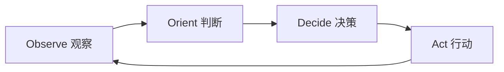
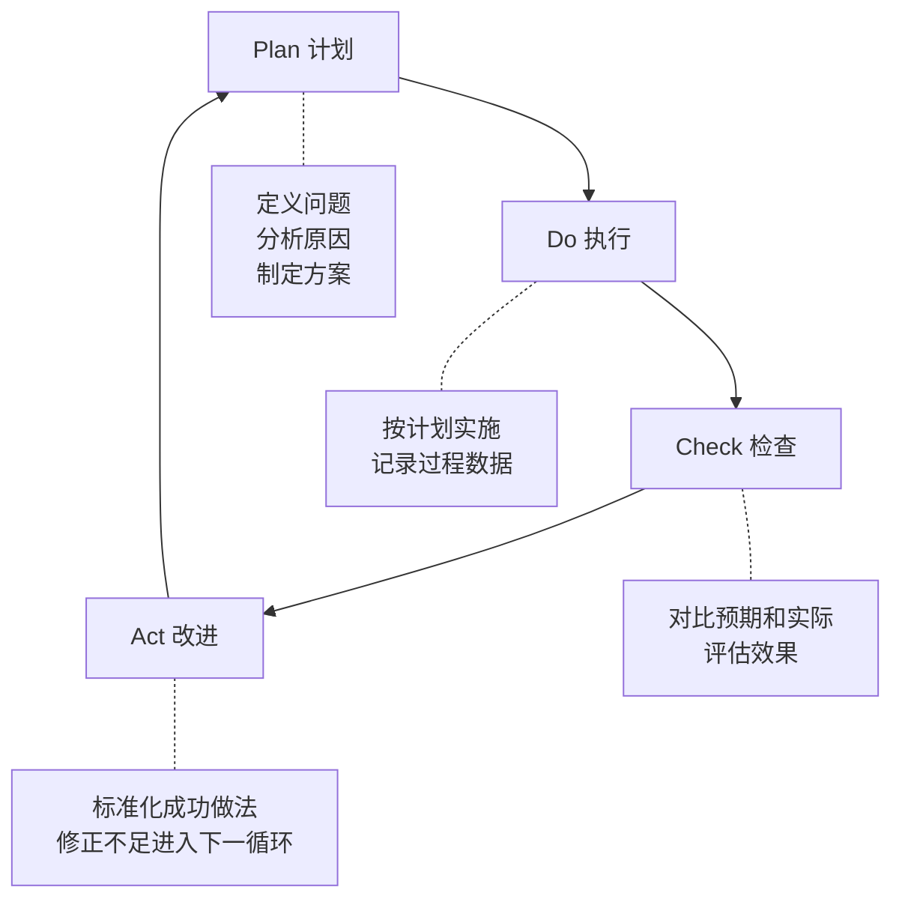
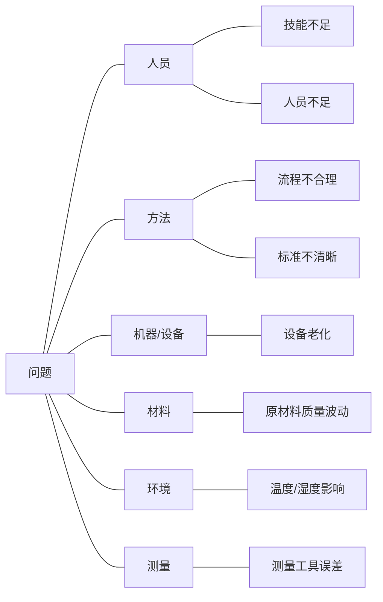

## 三、决策与问题解决

领导力的核心体现之一就是决策能力。一个领导者每天要做数百个大大小小的决定，从战略方向到人事安排，从资源分配到危机处理。决策质量的高低，直接决定了团队和组织的成败。本章从决策的底层逻辑出发，系统介绍决策流程、工具、方法论和问题解决框架，帮助你从"拍脑袋"进化到"系统化决策"。

### 3.1 理解决策的本质

#### 3.1.1 什么是决策

决策是在多个可行方案中选择一个并付诸行动的过程。这个定义看似简单，但包含了三个关键要素：

- **多个方案**：如果只有一个选项，那叫执行不叫决策
- **选择**：需要判断和取舍，涉及价值排序
- **行动**：决策的终点是行动，没有行动的决策是空谈

赫伯特·西蒙（Herbert Simon）的"有限理性"理论指出：人类不可能获得完美信息、也不可能穷尽所有选项，因此决策本质上是在不完全信息下的判断。这意味着追求"最优解"往往不如追求"足够好的解"——西蒙称之为"满意解"（Satisficing）。

#### 3.1.2 决策的两种模式

诺贝尔奖得主丹尼尔·卡尼曼在《思考，快与慢》中提出了双系统理论：

| 维度 | 系统1（快思考） | 系统2（慢思考） |
|------|----------------|----------------|
| 速度 | 毫秒级，自动运行 | 分钟到小时级，需要刻意启动 |
| 能耗 | 低，几乎无感 | 高，消耗认知资源 |
| 适用场景 | 熟悉的、重复的、紧急的 | 复杂的、陌生的、高风险的 |
| 优势 | 速度快、效率高 | 准确度高、考虑全面 |
| 劣势 | 容易产生认知偏差 | 速度慢、可能过度分析 |
| 领导力场景 | 日常审批、标准化流程 | 战略规划、重大投资、人事任命 |

优秀的领导者需要在这两种模式之间灵活切换：日常小事用系统1快速处理，把认知资源留给真正需要深思的重大决策。

#### 3.1.3 决策中的认知偏差

了解认知偏差是提升决策质量的第一步。以下是领导者最常犯的10种认知偏差：

**确认偏差（Confirmation Bias）**：倾向于寻找支持自己观点的证据，忽略反面信息。例如：你看好某个候选人在面试中会不自觉地关注他的优点而忽略缺点。

**锚定效应（Anchoring Effect）**：第一个接触到的数字会影响后续判断。例如：供应商先报价100万，即使你砍到70万，可能仍然高于市场价50万。

**沉没成本谬误（Sunk Cost Fallacy）**：因为已经投入了大量资源而不愿意放弃。例如：项目已经投入200万但前景不明，"都花了这么多了"的心态让你继续追加投资。

**从众效应（Bandwagon Effect）**：因为大多数人都支持就跟随。例如：团队投票3:2支持方案A，你作为领导者不自觉地倒向多数。

**过度自信偏差（Overconfidence Bias）**：高估自己判断的准确度。研究显示，当人们对某件事有90%把握时，实际正确率只有70%左右。

**可得性偏差（Availability Bias）**：根据最近发生的或印象深刻的事件来判断概率。例如：最近出了安全事故就过度投资安全，忽略其他更紧迫的问题。

**框架效应（Framing Effect）**：同一个问题的不同表述方式会导致不同的决策。例如："成功率80%"和"失败率20%"描述的是同一件事，但前者让人更倾向于接受。

**禀赋效应（Endowment Effect）**：高估自己拥有的东西的价值。例如：对自己培养的方案/产品/下属过度偏爱。

**幸存者偏差（Survivorship Bias）**：只看到成功案例而忽略失败案例。例如：看到某创业公司成功就模仿其策略，忽略了采用同样策略失败的99家公司。

**现状偏差（Status Quo Bias）**：倾向于维持现状，即使改变可能更好。例如：明知组织架构需要调整但一拖再拖。

> **对抗偏差的实操方法**：每次做重大决策前，过一遍这个清单。问自己："我是不是犯了上面某个偏差？"光是意识到偏差的存在，就能显著降低其影响。

### 3.2 决策的标准流程

高质量的决策需要一个系统化的流程。以下五步法适用于大多数决策场景：

#### 第一步：定义问题

问题定义是决策中最关键的一步。爱因斯坦说："如果给我一小时拯救地球，我会花55分钟定义问题，5分钟解决它。"错误的问题定义会导致错误的决策——你解决了一个不存在的问题。

**定义问题的四个维度**：

1. **问题的本质是什么？** 区分表象和根因。"团队交付延误"是表象，"资源分配不合理"可能才是根因
2. **谁是利益相关者？** 这个问题影响谁？谁有权力参与决策？谁需要被执行？
3. **时间约束是什么？** 需要在什么时间之前做出决定？不做决定会怎样？
4. **成功标准是什么？** 怎样算解决了这个问题？可衡量的指标是什么？

**工具：5个为什么（5 Whys）**

大野耐一（丰田生产系统创始人）发明的根因分析工具。通过连续追问"为什么"来穿透表象找到根本原因。实际操作中，通常追问5次左右就能触及根因。

**完整示例**：

| 层级 | 问题 | 回答 |
|------|------|------|
| 表象 | 本季度客户投诉增加了40% | — |
| Why 1 | 为什么投诉增加？ | 因为产品bug增多 |
| Why 2 | 为什么bug增多？ | 因为测试覆盖率下降 |
| Why 3 | 为什么测试覆盖率下降？ | 因为测试人员不够 |
| Why 4 | 为什么测试人员不够？ | 因为两人离职没有补招 |
| Why 5 | 为什么没有补招？ | 因为招聘预算被砍 |
| 根因 | **资源分配决策问题** — 砍招聘预算时没有评估对质量的影响 |

> **注意**：5 Whys 不是机械地问5次。如果3次就找到根因就停，如果需要7次就继续。关键是找到**可以采取行动**的那一层。如果你追到"因为市场竞争激烈"这种无法改变的外部因素，说明你追过头了。

**工具：问题重构（Reframing）**

同一个问题可以有不同的定义方式，不同的定义会导致完全不同的解决方案：

| 原始问题 | 重构方式 | 新定义 |
|----------|----------|--------|
| "员工流失率高" | 换角度 | "我们吸引和保留人才的能力不足" |
| "销售业绩下滑" | 换尺度 | "客户生命周期价值在下降" |
| "项目延期" | 换立场 | "我们对项目复杂度的评估系统性偏低" |

好的问题定义应该：具体、可衡量、可行动、聚焦于可控因素。

#### 第二步：收集信息

信息是决策的燃料。信息不足会导致盲目决策，信息过载会导致决策瘫痪。关键是收集**足够且相关**的信息。

**信息收集框架**：

1. **硬数据**：业绩指标、财务数据、市场报告、用户反馈数据
2. **软信息**：专家意见、行业经验、直觉判断、一线反馈
3. **约束条件**：预算限制、时间窗口、人力可用性、技术可行性
4. **历史参考**：类似问题过去是怎么处理的？效果如何？

**信息质量检查清单**：

- 数据来源是否可靠？（一手数据 > 二手数据 > 传闻）
- 数据是否过时？（市场数据的时效性尤为重要）
- 样本是否具有代表性？（是否只是幸存者偏差？）
- 是否有选择性呈现？（提供信息的人是否有立场？）

**80/20法则**：在信息收集中，80%的关键信息通常来自20%的信息源。不要追求穷尽所有信息，当核心信息已经足够支撑判断时，就应该进入下一步。

#### 第三步：生成方案

很多人在这一步犯了一个关键错误——直接跳到评估选项。实际上，方案生成和方案评估应该严格分开。在生成阶段，目标是尽可能多地产生候选方案，不急于评判。

**方案生成方法**：

- **头脑风暴**：团队成员自由提出想法，不做批评，数量优先
- **类比思考**：其他行业/领域是怎么解决类似问题的？
- **逆向思考**：如果想让问题变得更糟，我该怎么做？然后反转
- **约束放松**：如果去掉某个限制条件（预算/时间/技术），我会怎么做？
- **极端方案**：最保守的方案是什么？最激进的方案是什么？中间地带有哪些？

> **最低方案数**：任何重要决策至少要有3个可行方案。如果只有2个方案，你其实是在做"要不要"的判断而不是真正的决策。

#### 第四步：评估与选择

**评估方案的五个维度**：

| 维度 | 核心问题 | 权重参考 |
|------|----------|----------|
| 效果 | 这个方案能多大程度解决问题？ | 30% |
| 可行性 | 我们有能力执行吗？ | 25% |
| 风险 | 最坏情况是什么？能承受吗？ | 20% |
| 成本 | 需要投入多少资源？ | 15% |
| 时间 | 多快能见效？ | 10% |

> 权重根据具体决策场景调整。紧急决策中"时间"权重升高；高风险决策中"风险"权重升高。

**决策矩阵实操示例**：

假设你要选择团队协作工具，评估三个方案：

| 评估标准 | 权重 | 方案A（飞书） | 方案B（钉钉） | 方案C（企业微信） |
|----------|------|--------------|--------------|-------------------|
| 功能完整度 | 30% | 9 (2.7) | 7 (2.1) | 6 (1.8) |
| 学习成本 | 20% | 7 (1.4) | 8 (1.6) | 9 (1.8) |
| 生态集成 | 25% | 8 (2.0) | 7 (1.75) | 6 (1.5) |
| 数据安全 | 15% | 7 (1.05) | 8 (1.2) | 7 (1.05) |
| 成本 | 10% | 6 (0.6) | 8 (0.8) | 9 (0.9) |
| **总分** | **100%** | **7.75** | **7.45** | **7.05** |

> 括号中为加权得分（评分×权重）。总分 = 各项加权得分之和。决策矩阵的关键不是数字本身，而是通过结构化比较迫使你明确"到底在比较什么"和"各因素的相对重要性"。

#### 第五步：执行与跟踪

决策不执行等于零。很多领导者擅长决策但不擅长跟踪执行，导致好方案烂在PPT里。

**执行保障四要素**：

1. **明确责任人**：每个行动项都要有唯一的负责人（不是"团队负责"，而是"张三负责"）
2. **设定里程碑**：把大目标拆成阶段性检查点，每个里程碑有明确的完成标准
3. **建立反馈机制**：谁在什么时候用什么方式汇报进度？遇到问题找谁升级？
4. **预设调整方案**：如果计划不如预期，触发条件是什么？调整方案是什么？

**决策记录模板**：

决策标题：________________________
决策日期：________________________
决策者：________________________

背景与问题：
________________________________

备选方案：
1. ______________________________
2. ______________________________
3. ______________________________

选择的方案：____________________
选择理由：______________________

预期结果：
- 指标1：_______________________
- 指标2：_______________________

风险与应对：
- 风险1：____________________ → 应对：____________________
- 风险2：____________________ → 应对：____________________

执行计划：
- 阶段1（日期）：________________
- 阶段2（日期）：________________
- 阶段3（日期）：________________

复盘日期：________________________

### 3.3 常用决策工具详解

#### 3.3.1 六顶思考帽

爱德华·德博诺（Edward de Bono）于1986年提出的结构化思考工具。核心思想：把"同时做所有事"的混乱思考变成"一次只做一件事"的平行思考。

| 帽子 | 颜色含义 | 思考方向 | 典型提问 |
|------|----------|----------|----------|
| 白帽 | 中立客观 | 事实、数据、信息 | "我们掌握了哪些数据？还缺什么信息？" |
| 红帽 | 情感色彩 | 直觉、感受、情绪 | "我对这个方案的直觉反应是什么？" |
| 黑帽 | 谨慎严肃 | 风险、问题、困难 | "这个方案可能在哪里出问题？" |
| 黄帽 | 阳光积极 | 价值、好处、机会 | "这个方案能带来什么好处？" |
| 绿帽 | 生机勃勃 | 创新、替代、可能 | "有没有完全不同的做法？" |
| 蓝帽 | 天空全局 | 过程控制、总结 | "我们的思考到哪一步了？下一步做什么？" |

**实施流程**：

1. **蓝帽开场**（5分钟）：主持人说明议题和讨论规则
2. **白帽阶段**（10分钟）：所有人只陈述事实和数据，不做判断
3. **红帽阶段**（5分钟）：每个人快速表达直觉感受，不用解释理由
4. **黄帽阶段**（10分钟）：所有人寻找方案的优点和机会
5. **黑帽阶段**（10分钟）：所有人寻找方案的风险和问题
6. **绿帽阶段**（10分钟）：针对黑帽发现的问题，寻找创新解决方案
7. **蓝帽总结**（5分钟）：主持人总结讨论结果，形成决策

> **关键规则**：每个阶段所有人必须戴同一顶帽子。不能在白帽阶段就开始说"我觉得不行"（那是黑帽），也不能在黄帽阶段就开始挑毛病。这避免了常见的"提出想法立刻被批评"的团队讨论陷阱。

**适用场景**：团队战略讨论、方案评审、创意brainstorming。不适用于需要快速决策的紧急情况。

#### 3.3.2 10-10-10法则

苏西·韦尔奇（Suzy Welch）提出的决策框架。当面临两难决策时，从三个时间维度审视：

- **10分钟后**：这个决定会让我感觉如何？短期的情绪反应是什么？
- **10个月后**：这个决定的中期影响是什么？事情会怎样发展？
- **10年后**：这个决定的长期后果是什么？我会后悔吗？

**实操示例**：是否接受一份薪资更高但需要频繁出差的工作？

| 时间维度 | 接受新工作 | 留在现公司 |
|----------|-----------|-----------|
| 10分钟后 | 兴奋、自豪 | 安全、稳定 |
| 10个月后 | 可能疲惫、家庭关系紧张 | 可能遗憾错过机会 |
| 10年后 | 积累了更多经验和人脉，财务改善 | 可能职业发展受限 |

> **使用要点**：10-10-10法则的核心价值在于强迫你跳出当下的情绪，用更长远的视角审视决策。很多人会发现，当下纠结的事情在10个月甚至10年后看来根本不重要。

#### 3.3.3 决策矩阵（加权评分法）

决策矩阵是最实用的量化决策工具，特别适合在2-4个方案之间做比较。

**操作步骤**：

1. **列出所有评估维度**：根据决策目标确定关键评估因素
2. **分配权重**：100%的权重分配到各个维度，反映相对重要性
3. **逐项评分**：每个方案在每个维度上打1-10分
4. **计算加权总分**：评分×权重，然后求和
5. **敏感性分析**：调整权重看结果是否翻转——如果稍微调一下权重排名就变了，说明方案之间差异不大

**常见陷阱**：

- 权重分配不诚实：嘴上说"质量最重要"，实际上给了"价格"最高权重
- 评分标准不一致：方案A的"8分"和方案B的"8分"不是同一个标准
- 忽略关键维度：只比较明显的因素，忽略了"组织接受度""执行复杂度"等隐性因素

#### 3.3.4 预验尸法（Pre-Mortem）

加里·克莱因（Gary Klein）于2007年在《哈佛商业评论》上提出。与事后复盘（Post-Mortem）相反，预验尸在决策执行前就假设它已经失败了，然后逆向分析可能的失败原因。

**完整实施步骤**：

1. **场景设定**（2分钟）：主持人宣布"现在是一年后，我们的决策彻底失败了"
2. **独立书写**（10分钟）：每个人独立写下3-5个可能的失败原因，不讨论
3. **轮流陈述**（15分钟）：每人逐一分享自己的失败原因，不做评判
4. **分类整理**（10分钟）：将所有失败原因按类别归纳（技术类、人员类、市场类、执行类等）
5. **风险排序**（10分钟）：评估每个失败原因的发生概率和影响程度，排出优先级
6. **制定对策**（15分钟）：针对TOP 3-5的高风险项，制定预防措施和应急方案

**为什么预验尸有效**：

- **解除社会压力**：在"决策已经失败"的假设下，提出反对意见不再意味着"唱反调"或"不配合"
- **激活前瞻性思维**：人天生更擅长解释"为什么发生了"而不是"为什么可能发生"，预验尸利用了这个心理特点
- **研究支持**：克莱因的研究表明，预验尸能将风险识别率提高30%以上

#### 3.3.5 OODA循环

约翰·博伊德（John Boyd）上校提出的决策循环，最初用于军事领域，现在广泛应用于商业竞争：

- **Observe（观察）**：收集环境信息，了解正在发生什么
- **Orient（判断）**：基于经验和分析框架理解信息的含义
- **Decide（决策）**：选择行动方案
- **Act（行动）**：执行决策

**核心价值**：在快速变化的环境中，比对手更快地完成OODA循环就是竞争优势。不是"做得更好"而是"变得更快"。每个循环的输出成为下一个循环的输入，形成持续进化。

**适用场景**：竞争激烈的市场环境、需要快速迭代的产品开发、危机应对。

#### 3.3.6 RAPID决策模型

贝恩公司提出的决策角色分配框架，解决"谁来决策"的组织问题：

| 角色 | 英文 | 职责 | 关键原则 |
|------|------|------|----------|
| 建议者 | Recommend | 收集数据、提出方案 | 必须提供2-3个可行方案及利弊分析 |
| 同意者 | Agree | 拥有否决权 | 只在法律/合规/安全等硬约束时行使 |
| 执行者 | Perform | 负责落地执行 | 执行者的意见必须被听取 |
| 输入者 | Input | 提供专业信息 | 提供信息但不参与决策 |
| 决策者 | Decide | 最终拍板 | 只有一个决策者，不能是委员会 |

> **常见组织病**："人人负责=无人负责"。RAPID模型的核心价值是明确每个人在决策中的角色——一个决策只能有一个决策者。

### 3.4 团队决策方法

#### 3.4.1 五种团队决策模式

| 模式 | 定义 | 适用场景 | 优势 | 劣势 |
|------|------|----------|------|------|
| 共识决策法 | 全员同意 | 重大战略、文化价值观 | 承诺度高、执行阻力小 | 耗时极长、可能妥协到平庸 |
| 多数投票法 | 超半数通过 | 一般性事务、选项差异不大 | 高效、民主 | 少数派不满、可能51%压49% |
| 领导者决策法 | 领导拍板 | 紧急情况、专业领域 | 速度最快 | 信息受限、团队参与感低 |
| 咨询式决策法 | 征求意见后领导决策 | **最常用的模式** | 兼顾效率和参与度 | 领导需要消化大量信息 |
| DACI框架 | 角色分工决策 | 跨部门复杂决策 | 责任清晰、流程规范 | 需要前期角色分配 |

#### 3.4.2 DACI决策框架详解

DACI是咨询式决策法的升级版，特别适合跨部门协作的复杂决策：

- **Driver（推动者）**：负责推动整个决策过程——收集信息、组织会议、跟踪进度、确保决策按时完成。推动者不是决策者，而是决策过程的"项目经理"
- **Approver（批准者）**：拥有最终决策权的人。通常只有一个，特殊情况下可以有两个（如技术和业务各一个）
- **Contributors（贡献者）**：提供信息、分析和建议的人。他们参与讨论但不做最终决定
- **Informed（知情者）**：需要知道决策结果但不参与决策过程的人。决策完成后通知他们

**DACI文档模板**：

决策标题：________________________
Driver：_________________________
Approver：_______________________
Contributors：___________________
Informed：_______________________

1. 背景与目标
   ________________________________

2. 方案对比
   方案A：________________________
     优点：_______________________
     缺点：_______________________
   方案B：________________________
     优点：_______________________
     缺点：_______________________

3. 建议方案：____________________
   理由：_________________________

4. 最终决策：____________________
   决策日期：_____________________

#### 3.4.3 避免群体决策陷阱

**群体思维（Groupthink）**：团队成员为了维持和谐而压制异议，导致决策质量下降。症状包括：

- 团队自我审查，不表达真实意见
- 对外群体的刻板印象（"他们不懂"）
- 一致同意的幻觉（沉默=同意？）
- 对异议者的直接压力

**对抗群体思维的策略**：

1. **指定唱反调的人**：每轮讨论指定一个人专门提出反对意见
2. **匿名收集意见**：先匿名写下观点再讨论，避免权威效应
3. **引入外部视角**：邀请不直接参与的人提供意见
4. **领导者最后发言**：如果领导者先表态，其他人会趋向一致
5. **鼓励"保护性异议"**："谁来告诉我为什么这是个坏主意？"

### 3.5 提升决策质量的七个习惯

#### 习惯一：数据驱动，但不唯数据

尽可能用数据说话，减少主观臆断。但数据不是万能的——数据告诉你"是什么"，不告诉你"该怎么做"。决策需要数据+判断+价值观的结合。

**实操建议**：

- 为每个重要决策定义2-3个关键指标
- 建立数据仪表盘，减少信息收集成本
- 当数据和直觉冲突时，停下来仔细分析——可能数据有误，也可能你的直觉需要修正

#### 习惯二：主动寻找反对意见

多元视角能显著提升决策质量。研究表明，有异质性意见的团队比同质化团队做出更好决策的概率高60%以上。

**实操建议**：

- 在决策讨论中，先问"谁有不同看法？"
- 定期邀请外部顾问或跨部门同事参与评审
- 建立"魔鬼代言人"机制

#### 习惯三：假设检验

对自己的假设提出质疑并寻找反证。查理·芒格说："反过来想，总是反过来想。"

**实操建议**：

- 把决策建立的假设明确列出来
- 为每个假设寻找反面证据
- 设定"假设被推翻"的触发条件

#### 习惯四：决策日志

记录重要决策的背景、理由和预期结果。这是最容易做到但最少人坚持的习惯。

**决策日志的价值**：

- 消除"事后诸葛亮"效应——人都会不自觉地修改记忆，日志是客观记录
- 积累决策模式——你会发现自己的决策有哪些反复出现的模式
- 为团队建立决策文化——"我们上一次类似情况是怎么做的？"

**格式建议**：每次重大决策后花5分钟记录：日期、背景、选项、选择、理由、预期结果、实际结果（后续补填）。

#### 习惯五：定期复盘

定期回顾过去的决策，总结经验教训。复盘不是追责，而是学习。

**复盘四问**：

1. 当初的决策是什么？基于什么假设？
2. 实际结果是什么？和预期一致吗？
3. 如果重来一次，会做不同的决定吗？为什么？
4. 这个经验如何应用到未来的决策中？

#### 习惯六：管理决策精力

避免在疲劳或情绪激动时做重大决策。这是生理层面的约束——疲劳时大脑前额叶皮层功能下降，系统2的运作效率大打折扣。

**实操建议**：

- 重大决策放在上午精力充沛时
- 愤怒/焦虑时不做决定，至少等24小时
- 连续做多个决策后休息一下（决策疲劳是真实存在的）
- 重要会议前预留15分钟独处思考时间

#### 习惯七：建立决策清单

飞行员有起飞清单，外科医生有手术清单。领导者也应该有决策清单——在做重大决策前逐项检查。

**决策清单示例**：

- [ ] 问题定义是否清晰？有没有可能定义错了问题？
- [ ] 信息是否足够？有没有关键信息缺失？
- [ ] 是否考虑了至少3个方案？
- [ ] 是否检查了认知偏差？（过一遍3.1.3的清单）
- [ ] 是否听取了不同意见？
- [ ] 最坏情况是什么？能承受吗？
- [ ] 是否有退出/回滚方案？
- [ ] 是否明确了执行责任人和时间表？

### 3.6 问题解决的系统方法

决策和问题解决是一枚硬币的两面：决策是"选择做什么"，问题解决是"把事情做好"。

#### 3.6.1 PDCA循环（戴明环）

沃尔特·休哈特（Walter Shewhart）提出、威廉·爱德华兹·戴明（W. Edwards Deming）推广的持续改进框架。是质量管理的基石，也适用于任何问题解决场景。

**每个阶段的具体任务**：

**Plan（计划）**：
- 明确问题和目标（用SMART原则）
- 收集数据、分析现状
- 用5 Whys或鱼骨图找根因
- 制定解决方案和实施计划
- 定义成功标准和衡量指标

**Do（执行）**：
- 按计划实施，最好先小范围试点
- 记录过程数据（不只是结果数据）
- 遇到偏差及时记录，不要中途改方案

**Check（检查）**：
- 对比实际结果和预期目标
- 分析偏差的原因
- 评估方案的有效性
- 总结学到的经验

**Act（改进）**：
- 有效的做法标准化（写入流程/制度）
- 无效的做法分析原因并调整
- 将遗留问题带入下一个PDCA循环
- 扩大试点范围或全面推广

#### 3.6.2 A3问题解决法

源自丰田生产系统（TPS），用一张A3大小的纸张（11.7×16.5英寸）系统地描述和解决问题。丰田认为：如果一个问题无法在一张A3纸上说清楚，说明你还没有真正理解它。

**A3报告的七个板块**：

| 板块 | 核心问题 | 内容要求 |
|------|----------|----------|
| 1. 背景 | 为什么这个问题重要？ | 与业务目标的关联、问题的影响范围 |
| 2. 现状 | 当前情况如何？ | 用数据和图表描述现状，越具体越好 |
| 3. 目标 | 期望达到什么状态？ | SMART目标，有明确的衡量标准 |
| 4. 根因分析 | 问题的根本原因是什么？ | 用5 Whys或鱼骨图，至少追到3层 |
| 5. 对策 | 采取什么措施？ | 每个对策对应一个根因 |
| 6. 实施计划 | 如何执行？ | 任务、负责人、时间、资源 |
| 7. 跟踪 | 如何验证效果？ | 检查指标、检查频率、检查人 |

> **A3思维的核心**：不是"填表格"，而是"在一张纸上讲清楚一个故事"。好的A3报告能让一个不了解背景的人在3分钟内理解问题和方案。

#### 3.6.3 鱼骨图（石川图/因果图）

石川馨（Kaoru Ishikawa）发明的根因分析工具，用于系统地列出问题的所有可能原因。

**标准鱼骨图结构**：

**6M分类法**（制造业经典，服务业可调整）：

- **Man（人员）**：技能、态度、培训、人员配置
- **Method（方法）**：流程、标准、操作规范
- **Machine（机器）**：设备状态、维护、工具
- **Material（材料）**：原材料质量、供应商、库存
- **Measurement（测量）**：检测方法、标准、工具精度
- **Mother Nature（环境）**：温度、湿度、政策、市场环境

**服务业调整版**：人员、流程、政策、技术、客户、环境。

**实操步骤**：

1. 在鱼头写上要分析的问题（要具体，不要写"质量问题"，要写"Q3产品返工率从2%升至5%"）
2. 召集相关方，用头脑风暴填充鱼刺
3. 对每个可能原因用数据验证（不要凭感觉判断）
4. 圈出TOP 3根因，进入解决方案设计

#### 3.6.4 问题树（Issue Tree）

麦肯锡等咨询公司常用的结构化分析工具。把一个大问题拆解成互不重叠、完全穷尽（MECE原则）的子问题。

**示例**：如何提升公司利润？

利润 = 收入 - 成本

收入
├── 客户数量
│   ├── 新客户获取
│   │   ├── 营销渠道效率
│   │   ├── 转化率
│   │   └── 品牌知名度
│   └── 老客户留存
│       ├── 客户满意度
│       ├── 产品粘性
│       └── 售后服务
└── 客单价
    ├── 产品定价策略
    ├── 交叉销售
    └── 增值服务

成本
├── 固定成本
│   ├── 租金
│   ├── 人员工资
│   └── 折旧
└── 变动成本
    ├── 原材料
    ├── 营销费用
    └── 物流费用

**问题树的价值**：把一个模糊的大问题（"怎么赚钱？"）拆解成可以逐一分析和解决的小问题。每个叶子节点都可以对应具体的数据收集和行动方案。

#### 3.6.5 8D问题解决法

福特汽车公司开发的系统化问题解决方法，特别适合处理严重的质量问题和客户投诉。

| 步骤 | 名称 | 具体内容 |
|------|------|----------|
| D1 | 建立团队 | 组建跨职能问题解决团队，明确角色 |
| D2 | 问题描述 | 用5W2H详细描述问题（What/Where/When/Who/Why/How/How much） |
| D3 | 临时遏制措施 | 立即采取措施防止问题扩大（先止血） |
| D4 | 根本原因分析 | 用5 Whys、鱼骨图等工具找到根本原因 |
| D5 | 永久纠正措施 | 针对根因制定并验证长期解决方案 |
| D6 | 实施永久措施 | 执行方案并验证效果 |
| D7 | 预防措施 | 修改系统/流程/标准，防止问题复发 |
| D8 | 团队庆祝/总结 | 认可团队贡献，总结经验教训 |

> **D3的关键价值**：很多人急于找根因而忽略了"先止血"。当问题正在造成损失时，第一步永远是遏制——先把损失控制住，再去找原因。就像急诊室：先止血保命，再做全面检查。

### 3.7 不同场景的决策策略

#### 3.7.1 高风险决策

高风险决策的特征：不可逆、影响范围大、信息不完整。

**策略**：

1. **降低不可逆性**：设计分阶段投入方案，每阶段设置检查点和退出条件
2. **增加信息**：投入更多时间和资源收集关键信息，不要急于决定
3. **多元化**：不把所有鸡蛋放一个篮子——同时推进2-3个方向，用最小成本测试
4. **寻求外部智慧**：找有类似经验的人咨询，读案例研究
5. **设定"可杀条件"**：提前定义什么情况下必须止损退出

#### 3.7.2 紧急决策

紧急决策的特征：时间压力大、后果严重、不能不做决定。

**策略**：

1. **领导者决策法**：没有时间充分讨论，领导者基于经验快速判断
2. **关注核心约束**：只看最关键的一两个因素，不做全面分析
3. **决策+沟通**：快速决定后立即沟通执行，不要等"完美方案"
4. **留修正空间**：选择容易调整的方案，而非"赌一把"的方案
5. **事后复盘**：紧急决策过后一定要复盘——紧急情况下的决策质量通常低于正常水平

#### 3.7.3 可逆决策（双向门决策）

亚马逊创始人杰夫·贝佐斯将决策分为两类：

- **单向门（One-way door）**：不可逆决策，需要谨慎分析
- **双向门（Two-way door）**：可逆决策，可以快速试错

> "大多数决策都是双向门。如果你做了一个错误的双向门决策，你不需要太长时间就能退回来。但人们在处理双向门决策时，却用了单向门的重量级流程，这会导致速度变慢。"——杰夫·贝佐斯

**策略**：对于双向门决策，速度优于完美。快速决定、快速执行、快速反馈、快速调整。

#### 3.7.4 群体性决策的逆向思考

当所有人都觉得"肯定要做"的时候，反而要停下来想想：

- 这是不是集体狂热？（参考历史上的泡沫事件）
- 有没有人在"皇帝的新衣"？
- 如果这件事失败了，最可能的原因是什么？
- 有没有沉默的反对者？他们的顾虑是什么？

### 3.8 从决策者到决策设计师

最高段位的领导者不只做决策，还会设计决策系统——让团队在没有自己的情况下也能做出高质量决策。

**决策系统设计要素**：

1. **决策权分配**：什么层级的决策由什么层级的人做？（避免所有事都要领导拍板）
2. **信息流通机制**：确保决策者能及时获得关键信息
3. **决策标准透明化**：团队知道"什么样的决策是好决策"
4. **决策文化**：鼓励基于事实的讨论，容许建设性的反对意见
5. **复盘机制**：决策后有系统的回顾和学习

**决策授权矩阵**：

| 决策类型 | 授权层级 | 举例 |
|----------|----------|------|
| 战略级 | 高管层/CEO | 进入新市场、大型并购、核心产品方向 |
| 战术级 | 中层管理者 | 项目方案选择、团队组建、季度计划 |
| 执行级 | 一线员工 | 日常任务安排、客户沟通、技术实现 |

> **授权的关键原则**：授权不等于甩手。授权的同时要提供三个东西——清晰的目标、足够的资源、兜底的支持。"你来决定，我来支持"是最佳授权姿态。

### 3.9 决策能力的持续修炼

决策能力不是一朝一夕能提升的，需要刻意练习：

**每日练习**：

- 每天记录1-2个决策和理由（建立决策日志习惯）
- 晚上回顾：今天的决策质量如何？有没有认知偏差？

**每周练习**：

- 复盘本周一个重大决策的执行情况
- 阅读一个决策案例（商业案例、历史事件）

**每月练习**：

- 回顾过去一个月的决策模式，寻找改进空间
- 与同行交流决策经验

**年度练习**：

- 对年度重大决策做系统复盘
- 更新自己的决策清单和工具库
- 反思决策风格的进化方向

> **终极目标**：不是做"正确的决策"，而是"做正确的决策的过程"。过程对了，结果自然不会太差；即使偶尔结果不好，你也知道自己做了当时条件下最好的判断。

***
