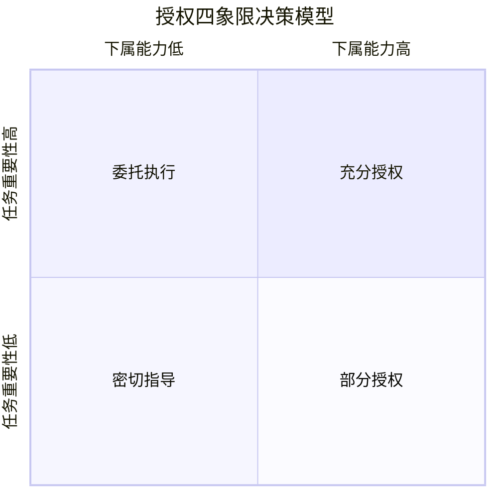
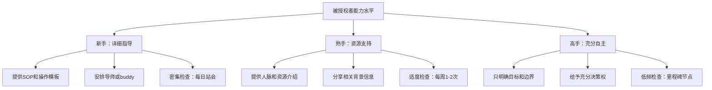
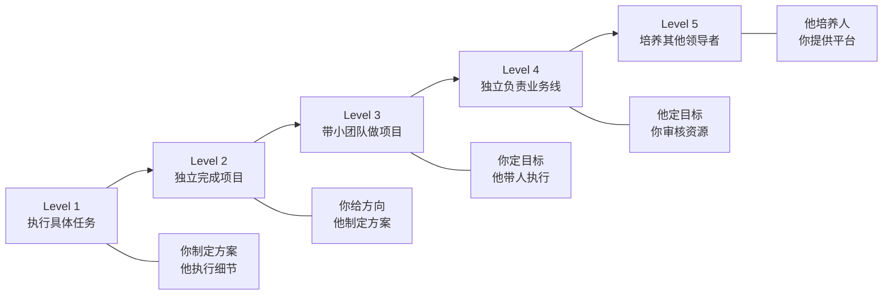

## 五、授权与赋能

领导力的核心不是"你能做多少事"，而是"你能让更多人做成多少事"。授权与赋能是领导者从"个人贡献者"跃迁为"组织放大器"的关键技能。不会授权的领导者终将成为团队的瓶颈——你的上限就是团队的上限；而善于授权的领导者能让1+1>2，让每个成员都成为独立的战斗力单元。

### 5.1 为什么授权是领导力的核心杠杆

#### 5.1.1 授权的经济学原理

从管理经济学的角度看，领导者的时间是团队中最稀缺的资源。假设你的时薪价值是500元/小时，而某个任务下属的完成成本是100元/小时，即使下属的完成质量只有你的80%，从全局效率来看，授权仍然是更优选择——因为你释放出的时间可以用于战略思考、关键决策和高层关系维护，这些才是只有你能做的事。

**时间杠杆模型**：

| 角色 | 核心时间分配 | 授权前典型问题 |
|------|-------------|---------------|
| 基层管理者 | 70%执行 + 30%管理 | 90%时间在执行，无暇管理 |
| 中层管理者 | 30%执行 + 50%管理 + 20%战略 | 仍陷于执行，战略思考不足 |
| 高层管理者 | 10%执行 + 30%管理 + 60%战略 | 适度执行，聚焦战略和组织 |

如果你在当前层级的时间分配与上一层级严重不符（比如身为中层管理者却80%时间在执行），说明你的授权严重不足。

#### 5.1.2 授权对团队成长的价值

授权不仅是领导者释放时间的手段，更是培养团队的核心机制：

- **能力传递**：通过授权将你的经验、判断力和专业技能传递给下属，这比任何培训都更有效——在真实任务中学习，记忆保留率高达75%，而听讲只有5%（学习金字塔理论）
- **责任意识**：被授权的下属会产生"主人翁意识"，从"帮我完成任务"转变为"这是我的项目"，投入度和创造力显著提升
- **人才梯队**：如果你不授权，团队中永远不会有下一个人准备好接替你的位置。授权是建设人才梯队的唯一途径
- **组织韧性**：过度集权的组织一旦核心人物缺席就会瘫痪。充分授权的组织具有更强的抗风险能力

#### 5.1.3 授权的理论基础

**情境领导理论的启示**：赫塞和布兰查德的情境领导模型指出，领导方式应该根据下属的"准备度"（能力+意愿）灵活调整。对于准备度低的下属，需要指令式领导（高任务、低关系）；对于准备度高的下属，可以充分授权（低任务、低关系）。这意味着授权不是"一刀切"，而是根据对象差异化处理。

**自我决定理论（SDT）的支撑**：德西和瑞安的研究表明，人类有三个基本心理需求——自主性、胜任感、归属感。授权直接满足了"自主性"需求，同时通过给予有挑战性的任务提升了"胜任感"，是强有力的内在激励手段。

### 5.2 授权四象限：决定授权程度的决策框架

不是所有任务都适合同样的授权程度。在授权之前，你需要先做一个判断：这个任务应该授权到什么程度？以下四象限模型帮你快速决策：

**象限一：密切指导（重要性高 + 能力低）**

下属能力不足但任务至关重要的情境。此时不能放手，但也不能完全不授权——否则下属永远无法成长。

操作方式：
- 将任务拆解为多个子任务，将非核心部分授权
- 为下属提供详细的SOP（标准操作程序）和检查清单
- 设置密集的检查节点（每天甚至每半天）
- 核心决策仍由你来做，下属负责执行层面

示例：让一个新人负责客户方案的初稿撰写，但最终方案的审核和客户沟通由你完成。

**象限二：委托执行（重要性高 + 能力高）**

这是最理想的授权场景——下属有能力，任务也重要。此时应该给予充分信任和资源，让下属主导。

操作方式：
- 明确目标和边界，但不规定具体方法
- 赋予相应的决策权和资源调配权
- 设置里程碑检查点，而非事无巨细的监控
- 在关键节点提供支持，但不干涉执行过程

示例：让一位资深产品经理独立负责一个新产品线的规划和推进，你只在季度评审时介入。

**象限三：密切指导（重要性低 + 能力低）**

任务不太重要但下属也需要学习的场景。这是培养新人的练兵场。

操作方式：
- 提供模板和案例，让下属参照执行
- 允许犯错，将错误视为学习成本
- 任务完成后进行详细复盘
- 逐步减少指导频率，观察成长速度

示例：让实习生整理部门周报，提供模板和往期样例，前两周每天review，之后改为每周review。

**象限四：部分授权（重要性低 + 能力高）**

下属完全有能力处理但你可能因为习惯仍在插手的任务。这是你最容易"舍不得放手"的象限。

操作方式：
- 直接放手，只看结果
- 取消不必要的汇报和审批
- 将注意力转移到更高价值的事情上
- 信任下属的专业判断

示例：团队的技术选型决策，交给技术骨干来做，你只在涉及大额预算时介入。

### 5.3 授权的七步系统法

有效的授权不是简单地说"这件事你来做"，而是一个系统性的过程。以下七步法确保授权的效果和可控性：

**第一步：选择合适的任务**

不是所有任务都适合授权。先用以下标准筛选：

适合授权的任务：
- 重复性高，有标准化流程或可以建立流程
- 能够培养下属的能力，与其发展方向匹配
- 不需要你个人出面的决策或关系维护
- 下属已经具备或可以在合理时间内获得所需能力
- 占用你大量时间但价值产出不匹配你时薪的任务

不适合授权的任务：
- 涉及机密信息或敏感人事决策（如裁员、薪酬调整）
- 团队面临危机需要快速决断的紧急情况
- 需要你个人专业技能和信誉背书的核心工作
- 法律或合规要求必须由特定职位完成的事项
- 关系到团队存亡的战略级决策（在初期阶段）

**第二步：选择合适的人选**

授权对象的选择直接决定了授权的成败。用"四维评估法"选择：

| 维度 | 评估问题 | 权重 |
|------|---------|------|
| 能力 | 是否具备完成任务所需的基本技能？需要多少培训？ | 30% |
| 意愿 | 是否有学习和成长的动力？是否主动请缨？ | 30% |
| 负荷 | 当前工作量是否允许承担额外任务？能否调整优先级？ | 20% |
| 发展潜力 | 授权是否符合其职业发展方向？能否成为未来的接班人？ | 20% |

特别注意：不要总是把任务授权给"最靠谱的那个人"。这种做法会导致强者过劳、弱者闲置，最终造成团队能力的两极分化。要有意识地将任务分配给"够一够能完成"的人，这才是真正的培养。

**第三步：深度对齐期望**

授权失败的最大原因不是能力不足，而是期望不对齐。在授权时，必须与被授权者进行一次正式沟通，明确以下五个要素：

1. **目标（What）**：任务的最终产出是什么？成功的标准是什么？
2. **原因（Why）**：为什么这个任务重要？它在整体目标中的位置是什么？
3. **边界（Boundaries）**：哪些决策可以自己做？哪些需要请示？预算和资源的上限是多少？
4. **时间（When）**：截止日期是什么？有哪些关键里程碑？
5. **支持（How）**：可以调用哪些资源？遇到问题找谁？

建议使用"授权对话模板"来确保不遗漏：

授权对话清单：
□ 任务目标和预期成果是否明确？
□ 质量标准是否量化或有参考案例？
□ 截止时间和里程碑是否双方确认？
□ 可用资源（预算、人力、工具）是否列出？
□ 哪些决策可以自行决定？哪些需要请示？
□ 汇报频率和方式是否约定？
□ 潜在风险和应对预案是否讨论？
□ 对方是否有疑问或顾虑？

**第四步：提供分层支持**

授权不等于甩手不管。根据被授权者的能力水平，提供梯度化的支持：

关键原则：支持的密度应该随着被授权者的成长逐步递减。如果你发现三个月后你还在用同样的密度支持同一个人，说明要么任务选择不对，要么培养方式有问题。

**第五步：建立检查节点**

设定定期检查的时间点，而非等到截止日期才检查结果——等发现方向跑偏时，往往已经浪费了大量时间和资源。

检查频率的设定原则：

| 任务类型 | 紧急度 | 检查频率 | 检查方式 |
|----------|--------|---------|---------|
| 战略级项目 | 高 | 每日站会（15分钟） | 进展、阻碍、需要的支持 |
| 重点项目 | 中高 | 每周1-2次 | 里程碑进展、风险预警 |
| 常规任务 | 中 | 里程碑节点 | 关键产出物审核 |
| 培养性任务 | 低 | 任务完成后 | 复盘总结 |

检查的目的不是"监控"，而是"支持"。检查时的正确姿态是："有什么我能帮你的？"而不是"你怎么还没做完？"前者建立信任，后者破坏信任。

**第六步：给予有效反馈**

在检查节点和任务完成后，给予及时、具体、有建设性的反馈。反馈的质量直接决定了被授权者的成长速度。

**反馈的SBI+模型**：
- **Situation（情境）**：在什么场景下
- **Behavior（行为）**：我观察到你做了什么
- **Impact（影响）**：这带来了什么结果
- **+（下一步）**：接下来可以怎么做得更好

正面反馈示例："在上周的客户演示中（情境），你提前准备了三个备选方案并清晰地展示了数据对比（行为），客户当场拍板签约，比预计提前了两周（影响）。这种多方案准备的习惯非常有价值，建议在后续所有重要演示中保持（下一步）。"

改进建设示例："在这次项目汇报中（情境），你花了30分钟讲技术细节，但高管们只关心业务影响（行为），导致会议超时且决策没有达成（影响）。下次建议准备两个版本——技术版给团队，高管版只讲结论和影响，控制在10分钟内（下一步）。"

**第七步：复盘与迭代**

任务完成后，与被授权者一起进行结构化复盘。复盘不是"秋后算账"，而是"萃取经验"。

复盘四问：
1. **什么做得好？为什么？** ——识别成功因素，将其固化为方法论
2. **什么可以做得更好？怎么改进？** ——识别改进空间，形成行动计划
3. **遇到了什么意外？如何预防？** ——识别风险模式，建立预警机制
4. **学到了什么？下次如何应用？** ——萃取核心经验，沉淀为知识

复盘的黄金时间是任务结束后24-48小时内，此时记忆最清晰，反思最有深度。超过一周，细节会大量遗忘。

### 5.4 反授权陷阱识别与应对

在授权过程中，一个常见但被严重低估的问题是"反授权"——下属通过各种方式将已经授权的工作重新推回给领导者。如果你不识别这些模式，你会在不知不觉中成为下属的"免费执行者"。

#### 5.4.1 反授权的七种经典话术

**话术一："领导，您看怎么办？"**

这是最常见的反授权。下属遇到问题时不是带着方案来，而是直接把问题抛给你。如果你每次都给出答案，你就在训练他"遇到问题找领导"的行为模式。

应对策略：
- 反问："你觉得有哪些选项？各自的优缺点是什么？"
- 如果下属确实没有思路，给他一个思考框架而非直接答案："先列出三个可能的方案，明天我们讨论"
- 表扬主动思考的行为："你能把问题分析得这么清楚很好，我倾向于方案B，你觉得呢？"

**话术二："这个我做不了，太复杂了"**

下属可能真的觉得复杂（能力不足），也可能只是不想承担风险（意愿不足）。你需要区分这两种情况。

应对策略：
- 拆解任务："我们把它拆成三步，第一步你可以先做……"
- 提供脚手架："我给你一个类似的案例参考，你先看看能不能从中找到思路"
- 逐步放手："第一版我们一起做，第二版你主导我review，第三版你独立完成"

**话术三："这个事情我需要您出面才行"**

下属声称你的职位或关系网是不可替代的。在某些情况下确实如此，但很多时候这是过度依赖。

应对策略：
- 区分"真需要"和"假需要"：客户明确要求你参加的会议是真需要，下属怕搞不定拉你壮胆是假需要
- 授权关系而非只授权任务："这次会议我带你去，下次类似情况你直接联系他，抄送我就行"
- 建立下属的独立关系网："我介绍你认识XX，以后这个接口人你直接对接"

**话术四："上次您不是这么说的"**

下属用你之前的指示来推翻当前的授权，试图证明"还是得你来定"。

应对策略：
- 确认授权范围："我之前说的原则不变，具体执行方式你有自主权"
- 记录授权内容：重要的授权用邮件或文档确认，避免口说无凭
- 接受合理调整："情况变了调整策略很正常，这正说明你在独立思考"

**话术五："客户/合作方说必须要您确认"**

有时确实如此，但更多时候是下属缺乏信心去推动对方接受。

应对策略：
- 赋权："你可以代表我做这个决定，如果对方有异议让他直接找我"
- 陪同->旁听->不参与：逐步退出，第一次一起参加，第二次旁听但不发言，第三次完全不参加
- 建立标准化的授权书或代理人制度

**话术六："这个事情比较敏感，我不敢做主"**

涉及人事、财务等敏感领域时的常见托辞。有时候是谨慎，有时候是甩锅。

应对策略：
- 明确边界："人事评分你来做，裁员的谈话我来处理"
- 建立决策矩阵："预算1万以下你批，1-5万总监批，5万以上我批"
- 容错承诺："如果是在授权范围内的决策，出了问题我来承担"

**话术七："我太忙了，没时间做这个"**

下属通过展示"忙"的状态来拒绝额外任务。你需要判断这是真忙还是推脱。

应对策略：
- 审视任务优先级："你目前手上哪三件事最重要？我们来排个序"
- 砍掉低价值任务："既然这件事更重要，我们把XX延后或者交给其他人"
- 时间审计："下周你把每天的时间分配记录一下，我们看看哪里有优化空间"

#### 5.4.2 反授权产生的根源

反授权不是单纯的下属"偷懒"，背后通常有领导者自身的原因：

| 根源 | 表现 | 根本对策 |
|------|------|---------|
| 领导者过往"抢回"了任务 | 下属觉得"反正最后领导会做" | 坚持不抢回，接受阶段性低质量 |
| 缺乏清晰的授权边界 | 下属不确定哪些能自己决定 | 建立明确的决策权限矩阵 |
| 问责文化过于严厉 | 下属害怕犯错被罚 | 建立"学习成本"容错机制 |
| 沟通不足 | 下属不了解背景和期望 | 加强授权前的深度对齐 |
| 能力确有差距 | 下属确实不具备能力 | 调整授权对象或加大培养力度 |

### 5.5 赋能型授权：从"我让你做"到"我帮你做"

传统的授权是"权力下放"——我把这个任务交给你，你来完成。赋能型授权则是"能力建设"——我不仅让你做这件事，还要帮你具备做这类事情的完整能力。

#### 5.5.1 赋能型授权与传统授权的区别

| 维度 | 传统授权 | 赋能型授权 |
|------|---------|-----------|
| 目标 | 完成任务 | 培养能力 |
| 关注点 | 事的结果 | 人的成长 |
| 领导者角色 | 监督者 | 教练 |
| 检查方式 | 检查产出 | 检查思考过程 |
| 反馈内容 | 做得好/做得差 | 为什么有效/为什么无效 |
| 时间视角 | 短期效率 | 长期能力建设 |
| 最终结果 | 下属完成了一件事 | 下属学会了一类事 |

#### 5.5.2 赋能型授权的实操框架

**第一步：解释"为什么"而非只说"做什么"**

传统授权："把这个客户方案做一下。"

赋能型授权："我们Q3的核心目标是拿下金融行业客户。这个XX银行的方案是一个标杆案例——如果做好了，后续同类客户都会参考这个模板。所以它不仅要解决客户的表面需求，还要体现我们在金融领域的行业理解。这是背景，方案的具体思路你来定。"

当下属理解了"为什么"，他们的决策质量会大幅提升，因为他们可以在你没有预见到的情境中做出合理判断。

**第二步：分享你的决策思维**

不要只给结论，要展示思考过程。这是最高效的"隐性知识"传递方式。

示例："我在做类似方案时，通常会先分析客户的核心痛点是什么（不一定是他们嘴上说的），然后看我们的方案中哪些部分能直接解决痛点、哪些是增值项。我会把80%的篇幅放在痛点解决上，因为客户买单的逻辑是'你能帮我解决什么问题'，而不是'你有多厉害'。你可以试试这个框架。"

**第三步：允许"安全的失败"**

赋能必然伴随着试错。如果下属每次犯错都被严厉批评，他们会很快回到"什么都问领导"的安全模式。

建立"容错机制"：
- 明确告知："这个任务在XX范围内的试错成本我是接受的"
- 区分"学习成本"和"不可接受的损失"：前者是投资，后者需要拦截
- 事后复盘而非事中干预："这次结果不太理想，我们来看看从中能学到什么"

**第四步：逐步升级挑战**

赋能是一个渐进过程，像游戏中的"升级打怪"：

每个层级的升级都意味着你进一步后退、下属进一步前进。当一个下属能够培养其他领导者时，你的赋能就达到了最高水平。

### 5.6 从"做事"到"管事"的心理转型

许多新晋管理者面临的最大挑战不是技能不足，而是心态没有转变。从"自己做事"到"通过他人做事"，需要克服几个深层的心理障碍。

#### 5.6.1 三大心理障碍及破解

**障碍一："我做更快"心态**

这是事实——短期内你确实比下属做得更快更好。但这个心态会导致一个致命的恶性循环：你做得越多 → 下属练习越少 → 能力差距越大 → 你更觉得"只有我能做" → 团队永远长不大。

破解方法：
- 计算"机会成本"：你花3小时做的执行工作，如果授权给下属（即使需要1小时指导+下属5小时执行），你释放的3小时可以用来做价值更高的战略工作
- 接受"短期效率下降"：把授权看作投资而非损耗。今天花1小时指导下属，明天他就能自己完成，后天他还能教别人
- 建立"只有我能做"清单：每周花30分钟审视自己的工作，将所有任务分为"只有我能做"和"别人也能做"两类，有计划地将后者授权出去

**障碍二：完美主义倾向**

你可能觉得下属的产出达不到你的标准，所以不愿意放手。但完美主义在这里是一个陷阱——它让你陷入"事必躬亲"的死循环。

破解方法：
- 设定"足够好"的标准：不是所有工作都需要100分。80分的工作按时完成，远好过100分的工作延期或让你精疲力竭
- 区分"核心环节"和"非核心环节"：核心环节你亲自把关（如客户演示、高层汇报），非核心环节接受下属的风格和水平
- 看到成长曲线：今天80分，下周85分，下个月90分——下属在进步，你只需要给时间

**障碍三："存在感"需求**

有些领导者潜意识里享受"被需要"的感觉——团队什么都来找你，让你觉得自己很重要。但这种"存在感"是以团队成长停滞为代价的。

破解方法：
- 重新定义"重要性"：从"我很重要"转变为"我的团队很重要"。你的价值不在于你能做多少事，而在于你培养了多少能做事的人
- 欣赏"放手后的成果"：当你看到曾经需要你手把手指导的下属独立完成了一个优秀项目，那种成就感远超自己亲自做完
- 思考接班人计划：真正优秀的领导者会让组织在自己离开后依然运转良好

#### 5.6.2 授权能力自检清单

每周花10分钟对照以下清单自检，持续追踪你的授权习惯：

本周授权自检（每周五填写）：

1. 本周我花了多少时间在"只有我能做"的事情上？
   □ <30%  □ 30-50%  □ 50-70%  □ >70%

2. 本周我将多少项任务授权给了下属？
   □ 0项  □ 1-2项  □ 3-5项  □ >5项

3. 本周下属来请示时，我的第一反应是什么？
   □ 直接给答案  □ 先问"你觉得呢？"  □ 让他自己决定

4. 本周我是否"抢回"了已授权的任务？
   □ 是（几个？为什么？）  □ 否

5. 本周我给了下属多少反馈？
   □ 没有  □ 仅指出问题  □ 指出问题+给出建议  □ 正面+改进+发展反馈

6. 本周我是否有意识地培养了某个人的能力？
   □ 是（谁？做了什么？）  □ 否

7. 本周授权的总体感受：
   □ 焦虑（总觉得会出问题）
   □ 平稳（在预期范围内）
   □ 惊喜（下属做得比预期好）

### 5.7 授权的常见误区

**误区一：授权 = 完全放手**

授权不是"丢出去就不管了"。没有检查节点的授权叫做"放任"，不是授权。特别是对于新下属或高风险任务，你仍然需要保持适度的关注和介入。

正确做法：根据任务重要性和下属能力设定合理的检查频率（参考5.3第五步），在支持和放手之间找到平衡点。

**误区二：只授权任务，不授权权力**

如果你让下属负责一个项目，但不给他调用资源和做出决策的权力，他就只是一个"传话筒"——每个决定都要来找你审批。这不是真正的授权，只是任务转包。

正确做法：授权时同步明确"你可以决定什么"和"你可以调用什么资源"，并在组织层面为被授权者背书（如邮件通知相关方"XX全权负责此事"）。

**误区三：把脏活累活都"授权"出去**

如果你只把无聊的、低价值的、没人想做的工作"授权"给下属，而所有有挑战的、有曝光度的、能成长的工作都留给自己，这不是授权，这是剥削。下属很快会意识到这一点，士气和信任会迅速崩塌。

正确做法：授权任务的组合应该包含"锻炼性任务"和"日常性任务"的合理搭配。有意识地将一些高价值任务授权给有潜力的下属，让他们获得成长和曝光的机会。

**误区四：出了问题就收回授权**

当被授权者犯错时，很多领导者的第一反应是"算了还是我自己来"。这会传递一个毁灭性的信号："我不信任你"。被授权者从此不会再主动承担，你的授权文化也会土崩瓦解。

正确做法：区分"学习成本"和"系统性失败"。对于前者，保持耐心，帮助复盘；对于后者，调整授权策略（换人、加大支持力度、缩小授权范围），但不要简单地收回授权。

**误区五：用授权来逃避领导责任**

有些领导者把"所有事情都授权出去"当作目标，但实际上他们只是不想面对困难的决策和棘手的人际关系。这不是赋能，这是逃避。

正确做法：授权的目的是让团队更高效，而不是让你更清闲。你释放出来的时间应该用于更高价值的领导活动——战略思考、团队发展、关键决策、外部关系。

### 5.8 不同层级的授权策略

授权的深度和广度应该与你的管理层级匹配：

| 层级 | 授权重点 | 典型挑战 | 关键动作 |
|------|---------|---------|---------|
| 一线主管（管3-8人） | 从"自己做"到"让别人做" | "我做更快"心态 | 列出"只有我能做"清单，逐步放手 |
| 中层经理（管10-30人） | 从"管事"到"管人+管流程" | 信息过载，救火式管理 | 建立流程和制度，授权给小组长 |
| 高层管理者（管30+人或多个团队） | 从"管人"到"管体系+管文化" | 战略与执行脱节 | 培养中层管理者，建立授权文化 |
| 创始人/CEO | 从"管一切"到"管方向+管人" | 创始人依赖症 | 建立职业经理人团队，制度化运营 |

### 5.9 授权实践案例

**案例一：技术团队的代码审核授权**

背景：某技术团队负责人每天花3小时做代码审核，严重影响了架构设计和团队管理时间。

授权方案：
- 识别两位代码质量好的高级工程师，授权他们做常规代码审核
- 建立代码审核标准文档（命名规范、性能要求、安全检查点）
- 第一周：三人一起审核，负责人讲解判断标准
- 第二周：两位工程师独立审核，负责人抽检20%
- 第三周起：负责人只审核核心模块和架构相关变更

结果：负责人每周节省12小时，两位工程师的代码审美和系统理解显著提升，团队整体代码质量反而提高了——因为两位审核者的视角比一个人更全面。

**案例二：项目经理的客户对接授权**

背景：某项目经理是团队与客户之间的唯一接口，所有需求变更、进度汇报、问题沟通都由他一个人处理，客户关系完全依赖于他个人。

授权方案：
- 将客户对接按职能拆分：技术对接由技术负责人处理，进度汇报由PMO处理，商务问题由自己处理
- 逐步引入下属参加客户会议，先旁听再发言再主导
- 建立客户沟通记录制度，所有沟通内容在团队内透明共享
- 关键客户会议仍由项目经理参加，但由下属准备材料和做主要汇报

结果：客户满意度提升（因为技术沟通更专业了），项目经理从日常对接中解放出来聚焦项目风险管控，团队成员的客户沟通能力显著提升。

### 5.10 本节核心要点

1. **授权是领导力的核心杠杆**：你的价值不在于你能做多少事，而在于你能让多少人做事。不会授权的领导者终将成为团队瓶颈。

2. **用四象限模型决策授权程度**：根据任务重要性和下属能力，灵活选择"密切指导→部分授权→委托执行→充分授权"的策略。

3. **七步系统法确保授权质量**：选择任务→选择人选→深度对齐→分层支持→检查节点→有效反馈→复盘迭代，缺一不可。

4. **识别并破解反授权**：下属的"领导您看怎么办""这个我做不了"等话术是反授权的信号，用反问、拆解、赋权来应对。

5. **从传统授权升级为赋能型授权**：不仅授权任务，更要传递思维方法、建立容错机制、逐步升级挑战。

6. **克服"我做更快"和完美主义心态**：接受短期效率下降是为了长期能力建设，设定"足够好"的标准。

7. **授权任务的同时授权权力**：没有决策权和资源调配权的授权是假授权。

8. **持续自检和迭代**：每周对照授权自检清单，追踪习惯变化，将授权内化为领导本能。

***
