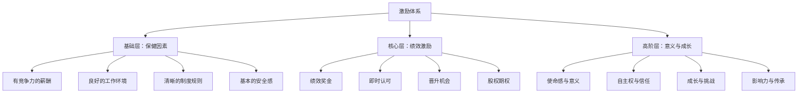
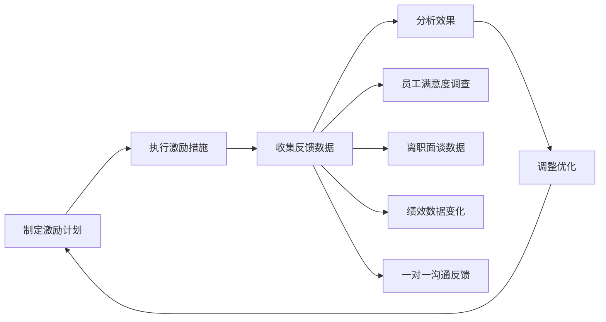

## 激励方法

> "人们会忘记你说过的话，会忘记你做过的事，但永远不会忘记你带给他们的感受。"——玛雅·安杰洛

激励是领导者的核心能力之一。一个不懂激励的领导者，就像一个不会点火的厨师——食材再好，也做不出热菜。激励不是发奖金、喊口号那么简单，它是一门融合了心理学、行为经济学和管理实践的系统工程。

本章从激励的底层理论出发，逐层展开物质激励、精神激励、个性化策略、负激励的完整方法体系，并提供可直接落地的工具和模板。

### 6.1 激励的底层理论

在讨论具体方法之前，必须理解激励"为什么有效"。不理解原理的激励，就像不懂数学的算命——偶尔蒙对，经常翻车。

#### 6.1.1 马斯洛需求层次理论

亚伯拉罕·马斯洛（Abraham Maslow）在1943年提出的需求层次理论，至今仍是理解人类动机的基石：

          /\
         /  \        自我实现需求
        /----\       (实现潜能、创造力)
       /      \
      /--------\     尊重需求
     /          \    (认可、地位、成就感)
    /------------\
   /              \  社交需求
  /----------------\ (归属感、友谊、爱)
 /                  \
/--------------------\ 安全需求
                       (工作保障、健康、财产)
======================== 生理需求
                       (食物、住所、基本生存)

**对领导者的启示**：不要对还在担心裁员的员工大谈"自我实现"——先解决安全感。不要对已经财务自由的高管用奖金激励——给他更大的舞台。识别每个成员当前处于哪个层次，是激励的起点。

#### 6.1.2 赫茨伯格双因素理论

弗雷德里克·赫茨伯格（Frederick Herzberg）在1959年提出了"保健因素-激励因素"二元模型，这是理解激励最实用的理论框架：

| 类型 | 定义 | 典型因素 | 作用机制 |
|------|------|----------|----------|
| 保健因素 | 缺少会导致不满，但满足了也不会带来满意 | 薪酬、工作环境、公司政策、人际关系、工作安全 | 消除不满，但不产生激励 |
| 激励因素 | 存在能带来满意和动力 | 成就感、认可、工作本身的意义、责任、成长机会 | 产生真正的内在动力 |

**关键洞见**：很多领导者犯的最大错误，就是试图用保健因素（加薪、改善办公环境）来解决激励问题。这就像给一个觉得工作无聊的员工换一把更舒服的椅子——椅子再舒服，他还是觉得无聊。

**正确做法**：先确保保健因素达标（消除不满），再通过激励因素（赋予意义、给予认可、提供成长）来点燃动力。

#### 6.1.3 自我决定理论（SDT）

爱德华·德西（Edward Deci）和理查德·瑞安（Richard Ryan）提出的自我决定理论，是当代动机心理学最重要的理论之一。该理论认为人类有三个基本心理需求：

| 需求 | 含义 | 领导者如何满足 |
|------|------|---------------|
| 自主性（Autonomy） | 感到行为是自己选择的，而非被强迫的 | 给予决策权、减少微观管理、允许灵活工作方式 |
| 胜任感（Competence） | 感到自己有能力完成任务、不断进步 | 提供适当挑战、及时反馈、认可进步 |
| 归属感（Relatedness） | 感到与他人有连接、被关心 | 建立信任关系、营造团队氛围、关心个人情况 |

**为什么这个理论重要**：它揭示了一个反直觉的真相——外在奖励（如奖金）有时候反而会削弱内在动机。心理学上称之为"过度理由效应"（Overjustification Effect）。当一个人本来因为热爱而做一件事，你突然开始为这件事付钱，他可能会慢慢觉得"我只是为了钱才做的"，热爱反而消失了。

这不意味着不应该给奖金，而是意味着：**奖金应该作为认可的表达，而不应成为唯一的驱动力。**

#### 6.1.4 期望理论

维克托·弗鲁姆（Victor Vroom）的期望理论用一个简洁的公式描述了动机的本质：

动机强度 = 期望值（E） × 工具性（I） × 效价（V）

- **期望值（E）**："如果我努力，能达成目标吗？"——对努力-绩效关系的信念
- **工具性（I）**："如果我达成了目标，能得到奖励吗？"——对绩效-奖励关系的信念
- **效价（V）**："这个奖励对我来说有价值吗？"——对奖励的渴望程度

**三个因素任何一个为零，动机就是零。** 这解释了很多激励失败的原因：

- 目标太难（E≈0）：员工觉得"反正也做不到，不如不努力"
- 奖励不确定（I≈0）："说好的奖金从来没兑现过，谁还信"
- 奖励不是员工想要的（V≈0）："我不想要团建旅游，我想要现金"

### 6.2 物质激励的正确使用

物质激励是最直接、最容易量化的激励方式，但也是最容易用错的。用好了是强心针，用错了是毒药。

#### 6.2.1 薪酬体系设计原则

薪酬不只是"发多少钱"的问题，更是一个信号系统——它告诉团队"什么行为是被重视的"。

**四大核心原则**：

**第一，内部公平性。** 确保团队内部的薪酬与贡献匹配。不公平感是团队士气的最大杀手。亚当斯的公平理论指出，人们不仅关注自己的绝对收入，更关注与他人相比的相对收入。一个程序员发现比自己贡献小的同事工资比自己高20%，他的工作积极性可能直接腰斩。

落地方法：
- 建立清晰的职级体系和薪酬带（Salary Band）
- 定期进行内部薪酬审计，检查同级别、同贡献的薪酬差异
- 薪酬调整要有明确的依据和标准，不能靠领导拍脑袋

**第二，外部竞争力。** 薪酬至少要达到市场中位数水平。如果长期低于市场水平，核心人才流失只是时间问题。

落地方法：
- 每年至少做一次市场薪酬调研（可参考薪酬报告、招聘网站数据）
- 关键岗位的薪酬定位在市场75分位以上
- 用"全面薪酬"（Total Compensation）思维，基本薪酬不够时用期权、福利、弹性工作等补充

**第三，及时性。** 奖励与行为之间的时间间隔越短，激励效果越好。行为心理学的强化理论早已证明：即时强化远比延迟强化有效。

落地方法：
- 项目奖金在项目结束后的1-2周内发放，不要拖到年底
- 设置即时认可机制（如"Spot Bonus"即时奖金，单次200-500元）
- 季度绩效评估比年度评估更及时

**第四，透明度。** 薪酬体系要清晰透明，让人知道"做什么能涨工资"。暗箱操作只会滋生猜疑和不信任。

落地方法：
- 公开薪酬带和晋升标准，但不必公开每个人的具体工资
- 薪酬调整时明确告知调整依据
- 建立薪酬申诉渠道，允许员工质疑不合理的决定

#### 6.2.2 奖金设计的实操框架

奖金设计是物质激励中最精细的部分。设计不好，要么变成"大锅饭"人人有份失去激励作用，要么变成"丛林法则"制造内卷。

**个人绩效奖金设计**：

| 要素 | 设计要点 | 常见错误 |
|------|----------|----------|
| 目标设定 | SMART原则，上下级共同商定 | 目标过高/过低、目标不清晰 |
| 权重分配 | 核心指标占60%以上，不超过5个KPI | 指标过多、权重分散 |
| 差异化 | 优秀与合格的奖金差距至少2倍 | 差距太小，变成大锅饭 |
| 发放时机 | 季度奖金+年终奖金结合 | 全堆到年底，失去及时性 |

**团队绩效奖金设计**：

团队奖金用于鼓励协作，防止"各扫门前雪"。设计要点：
- 团队目标与个人目标的权重建议为4:6或5:5
- 团队奖金池根据团队整体绩效浮动
- 内部分配由团队leader根据贡献分配，而非平均分配

**项目奖金设计**：

针对特定项目设立，用于激励关键交付。设计要点：
- 在项目启动时就明确奖金规则，而非事后"看心情"
- 设置里程碑奖金（阶段性发放）和项目完成奖金
- 关键角色的奖金系数要高于支持角色

**即时奖金（Spot Bonus）**：

用于奖励超出预期的即刻表现。金额不大（200-2000元），但发放灵活、及时。适合以下场景：
- 紧急任务中的出色表现
- 主动承担额外工作
- 提出并实施了有效的改进建议
- 帮助同事解决了关键问题

#### 6.2.3 股权与期权激励

对于核心人才和高管，股权/期权是比现金奖金更强力的长期激励工具。它的本质是"把员工变成合伙人"，让个人利益与公司长期价值绑定。

**期权（Stock Option）**：给员工以约定价格购买公司股票的权利。公司发展越好，股价越高，期权价值越大。适合创业公司和高成长公司。

**限制性股票（RSU）**：直接授予股票，但有归属期（Vesting Period），通常4年。适合成熟上市公司。

**设计要点**：
- 归属期设计：常用4年归属、1年Cliff（满1年才开始归属第一批），防止"拿到就跑"
- 授予数量要与职级和贡献挂钩，不能搞平均主义
- 定期沟通期权/股权的价值，让员工感受到"这东西真的值钱"

#### 6.2.4 物质激励的常见陷阱

| 陷阱 | 表现 | 后果 | 纠正方法 |
|------|------|------|----------|
| 唯金钱论 | 以为加薪就能解决一切问题 | 边际效用递减，成本越来越高 | 结合精神激励，满足更高层次需求 |
| 大锅饭 | 奖金人人有份、差距微小 | 高绩效者不满，低绩效者无动力 | 拉开差距，让优秀者拿到3-5倍 |
| 延迟发放 | 奖金拖了几个月才发 | 激励效果大打折扣 | 设立即时奖金机制 |
| 规则模糊 | "好好干年底不会亏待你" | 员工不知道该怎么做 | 建立清晰的绩效-奖金对应关系 |
| 朝令夕改 | 奖金规则频繁变动 | 员工不信任制度 | 规则至少保持一个完整周期不变 |

### 6.3 精神激励的深度运用

赫茨伯格的研究反复证明：真正让人长期保持高绩效的，不是钱，而是成就感、认可、成长和意义。物质激励解决"想不想留"的问题，精神激励解决"想不想干"的问题。

#### 6.3.1 认可与赞赏的科学方法

认可是最廉价但最有效的激励工具——它不花一分钱，却能产生巨大的能量。盖洛普的研究发现，获得定期认可的员工，其生产力比未获认可的员工高出14%-29%。

但认可不是随便说句"干得好"就行的。无效的认可比没有认可更糟糕——它会让员工觉得你在敷衍。

**有效认可的三要素（GSS模型）**：

1. **及时（Genuine Timing）**：在行为发生后尽快给予认可，最迟不超过48小时。过了一个月再说"你上个月做得不错"，效果已经微乎其微。
2. **具体（Specific）**：指出具体的行为和影响。"你在昨天的客户演示中用数据对比的方式说服了客户，直接促成了合同签约"比"你做得很好"有效100倍。
3. **真诚（Sincere）**：发自内心地欣赏，而非套路化的表扬。人对虚伪的感知能力极强——你是不是真心的，对方一眼就能看出来。

**认可的六种方式**（按公开程度从低到高）：

| 方式 | 场景 | 适合对象 | 注意事项 |
|------|------|----------|----------|
| 私下感谢 | 一对一面谈、私信 | 所有人，特别是内向者 | 不要只在需要别人帮忙时才感谢 |
| 手写便条 | 放在工位上或邮寄 | 重视仪式感的人 | 手写比打字更有温度 |
| 团队内公开表扬 | 周会、日站会 | 喜欢被公开认可的人 | 确认当事人不排斥公开表扬 |
| 公司级表彰 | 年会、内刊、全员邮件 | 杰出贡献者 | 要有实质内容，不能变成空洞的"获奖感言" |
| 向上反馈 | 向你的上级汇报下属的优秀表现 | 所有人 | 这是被严重低估的认可方式，效果极佳 |
| 赋予荣誉角色 | 代表团队发言、担任项目负责人 | 高潜力人才 | 要匹配实际能力，不能变成负担 |

**常见的认可误区**：
- 只在年终总结时才认可：太晚了，日常化才是关键
- 只认可结果不认可过程：会让员工觉得"只有成功了才有价值"
- 只认可个人不认可团队：制造内部分裂
- 认可方式千篇一律：有的人喜欢公开表扬，有的人觉得当众被点名很尴尬

#### 6.3.2 成长与发展激励

为团队成员提供成长机会，是最高层次的激励。它同时满足了胜任感（我在进步）和自我实现需求（我在成为更好的自己）。

**挑战性任务分配**

分配略超出当前能力的任务，心理学上称之为"最近发展区"（Zone of Proximal Development）——太容易的任务让人无聊，太难的任务让人焦虑，略超出能力的任务让人进入"心流"状态。

操作要点：
- 评估成员的当前能力水平，找到"跳一跳够得到"的任务难度
- 提供必要的支持和资源，确保不是"扔进水里学游泳"
- 设置检查点，及时给予反馈和方向调整
- 允许犯错——成长性任务的目标是学习，不是完美执行

**导师制度**

一对一的导师关系是最高效的成长加速器。好的导师制度设计：

| 要素 | 设计要点 |
|------|----------|
| 匹配原则 | 导师和学员在专业领域有互补性，性格上能兼容 |
| 时间投入 | 每周至少30分钟的一对一交流，持续6个月以上 |
| 目标设定 | 学员在项目开始时设定2-3个成长目标 |
| 导师培训 | 导师也需要培训——不是所有资深员工都会指导人 |
| 效果评估 | 每季度评估一次，包括学员成长和导师满意度 |

**轮岗机会**

让员工在不同岗位上获得全面视野。适合以下场景：
- 高潜力人才的培养计划
- 员工出现职业倦怠，需要新鲜感
- 培养未来的跨部门管理者

轮岗的注意事项：轮岗不是"调岗"，要有明确的学习目标和回归计划。每次轮岗3-6个月为宜，太短学不到东西，太长影响原团队运作。

**学习资源投入**

| 投入方式 | 成本 | 效果 | 适合场景 |
|----------|------|------|----------|
| 内部读书会 | 极低 | 中等 | 建立学习文化、促进团队交流 |
| 在线课程账号 | 低 | 中等 | 通用技能提升 |
| 外部培训/会议 | 中等 | 高 | 专业技能深度提升 |
| 学历/证书补贴 | 中等-高 | 高 | 关键人才的长期培养 |
| 外部教练/顾问 | 高 | 极高 | 高管和核心管理者的突破性成长 |

#### 6.3.3 自主权与信任

丹尼尔·平克在《驱动力》中总结了大量研究：自主性是内在动机最强的驱动力之一。被微观管理的员工，即使工资再高，也很难真正投入工作。

**给予自主权的四个维度**：

1. **任务自主**：让员工参与决定做什么。在可能的范围内，让团队成员选择自己想负责的任务或项目方向。
2. **方法自主**：让员工决定怎么做。关注结果而非过程——只要能达到目标，具体用什么方法由员工自己决定。
3. **时间自主**：在合理范围内允许灵活的工作时间。不是每个人都是"朝九晚五"型，有些人上午效率最高，有些人晚上灵感最好。
4. **团队自主**：让员工参与决定和谁一起工作。在组建项目小组时，征求成员的意见。

**自主权与管控的平衡**：

自主不等于放任。以下是不同情境下自主权的推荐程度：

| 情境 | 推荐自主程度 | 原因 |
|------|-------------|------|
| 资深员工+常规任务 | 高（90%） | 他们知道怎么做，放手即可 |
| 资深员工+新挑战 | 中高（70%） | 给空间但保持定期沟通 |
| 新员工+常规任务 | 中（50%） | 有流程可循，但需要检查 |
| 新员工+复杂任务 | 低（30%） | 需要较多指导和检查点 |
| 危机/紧急情况 | 极低（10%） | 需要集中决策、快速执行 |

#### 6.3.4 意义感与使命感激励

维克多·弗兰克尔在《活出生命的意义》中写道："那些知道自己为什么而活的人，可以忍受任何一种怎样活。"当员工感到自己的工作有意义时，他们的投入程度和抗压能力都会大幅提升。

**如何为工作赋予意义**：

1. **连接大目标**：让每个人看到自己的工作如何影响最终结果。一个写测试用例的工程师，如果知道"我的测试保障了每天100万用户的体验"，他的工作态度会完全不同。
2. **讲述用户故事**：定期分享用户反馈和成功案例。当开发者看到自己的产品改变了用户的生活，比任何奖金都更有激励效果。
3. **创造仪式感**：产品上线庆祝、里程碑回顾、团队故事分享——这些仪式帮助团队感受到"我们在做一件重要的事"。
4. **领导者的以身作则**：如果领导者自己都不相信团队的使命，员工更不会相信。意义感是从上到下传递的。

### 6.4 个性化激励策略

"一刀切"的激励方式注定低效。每个人的需求、动机、性格都不同，高效的领导者必须学会"对症下药"。

#### 6.4.1 了解团队成员的激励密码

**三种了解方式**：

**第一，一对一深度沟通。** 最直接、最有效的方式。关键不是问"你想要什么激励"（大部分人自己也说不清楚），而是问：
- "你最享受工作中的哪些时刻？"
- "什么事情会让你觉得沮丧或失去动力？"
- "你未来3年的职业目标是什么？"
- "你觉得目前的工作中，什么阻碍了你发挥最大潜力？"

**第二，行为观察。** 注意以下信号：
- 他们在什么情况下最兴奋、最投入？
- 他们在抱怨什么？（抱怨往往指向未被满足的需求）
- 他们主动争取什么？（主动争取的，就是他们在乎的）
- 他们离职时的真实原因是什么？（如果有的话）

**第三，性格评估工具。** 工具不能替代沟通，但可以提供参考框架：
- **MBTI**：了解认知偏好（内向/外向、感觉/直觉等）
- **DISC**：了解行为风格（支配型、影响型、稳定型、谨慎型）
- **盖洛普优势测评**：了解个人的天赋优势领域
- **职业锚测评**：了解核心职业价值观

#### 6.4.2 个性化激励矩阵

根据核心需求和性格特征，将团队成员分为五种类型，对应不同的激励策略：

| 类型 | 核心需求 | 典型表现 | 激励策略 | 避免事项 |
|------|----------|----------|----------|----------|
| 事业型 | 成就、晋升、挑战 | 积极争取重要项目，关注晋升时间表 | 提供高可见度项目、明确晋升路径、给予决策权 | 不要让他做重复性、低挑战的工作 |
| 学习型 | 成长、知识、技能 | 热衷于学习新技术，关注能力提升 | 提供学习资源、导师、培训机会、轮岗 | 不要只让他做已掌握的事 |
| 关系型 | 归属、认可、和谐 | 重视团队氛围，关注人际关系 | 营造温暖的团队氛围、公开认可、安排合作型任务 | 不要让他长期孤立工作 |
| 自主型 | 自由、空间、弹性 | 反感微观管理，喜欢自己安排工作 | 给予充分自主权、灵活工作方式、减少审批 | 不要过度管控和频繁检查 |
| 安全型 | 稳定、保障、确定性 | 偏好明确的规则和预期 | 提供清晰的目标、稳定的环境、及时的反馈 | 不要频繁变动规则或方向 |

**重要提醒**：大多数人的激励密码是混合型的，不是单一类型。一个"事业型+学习型"的人，既想要晋升机会，也渴望持续学习。关键是在一对一沟通中找到每个人的核心驱动因素。

#### 6.4.3 不同职业阶段的激励重点

| 职业阶段 | 典型特征 | 激励重点 | 具体做法 |
|----------|----------|----------|----------|
| 新人期（0-2年） | 好奇心强、缺乏信心、渴望指导 | 成长感和被关注 | 配备导师、定期反馈、设置小目标积累信心 |
| 成长期（2-5年） | 能力快速提升、开始寻求突破 | 挑战和认可 | 分配有挑战的项目、给予更多责任、公开认可成就 |
| 成熟期（5-10年） | 能力稳定、可能进入平台期 | 意义感和影响力 | 赋予导师角色、参与决策、开拓新领域 |
| 资深期（10年+） | 经验丰富、可能面临职业倦怠 | 自主性和传承价值 | 给予战略级任务、鼓励知识传承、提供灵活安排 |

### 6.5 负激励的使用

负激励（批评、处罚、纠正）是领导者不愿意用但必须掌握的技能。回避负激励不是善良，是失职——一个从不指出问题的领导，等于在默许错误行为。

#### 6.5.1 建设性批评的SBI模型

SBI模型是反馈领域最经典、最实用的框架：

| 要素 | 含义 | 示例 |
|------|------|------|
| **S - Situation（情境）** | 描述具体的时间、地点、场景 | "在昨天下午的客户方案评审会上..." |
| **B - Behavior（行为）** | 描述观察到的具体行为，而非主观评价 | "你在展示数据时，有三处关键数据与原始数据不一致..." |
| **I - Impact（影响）** | 说明行为产生的具体影响 | "这让客户对我们数据的可靠性产生了质疑，整场会议的氛围都变了。" |

**完整示例**：

低效批评："你昨天的表现太不专业了。"

高效批评（SBI）："在昨天的客户会议上（S），你在方案中出现了三处关键数据错误（B），这让客户对我们的专业性产生了质疑，后续讨论中他们多次追问数据来源（I）。我们一起复盘一下数据核对的流程，看看怎么避免类似问题。"

**进阶版：SBI + 建议（SBII模型）**

在SBI之后增加第四步——**Intention（意图/建议）**：
"我希望我们一起制定一个数据核对清单，确保每次客户演示前都有双重验证。你觉得这个方向可行吗？"

#### 6.5.2 批评的六条铁律

1. **对事不对人。** 批评行为本身，而非人格。"这个方案的数据有错误"而不是"你怎么这么粗心"。一旦涉及人格评价，对方的防御机制会全面启动，反馈就失效了。

2. **私下批评，公开表扬。** 公开批评会摧毁一个人的尊严和在团队中的威信。批评永远在私下一对一的场景中进行。

3. **批评之后给出路。** 纯粹的批评只让人知道"错了"，但不知道"怎么改"。每次批评后必须给出具体的改进建议或行动计划。

4. **控制情绪，保持尊重。** 生气时不要批评人。等情绪平复后再谈话。领导者在愤怒中的批评，往往会变成人身攻击，造成不可挽回的关系损伤。

5. **及时批评。** 问题发生后尽快处理。拖延只会让问题发酵，也让当事人觉得"当时不说，现在翻旧账"。

6. **先肯定再批评（三明治法则的灵活使用）。** "三明治法则"（表扬-批评-表扬）被一些人认为是老套的技巧，但核心原则是对的——在提出问题之前，先让对方感到你认可他的价值。关键是要真诚，不要变成套路。

#### 6.5.3 处罚与纪律管理

处罚是最后手段，不是首选。但在以下情况，必须使用：

- 反复违反已知规则且口头纠正无效
- 严重的道德或合规问题（如数据造假、利益冲突）
- 行为对团队或客户造成了实质性伤害

**处罚的阶梯体系**：

| 阶段 | 措施 | 适用场景 |
|------|------|----------|
| 第一步 | 口头提醒 | 首次、轻微的违规 |
| 第二步 | 正式谈话（记录在案） | 重犯或中等严重程度 |
| 第三步 | 书面警告 | 口头纠正无效、较严重问题 |
| 第四步 | 绩效改进计划（PIP） | 持续绩效不达标 |
| 第五步 | 调岗或降级 | 严重问题但仍有其他价值 |
| 第六步 | 解除劳动关系 | 最终手段 |

**PIP（绩效改进计划）的设计要点**：
- 明确列出需要改进的具体行为和指标
- 设定合理的改进期限（通常30-90天）
- 提供必要的支持和资源
- 每周进行一次进展回顾
- 明确"达到标准"和"未达到标准"的具体后果

#### 6.5.4 负激励的常见误区

| 误区 | 为什么是错的 | 正确做法 |
|------|-------------|----------|
| 从不批评 | 等于默许错误，劣币驱逐良币 | 建立正常的反馈文化，批评是常态而非例外 |
| 当众批评 | 摧毁尊严，制造怨恨 | 私下一对一沟通 |
| 只批评不指导 | 让人知道错了但不知道怎么改 | 给出具体改进建议和资源支持 |
| 情绪化批评 | 变成人身攻击，损害关系 | 冷静后再谈，聚焦事实和行为 |
| 翻旧账 | 让人觉得"永远过不去" | 聚焦当前问题，已解决的不再提 |
| 只罚不赏 | 团队恐惧文化，人人自危 | 正负激励比例至少3:1 |

### 6.6 激励体系的系统设计

单点的激励措施效果有限，真正有效的激励是一个系统工程——需要多种手段配合，持续迭代优化。

#### 6.6.1 激励体系的三层架构

**基础层**：确保没有不满。如果基础层出了问题，上层的激励手段全部失效。
**核心层**：驱动日常的高绩效。这是激励体系的主体。
**高阶层**：激发内在动力和长期忠诚。这是从"留住人"到"留住心"的关键。

#### 6.6.2 激励诊断清单

定期用以下清单检视你的团队激励状况：

□ 团队成员是否清楚知道"做好了能得到什么"？
□ 最近一次认可团队成员是什么时候？（超过1周需要警惕）
□ 团队中是否有人处于"被忽视"状态？
□ 团队成员是否有清晰的成长路径？
□ 团队的薪酬是否处于市场合理水平？
□ 团队成员是否感到被信任和被尊重？
□ 是否有成员近期士气明显下降？
□ 正负激励的比例是否健康（至少3:1）？
□ 团队成员是否理解工作的意义和价值？
□ 个性化激励是否到位——你知道每个人在乎什么吗？

#### 6.6.3 不同团队规模的激励策略

| 团队规模 | 激励重点 | 关键方法 | 注意事项 |
|----------|----------|----------|----------|
| 3-8人 | 一对一关系、即时反馈 | 频繁的1:1沟通、灵活的小额奖励、直接的认可 | 不要搞复杂的制度，保持人情味 |
| 8-20人 | 制度化+个性化结合 | 建立基本的绩效体系，同时保留个性化的关注 | 开始需要"中层"来传递激励 |
| 20-50人 | 体系化、制度化 | 完善的薪酬体系、晋升通道、培训体系 | 防止激励在传递中衰减 |
| 50人以上 | 文化驱动 | 建立激励文化而非依赖个人、打造雇主品牌 | 体系复杂后要定期简化和优化 |

### 6.7 远程与混合团队的激励

远程办公时代，传统的激励方式面临新挑战——你无法通过拍拍肩膀来表示认可，也无法通过营造办公室氛围来增强归属感。

#### 6.7.1 远程激励的特殊挑战

| 挑战 | 原因 | 解决方向 |
|------|------|----------|
| 孤立感 | 缺乏面对面交流 | 增加非工作沟通、虚拟团建 |
| 不可见性 | 工作成果不容易被看到 | 结果导向的认可机制 |
| 边界模糊 | 工作与生活界限不清 | 尊重下班时间、关注健康 |
| 信任缺失 | 看不到就管不到的心态 | 转向结果管理、减少打卡思维 |
| 疲劳感 | 视频会议过度、异步沟通效率低 | 精简会议、优化协作工具 |

#### 6.7.2 远程激励的实操方法

**虚拟认可墙**：在Slack/飞书/钉钉设立#kudos频道，团队成员随时可以公开感谢他人。每周评选"最被感谢的人"。

**异步成果展示**：每周五让团队成员在文档中用3句话总结本周最自豪的成果。所有人可以点赞和评论。

**远程配对Coffee Chat**：用工具随机配对两个团队成员进行15分钟的非工作聊天，保持人际连接。

**实体聚会**：每季度或半年组织一次线下聚会，补偿远程工作中的社交缺失。哪怕只有1-2天，效果也远超纯线上。

**结果导向的认可**：远程环境下，"坐班时间"不再是衡量标准。认可要聚焦在成果和影响力上，而非"谁加班最多"。

### 6.8 激励的常见错误与纠正

即使理解了理论和方法，实际操作中仍然容易犯错。以下是最常见的激励错误及其纠正方案。

#### 6.8.1 十大激励错误

**错误一：用同一种方式激励所有人。**
后果：对A有效的激励，对B可能是无效甚至负面的。
纠正：了解每个人的"激励密码"，个性化激励。

**错误二：只在年终才做绩效回顾和认可。**
后果：一年的认可集中在一次，效果微弱，且容易遗漏。
纠正：建立季度甚至月度的认可节奏。

**错误三：重物质轻精神。**
后果：成本越来越高，但效果越来越差（边际效用递减）。
纠正：确保物质激励达标的同时，加大精神激励的比重。

**错误四：只认可明星员工。**
后果：大多数人觉得"跟我无关"，中坚力量流失。
纠正：关注"沉默的贡献者"，建立多层次的认可体系。

**错误五：激励与战略脱节。**
后果：激励的行为与公司目标不一致。比如公司需要创新，但奖金只考核KPI完成率。
纠正：确保激励体系指向公司的战略方向。

**错误六：害怕拉开差距。**
后果："大锅饭"让优秀者不满，平庸者安逸。
纠正：接受并拥抱差异化，让贡献与回报成正比。

**错误七：承诺不兑现。**
后果：信任崩塌，之后的任何承诺都不再有效。
纠正：只承诺能兑现的，兑现所有承诺过的。实在无法兑现时，坦诚沟通原因。

**错误八：忽视负面信号。**
后果：员工士气低落、离职率上升时才意识到问题。
纠正：定期进行团队健康度检查，关注早期信号。

**错误九：过度依赖外在奖励。**
后果：员工变成"奖金驱动型"，没有奖金就不努力。
纠正：培养内在动机——意义感、成长感、自主感。

**错误十：领导者自己动力不足。**
后果：一个没精打采的领导者，带不出有活力的团队。
纠正：先照顾好自己的状态，找到自己的使命感，然后才能激励他人。

### 6.9 激励效果的衡量

激励做得好不好，不能靠感觉，要看数据。

#### 6.9.1 关键衡量指标

| 指标 | 衡量方法 | 健康范围 | 预警信号 |
|------|----------|----------|----------|
| 员工满意度 | 季度匿名调查 | ≥4.0/5.0 | 低于3.5或连续下降 |
| 员工净推荐值（eNPS） | "你会推荐朋友来这里工作吗？" | ≥30 | 低于0 |
| 主动离职率 | 主动离职人数/总人数 | <10%/年 | 超过15%或核心人才离职 |
| 绩效达标率 | 达标人数/总人数 | >80% | 低于60% |
| 内部晋升率 | 内部晋升数/总晋升数 | >50% | 低于30%，说明成长通道堵塞 |
| 认可频率 | 每月团队内的认可次数 | 每人每月≥1次 | 多人超过1个月未获任何认可 |

#### 6.9.2 激励效果的反馈循环

每个季度进行一次激励效果的系统回顾：
1. 上个季度做了哪些激励措施？
2. 各项指标有什么变化？
3. 员工的反馈是什么？
4. 哪些措施效果好，继续坚持？
5. 哪些措施效果差，需要调整？
6. 下个季度的重点激励方向是什么？

### 6.10 本章小结

激励是领导者最具杠杆效应的能力。一个会激励的领导者，能让普通人做出不普通的成绩；一个不会激励的领导者，能把天才变成庸才。

**核心要点回顾**：

1. **理解理论**：马斯洛需求层次、赫茨伯格双因素、自我决定理论、期望理论——这些不是学术装饰，而是指导实践的地图。
2. **物质激励是地基**：有竞争力的薪酬、清晰的奖金规则、及时的发放——地基不牢，上面再好的精神激励都是空中楼阁。
3. **精神激励是灵魂**：认可、成长、自主权、意义感——这是让人从"不得不干"到"我想干"的关键。
4. **个性化是关键**：没有放之四海而皆准的激励方法，了解每个人的需求才是王道。
5. **负激励是必要的**：回避批评不是善良，是失职。掌握SBI模型，让批评成为成长的催化剂。
6. **系统思维**：单点的激励措施效果有限，需要建立完整的激励体系并持续优化。

激励的最高境界，是让每个人都能找到工作的意义，在成长中实现自我价值——这才是一个领导者能给团队的最好礼物。
