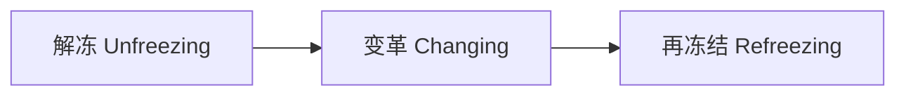
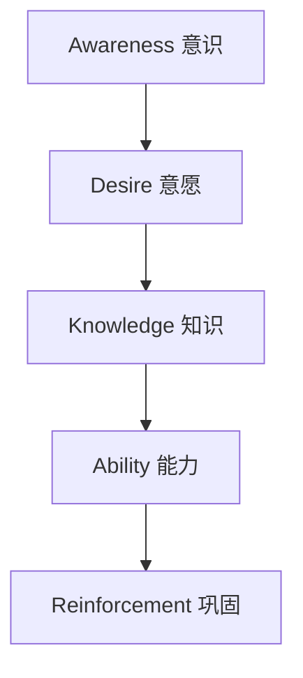
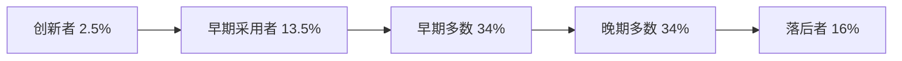

## 七、变革管理

变革管理是领导者最具挑战性也最具价值的能力之一。麦肯锡的研究表明，约 70% 的组织变革项目未能达到预期目标，而失败的首要原因不是技术或策略问题，而是人的因素——对人的关注不足、沟通不畅、领导力缺失。掌握变革管理的系统方法论，是领导者将"好想法"转化为"好结果"的关键桥梁。

### 7.1 变革的必要性与底层逻辑

#### 7.1.1 变革的本质

变革不是"打破旧的、建立新的"这么简单。从组织行为学的角度看，变革是一个复杂的社会心理过程，涉及认知重构、行为模式切换和文化惯性的克服。

变革的本质可以用一个公式来理解：

> 变革成功 = (对现状的不满 × 对未来的愿景 × 第一步的可行性) > 变革阻力

这就是 Richard Beckhard 和 David Gleicher 提出的**变革公式**（Change Formula）。三个乘数中任何一个为零，变革就不可能发生。许多领导者只关注"描绘未来愿景"，却忽略了"对现状的不满"——人们没有感受到痛，就不会动。

#### 7.1.2 变革的五大驱动力

| 驱动力 | 具体表现 | 案例 |
|--------|---------|------|
| **技术颠覆** | AI、云计算、区块链等新技术重塑行业格局 | ChatGPT 发布后，教育、客服、编程等行业被迫重新定义工作方式 |
| **市场竞争** | 新进入者用全新商业模式颠覆传统玩家 | 拼多多用社交电商模式冲击淘宝京东的电商格局 |
| **客户需求** | 消费者期望从标准化转向个性化、即时化 | 从"次日达"到"小时达"，物流行业被迫重构供应链 |
| **组织内部** | 效率低下、流程冗余、文化僵化、人才流失 | 大型企业层级过多导致决策缓慢，被灵活的小团队抢占市场 |
| **政策法规** | 新法规要求组织调整运营模式 | 数据保护法（如 GDPR）迫使企业全面改造数据管理流程 |

#### 7.1.3 两种变革模式

- **适应性变革（Adaptive Change）**：在现有框架内逐步调整，风险低、速度慢。适用于渐进式改进，如优化客服流程、调整绩效考核方式。
- **变革性变革（Transformative Change）**：彻底重塑组织的核心结构、战略或文化，风险高、速度快。适用于根本性转型，如从传统零售转向全渠道数字零售。

领导者需要判断组织面临的变革属于哪种类型，因为两种变革的管理方法完全不同。用管理适应性变革的方法去推动变革性变革，注定会失败。

### 7.2 核心变革管理模型

#### 7.2.1 科特的变革八步法（Kotter's 8-Step Model）

约翰·科特在《领导变革》一书中提出的八步法是变革管理领域最广泛使用的框架。以下是每一步的深度解析。

**第一步：建立紧迫感（Create a Sense of Urgency）**

目标：让组织中至少 75% 的管理层真正认识到"不变不行"。

具体做法：
- 收集并展示令人不安的数据：市场份额下降、客户投诉增加、竞争对手动态
- 制作"危机地图"：将外部威胁和内部问题可视化
- 让客户的声音进入会议室：安排管理层直接听取客户投诉
- 对比竞争对手的变革速度，制造"落后焦虑"
- 避免虚假紧迫感——"狼来了"喊多了就没人信了

关键指标：当人们开始主动讨论"我们该怎么办"而不是"为什么要变"时，紧迫感就建立起来了。

**第二步：组建领导联盟（Build a Guiding Coalition）**

变革不能靠一个人推动。你需要一个由 3-7 人组成的"变革核心团队"，成员需要满足三个条件：

1. **职位权力**：有足够的决策权和资源调配权
2. **专业能力**：在关键领域有深厚的专业知识
3. **领导信誉**：在组织中有广泛的人际网络和影响力

组建联盟的实操步骤：
- 列出组织中所有关键决策者和意见领袖
- 评估每个人对变革的态度：支持者、中立者、反对者
- 首先争取"支持者"和"高影响力中立者"
- 用一对一沟通而非群体会议来争取关键人物
- 给联盟成员明确的角色和责任分工

**第三步：创建变革愿景（Form a Strategic Vision and Initiatives）**

好的变革愿景需要满足 SMART-V 原则：
- **S（Specific）**：具体明确，不含糊
- **M（Measurable）**：可衡量，有具体指标
- **A（Aspirational）**：令人振奋，有感召力
- **R（Relevant）**：与组织战略和员工利益相关
- **T（Time-bound）**：有明确的时间框架
- **V（Vivid）**：能被具体描述和想象

愿景公式示例：「在 [时间] 内，通过 [核心策略]，使 [组织/产品] 达到 [具体状态]，从而 [带来什么价值]。」

**第四步：传播变革愿景（Enlist a Volunteer Army）**

科特指出，愿景传播需要满足"有效沟通的 7 倍法则"——你认为已经说够了的时候，实际上只传达了目标信息量的 1/7。

传播策略：
- **多渠道重复**：全员会议、部门会议、一对一对话、邮件、内部论坛、视频
- **言行一致**：领导者的行为是比任何邮件都更有力的沟通工具
- **讲故事**：用真实的成功案例和客户故事来诠释愿景，而不是念 PPT
- **回应疑虑**：设立"变革问答"机制，定期收集和回应员工的问题
- **分层传播**：对高管讲战略逻辑，对中层讲执行路径，对基层讲个人收益

**第五步：授权行动、消除障碍（Enable Action by Removing Barriers）**

常见的变革障碍及应对：

| 障碍类型 | 具体表现 | 应对策略 |
|---------|---------|---------|
| 结构障碍 | 组织架构不支持新流程 | 重新设计汇报关系和决策流程 |
| 技能障碍 | 员工缺乏新系统/工具的操作能力 | 提供系统化培训，设立"变革大使"一对一辅导 |
| 制度障碍 | KPI 和激励体系与变革方向矛盾 | 调整绩效考核标准，将变革行为纳入评估 |
| 心理障碍 | 恐惧、不信任、无力感 | 提供心理安全感，让员工参与决策过程 |
| 资源障碍 | 预算、人员、时间不足 | 优先为变革项目配置资源，暂时削减非核心项目 |

**第六步：创造短期成果（Generate Short-Term Wins）**

短期成果不是"锦上添花"，而是变革存续的"氧气"。没有短期成果，怀疑论者会占上风，支持者会动摇，变革联盟会瓦解。

设计短期成果的原则：
- **在 90 天内可见**：任何超过一个季度才能看到结果的"胜利"都太晚了
- **明确归因**：成果必须能清楚地归功于变革努力，而不是巧合
- **对多数人可见**：不是只有管理层才能看到的抽象数据
- **与愿景相关**：成果要能印证变革方向的正确性

短期成果的典型形式：
- 一个试点团队的效率提升了 20%
- 客户满意度评分首次突破某个里程碑
- 新流程使审批时间从 5 天缩短到 1 天
- 一个跨部门协作项目的成功交付

**第七步：巩固成果、推动更多变革（Sustain Acceleration）**

科特特别警告"过早宣布胜利"是变革的头号杀手。在变革嵌入文化之前，任何胜利都是暂时的。

巩固策略：
- 利用第一个短期成果的势能，推动更多、更大规模的变革项目
- 持续引进新鲜血液——招聘认同新方向的人才
- 识别并培养下一代变革领导者
- 重新审视组织结构、制度和流程，确保与变革方向一致
- 每季度进行一次"变革健康检查"

**第八步：将变革植入文化（Institute Change）**

变革只有嵌入组织文化才算真正成功。文化植入的标志是：新员工入职时，看到的就是变革后的方式，不知道"以前是怎样的"。

文化植入方法：
- 将变革后的行为模式写入员工手册和行为准则
- 在招聘面试中加入价值观匹配评估
- 通过"老带新"故事传递变革的历程和意义
- 在晋升标准中纳入变革相关的行为表现
- 定期举办变革周年纪念活动，强化集体记忆

#### 7.2.2 勒温的三阶段模型（Lewin's Change Model）

库尔特·勒温（Kurt Lewin）的模型虽然简单，但深刻揭示了变革的本质：

**解冻阶段**：打破现状的平衡状态。关键动作：
- 制造对现状的不满（展示问题、揭示差距）
- 建立心理安全感（"变革不等于否定你过去的工作"）
- 明确不变的代价

**变革阶段**：引入新的行为、流程或结构。关键动作：
- 提供清晰的方向和指导
- 通过试点项目验证新方法
- 提供充足的培训和资源支持
- 允许试错，营造学习型氛围

**再冻结阶段**：将变革成果固化为新的常态。关键动作：
- 将新流程制度化
- 调整激励和考核体系
- 庆祝新状态的达成
- 持续监督，防止倒退

#### 7.2.3 ADKAR 模型（Prosci）

ADKAR 模型聚焦于个人层面的变革，强调每个个体都需要经历五个阶段才能真正改变：

| 阶段 | 含义 | 领导者的行动 |
|------|------|------------|
| **Awareness** | 理解为什么要变革 | 透明沟通变革的商业逻辑和外部压力 |
| **Desire** | 愿意参与变革 | 展示变革对个人的好处，创造参与感 |
| **Knowledge** | 知道如何变革 | 提供培训、操作手册和最佳实践 |
| **Ability** | 能够在实际工作中应用 | 提供练习机会、辅导和反馈 |
| **Reinforcement** | 持续保持新行为 | 奖励、认可、制度保障 |

ADKAR 的价值在于它提供了"个人变革进度表"——你可以精确地诊断出某个员工或团队卡在哪个阶段，然后对症下药。

#### 7.2.4 McKinsey 7-S 模型

当变革涉及组织整体转型时，McKinsey 7-S 模型提供了系统性诊断框架。七个要素必须相互对齐，否则变革会在某个环节断裂：

- **Strategy（战略）**：变革的方向和路径
- **Structure（结构）**：组织架构和汇报关系
- **Systems（系统）**：流程、制度和技术工具
- **Shared Values（共享价值观）**：组织文化的核心信念
- **Style（风格）**：领导风格和管理方式
- **Staff（人员）**：人才配置和能力发展
- **Skills（技能）**：组织的核心能力和专业技能

7-S 的核心洞察是：硬要素（战略、结构、系统）容易改变，但软要素（价值观、风格、人员、技能）决定了变革能否持续。许多变革失败的原因就是只改了硬要素，忽略了软要素。

### 7.3 变革阻力的深层管理

#### 7.3.1 阻力的心理学根源

阻力不是"人不配合"这么简单。从心理学角度看，阻力是人类面对威胁时的正常反应。

**变革激活的大脑反应**：
神经科学研究表明，不确定性会激活大脑的杏仁核（恐惧中心），触发"战或逃"反应。在变革情境中，员工会经历类似的心理过程：
1. 否认："这不是真的，不会影响到我"
2. 愤怒："凭什么要我改变？"
3. 讨价还价："能不能只改一部分？"
4. 沮丧："我真的做不到了"
5. 接受："好吧，试试看吧"

这与 Elisabeth Kübler-Ross 的"悲伤五阶段"模型高度一致——因为变革本质上是一种"失去"（失去熟悉的工作方式、失去确定性、失去身份认同）。

#### 7.3.2 阻力的六大来源与精准应对

| 阻力来源 | 表现 | 根本原因 | 精准应对策略 |
|---------|------|---------|------------|
| **不确定性恐惧** | 担心、焦虑、谣言传播 | 对未来缺乏认知控制感 | 提供清晰的变革路线图，定期更新进度，"没有消息"不是好消息 |
| **利益损失** | 抗拒、暗中破坏、拉帮结派 | 担心权力、地位、收入受损 | 坦诚沟通可能的影响，提供过渡方案，确保公平补偿 |
| **习惯惯性** | "以前都是这么做的" | 大脑倾向于走"最低能耗路径" | 从小处开始改变，让新习惯比旧习惯更方便 |
| **缺乏信任** | 怀疑动机、质疑领导能力 | 过去的承诺未兑现或沟通不透明 | 用行动而非言语建立信任，先兑现小承诺再做大事 |
| **能力不足** | 焦虑、自我怀疑、消极怠工 | 担心自己无法胜任新要求 | 提供充分培训，允许试错期，匹配任务与能力 |
| **认知差异** | "我觉得没必要" | 信息不对称或价值观不同 | 用数据和案例说服，尊重不同观点但坚持方向 |

#### 7.3.3 阻力诊断工具：力场分析

力场分析（Force Field Analysis）是勒温提出的经典工具，用于识别和量化变革的推动力和阻碍力。

操作步骤：
1. 明确变革目标
2. 列出所有推动力（驱动因素），按强度 1-5 打分
3. 列出所有阻碍力（抵抗因素），按强度 1-5 打分
4. 计算总推动力和总阻碍力的差值
5. 制定策略：增强推动力 + 减弱阻碍力

力场分析的关键洞察：**减弱阻碍力通常比增强推动力更有效**。强行增加推动力容易引发更大的反弹。

#### 7.3.4 "变革接受度曲线"

组织中不同人对变革的接受速度不同，可以分为五类：

- **创新者（Innovators）**：热衷尝试新事物，但影响力有限
- **早期采用者（Early Adopters）**：有影响力的意见领袖，是最关键的争取对象
- **早期多数（Early Majority）**：务实主义者，看到证据后会跟进
- **晚期多数（Late Majority）**：被压力和趋势推动才行动
- **落后者（Laggards）**：强烈抗拒，可能需要最后通牒

领导策略：不要试图同时说服所有人。集中精力争取"早期采用者"，让他们成为变革的代言人，用他们的影响力去带动"早期多数"。

### 7.4 变革领导者的角色与能力

#### 7.4.1 五重角色

| 角色 | 核心任务 | 关键行为 |
|------|---------|---------|
| **愿景家** | 指明方向，激发信念 | 用故事和画面描绘未来，让每个人都能看到自己在新世界中的位置 |
| **架构师** | 设计变革路径和结构 | 制定分阶段实施计划，配置资源，消除结构性障碍 |
| **教练** | 帮助团队成员成长 | 识别每个人在变革中的卡点，提供个性化辅导和支持 |
| **沟通者** | 持续传递信息和信心 | 多渠道、多频次、多形式沟通，确保信息穿透到每个角落 |
| **守护者** | 保护变革成果不倒退 | 建立监控机制，在组织疲倦时坚守方向 |

#### 7.4.2 变革领导者的关键能力

**系统思维**：看到变革的全貌和各部分之间的关联。一个部门的变革可能影响其他部门，一个流程的调整可能需要配套制度的改变。

**情绪韧性**：变革过程中必然会遭遇挫折、反弹和质疑。领导者需要管理好自己的情绪，在低谷时保持稳定，才能给团队信心。

**政治智慧**：组织变革不可避免地涉及权力博弈。领导者需要识别关键利益相关者，理解他们的诉求，找到共赢方案。

**讲故事能力**：数据说服大脑，故事说服人心。好的变革领导者能够将抽象的愿景转化为具体、生动、有感染力的故事。

**谦逊与倾听**：最了解一线问题的人往往不是领导层。保持谦逊，倾听来自基层的声音，能让变革方案更接地气。

### 7.5 变革管理实操工具箱

#### 7.5.1 变革准备度评估

在启动变革前，用以下清单评估组织的准备度：

**组织层面**：
- [ ] 最高管理层是否明确支持变革？
- [ ] 组织是否经历过类似的变革？结果如何？
- [ ] 目前的组织文化是否对变化持开放态度？
- [ ] 是否有足够的资源（预算、人员、时间）支持变革？
- [ ] 组织当前是否承受过多变革压力？（变革疲劳）

**个人层面**：
- [ ] 员工是否理解为什么要变革？
- [ ] 员工是否相信变革是可行的？
- [ ] 员工是否具备变革所需的技能？
- [ ] 员工是否有参与变革的意愿？
- [ ] 是否有激励机制支持新行为？

#### 7.5.2 利益相关者分析矩阵

| | 高影响力 | 低影响力 |
|---|---------|---------|
| **高支持度** | **核心盟友**：让他们成为变革大使，赋权推动 | **隐形支持者**：保持他们的热情，适当赋权 |
| **低支持度** | **关键战场**：优先沟通，了解顾虑，寻找共赢 | **观察者**：保持信息畅通，等他们看到成果后转化 |

操作步骤：
1. 列出所有利益相关者
2. 评估每个人的影响力（1-5 分）和支持度（1-5 分）
3. 在矩阵中定位每个人
4. 针对每个象限制定沟通和行动策略
5. 每月更新一次评估

#### 7.5.3 变革沟通计划模板

| 阶段 | 沟通目标 | 渠道 | 频率 | 负责人 |
|------|---------|------|------|--------|
| 启动前 | 建立紧迫感，解释"为什么" | 全员大会、部门会议 | 1 次 + N 次小会 | CEO + 变革团队 |
| 启动期 | 澄清"是什么"和"怎么做" | 内部邮件、FAQ 文档、培训 | 每周 1 次更新 | 变革项目经理 |
| 实施期 | 分享进展、庆祝成果 | 通讯、标杆案例分享、周报 | 持续 | 各部门负责人 |
| 巩固期 | 强化新行为，防止倒退 | 绩效反馈、文化活动 | 月度 | HR + 管理层 |

沟通的黄金法则：
- **先说什么**：为什么要变（紧迫感）→ 变成什么样（愿景）→ 怎么变（路径）→ 对你有什么影响（个人关切）
- **说真话**：不确定的就说不确定，不夸大也不隐瞒
- **允许反馈**：沟通是双向的，设立渠道让员工表达疑虑

#### 7.5.4 变革健康度仪表盘

变革实施过程中，需要持续监控以下关键指标：

| 维度 | 指标 | 数据来源 | 健康阈值 |
|------|------|---------|---------|
| **认知** | 员工对变革目标的理解度 | 匿名问卷 | > 80% |
| **态度** | 对变革的支持率 | 脉搏调查 | > 60% |
| **行为** | 新流程/工具的采纳率 | 系统使用数据 | > 70%（90天内） |
| **成果** | 变革 KPI 的达成率 | 业务数据 | 按阶段目标 |
| **疲劳** | 变革疲劳指数 | 匿名问卷 + 离职率 | 疲劳指数 < 30% |

### 7.6 变革中的常见陷阱

#### 7.6.1 十大致命错误

1. **过早宣布胜利**：第一个小成果出来就松懈，导致变革半途而废
2. **跳过"解冻"**：直接推行新方案，没有先让组织感受到变革的必要性
3. **只靠高层推动**：没有建立中层和基层的支持网络
4. **忽视"人"的因素**：只关注流程和系统，忽略了员工的情绪和担忧
5. **变革过载**：同时推进太多变革项目，导致组织疲倦和注意力分散
6. **沟通不足**：以为开了一个会就等于沟通完成
7. **缺乏问责**：没有人对变革的具体结果负责
8. **一刀切**：对不同群体使用相同的变革策略
9. **忽视文化**：改了制度和流程但没改文化，旧习惯很快反弹
10. **领导不一致**：嘴上说变革重要，但行为和资源分配没有跟上

#### 7.6.2 变革疲劳的识别与应对

当组织同时经历多次变革或变革持续时间过长时，会出现"变革疲劳"——表现为员工冷漠、抵触、效率下降和离职率上升。

应对策略：
- **排优先级**：不是所有变革都需要同时进行，分出轻重缓急
- **合并同类项**：将相关联的变革项目整合为一个大项目
- **提供恢复期**：在高强度变革后，给组织一个"消化"的时间窗口
- **庆祝里程碑**：用阶段性胜利维持士气
- **关心人**：增加一对一沟通，关注员工的身心状态

### 7.7 数字化时代的变革管理

#### 7.7.1 新范式：持续变革

传统变革管理假设变革是有起点和终点的项目。但在数字化时代，变革是持续的、并行的、无终点的。领导者需要从"管理一次变革"转向"构建持续变革的能力"。

**持续变革能力的三大支柱**：

1. **敏捷文化**：拥抱不确定性，快速试错，持续学习
2. **数据驱动**：用实时数据监控变革效果，快速调整策略
3. **分布式领导**：将变革能力赋予每个团队，而非集中在少数领导者手中

#### 7.7.2 数字化变革的关键挑战

- **技术债务**：旧系统难以替换，新旧系统并行增加复杂度
- **技能鸿沟**：员工的数字技能与变革要求之间的差距
- **数据安全**：数字化转型中的隐私和安全风险
- **远程团队**：分布式团队的变革管理和文化融合更困难
- **速度压力**：市场变化速度要求变革周期从"年"缩短到"月"甚至"周"

### 7.8 变革管理的进阶思考

#### 7.8.1 变革的伦理维度

变革不是为了变而变。领导者需要持续追问：
- 这次变革真的为组织和员工创造了价值，还是只是管理层的"政绩工程"？
- 变革过程中，弱势群体（基层员工、临退休人员、技能单一者）的利益是否得到了保护？
- 变革的代价由谁承担？收益由谁获得？是否公平？

#### 7.8.2 从变革管理到变革领导力

变革管理（Change Management）关注"如何把变革做对"——流程、工具、方法论。
变革领导力（Change Leadership）关注"如何让变革发生"——愿景、激励、文化。

真正卓越的领导者既掌握管理的方法论，又具备领导的感召力。方法论可以学，感召力只能在一次次真实的变革实践中淬炼。

#### 7.8.3 建立组织的变革免疫力

最佳状态不是"善于管理变革"，而是"天然适应变革"。这样的组织通常具备以下特征：
- **学习型文化**：从每一次变革中总结经验教训，形成组织记忆
- **心理安全感**：员工敢于表达不同意见、承认错误、提出新想法
- **扁平化结构**：信息传递快，决策链短
- **实验文化**：小规模试验被鼓励，失败被容忍
- **清晰的核心价值观**：变的是方法，不变的是原则
