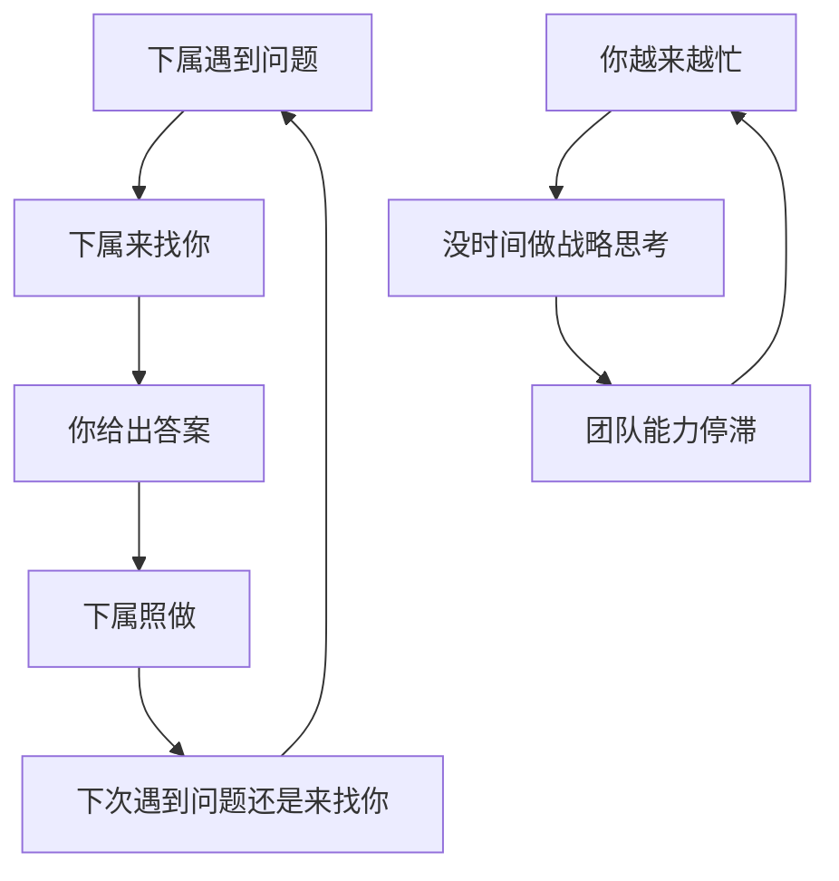
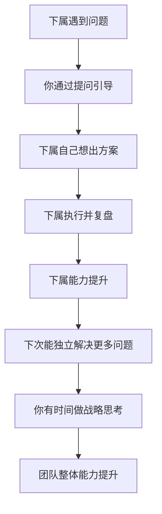
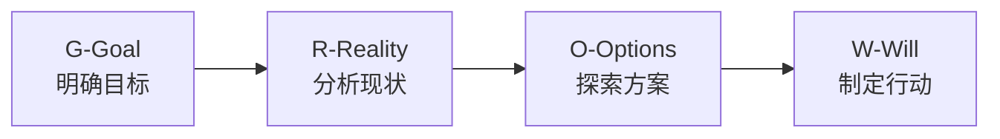

## 八、教练式领导

### 8.1 什么是教练式领导

教练式领导（Coaching Leadership）源于体育教练的理念——教练不需要比运动员跑得更快、跳得更高，但能帮助运动员突破自身极限。管理者同样不必是每个领域的技术专家，但可以通过系统性的提问和引导，激发团队成员自主思考、自我突破的能力。

蒂莫西·高威（Timothy Gallwey）在《网球的内在诀窍》中首次提出"教练不是教你做什么，而是帮你发现你已经知道的东西"。这一理念后来被约翰·惠特默（John Whitmore）引入商业管理领域，形成了现代教练式领导的理论基础。

**教练式领导与其他领导方式的核心区别：**

| 维度 | 指令式领导 | 导师式领导 | 教练式领导 |
|------|-----------|-----------|-----------|
| 核心动作 | 告诉、命令 | 分享经验、给建议 | 提问、引导 |
| 权力来源 | 职位权威 | 知识/经验权威 | 信任关系 |
| 成长路径 | 被动执行 | 模仿前辈 | 自主探索 |
| 适用场景 | 紧急危机、新手 | 经验传承 | 成熟员工、突破瓶颈 |
| 长期效果 | 依赖上级 | 形成路径依赖 | 培养独立思考能力 |
| 下属感受 | "我被要求做" | "前辈教我做" | "我自己想明白的" |

教练式领导的**核心信条**：

1. **每个人都有解决问题的潜力**——答案往往已经在对方脑中，只是需要被正确的提问激发出来
2. **提问比告知更有效**——自己想通的道理比别人塞给你的结论深刻十倍
3. **自主思考比被动接受更能促进成长**——大脑在主动探索时形成的神经连接远比被动接收牢固
4. **信任和尊重是教练关系的基石**——没有心理安全感，对方不会敞开心扉面对真实问题

### 8.2 为什么管理者需要教练技能

很多管理者陷入一个陷阱：自己解决问题的效率越高，团队就越依赖自己。最终管理者变成了"救火队长"，而团队成员的成长停滞。

**不使用教练式领导的典型恶性循环：**

**使用教练式领导后的良性循环：**

**具体收益：**

- **时间杠杆**：一次成功的教练对话投入30-60分钟，但换来的是下属未来同类问题的独立解决能力，长期ROI极高
- **人才梯队**：教练式领导培养的是"能思考的人"而非"能执行的工具"，组织的人才储备质量显著提升
- **创新涌现**：当员工习惯自己思考而非等指令，他们会主动提出改进建议，创新从基层涌现
- **员工敬业度**：盖洛普调查显示，拥有教练型上级的员工敬业度比普通管理者下属高出40%，离职率低25%
- **管理者自身成长**：教练过程迫使管理者锻炼深度倾听、系统思考和精准提问的能力，这些是高层领导力的核心

### 8.3 GROW教练模型：最经典的一对一框架

GROW模型由约翰·惠特默在《高绩效教练》中提出，是全球使用最广泛的教练对话框架。它提供了一个清晰的对话结构，让教练式对话不至于变成漫无目的的聊天。

#### G — Goal（目标）：你到底想要什么

目标阶段的关键不是接受对方模糊的表述，而是通过追问帮TA找到真正想达成的结果。

**核心提问清单：**

- "你希望通过这次对话达成什么？"——明确对话目标
- "你想要的最终结果具体是什么样的？"——把模糊愿望具象化
- "你怎么知道自己已经达到了这个目标？"——定义可衡量的成功标准
- "这个目标对你个人来说为什么重要？"——连接深层动机
- "这个目标和其他目标有冲突吗？"——发现优先级矛盾

**实操要点：**

用SMART原则检验目标质量。如果对方说"我想提升团队效率"，这个目标太模糊。通过追问变成："我希望在下个季度末，团队的需求交付周期从平均10天缩短到7天，同时质量不下降。"

**对话示例：**

> 管理者：你今天想聊什么话题？
> 员工：我觉得最近工作效率不高。
> 管理者：你说的效率不高，具体是指什么？有哪些表现让你有这个感觉？
> 员工：经常加班但产出没增加，感觉自己在瞎忙。
> 管理者：如果你这次对话结束后，有一件事发生了变化，让你觉得"对，这就是我要的"，那会是什么？
> 员工：我想找到真正重要的事，把时间花在刀刃上。
> 管理者：具体来说，如果你的理想状态实现了，你一周的工作分配会是什么样的？

#### R — Reality（现状）：现在到底是什么情况

现状分析阶段的目的是帮对方客观认知当前局面，而不是听TA抱怨或自我美化。

**核心提问清单：**

- "目前的实际情况是怎样的？"——从客观事实开始
- "你已经尝试过哪些方法？效果如何？"——了解已有的尝试和结果
- "哪些方面是有效的？哪些不行？"——区分有效与无效
- "这件事涉及到哪些人？他们怎么看？"——扩展视角
- "你在这个过程中有什么感受？"——关注情绪维度
- "你觉得自己在这个问题中扮演什么角色？"——引导自我反思

**实操要点：**

现状阶段最容易出现的问题是对方用主观判断代替客观事实。管理者需要温和但坚定地把讨论拉回事实层面。例如对方说"团队都不配合"，你可以追问"具体是哪些人在哪些事情上让你感觉不配合？能举一个最近的例子吗？"

**1-10评分法**：让对方对现状打分（1-10），然后追问"为什么是6而不是5？是什么让你没有打更低的分？"——这能帮对方发现已有的积极因素，而不是只聚焦问题。

#### O — Options（选择）：你有哪些路可以走

选项阶段最容易被跳过——管理者往往在了解现状后就急于给出建议。但教练式领导的核心恰恰在于：**让对方自己想出方案**。

**核心提问清单：**

- "你有哪些可能的选择？"——先让对方自己列举
- "还有别的可能性吗？"——推动多想一个选项
- "如果你的好朋友遇到同样的情况，你会建议TA怎么做？"——拉开心理距离，激发客观判断
- "如果没有任何限制（时间、预算、权限），你会怎么做？"——突破思维限制
- "你见过别人是怎么处理类似问题的？"——调动外部经验
- "你觉得哪个选项最可行？为什么？"——从发散转向收敛

**实操要点：**

至少逼对方想出3个方案，即使第三个看起来很荒谬。因为第三个方案往往是前两个的折中或升级版，最有价值。管理者在这个阶段要克制住"我有个好主意"的冲动——你的好主意可能恰恰封死了对方可能想到的更优解。

如果对方实在想不出来，可以用"假如"提问法破冰："假如你知道答案，那会是什么？"——这句话看似荒谬，但经常能让对方在放松状态下冒出灵感。

#### W — Will（意愿）：你接下来具体怎么做

意愿阶段把思考转化为行动承诺。没有这一步，教练对话就变成了"聊天"。

**核心提问清单：**

- "你决定采取什么行动？"——明确具体的第一步
- "你打算什么时候开始？什么时候完成？"——设定时间线
- "你可能遇到什么障碍？你打算怎么应对？"——预见风险
- "你需要什么支持？"——明确资源需求
- "我怎么知道你已经做了？"——建立问责机制
- "从1到10，你有多大把握会去做？"——检验承诺强度
- "如果不是10，是什么在阻碍你？怎样能提高？"——排除最后一层障碍

**实操要点：**

如果承诺度低于7，不要放过——说明方案本身有问题或对方有未表达的顾虑。追问"是什么让你打了7而不是9？"往往能暴露出真正的阻力点。

**GROW完整对话案例：**

某团队leader小李向总监抱怨"团队执行力差"，总监用GROW模型进行了一次教练对话：

> **Goal阶段：**
> 总监：你说执行力差，你希望的理想状态是什么？
> 小李：希望团队能按时、按质完成承诺的交付。
> 总监：具体到什么程度你会满意？比如交付准时率？
> 小李：目前大概60%按时，我希望提到90%以上。
>
> **Reality阶段：**
> 总监：现在什么情况导致只有60%？
> 小李：需求经常变、排期太紧、有些人能力不够。
> 总监：这三个原因各占多大比例？
> 小李：嗯……需求变更大概40%，排期问题30%，能力问题30%。
> 总监：在需求变更这部分，你目前是怎么处理的？
> 小李：产品说改就改了，我也不好意思拒绝。
> 总监：你有没有试过拒绝或者协商？
> 小李：试过一次，但产品找了领导，领导说配合一下。
>
> **Options阶段：**
> 总监：在需求变更这件事上，你有哪些可能的做法？
> 小李：一是继续接受，二是明确拒绝，三是和产品约定变更规则。
> 总监：还有吗？领导那个层面你还能做什么？
> 小李：可以拉着领导一起定一个变更流程，这样产品也不能随意改了。
> 总监：这几个方案你觉得哪个最可行？
> 小李：第三个，有流程背书我也不用当恶人。
>
> **Will阶段：**
> 总监：那你第一步打算做什么？
> 小李：我先写一个变更管理流程的初稿。
> 总监：什么时候能写完？
> 小李：下周三之前。
> 总监：你需要我做什么吗？
> 小李：希望你在我和领导汇报流程时在场支持。
> 总监：没问题。下周三你把初稿发我看看，周五我们一起找领导。
> 小李：好，从1到10的话我有8成把握。
> 总监：是什么让你不是10？
> 小李：怕产品那边不配合。
> 总监：如果产品不配合，你的Plan B是什么？
> 小李：那就让领导来拍板，反正流程是领导同意的。

### 8.4 更多教练模型

GROW是最经典的框架，但并非唯一。不同场景下可以选择不同的模型。

#### OSKAR模型：聚焦解决方案

OSKAR模型更适合问题已经明确、需要快速找到解决方案的场景。

| 阶段 | 含义 | 核心提问 |
|------|------|---------|
| O - Outcome | 期望结果 | "你希望达到什么结果？" |
| S - Scale | 量化评估 | "从1到10，你现在在几分？" |
| K - Know | 已有资源 | "你已经做了什么有效的？" |
| A - Affirm | 确认优势 | "你的哪些优势能帮你达成目标？" |
| R - Review | 行动复盘 | "下周你会做什么不同的事？" |

OSKAR特别适合：时间有限（20-30分钟）、问题已清晰、需要快速推进的场景。它跳过了深入挖掘现状的步骤，直接聚焦"什么是有效的"和"下一步做什么"。

#### CLEAR模型：关注情绪的教练对话

当对方带着强烈情绪来对话时（沮丧、愤怒、焦虑），CLEAR模型更合适，因为它在开头就处理情绪。

| 阶段 | 含义 | 核心动作 |
|------|------|---------|
| C - Contract | 约定 | 明确对话目标和边界 |
| L - Listen | 倾听 | 深度倾听，不打断，不评判 |
| E - Explore | 探索 | 帮助对方探索情绪和想法 |
| A - Action | 行动 | 引导制定行动计划 |
| R - Review | 回顾 | 回顾对话收获和后续跟进建议 |

#### FUEL模型：结构化的教练对话

FUEL由Zenger Folkman提出，强调教练对话的每一个环节都要有明确的结构。

- **F - Frame（框架）**：开场明确对话目的、流程和预期成果
- **U - Understand（理解）**：通过提问深入了解对方的认知和感受
- **E - Explore（探索）**：共同探索多种可能性和行动方案
- **L - Lay out（规划）**：制定具体行动计划并约定跟进机制

FUEL的优势在于开场就设定清晰的框架，避免教练对话变成漫谈。

### 8.5 教练式领导的提问技术

提问是教练式领导最核心的技能。好的问题像一把钥匙，能打开对方的思维之门；差的问题则会让对话陷入僵局。

#### 开放式问题 vs 封闭式问题

| 类型 | 特征 | 示例 | 效果 |
|------|------|------|------|
| 封闭式 | 答案是"是/否"或有限选项 | "你试过A方案吗？" | 获得确认，但关闭探索 |
| 开放式 | 答案需要思考和描述 | "你尝试过哪些方案？效果如何？" | 打开对话，激发思考 |

**转换技巧**：当你发现自己在问封闭式问题时，加上"什么""如何""告诉我更多"就能变成开放式。

#### 五类高质量教练提问

**1. 聚焦型提问——帮助明确方向**

- "对你来说，最重要的是什么？"
- "如果你只能改变一件事，你会选什么？"
- "这件事的核心矛盾在哪里？"

**2. 反思型提问——促进自我觉察**

- "你从这件事中发现了什么关于自己的？"
- "如果时光倒流，你会怎么做不同的选择？"
- "你的假设是什么？这个假设一定对吗？"

**3. 拓展型提问——打开思路**

- "还有哪些你没考虑过的可能性？"
- "如果资源无限，你会怎么做？"
- "你见过行业里谁处理过类似的问题？"

**4. 挑战型提问——温和地推动突破**

- "是什么在阻止你做你认为对的事？"
- "你说想改变，但你一直在用同样的方法，为什么？"
- "如果你的竞争对手遇到同样的情况，他们会怎么做？"

**5. 行动型提问——促成落地**

- "你今天回去就做的第一件事是什么？"
- "你怎么知道自己在正确的轨道上？"
- "什么情况下你需要回来重新调整方向？"

#### 提问的禁忌

- **诱导性提问**："你不觉得应该选A吗？"——这不是提问，是变相命令
- **连珠炮式提问**：一口气问三个问题——对方根本不知道先回答哪个
- **评判性提问**："你怎么会犯这种错误？"——把提问变成了指责
- **建议伪装成提问**："你为什么不试试X？"——你已经给出了答案，问句只是装饰
- **追问太快**：对方刚回答完你就抛出下一个问题——给大脑留出思考的时间

### 8.6 教练式倾听与反馈

#### 深度倾听的三个层次

**层次一：听内容（What）**

关注对方说了什么事实和信息。大多数管理者停留在这一层——只听"事情"，不听"人"。

**层次二：听情绪（Feel）**

关注对方说这些话时的情感状态。"这个项目让我很头疼"——"头疼"背后是焦虑、无力还是疲惫？识别情绪是建立信任的关键。

**层次三：听需求（Need）**

关注对方真正想表达的深层需求。员工说"工资太低了"，表面是钱的问题，深层可能是"我的价值没被认可"或"我看不到成长空间"。

**深度倾听的实操技巧：**

- **3秒法则**：对方说完后，默数3秒再回应。大多数人急于填补沉默，但这3秒往往正是对方在整理思路的关键时刻
- **镜像复述**：用自己的话重述对方的核心意思。"所以你的意思是……对吗？"——确保理解正确，同时让对方感到被听见
- **标注情绪**：给对方的情绪命名。"听起来这件事让你很沮丧。"——情绪被命名后会自然缓解，对方会觉得你真正理解了TA
- **记录要点**：在对话中记录关键信息（征得对方同意后）。这既是认真倾听的信号，也方便后续复盘

#### 教练式反馈的SBI模型

反馈是教练对话中不可或缺的环节。SBI模型提供了一个清晰的反馈结构：

| 要素 | 含义 | 示例 |
|------|------|------|
| S - Situation | 场景 | "在昨天的产品评审会上……" |
| B - Behavior | 行为 | "你在陈述方案时，数据引用不够完整……" |
| I - Impact | 影响 | "导致技术团队对方案的可行性产生了疑虑。" |

**正面反馈示例**："在昨天的客户演示中（S），你面对客户的尖锐提问没有慌张，而是先确认问题再逐一回答（B），这让客户对我们的专业度非常认可，当场就签了意向书（I）。"

**改进反馈示例**："在这周的需求评审中（S），你直接跳过了技术可行性的讨论就定了排期（B），结果开发到一半发现架构要改，延误了两天（I）。"

**SBI的关键规则**：先SBI反馈，再提问引导。不要在反馈后面直接跟建议——用"你觉得下次可以怎么做？"来启动教练对话。

### 8.7 一对一教练对话实操模板

以下是一个完整的一对一教练对话模板，适用于常规的1-on-1会议（30-45分钟）。

**对话前准备（5分钟）：**

1. 回顾上次对话的承诺和进展
2. 准备2-3个观察点（行为表现、项目进展）
3. 清空预设——不要带着"解决方案"进入对话

**对话流程：**

| 阶段 | 时长 | 动作 | 关键提问 |
|------|------|------|---------|
| 开场 | 3min | 建立连接，确定话题 | "今天你最想聊什么？" |
| Goal | 5min | 明确期望结果 | "对话结束时你希望收获什么？" |
| Reality | 10min | 深入了解现状 | "实际发生了什么？你怎么看？" |
| Options | 10min | 探索多种可能 | "你有哪些选择？还有吗？" |
| Will | 5min | 制定行动计划 | "你决定怎么做？什么时候？" |
| 收尾 | 3min | 总结承诺，约定跟进 | "今天的收获是什么？" |

**对话后跟进建立：**

- 24小时内发一条简短消息确认对方的行动计划
- 在约定的时间节点主动跟进进展
- 下次对话开头回顾上次的承诺完成情况
- 对已完成的行动给予肯定，对未完成的探究原因（不是追责）

### 8.8 团队教练与群体辅导

教练式领导不仅适用于一对一，也可以在团队场景中使用。但团队教练有其独特的挑战和方法。

#### 团队教练与个体教练的区别

| 维度 | 个体教练 | 团队教练 |
|------|---------|---------|
| 关注焦点 | 个人目标和成长 | 团队共同目标和协作模式 |
| 情绪管理 | 处理个体情绪 | 管理群体动力学（从众、冲突、沉默） |
| 时间分配 | 充分探索每个环节 | 需要更紧凑，兼顾效率 |
| 核心挑战 | 个体抗拒 | 群体中的权力动态和社交压力 |

#### 团队教练的实操方法

**方法一：团队GROW**

将GROW模型应用到团队会议中：

1. **Goal**：让团队共同定义目标。用白板/便利贴让每人写出"我们理想的成果是什么"，然后投票聚焦
2. **Reality**：团队成员轮流分享各自的视角。关键是让沉默的人也发言——"小王，你在这个项目中的体验是什么？"
3. **Options**：用头脑风暴规则（不批评、数量优先、鼓励组合）生成方案清单
4. **Will**：每人写下自己承诺的具体行动，公开分享

**方法二：同伴教练（Peer Coaching）**

三人一组，角色轮换：

- **教练**：只提问，不给建议
- **被教练者**：陈述问题并回答提问
- **观察者**：记录教练的提问质量和被教练者的反应

每轮15分钟，然后角色轮换。观察者在轮换时给出反馈。这种方法的好处是让每个人都体验"教练视角"，团队整体的教练能力会快速提升。

**方法三：复盘式教练**

在项目里程碑或结束后，用教练式的提问结构进行团队复盘：

1. "我们当初的目标是什么？实际结果如何？"——事实对比
2. "什么做得好？为什么做得好？"——识别成功因素
3. "什么可以改进？如果重来你会怎么做？"——提炼教训
4. "我们下一步的行动承诺是什么？"——转化学习为行动

### 8.9 教练式领导的典型应用场景

#### 场景一：员工绩效不佳

传统做法：直接指出问题，要求改进。效果往往短期有效但容易反弹。

教练式做法：

1. 约谈时先问"你对自己最近的工作怎么看？"——让对方先自我评估
2. 如果对方自我认知和你的观察一致，直接进入GROW的Options阶段
3. 如果对方自我认知有偏差，用事实（不是评判）帮TA看清："我注意到上个月的三个项目中，有两个延期超过一周。你怎么看这个数据？"
4. 共同制定改进方案，确保是对方自己想出来的
5. 约定跟进时间和检查点

#### 场景二：高潜力员工的成长突破

高潜力员工往往不缺能力，缺的是方向感和视野。

教练式做法：

1. 用"远景提问"帮TA澄清长期目标："你希望三年后的自己是什么样的？"
2. 用"差距分析"帮TA看清从现在到目标之间的鸿沟："你现在具备哪些能力？还缺哪些？"
3. 用"资源盘点"帮TA发现已有的优势和机会："你在公司有哪些资源可以用？"
4. 用"最小行动"帮TA迈出第一步："这周你能做的最小一步是什么？"

#### 场景三：团队冲突调解

当团队成员之间有矛盾时，传统的"各打五十大板"式调解往往两头不讨好。

教练式做法：

1. 分别和冲突双方进行一对一教练对话（不是调解，是教练）
2. 每方都问："在这个冲突中，你自己的责任是什么？"
3. "你理解对方的立场和感受吗？TA为什么会那样做？"
4. "你希望的解决结果是什么？你愿意为此做什么？"
5. 然后安排双方对话，各方带着自我反思和建设性方案进入讨论

#### 场景四：新晋管理者的角色转换

刚从IC（个人贡献者）晋升为管理者的人，最常见的问题是"什么都自己干"和"不知道怎么管人"。

教练式做法：

1. "你觉得管理者最重要的三件事是什么？"——帮TA建立管理认知框架
2. "你团队中每个人的优势和挑战分别是什么？"——培养识人能力
3. "有哪些事情你可以放手让团队成员去做？即使他们做得不如你好？"——克服"自己干更快"的冲动
4. "如果你这周只能做一件管理方面的事，你会选什么？"——帮助聚焦

### 8.10 教练式领导的常见误区与纠正

#### 误区一：教练就是不给答案

**错误表现**：下属来问一个明确的技术问题，管理者坚持"我不告诉你，你自己想"——这不是教练，是为难人。

**纠正**：教练式领导不是在所有场景都不给答案。紧急问题、知识盲区（对方完全没有背景知识）、低风险决策应该直接给答案。教练适用于：有思考空间、需要成长、答案不唯一的情况。判断标准是：**"如果我现在告诉TA答案，TA会因此错失一次成长机会吗？"** 如果是，用教练；如果不是，直接说。

#### 误区二：教练对话必须用GROW模型

**错误表现**：每次对话都严格按G-R-O-W的顺序走，生搬硬套。

**纠正**：GROW是框架，不是牢笼。实际对话中经常需要跳转——在Options阶段可能发现对Goal的理解不够，需要回到Goal；在Reality阶段可能对方情绪激动，需要先处理情绪（用CLEAR的L阶段）。关键是理解每个阶段的目的，而不是机械执行顺序。

#### 误区三：只提问不倾听

**错误表现**：管理者脑子里已经准备好了下一个问题，根本没在听对方的回答。

**纠正**：提问只是手段，倾听才是核心。真正的教练对话中，下一个问题应该基于对方的回答来设计，而不是提前准备好的脚本。如果发现自己的提问和对方的回答对不上，说明你在"执行流程"而非"真正在对话"。

#### 误区四：一次对话就能解决问题

**错误表现**：进行了一次教练对话后就期待对方脱胎换骨，如果没有明显变化就否定教练方法。

**纠正**：教练是一个过程，不是一个事件。行为改变需要时间、练习和反馈。通常需要3-6次持续的教练对话才能看到显著的行为变化。每次对话建立在上次的行动反馈之上，形成螺旋上升。

#### 误区五：对所有人一视同仁地使用教练

**错误表现**：无论对方的能力水平和意愿程度，都坚持用同一种教练方式。

**纠正**：教练的深度和频率应该匹配对方的发展阶段。新手员工（低能力高意愿）需要更多指导和结构；资深员工（高能力低意愿）需要更多激发内在动机的对话；而高能力高意愿的员工可能只需要偶尔的教练对话来突破瓶颈。

### 8.11 从管理者到教练的进阶之路

成为优秀的教练型领导者不是一夜之间的事，需要系统性的练习和自我修炼。

**第一阶段：觉察（0-3个月）**

- 开始在日常对话中有意识地使用开放式问题
- 每天记录自己"直接给答案"的次数，目标是减少30%
- 读完《高绩效教练》和《Coaching for Performance》
- 找一个信任的同事，每周进行一次15分钟的练习性教练对话

**第二阶段：应用（3-6个月）**

- 在每次1-on-1中使用GROW框架
- 练习深度倾听——在对方说完后等3秒再回应
- 开始关注"听情绪"和"听需求"，而不只是"听内容"
- 让团队成员给你反馈："你觉得我们的对话帮助你思考清楚了吗？"

**第三阶段：精进（6-12个月）**

- 根据不同下属和场景灵活切换教练模型
- 在团队会议中融入教练式提问
- 开始关注群体动力学——谁在沉默？谁在主导？为什么？
- 建立自己的"问题库"——收集那些真正能引发深度思考的问题

**第四阶段：传承（12个月以上）**

- 培养团队中的其他成员成为教练
- 建立团队的同伴教练文化
- 从"我教练别人"升级到"我创造一个教练型文化"
- 在组织层面推动教练式领导的实践

### 8.12 推荐工具与资源

**必读书籍：**

| 书名 | 作者 | 核心价值 |
|------|------|---------|
| 《高绩效教练》 | 约翰·惠特默 | GROW模型的源头，教练式领导的奠基之作 |
| 《Coaching for Performance》 | 约翰·惠特默 | 英文原版，内容更完整 |
| 《被赋能的高效对话》 | 玛丽莲·阿特金森 | ICF认证教练体系的理论基础 |
| 《关键对话》 | 科里·帕特森等 | 高难度对话的处理技巧，与教练对话互补 |
| 《提问的力量》 | 弗兰克·赛斯诺 | 系统性地讲解提问的艺术 |
| 《非暴力沟通》 | 马歇尔·卢森堡 | 倾听和表达的底层原理 |

**实用工具：**

- **教练对话记录模板**：记录每次教练对话的Goal、Reality、Options、Will和后续跟进，便于复盘和追踪成长
- **提问卡片**：把常用的高质量教练问题做成卡片，放在手边。对话时随机抽取一张使用，避免总是问同样的问题
- **录音回放**：在征得对方同意后录音，事后回放自己的提问方式和倾听质量。你会惊讶地发现自己有多少"无意识的打断"和"隐藏的建议"
- **教练日志**：记录每次教练对话后的反思——哪些问题有效？哪些无效？对方的反应如何？自己的盲点在哪里？

**本章核心要点：**

教练式领导的本质不是一套话术，而是一种思维方式的转变——从"我帮你解决问题"到"我帮你成为能解决问题的人"。GROW等模型是入门的脚手架，但真正的教练能力来自持续的练习、深度的倾听和对人的真诚关注。从今天开始，在下一次和团队成员的对话中，试着把第一个指令变成一个问题，你就已经迈出了教练式领导的第一步。
