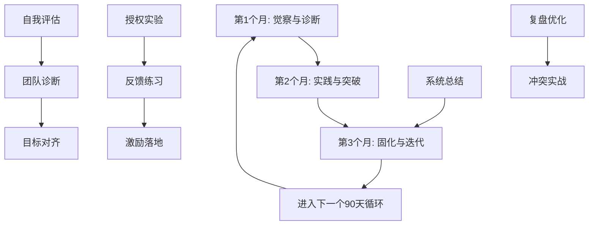
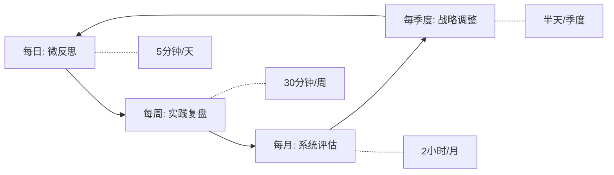
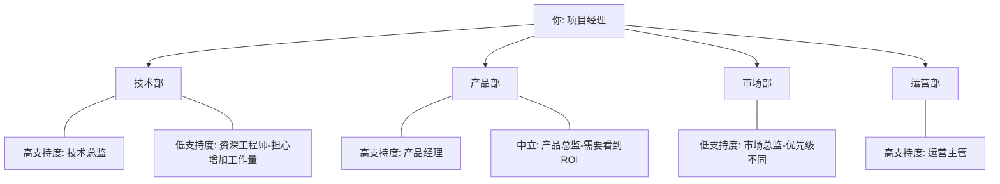
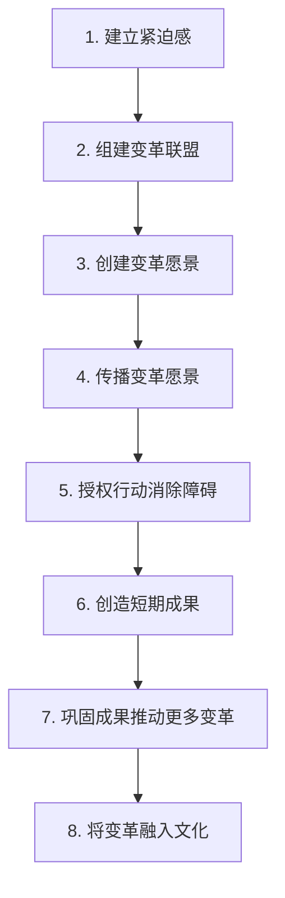

## 九、领导力实践项目

领导力不是读几本书、听几堂课就能获得的能力。正如游泳教练的示范再标准，你不下水就永远学不会游泳。领导力的真正提升发生在实践中——在真实的团队互动、决策压力和人际冲突中反复锤炼。本章提供一套完整的领导力实践体系，从90天系统性提升计划，到每日/每周/每季度的持续改进机制，再到四大高价值挑战项目，帮助你将前几章的理论和方法内化为本能。

### 9.1 90天领导力提升计划

为什么是90天？心理学研究表明，一个新习惯的养成需要66天左右（伦敦大学学院Phillippa Lally博士，2009年研究）。90天给足了余量：前30天建立认知和基础，中间30天强化行为模式，最后30天巩固并内化。这个计划不是线性的流水账，而是螺旋式上升——每个月都从认知、行为、反馈三个维度同步推进。

#### 第一个月：觉察与诊断

第一个月的核心目标不是"做什么"，而是"看清现状"。很多新晋领导者的最大问题不是能力不足，而是对自己的领导风格盲区和团队真实状态缺乏认知。

**第1周：领导力自评**

不要只做一个笼统的自评，要从以下五个维度分别打分（1-10分）：

| 评估维度 | 自评分 | 团队评分 | 差距 | 优先级 |
|----------|--------|---------|------|--------|
| 愿景传达 | __ | __ | __ | __ |
| 决策质量 | __ | __ | __ | __ |
| 授权赋能 | __ | __ | __ | __ |
| 反馈与沟通 | __ | __ | __ | __ |
| 情绪管理 | __ | __ | __ | __ |

具体操作方法：找一个安静的时间段，回忆过去3个月中在这五个维度上的关键事件，用STAR法（Situation-Task-Action-Result）记录至少一个具体案例，然后根据案例质量而非感觉打分。

自评完成后，邀请你的直接上级、2-3位平级同事和3-4位直接下属做匿名评估（问卷内容与自评一致）。自评和他评的差距就是你的"领导力盲区"。心理学中称之为"Johari窗"的盲区象限——你自己看不到、但别人看得很清楚的行为模式。

**第2周：一对一深度沟通**

与每位团队成员进行30-45分钟的一对一沟通。注意，这不是绩效考核，而是关系建设。沟通结构如下：

1. **破冰（5分钟）**：聊近况，表达关心。"最近工作和生活状态怎么样？有什么我能帮到你的？"
2. **倾听（15分钟）**：问三个核心问题——"你觉得我们团队目前做得最好的是什么？最大的挑战是什么？如果有一个愿望可以改变一件事，你希望改变什么？"
3. **坦诚（5分钟）**：分享你作为领导者的自我反思，包括你发现的自身不足。这种脆弱性展示能快速建立信任（Brené Brown的"脆弱的力量"理论）。
4. **承诺（5分钟）**：基于对方的反馈，做出1-2个具体承诺。承诺要小而可兑现——宁可承诺"下周我会在周会上明确每个人的任务优先级"，也不要承诺"我会让一切都好起来"。

**第3周：团队目标对齐**

收集完所有一对一沟通的信息后，召开一次"目标对齐会"。会议流程：

1. 分享你从一对一中提炼出的共性问题（脱敏处理，不暴露个人信息）
2. 共同讨论团队使命——"我们团队存在的价值是什么？"
3. 用OKR框架确定本季度的3个关键目标
4. 每个目标下由团队成员自荐认领关键结果

**第4周：建立沟通节奏**

在第一周内建立固定的沟通机制：

- **每日站会（15分钟）**：每人回答三个问题——昨天完成了什么？今天计划做什么？有什么阻碍？注意：站会不是汇报会，目的是暴露问题和促进协作。
- **周会（60分钟）**：回顾本周进展，讨论关键决策，分享学习。
- **一对一（每两周一次，30分钟）**：持续跟进个人发展。

本月阅读任务：选一本领导力经典书籍精读（推荐《领导力21法则》John Maxwell或《从优秀到卓越》Jim Collins），重点不是读完，而是每读一章思考"这个原则在我的团队中如何落地"，写下至少一个行动项。

#### 第二个月：授权与激励实践

第二个月从"观察"转向"行动"。重点是通过授权和激励两个杠杆点，释放团队潜力。

**授权实践**

授权是新领导者最难跨越的门槛。不是不愿意授权，而是不信任下属能做好，或者担心失控。这里给出一个渐进式授权四步法：

1. **任务分解**：列出你目前手头的所有任务，按"可替代性"和"重要性"两个维度分类
2. **匹配人选**：根据团队成员的能力和意愿，匹配合适的授权对象
3. **授权对话**：明确告知对方任务目标、交付标准、时间节点、可用资源和决策权限
4. **放手与检查点**：设定2-3个检查点（而非事事汇报），在检查点提供支持而非接管

第一周先选择1-2项低风险、高可替代性的任务进行授权实验。例如：会议组织、周报撰写、数据汇总。第二周逐步提升难度，尝试授权一个中等复杂度的项目模块。

**反馈练习**

本月每天练习使用SBI反馈模型（Situation-Behavior-Impact），至少给出一次正面反馈和一次建设性反馈。关键是具体化——

反面示例："你做得不错。"（空洞，没有指导价值）

正面示例："在昨天的客户演示中（Situation），你主动准备了一份竞品对比表（Behavior），这让客户当场认可了我们的差异化优势，直接推动了签约（Impact）。"

建设性反馈示例："在这周的代码评审中（Situation），你的评论主要集中在代码风格层面（Behavior），这让我感觉我们可能错过了几个更深层的架构问题的讨论机会（Impact）。下次我们可以先花10分钟讨论架构设计，再看代码细节，你觉得呢？"

**激励个性化**

每个团队成员的激励需求不同。根据Daniel Pink的驱动力理论（《驱动力》），人的内在动机来自三个要素：自主性（Autonomy）、精通感（Mastery）和目的感（Purpose）。但每个人对这三个要素的需求强度不同。

在一对一沟通中识别每个人的主导激励类型：
- **自主导向型**：需要灵活性和决策空间。激励方式：给予更多选择权、弹性工作安排
- **精通导向型**：需要挑战和成长。激励方式：提供有难度的项目、技术培训、导师资源
- **目的导向型**：需要意义和影响力。激励方式：让其参与高层会议、展示工作成果的影响力

#### 第三个月：决策与冲突管理

第三个月进入高阶实践——面对领导力中最考验人的两个场景：决策和冲突。

**结构化决策实践**

从本月开始，所有团队重要决策必须使用结构化工具。推荐决策矩阵法：

| 评估维度 | 权重(%) | 方案A评分 | 方案A加权 | 方案B评分 | 方案B加权 | 方案C评分 | 方案C加权 |
|----------|---------|----------|----------|----------|----------|----------|----------|
| 实施难度 | 20 | | | | | | |
| 预期收益 | 30 | | | | | | |
| 风险程度 | 25 | | | | | | |
| 资源消耗 | 15 | | | | | | |
| 团队接受度 | 10 | | | | | | |
| **总分** | **100** | | | | | | |

关键原则：在填分数之前，先花20分钟让团队成员自由讨论每个维度的评分理由。决策矩阵的价值不在于最终分数，而在于讨论过程中暴露的信息和假设。

**冲突解决实战**

团队冲突不可避免，但大多数冲突不是因为"人有问题"，而是因为信息不对称、目标不一致或资源争夺。当冲突出现时，使用"五步冲突解决法"：

1. **暂停反应**：冲突发生时，不要立即介入裁决。先说"我听到了你们的分歧，我们需要认真对待这个问题"
2. **分别倾听**：分别与冲突双方单独沟通，理解各自的立场、需求和情绪
3. **找共同点**：帮助双方找到共同目标。"你们的分歧是关于技术方案A还是B，但你们都希望项目按时交付对吗？"
4. **共创方案**：引导双方提出解决方案，而非由你来做裁判
5. **跟进闭环**：解决方案确定后，在1周和1个月后分别跟进执行情况

**第一次团队复盘**

第三个月末组织一次完整的团队复盘，使用"四栏复盘法"：

| 我们计划做什么 | 我们实际做了什么 | 为什么有差距 | 下次我们怎么改 |
|---------------|----------------|-------------|--------------|
| （填写） | （填写） | （填写） | （填写） |

复盘会的关键规则：
- 不追责，只追因——"为什么会这样"而非"谁导致的"
- 每个人必须发言，但不强迫表态
- 行动项必须具体到人、时间和交付标准
- 复盘结果全员可见，下季度回顾执行情况

### 9.2 持续改进机制

90天计划是一个启动器，但领导力提升是终身工程。建立一套低成本、高频次的持续改进机制，比任何一次培训都有效。

#### 每日实践（5分钟/天）

**早晨领导力意图设定**（2分钟）

每天到公司后，花2分钟回答一个问题："今天我要有意识地在哪个领导力维度做得更好？"写下具体意图，例如："今天在与产品团队的会议中，我要先听完所有人的意见再表达自己的看法"。

为什么这个简单的动作有效？心理学中的"执行意图"（Implementation Intention）理论表明，当你把模糊的目标（"我要更好地倾听"）转化为具体的"如果-那么"计划（"如果开会，那么我最后一个发言"），执行率会提高2-3倍（Peter Gollwitzer，1999年研究）。

**晚间反思日记**（3分钟）

每天下班前花3分钟填写以下反思：

日期：____
今天我的领导力意图是：________________________
我做到了吗？（是/部分/否）：________
今天最好的一个领导力瞬间：________________________
如果重来，我会换一种方式做的事：________________________
明天的领导力意图：________________________

不需要写长篇大论，三句话就够了。关键是每天坚持。一年积累下来就是365条领导力实验记录，这是任何培训课程都给不了你的个性化教材。

#### 每周实践（30分钟/周）

**一对一沟通（15-20分钟/周）**

每周固定与1-2位团队成员进行一对一沟通（可以轮换，确保每月覆盖所有人）。沟通重点不在于了解工作进展（那是周会的功能），而在于：

1. **情绪温度**：用1-10分让对方评估本周工作满意度和压力水平
2. **障碍发现**：有什么阻碍你在工作中发挥最佳状态？
3. **成长对话**：你最近学到了什么？你想学什么？

**即时反馈（贯穿全周）**

目标：每周至少给出3次高质量反馈。正面反馈即时给（当场说），建设性反馈私下给（选合适时机）。一个实用技巧：在手机备忘录中建一个"反馈队列"，当你观察到值得反馈的行为时立刻记录，找机会反馈。

**周记写作（10分钟/周）**

每周末花10分钟写一篇领导力周记，回答三个问题：

1. 本周我在领导力上最大的一个进步是什么？
2. 本周我在领导力上犯的最大一个错误是什么？
3. 下周我要刻意练习的一个技能是什么？

#### 每月实践（2小时/月）

**领导力实践反思（60分钟）**

月末找一个安静的时间段，回顾本月所有周记和每日反思日记，从以下维度进行系统评估：

- **关系维度**：我和团队的信任关系是增强了还是减弱了？证据是什么？
- **绩效维度**：团队本月的交付质量和效率如何？我作为领导者起了什么作用？
- **成长维度**：团队成员是否在成长？我提供了多少发展机会？
- **自我维度**：我的情绪管理和精力管理做得如何？

**团队满意度脉搏调查（15分钟）**

每月做一次简短的匿名调查（5个问题，用1-5分评分）：

1. 我清楚团队的目标和我的角色（角色清晰度）
2. 我的领导能及时给予有效的反馈（反馈质量）
3. 我在工作中有足够的自主权（授权程度）
4. 我的意见被认真对待（参与感）
5. 这个月我学到了新东西（成长感）

数据不需要完美精确，关键是观察趋势——分数是在上升还是下降？哪个维度持续偏低？

**阅读与学习（45分钟/月）**

每月精读一篇领导力相关的深度文章或一个章节的书籍。建议来源：
- Harvard Business Review（HBR）的领导力专栏
- 《领导力季刊》（The Leadership Quarterly）学术期刊的通俗版解读
- 微信公众号"领导力实验室"等中文优质资源

#### 每季度实践（半天/季度）

**360度反馈（2小时）**

每季度进行一次正式的360度反馈，邀请上级、平级、下属和自己分别评估。第一季度的360度反馈可以作为基线，后续每季度对比进步幅度。注意：360度反馈的目的不是给领导打分，而是发现行为盲区和进步方向。

**团队建设活动（2-3小时）**

每季度组织一次团队建设活动。注意区分"团建"和"聚餐"——好的团建活动有明确的目的（信任建设、协作增强、技能互补），而不是单纯的吃喝玩乐。推荐活动类型：

| 团建目的 | 推荐活动 | 适合团队规模 |
|---------|---------|------------|
| 信任建设 | 分享个人故事、弱点工作坊 | 5-15人 |
| 协作增强 | 户外拓展、剧本杀、黑客马拉松 | 8-20人 |
| 技能互补 | 内部知识分享会、跨职能配对工作 | 10-30人 |
| 愿景共创 | 战略研讨会、未来工作坊 | 5-15人 |

**领导力发展计划调整（1-2小时）**

回顾过去90天的发展计划执行情况，调整下一季度的重点。问自己四个问题：

1. 上个季度我设定的发展目标完成了多少？
2. 有哪些意外收获是计划中没有预料到的？
3. 下个季度团队面临的最大挑战是什么？
4. 我需要在哪个领导力维度做重点突破？

### 9.3 领导力挑战项目

日常实践建立的是"基础体能"，但真正的突破来自高难度挑战。主动走出舒适区，承担以下四类挑战项目，能加速你的领导力进化。

#### 挑战一：跨部门项目

**为什么跨部门项目能加速领导力成长？**

在自己的团队里，你有正式权力——绩效考核权、资源分配权。但在跨部门项目中，你对其他部门的成员没有直接权力，必须依靠影响力、说服力和协作能力来推动工作。这正是领导力最纯粹的形态——在没有权力的情况下创造追随。

**实操步骤：**

1. **主动请缨**：向上级表达意愿，强调你的学习动机和能为项目带来的价值
2. **快速建立信任**：项目启动第一周，与每个部门的核心成员单独沟通，了解他们的部门目标、痛点和对项目的期望
3. **绘制利益相关者地图**：

4. **差异化沟通**：对高支持度的人争取承诺，对中立的人用数据说服，对低支持度的人找到他们的个人利益与项目的交集
5. **建立里程碑和共享胜利**：将项目拆分为多个小里程碑，每个里程碑完成后公开感谢各方贡献，创造"我们一起赢了"的集体记忆

#### 挑战二：危机处理

**为什么危机是领导力的试金石？**

哈佛商学院教授Conor Neely的研究表明，领导者的声誉有70%是在危机中建立的。日常顺境中，管理能力和领导能力的区别看不出来。但当风浪来临时，领导者的判断力、决策速度和情绪稳定性会被放大检验。

**如何主动参与危机处理：**

不要等危机降临，而要提前做好准备：

1. **建立危机意识**：定期做"预想分析"（Pre-mortem），假设项目已经失败，倒推可能导致失败的原因
2. **提前储备方案**：针对团队面临的Top 3风险，每个风险准备一个应急预案
3. **危机出现时主动站出来**：当团队遭遇突发问题（客户投诉、项目延期、人员离职），第一个站出来承担责任和协调解决方案
4. **危机后做深度复盘**：危机平息后48小时内组织复盘，重点不是追责，而是建立制度性防线

**危机决策的FAST框架：**

- **F（Facts）**：15分钟内收集核心事实——发生了什么？影响范围？截止时间？
- **A（Alternatives）**：列出2-3个可选方案，不需要完美方案，只需要"足够好"的方案
- **S（Select）**：基于80%信息做出决策。在危机中，一个及时的80分决策远胜于一个迟到的100分决策
- **T（Tell）**：快速传达决策和理由，确保所有人理解自己的角色和下一步行动

#### 挑战三：新团队组建

**为什么组建新团队是最高难度的领导力训练？**

从零开始组建团队，意味着你要在极短时间内完成选人、定目标、建文化、分角色、立规矩等一系列工作。这综合考验了你的识人能力、愿景传达能力、决策能力和文化塑造能力。

**新团队组建的五个关键阶段：**

| 阶段 | 时间框架 | 关键任务 | 领导者角色 |
|------|---------|---------|----------|
| 组建期 | 第1-2周 | 选拔成员、明确使命 | 招聘者、愿景家 |
| 磨合期 | 第3-6周 | 处理冲突、建立规则 | 调解者、规则制定者 |
| 规范期 | 第7-10周 | 固化流程、强化文化 | 教练、文化守护者 |
| 执行期 | 第11周起 | 高效运转、持续优化 | 赋能者、变革推动者 |
| 解散/重组 | 项目结束 | 知识传承、认可贡献 | 总结者、推荐人 |

**快速建立信任的三个实操方法：**

1. **个人历史练习**：团队成立第一周，每人用10分钟分享"我职业生涯中最大的一次失败和我从中学到的东西"。这种脆弱性分享能快速打破防备心态。
2. **团队工作协议**：共同制定5-8条团队行为准则，例如"会议准时开始""不同意见当面提出而非背后讨论""犯错后第一时间告知团队"。每人签字确认。
3. **早期小胜利**：在第一周内安排一个简单的协作任务并确保成功完成。心理学中的"首因效应"表明，早期的成功体验会奠定团队的自信基调。

#### 挑战四：变革推动

**为什么变革推动是领导力的终极考验？**

管理学大师John Kotter在《领导变革》中指出，70%的组织变革以失败告终。失败的首要原因不是技术问题，而是人的阻力——恐惧、不信任、习惯惯性。作为变革推动者，你必须同时管理理性层面（为什么变、怎么变）和感性层面（让人们愿意变）。

**变革推动的Kotter八步法实操：**

**每一步的实操要点：**

**第一步：建立紧迫感**——不是制造恐慌，而是用数据让人们看到"不变不行"。例如："我们过去6个月的客户满意度下降了15%，竞对已经上线了类似功能。"

**第二步：组建变革联盟**——不要一个人扛。找到三类人：有正式权力的人（提供资源和政治保护）、有专业知识的人（提供方案和可信度）、有非正式影响力的人（帮你传播和争取民意）。

**第三步：创建变革愿景**——用一句话说清楚："我们要从A变成B，因为C，这会带来D。"如果一句话说不清楚，说明你还没想清楚。

**第四步：传播愿景**——反复传达，不同场合、不同方式、不同媒介。研究表明，一个信息需要被听到至少7次，人们才会真正接受。

**第五步：消除障碍**——识别阻碍变革的制度（流程、政策）、结构（组织架构）和人（消极抵抗者），逐一处理。对于消极抵抗者，先尝试理解他们的恐惧并回应，如果无效则将其调离关键岗位。

**第六步：创造短期成果**——在3-6个月内展示一个可量化的改进。例如："新流程上线后，第一个月的处理效率提升了20%"。短期成果是对怀疑者最有力的回击。

**第七步：巩固成果**——不要在第一个小胜利后就松懈。用短期成果的势能推动更大范围的变革。

**第八步：融入文化**——将变革后的做法固化到招聘标准、绩效考核和日常仪式中，使其成为"我们做事的方式"。

### 9.4 领导力实践项目选择指南

不同阶段的领导者应该选择不同的实践项目。下表给出了匹配建议：

| 领导者阶段 | 推荐优先项目 | 预期收获 | 风险等级 |
|-----------|------------|---------|---------|
| 新任管理者（0-1年） | 90天计划 + 每日反思 | 建立领导习惯和自我觉察 | 低 |
| 有经验管理者（1-3年） | 授权实践 + 跨部门项目 | 提升影响力和战略视野 | 中 |
| 高级管理者（3-5年） | 危机处理 + 变革推动 | 培养决策力和组织变革能力 | 中高 |
| 高管/VP级别（5年+） | 新团队组建 + 战略变革 | 打造领导力传承和组织影响力 | 高 |

### 9.5 常见实践误区与纠正

**误区一：把领导力实践等同于"管理更多的人"**

纠正：领导力的核心是影响力，不是管理幅度。一个能影响3人做出积极改变的领导者，比一个管着30人却无法激励任何人的管理者更有领导力。实践中应该关注"我能影响多少人主动变得更好"，而不是"我的下属有多少"。

**误区二：急于求成，90天内期望脱胎换骨**

纠正：领导力是复利型成长——前30天你可能看不到任何明显变化，但在第60天开始，之前积累的认知和行为会开始产生复合效应。给自己耐心，坚持记录和反思。

**误区三：只练技巧不修内功**

纠正：领导力实践不能只停留在"怎么开会""怎么做反馈"的技巧层面。如果不在底层修炼自我认知、情绪管理、价值观澄清，技巧只是表面文章。每月至少花2小时做深度自我反思，而非只做技能训练。

**误区四：忽视向上管理**

纠正：很多新领导者把全部精力放在"管好下属"上，忽略了与上级的关系建设。领导力是全方位的——向下领导团队、向上管理预期、横向影响同事。每两周与上级进行一次主动沟通，汇报进展、对齐期望、争取资源。

**误区五：复制别人的领导风格**

纠正：读了乔布斯就想做铁腕领导，看了奈飞文化就想搞极端透明。每个领导者的优势、性格和所处环境不同，照搬他人的风格只会"画虎不成反类犬"。实践中要做的是：学习他人的原则，但用自己舒服的方式去践行，逐步发展出属于自己的领导风格。

### 9.6 本节实践清单

将以上内容转化为一份可执行的清单，每周对照检查：

- [ ] 本周是否完成了每日领导力意图设定和晚间反思？
- [ ] 本周是否进行了至少一次高质量的一对一沟通？
- [ ] 本周是否给出了至少3次具体的SBI反馈？
- [ ] 本月是否进行了系统性的月度反思？
- [ ] 本月是否完成了一次团队满意度脉搏调查？
- [ ] 本季度是否推进了一个挑战项目（跨部门/危机/新团队/变革）？
- [ ] 本季度是否进行了一次360度反馈？
- [ ] 当前的90天计划进展是否在正轨上？需要调整吗？

***

领导力是一场没有终点的修行。90天计划给你一个系统的起点，持续改进机制让你保持节奏，挑战项目加速你的突破。但最重要的是——从今天开始行动。选择一个最小的行动（比如明天早晨设定你的第一个领导力意图），然后坚持下去。正如管理学大师Peter Drucker所说："管理是把事情做对，领导是做对的事情。"而"做对的事情"的能力，只能在实践中习得。
