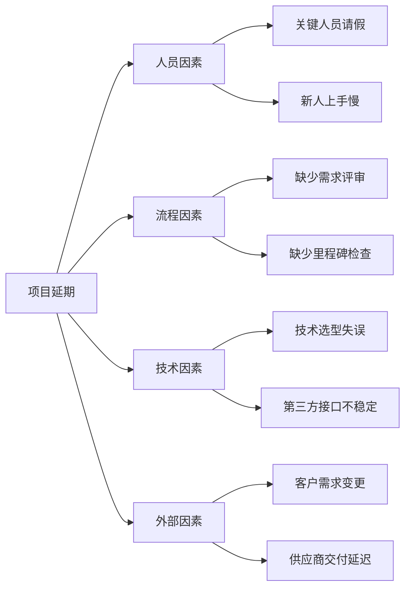
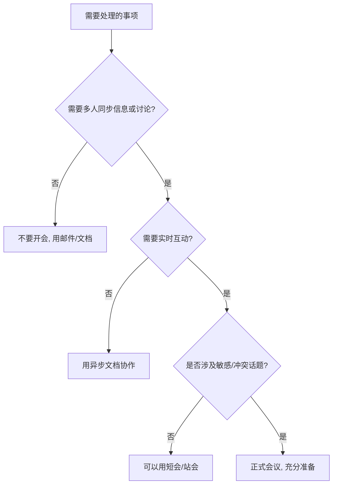

## 十、领导力提升工具箱

工欲善其事，必先利其器。前面九节系统讲解了领导力的理论基础、团队建设、决策方法、沟通技巧、授权赋能、激励策略、变革管理和教练式领导，本节将这些知识凝结为一套可直接使用的工具箱。工具箱的价值不在于工具本身，而在于**将隐性知识转化为可重复执行的显性流程**——当你面对真实的领导场景时，不需要从零思考，而是打开工具箱，取出对应的框架，填入当前情境，立刻获得结构化的行动指南。

本节工具分为六大类：**自我评估工具、决策与问题解决工具、沟通与反馈工具、团队管理工具、自我修炼工具、数字化工具推荐**。每类工具都包含工具说明、使用方法、填写示例和进阶技巧。

---

### 10.1 自我评估工具

领导力提升的第一步是准确了解自己的现状。没有诊断就没有处方，没有测量就没有改善。以下工具帮助你从多个维度建立对自己的客观认知。

#### 10.1.1 领导力自评雷达图

雷达图是最直观的自评工具，覆盖领导力的八大核心维度。每个维度按1-10分自评，画出你的领导力"轮廓"，一眼看出强项和短板。

**八大维度及评分标准：**

| 维度 | 1-3分（待提升） | 4-6分（基本合格） | 7-8分（熟练） | 9-10分（卓越） |
|------|----------------|-------------------|--------------|---------------|
| **愿景与战略** | 只关注眼前任务，无法描述团队方向 | 能说出团队目标，但缺乏长期规划 | 能制定清晰的3-12个月计划并传达 | 能描绘鼓舞人心的愿景，让团队主动追随 |
| **决策能力** | 犹豫不决或冲动决策，常后悔 | 能做常规决策，复杂问题容易拖延 | 能系统分析后果断决策，正确率高 | 在高度不确定下仍能做出高质量决策 |
| **沟通表达** | 常被误解，不善表达 | 日常沟通没问题，重要场合紧张 | 能清晰说服不同受众，善用故事 | 沟通极具感染力，能凝聚共识 |
| **团队建设** | 只管自己，不关注团队 | 能维持团队运转，但缺乏凝聚力 | 能打造高效协作的团队文化 | 能吸引优秀人才，团队自驱运转 |
| **授权与培养** | 事必躬亲，不信任他人 | 偶尔授权，但常忍不住干预 | 能系统授权并辅导下属成长 | 培养出多个能独当一面的人才 |
| **情绪管理** | 容易情绪化，影响判断 | 大部分时候能控制，压力下会失控 | 能管理自己情绪，也能安抚他人 | 在极端压力下仍能保持冷静和判断力 |
| **变革推动** | 抗拒变化，安于现状 | 能接受变化，但不会主动推动 | 能识别变革机会并引导团队适应 | 能预见趋势，主动发起变革 |
| **教练能力** | 只会下指令，不会引导 | 偶尔能启发下属，但不系统 | 能用提问帮助下属自己找到答案 | 能建立教练文化，整个团队互相成长 |

**使用方法：**

1. 打印或手绘一个八角雷达图，每个角代表一个维度
2. 根据评分标准给自己打分（1-10），在对应位置标点
3. 连接八个点，形成你的领导力轮廓
4. 找出最低的2-3个维度作为优先提升方向
5. 每月重测一次，对比轮廓变化

**进阶技巧：** 不要只做自评。将同样的评分表发给你的上级、同事和下属各1-2人（匿名），取平均分作为"他评"分数。自评和他评的差异本身就是重要信息——如果某个维度自评8分但他评只有4分，说明你对自己的认知存在盲区，这比分数本身更值得关注。

#### 10.1.2 每日领导力反思日志

反思是将经验转化为能力的催化剂。哈佛商学院的研究显示，每天花15分钟反思的管理者，其绩效表现比不反思的管理者高出23%。关键不在于反思的形式，而在于**问对问题**——好的问题能引导你发现被忽略的盲点。

**标准版（5分钟，适合日常使用）：**

日期：____年____月____日

1. 今天我做的最有效的一件领导行为是什么？
   具体情境：_________________________________
   为什么有效：_________________________________
   如何复制这种效果：_________________________________

2. 今天我遇到的最大领导力挑战是什么？
   挑战描述：_________________________________
   我的应对方式：_________________________________
   结果如何：_________________________________

3. 如果重来一次，我会怎么做？
   _________________________________________________

4. 明天我最需要改进的一个方面：
   _________________________________________________

**深度版（15分钟，每周使用一次）：**

本周日期：____月____日 至 ____月____日

一、本周关键事件回顾
事件1：_________________________________
  我的角色：_________________________________
  做得好的地方：_________________________________
  可以改进的地方：_________________________________

事件2：_________________________________
  我的角色：_________________________________
  做得好的地方：_________________________________
  可以改进的地方：_________________________________

二、团队状态感知
团队士气（1-10）：____ 
判断依据：_________________________________
本周谁表现突出：_________________________________
谁需要关注：_________________________________

三、自我觉察
本周我的情绪基调：_________________________________
压力来源：_________________________________
能量消耗最大的事情：_________________________________
能量恢复的方式：_________________________________

四、下周重点
领导力发展重点：_________________________________
需要跟进的人：_________________________________
需要做出的决策：_________________________________

**填写示例：**

日期：2026年3月15日

1. 今天我做的最有效的一件领导行为是什么？
   具体情境：小王提交的方案有明显漏洞，我没有直接指出，
   而是用提问引导他自己发现问题
   为什么有效：他不仅找到了漏洞，还额外发现了两个我没注意到的问题，
   最后方案质量远超预期
   如何复制这种效果：对有能力的下属，多用"你觉得这里有没有其他可能？"
   而不是"这里有问题"

2. 今天我遇到的最大领导力挑战是什么？
   挑战描述：跨部门会议中，市场部对技术方案提出不合理要求，
   我需要在不破坏关系的前提下拒绝
   我的应对方式：先认可他们的需求合理性，再用数据说明技术限制，
   最后提出折中方案
   结果如何：对方接受了折中方案，但我觉得可以在一开始就更主动地
   设定预期，而不是等到需求冲突才介入

#### 10.1.3 360度反馈问卷设计模板

360度反馈是领导力发展最有效的工具之一。其核心价值在于**打破自我认知的盲区**——约95%的人认为自己的自我认知水平高于平均水平，这在心理学上被称为"高于平均效应"（Above-Average Effect）。360度反馈用多视角数据帮你校准认知。

**问卷设计原则：**

- 题目数量控制在20-30题，填写时间不超过15分钟
- 每题用1-5分李克特量表（1=完全不符合，5=完全符合）
- 包含开放式问题获取具体反馈
- 确保匿名性，否则反馈将严重失真

**核心题目模板（按维度分类）：**

【愿景与战略】
1. 他/她能清晰地传达团队的方向和目标
2. 他/她能在日常工作中做出与长期目标一致的决策
3. 他/她能帮助我理解我的工作与整体目标的关系

【决策与执行】
4. 他/她做决策时会充分收集信息，而非仓促决定
5. 他/她做出决策后能坚定执行，不会朝令夕改
6. 他/她面对失败能坦诚复盘，而非推卸责任

【沟通与关系】
7. 他/她在沟通中能认真倾听，而非急于表达自己的观点
8. 他/她给我的反馈是具体、可操作的，而非笼统的批评或表扬
9. 他/她在冲突中能保持客观公正，不偏袒任何一方

【授权与培养】
10. 他/她给我足够的自主权来完成工作
11. 他/她在我犯错时会帮助我从中学习，而非简单惩罚
12. 他/她会主动为我创造成长和发展的机会

【情绪与韧性】
13. 他/她在压力下能保持冷静和理性
14. 他/她能营造心理安全的团队氛围
15. 他/她在面对挫折时展现出积极的应对态度

【开放式问题】
Q1. 他/她最大的领导力优势是什么？请举例说明。
Q2. 他/她最需要改进的一个方面是什么？请举例说明。
Q3. 如果只能给他/她一条建议，你会说什么？

**如何解读反馈结果：**

拿到反馈后，不要急于辩护或解释。按以下步骤处理：

1. **数据汇总**：将每个维度的分数取平均，画出雷达图
2. **差异分析**：自评与他评差距最大的维度优先关注
3. **开放题归类**：将开放式反馈归类为"优势"和"待改进"两大类
4. **寻找模式**：如果多人提到同一个问题，那就是真实问题，不是偏见
5. **制定行动**：选择1-2个最关键的改进点，制定具体的行动计划
6. **定期复测**：6-12个月后再次进行360度反馈，检验改进效果

---

### 10.2 决策与问题解决工具

领导者的决策质量直接影响团队和组织的成败。以下工具帮助你在不同场景下做出更高质量的决策。

#### 10.2.1 决策日志模板

决策日志是提升决策质量的"元工具"——它不是帮你做某一个决策，而是通过记录和回顾你的决策过程，**系统性地提升你的决策能力**。研究表明，保持决策日志的人在一年后的决策准确率比不记录的人高出25%以上。

**为什么有效：** 人类大脑天生存在"后见之明偏差"（Hindsight Bias）——事后总会觉得"我早就知道会这样"。决策日志在你做决策的当下记录你的真实想法和预期，事后可以客观对比结果，从而真正从经验中学习。

━━━━━━━━━━━━━━━━━━━━━━━━━━━━━━━━━━
📋 决策日志
━━━━━━━━━━━━━━━━━━━━━━━━━━━━━━━━━━

【基本信息】
决策日期：____年____月____日
决策类型：□ 人事  □ 技术  □ 战略  □ 资源  □ 危机  □ 其他：____
紧迫程度：□ 紧急（24小时内） □ 重要（1周内） □ 常规（1月内）
影响范围：□ 个人  □ 团队  □ 部门  □ 公司

【决策过程】
一、问题定义
核心问题是什么（用一句话描述）：_________________________________
这个问题为什么重要：_________________________________
如果不做决策会怎样：_________________________________

二、信息收集
已知事实：_________________________________
未知但重要的信息：_________________________________
信息缺口如何弥补：_________________________________
时间限制：_________________________________

三、选项分析
选项A：_________________________________
  优点：_________________________________
  缺点：_________________________________
  最好情况：_________________________________
  最坏情况：_________________________________

选项B：_________________________________
  优点：_________________________________
  缺点：_________________________________
  最好情况：_________________________________
  最坏情况：_________________________________

选项C：_________________________________
  优点：_________________________________
  缺点：_________________________________
  最好情况：_________________________________
  最坏情况：_________________________________

四、最终决策
选择的方案：_________________________________
决策理由（3个关键原因）：
  1. _________________________________________________
  2. _________________________________________________
  3. _________________________________________________

我有多大信心（1-10）：____
信心来源：_________________________________
最大的风险：_________________________________
如果决策错误，Plan B是什么：_________________________________

五、结果追踪（事后填写）
实际结果（____月____日填写）：_________________________________
与预期的差异：_________________________________
成功/失败的关键因素：_________________________________
下次遇到类似情况我会：_________________________________
这个决策教会我的一件事：_________________________________

**填写示例：**

【基本信息】
决策日期：2026年3月10日
决策类型：☑ 人事
紧迫程度：☑ 重要（1周内）
影响范围：☑ 团队

一、问题定义
核心问题：是否让经验不足但潜力高的小李担任新项目的技术负责人
这个问题为什么重要：新项目技术难度高，负责人选错会导致项目延期；
但如果不用小李，他可能会失去成长机会甚至离职
如果不做决策会怎样：继续用老张，但老张已经表达了想转管理的意愿

三、选项分析
选项A：让小李负责，配老张做技术顾问
  优点：小李获得成长机会，老张做顾问负担较轻
  缺点：小李经验不足可能犯错，项目风险增加
  最好情况：小李快速成长，项目成功，团队培养出新的技术骨干
  最坏情况：小李扛不住压力，项目严重延期

选项B：老张继续负责，小李做副手
  优点：项目风险低，质量有保障
  缺点：老张不情愿，小李没有真正的成长机会

四、最终决策
选择的方案：A——小李负责 + 老张做顾问 + 设定3个检查点
决策理由：
  1. 风险可控：有老张兜底，检查点能及时发现问题
  2. 人才培养：不给机会就永远培养不出新人
  3. 团队信号：让团队看到成长路径，提升士气

我有多大信心：7
信心来源：老张同意做顾问，小李之前的小项目表现不错
最大的风险：小李在架构设计上可能经验不足
Plan B：如果第一个检查点发现问题，老张接管核心技术决策

五、结果追踪（4月10日填写）
实际结果：小李在数据库设计上踩了坑，但通过老张指导快速修正，
项目按期推进，小李明显成长
下次遇到类似情况我会：提前给新人安排一个"模拟项目"做能力验证，
再决定是否放到正式项目上

#### 10.2.2 决策矩阵（加权评分法）

当面临多个选项、多个评估维度时，决策矩阵能帮你**将主观判断量化为可比较的分数**，避免"拍脑袋"决策。

**使用步骤：**

1. 列出所有备选方案（纵向）
2. 列出所有评估维度（横向）
3. 为每个维度设定权重（权重总和=100%）
4. 为每个方案在每个维度上打分（1-10分）
5. 计算加权总分，得分最高的为推荐方案

**示例：选择团队协作工具**

| 评估维度 | 权重 | 方案A：飞书 | 方案B：钉钉 | 方案C：企业微信 |
|---------|------|------------|------------|---------------|
| 功能完整性 | 25% | 9 (2.25) | 8 (2.00) | 6 (1.50) |
| 学习成本 | 20% | 7 (1.40) | 6 (1.20) | 9 (1.80) |
| 价格 | 15% | 7 (1.05) | 8 (1.20) | 8 (1.20) |
| 集成能力 | 20% | 9 (1.80) | 7 (1.40) | 6 (1.20) |
| 客户支持 | 10% | 8 (0.80) | 7 (0.70) | 7 (0.70) |
| 安全性 | 10% | 8 (0.80) | 8 (0.80) | 8 (0.80) |
| **加权总分** | **100%** | **8.10** | **7.30** | **7.20** |

> **注意：** 决策矩阵不是万能的。它适合选项清晰、维度可量化的场景。对于涉及价值观、人际关系、长期战略等高度主观的决策，矩阵只能作为参考，最终仍需领导者的判断力。

#### 10.2.3 五个为什么根因分析法

丰田生产系统（TPS）的经典工具。当问题出现时，不要急于解决表面症状，而是**连续追问五个"为什么"**，找到根本原因。

**使用方法：**

问题：项目延期了2周

第1个为什么：为什么延期？
→ 因为后端接口开发比预期多花了1周

第2个为什么：为什么接口开发比预期慢？
→ 因为需求在开发中途发生了变更

第3个为什么：为什么需求中途变更？
→ 因为客户在开发过程中才想清楚自己要什么

第4个为什么：为什么客户在开发过程中才想清楚？
→ 因为我们前期只确认了文档，没有做原型验证

第5个为什么：为什么我们没有做原型验证？
→ 因为项目排期太紧，觉得做原型"浪费时间"

根本原因：项目流程中缺少原型验证环节
解决方案：在所有新项目中增加"需求原型确认"步骤，
用可交互的原型替代纯文档确认，初期多花2天，后期省1周

**进阶用法——鱼骨图（因果图）：**

对于复杂问题，可以从多个维度同时追问：

---

### 10.3 沟通与反馈工具

沟通是领导者使用频率最高的技能。以下工具覆盖一对一沟通、团队会议和反馈场景。

#### 10.3.1 一对一会议模板（完整版）

一对一会议是领导者最重要的管理工具。安迪·格鲁夫（Intel创始人）说过："一对一会议是管理者进行'管理'的最高杠杆活动。"它不是简单的工作汇报，而是**了解下属状态、建立信任、辅导成长的核心渠道**。

**会前准备（双方各5分钟）：**

━━━ 主管准备 ━━━
□ 回顾上次一对一的待办事项
□ 查看该成员近期的工作产出
□ 准备1-2个具体的反馈点（正面或改进）
□ 思考一个可以问的好问题

━━━ 下属准备 ━━━
□ 更新工作进展
□ 列出遇到的困难和需要的支持
□ 准备想讨论的问题或想法
□ 思考自己近期的成长和困惑

**会议流程（35-45分钟）：**

━━━━━━━━━━━━━━━━━━━━━━━━━━━━━━━━━━
📋 一对一会议记录
━━━━━━━━━━━━━━━━━━━━━━━━━━━━━━━━━━

日期：____年____月____日  时长：____分钟
参与者：____（主管）& ____（成员）

【一、开场寒暄（5分钟）】
目的：建立情感连接，让对方放松
提问示例：
- "最近工作之外有什么开心的事吗？"
- "上周你说在准备____，进展怎么样？"
- "最近状态怎么样？能量满格还是有些疲惫？"

记录：_________________________________

【二、工作进展（10分钟）】
目的：了解进展，识别障碍
进展更新：
  _________________________________________________
  _________________________________________________

遇到的障碍：
  _________________________________________________
  _________________________________________________

需要我做什么：
  _________________________________________________

【三、反馈与辅导（10分钟）】
目的：帮助成长，强化正确行为

正面反馈（用SBI模型）：
  情境（Situation）：_________________________________
  行为（Behavior）：_________________________________
  影响（Impact）：_________________________________

发展反馈（用SBI-I模型，加Intent询问）：
  情境：_________________________________
  行为：_________________________________
  影响：_________________________________
  意图询问："你当时是怎么考虑的？"
  对方回应：_________________________________
  共识的改进方式：_________________________________

【四、职业发展（5-10分钟）】
目的：关注长期成长
近期学习/成长：
  _________________________________________________

职业目标讨论：
  _________________________________________________

可以提供的发展机会：
  _________________________________________________

【五、总结与行动（5分钟）】
本次会议的关键共识：
  1. _________________________________________________
  2. _________________________________________________

待办事项：
  - [ ] ________________（负责人：____ 截止：____）
  - [ ] ________________（负责人：____ 截止：____）

下次一对一时间：____

**一对一会议的常见错误：**

| 错误做法 | 正确做法 |
|---------|---------|
| 变成工作汇报会，只聊任务进度 | 让下属主导话题，主管多听少说 |
| 全程30分钟都在讲道理 | 70%时间让下属说话 |
| 取消或频繁推迟一对一 | 一对一是最不可取消的会议 |
| 只在出问题时才开一对一 | 定期开，不管有没有"事" |
| 在开放空间开一对一 | 找私密空间，保护隐私和信任 |
| 边开会边看手机/电脑 | 全程专注，展示对对方的尊重 |

#### 10.3.2 SBI反馈模型详解

SBI是全球使用最广泛的反馈模型，由创新领导力中心（CCL）开发。它的核心价值在于**让反馈从主观评价变为客观描述**，减少对方的防御反应。

**标准SBI（正面反馈）：**

S - Situation（情境）："在昨天的客户演示中……"
B - Behavior（行为）："你用了一个真实的客户案例来说明我们的方案……"
I - Impact（影响）："客户当场就表达了合作意向，这大大推进了项目进度。"

**SBI-I（改进反馈，加Intent）：**

S - Situation："在今天的团队会议中……"
B - Behavior："你直接指出了小王方案中的三个问题……"
I - Impact："小王明显变得沉默了，后面的讨论他没有再发言。"
I - Intent（意图询问）："你当时是怎么考虑的？"
→ 等对方回应后，再讨论改进方式

**SBI使用的关键原则：**

1. **及时性**：反馈越及时越有效，最好在事件发生24小时内
2. **具体性**：说"你在演示中用了客户案例"而不是"你做得很好"
3. **行为导向**：描述行为而非评价人格，说"你迟到了"而不是"你不守时"
4. **平衡性**：正面反馈和改进反馈的比例建议保持在3:1到5:1
5. **私密性**：改进反馈永远私下给，正面反馈可以公开

**20个高频反馈场景的SBI话术示例：**

| 场景 | SBI话术 |
|------|---------|
| 下属主动加班赶进度 | "上周五项目上线前（S），你主动留下来解决了最后的兼容性问题（B），确保了按时发布，避免了客户投诉（I）。" |
| 下属在会议中沉默 | "这周三次例会中（S），你都没有发言或分享观点（B），我想了解是否有什么障碍，也担心团队会错过你的专业判断（I）。你当时是怎么考虑的？（I2）" |
| 下属帮助新同事 | "小张入职第一周（S），你每天花半小时带他熟悉代码库（B），他第二周就能独立提交代码了，比正常入职周期快了一倍（I）。" |
| 下属邮件写得不清楚 | "今天发给客户的那封邮件（S），里面有三处专业术语没有解释（B），客户回复了两封邮件追问含义（I）。你当时写的时候是怎么考虑的？（I2）" |

#### 10.3.3 团队复盘模板（AAR改进版）

复盘（After Action Review）源自美国陆军的AAR方法论，是**将团队经验转化为组织能力**的核心机制。不做复盘的团队，同一个错误会反复出现。

━━━━━━━━━━━━━━━━━━━━━━━━━━━━━━━━━━
📋 团队复盘会
━━━━━━━━━━━━━━━━━━━━━━━━━━━━━━━━━━

项目/事件名称：_________________________________
复盘日期：____年____月____日
参与人员：_________________________________
主持人：____  记录人：____

【一、目标回顾（10分钟）】
我们最初的目标是什么？
  _________________________________________________

关键里程碑和时间节点：
  _________________________________________________

预期的成功标准：
  _________________________________________________

【二、结果对照（15分钟）】
实际结果与目标的对比：

| 指标 | 目标 | 实际 | 差异 | 原因分析 |
|------|------|------|------|---------|
|      |      |      |      |         |
|      |      |      |      |         |
|      |      |      |      |         |

总体评估：□ 超出预期  □ 达成目标  □ 部分达成  □ 未达成

【三、成功经验萃取（20分钟）】
做得好的3件事：
  1. _________________________________________________
     为什么有效：_________________________________
     如何复制到其他场景：_________________________________
  2. _________________________________________________
     为什么有效：_________________________________
     如何复制到其他场景：_________________________________
  3. _________________________________________________
     为什么有效：_________________________________
     如何复制到其他场景：_________________________________

【四、问题根因分析（25分钟）】
做得不好的3件事：
  1. _________________________________________________
     表面原因：_________________________________
     根本原因（用5个为什么追问）：_________________________________
     改进措施：_________________________________
  2. _________________________________________________
     表面原因：_________________________________
     根本原因：_________________________________
     改进措施：_________________________________
  3. _________________________________________________
     表面原因：_________________________________
     根本原因：_________________________________
     改进措施：_________________________________

【五、行动计划（15分钟）】

| 序号 | 改进行动 | 负责人 | 截止日期 | 验收标准 |
|------|---------|--------|---------|---------|
| 1    |         |        |         |         |
| 2    |         |        |         |         |
| 3    |         |        |         |         |

【六、个人反思（每人1分钟）】
每个人回答："这次经历中，我最大的一个收获是什么？"
  _________________________________________________

**复盘会的主持要点：**

- **对事不对人**：主持人要不断引导讨论聚焦在"事情"而非"人"上
- **鼓励坦诚**：开场先声明"这个会的目的是学习，不是追责"
- **记录所有观点**：即使不同意的观点也要记录，会后再筛选
- **控制时间**：严格按时间框推进，避免某个环节占满整个会议
- **闭环追踪**：下次复盘会开始时先回顾上次的行动计划执行情况

#### 10.3.4 向上汇报框架：金字塔原则 + PREP

向上汇报是领导力在组织中的"放大器"。你的想法再好，如果不能有效传达给上级，就无法获得资源和支持。

**金字塔原则（Barbara Minto，麦肯锡）：结论先行，自上而下。**

错误方式（大多数人的方式）：
"我调研了A方案、B方案和C方案，A方案成本高但效果好，
B方案成本低但有风险，C方案折中……所以我觉得应该选C。"

正确方式（金字塔原则）：
"我建议选C方案。原因有三：第一，成本可控；第二，
风险在可接受范围；第三，效果能满足当前需求。
以下是三个方案的详细对比……"

**PREP框架（适用于日常汇报）：**

- **P - Point（观点）**：先说结论
- **R - Reason（理由）**：给出支撑理由
- **E - Example（举例）**：用具体例子或数据说明
- **P - Point（重申）**：重申结论，提出行动建议

**向上汇报的完整模板：**

━━━━━━━━━━━━━━━━━━━━━━━━━━━━━━━━━━
📋 向上汇报模板
━━━━━━━━━━━━━━━━━━━━━━━━━━━━━━━━━━

主题：_________________________________
汇报对象：____
汇报时长：____分钟

【一句话结论】
（用一句话概括你要传达的核心信息）
_________________________________

【关键数据/事实】（2-3个）
  1. _________________________________________________
  2. _________________________________________________
  3. _________________________________________________

【需要决策/支持的事项】
  决策问题：_________________________________
  建议方案：_________________________________
  需要的支持：_________________________________

【风险提示】
  主要风险：_________________________________
  应对措施：_________________________________

【附件/详情】（如需）
  _________________________________________________

---

### 10.4 团队管理工具

#### 10.4.1 团队健康度检查表

定期使用此表评估团队状态，及早发现隐患。建议每月评估一次，跟踪趋势变化。

━━━━━━━━━━━━━━━━━━━━━━━━━━━━━━━━━━
📋 团队健康度检查表
━━━━━━━━━━━━━━━━━━━━━━━━━━━━━━━━━━

评估日期：____年____月____日
评估人：____

【一、目标与方向】
□ 团队成员都能清晰说出团队的季度目标
□ 每个人都知道自己的工作如何与团队目标挂钩
□ 团队优先级是明确的，不会频繁变动
  得分：____/10  备注：_________________________________

【二、协作与沟通】
□ 团队成员之间的信息流通是及时和透明的
□ 团队会议是高效的，不浪费时间
□ 跨团队协作顺畅，不会因为"那是你的事"而推诿
  得分：____/10  备注：_________________________________

【三、信任与安全】
□ 团队成员敢于提出不同意见，不用担心被针对
□ 团队成员敢于承认错误，不会被惩罚
□ 团队成员愿意互相帮助，而非各自为战
  得分：____/10  备注：_________________________________

【四、能力与成长】
□ 团队成员有机会学习新技能
□ 每个人都有清晰的职业发展路径
□ 团队有知识共享的机制（代码审查、分享会等）
  得分：____/10  备注：_________________________________

【五、效率与交付】
□ 团队能按时完成承诺的工作
□ 工作流程是清晰的，不会反复返工
□ 团队有自己的节奏，不会长期处于救火状态
  得分：____/10  备注：_________________________________

【六、士气与活力】
□ 团队成员对工作有热情
□ 团队有适度的社交和团建活动
□ 团队成员的身心健康被关注
  得分：____/10  备注：_________________________________

总分：____/60
健康状态：□ 优秀(50-60) □ 良好(40-49) □ 警戒(30-39) □ 危险(<30)
最需要关注的维度：_________________________________
改进计划：_________________________________

#### 10.4.2 授权评估矩阵

不是所有事情都适合授权，也不是所有下属都能接同样的授权。这个矩阵帮你**系统判断"授权什么"和"授权给谁"**。

**第一步：任务分级**

| 任务类型 | 特征 | 授权建议 |
|---------|------|---------|
| 例行公事 | 重复性高、流程清晰、风险低 | 完全授权，建立SOP |
| 专业任务 | 需要特定技能、风险可控 | 授权给有对应技能的人 |
| 发展任务 | 难度适中、有学习价值 | 授权给有潜力的下属，配辅导 |
| 敏感任务 | 涉及机密、政治敏感、影响重大 | 谨慎授权或不授权 |
| 危机任务 | 紧急、高风险、后果严重 | 不授权，亲自处理 |

**第二步：人员评估**

对每个下属评估三个维度（1-5分）：

下属姓名：____

能力（Competence）：____/5
  → 做过类似任务吗？专业技能足够吗？
意愿（Commitment）：____/5
  → 主动想做吗？还是被迫的？
可靠性（Reliability）：____/5
  → 过去的承诺兑现率如何？交付质量稳定吗？

授权级别：
  能力≥4 + 意愿≥4 + 可靠性≥4 → 充分授权（只需知道结果）
  能力≥3 + 意愿≥3 + 可靠性≥3 → 部分授权（关键节点汇报）
  能力≤2 或 意愿≤2 → 暂不授权（先培养或激励）

#### 10.4.3 会议效率优化工具

据Harvard Business Review统计，高管平均每周花23小时在会议中，其中约50%被认为是浪费时间。作为领导者，提升会议效率是最直接的杠杆。

**会议决策树：这个会该不该开？**

**高效会议清单：**

【会前】
□ 明确会议目的（信息同步/讨论决策/头脑风暴）
□ 准备并提前发送议程（至少提前24小时）
□ 每个议题标注时间框和期望产出（讨论/决策/通知）
□ 只邀请必须参加的人，其他人发会议纪要
□ 准备所有需要的资料和数据

【会中】
□ 准时开始，不等迟到者
□ 开场重申目的和议程
□ 指定记录人
□ 严格控制时间，超时议题另约
□ 偏题时及时拉回："这个点很好，我们单独约时间讨论"
□ 每个议题结束时确认：结论是什么？谁做什么？什么时候完成？

【会后】
□ 24小时内发送会议纪要
□ 纪要包含：决策、待办事项（负责人+截止日期）、下次跟进时间
□ 跟踪待办事项完成情况

#### 10.4.4 RACI责任矩阵

当团队协作出现"谁都觉得是别人的事"或"两个人做了同一件事"时，RACI矩阵能快速厘清责任边界。

**RACI含义：**

- **R - Responsible（执行者）**：实际做事的人
- **A - Accountable（负责人）**：对结果负责的人，每个任务只能有一个A
- **C - Consulted（咨询者）**：做事前需要咨询的人（双向沟通）
- **I - Informed（知情者）**：完成后需要通知的人（单向通知）

**示例：产品发布RACI矩阵**

| 任务 | 产品经理 | 技术负责人 | 设计师 | 测试 | 运营 |
|------|---------|-----------|--------|------|------|
| 需求定义 | A/R | C | C | I | C |
| 技术方案 | C | A/R | I | C | I |
| UI设计 | C | C | A/R | I | I |
| 开发实现 | I | A | I | C | I |
| 测试验收 | C | C | I | A/R | I |
| 上线部署 | I | A/R | I | C | I |
| 运营推广 | C | I | C | I | A/R |

**使用规则：**

- 每行必须有且只有一个A（不能"共同负责"，那等于没人负责）
- R可以有多个，但A必须唯一
- C是"必须先问再做"的人，不是"做完了抄送一下"
- I是"做完后告知"的人，不需要参与过程

---

### 10.5 自我修炼工具

领导力不仅是外在的管理技能，更是内在的修炼。以下工具帮助你持续提升内功。

#### 10.5.1 情绪觉察日记

情绪管理是领导力的底层能力。研究表明，情商（EQ）对领导效能的预测力是智商（IQ）的两倍。而情绪管理的第一步是**觉察**——你能准确识别自己当下的情绪状态吗？

━━━━━━━━━━━━━━━━━━━━━━━━━━━━━━━━━━
📋 情绪觉察日记
━━━━━━━━━━━━━━━━━━━━━━━━━━━━━━━━━━

日期/时间：____

【触发事件】
发生了什么：_________________________________

【情绪识别】
我现在的情绪（可多选）：
□ 愤怒  □ 焦虑  □ 沮丧  □ 失望  □ 委屈  □ 羞愧
□ 恐惧  □ 嫉妒  □ 孤独  □ 无聊  □ 兴奋  □ 喜悦
□ 平静  □ 感激  □ 自豪  □ 好奇  □ 其他：____

情绪强度（1-10）：____

【身体信号】
我的身体有什么感觉：
□ 心跳加速  □ 肌肉紧绷  □ 呼吸急促  □ 胃不舒服
□ 头痛  □ 手心出汗  □ 肩膀僵硬  □ 其他：____

【思维模式】
我脑海中自动浮现的想法：
_________________________________
这个想法是事实还是推测：_________________________________

【行为倾向】
我当下想做什么：_________________________________
这个行为会帮助解决问题还是制造更多问题：_________________________________

【选择回应】
我最终选择做了什么：_________________________________
这个回应的效果如何：_________________________________
如果重来，我会选择什么回应：_________________________________

**情绪觉察的进阶练习：** 建立自己的"情绪模式库"。记录2-3周后，回顾日记，你会发现自己的情绪触发模式——比如"每次被当众质疑时我会愤怒"或"连续加班三天后我会对家人发脾气"。识别模式后，你可以在触发发生前就做好准备，而非被动反应。

#### 10.5.2 领导力学习计划模板

领导力学习需要系统规划，而非碎片化阅读。以下模板帮你建立结构化的学习路径。

━━━━━━━━━━━━━━━━━━━━━━━━━━━━━━━━━━
📋 领导力季度学习计划
━━━━━━━━━━━━━━━━━━━━━━━━━━━━━━━━━━

季度：____年 第____季度

【当前领导力评估】
我的核心优势：_________________________________
最需要提升的维度：_________________________________
当前面临的最大领导力挑战：_________________________________

【学习目标】
本季度要达成的具体目标：
  1. _________________________________________________
  2. _________________________________________________

衡量标准（怎么知道自己达到了）：
  _________________________________________________

【学习资源】
书籍（精读1本）：
  书名：____  作者：____
  阅读计划：每周____章，____周读完
  读书笔记路径：_________________________________

课程/培训：
  课程名：____  平台：____
  学习时间：每周____小时

实践项目：
  项目描述：_________________________________
  实践周期：_________________________________
  预期收获：_________________________________

反馈来源：
  反馈人：____  反馈方式：____
  反馈频率：____

【月度检查点】
第1个月：
  学习进度：_________________________________
  实践情况：_________________________________
  调整计划：_________________________________

第2个月：
  学习进度：_________________________________
  实践情况：_________________________________
  调整计划：_________________________________

第3个月：
  学习进度：_________________________________
  实践情况：_________________________________
  季度总结：_________________________________

#### 10.5.3 每周精力管理仪表盘

领导者最大的瓶颈往往不是时间不够，而是精力不够。管理精力比管理时间更重要——一个精力充沛的1小时，胜过疲惫不堪的3小时。

━━━━━━━━━━━━━━━━━━━━━━━━━━━━━━━━━━
📋 每周精力管理仪表盘
━━━━━━━━━━━━━━━━━━━━━━━━━━━━━━━━━━

日期：____月____日 至 ____月____日

【四大精力维度评分】（每项1-10分）

身体精力：____/10
  睡眠质量：____小时/晚，是否规律：□是 □否
  运动：本周____次，共____分钟
  饮食：□规律  □不规律
  身体不适：_________________________________

情绪精力：____/10
  本周主要情绪基调：_________________________________
  积极情绪占比：____%
  本周最大的情绪消耗：_________________________________
  本周最大的情绪恢复：_________________________________

思维精力：____/10
  专注力：能连续专注____分钟
  本周做的最佳决策：_________________________________
  本周是否有脑雾/疲惫感：□经常 □偶尔 □很少

意志精力：____/10
  本周是否活出了自己的价值观：□完全 □部分 □没有
  做了多少自己不想但应该做的事：_________________________________
  本周最有意义的一件事：_________________________________

【精力日历】（标注每天的精力高峰和低谷）
|      | 早上 | 上午 | 下午 | 晚上 |
|------|------|------|------|------|
| 周一 |      |      |      |      |
| 周二 |      |      |      |      |
| 周三 |      |      |      |      |
| 周四 |      |      |      |      |
| 周五 |      |      |      |      |

（↑=高能量 →=中等 ↓=低能量）

【下周调整】
  将高难度任务安排在：_________________________________
  需要增加的恢复活动：_________________________________
  需要减少的能量消耗：_________________________________

---

### 10.6 数字化工具推荐

工具的价值在于降低执行门槛。以下推荐经过实践验证的数字化工具，帮助你更高效地执行上述模板和框架。

#### 10.6.1 个人管理工具

| 工具 | 适用场景 | 推荐理由 | 价格 |
|------|---------|---------|------|
| **Notion** | 决策日志、反思日志、学习计划 | 模板丰富，可自定义数据库 | 免费版够用，Pro $10/月 |
| **Obsidian** | 领导力笔记、知识管理 | 本地存储，双链笔记构建知识图谱 | 免费 |
| **Flomo** | 快速记录反思和灵感 | 极简设计，微信输入，降低记录门槛 | 免费版够用，Pro ¥99/年 |
| **滴答清单** | 待办事项和日程管理 | 跨平台同步，支持番茄钟 | 免费版够用，高级 ¥139/年 |
| **Day One** | 情绪日记和反思 | 精美界面，多媒体支持，自动记录天气地点 | 免费版够用，Premium ¥248/年 |

#### 10.6.2 团队管理工具

| 工具 | 适用场景 | 推荐理由 | 价格 |
|------|---------|---------|------|
| **飞书/Lark** | 团队协作、文档、会议 | 一体化解决方案，OKR功能好用 | 免费版够用 |
| **钉钉** | 大团队管理、审批流程 | 功能全面，生态丰富 | 免费版够用 |
| **Trello/看板** | 项目管理、任务分配 | 可视化看板，直观高效 | 免费版够用，Pro $10/月 |
| **Miro** | 复盘会、头脑风暴、流程图 | 无限白板，远程协作利器 | 免费版够用，Team $8/月 |
| **腾讯文档** | 协作文档、数据收集 | 微信生态，分享便捷 | 免费 |

#### 10.6.3 360度反馈工具

| 工具 | 特点 | 适用场景 |
|------|------|---------|
| **问卷星/腾讯问卷** | 免费、易用、支持匿名 | 小团队快速收集反馈 |
| **飞书OKR** | 内置360评估功能 | 已使用飞书的团队 |
| **Tita** | 专业绩效管理平台 | 中大型企业 |
| **自建Google Form** | 完全自定义、免费 | 有自定义需求的团队 |

#### 10.6.4 AI辅助工具

AI工具正在快速改变领导力实践的方式，以下是值得尝试的应用场景：

| 场景 | AI工具用法 | 注意事项 |
|------|-----------|---------|
| **反馈草稿** | 让AI帮你把模糊的反馈转化为SBI格式 | 最终反馈必须用自己的话重新表达 |
| **会议纪要** | 用AI自动转录并提取会议要点和待办 | 敏感会议不要上传到第三方AI |
| **决策分析** | 让AI帮你列出某个决策的利弊和盲点 | AI不承担决策责任，最终判断靠你自己 |
| **沟通演练** | 让AI扮演下属，模拟一对一或反馈场景 | 真实的人比AI复杂得多，只能做热身 |
| **复盘分析** | 把项目数据输入AI，让它帮你发现模式和根因 | 核验AI的分析是否符合实际 |

---

### 10.7 工具选择与组合策略

工具太多反而成为负担。以下是针对不同角色和场景的工具组合建议。

#### 初任管理者（上任前3个月）

核心需求：建立基本管理节奏

必备工具：
├── 每日反思日志（标准版）——每天5分钟
├── 一对一会议模板——每周与每位下属30-45分钟
├── SBI反馈卡——随身携带，随时准备给反馈
└── 团队健康度检查表——每月一次

建议：
先把这四个工具用熟，不要贪多。
第一个月重点是一对一会议，通过它了解每个人。
第二个月开始给具体反馈，用SBI模型规范表达。
第三个月做第一次团队健康度评估，建立基线。

#### 中层管理者（管3-10人团队）

核心需求：系统化管理 + 人才培养

必备工具：
├── 决策日志——每个重要决策都记录
├── RACI矩阵——每个项目启动时填写
├── 360度反馈——每半年一次
├── 团队复盘模板——每个里程碑/项目结束后
├── 授权评估矩阵——每季度更新
└── 精力管理仪表盘——每周回顾

建议：
中层管理者最大的挑战是"向上管理"和"向下赋能"同时进行。
决策日志帮你提升决策质量，向上汇报框架帮你在组织中争取资源。
授权评估矩阵帮你在培养下属和控制风险之间找到平衡。

#### 高管/创业者

核心需求：战略思维 + 组织建设

必备工具：
├── 领导力自评雷达图——每季度自评+360度
├── 战略决策矩阵——重大决策使用
├── 向上/对外汇报框架——关键场合使用
├── 精力管理仪表盘——每天使用
└── 领导力学习计划——持续进行

建议：
高管的工具需求更偏向"思维框架"而非"操作模板"。
你的核心挑战是：在信息不完整的情况下做出正确决策，
在高压环境下保持精力和判断力，在组织中持续培养下一代领导者。

---

### 10.8 本节实操清单

不要试图一次性使用所有工具。按以下顺序逐步引入：

**第1周：启动反思**
- [ ] 选择一个记录工具（Notion/Flomo/纸质笔记本）
- [ ] 每天花5分钟填写标准版反思日志
- [ ] 周末回顾本周的日志，找出一个规律

**第2周：开始一对一**
- [ ] 与每位直接下属约一对一会议
- [ ] 使用模板引导对话，但不要照本宣科
- [ ] 会后花2分钟记录关键信息

**第3周：练习反馈**
- [ ] 准备3个SBI反馈（至少1个正面，1个改进）
- [ ] 在一对一或日常沟通中自然地给出
- [ ] 观察对方的反应，调整表达方式

**第4周：做第一次全面评估**
- [ ] 完成领导力自评雷达图
- [ ] 完成团队健康度检查表
- [ ] 根据评估结果制定下个月的改进重点

**第5-8周：深化使用**
- [ ] 为一个具体项目制作RACI矩阵
- [ ] 做一次团队复盘（使用完整模板）
- [ ] 开始记录决策日志
- [ ] 尝试一次360度反馈收集

**第9-12周：形成习惯**
- [ ] 所有工具融入日常工作节奏
- [ ] 不再需要对照模板，内化为自然行为
- [ ] 根据实际情况调整和定制工具
- [ ] 评估三个月的进步，制定下一阶段计划

---

> **最后的提醒：** 工具是手段，不是目的。所有工具的最终目标只有一个——**帮助你成为一个更好的领导者，让你的团队和组织因此而更好。** 如果某个工具对你不管用，果断丢掉它；如果你有比模板更好的方式，用你自己的方式。最好的工具是你真正会用的那个。
