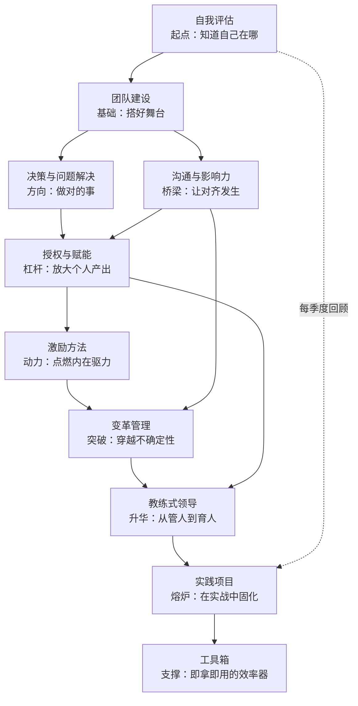
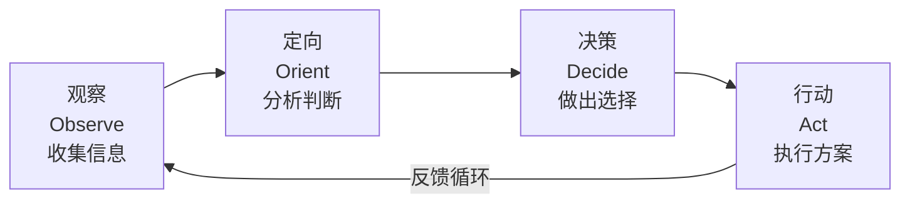
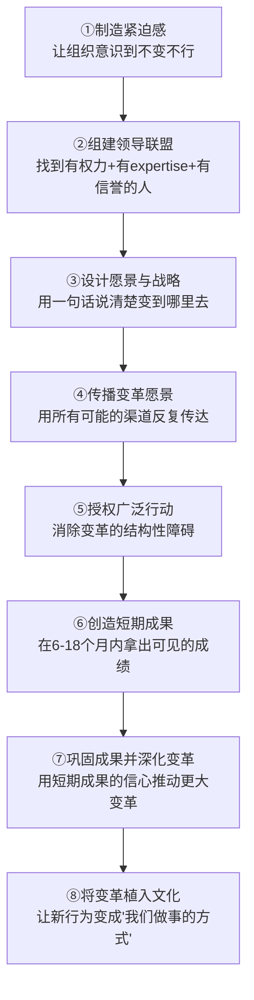
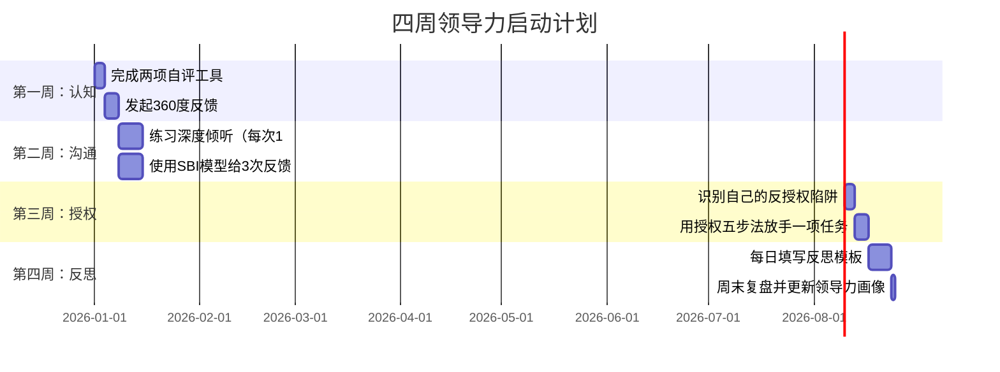

## 本章核心要点：具体方案篇全景提炼

本节是"具体方案篇"的收束与提炼。前面十节分别从自我评估、团队建设、决策、沟通、授权、激励、变革、教练、实践项目和工具箱十个维度展开，每一节都提供了理论依据、操作步骤和实操工具。本节的目标不是重复那些内容，而是帮你建立**全局视角**——看清十大能力之间的逻辑关系、抓住每项能力的"一句话精髓"、识别自己的优先提升方向，并获得一份可直接执行的行动计划。

---

### 一、十大能力的内在逻辑：不是十个孤岛，而是一条链

很多人学领导力容易犯一个错误：把每一项能力当作独立模块来学，学完一个换下一个。但实际领导场景中，这些能力是**相互嵌套、彼此依赖**的。理解它们之间的结构关系，比单独掌握每一项更重要。

这张图传递了一个关键信息：**自我评估是入口，实践项目是熔炉，工具箱是支撑**。中间的七项能力构成一条递进链——先建团队，再定方向，然后通过沟通对齐、通过授权放大、通过激励驱动、通过变革突破、最终通过教练实现"从管人到育人"的跃迁。

---

### 二、十项能力的一句话精髓

每项能力都可以浓缩为一句话。这句话不是口号，而是该项能力的**核心判断**——它决定了你在实操中的一切决策取向。

| # | 能力维度 | 一句话精髓 | 为什么这句话是核心 |
|---|---------|-----------|------------------|
| 1 | 自我评估 | **大多数领导力问题的根源不是能力不足，而是缺乏对自己行为模式的认知** | 没有觉察的努力是盲目努力。你可能花大量时间学沟通，但真正阻碍你的是决策犹豫 |
| 2 | 团队建设 | **团队不是"把人凑在一起"，而是通过结构化设计让1+1>2** | 贝尔宾角色互补、塔克曼四阶段、团队章程——这些都是"结构化设计"的具体手段 |
| 3 | 决策 | **领导者的每一个决策都影响团队方向，结构化工具能显著降低决策偏差** | 人脑天然存在锚定效应、确认偏误、沉没成本谬误。决策矩阵、OODA循环、预验尸法是对抗这些偏差的武器 |
| 4 | 沟通 | **沟通不是"把话说清楚"，而是"让对方愿意听、听得懂、愿意做"** | "说清楚"只完成了信息传递，"愿意听"需要信任关系，"听得懂"需要翻译能力，"愿意做"需要影响力 |
| 5 | 授权 | **授权不是"甩手不管"，而是"我在你身后，但你来主导"** | 这句话解决了授权中最常见的两个极端：要么不放手（微观管理），要么放了不管（甩手掌柜） |
| 6 | 激励 | **钱只是保健因素，成长和意义感才是真正的激励因素** | 赫茨伯格的双因素理论最深刻的启示：消除不满不等于产生满意。加薪只能消除不满，挑战性任务和成长机会才能真正激励 |
| 7 | 变革 | **变革失败的首要原因不是方案不好，而是人心没准备好** | 科特变革八步中前四步都在做"人心准备"——制造紧迫感、组建领导联盟、设计愿景、传播愿景。方案只占后四步 |
| 8 | 教练 | **最高级的领导力不是"我告诉你怎么做"，而是"我帮你找到你自己的答案"** | 每次你给答案，都在强化团队对你的依赖。教练式领导的回报是团队能力的持续增长 |
| 9 | 实践项目 | **领导力70%靠实践，不实践等于零** | 70-20-10法则不是鸡汤，而是Center for Creative Leadership对数千名高管成长路径的实证研究结论 |
| 10 | 工具箱 | **工具的价值不在于拥有，而在于使用频率** | 80%的管理者学过反馈模型，但只有不到20%的人在日常中持续使用。工具箱的意义是降低使用门槛 |

---

### 三、每项能力的核心模型速查

在具体方案篇中，每一节都介绍了多个模型和框架。这里提取每项能力**最核心的一个模型**，作为速查参考。当你面对实际领导场景时，先调用这个模型，再根据需要深入其他工具。

#### 3.1 自我评估：布莱克-莫顿管理方格

将你的领导风格定位在"任务导向"和"关系导向"两个维度构成的9×9矩阵中。五个典型位置：

- **贫乏型管理（1,1）**：既不关心任务也不关心人——最低投入
- **任务型管理（9,1）**：高度关注任务，忽视人的需求——短期高效，长期疲惫
- **乡村俱乐部型管理（1,9）**：高度关注人，忽视任务——团队和谐但产出不足
- **中庸型管理（5,5）**：两者兼顾但都不深入——不出错但也不出色
- **团队型管理（9,9）**：同时高度关注任务和人——理想状态，但需要最高能力

**实操建议**：先用自评问卷定位自己当前的位置，再用360度反馈验证。大多数人会发现自己在"任务型"和"中庸型"之间，而提升方向是向"团队型"靠拢。

#### 3.2 团队建设：塔克曼四阶段模型

| 阶段 | 特征 | 领导者角色 | 关键行动 |
|------|------|-----------|---------|
| 组建期（Forming） | 成员礼貌、观望、不确定 | 指令型：明确方向和规则 | 制定团队章程、明确角色分工、组织破冰 |
| 风暴期（Storming） | 冲突浮现、意见分歧、权力争夺 | 教练型：引导冲突、建立规范 | 接纳冲突为正常现象、引导建设性讨论、调解而非压制 |
| 规范期（Norming） | 建立默契、形成共识、协作顺畅 | 支持型：赋能而非控制 | 逐步授权、强化团队仪式、庆祝里程碑 |
| 高效期（Performing） | 高效协作、自主创新、自我驱动 | 授权型：给方向不给细节 | 只设定目标和边界、让团队自主决策、关注成长机会 |

**关键洞察**：大多数团队问题发生在风暴期，因为领导者误以为冲突是坏事而试图压制。实际上，**成功穿越风暴期的团队才能达到真正的高效期**。

#### 3.3 决策：OODA循环

源自美国空军约翰·博伊德上校的空战决策理论，适用于需要快速响应的场景：

**核心价值**：在VUCA环境中，决策速度和决策质量同样重要。OODA循环的优势在于它强调"定向"环节——不是简单地收集信息，而是基于你的经验和认知框架对信息进行快速重组。比对手更快完成一个OODA循环的人，拥有决策优势。

#### 3.4 沟通：西奥迪尼六大影响力原则

罗伯特·西奥迪尼在《影响力》中提出的六大原则，是**非职权影响力**的理论基石：

1. **互惠原则**：先给予，再索取。在请求配合前，先提供价值
2. **承诺与一致**：让对方做出小承诺，一致性心理会推动他们兑现大承诺
3. **社会认同**：人们倾向于参考他人的行为。"其他团队已经在这样做了"比"这样做更好"更有说服力
4. **喜好原则**：人们更容易被自己喜欢的人说服。建立关系是影响力的前提
5. **权威原则**：专业背书和数据支撑能显著增强说服力
6. **稀缺原则**：机会越稀缺，人们越重视。"这个机会只有这一次"比"随时可以"更能推动行动

**实操建议**：在每次需要推动他人配合的场景中，有意识地选择1-2个原则组合使用，而不是凭本能说服。

#### 3.5 授权：授权四象限

根据**任务重要性**和**下属成熟度**两个维度，将授权分为四个象限：

| | 下属成熟度高 | 下属成熟度低 |
|---|------------|------------|
| **任务重要性高** | 充分授权+定期检查点 | 委派但密切指导 |
| **任务重要性低** | 完全放手 | 培训后授权 |

**反授权七种话术及应对**：

| 话术 | 潜台词 | 应对策略 |
|------|--------|---------|
| "领导您看怎么办？" | 我不想承担责任 | "你先说说你的想法，我来补充" |
| "这个我做不了" | 我没信心或不想做 | "你觉得哪一步最难？我们拆开来看" |
| "之前不是这样做" | 习惯惯性 | "之前的环境不同，这次我们试试新方法" |
| "这个决策太大了" | 怕担责任 | "决策我来担，你负责执行方案的制定" |
| "我需要更多资源" | 合理诉求或拖延 | 具体化："你需要什么资源？什么时候需要？" |
| "其他人还没做" | 观望心态 | "我们先做，做成了自然有人跟" |
| "这个会不会有问题" | 风险规避 | "有什么风险？你建议怎么预防？" |

#### 3.6 激励：自我决定理论（SDT）三要素

SDT由Deci和Ryan提出，是目前激励理论中实证支持最强的框架。它认为人类有三个基本心理需求，满足这三个需求就能激发内在动机：

| 需求 | 含义 | 管理者行动 |
|------|------|-----------|
| **自主性（Autonomy）** | 感觉自己的行为是自我选择的 | 给选择而非命令：提供目标，让团队决定实现路径 |
| **胜任感（Competence）** | 感觉自己能胜任挑战 | 设置"跳一跳够得着"的目标，及时给予具体反馈 |
| **归属感（Relatedness）** | 感觉与他人有联结和归属 | 创造团队仪式、关心个人生活、建立心理安全感 |

**关键区分**：SDT和马斯洛的区别在于——马斯洛是"层级满足"（先满足低层再满足高层），SDT是"同时满足"（三个需求同等重要，缺一不可）。

#### 3.7 变革：科特变革八步模型

约翰·科特在《领导变革》中提出的八步模型，是变革管理领域引用率最高的框架：

**最常被忽视的步骤**是第六步——创造短期成果。很多变革项目失败是因为领导者要求"给我三年时间"，但组织的信心和耐心都需要**早期可见的胜利**来维持。

#### 3.8 教练：GROW模型

GROW是教练式领导中使用最广泛的对话框架：

| 环节 | 目的 | 典型提问 |
|------|------|---------|
| **G - 目标（Goal）** | 明确对话的目标 | "这次对话你想达到什么结果？""你理想的状态是什么？" |
| **R - 现状（Reality）** | 客观评估当前情况 | "现在的情况是什么？""你已经尝试了什么？""有哪些障碍？" |
| **O - 选择（Options）** | 探索所有可能的方案 | "你有哪些选择？""如果没有任何限制，你会怎么做？""还有呢？" |
| **W - 行动（Will）** | 承诺具体行动 | "你决定怎么做？""什么时候开始？""你需要什么支持？" |

**关键技巧**：在O（选择）环节，教练最常见的错误是过早给出自己的建议。正确做法是**至少追问三轮"还有呢？"**，让被教练者充分挖掘自己的选项，你再补充。

#### 3.9 实践项目：90天融入计划

如果你即将接手一个新团队或新项目，这是最有价值的实践框架：

| 阶段 | 时间 | 核心任务 | 关键产出 |
|------|------|---------|---------|
| **观察期** | 第1-30天 | 大量一对一谈话、了解业务和人 | 30天诊断报告（团队现状+关键问题） |
| **诊断期** | 第31-60天 | 确认优先级、建立关键关系 | 90天行动计划（3-5个关键举措） |
| **行动期** | 第61-90天 | 推动第一个"速赢"项目 | 一个可见的短期成果 |

**核心原则**：前30天的黄金法则是"多听少说、多问少判断"。急于证明自己能力的新领导者，最容易犯的错误是在不了解情况时就推动变革。

#### 3.10 工具箱：每日反思模板

工具箱中有多个模板，但使用频率最高、投入产出比最大的是**每日反思模板**：

日期：____
今天我做的最有效的领导行为是：_________________________________
今天我遇到的最大挑战是：_________________________________
我从中学到了什么：_________________________________
明天我可以改进的地方：_________________________________

**为什么这个模板最重要**：哈佛商学院的研究表明，每天花5分钟反思的管理者，其领导效能提升速度比不反思者快2.5倍。这个模板的价值不在于格式，而在于**它强迫你把模糊的感受转化为具体的行为描述**——只有具体的行为才能被改进。

---

### 四、能力矩阵自检：你的优先提升方向

用以下矩阵快速自评你在十项能力上的水平。评分标准：1分=完全没有意识，2分=偶尔做到，3分=经常做到，4分=已经成为习惯。

| 能力维度 | 自评分（1-4） | 最近一次具体行为举例 |
|---------|-------------|-------------------|
| 自我评估 | ___ | 最近一次主动寻求反馈是什么时候？ |
| 团队建设 | ___ | 你的团队有明确的章程和角色分工吗？ |
| 决策 | ___ | 最近一次重大决策用了什么框架？ |
| 沟通 | ___ | 最近一次一对一沟通，你说了多少、听了多少？ |
| 授权 | ___ | 最近一周你放手了几件事？ |
| 激励 | ___ | 你团队中每个人的激励偏好你清楚吗？ |
| 变革 | ___ | 你最近推动的一次变化，团队接受度如何？ |
| 教练 | ___ | 最近一次下属来找你，你给了答案还是问了问题？ |
| 实践 | ___ | 过去一个月你刻意练习了哪个领导力行为？ |
| 工具 | ___ | 你有固定的反思/复盘习惯吗？频率如何？ |

**分析方法**：

- **2分及以下的项目**：这是你的盲区，优先投入时间提升
- **3分的项目**：已经入门，需要从"偶尔做到"升级为"经常做到"
- **4分的项目**：是你的优势，继续保持并考虑教给他人——教是最好的学

**优先级排序建议**：不要试图同时提升所有项目。选择**得分最低的2-3项**作为下一季度的重点，集中精力突破。

---

### 五、三大常见学习陷阱

在学习具体方案篇的内容时，有三个陷阱特别容易踩：

**陷阱一：学了模型就以为自己会了**

很多人读完OODA循环、GROW模型后觉得自己"懂了"，但从未在真实场景中使用过。领导力模型就像游泳的动作分解图——看懂了不等于会游泳。**唯一的检验标准是你能否在压力场景中自然地调用这个模型**。

破解方法：选择一个模型，设计一个"本周实验"（见本节第六部分），在真实场景中使用至少3次，然后反思效果。

**陷阱二：追求"最优风格"而非"情境适配"**

情境领导理论的核心洞察是——**没有最好的领导风格，只有最适合当前情境的风格**。很多人学完所有风格后试图找到"自己的风格"，然后一招鲜吃遍天。但面对能力高意愿低的下属，你需要授权；面对能力低意愿高的下属，你需要指导。同一个人在不同任务上也需要不同风格。

破解方法：每次切换领导行为前，先用10秒评估两个维度——这个人的能力和意愿分别是什么水平？然后选择匹配的风格。

**陷阱三：忽视"底层能力"只练"表层技巧"**

很多领导力培训教的是技巧——怎么开会、怎么反馈、怎么做决策。这些技巧很重要，但如果你的底层能力（自我觉察、情绪管理、认知灵活性）不足，技巧用起来会生硬、不自然。就像一个情绪不稳定的人，即使学会了SBI反馈模型，在愤怒时也很难冷静地描述行为而非攻击人格。

破解方法：将每日反思作为底层能力的训练器。反思不是"记流水账"，而是**刻意练习自我觉察**——"刚才那个场景中，我的情绪是什么？它如何影响了我的行为？"

---

### 六、四周启动计划：从读完到行动

如果你读完了具体方案篇但不知道从哪里开始，以下是一个四周启动计划，每周聚焦一项核心能力，四周完成一个最小闭环：

**第一周：自我认知**
- 完成DISC行为风格评估和布莱克-莫顿领导风格自测
- 向5-8人发起匿名360度反馈
- 整理结果，识别最大的2个盲区

**第二周：沟通能力**
- 每次一对一沟通中，刻意练习"不打断+复述对方核心观点"
- 用SBI模型（Situation-Behavior-Impact）对3位同事给出具体反馈
- 记录每次练习的效果和感受

**第三周：授权能力**
- 用反授权话术清单回顾过去一个月，识别自己中招的次数
- 选择一项任务，完整执行授权五步法
- 记录授权过程中的不适感和突破点

**第四周：反思固化**
- 每天工作结束前花5分钟填写反思模板
- 周末花15分钟复盘：这三周最大的收获是什么？最大的挑战是什么？
- 基于新认知更新你的领导力画像

---

### 七、从"具体方案"到"终身修行"：一句话寄语

具体方案篇的所有内容——十个模型、十种工具、十个实践项目——都指向同一个底层真相：

**领导力不是一种知识，而是一种习惯。知识可以通过阅读获得，习惯只能通过反复练习养成。**

你不需要记住所有模型，不需要掌握所有工具。你只需要从今天开始，选择一个你最认同的行动，持续做下去。当它从"需要刻意想起"变成"自然而然这样做"的那一天，你就完成了一次领导力的内化。

下一篇"领导力提升工具箱"提供了本篇所有模板和框架的可打印版本，建议收藏后在实际工作中随时取用。
