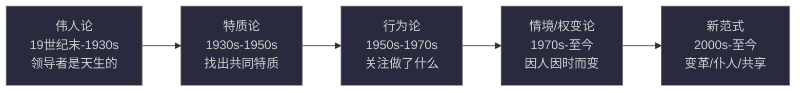
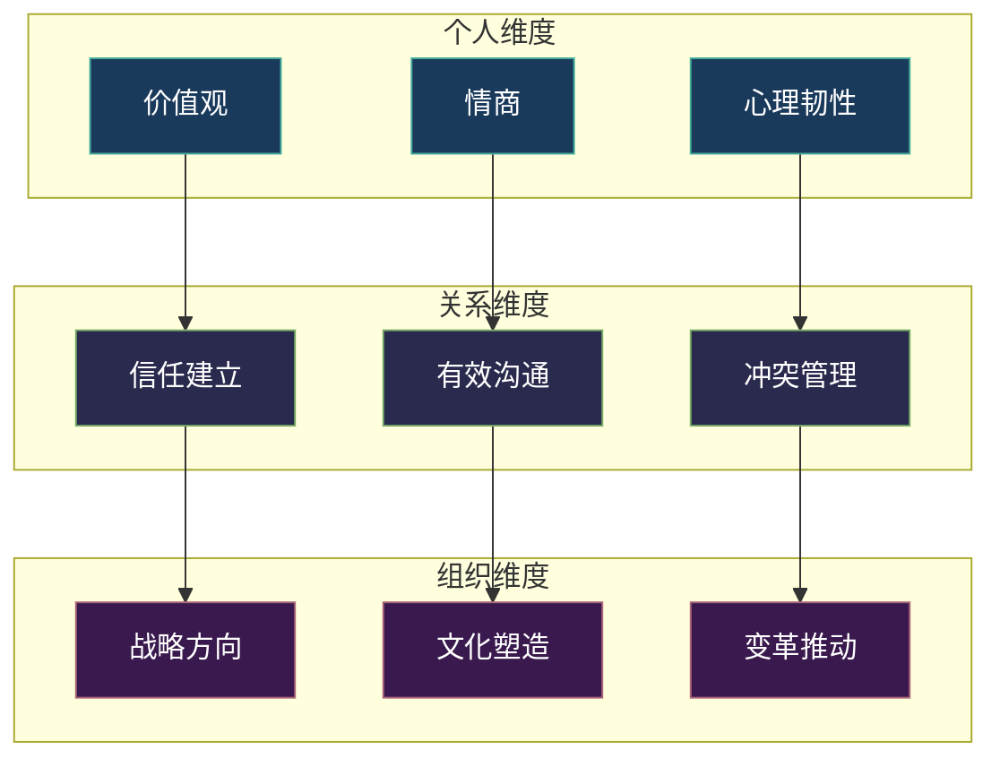
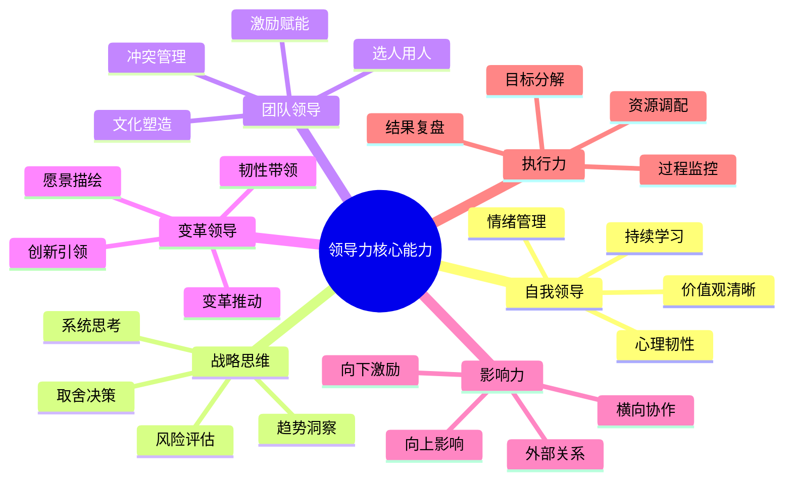

# 一、领导力的本质与定义

在学习任何一门学问之前，厘清概念是第一步。领导力这个词在日常生活中被高频使用，但大多数人对它的理解停留在"带团队的能力"或"当领导的素质"上。这种模糊的认知会导致两个严重问题：一是把领导力等同于管理能力，用管事的思维去管人；二是把领导力神化为天赋，认为自己"不是当领导的料"。

本章将从根本上厘清领导力的内涵，建立准确的心智模型。这是整个领导力学习的地基——地基不稳，后面的所有理论和方法都是空中楼阁。

---

## 1.1 领导力的多重定义

### 1.1.1 学术界的经典定义

领导力（Leadership）是一个被研究了上百年的概念，不同学者从不同角度给出了定义。没有任何一个定义能穷尽领导力的全部内涵，但将它们放在一起看，就能拼出一幅完整的图景。

**彼得·德鲁克（Peter Drucker）**：
> "领导力是将人的视野提升到更高的境界，将人的绩效提升到更高的标准，将人的品格塑造到超越常规限制的能力。"

德鲁克的定义强调了三个维度——视野、绩效和品格。他不认为领导力是关于个人魅力的，而是关于"让他人变得更好"。这与他一贯的管理哲学一致：管理的本质是释放人的潜能，而非控制人的行为。

**约翰·麦克斯韦尔（John Maxwell）**：
> "领导力就是影响力，不多不少。"

这是最简洁也最有争议的定义。它的价值在于剥离了职位、权力、魅力等外在因素，直指领导力的核心——你能否影响他人的思想和行为。但它的局限在于：影响力有正面也有负面，骗子也能影响他人，但那不是领导力。

**沃伦·本尼斯（Warren Bennis）**：
> "领导力是将愿景转化为现实的能力。"

本尼斯强调的是领导力的结果导向——不是你说了什么，而是你做到了什么。他一生研究领导力，最终得出结论：领导力不是天生的品质，而是可以通过学习获得的技能组合。他本人就是最好的例证——年轻时在二战中担任排长的经历塑造了他的领导力认知。

**詹姆斯·库泽斯（James Kouzes）和巴里·波斯纳（Barry Posner）**：
> "领导力是动员他人为了共同的愿景而努力奋斗的艺术。"

库泽斯和波斯纳的定义包含了三个关键要素：动员（不是命令）、共同的愿景（不是领导者的个人目标）、艺术（不是科学，意味着需要灵活性和创造力）。

**罗伯特·格林利夫（Robert Greenleaf）**：
> "领导者首先是仆人……它始于一种想要服务的自然感觉，然后才是有意识的选择引导他去渴望领导。"

格林利夫提出的"仆人式领导"（Servant Leadership）彻底颠覆了传统领导力的方向——领导者不是在上面指挥，而是在下面支撑。这个理念在现代知识型组织中越来越被重视，因为知识工作者需要的不是监督，而是支持。

### 1.1.2 整合定义

综合以上学者的观点，我们可以给出一个更完整的定义：

**领导力是一种通过影响、激励和赋能他人，在不确定环境中共同实现有价值目标的能力。**

这个定义包含了五个核心要素：

| 要素 | 含义 | 反面（不是什么） |
|------|------|-----------------|
| **影响** | 改变他人的认知和行为 | 不是命令和控制 |
| **激励** | 激发内在驱动力 | 不是外在施压 |
| **赋能** | 提升他人的能力和信心 | 不是制造依赖 |
| **不确定环境** | 在变化中找到方向 | 不是在既定流程中执行 |
| **有价值的目标** | 超越个人利益的共同愿景 | 不是领导者个人的野心 |

这五个要素是后面所有领导力理论的基础框架。特质理论研究的是"什么样的人能做到影响和激励"，行为理论研究的是"通过什么行为来影响和激励"，情境理论研究的是"在不同环境下如何调整影响方式"，变革型领导研究的是"如何超越交易关系实现深层激励"。

---

## 1.2 领导力概念的历史演进

理解领导力的今天，需要知道它的昨天。领导力研究经历了四个范式转变，每一次转变都刷新了人们对"什么是好领导"的认知。

### 1.2.1 四个范式的演变

**第一阶段：伟人论（Great Man Theory，19世纪末-1930年代）**

这是领导力研究的起点。伟人论认为历史是由少数伟人推动的——亚历山大、凯撒、拿破仑——他们天生就具有非凡的领导才能。这个理论的问题显而易见：它排除了女性（所以叫"Great Man"而非"Great Person"），忽略了情境因素，并且无法解释为什么有些"伟人"在某些情境下失败了。

但伟人论有一个至今仍有价值的洞察：**人格特质确实在领导力中扮演角色**。现代研究已经证实，外向性、尽责性和开放性等人格特质与领导力效能存在统计学上的相关性——只是它们不是决定性因素。

**第二阶段：特质论（Trait Theory，1930-1950年代）**

特质论试图用科学方法找出领导者的共同特质。拉尔夫·斯托格迪尔（Ralph Stogdill）在1948年发表了里程碑式的综述，分析了上百项研究，发现领导者通常具有以下特质：智力、自信、决心、正直、社交能力。

但斯托格迪尔自己也指出了特质论的根本问题：没有任何一组特质能保证一个人成为领导者。同样的特质在不同情境下效果截然不同——果断在危机中是优势，在需要共识时可能是劣势。特质论的贡献不在于它找到了答案，而在于它提出了正确的问题，并推动研究者去寻找更好的解释框架。（特质论的详细内容见下一章）

**第三阶段：行为论（Behavioral Theory，1950-1970年代）**

行为论的革命性在于它的核心假设：**领导力不是你是什么，而是你做什么**。如果领导行为可以被分解和描述，那么它就可以被学习和训练。

俄亥俄州立大学和密歇根大学的两项大规模研究几乎同时独立地得出了相似的结论：领导行为可以沿两个维度描述——"关心人"（Initiating Structure vs. Consideration）和"关注任务"。这个发现的意义是深远的：它意味着领导力不是神秘的天赋，而是可以分解为具体行为模式的技能组合。

行为论的最大贡献是打开了领导力培训的大门。如果领导力是行为，那么它就可以被教授、被练习、被反馈、被改进。（行为论的详细内容见第三章）

**第四阶段：情境与权变论（1970年代至今）**

保罗·赫塞（Paul Hersey）和肯·布兰查德（Ken Blanchard）的情境领导理论、弗雷德·费德勒（Fred Fiedler）的权变模型共同确立了一个核心观点：**没有放之四海而皆准的领导风格，有效的领导取决于情境**。

这就像医生不会用同一种药治疗所有病人一样——领导方式必须与下属的成熟度、任务的性质、组织的文化和外部环境相匹配。（情境领导的详细内容见第四章）

**第五阶段：新范式（2000年代至今）**

进入21世纪，领导力研究出现了多个并行的新范式：

- **变革型领导**：伯恩斯（James MacGregor Burns）和巴斯（Bernard Bass）提出的变革型领导理论，强调领导者通过激发追随者的高层次需求（如自我实现）来实现超越预期的绩效。（详见第五章）
- **仆人式领导**：格林利夫的理念在知识经济时代获得了新的生命力，许多科技公司（如西南航空、星巴克）的文化都深受其影响。
- **共享式领导**：在扁平化组织中，领导力不再集中在一个人身上，而是分布在团队成员之间。谷歌的"Project Aristotle"研究发现，高效团队最显著的特征不是有一个出色的领导者，而是"心理安全感"——这本质上是一种共享领导力的表现。
- **敏捷领导**：在VUCA时代，领导者需要快速适应、持续学习、拥抱不确定性。传统的"制定五年战略计划然后执行"的模式正在被"小步快跑、快速迭代"的敏捷模式取代。

### 1.2.2 范式转变的启示

这四次范式转变给我们的最大启示是：**领导力的定义在不断扩展**。从"你是谁"到"你做什么"，从"一套标准方法"到"因情境而变"，从"一个人的英雄主义"到"整个团队的共同能力"。这意味着：

1. 任何人都可以通过学习和实践发展领导力（行为可学）
2. 没有一种"万能"的领导风格（情境决定有效性）
3. 领导力不只是领导者一个人的事（关系和系统视角）
4. 领导力的内涵随时代变化而扩展（需要持续学习）

---

## 1.3 领导力的三个维度

从学术研究的角度，领导力可以从三个维度来理解。这三个维度相互嵌套、相互影响，构成了领导力的完整图景。

### 1.3.1 个人维度：领导者的内在根基

个人维度关注的核心问题是：**领导者是一个什么样的人**。

这是领导力的内在根基。一个领导者如果缺乏自我认知，就如同在黑暗中航行的船只——可能动力十足，但方向不明。个人维度包括以下关键要素：

**价值观与信念系统**

价值观是领导者做决策时的"内在指南针"。当面临两难选择时——短期利润还是长期信誉？裁员保住公司还是全员降薪共渡难关？——价值观决定了你的选择。

案例：2009年，星巴克创始人霍华德·舒尔茨重返CEO职位时，公司正面临严重的业绩下滑。他做的第一件事不是调整战略，而是关闭全美7100家门店3.5小时，对13.5万名员工进行咖啡技艺重新培训。华尔街批评他"浪费"，但舒尔茨说："我们不能为了效率而牺牲品质，那是我们的根基。"这次培训花费了约600万美元，但它重新确立了星巴克的核心价值——对咖啡品质的执着追求，为后续的扭亏为盈奠定了文化基础。

**自我认知与情绪管理**

丹尼尔·戈尔曼（Daniel Goleman）的研究表明，情商（Emotional Intelligence）对领导力效能的影响力是智商和技术能力的两倍。情商包括五个维度：

- **自我觉察**：认识自己的情绪、优势、弱点和驱动力
- **自我管理**：控制破坏性情绪和冲动，在变化中保持冷静
- **内在驱动力**：出于对成就的热爱而非金钱和地位来工作
- **同理心**：理解他人的情感和观点
- **社交技能**：管理关系、建立网络、找到共同点

其中，自我觉察是其他四个维度的基础。一个不了解自己情绪模式的领导者，就像一个不知道自己车速的司机——在高速公路上可能感觉很爽，但实际上已经超速了。

**心理韧性**

领导力不是在顺风顺水时体现的，而是在逆境中。心理韧性（Resilience）是领导者在面对挫折、失败和压力时恢复和成长的能力。研究表明，心理韧性不是固定不变的人格特质，而是一种可以培养的能力组合，包括：认知灵活性（从多个角度看问题）、情绪调节能力（在压力下保持清晰思考）、意义建构能力（在混乱中找到方向感）。

### 1.3.2 关系维度：领导力的社会基础

关系维度关注的核心问题是：**领导者如何与他人建立和维护关系**。

领导力从来不是一个人的事——它存在于领导者与追随者的关系之中。没有追随者，就没有领导者。这一点看似简单，却是很多人对领导力最大的误解：他们以为领导力是关于"我"的，但领导力其实是关于"我们"的。

**信任——关系的基石**

信任是领导力的货币。没有信任，愿景是空话，授权是风险，激励是表演。信任的建立需要四个要素，可以用一个公式来理解：

信任 = （可信度 + 可靠性 + 亲近感）÷ 自私倾向

- **可信度**（Credibility）：你是否具备相应的知识和能力？你说的话是否真实？
- **可靠性**（Reliability）：你是否言行一致？你是否能持续兑现承诺？
- **亲近感**（Intimacy）：你是否让他人感到安全，愿意与你分享真实想法？
- **自私倾向**（Self-orientation）：你是在为自己谋利还是在为团队和组织考虑？

注意公式中的除号——自私倾向越大，信任越低。这就是为什么一些能力很强的领导者却无法获得团队信任：他们的能力提高了可信度，但自私倾向抵消了一切。

**沟通——关系的载体**

领导力几乎全部通过沟通来实现。但领导者需要的沟通能力不是"能说会道"，而是以下三个层次：

| 层次 | 内容 | 目的 |
|------|------|------|
| 信息传递 | 传达事实、数据、指令 | 确保行动一致 |
| 意义建构 | 解释"为什么"，连接愿景与行动 | 赋予工作意义感 |
| 情感连接 | 倾听、共鸣、表达关怀 | 建立信任和归属感 |

大多数领导者擅长第一层，部分达到第二层，少数能抵达第三层。而真正卓越的领导力，恰恰发生在第三层。马丁·路德·金的"I Have a Dream"演讲之所以流传至今，不是因为它传递了什么新信息，而是因为它在情感层面与数百万人建立了共鸣。

**冲突管理——关系的试金石**

很多领导者回避冲突，认为冲突意味着关系破裂。但研究表明，高效团队的冲突频率并不低于低效团队——区别在于冲突的类型。高效团队有更多"任务冲突"（对事不对人的观点交锋），而低效团队有更多"关系冲突"（人身攻击和情绪对抗）。

领导者在冲突中的角色不是消灭冲突，而是将关系冲突转化为任务冲突。具体方法包括：建立"对事不对人"的讨论规范、用数据和事实代替主观感受、在讨论后及时修复关系（"刚才的讨论很激烈，但我希望你知道我尊重你的观点"）。

### 1.3.3 组织维度：领导力的宏观视野

组织维度关注的核心问题是：**领导者如何影响整个系统**。

一个优秀的领导者不仅能够管理好当下的团队，还能够从组织全局出发，思考战略方向、推动组织变革、塑造组织文化。

**战略思考**

战略思考是将"看清现状"和"构想未来"连接起来的能力。它包括：

- **系统思维**：理解组织是一个由相互关联的部分组成的系统，牵一发而动全身
- **趋势洞察**：识别外部环境中的关键变化信号，在变化成为共识之前就开始布局
- **取舍决策**：战略的本质是选择做什么和不做什么。迈克尔·波特（Michael Porter）说过："战略的本质是选择不做什么。"

**文化塑造**

彼得·德鲁克的名言"文化把战略当早餐吃掉"（Culture eats strategy for breakfast）深刻揭示了文化对组织绩效的决定性影响。领导者对文化的塑造主要通过三种机制：

1. **言行一致**：领导者反复强调什么、奖励什么行为、惩罚什么行为，定义了组织的真实文化
2. **关键事件的处理方式**：当公司面临利益冲突时（比如短期利润 vs 客户利益），领导者的选择会被所有人看在眼里，成为文化的实际注脚
3. **符号与仪式**：会议怎么开、晋升标准是什么、办公环境如何设计——这些细节无时无刻不在传递文化信号

**变革推动**

在VUCA（易变性Volatility、不确定性Uncertainty、复杂性Complexity、模糊性Ambiguity）时代，组织面临的环境变化速度远超以往。有学者进一步提出了BANI框架来描述当今世界：

| BANI维度 | 含义 | 对领导者的要求 |
|----------|------|---------------|
| **Brittle（脆弱性）** | 看似稳定的系统可能突然崩溃 | 建立冗余和弹性 |
| **Anxious（焦虑性）** | 不确定性导致集体焦虑 | 提供稳定感和意义感 |
| **Nonlinear（非线性）** | 小因大果，因果关系不可预测 | 培养敏捷响应能力 |
| **Incomprehensible（不可理解）** | 复杂性超出个人认知能力 | 建立集体智慧系统 |

在这种环境中，领导者的角色不再是"制定完美计划然后执行"，而是"创造一个能够持续学习和适应的组织"。

### 1.3.4 三个维度的整合

三个维度不是独立存在的，而是相互嵌套的：

个人维度是根基——你无法给出自己没有的东西。一个情绪失控的领导者无法建立信任关系，一个没有清晰价值观的领导者无法塑造健康的组织文化。

关系维度是桥梁——愿景再好，如果没有通过有效的沟通传递到每个人心中，就只是领导者的自言自语。关系维度是领导力从个人走向组织的必经之路。

组织维度是舞台——领导力的最终价值体现在组织层面：战略是否正确、文化是否健康、变革是否成功。一个领导者可能在个人和关系维度上表现优异，但如果缺乏组织视野，就只能做一个好的"小团队领导"，而无法成为"组织领导者"。

---

## 1.4 领导力与管理的区别

理解领导力与管理的区别，是学习领导力的第一步。很多人把"领导"和"管理"混为一谈，导致用管理的方式去领导，结果是：流程越来越完善，但人心越来越散；KPI越来越精细，但创新越来越少。

### 1.4.1 核心差异对比

| 维度 | 领导（Leadership） | 管理（Management） |
|------|-------------------|-------------------|
| 核心关注 | 方向与变革 | 秩序与效率 |
| 时间导向 | 未来与长远 | 当下与短期 |
| 主要方式 | 激励与影响 | 控制与监督 |
| 关键问题 | "做正确的事" | "正确地做事" |
| 对人的态度 | 赋能与培养 | 指挥与考核 |
| 对风险的态度 | 拥抱变革 | 降低风险 |
| 核心能力 | 愿景、影响力 | 计划、执行力 |
| 成功标准 | 变革与成长 | 目标达成与稳定 |
| 适用环境 | 快速变化 | 稳定可预测 |

约翰·科特（John Kotter）在其经典著作中明确指出：

- **管理**是应对复杂性的：通过计划、预算、组织、配置、控制和解决问题来维持秩序
- **领导**是应对变革的：通过设定方向、联合人们、激励和鼓舞来推动变革

### 1.4.2 为什么两者缺一不可

领导和管理不是对立的，而是互补的。一个只有领导没有管理的组织，有愿景但执行混乱；一个只有管理没有领导的组织，有效率但方向不明。

用一个比喻来理解：管理是汽车的发动机和刹车系统——确保车辆运转顺畅、安全可控；领导是方向盘和GPS——决定去往哪里。一辆没有方向盘的跑车（只有管理）跑得越快越危险；一辆方向盘很灵但发动机熄火的车（只有领导）哪儿也去不了。

科特的研究发现，大多数组织的失衡不是偏向了领导或管理中的某一端，而是**严重缺乏领导**。大多数管理者擅长制定计划、分配任务、监控进度，但在设定愿景、激励人心、推动变革方面能力不足。这不是因为管理比领导更重要，而是因为管理更容易量化和培训，而领导更依赖软技能和实践经验。

### 1.4.3 从管理到领导的跨越

从管理者转变为领导者，需要经历三重心智转变：

**第一重：从"做事"到"通过他人做事"**

新晋管理者最常见的错误是继续做自己擅长的专业工作，而忽略了团队管理。领导力的第一步是放手——不是放弃责任，而是将执行的责任转移给团队成员，自己专注于方向、资源和赋能。

**第二重：从"解决问题"到"预见问题"**

管理者的典型工作模式是"发现问题→分析原因→解决问题"。领导者需要更进一步——在问题发生之前预见它，在机会成为共识之前抓住它。这需要从战术思维上升到战略思维。

**第三重：从"维护现状"到"创造未来"**

最高层次的转变是从"把当前的事情做好"到"定义未来应该做什么"。这需要跳出当前业务的框架，思考行业趋势、技术变革和社会变化，为组织指明新的方向。

---

## 1.5 领导力的五种核心实践

库泽斯和波斯纳通过对数千位领导者的长期研究，总结出领导力的五种核心实践行为。这五种实践不是理论模型，而是经过大规模实证验证的行为模式——在不同国家、不同行业、不同层级的领导者身上都得到了验证。

### 1.5.1 以身作则（Model the Way）

**核心理念**：领导者首先要明确自己的价值观和信念，然后通过自己的行为来践行这些价值观。"言行一致"是建立信任和信誉的基础。

**为什么重要**：人们不听领导者说什么，他们看领导者做什么。当领导者的行为与其宣称的价值观不一致时，团队会以行为为准而不是以言辞为准。这被称为"影子效应"——领导者的一举一动都在无声地定义"这里真正重要的是什么"。

**具体做法**：

1. **明确个人价值观**：写下你作为领导者最核心的3-5条价值观（如正直、创新、客户至上），然后问自己："我最近一周的行为是否体现了这些价值观？"
2. **建立共享价值观**：与团队一起讨论并确定团队的共同价值观，让它不是领导者的个人宣言，而是团队的共同承诺
3. **用行为说话**：如果你想强调"学习"，那你自己是否在持续学习？如果你想强调"开放"，那当有人挑战你的观点时，你的第一反应是什么？

**反面案例**：某公司CEO在年度大会上大谈"创新文化"，鼓励员工大胆试错。但当一名中层管理者尝试新方案失败后，CEO在全员邮件中点名批评，还扣了季度奖金。此后，再没有人提出新想法。这就是"说一套做一套"的破坏力——一次言行不一致，可能抵消一百次正确言行的效果。

### 1.5.2 共启愿景（Inspire a Shared Vision）

**核心理念**：领导者需要描绘一个令人激动的未来愿景，并让团队成员感受到这个愿景与自己的关联。好的愿景不是领导者的独角戏，而是凝聚了团队共同期望的未来图景。

**为什么重要**：人不会全力以赴地去实现别人的目标。只有当团队成员觉得"这个愿景也是我的愿景"时，他们才会从"被要求做"转变为"主动想做"。这就是内在驱动力和外在压力的根本区别。

**具体做法**：

1. **先听后说**：在描绘愿景之前，先了解团队成员的愿望、关切和期望。愿景应该回应人们内心深处的需求
2. **用画面说话**：好的愿景不是一组数字和KPI，而是生动的画面。"我们要成为行业第一"不是愿景，"每个家庭都能用我们的产品保护孩子的健康"是愿景
3. **连接日常**：愿景不能悬在天上，要能够连接到每个人的日常工作中。"你的代码让一万名患者的心脏数据得到了实时监控"——这种连接感比任何奖金都有效
4. **反复传达**：研究表明，领导者需要将愿景重复7次以上，团队成员才能真正内化。这不是唠叨，而是因为人们在忙碌的日常中很容易遗忘方向

### 1.5.3 挑战现状（Challenge the Process）

**核心理念**：领导者需要主动寻求变革和创新的机会，不满足于现状。他们通过尝试新方法、承担经过计算的风险来推动进步。

**为什么重要**：舒适区是领导力的天敌。当一切看起来都"还不错"的时候，往往是最危险的时候。柯达发明了数码相机但不敢挑战自己的胶片业务，诺基亚拥有智能手机的先发优势但固守塞班系统——这些商业史上最著名的失败案例，根本原因都是领导者不敢挑战现状。

**具体做法**：

1. **建立"实验"文化**：将每次创新尝试定义为"实验"而非"决策"。实验可以失败（我们从中学到了什么），但决策失败则意味着领导者判断失误。框架的转换能显著降低团队对失败的恐惧
2. **小步快跑**：不需要一次性进行颠覆性变革。从一个5%的改进开始，用快速的小胜利建立变革的信心
3. **向外看**：鼓励团队关注行业外的创新。亚马逊的贝索斯要求团队写"未来新闻稿"（从未来倒推到现在应该做什么），谷歌的"20%时间"政策催生了Gmail等重要产品

### 1.5.4 使众人行（Enable Others to Act）

**核心理念**：领导者通过信任和授权来增强他人的能力。他们建立合作关系，分享权力和信息，帮助他人发展技能和自信。

**为什么重要**：领导力的悖论在于——你越强大，就越需要让别人也强大。一个"什么都自己干"的领导者不是超级英雄，而是团队的瓶颈。领导力的最高体现不是"我做了多少"，而是"我让多少人变得更强"。

**具体做法**：

1. **分享信息**：信息不对称是权力的来源，但也是信任的敌人。领导者主动分享信息（包括坏消息），传递的是"我信任你"的信号
2. **容错空间**：在授权的同时给予容错空间。"你可以按照自己的方式做，如果遇到困难随时找我"——这种态度比"你必须按照我的方法做"能释放更多的创造力
3. **能力投资**：花时间培养团队成员的能力，即使这意味着短期内效率可能降低。杰克·韦尔奇在通用电气任职期间，每周五下午亲自到克罗顿维尔领导力中心授课，坚持了20年
4. **协作而非竞争**：在团队内部建立协作而非竞争的文化。当团队成员互相帮助而非互相竞争时，整体产出远大于个体之和

### 1.5.5 激励人心（Encourage the Heart）

**核心理念**：领导者通过认可和庆祝来维持团队的士气和动力。他们关注每个人的贡献，公开表彰成就，在困难时刻给予鼓励。

**为什么重要**：人不是机器。再优秀的团队也会遇到低谷期——项目延期、客户流失、核心成员离职。在这些时刻，领导者的情感支持比任何战略调整都重要。研究表明，员工离职的首要原因不是薪资，而是"感觉不被重视"。

**具体做法**：

1. **具体化认可**：不要说"干得好"，要说"你在客户演示中用数据回应质疑的方式，不仅解决了问题，还赢得了客户的信任，这就是我们需要的专业水准"。具体的认可比笼统的表扬有效10倍
2. **及时性**：认可要及时，不要等到年终总结。一个项目交付后立刻的庆祝、一次出色表现后当场的肯定，效果远好于三个月后想起来的表扬
3. **个人化**：了解每个人喜欢被认可的方式——有人喜欢公开表彰，有人更喜欢私下肯定；有人看重物质奖励，有人更看重成长机会。千篇一律的认可方式会显得敷衍
4. **庆祝小胜利**：不要只在大目标达成时庆祝。将大目标分解为里程碑，每个里程碑的达成都是庆祝和认可的机会

---

## 1.6 为什么领导力在当今更加重要

### 1.6.1 时代背景的根本变化

过去30年，商业环境经历了根本性的变化。以下是驱动领导力需求升级的四大趋势：

**知识经济的崛起**

在工业时代，工人重复标准化的操作，管理者通过监控和控制来确保效率。但在知识经济中，最重要的产出是创意、判断和决策——这些无法被监控。你不能"监督"一个人写代码的思路，不能"控制"一个设计师的创意过程。知识工作者需要的是方向感、自主权和支持性环境——这些都是领导力而非管理力所能提供的。

**组织层级的扁平化**

传统的金字塔型组织正在被网状结构取代。在扁平化组织中，一个项目可能需要跨部门、跨地域甚至跨组织的协作，你没有职权去"命令"其他部门的人配合你，只能通过影响力（领导力的核心）来推动。

**代际价值观的转变**

新生代员工（90后、00后）对工作的期望与上一代显著不同。多项调查显示，他们更看重工作的意义感、成长空间和自主权，而非单纯的薪资和稳定。用"服从权威"的管理方式对待他们，只会加速人才流失。领导力——尤其是赋能型和愿景型领导力——成为吸引和留住人才的关键因素。

**技术变革的加速**

AI、大数据、云计算等技术正在重塑几乎所有行业。在技术快速迭代的环境中，昨天的最佳实践可能明天就过时了。领导者需要的不是"知道答案"的能力，而是"带领团队在未知中找到答案"的能力。

### 1.6.2 领导力缺失的代价

领导力缺失不只是"发展慢一点"的问题，它会造成实实在在的组织伤害：

| 领导力缺失的表现 | 短期代价 | 长期代价 |
|----------------|---------|---------|
| 缺乏清晰愿景 | 团队方向模糊，资源浪费 | 组织失去战略方向 |
| 不会激励人心 | 员工被动执行，缺乏主动性 | 核心人才流失 |
| 回避冲突和变革 | 问题被掩盖，矛盾积累 | 组织丧失适应能力 |
| 不会授权赋能 | 领导者成为瓶颈 | 团队能力萎缩 |
| 言行不一致 | 信任受损 | 文化崩塌 |

盖洛普（Gallup）的全球调查显示：员工离职的首要原因是"直接上级"，占比高达70%。一个糟糕的领导者能让一个优秀的团队在6个月内分崩离析。反过来，一个好的领导者能让一个普通的团队在12个月内脱胎换骨。

---

## 1.7 领导力的核心能力框架

理解了领导力的定义和维度之后，我们需要一个实用的能力框架来指导发展。以下是基于大量实证研究和企业实践总结的领导力核心能力模型：

### 1.7.1 六大核心能力

**自我领导**是一切的起点。你无法领导他人，直到你能领导自己。这包括管理自己的情绪、持续学习和成长、坚守自己的价值观、在逆境中保持韧性。

**战略思维**决定了领导者的方向感。一个缺乏战略思维的领导者可能在执行层面非常高效，但把整个团队带到了错误的方向上——高效地做错误的事，是最昂贵的浪费。

**团队领导**是领导力的核心载体。领导者通过选对人、激励人、培养人来实现目标。团队领导力不是一个人的英雄主义，而是让每个人都能发挥最大潜能的艺术。

**变革领导**是在VUCA时代尤为关键的能力。它要求领导者能够描绘令人向往的未来、推动组织穿越变革、在不确定性中保持方向感。

**影响力**是领导力的底层操作系统。无论你有多好的愿景、多正确的决策，如果无法影响他人接受和执行，一切都是空谈。影响力不仅作用于下属，还包括向上影响（获得上级支持）、横向影响（推动跨部门协作）和外部影响（建立行业关系）。

**执行力**是愿景落地的保障。再好的战略如果没有可靠的执行，就只是空中楼阁。领导者需要将宏大目标分解为可执行的步骤，合理调配资源，在过程中保持监控和调整。

### 1.7.2 能力发展的优先级

不是所有能力都需要同时发展。建议按照以下优先级推进：

| 阶段 | 优先发展的能力 | 原因 |
|------|--------------|------|
| 初期（个人贡献者） | 自我领导 → 影响力 | 先管理好自己，才能影响他人 |
| 中期（带小团队） | 团队领导 → 执行力 | 需要通过团队产出成果 |
| 高期（带大团队） | 战略思维 → 变革领导 | 需要从全局视角引领方向 |

---

## 1.8 自检与反思：你现在在哪里

理论的价值在于指导行动。在继续学习后续内容之前，花10分钟回答以下问题。这不是考试，而是帮助你建立"领导力觉察"的工具。

### 1.8.1 个人维度自检

1. 你能否在30秒内说出你作为领导者的3条核心价值观？如果不能，说明你的价值观还不够清晰
2. 上一次你在工作中感到愤怒或焦虑时，你做了什么？是立即反应还是先暂停思考？
3. 面对一次失败，你的第一反应是自责、怪罪他人，还是分析原因并寻找改进方向？

### 1.8.2 关系维度自检

1. 你的团队成员是否敢于在你面前说"我不同意"？如果他们总是附和你的意见，可能说明信任不足或你没有创造安全的表达环境
2. 你上一次认真倾听一个下属的想法（不是等他说完然后解释自己的观点）是什么时候？
3. 你的团队中是否存在"不敢说真话"的现象？

### 1.8.3 组织维度自检

1. 你能否用一句话描述你团队的愿景？你的团队成员能否做到？
2. 如果你离开团队3个月，它还能正常运转吗？如果不能，说明你还没有建立有效的体系和培养接班人
3. 你的团队上一次主动做出改变（不是被迫改变）是什么时候？

这些问题没有标准答案，但它们指向了领导力发展的关键方向。在后续章节中，我们将逐一深入每个维度，提供理论框架、具体方法和实践工具。

---

## 本节要点回顾

1. **领导力是影响力**：不是职位，不是权力，不是魅力——是通过影响、激励和赋能他人实现有价值目标的能力
2. **领导力可习得**：行为论已经证明领导力是行为模式的组合，可以通过学习和练习来提升
3. **三个维度缺一不可**：个人（根基）→ 关系（桥梁）→ 组织（舞台），层层递进
4. **领导与管理互补**：管理应对复杂性，领导应对变革，两者缺一不可但组织通常更缺领导力
5. **五种实践是行为指南**：以身作则、共启愿景、挑战现状、使众人行、激励人心——这些不是天赋，是可以练习的具体行为
6. **时代在呼唤领导力**：知识经济、扁平化组织、代际转变和AI浪潮，都在要求更多人具备领导力

下一章我们将深入探讨领导力的第一个理论基石——特质理论，看看"领导者到底需要什么样的特质"这个问题，学术界给出了怎样的答案。
