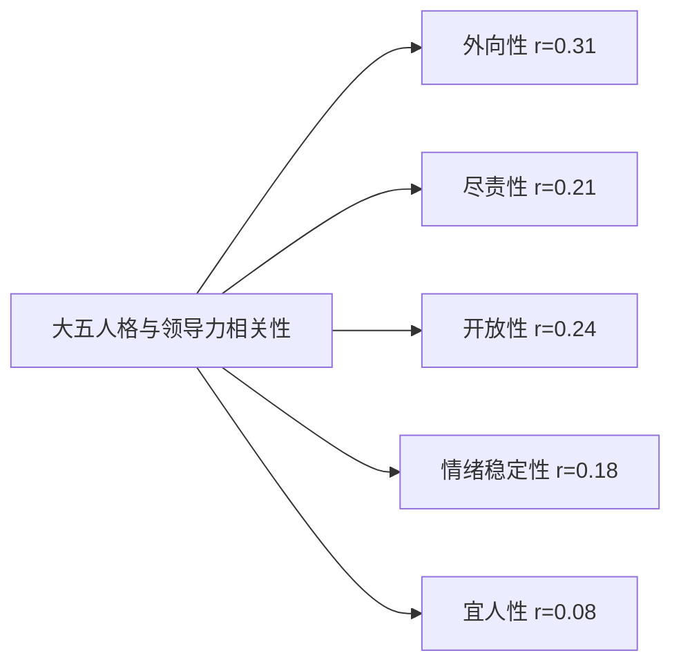
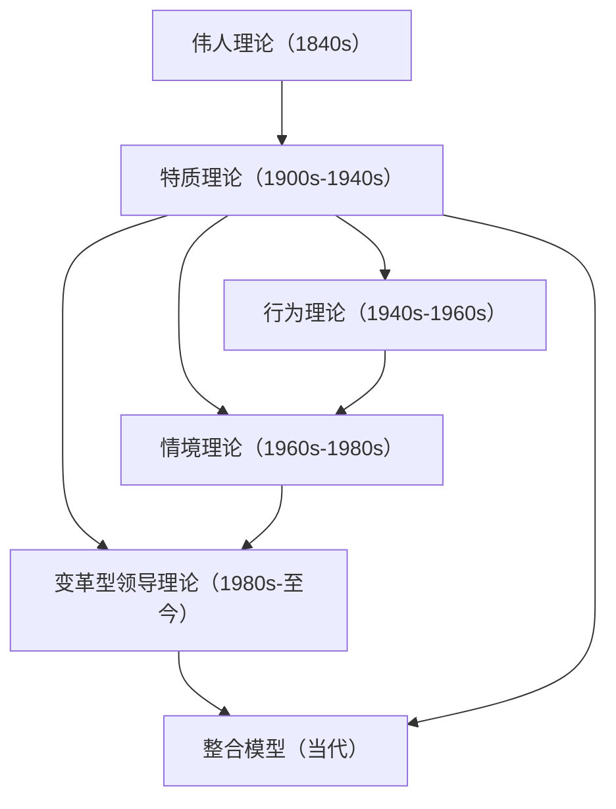

## 二、领导力特质理论（Trait Theory）

特质理论是领导力研究领域最古老的理论范式，也是每一个领导力学习者必须掌握的基础知识。它回答了一个根本性的问题：**领导者是否具备某些与众不同的个人特质？如果存在，这些特质是什么？能否后天培养？**

理解特质理论，不仅能帮助你认识领导力的底层构成要素，还能为你后续学习行为理论、情境理论、变革型领导理论等提供重要的知识基座。

### 2.1 特质理论的起源与演变

#### 2.1.1 伟人理论：特质理论的思想源头

特质理论的思想根源可以追溯到19世纪苏格兰哲学家托马斯·卡莱尔（Thomas Carlyle）。1840年，卡莱尔在其系列演讲"论历史上的英雄、英雄崇拜和英雄史诗"（*On Heroes, Hero-Worship, and the Heroic in History*）中提出了著名的"伟人理论"（Great Man Theory）。

伟人理论的核心观点：

- **历史由少数伟人创造**：文明的进步不是由普通大众推动的，而是由凯撒、拿破仑、穆罕默德、莎士比亚等少数杰出人物推动的
- **领导者天生而非后天造就**：这些伟人天生拥有某种内在的特质或使命，使他们注定成为时代的引领者
- **领导力不可复制**：普通人无法通过学习获得这些伟人的领导力，因为这些特质是与生俱来的

卡莱尔的原话极具代表性：*"世界的历史，归根结底，是在世界上工作过的伟人的历史。"*

这一理论在19世纪末至20世纪初占据主导地位，深刻影响了人们对领导力的认知。它的影响至今仍在流行文化中随处可见——当我们说"某人天生就是领导者"时，本质上就是在引用伟人理论的逻辑。

#### 2.1.2 从伟人理论到科学特质理论

20世纪初，心理学逐渐成为一门实证科学。学者们开始不满足于"伟人论"的哲学叙事，试图用科学方法系统地研究领导者的特质。这一转变的关键标志是：

| 时间节点 | 关键事件 | 意义 |
|---------|---------|------|
| 1904年 | 比奈-西蒙智力量表问世 | 使"智力"这一特质的量化测量成为可能 |
| 1920年代 | 工业心理学兴起 | 开始在企业管理情境中研究领导力特质 |
| 1930年代 | 社会测量学发展 | 莫雷诺（Moreno）等人开发了识别非正式领导者的方法 |
| 1948年 | 斯托格迪尔首次文献综述 | 标志着领导力特质研究进入系统化阶段 |
| 1974年 | 斯托格迪尔更新综述 | 修正了早期结论，引入情境变量 |
| 1990年代 | 大五人格模型成熟 | 为特质研究提供了统一的人格框架 |
| 2000年代 | 神经科学介入 | 从脑科学层面验证特质的生物学基础 |

这一演变过程的核心趋势是：**从"天命论"到"科学论"，从"宿命不可变"到"可测量、可发展"。**

#### 2.1.3 特质理论的三次范式转向

特质理论在过去一百多年中经历了三次重大范式转向：

**第一次转向：从哲学到科学（1900s-1940s）**

将"谁是领导者"的问题从哲学思辨转化为可研究的科学问题。学者们开始使用心理测量工具，对军队、企业和政府中的领导者进行系统的特质调查。

**第二次转向：从简单枚举到系统分类（1940s-1980s）**

以斯托格迪尔为代表，学者们不再满足于罗列特质清单，而是试图找到特质的分类框架，识别哪些特质在什么条件下与领导效能相关。

**第三次转向：从静态描述到动态发展（1990s至今）**

现代特质理论不再将特质视为固定不变的个人属性，而是强调特质可以通过刻意练习、经验积累和环境塑造而发展变化。这一转向极大地扩展了特质理论的实践价值。

### 2.2 核心特质研究：关键发现与权威数据

#### 2.2.1 斯托格迪尔的里程碑研究

拉尔夫·斯托格迪尔（Ralph M. Stogdill）是领导力特质研究的奠基人。他在俄亥俄州立大学进行了两次划时代的文献综述，对后续数十年的领导力研究产生了深远影响。

**1948年第一次综述**

斯托格迪尔系统梳理了1904年至1947年间发表的124项领导力特质研究，涵盖军事、教育、企业和政府等多个领域。他总结出领导者常见的六类特质：

1. **智力（Intelligence）**：高于平均水平的认知能力，包括判断力、推理能力和创造性思维。斯托格迪尔发现，领导者通常在智力测验中得分高于其追随者，但这种差异并不是压倒性的——领导者不需要是团队中最聪明的人，但需要足够的认知能力来处理复杂信息。

2. **自信（Self-Confidence）**：对自己能力、判断和决策的坚定信念。自信的领导者在不确定的环境中能够保持镇定，这种镇定会传递给团队成员，增强整个团队的信心。需要指出的是，自信与自大之间有明确的界限——自信基于对自身能力的客观评估，而自大则源于对自身能力的过度高估。

3. **决心/成就动机（Determination/Achievement Motivation）**：达成目标的强烈意愿和面对挫折时的坚持。具有高成就动机的领导者倾向于设定挑战性目标，并为达成这些目标付出持续的努力。

4. **正直/诚信（Integrity）**：言行一致的道德品质。正直是建立信任的基础，而信任是领导力的核心货币。研究一致表明，被追随者认为不诚实的领导者几乎不可能获得长期的追随。

5. **社交能力（Sociability）**：善于与人建立和维持关系的能力。领导者不是在真空中工作，他们需要与各种不同的人打交道，包括上级、下属、客户和合作伙伴。良好的社交能力使领导者能够构建广泛的人际网络。

6. **领导意愿（Willingness to Lead）**：主动承担责任、愿意站在前面的意愿。有些人虽然具备所有领导特质，但他们不愿意承担领导角色所带来的压力、责任和风险。

**1974年第二次综述**

26年后，斯托格迪尔对163项新的研究进行了第二次综述。这次综述的一个重要发现是：**没有任何单一特质能够在所有情境下预测领导效能。** 这一发现促使特质理论从"万能特质论"转向"情境匹配论"。

补充的特质包括：

- **适应性（Adaptability）**：根据环境变化灵活调整行为的能力
- **外向性（Extraversion）**：精力充沛、积极主动、善于社交
- **坚韧/抗压性（Toughness/Stress Tolerance）**：在高压环境下保持稳定表现
- **主动性（Initiative）**：不等待指令，主动识别问题并采取行动
- **责任感（Responsibility）**：对结果负责，愿意为失败承担后果

**斯托格迪尔研究的深远意义：**

斯托格迪尔的工作最重要的贡献不在于他找到了哪些特质，而在于他提出了一个关键结论：**领导力不仅取决于个人特质，还取决于个人特质与情境需求的匹配。** 这一结论为后来的情境领导理论奠定了基础。

#### 2.2.2 大五人格模型与领导力

大五人格模型（Big Five Personality Traits，也称为OCEAN模型）是当代人格心理学中最被广泛接受的分类框架。该模型由多项独立研究（包括Lewis Goldberg、Paul Costa和Robert McCrae等学者的工作）在20世纪80-90年代逐步确立。

以下详细分析每个特质与领导力的关系，以及相关的实证研究数据：

**1. 外向性（Extraversion）——与领导力相关性最强的特质**

外向性包括六个子维度：热情（Warmth）、合群性（Gregariousness）、果断性（Assertiveness）、活力（Activity level）、寻求刺激（Excitement-seeking）、积极情绪（Positive emotions）。

与领导力的关系机制：
- **可见性效应**：外向者在群体中更加显眼，更容易被识别为潜在领导者（leadership emergence）
- **社交能量**：领导工作本质上是社交密集型的，外向者在社交互动中消耗更少的能量
- **情绪感染**：外向者的积极情绪更容易传播给团队成员，提升团队士气
- **果断性**：在需要快速决策的场景中，果断性是关键优势

关键研究数据：
- Judge等（2002）在《Journal of Applied Psychology》上发表的元分析研究，综合了78项独立研究的数据，发现外向性与领导力出现的相关系数为r=0.31，与领导力效能的相关系数为r=0.15
- 外向性是大五人格中唯一在所有研究中都与领导力正相关的特质
- 但需要注意：外向性的"果断性"子维度对领导力的贡献远大于"寻求刺激"子维度

**重要反面认知**：外向性并非领导力的充分条件。亚当·格兰特（Adam Grant）等人的研究发现，在员工主动性高的团队中，内向型领导者可能比外向型领导者更有效，因为内向型领导者更善于倾听和采纳员工的建议。这一发现被称为"外向性的隐性成本"。

**2. 尽责性（Conscientiousness）——可靠性的基石**

尽责性包括六个子维度：胜任感（Competence）、条理性（Order）、责任感（Dutifulness）、成就追求（Achievement striving）、自律（Self-discipline）、审慎（Deliberation）。

与领导力的关系机制：
- **计划与执行**：尽责的领导者善于制定计划并确保执行
- **信誉建立**：说到做到的品质使追随者愿意信任并跟随
- **细节管理**：在复杂的项目管理中，尽责性确保关键细节不被遗漏
- **目标坚持**：高成就追求使领导者在面对障碍时持续前进

关键研究数据：
- 尽责性与领导力效能的相关系数约为r=0.21（Judge et al., 2002）
- 在需要稳定管理和流程控制的组织中（如制造业、金融机构），尽责性对领导效能的预测力更强
- 过高的尽责性（极端完美主义）反而可能降低领导效能，因为领导者可能陷入微观管理

**3. 开放性（Openness to Experience）——创新与变革的驱动力**

开放性包括六个子维度：想象力（Fantasy）、审美（Aesthetics）、情感丰富（Feelings）、行动多样性（Actions）、思想开放（Ideas）、价值观开放（Values）。

与领导力的关系机制：
- **战略视野**：开放性高的领导者更善于看到大局和长期趋势
- **创新推动**：在需要变革的组织中，开放性使领导者能够接受并推动新想法
- **复杂决策**：开放性与认知复杂性高度相关，使领导者能在模糊情境中做出更好的判断
- **多元包容**：开放的领导者更能接纳不同的观点和工作方式

关键研究数据：
- 开放性与变革型领导力的相关系数约为r=0.24（Judge & Bono, 2000）
- 在快速变化的行业（如科技行业），开放性对领导效能的预测力显著增强
- 开放性是唯一与领导力创新行为显著相关的特质

**4. 情绪稳定性（Emotional Stability，即低神经质）——危机中的定海神针**

情绪稳定性反映一个人在面对压力时保持情绪平衡的能力。高情绪稳定性的领导者在危机中能够保持冷静，做出理性的判断，而不是被恐惧、焦虑或愤怒所驱动。

与领导力的关系机制：
- **危机领导力**：在危机时刻，团队成员需要一个情绪稳定的锚点
- **理性决策**：情绪稳定使领导者能够避免情绪化决策
- **信任建立**：情绪不稳定的领导者会让团队成员感到不确定和不安
- **压力传递**：领导者的焦虑会像病毒一样在团队中传播

关键研究数据：
- 情绪稳定性与领导力效能的相关系数约为r=0.18（Judge et al., 2002）
- 在军事、医疗急救和危机管理等高压领域，情绪稳定性对领导效能的预测力最强
- 情绪稳定性的缺失是领导力失败最常见的原因之一

**5. 宜人性（Agreeableness）——双刃剑特质**

宜人性与其他四个特质不同，它与领导力的关系呈现倒U型曲线。

| 宜人性水平 | 对领导力的影响 | 典型表现 |
|-----------|--------------|---------|
| 过低 | 负面 | 难以建立信任，团队关系紧张，冲突频发 |
| 适中 | 最优 | 平衡关系维护与任务推进，能做出艰难决定 |
| 过高 | 负面 | 过度迁就，回避冲突，难以做不受欢迎的决策 |

关键研究发现：
- 宜人性与领导力出现的相关系数仅为r=0.08，在大五人格中最低
- 适度低宜人性（而非高宜人性）与领导效能的相关性更高
- 这可能是因为领导角色有时需要做出不受欢迎的决定、进行批评性反馈、拒绝不合理请求

**大五人格综合影响的元分析数据：**

Judge等人（2002）对大五人格与领导力的关系进行了里程碑式的元分析研究，汇总了78项独立研究、超过15,000名被试的数据。主要发现：

五个特质联合起来，可以解释领导力变异的约25%-30%。这意味着特质是领导力的重要预测因素，但远非唯一因素——剩余70%-75%的变异来自情境、经验、行为和情境-特质交互作用。

#### 2.2.3 核心领导力特质的综合图谱

除了大五人格之外，研究还识别出一系列对领导力至关重要的具体特质：

**情商（Emotional Intelligence）**

丹尼尔·戈尔曼（Daniel Goleman）在1995年出版的《情商》一书以及后续的研究中，将情商定位为领导力的"隐形竞争力"。他在《哈佛商业评论》上发表的经典文章"什么造就了领导者"（What Makes a Leader, 1998）中报告了一项对188家公司的研究，发现：

- 在高层管理岗位上，情商对卓越绩效的贡献率高达90%
- 在技术技能和认知能力相当的候选人中，情商是区分优秀领导者和普通领导者的唯一因素

情商的四个核心维度及其在领导力中的体现：

| 维度 | 定义 | 领导力表现 |
|------|------|----------|
| 自我认知（Self-Awareness） | 了解自己的情绪、优势、局限和价值观 | 知道自己的决策偏见，能在关键时刻承认不足 |
| 自我管理（Self-Management） | 控制破坏性情绪和冲动，在变化中保持适应性 | 在压力下不发脾气，对不确定性能保持镇定 |
| 社会意识（Social Awareness） | 体察他人的情绪和需求，理解组织动态 | 能读懂团队氛围，在裁员或重组时体察员工感受 |
| 关系管理（Relationship Management） | 影响、指导和激励他人，管理冲突 | 有效激励团队，化解人际冲突，建立同盟关系 |

**认知智力与实践智力**

特质理论中的"智力"维度比我们通常理解的更复杂。罗伯特·斯滕伯格（Robert Sternberg）提出了智力的三元理论，其中与领导力最相关的两种智力：

- **分析智力**：传统智商测试衡量的能力，包括逻辑推理、模式识别和问题分析。领导者需要分析智力来理解复杂问题、评估方案优劣。
- **实践智力**（又称"街头智慧"）：在真实世界中解决问题的能力，包括读懂情境、适应规则和灵活应变。研究表明，实践智力与领导效能的相关性高于分析智力。
- **创造性智力**：产生新想法、用新方式看待问题的能力。在需要变革和创新的领导情境中尤为重要。

**韧性（Resilience）**

领导力研究者越来越多地将韧性视为领导力的核心特质。韧性不是一个单一的心理状态，而是一个由三个层次构成的能力体系：

1. **复原力（Bounce Back）**：从挫折和失败中快速恢复的能力。表现为在遭遇失败后能够调整心态、重新出发，而不是陷入自我怀疑或自怜。
2. **适应力（Adapt）**：在持续变化的环境中调整策略和行为的能力。表现为面对环境剧变（如行业转型、组织重组）时能够灵活应对。
3. **成长力（Grow）**：从逆境中学习、将困难转化为成长机会的能力。表现为能够从失败中提炼经验教训，使自己变得更强。

安妮·马斯滕（Ann Masten）的研究表明，韧性并非少数人拥有的特殊能力，而是一种"普通魔法"——大多数人在获得适当的支持和资源时，都能发展出相当程度的韧性。

**道德勇气（Moral Courage）**

道德勇气是指在面对压力、反对或潜在负面后果时，仍然坚持做正确的事的勇气。它包括：

- 敢于向上级传达坏消息或不受欢迎的真相
- 敢于在集体压力下坚持个人的道德判断
- 敢于为自己的决定承担责任，尤其是在决定失败时
- 敢于挑战不公正的行为或制度，即使这可能带来个人代价

道德勇气之所以是领导力的核心特质，是因为它直接关系到信任的建立。研究表明，追随者将"诚实"和"正直"排在最受期待的领导者特质的前两位（Kouzes & Posner, 2012）。

**自我效能感（Self-Efficacy）**

阿尔伯特·班杜拉（Albert Bandura）提出的自我效能感概念，是指一个人对自己完成特定任务的能力的信念。领导自我效能感（Leadership Self-Efficacy）是指一个人对自己能够有效领导他人的信心。

研究发现：
- 领导自我效能感是预测一个人是否会主动承担领导角色的最强因子之一
- 自我效能感高的人更愿意设定挑战性目标，面对困难时更有坚持力
- 自我效能感可以通过成功经验、观察学习和言语说服来逐步建立

**内控倾向（Internal Locus of Control）**

内控倾向是指一个人相信自己能够控制和影响事件结果的信念（相对于外控倾向——认为结果由运气、命运或外部力量决定）。

具有内控倾向的领导者：
- 更倾向于主动解决问题而非抱怨环境
- 更愿意为结果承担责任
- 更善于从失败中找到可控的改进因素
- 在面对逆境时表现出更强的韧性

### 2.3 特质测量：工具与方法

了解领导力特质的理论是一回事，评估自己在这些特质上的水平是另一回事。以下是目前最常用的特质测量工具及其适用场景：

#### 2.3.1 标准化心理测量工具

| 工具名称 | 测量内容 | 适用场景 | 可靠性 |
|---------|---------|---------|--------|
| NEO-PI-R（Costa & McCrae） | 大五人格的完整测量，包括30个子维度 | 深度人格评估、高管选拔 | 极高（α>0.85） |
| BFI-2（Soto & John） | 大五人格简化版，60题 | 快速人格评估、团队工作坊 | 高（α>0.80） |
| MBTI（Myers-Briggs） | 16种人格类型 | 团队建设和沟通风格识别 | 中等（重测信度约75%） |
| EQ-i 2.0（Bar-On） | 情商五个维度 | 领导力发展项目 | 高（α>0.85） |
| ESCI（Goleman-Boyatzis） | 情商12个能力 | 360度领导力评估 | 高 |
| CPI 260 | 领导力相关人格特质 | 领导力选拔和发展 | 高 |
| Hogan Leadership Forecast | 领导力光明面和暗面特质 | 高管选拔和团队诊断 | 极高 |

**重要使用原则**：任何单一测量工具都不能完整描述一个人的领导力特质。建议结合自评和他评（如360度反馈），使用多个工具交叉验证。

#### 2.3.2 自评简易量表

以下是一个基于研究文献整理的领导力特质自评量表，适用于快速自我评估。每个项目请在1-5分之间打分（1=非常不符合，5=非常符合）：

**外向性与社交能力**
1. 在社交场合中，我通常是主动发起对话的人 [___]
2. 我能够在众人面前自信地表达自己的观点 [___]
3. 与陌生人交谈让我感到精力充沛而非疲惫 [___]

**尽责性与执行力**
4. 我会制定明确的计划，并按照计划执行 [___]
5. 即使没有外部监督，我也会完成我承诺的事 [___]
6. 我对细节有较强的关注度 [___]

**开放性与创新**
7. 我对不熟悉的想法和方法持开放态度 [___]
8. 我经常思考如何用更好的方式做事 [___]
9. 面对模糊的情况，我不会感到焦虑 [___]

**情绪稳定性**
10. 在高压环境下，我通常能保持冷静 [___]
11. 批评和负面反馈不会让我情绪崩溃 [___]
12. 面对意外变化，我能够快速调整心态 [___]

**情商与人际关系**
13. 我能够识别他人的情绪状态 [___]
14. 在冲突中，我能理解双方的立场 [___]
15. 我善于激励他人，让他们发挥最佳水平 [___]

**道德勇气与正直**
16. 即使面对压力，我也会坚持我认为正确的事 [___]
17. 我愿意为自己的错误承担责任 [___]
18. 我会坦诚地告诉他人他们不想听的真相 [___]

**评分解读**：
- 72-90分：你具备较强的领导力特质基础，重点发展薄弱环节
- 54-71分：你有中等水平的领导力特质，需要针对性地提升
- 36-53分：你有一些领导力特质，但需要系统性地发展多个维度
- 18-35分：建议从基础的自我管理能力开始逐步发展

### 2.4 特质理论的优势与局限

#### 2.4.1 核心优势

**1. 直觉性与易理解性**

特质理论的叙事方式与人们的日常经验高度吻合。人们自然地倾向于用特质来描述和解释领导力——"她天生就有领导力""他就是一个有远见的人""她的自信感染了所有人"。这种直觉上的共鸣使得特质理论在领导力培训和教练领域被广泛采用。

**2. 为领导力发展提供了明确方向**

如果领导力是由一系列特质构成的，那么提升领导力就变成了系统地培养这些特质的过程。这为领导力发展项目提供了清晰的框架：评估现状→识别差距→设计干预→跟踪进展。

**3. 大量实证研究的支持**

特质理论积累了近100年的实证研究数据。大五人格与领导力的关系已被数十项元分析研究验证，覆盖了数万名被试和多种文化背景。

**4. 跨文化适用性**

研究表明，核心领导力特质（如智力、自信、正直、外向性）在不同文化中都与领导效能正相关。虽然文化会影响特质的具体表达方式（如美国文化中自信的表现形式与日本文化中不同），但基本特质的跨文化有效性是稳固的。

#### 2.4.2 核心局限

**1. 忽略情境因素的影响**

特质理论最大的局限在于它倾向于将领导力视为脱离情境的个人属性。现实是：同一种特质在不同情境中可能产生截然不同的效果。例如，果断性在危机情境中是优势，在需要民主协商的情境中可能变成劣势。

**2. 因果关系不明确**

特质与领导力之间的因果关系是双向的：一个人可能因为具备某些特质而成为领导者，也可能因为成为领导者而在角色中发展了这些特质。现有研究很难完全分离这两种因果路径。

**3. 特质清单的不确定性**

不同研究识别出的特质清单存在差异，很难达成完全共识。例如，斯托格迪尔1948年的清单和1974年的清单就不完全一致。这给实际应用带来了困惑：到底哪些特质最重要？

**4. 宿命论倾向**

"天生领导者"的叙事可能产生负面影响：让不具备"标准"领导特质的人放弃发展领导力的机会，或者让组织在选拔领导者时过于依赖"直觉"而忽视了系统评估。

**5. 行为中介被忽视**

特质→行为→结果。特质理论关注特质→结果的直接关系，但忽略了"行为"这个关键中介变量。一个人可能具备所有理想特质，但如果他不采取正确的领导行为，这些特质也无法转化为领导效能。

### 2.5 特质理论的现代发展

现代特质理论已经远远超越了早期"特质清单"的局限，发展出了多个重要的理论方向：

#### 2.5.1 从静态到动态：特质发展观

现代特质理论的核心突破在于认识到**特质是可以发展的**。这一观点有坚实的证据支持：

- **人格可塑性研究**：Roberts等（2006）的大规模纵向研究表明，人格特质在整个成年期都会发生变化，且变化的方向通常是适应性的（变得更尽责、更情绪稳定、更宜人）
- **干预有效性研究**：Hudson和Fraley（2015）的实验研究表明，通过有意识的目标设定和行为改变，人们可以在较短时间内（16周）发生可测量的人格特质变化
- **领导力发展研究**：Day（2000）的综述表明，系统的领导力发展项目能够有效提升参与者的领导自我效能感、情商和相关人格特质

#### 2.5.2 特质-情境交互理论

现代特质理论不再将特质和情境视为独立的因素，而是强调它们之间的交互作用。核心观点是：

**特质 × 情境 = 领导效能**

具体来说：
- **特质激活理论（Trait Activation Theory, Tett & Guterman, 2000）**：特质只有在相关的情境线索被激活时才会影响行为。例如，外向性只有在社交互动频繁的情境中才会转化为领导行为。
- **情境强度理论（Situation Strength Theory, Cooper & Withey, 2009）**：在强情境（规则明确、期望清晰）中，特质对行为的影响较小；在弱情境（模糊、不确定）中，特质的影响较大。
- **互补特质理论**：领导者的特质需要与团队成员的特质互补。例如，一个高度开放的领导者在一个保守的团队中可能不是最佳匹配。

#### 2.5.3 暗面特质研究

领导力研究者越来越关注领导者人格的"暗面"——那些在正常情况下有积极作用，但在压力下可能变得具有破坏性的特质。霍根发展调查（Hogan Development Survey, HDS）识别了11种暗面特质：

| 暗面特质 | 正常表现 | 压力下的破坏性表现 |
|---------|---------|-----------------|
| 冒险倾向 | 果断、自信 | 鲁莽决策、无视风险 |
| 喜怒无常 | 高标准、追求卓越 | 情绪爆发、打压下属 |
| 完美主义 | 注重细节、高质量 | 微观管理、阻碍进展 |
| 谨慎小心 | 规避风险、三思后行 | 优柔寡断、错失机遇 |
| 多疑 | 警觉、善于发现风险 | 不信任他人、破坏合作 |
| 自大 | 自信、有存在感 | 傲慢、不听取反馈 |
| 厚脸皮 | 坚定、能承受压力 | 麻木不仁、忽视他人感受 |
| 炫耀 | 有魅力、善于表达 | 浮夸、不务实际 |
| 讨好 | 友善、善于合作 | 过度迁就、回避冲突 |
| 消极抵抗 | 服从规则、谨慎 | 拖延、被动攻击 |
| 离群 | 独立思考、专注 | 孤僻、拒绝合作 |

认识自己的暗面特质并学会管理它们，是高层领导力发展的关键内容。

#### 2.5.4 神经科学视角

21世纪以来，脑科学研究为特质理论提供了生物学层面的支撑：

- **外向性**与大脑多巴胺奖赏系统的敏感性相关。外向者的多巴胺系统对新奇刺激更敏感，这解释了他们为何更倾向于寻求社交互动。
- **情绪稳定性**与杏仁核（amygdala）的激活模式相关。情绪稳定的个体在面对威胁刺激时，杏仁核的激活程度较低，前额叶皮层的调控更强。
- **开放性**与前额叶皮层的发达程度和大脑白质完整性相关。高开放性者的神经网络连接更加多样和灵活。
- **领导自我效能感**与前额叶皮层和纹状体的协同激活相关，涉及预期、计划和奖赏处理。

这些发现并不意味着领导力特质是完全由生物学决定的——大脑具有显著的可塑性，经验、训练和环境都会改变大脑的结构和功能。但这些发现确实为特质的个体差异提供了部分解释。

### 2.6 特质培养的实操路径

特质理论最实用的价值在于为领导力发展提供了具体的方向和路径。以下是基于研究证据的特质培养方法：

#### 2.6.1 自我认知的建立

任何特质发展的起点都是准确的自我认知。没有清晰的自我认知，你就不知道应该优先发展哪些特质。

**具体方法**：

1. **多源反馈收集**：向你的上级、同事、下属和合作伙伴收集关于你领导行为的反馈。使用结构化的360度反馈工具（如ESCI或自定义问卷）。
2. **行为日志**：每天花5-10分钟记录当天的关键领导行为和决策，定期回顾分析自己的行为模式。
3. **心理测评**：完成标准化的人格和情商测评（如NEO-PI-R或EQ-i 2.0），获得客观的特质评估。
4. **找一位教练**：专业的领导力教练能够帮助你看到自己的盲点，提供更深入的自我认知。

#### 2.6.2 各特质的培养策略

**提升外向性的策略**：
- 每周设定社交目标：在会议中至少发言两次、主动与一位不太熟悉的人交谈
- 练习公开演讲：加入Toastmasters或类似的演讲练习社群
- 刻意在社交场合中制造"第一次"：参加新活动、加入新群体

**提升尽责性的策略**：
- 使用任务管理系统（如Todoist、Notion）跟踪所有承诺
- 每天开始前用10分钟制定当日计划和优先级
- 建立检查清单制度，确保关键流程不被遗漏
- 采用"两分钟法则"：能在两分钟内完成的事立即处理

**提升开放性的策略**：
- 定期阅读与你专业领域无关的书籍和文章
- 主动接触不同背景和观点的人
- 在做决策时，刻意寻找三个不同视角的信息
- 尝试"逆向思考"：为你反对的立场找到至少三个合理的论据

**提升情绪稳定性的策略**：
- 建立日常正念冥想习惯（每天10-15分钟即可）
- 学习识别自己的情绪触发器（triggers），提前制定应对方案
- 在情绪激动时使用"10秒法则"：在做出反应前暂停10秒
- 保持充足的睡眠、运动和营养——身体状态直接影响情绪稳定性

**提升情商的策略**：
- 每次重要对话后进行"情绪回顾"：对方的情绪状态是什么？我是否适当地回应了？
- 练习"情感标注"：准确识别和命名自己的情绪（不是"感觉不好"，而是"感到被忽视后的愤怒"）
- 在团队会议中练习"倾听优先"：在发表意见前先总结对方的观点
- 阅读文学小说——研究表明，阅读文学小说可以提升共情能力

**培养道德勇气的策略**：
- 明确自己的核心价值观，并写出"不可妥协"的底线清单
- 在小事上练习说"不"，逐步建立坚持立场的能力
- 提前为困难的道德对话做准备，准备具体的措辞和立场声明
- 寻找道德勇气的榜样，学习他们如何在压力下坚持原则

#### 2.6.3 90天特质发展计划模板

| 阶段 | 时间 | 重点任务 | 预期成果 |
|------|------|---------|---------|
| 评估期 | 第1-2周 | 完成心理测评和360度反馈，识别2-3个重点发展特质 | 清晰的特质发展优先级 |
| 学习期 | 第3-6周 | 阅读相关资料，参加培训，向榜样学习 | 理解特质的行为表现和发展路径 |
| 实践期 | 第7-12周 | 每天练习特定行为，每周反思进展 | 可观察的行为变化 |

### 2.7 特质理论与其他领导力理论的关系

特质理论不是孤立存在的，它与其他领导力理论之间存在清晰的继承和发展关系：

**特质理论 vs 行为理论**：行为理论认为领导力不在于"你是什么样的人"，而在于"你做了什么"。它关注可观察的领导行为（如任务导向 vs 关系导向），而非内在特质。

**特质理论 vs 情境理论**：情境理论认为没有普遍适用的"最佳"领导特质或行为，领导效能取决于领导者风格与情境需求的匹配程度。

**特质理论与变革型领导理论的融合**：现代变革型领导理论实际上在特质理论的基础上发展而来——它既关注领导者的个人特质（魅力、愿景、感召力），也关注领导者的行为（个性化关怀、智力激发）和情境因素。

**当前共识**：领导力是特质、行为和情境三者的交互作用结果。特质提供了领导力的基础原材料，行为是特质的具体表达方式，情境决定了哪些特质和行为最为关键。这种"整合观"已经成为当代领导力研究的主流范式。

### 2.8 常见误区与纠正

**误区一："领导者都是外向的人"**

现实：内向型领导者在某些情境下可能比外向型领导者更有效。亚当·格兰特的研究表明，当团队成员高度主动时，内向型领导者的倾听和支持风格能带来更好的团队绩效。比尔·盖茨、沃伦·巴菲特、蒂姆·库克都是内向型领导者的典范。

**误区二："情商比智商更重要"**

现实：戈尔曼的"情商贡献率90%"的数据经常被过度简化。这一数据仅适用于高层领导岗位，且假设候选人的技术能力和认知能力已经达到阈值。在入门级和中级管理岗位上，技术能力和认知能力的权重更大。

**误区三："特质是天生的，无法改变"**

现实：大量研究表明人格特质具有显著的可塑性。一项涵盖207项研究、超过22,000名被试的元分析（Roberts et al., 2006）表明，有意识的行为改变可以导致稳定的人格特质变化。但改变需要持续的努力和时间，不是一朝一夕的事。

**误区四："找到自己的弱点并全部弥补"**

现实：更有效的策略是"发挥优势，管理弱点"。盖洛普（Gallup）的研究表明，专注于发展优势的领导者比专注于弥补弱点的领导者表现更好。你应该知道自己的弱点并采取措施防止它们造成损害，但你的主要精力应该投入到发展和利用自己的优势上。

**误区五："按照标准特质清单去培养自己"**

现实：没有一个"放之四海而皆准"的领导力特质清单。最适合你的特质组合取决于你的行业、组织文化、团队构成和面临的具体挑战。盲目模仿他人的领导风格往往适得其反。

**误区六："有了好特质就能成为好领导者"**

现实：特质只是领导力的必要条件，不是充分条件。一个具有所有理想特质但不懂得采取正确行为、不理解情境需求的人，仍然不会是一个有效的领导者。特质需要通过正确的行为、在正确的情境中才能转化为领导效能。

### 2.9 核心要点总结

| 要点 | 说明 |
|------|------|
| 特质理论的基础 | 领导者确实具备某些共性特质，但没有任何单一特质能保证领导成功 |
| 最强预测因子 | 外向性、尽责性和开放性是与领导力相关性最强的三大特质 |
| 情商的价值 | 在高层领导岗位上，情商是区分优秀与普通领导者的关键因素 |
| 特质可发展 | 特质不是固定的，通过有意识的练习和刻意的行为改变，核心特质可以得到提升 |
| 情境匹配 | 没有"万能特质"，关键在于特质与具体情境的匹配 |
| 整合视角 | 特质、行为和情境共同决定领导效能，三者缺一不可 |
| 发挥优势 | 专注于发展优势特质比弥补弱点更有效 |
| 认识暗面 | 每个人都有"暗面特质"，在压力下需要特别警惕 |

特质理论为我们理解领导力提供了一个坚实的起点。它告诉我们，领导力不是完全神秘的天赋，而是由一系列可识别、可测量、可发展的个人特质构成的。然而，特质只是故事的一部分——在后续章节中，我们将看到行为理论、情境理论和变革型领导理论如何丰富和完善我们对领导力的理解。

***
