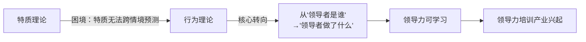
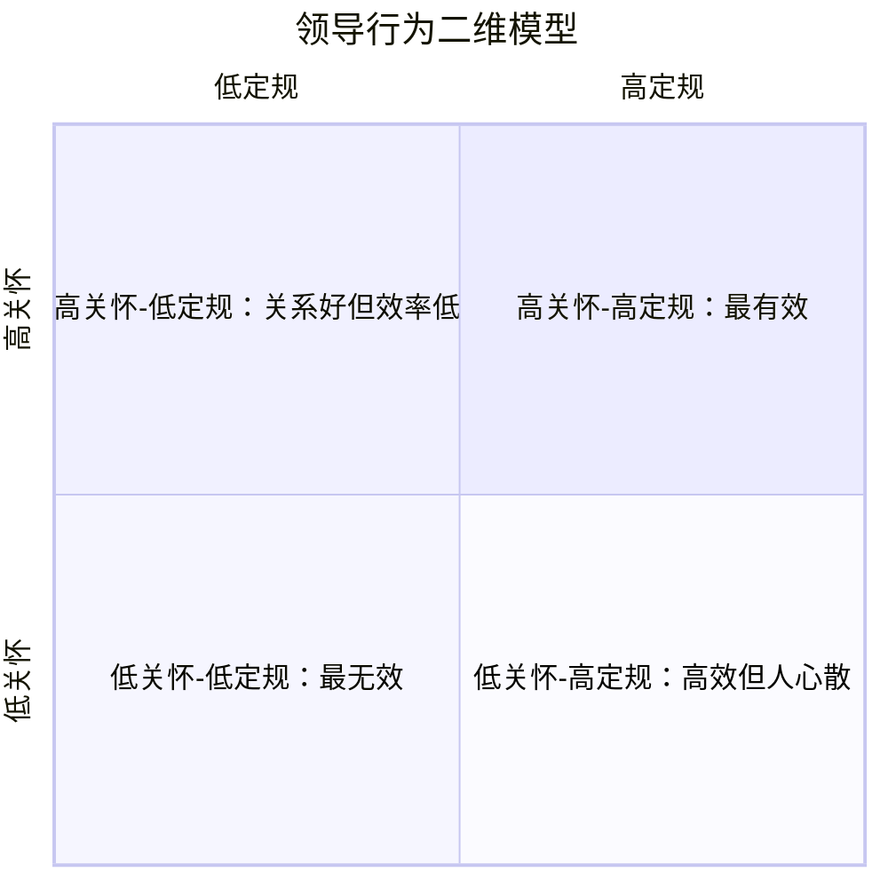
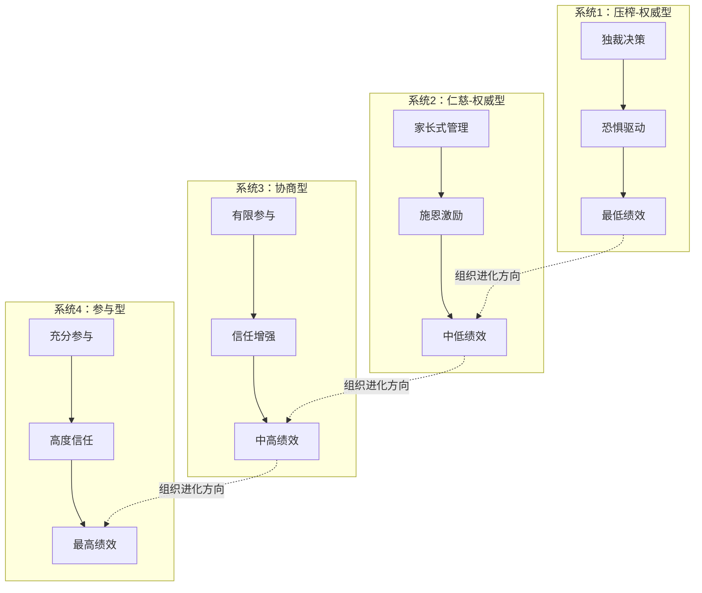
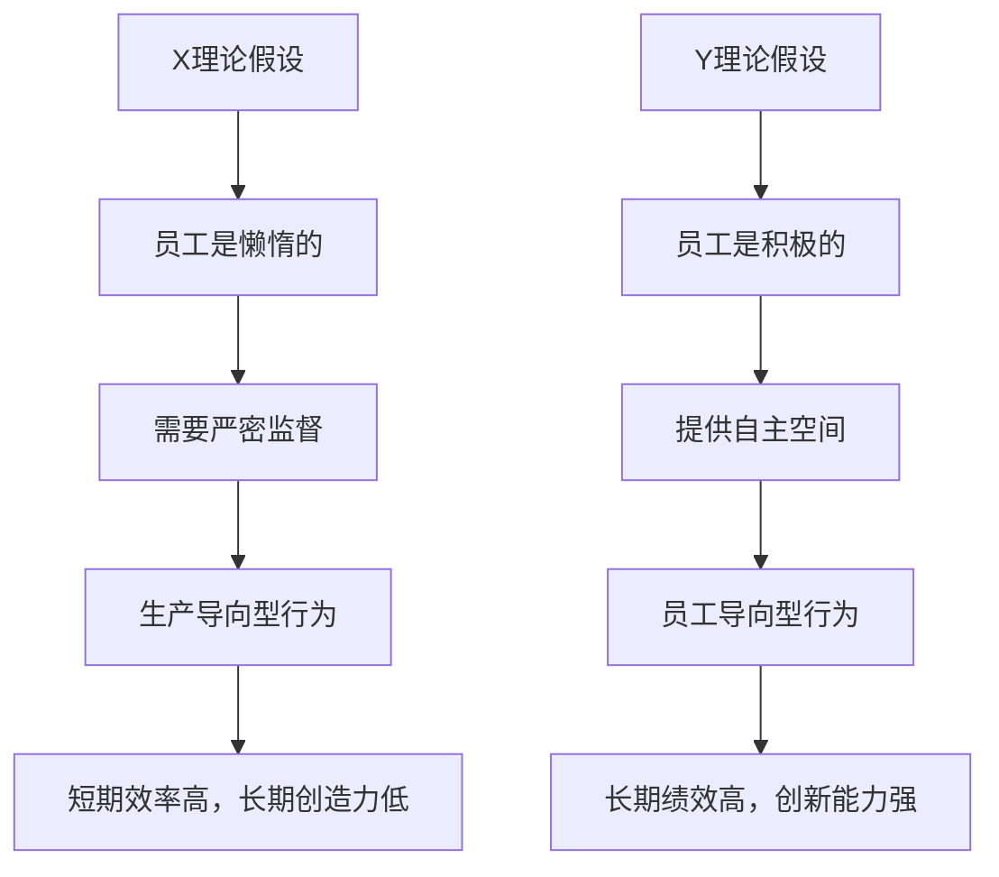
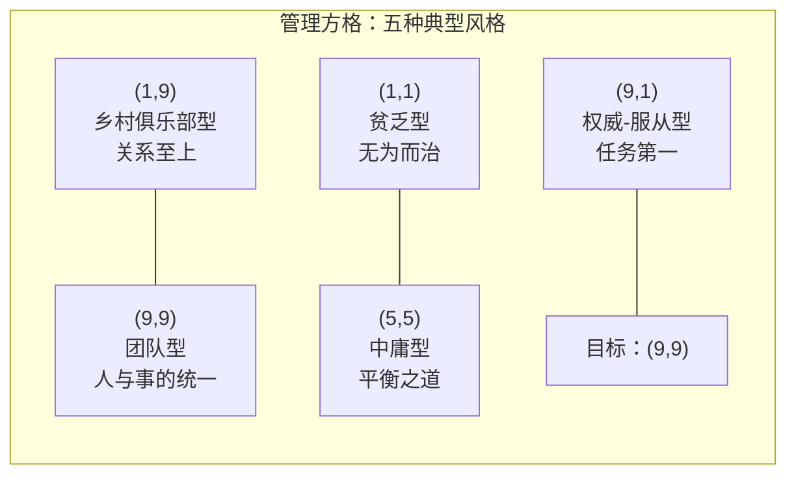

## 三、领导力行为理论（Behavioral Theory）

### 3.1 从特质到行为：领导力研究的范式转移

#### 3.1.1 特质理论的困境催生行为理论

20世纪40年代末，领导力研究面临一个尴尬的局面：历经半个世纪的"伟人研究"，学者们始终无法找到一组稳定、可靠的领导者特质。斯托格迪尔（Ralph Stogdill）在1948年发表的里程碑式综述中得出结论：**没有一组特质能够在所有情境下区分领导者与非领导者**。一个人在某个组织中表现出色，换一个组织可能就表现平平——特质本身无法解释这种变化。

这一结论彻底动摇了"领导力天生"的假设，但也带来了一个积极的转向：如果特质不是关键变量，那什么才是？

研究者们将目光从"领导者是谁"转向"领导者做什么"。这就是行为理论的核心问题意识。这一转变的逻辑非常清晰：**特质是相对稳定的，而行为是可以改变的；如果领导力的核心在于行为，那么领导力就是可以学习的**。

#### 3.1.2 行为理论的核心命题

行为理论建立在三个基本命题之上：

1. **领导力是行为而非特质**：有效的领导力体现在可观察、可描述的具体行为中，而非抽象的人格特质
2. **行为是可以学习的**：与先天的特质不同，行为可以通过培训、练习和反馈来改变
3. **存在"最优"的行为模式**：某些行为组合比其他组合更有效，找到并掌握这些模式就能提升领导力

这三个命题将领导力从"命运的馈赠"变成了"努力的结果"，为后来蓬勃发展的领导力培训产业奠定了理论基石。

### 3.2 俄亥俄州立大学研究：两大行为维度的发现

#### 3.2.1 研究背景与方法

20世纪40年代末至50年代初，俄亥俄州立大学的拉尔夫·斯托格迪尔（Ralph Stogdill）、埃德温·弗莱施曼（Edwin Fleishman）等人领导了一项大规模的领导力行为研究。这项研究的方法论在当时极为先进：

- **数据来源**：收集了军事、工业、教育等多个领域数千名领导者及其下属的问卷数据
- **测量工具**：开发了"领导者行为描述问卷"（Leader Behavior Description Questionnaire, LBDQ），由下属对领导者的行为进行评价
- **分析方法**：使用因素分析（Factor Analysis）从大量行为描述项中提取核心维度

这种"让下属描述领导者行为"的方法在当时是革命性的——它将领导力从主观印象变成了可量化测量的行为模式。

#### 3.2.2 两大维度的详细解读

因素分析的结果高度一致地提取出两个独立的维度：

**关怀维度（Consideration）**

关怀维度衡量的是领导者在多大程度上表现出对下属个人需求、感受和尊严的尊重。这不是"做好人"或"讨好下属"，而是一种建立在尊重基础上的人际行为模式。

关怀维度的典型行为包括：

| 行为类别 | 具体表现 | 反面表现 |
|---------|---------|---------|
| 倾听与尊重 | 认真听取下属意见，即使与自己不同 | 打断下属、忽视反馈 |
| 情感支持 | 在下属遇到困难时提供帮助和鼓励 | 冷漠旁观、落井下石 |
| 信任授权 | 充分信任下属的能力，给予自主空间 | 事无巨细地微管理 |
| 公平公正 | 对所有下属一视同仁，不偏不倚 | 任人唯亲、双重标准 |
| 关心发展 | 主动关注下属的职业成长和学习需求 | 只关注下属的产出 |

需要注意的是，关怀维度并不等于"不批评"。高关怀的领导者同样会给出建设性批评，但他们的批评方式是尊重人的、对事不对人的、带有发展意图的。

**定规维度（Initiating Structure）**

定规维度衡量的是领导者在多大程度上主动定义和组织工作任务、角色和目标。高定规的领导者不是被动等待问题出现，而是主动构建工作的框架和秩序。

定规维度的典型行为包括：

| 行为类别 | 具体表现 | 反面表现 |
|---------|---------|---------|
| 目标设定 | 明确定义团队目标和个人目标 | 目标模糊、朝令夕改 |
| 任务分配 | 清晰地分配职责和权限 | 职责不清、互相推诿 |
| 标准建立 | 设定明确的工作标准和质量要求 | 标准随意、因人而异 |
| 进度管控 | 定期检查工作进展，及时纠偏 | 放任不管、事后追责 |
| 决策推进 | 在必要时果断做出决定并推动执行 | 优柔寡断、议而不决 |

#### 3.2.3 二维交互模型与核心发现

俄亥俄州立大学研究最重要的发现是：关怀和定规是**两个独立的维度**，而非此消彼长的对立面。一个领导者可以同时在两个维度上都高（高关怀-高定规），也可以同时都低（低关怀-低定规），或是一高一低。

四种组合的实际效果：

| 组合 | 员工满意度 | 团队绩效 | 离职率 | 典型问题 |
|------|-----------|---------|--------|---------|
| 高关怀-高定规 | 最高 | 最高 | 最低 | 无明显短板 |
| 高关怀-低定规 | 较高 | 中等 | 较低 | 目标模糊，缺乏方向 |
| 低关怀-高定规 | 较低 | 短期高 | 高 | 人心涣散，缺乏归属感 |
| 低关怀-低定规 | 最低 | 最低 | 最高 | 团队涣散，缺乏管理 |

核心发现：**同时在两个维度上表现优秀的领导者，其团队绩效和员工满意度最高**。但研究也指出，这种"双高"组合在实际操作中难度最大，需要领导者具备很强的情境判断力和行为灵活性。

#### 3.2.4 弗莱施曼的后续深化

埃德温·弗莱施曼（Edwin Fleishman）在1953-1973年间对俄亥俄州立大学的研究进行了长达二十年的深化。他的关键贡献包括：

1. **行为的稳定性**：发现领导者的关怀和定规行为在不同时间段具有一定稳定性，但不是完全固定的——领导者可以根据情境调整
2. **上下级认知差异**：领导者自我评价的行为与下属感知到的行为之间往往存在显著差距。很多领导者自认为"高关怀"，但下属并不这样认为
3. **培训有效性**：通过行为反馈培训，领导者的关怀行为可以显著提升，而定规行为的改变相对困难——因为定规更多与组织结构和文化相关

### 3.3 密歇根大学研究：员工导向与生产导向

#### 3.3.1 研究背景

几乎在俄亥俄州立大学进行研究的同时，密歇根大学社会研究所（Institute for Social Research）在伦西斯·利克特（Rensis Likert）的领导下也在进行领导力行为研究。虽然两项研究常被相提并论，但它们的侧重点有所不同。

密歇根大学的研究更关注领导行为与组织绩效之间的因果关系，以及领导行为如何通过影响群体动力（group dynamics）来影响最终产出。

#### 3.3.2 两种导向的深入对比

**员工导向型领导（Employee-Oriented Leadership）**

员工导向型领导者将人际关系放在首位，视员工为组织最重要的资产。他们的核心信念是：**当员工感到被尊重、被关心、被信任时，他们会自动自发地投入工作**。

具体行为特征：

- 与下属建立个人化的、温暖的关系，而非纯粹的工作关系
- 关注每位下属的个人发展需求，提供个性化的指导
- 在决策过程中积极征求下属意见，让他们感到参与感
- 注重团队氛围的建设，营造相互支持的文化
- 将下属的错误视为学习机会，而非惩罚的理由
- 优先解决影响员工士气和工作满意度的问题

**生产导向型领导（Production-Oriented Leadership）**

生产导向型领导者将工作任务和目标达成放在首位，视员工为实现目标的资源。他们的核心信念是：**明确的标准、清晰的流程和严格的监督是确保产出的最佳途径**。

具体行为特征：

- 详细规划工作任务和流程，确保每个环节都有章可循
- 设定明确、可量化的绩效标准和截止日期
- 密切监督工作进展，及时纠正偏差
- 强调效率和产出，关注投入产出比
- 倾向于采用自上而下的决策方式，减少"不必要的讨论"
- 以结果作为评价下属的主要依据

#### 3.3.3 利克特的四种管理系统

利克特在密歇根大学的研究不仅区分了两种领导导向，还发展出一套完整的组织管理系统理论。他提出了四种管理系统（Systems of Organization），从最独裁到最民主排列：

| 系统 | 名称 | 领导方式 | 信任程度 | 参与程度 | 沟通方式 |
|------|------|---------|---------|---------|---------|
| 系统1 | 压榨-权威型 | 独裁、威胁 | 极低 | 无 | 单向下行 |
| 系统2 | 仁慈-权威型 | 家长式、施恩 | 低 | 极少 | 主要下行 |
| 系统3 | 协商型 | 咨询下属意见 | 中等 | 适度 | 双向但有限 |
| 系统4 | 参与型 | 民主参与、团队决策 | 高 | 充分 | 全方位开放 |

利克特认为系统4（参与型）是最有效的管理系统。他的研究数据表明，在采用系统4的组织中，员工满意度、生产力和创新能力都显著高于其他系统。

#### 3.3.4 俄亥俄州立大学与密歇根大学研究的对比

两项研究经常被混淆，但它们之间存在重要的差异：

| 对比维度 | 俄亥俄州立大学 | 密歇根大学 |
|---------|-------------|-----------|
| 维度数量 | 两个独立维度 | 两种导向（更像一个连续体） |
| 核心维度 | 关怀 vs 定规 | 员工导向 vs 生产导向 |
| 维度关系 | 独立（可同时高/低） | 趋向对立（员工导向更优） |
| 最优组合 | 高关怀-高定规 | 强烈偏向员工导向 |
| 测量工具 | LBDQ问卷 | 访谈+观察+问卷 |
| 研究视野 | 聚焦个体领导行为 | 关注组织系统和群体动力 |
| 主要贡献者 | Stogdill, Fleishman | Likert, Katz, Kahn |

一个关键的理论分歧：俄亥俄州立大学认为两个维度是独立的，可以同时追求；密歇根大学更倾向于认为领导者需要在两个导向之间做出选择，而员工导向是更优的选择。后续研究表明，俄亥俄州立大学的"双维独立"观点更为准确——只是"双高"在实践中更难实现。

### 3.4 耶鲁大学研究：领导者行为如何影响下属动机

#### 3.4.1 卡茨和卡恩的开创性工作

耶鲁大学的丹尼尔·卡茨（Daniel Katz）和罗伯特·卡恩（Robert Kahn）在20世纪50年代的研究将注意力从"领导者做了什么"转向"领导行为如何影响下属的内在动机"。

他们的核心发现是：**支持性的领导行为（而非指令性的行为）能够激发下属更高水平的内在动机和创造力**。

这一发现基于对工业组织的大量调查，具体结论包括：

1. **支持性行为与绩效**：主管的支持性行为（如尊重下属意见、提供情感支持、给予认可）与下属的生产率和工作满意度正相关
2. **指令性行为的双面性**：过于详细的指令和严格监督在标准化工作中可以提高效率，但在需要创造力的工作中会降低绩效
3. **参与式决策的效果**：让下属参与影响他们工作的决策，能够提高决策质量和执行力度

#### 3.4.2 莫尔斯和瓦格纳的修正

耶鲁大学的约翰·莫尔斯（John Morse）和杰伊·瓦格纳（Jay Wagner）在1970年代对"员工导向总是更好"的简单结论提出了修正。他们发现：

- 在**非例行性工作**（如研发、创意）中，员工导向型领导确实更有效
- 在**例行性工作**（如流水线作业、标准化服务）中，生产导向型领导同样有效甚至更有效
- 关键变量不是"哪种领导更好"，而是**领导行为与工作性质的匹配**

这一修正为后来的情境领导理论埋下了伏笔——既然没有一种行为模式永远最优，领导者就需要根据情境调整自己的行为。

### 3.5 麦格雷戈的X理论与Y理论：行为背后的假设

#### 3.5.1 两种人性假设

道格拉斯·麦格雷戈（Douglas McGregor）在1960年出版的《企业的人性面》（The Human Side of Enterprise）中提出了著名的X理论和Y理论。这不是一个领导行为理论，但它解释了**为什么不同的领导者会采用不同的行为模式**——因为他们对人性有根本不同的假设。

**X理论的假设（悲观人性观）**：

1. 人天生不喜欢工作，能逃避就逃避
2. 因此必须用强制、控制、指挥和惩罚来驱使人工作
3. 人更愿意被指挥，逃避责任，缺乏进取心
4. 安全感是人的第一需求

**Y理论的假设（乐观人性观）**：

1. 工作和休息、娱乐一样自然，人并非天生厌恶工作
2. 外部控制和惩罚不是实现目标的唯一手段——人能够自我引导和自我控制
3. 对目标的承诺取决于完成目标后的奖励——最重要的奖励是自我实现需求的满足
4. 在适当条件下，人不仅愿意承担责任，而且会主动寻求责任
5. 大多数人都有相当高的想象力和创造力来解决组织问题
6. 人的智力潜力只被部分开发利用

#### 3.5.2 两种假设如何塑造领导行为

麦格雷戈的理论之所以重要，是因为它揭示了领导行为的深层逻辑：**你的行为不是随机选择的，而是你对人性的假设的自然结果**。如果一个领导者相信员工都是"不见鞭子不走路"的，他自然会采用高监督、低信任的管理方式；如果他相信员工有内在动力，就会更多地采用授权和激励的方式。

改变领导行为的最深层方法，是改变领导者对人性的假设。这也是为什么单纯的"领导技巧培训"往往效果有限——如果底层假设不变，行为改变很难持久。

### 3.6 管理方格理论：行为组合的系统化分析

#### 3.6.1 理论框架

1964年，罗伯特·布莱克（Robert Blake）和简·莫顿（Jane Mouton）在《管理方格》（The Managerial Grid）一书中提出了一个直观而强大的领导行为分析工具。

管理方格以两个维度构建坐标系：
- **横轴：对生产的关心**（Concern for Production），从1到9
- **纵轴：对人的关心**（Concern for People），从1到9

两个维度各取9个等级，形成81种可能的组合。布莱克和莫顿重点识别了五种典型的管理风格，每种风格都有其独特的动机模式和行为特征。

#### 3.6.2 五种典型管理风格的深度剖析

**贫乏型管理（Impoverished Management）——坐标(1,1)**

- **核心特征**：对人和生产都缺乏关注，只做最低限度的工作
- **内在动机**：逃避责任、避免麻烦、"不求有功但求无过"
- **典型行为**：
  - 被动等待指示，不主动规划
  - 尽量避免冲突和决策
  - 回避与下属的深入互动
  - 对工作质量和团队状态都不关心
- **产生原因**：可能是能力不足、职业倦怠、缺乏激励、不适合管理岗位
- **实际后果**：团队士气低迷、人员流失严重、目标达成率低、组织文化消极
- **现实场景**：一个技术骨干被提拔为管理者，但对管理毫无兴趣，只是"挂名"——既不管人，也不抓事

**乡村俱乐部型管理（Country Club Management）——坐标(1,9)**

- **核心特征**：高度关注人，低度关注生产，追求和谐的人际关系
- **内在动机**：害怕被讨厌、渴望被认可、回避冲突
- **典型行为**：
  - 极力营造轻松愉快的工作氛围
  - 对下属有求必应，难以说"不"
  - 回避困难的绩效对话
  - 在任务压力面前倾向于"放松标准"
  - 花大量时间在团队建设和社交活动上
- **产生原因**：性格偏讨好型、把"被喜欢"等同于"有效领导"、缺乏任务管理能力
- **实际后果**：团队关系融洽但绩效不达标、优秀员工因缺乏挑战而离开、标准不断降低
- **现实场景**：一个"好好先生"型主管，和每个下属都关系很好，但季度目标总是完不成，年底考核时也不敢打低分

**权威-服从型管理（Authority-Compliance Management）——坐标(9,1)**

- **核心特征**：高度关注生产，低度关注人，追求效率最大化
- **内在动机**：控制欲强、认为"温情是效率的敌人"、以结果论英雄
- **典型行为**：
  - 事无巨细地安排和监督工作
  - 决策快速但不征求意见
  - 用数字和指标管理一切
  - 对"低效"和"借口"零容忍
  - 忽视员工的情感需求和个人困难
- **产生原因**：认为管理就是"要结果"、缺乏人际敏感度、曾被类似的领导方式"教育"过
- **实际后果**：短期效率高但长期问题严重——员工流失率高、创新能力弱、团队缺乏凝聚力、"上有政策下有对策"
- **现实场景**：一个销售总监每天盯报表、开晨会批人、KPI不达标就扣奖金。短期业绩冲上去了，但团队两年内换了三轮人

**团队型管理（Team Management）——坐标(9,9)**

- **核心特征**：对人和生产都高度关注，追求两者的统一而非妥协
- **内在动机**：相信"人好了事才能好"、追求长期可持续的成功
- **典型行为**：
  - 设定高标准但同时提供充分支持
  - 鼓励团队参与目标设定和决策
  - 在冲突中寻找建设性解决方案
  - 对下属既有高期望也有高关怀
  - 持续投资于团队的能力发展
- **产生原因**：对人性持乐观态度（Y理论）、经历过"人与事双赢"的成功经验、持续自我修炼
- **实际后果**：高绩效、高满意度、高创新、高留任率——这是布莱克和莫顿认定的最理想风格
- **现实场景**：一个产品总监在每个项目启动时都和团队一起讨论目标和资源分配，过程中定期1对1了解成员状态，对挑战性目标不留情面但对个人困难全力支持

**中庸型管理（Middle-of-the-Road Management）——坐标(5,5)**

- **核心特征**：对人和生产都有适度关注，在两者之间寻求平衡
- **内在动机**：不想走极端、追求"不出大问题就好"
- **典型行为**：
  - 设定合理的（但不是卓越的）目标
  - 保持适度的（但不是深入的）人际互动
  - 遇到矛盾时倾向于折中
  - 不愿意为高标准承担风险
  - 管理方式相对稳定但缺乏亮点
- **产生原因**：认为"中庸"就是"平衡"、害怕偏颇带来的风险、缺乏突破舒适区的勇气
- **实际后果**：团队稳定但缺乏活力、绩效达标但不出彩、员工不讨厌但也不特别投入
- **现实场景**：一个部门经理按部就班地完成每年的工作，团队不出大问题也没有大突破，三年后的绩效和三年前差不多

#### 3.6.3 管理方格的视觉化理解

#### 3.6.4 管理方格的自测与应用

布莱克和莫顿设计了一套自测问卷，帮助管理者识别自己的管理风格。以下是简化版的自测框架：

**请对以下10个问题进行1-9分评分（1=完全不符合，9=完全符合）：**

关于"对人的关心"：
1. 我经常与下属进行一对一的深入交流
2. 我会主动了解下属的个人需求和职业发展目标
3. 我在做决策时会认真考虑对下属的影响
4. 我会花时间调解团队成员之间的矛盾
5. 我会在下属犯错时首先考虑帮助而非惩罚

关于"对生产的关心"：
1. 我会设定明确的、有挑战性的目标
2. 我会密切跟踪项目的进度和质量
3. 我会对未达标的绩效进行直接沟通
4. 我会主动优化工作流程以提高效率
5. 我会在资源有限时果断做出取舍

**评分方法**：分别计算"人的关心"（问题1-5）和"生产关心"（问题6-10）的平均分，然后在管理方格上找到自己的位置。

### 3.7 行为理论的实践应用框架

#### 3.7.1 行为日志法：从觉察开始改变

行为理论的核心实操方法是"行为觉察"——很多领导者并不真正了解自己的日常行为模式。行为日志法（Behavioral Logging）是最有效的觉察工具。

**操作步骤**：

1. **记录期**：连续2周，每天工作结束后花10分钟填写行为日志
2. **记录内容**：今天与团队互动中，我的哪些行为体现了"关心人"？哪些体现了"关心事"？
3. **标注效果**：每个行为标注对团队的影响（正面/中性/负面）
4. **回顾分析**：每周末回顾一周的行为日志，识别模式

**行为日志模板**：

| 日期 | 场景 | 我的行为 | 维度归属 | 团队反应 | 效果评估 |
|------|------|---------|---------|---------|---------|
| 周一 | 项目评审会 | 直接指出报告中的错误，语气较重 | 高定规 | 团队沉默，写报告的人脸色不好 | 负面 |
| 周二 | 1对1谈话 | 主动询问下属的近况和职业困惑 | 高关怀 | 下属敞开心扉，谈了很多 | 正面 |
| 周三 | 进度检查 | 发现延迟后直接追问原因并给出解决方案 | 高定规-低关怀 | 下属被动接受，没有主动性 | 中性 |

#### 3.7.2 360度反馈：打破自我认知的盲区

弗莱施曼的研究早已证明，领导者的自我评价与下属的评价之间存在显著差距。360度反馈是弥合这一差距的标准工具。

**实施流程**：

1. **选择评估工具**：可以使用标准化的LBDQ问卷，或自行设计简化版问卷
2. **确定评估范围**：直属下属（主要）、同级、上级、自我
3. **匿名收集**：确保下属的反馈是匿名的，才能获得真实数据
4. **分析差距**：重点关注自我评价与下属评价的差距——差距大的领域就是盲区
5. **制定改进计划**：针对差距最大的2-3个行为领域制定具体的改进行动
6. **定期复测**：3-6个月后再次评估，检验改进效果

**关键提示**：360度反馈的核心价值不在于得分高低，而在于"自我认知与他人认知的差距"。差距越大，说明你的行为在他人眼中的效果与你以为的效果差异越大——这才是需要重点关注的。

#### 3.7.3 行为风格的自我调整策略

基于行为理论的发现，以下是四种常见领导行为困境及调整策略：

**困境一：高定规-低关怀型**
- **症状**：效率高但员工抱怨多、离职率高
- **调整策略**：
  - 每周安排至少3次15分钟的非正式交流（如一起喝咖啡、走路聊天）
  - 在给出任务指令前，先花2分钟了解对方的当前状态
  - 批评时使用"三明治法"——肯定-批评-鼓励
  - 每月做一次团队满意度匿名调研，重点关注"被尊重感"

**困境二：高关怀-低定规型**
- **症状**：关系好但目标完不成、优秀员工觉得缺乏挑战
- **调整策略**：
  - 每个季度设定3-5个明确的SMART目标，并公开承诺
  - 建立周度进度检查机制——不是监督，而是帮助团队及时发现问题
  - 学会"有温度的严格"：标准不降低，但方式更温和
  - 记住：设定高标准本身就是一种关怀——因为它帮助员工成长

**困境三：低关怀-低定规型**
- **症状**：团队涣散、自己也觉得无所事事
- **调整策略**：
  - 这通常是职业倦怠或岗位不匹配的信号，先自我诊断原因
  - 从一个维度突破：要么先抓"事"（设定目标、梳理流程），要么先抓"人"（与每个下属做一次深入1对1）
  - 寻求上级或教练的支持，获得外部视角

**困境四：想"双高"但精力不够**
- **症状**：知道两个维度都重要，但顾此失彼
- **调整策略**：
  - 不需要在同一时间对所有人在两个维度上都做到极致
  - 使用"情境差异化"：对新员工多给定规，对老员工多给关怀
  - 将"关怀"固化为制度（如固定的1对1时间、固定的反馈周期），减少临时决策的精力消耗
  - 培养团队中的"关怀大使"——授权给团队中人际敏感度高的成员

### 3.8 行为理论的关键局限与反思

行为理论是领导力研究史上的重大进步，但它也有明确的局限性：

#### 3.8.1 忽视情境因素

行为理论最大的局限是试图找到"一种最好的领导行为"。但现实中，没有一种行为模式能在所有情境下都有效。同一行为在不同情境中的效果可能截然不同：

- 高关怀在危机中可能被视为"软弱"
- 高定规在创新团队中可能被视为"僵化"
- 参与式决策在紧急情况下可能"贻误战机"
- 指令式管理在专家团队中可能被视为"不信任"

这一局限直接催生了下一章将要讨论的情境领导理论——如果行为的有效性取决于情境，那么领导者需要的不是一套固定的行为模式，而是根据情境灵活调整行为的能力。

#### 3.8.2 因果关系模糊

行为理论能够识别"什么样的行为与更好的结果相关"，但无法确定因果方向：

- 是高关怀行为导致了高绩效，还是高绩效团队的领导者有更多精力去关心人？
- 是参与式决策提高了创新，还是创新型团队天然倾向于参与式管理？

#### 3.8.3 文化偏见

行为理论的大部分研究在20世纪中叶的美国进行，其结论是否适用于其他文化存在疑问：

- 高关怀行为在集体主义文化（如中国、日本）中可能被视为理所当然而非"额外加分"
- 定规维度在权力距离较大的文化中可能表现不同——在这些文化中，明确的等级和指令是被期望的
- 参与式决策在高权力距离文化中可能被下属视为"领导缺乏决断力"

#### 3.8.4 忽视领导者-追随者互动

行为理论将领导者行为视为单向的输出，但领导力实际上是领导者与追随者之间的**双向互动过程**。同样的关怀行为，面对不同的下属，效果可能截然不同：

- 一个需要自主空间的资深员工可能把你的"关心"视为"干预"
- 一个渴望指导的新员工可能把你的"授权"视为"抛弃"

### 3.9 行为理论在当代的演化与应用

#### 3.9.1 从二元维度到多元行为模型

现代领导力研究已经超越了简单的"关心人vs关心事"二元框架，发展出更精细的行为分类：

- **变革型行为**：愿景激励、智力激发、个性化关怀、以身作则
- **交易型行为**：目标设定、奖励承诺、例外管理（主动和被动）
- **授权型行为**：权力下放、责任委托、自主空间、能力培养

这些分类将在后续章节中详细讨论，但它们的根基都在于行为理论的核心洞见：**领导力是行为，行为可以学习**。

#### 3.9.2 行为理论在领导力培训中的应用

行为理论对领导力培训产业的影响怎么强调都不为过。当今几乎所有主流的领导力培训项目都建立在行为理论的基础上：

| 培训方法 | 理论依据 | 具体做法 |
|---------|---------|---------|
| 行为示范 | 行为可观察和模仿 | 让学员观看优秀领导者的行为视频并分析 |
| 角色扮演 | 行为可练习和固化 | 模拟管理场景，让学员练习不同行为模式 |
| 行为反馈 | 认知偏差需要他人视角 | 360度反馈、同伴反馈、录像回放 |
| 行为目标设定 | 行为改变需要明确方向 | 设定具体的、可观察的行为改进目标 |
| 行为追踪 | 行为改变需要持续关注 | 定期复盘、行为日志、教练跟进 |

#### 3.9.3 从行为理论到"行为灵活性"

行为理论最重要的当代遗产不是"找到最优行为"，而是"发展行为灵活性"（Behavioral Flexibility）。这意味着：

1. **诊断能力**：能够识别当前情境需要什么类型的行为
2. **行为储备**：拥有多种行为模式可供选择
3. **切换能力**：能够在不同行为模式之间灵活切换
4. **反馈循环**：通过持续的反馈来校准自己的行为选择

这种"行为灵活性"正是连接行为理论与情境领导理论的桥梁——行为理论告诉我们"有哪些行为可以学习"，情境领导理论告诉我们"在什么时候用哪种行为"。

### 3.10 本节核心要点

1. **范式转移**：行为理论将领导力从"天生特质"转向"可学习的行为"，这是领导力研究史上最重大的转折之一
2. **两大维度**：俄亥俄州立大学发现关怀（关心人）和定规（关心事）是两个独立维度，"双高"领导者最有效
3. **两种导向**：密歇根大学区分了员工导向和生产导向，利克特提出参与型管理（系统4）最优
4. **人性假设**：麦格雷戈的X/Y理论揭示了领导行为背后的深层假设——你的行为是你对人性信念的外化
5. **管理方格**：布莱克和莫顿将行为组合系统化为五种典型风格，(9,9)团队型被认为最理想
6. **核心局限**：忽视情境因素是行为理论最大的短板，直接催生了情境领导理论
7. **实践工具**：行为日志、360度反馈、行为风格调整策略是行为理论最直接的应用
8. **当代遗产**：行为灵活性——不是找到一种最优行为，而是发展根据情境灵活切换行为的能力

***
