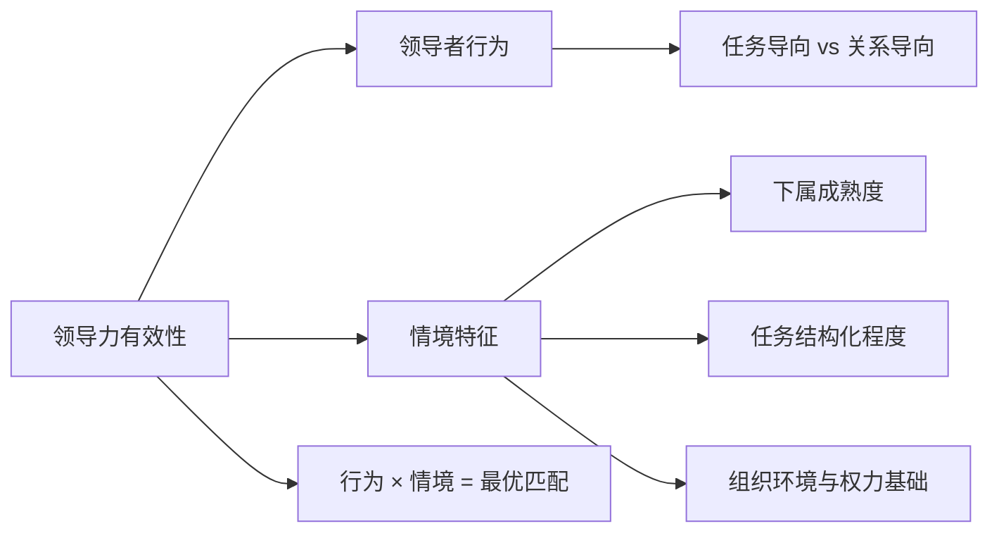
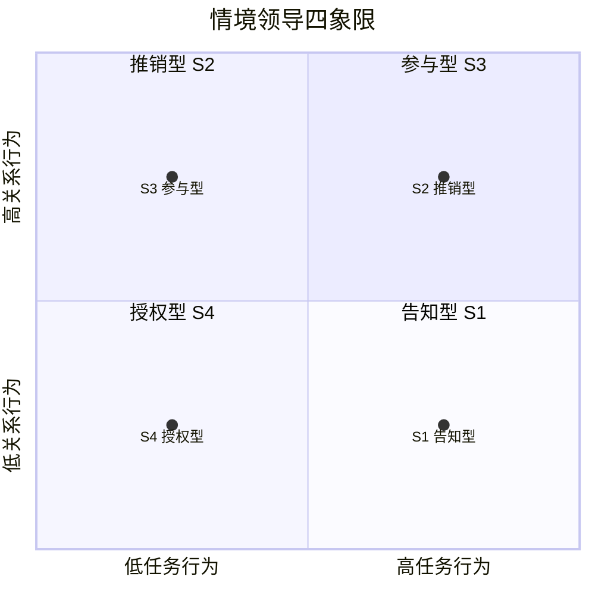
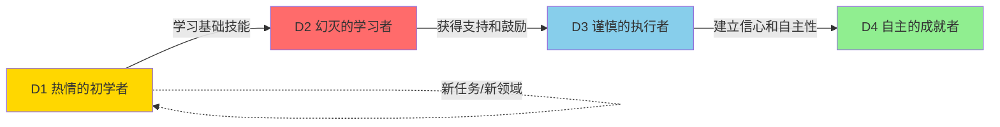
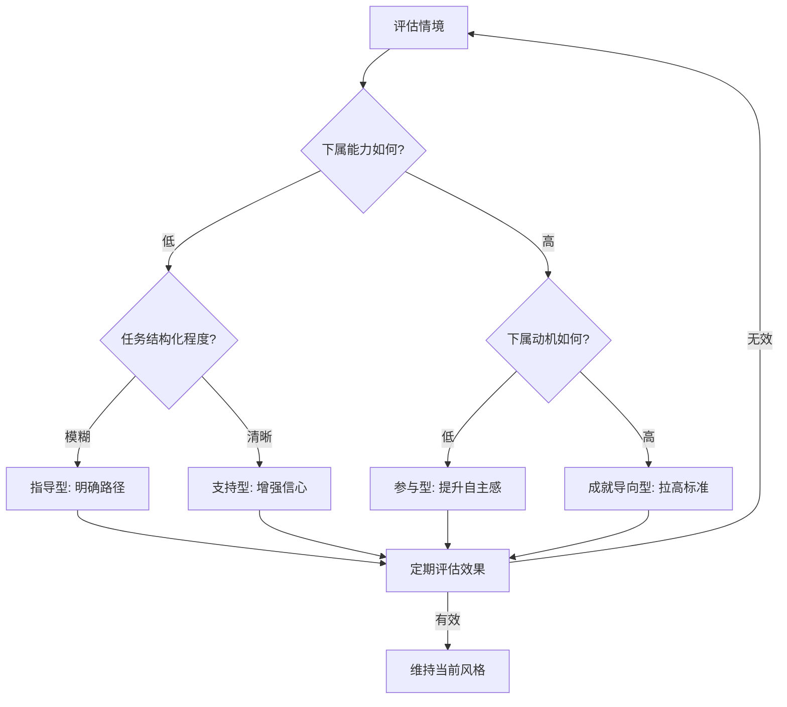
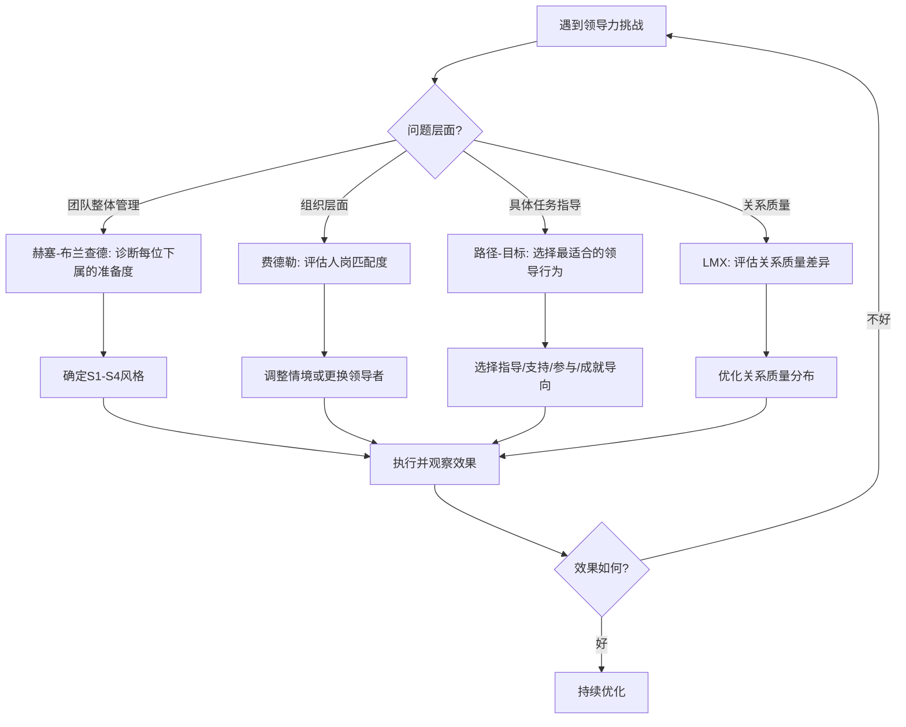

## 四、情境领导理论（Situational Leadership Theory）

### 4.1 情境领导的核心理念

#### 4.1.1 从"万能公式"到"因地制宜"

特质理论问"领导者是什么样的人"，行为理论问"领导者做了什么"，而情境领导理论问了一个更深刻的问题：**领导者在什么情况下应该怎么做？**

这个问题的提出源于一个朴素的观察——同一位领导者，在不同团队、不同任务、不同阶段下，效果天差地别。一位强势果断的部门总监，在危机时期是定海神针，在创新探索期可能变成扼杀创意的瓶颈。这不是领导者变了，而是**情境变了**。

情境领导理论的核心命题可以用一句话概括：**没有一种领导风格能适用于所有情境，有效的领导力是领导者行为与情境特征之间的动态匹配。**

#### 4.1.2 情境领导理论谱系

情境领导不是单一理论，而是一个理论家族。从1960年代至今，主要发展出以下四个核心模型：

| 模型 | 提出者 | 核心变量 | 核心主张 |
|------|--------|----------|----------|
| 权变模型 | 费德勒（1967） | 领导风格 × 情境有利性 | 改变情境去匹配风格 |
| 路径-目标理论 | 豪斯（1971） | 下属特点 × 任务特征 × 环境 | 领导者清除达成目标的障碍 |
| 情境领导模型 | 赫塞-布兰查德（1969/1977） | 下属准备度（能力+意愿） | 风格随下属成熟度调整 |
| 领导者-成员交换 | 格雷恩（1976） | 领导者与每位下属的独特关系 | 关系质量决定绩效差异 |

这四个模型并非互相矛盾，而是从不同角度回答了"情境如何影响领导有效性"这个核心问题。

---

### 4.2 赫塞-布兰查德情境领导模型（Situational Leadership II）

#### 4.2.1 模型起源与演变

1969年，保罗·赫塞（Paul Hersey）首次提出情境领导模型。1977年，赫塞与肯·布兰查德（Ken Blanchard）合著《组织行为管理》，将其系统化。1985年，布兰查德推出改进版"Situational Leadership II"（SLII），更强调下属的发展阶段。这是目前企业培训中使用最广泛的情境领导模型。

#### 4.2.2 两个核心维度

模型将领导行为分解为两个独立维度：

- **任务行为（Task Behavior）**：领导者为下属定义角色、明确任务、设定标准、安排时间表、说明"做什么、怎么做、何时做"的程度。本质是**结构化指导的强度**。
- **关系行为（Relationship Behavior）**：领导者与下属进行双向沟通、倾听意见、提供情感支持、给予鼓励和认可的程度。本质是**心理支持的强度**。

这两个维度不是此消彼长的关系，而是两个独立的连续体。一位领导者可以同时高任务、高关系（既给指导又给支持），也可以同时低任务、低关系（充分授权）。

#### 4.2.3 四种领导风格详解

**S1 告知型（Telling）—— 高任务、低关系**

领导者单向定义角色、下达指令、密切监督。沟通以"我说你做"为主，很少征求意见。

- **适用情境**：下属处于D1阶段——能力低、意愿低或不安。典型表现为新入职员工面对陌生业务，或员工被调到完全不熟悉的岗位。
- **领导行为**：明确交代"做什么、怎么做、什么时候完成"；设定清晰的检查节点；提供详细的操作规范和标准流程；以结果为导向进行考核。
- **典型场景**：新员工入职第一周的岗位培训；生产线紧急切换工艺标准时的操作指导；合规性要求极高的流程执行（如财务审计、安全检查）。
- **关键误区**：把"告知"等同于"命令"。告知型的核心是**清晰的结构化指导**，不是语气强硬。一位好的S1领导者可以用平和、耐心的语气进行详细指导。长期停留在S1会抑制下属成长意愿，导致依赖心理。

**S2 推销型（Selling）—— 高任务、高关系**

领导者既提供明确指导，也花时间解释"为什么这样做"，鼓励双向沟通，给予情感支持。

- **适用情境**：下属处于D2阶段——能力有所提升但仍然有限，热情高涨但遇到挫折后容易动摇。典型表现为入职3-6个月的员工，已经掌握基本操作，正在学习更复杂的任务。
- **领导行为**：在下达任务的同时解释背景和原因；主动询问"你觉得这样做有什么困难"；对进步给予具体表扬；在下属犯错时引导反思而非直接纠正；继续提供结构化的学习路径。
- **典型场景**：员工学习新技能（如转岗学习新系统）的初期；校招生独立负责第一个小项目；员工热情高但方法不对，需要"扶上马再送一程"。
- **关键误区**：过度指导导致"好心办坏事"。当员工已经具备基本能力时，过多的干预会传递不信任信号，打击其自主性。判断标准：如果下属开始表现出"我知道了"的不耐烦，说明可能需要转向S3。

**S3 参与型（Participating）—— 低任务、高关系**

领导者将决策权部分下放，以倾听、鼓励和共同讨论为主，减少直接指令。

- **适用情境**：下属处于D3阶段——能力强但意愿波动。原因可能是缺乏新鲜感、遭遇职业瓶颈、对团队氛围不满、或者个人生活遇到困难。
- **领导行为**：多问少说，用提问代替指令（"你觉得这个方案怎么改进"而非"你应该这样改"）；邀请参与决策过程；帮助下属看到工作的意义和价值；关注情绪变化，进行一对一深度沟通。
- **典型场景**：资深工程师工作三年后进入倦怠期；核心骨干因为晋升受挫而消极怠工；团队需要共创方案而非执行既定计划。
- **关键误区**：把"参与"等同于"放任"。S3不是不管，而是换一种方式管——从"告诉你怎么做"变成"帮你找到做的动力"。如果不解决意愿问题就减少指导，结果是能力和绩效一起下滑。必须先诊断意愿低的根源：是缺乏挑战？不公平感？职业发展受阻？还是个人生活问题？不同根因需要完全不同的干预方式。

**S4 授权型（Delegating）—— 低任务、低关系**

领导者将决策权和执行权充分下放，由下属自主管理，领导者转向监控结果和提供资源。

- **适用情境**：下属处于D4阶段——能力高、意愿高、自驱力强。典型表现为业务骨干、技术专家、成熟团队负责人。
- **领导行为**：明确"做什么"和"验收标准"，不规定"怎么做"；设定定期汇报节点（如双周同步）而非日常监督；在下属需要时提供资源和背书；关注结果和里程碑，不干预过程细节。
- **典型场景**：高级研究员独立负责一个课题方向；区域经理全权管理所辖市场的业务推进；资深项目经理带领团队完成一个成熟的产品迭代。
- **关键误区**：把"授权"等同于"放羊"。授权型领导不是消失不见，而是从"事无巨细"退到"掌控关键节点"。领导者需要：(1) 明确授权的边界——哪些决策可以自主做，哪些需要上报；(2) 建立反馈机制——定期检查进展而非年底算总账；(3) 保持可及性——当下属遇到超出能力范围的障碍时，能及时响应。

#### 4.2.4 下属准备度（Development Level）的诊断

判断下属处于哪个发展阶段，需要同时评估两个维度：

| 维度 | 低 | 高 |
|------|------|------|
| **能力（Competence）** | 缺乏完成任务所需的知识、技能和经验 | 具备完成任务所需的知识、技能和经验 |
| **意愿/承诺（Commitment）** | 缺乏信心、动力或对任务的承诺 | 有信心、有动力、愿意承担责任 |

四个发展阶段：

| 阶段 | 能力 | 意愿 | 典型画像 | 对应风格 |
|------|------|------|----------|----------|
| D1 | 低 | 高 | 热情的初学者：充满激情但缺乏经验 | S1 告知 |
| D2 | 中低 | 低 | 幻灭的学习者：发现现实比想象困难，热情消退 | S2 推销 |
| D3 | 中高 | 不稳定 | 谨慎的执行者：有能力但信心不足或动力不足 | S3 参与 |
| D4 | 高 | 高 | 自主的成就者：既有能力又有热情 | S4 授权 |

**诊断方法**：

1. **任务锚定法**：准备度是相对于具体任务而言的，不是对人的整体评价。同一个人在不同任务上可能处于不同阶段。一位资深销售在客户谈判上是D4，在数据分析上可能只是D1。
2. **行为观察法**：观察下属在具体任务上的表现，而非听其自我评价。口头说"我可以"但实际交付质量低，说明实际能力低于自我认知。
3. **360度验证**：除了直接观察，还可以参考同事反馈、过往绩效数据、项目交付记录等多源信息。

#### 4.2.5 动态调整：风格不是固定的

下属的准备度会随着学习和经验积累而变化，领导风格也需要相应调整。一条典型的成长路径：

关键洞察：
- 当员工接手**新任务**时，可能从D4回退到D1或D2，这很正常。
- 当团队面临**组织变革**（重组、战略转型）时，整个团队的准备度可能集体下滑。
- 领导者的工作是帮助下属尽快向D4移动，而不是永远待在某个风格里"舒适"。

---

### 4.3 费德勒权变模型（Fiedler's Contingency Model）

#### 4.3.1 理论基础

弗雷德·费德勒（Fred Fiedler）在1967年出版的《领导效能理论》中提出这一模型，是最早系统化研究"情境如何影响领导效果"的理论。费德勒的核心观点与赫塞-布兰查德截然不同：**领导风格是相对固定的（由人格决定），应该改变情境来匹配领导者，而不是改变领导者去适应情境。**

#### 4.3.2 领导风格的测量：LPC量表

费德勒使用"最难共事者量表"（Least Preferred Coworker, LPC）来测量领导风格。方法是让领导者用一组形容词评价自己"最不愿意共事的一位同事"：

- **高LPC分（关系导向型）**：用相对积极的词汇描述最不喜欢的同事（如"友善的""可靠的"），说明领导者能将对人的评价与对工作的评价分离。
- **低LPC分（任务导向型）**：用非常消极的词汇描述（如"不合作的""令人厌烦的"），说明领导者将对人的负面评价与工作表现挂钩。

#### 4.3.3 情境有利性的三个层次

费德勒用三个因素来评估情境对领导者有多"有利"：

| 因素 | 高（有利） | 低（不利） |
|------|----------|----------|
| **领导者-成员关系** | 信任、尊重、融洽 | 紧张、不信任、冲突 |
| **任务结构** | 目标明确、流程清晰、标准可量化 | 模糊、开放、无标准答案 |
| **职位权力** | 有正式的奖惩权、任命权、考核权 | 权力有限，需依赖影响力 |

三个因素各占"有利"或"不利"，组合出八种情境（从最有利到最不利的连续谱）。

#### 4.3.4 匹配原则

| 情境有利性 | 最有效的领导风格 | 原因 |
|-----------|----------------|------|
| 非常有利（I、II、III） | 任务导向型 | 情境本身已经很好，领导者只需高效推进任务 |
| 中等有利（IV、V、VI） | 关系导向型 | 情境存在不确定性，需要通过关系建设化解冲突、凝聚共识 |
| 非常不利（VII、VIII） | 任务导向型 | 情境极其严峻，需要强有力的结构化控制来稳定局面 |

#### 4.3.5 实践启示与局限

**实践价值**：

1. **"改变情境"而非"改变自己"**：如果你是低LPC（任务导向型）领导者但处于中等有利情境，可以通过以下方式改善情境：加强与下属的关系建设（提升关系质量）、将模糊任务分解为结构化子任务（提升任务结构）、争取更多正式授权（提升职位权力）。
2. **人岗匹配**：组织在选拔领导者时，应考虑候选人风格与岗位情境的匹配度，而非寻找"万能型"领导者。

**主要局限**：

1. LPC量表的心理测量效度一直有争议，不同研究得出的LPC分与领导风格的对应关系并不稳定。
2. 模型假设领导风格固定不变，这与后来大量研究证明的"领导行为可以学习和调整"相矛盾。
3. 八种情境分类过于简化，实际工作中的情境变量远比三个因素复杂。

---

### 4.4 路径-目标理论（Path-Goal Theory）

#### 4.4.1 理论逻辑

罗伯特·豪斯（Robert House）1971年提出、1996年修订的路径-目标理论，其命名就揭示了核心逻辑：领导者的职责是**帮助下属找到从当前位置到达成目标的最佳路径，并清除路径上的障碍**。这一理论根植于期望理论（Expectancy Theory），认为人的行为动机取决于"努力→绩效→奖励"这条链条的强度。

领导者的任务就是：
1. 让下属清楚"努力能带来什么绩效"（路径清晰化）
2. 让下属相信"绩效能带来有价值的回报"（奖励匹配）
3. 清除那些阻碍"努力→绩效"转化的障碍（资源支持、技能培训）

#### 4.4.2 四种领导行为

路径-目标理论不是将领导者分类为某一种类型，而是认为**同一位领导者应根据情境灵活切换以下四种行为**：

**指导型（Directive Leadership）**

明确告知下属期望是什么，如何完成任务，设定清晰的标准和时间表。

- **适用情境**：任务模糊不清、下属经验不足、组织缺乏明确的流程规范。
- **效果机制**：降低角色模糊性，增加下属对"努力→绩效"路径的信心。
- **具体行为**：制定详细的工作计划；明确每项任务的交付标准；定期检查进度并提供反馈。

**支持型（Supportive Leadership）**

关心下属的个人需求和福祉，营造友好、平等的工作氛围，对下属表示尊重。

- **适用情境**：任务枯燥重复、工作压力大、团队士气低落、下属遭遇挫折。
- **效果机制**：缓解工作压力带来的负面情绪，增强下属的工作满意度和归属感。
- **具体行为**：记住下属的个人情况（家庭、兴趣）；在压力期主动提供帮助；公开表扬进步和贡献；创造非正式交流机会。

**参与型（Participative Leadership）**

在决策前征求下属的意见和建议，鼓励下属参与问题解决。

- **适用情境**：下属专业能力强、任务需要创造性解决方案、决策影响下属切身利益。
- **效果机制**：增强下属的自主感和掌控感，利用团队集体智慧提升决策质量。
- **具体行为**：召开决策讨论会而非单方面通知；对下属提出的方案给予认真考虑和反馈；在最终决策中体现团队输入。

**成就导向型（Achievement-Oriented Leadership）**

设定有挑战性的目标，表达对下属能力的高期望和信心，推动持续改进。

- **适用情境**：下属能力较强但缺乏挑战感、任务需要创新突破、组织处于快速增长期。
- **效果机制**：激活下属的成就动机，让下属相信"高绩效会带来高回报"。
- **具体行为**：设定"跳一跳够得着"的目标；在下属达成目标后及时给予认可并设定更高目标；以身作则展示高标准。

#### 4.4.3 情境调节因素

路径-目标理论明确了两类调节变量：

**下属特征**：
- **能力水平**：能力越高，越不需要指导型，越能从参与型和成就导向型中获益。
- **控制点（Locus of Control）**：内控型下属（认为结果取决于自身努力）更偏好参与型；外控型下属（认为结果取决于运气或外部力量）更需要指导型。
- **成就需求**：高成就需求者对成就导向型反应最佳。

**任务与环境特征**：
- **任务结构化程度**：任务越模糊，指导型越有效；任务越清晰明确，指导型反而可能被视为微观管理。
- **任务复杂性**：复杂任务需要更多参与型行为，利用团队智慧解决问题。
- **组织文化**：强调创新的文化中，成就导向型更有效；强调稳定的官僚文化中，指导型更匹配。

#### 4.4.4 路径-目标理论的实践框架

---

### 4.5 领导者-成员交换理论（LMX Theory）

#### 4.5.1 独特的理论视角

格雷恩（George Graen）及其同事在1970年代提出的LMX理论，与前面三个模型有一个根本性的区别：**它不研究"领导者应该对所有下属采用什么风格"，而是研究"领导者与每一位下属之间形成了什么样的独特关系"。**

LMX理论的核心发现是：在任何团队中，领导者与不同下属的关系质量存在显著差异，而这种差异直接预测了下属的绩效、满意度、离职率和晋升概率。

#### 4.5.2 圈内与圈外

领导者与下属的关系可以分为两种类型：

**圈内（In-Group）—— 高质量LMX关系**

- 基于**扩展的信任和相互影响**，超越正式工作描述
- 下属愿意承担额外职责（如帮助同事、参与跨部门项目）
- 领导者给予更多自主权、更丰富的信息、更多的发展机会
- 关系以**社会交换**为基础：你帮我，我也帮你，超越合同约定

**圈外（Out-Group）—— 低质量LMX关系**

- 基于**正式的雇佣合同**，严格按工作描述行事
- 下属完成分配的任务，但很少主动承担额外职责
- 领导者给予较少的关注、信息和发展资源
- 关系以**经济交换**为基础：完成工作→获得报酬

#### 4.5.3 圈内圈外的形成机制

圈内圈外的分化不是领导者有意为之的结果，而是一个动态的、有时是无意识的过程：

1. **初始试探期**（入职前几周）：领导者通过有限接触形成初步印象，下属也在试探领导者。
2. **关系建立期**（1-3个月）：双方基于有限互动开始建立关系模式。领导者发现某些下属"好用"——积极回应、主动承担——于是给予更多机会。
3. **自我强化期**（3个月以后）：圈内成员获得更多机会→表现更好→获得更高质量的关系→获得更多机会。圈外成员获得更少机会→表现机会少→关系停滞→机会更少。

这里存在一个严重的公平性问题：圈内圈外的分化可能不是基于能力，而是基于**相似性偏好**（领导者倾向于与性格、背景、价值观相似的下属建立高质量关系）。

#### 4.5.4 LMX质量对工作结果的影响

| 结果变量 | 高质量LMX | 低质量LMX |
|---------|----------|----------|
| 工作绩效 | 高出15%-25% | 基线水平 |
| 组织公民行为 | 显著更多 | 较少 |
| 工作满意度 | 显著更高 | 较低 |
| 离职意愿 | 显著更低 | 较高（高2-3倍） |
| 晋升概率 | 更高 | 较低 |
| 获得的信息和资源 | 更丰富 | 更有限 |

#### 4.5.5 LMX理论的实践应用

**对领导者的启示**：

1. **意识到偏见的存在**：每位领导者都可能在无意中形成了圈内圈外的区分。定期自问："我给A和B的机会是否对等？"
2. **主动扩展圈内范围**：高质量的LMX关系对双方都有益。有意识地给圈外成员更多的信任、自主权和反馈机会，帮助他们进入圈内。
3. **避免"赢家通吃"**：不要把所有好项目、好机会只给圈内成员。这会造成团队内部的不公平感和士气低落。
4. **用制度保障公平**：在机会分配上建立透明的规则（如轮岗制度、项目竞标制度），减少人际关系对资源分配的影响。

**对下属的启示**：

1. **理解LMX关系需要主动建设**：不要等待领导者来"发现"你，主动展示能力、承担责任、建立信任。
2. **初期表现至关重要**：入职前几个月的表现会形成"第一印象锚定"，后续改变需要付出更多努力。
3. **如果处于圈外，不要消极等待**：主动寻求反馈，了解领导者的期望，用行动证明自己的价值。

---

### 4.6 补充模型：弗鲁姆-耶顿决策模型

#### 4.6.1 模型定位

维克多·弗鲁姆（Victor Vroom）和菲利普·耶顿（Philip Yetton）1973年提出的决策模型，是情境领导理论中**最具有操作性的诊断工具**。它不讨论领导风格的一般分类，而是直接回答一个具体问题：**面对一个具体的决策情境，领导者应该独断、咨询还是让团队共决？**

#### 4.6.2 五种决策风格

| 风格 | 代码 | 描述 | 下属参与度 |
|------|------|------|-----------|
| 独断型 | A1 | 领导者独自决策，使用已有信息 | 无 |
| 独断型 | A2 | 领导者从下属获取信息后独自决策 | 低（仅提供信息） |
| 咨询型 | C1 | 领导者与下属个别讨论后独自决策 | 中（个别咨询） |
| 咨询型 | C2 | 领导者与团队集体讨论后独自决策 | 中（集体讨论） |
| 共决型 | G2 | 领导者与团队共同决策，达成共识 | 高（共同决策） |

#### 4.6.3 决策树诊断法

弗鲁姆-耶顿模型的核心工具是一个决策树，通过回答以下七个问题来确定最适合的决策风格：

1. **质量要求**：这个决策的质量要求有多高？（高→需要更多输入）
2. **信息充分性**：你是否有足够的信息做出高质量决策？（否→需要下属信息）
3. **问题结构化**：问题是否结构清晰？（否→需要专家意见）
4. **下属承诺**：下属对决策的承诺是否对执行至关重要？（是→需要参与）
5. **领导者独断**：如果你独断决策，下属是否会承诺执行？（否→需要参与）
6. **下属目标**：下属是否认同组织目标并努力实现？（否→需要协商）
7. **冲突可能性**：下属之间是否可能对不同方案产生冲突？（是→需要集体讨论）

**使用原则**：选择满足所有情境约束的**最高参与度**风格。参与度越高，下属承诺越强，但时间成本也越高。

---

### 4.7 四大模型的综合对比与选择指南

#### 4.7.1 核心差异对比

| 维度 | 赫塞-布兰查德 | 费德勒 | 路径-目标 | LMX |
|------|-------------|--------|----------|-----|
| 关注焦点 | 下属准备度 | 情境有利性 | 下属特点×任务 | 领导者-下属关系 |
| 领导风格 | 可调整 | 相对固定 | 可调整 | 动态形成 |
| 核心行动 | 匹配下属发展阶段 | 改变情境匹配风格 | 清除目标路径障碍 | 建立高质量关系 |
| 最适用场景 | 一对一团队管理 | 组织层面的人岗匹配 | 针对具体任务和下属选择行为 | 理解团队内部动力学 |
| 实操难度 | 低（直觉友好） | 中（需LPC测量） | 中（需情境诊断） | 高（需长期观察） |

#### 4.7.2 何时使用哪个模型

- **日常团队管理**：赫塞-布兰查德模型最实用，因为它提供了直觉友好的四象限框架，新管理者也能快速上手。
- **组织设计和人岗匹配**：费德勒模型更有价值，因为它帮助组织思考"什么样的领导者放在什么位置最合适"。
- **针对具体下属和任务选择行为**：路径-目标理论最精细，因为它考虑了下属特点、任务特征和环境因素的交互作用。
- **理解团队内部动力学**：LMX理论最深刻，因为它揭示了关系质量对绩效和发展的隐性影响。

#### 4.7.3 融合应用框架

成熟的情境领导者不会只用一个模型，而是在不同层面组合使用：

---

### 4.8 实操工具箱

#### 4.8.1 下属准备度快速诊断表

在每次一对一会议或绩效评估前，用这个清单快速评估下属在当前任务上的准备度：

┌─────────────────────────────────────────────────┐
│           下属准备度诊断清单                      │
├─────────────────────────────────────────────────┤
│ 任务: _____________________                      │
│ 下属: _____________________                      │
│ 日期: _____________________                      │
├─────────────────────────────────────────────────┤
│ 【能力评估】                                      │
│ □ 是否掌握完成任务所需的知识?                      │
│ □ 是否具备完成任务所需的技能?                      │
│ □ 是否有类似任务的成功经验?                        │
│ → 能力评级: 低 / 中 / 高                          │
├─────────────────────────────────────────────────┤
│ 【意愿评估】                                      │
│ □ 对这项任务是否有热情?                            │
│ □ 是否有信心独立完成?                              │
│ □ 是否愿意承担这个责任?                            │
│ → 意愿评级: 低 / 中 / 高                          │
├─────────────────────────────────────────────────┤
│ 【匹配风格】                                      │
│ 低能力+高意愿 → S1 告知型                         │
│ 中低能力+低意愿 → S2 推销型                       │
│ 中高能力+意愿波动 → S3 参与型                     │
│ 高能力+高意愿 → S4 授权型                         │
├─────────────────────────────────────────────────┤
│ 【行动计划】                                      │
│ 1. ____________________________________          │
│ 2. ____________________________________          │
│ 3. ____________________________________          │
│ 下次评估日期: ____________                        │
└─────────────────────────────────────────────────┘

#### 4.8.2 领导风格匹配自检问题

每周花10分钟反思以下问题：

1. 本周我对每位下属的指导和支持是否与其准备度匹配？
2. 是否有下属在某个任务上已经提升了准备度，但我还在用老方式管理？
3. 是否有下属遇到了新挑战，准备度下降，需要我增加指导？
4. 我是否无意识地给某些下属（圈内）更多机会，而忽视了其他人？
5. 本周有没有哪个情境让我觉得"方式不对"？可能的原因是什么？

#### 4.8.3 风格转换的信号识别

| 信号 | 可能的含义 | 建议调整 |
|------|----------|---------|
| 下属频繁说"我知道了"但执行走样 | 你可能高估了其准备度 | 从S3/S4转向S2，增加指导 |
| 下属开始绕过你自行决策 | 你可能低估了其准备度 | 从S1/S2转向S3/S4，减少干预 |
| 下属表现出不耐烦或抵触 | 风格与准备度长期不匹配 | 一对一深度沟通，重新评估 |
| 下属主动请求更多自主权 | 准备度提升的积极信号 | 考虑上移一个级别 |
| 下属在新任务面前畏缩 | 针对该任务的准备度回退 | 按任务重新评估，回到S1或S2 |
| 团队整体士气下降 | 可能存在系统性问题 | 检查是否有圈内圈外分化、机会不均等 |

---

### 4.9 常见误区与纠正

#### 误区一：把情境领导当成"管理风格测试"

很多培训将情境领导简化为"测一下你是哪种风格的领导者"，这完全曲解了理论。情境领导的核心不是你"是什么类型"，而是你在**面对具体下属和具体任务时选择什么行为**。同一位领导者在一天之内可能对员工A使用S1，对员工B使用S3，对员工C使用S4。

**纠正**：不要给自己贴标签。把情境领导当成一个动态诊断工具，而非固定的性格分类。

#### 误区二：只看能力不看意愿

很多管理者在评估下属时只看"能不能做"，忽略了"想不想做"。能力高但意愿低的员工（D3）用S4授权，结果是放任自流、绩效下滑。

**纠正**：每次评估都强制自己分别打能力分和意愿分，找到交叉点。

#### 误区三：风格调整后不给缓冲期

有些管理者诊断完准备度后立刻切换风格，让下属感到突兀。比如从S1突然跳到S4，下属会感到"被抛弃"。

**纠正**：风格转换要渐进。从S1到S2，先增加解释和讨论；从S2到S3，先减少指令频率；从S3到S4，先延长检查间隔。给下属适应的时间。

#### 误区四：忽视LMX公平性

即使不是有意为之，很多领导者形成了事实上的圈内圈外分化。圈内成员获得所有好项目和成长机会，圈外成员被边缘化。这不仅是道德问题，也是效率问题——被低估的下属可能有巨大的未开发潜力。

**纠正**：每季度做一次"机会分配审计"——列出过去三个月的重要项目、培训机会、晋升推荐，检查是否集中在少数人身上。

#### 误区五：在危机中放弃情境判断

危机时刻，很多领导者本能地切换到"命令控制"模式（S1），对所有人一刀切。但危机对不同下属的影响不同——有些人反而在危机中更有干劲（D4），有些人需要支持和安抚（D3）而非命令。

**纠正**：即使在高压下，也要花5分钟评估每位下属的状态，而不是"全员告知型"。

---

### 4.10 进阶深度：情境领导的神经科学基础

现代神经科学研究为情境领导的有效性提供了生物学解释。

**威胁与奖励反应**：神经科学家大卫·洛克（David Rock）的SCARF模型指出，人类大脑在以下五个维度上会做出趋近或回避反应：
- **地位（Status）**：我在团队中的位置和被认可程度
- **确定性（Certainty）**：我能否预测未来会发生什么
- **自主性（Autonomy）**：我对自己的工作有多大控制权
- **关系（Relatedness）**：我与他人是否属于同一阵营
- **公平（Fairness）**：资源分配是否公平

当领导风格与下属准备度不匹配时，会触发"威胁反应"：
- 对D4使用S1告知型 → 威胁自主性和地位感 → 杏仁核激活 → 防御性行为
- 对D1使用S4授权型 → 威胁确定性 → 焦虑增加 → 决策瘫痪

**实践含义**：情境领导之所以有效，是因为它在神经层面降低了威胁反应、增强了奖励反应。正确匹配的领导风格让下属大脑处于"趋近状态"——好奇、开放、创造性思维活跃。错误匹配的风格让下属大脑处于"回避状态"——防御、焦虑、创造力枯竭。

---

### 4.11 真实案例

#### 案例一：新员工从D1到D4的成长之旅

**背景**：张明，应届毕业生，加入一家互联网公司的产品运营岗位。

**第1-2周（D1→S1）**：
- 张明充满热情，但对工作流程、工具、业务逻辑完全陌生
- 主管李华采用S1：提供详细的工作手册，每天早会明确当天任务，下午检查完成情况
- 李华确保张明知道"做什么、怎么做、做到什么标准"

**第3-8周（D2→S2）**：
- 张明掌握了基本流程，但在数据分析和用户调研上频繁碰壁，开始怀疑自己是否适合这个岗位
- 李华转为S2：继续保持结构化指导，但每周安排一次一对一谈话，分享自己入职时的困惑，讲解"为什么要这样做分析"
- 李华让张明参加小项目讨论会，让他看到前辈的工作方式

**第3-6个月（D3→S3）**：
- 张明已经能独立完成常规工作，但面对复杂项目时缺乏自信，不敢做决定
- 李华转为S3：减少日常检查频率，改为双周同步；遇到决策时先问张明"你觉得怎么做"，再给反馈
- 李华开始让张明负责一个小型独立项目，从旁观察但不干预

**第6个月以后（D4→S4）**：
- 张明已经能独立负责中型项目，交付质量稳定
- 李华转为S4：明确项目目标和验收标准后完全放手，只在周会同步进度
- 张明开始带新入职的实习生，自然成长为"小团队领导者"

#### 案例二：费德勒模型的组织应用

**背景**：一家500人规模的制造企业准备拓展东南亚市场。公司有两位候选人：
- 王总（低LPC，任务导向型）：果断、效率高，但人际关系一般
- 赵总（高LPC，关系导向型）：善于沟通、能凝聚团队，但决策偏慢

**情境分析**：
- 领导者-成员关系：未知（全新团队），不利
- 任务结构：海外市场拓展，模糊且复杂，不利
- 职位权力：外派总监权力较大，有利

**费德勒判断**：两个不利一个有利 = 情境V（中等偏低有利） → 关系导向型更有效

**决策**：选择赵总。在不确定性高的新市场，建立团队信任、与当地合作伙伴建立关系是首要任务。效率和果断可以后期培养，但关系建设能力在开拓期更为关键。

---

### 4.12 本节核心要点

1. **情境领导的核心命题**：没有万能的领导风格，有效的领导力是行为与情境的动态匹配。
2. **赫塞-布兰查德**是最实用的一对一管理工具，核心是诊断下属在具体任务上的准备度（能力×意愿），匹配四种风格（S1-S4）。
3. **费德勒模型**强调领导风格相对固定，应改变情境来匹配领导者，适用于组织层面的人岗匹配决策。
4. **路径-目标理论**是最精细的行为选择框架，帮助领导者在具体情境中选择指导、支持、参与或成就导向。
5. **LMX理论**揭示了领导者与每位下属的关系质量差异对绩效的隐性影响，提醒领导者关注公平性。
6. **弗鲁姆-耶顿模型**提供了具体的决策树工具，帮助领导者在每个决策点选择最合适的参与度。
7. **风格切换要渐进**，给下属适应期；**诊断要分别评估**能力与意愿；**公平性需要制度保障**。
8. 成熟的情境领导者不会只用一个模型，而是在不同层面（个人管理、组织设计、具体任务、关系建设）组合使用。
