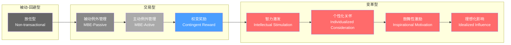
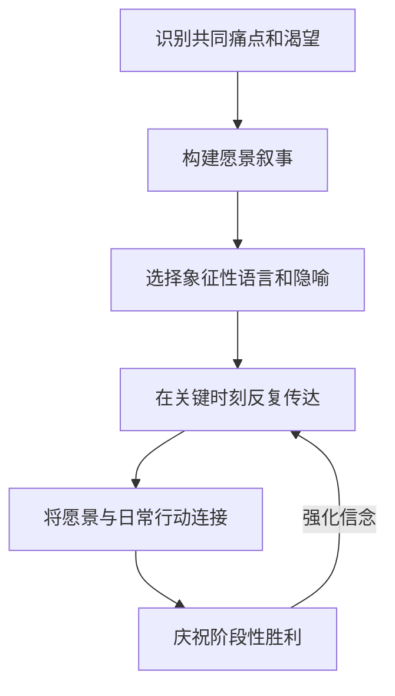
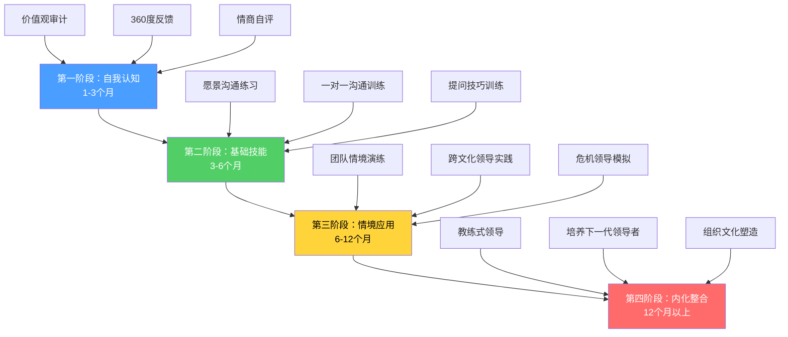

## 五、变革型领导理论（Transformational Leadership）

变革型领导理论是20世纪后半叶最具影响力的领导力理论之一。它回答了一个根本性问题：**领导者如何让追随者愿意超越自利动机，为更高层次的目标全力以赴？** 与关注"交换"的交易型领导不同，变革型领导关注的是"转化"——将追随者的动机、价值观和自我认知提升到新的层次。

### 5.1 理论起源与发展脉络

#### 5.1.1 伯恩斯的开创性贡献

1978年，政治学家詹姆斯·麦格雷戈·伯恩斯（James MacGregor Burns）在其著作《领导力》（*Leadership*）中首次提出变革型领导的概念。伯恩斯在研究甘地、罗斯福、丘吉尔等政治领袖时发现，真正伟大的领导者并非通过利益交换来驱动追随者，而是通过唤起更高层次的需求和价值来实现转化。

伯恩斯提出了领导力的两极模型：

| 维度 | 交易型领导 | 变革型领导 |
|------|-----------|-----------|
| 核心逻辑 | 利益交换 | 价值转化 |
| 动机来源 | 外在激励（奖惩） | 内在激励（使命感） |
| 领导者-追随者关系 | 买卖关系 | 导师-成长关系 |
| 目标层次 | 完成既定任务 | 超越自我、追求卓越 |
| 情感连接 | 弱（理性计算） | 强（信任与认同） |
| 典型话语 | "完成这个目标，你将获得……" | "我们一起改变这个世界" |

伯恩斯强调，变革型领导与独裁操控的根本区别在于**道德维度**——变革型领导提升的是追随者的真实需求和长远利益，而非利用他们的情绪来达到领导者个人的目的。

#### 5.1.2 巴斯的理论模型化

伯纳德·巴斯（Bernard Bass）在1985年的《领导力与超越期望的绩效》（*Leadership and Performance Beyond Expectations*）中将伯恩斯的概念转化为可测量的理论模型。巴斯的关键贡献包括：

1. **将变革型领导操作化为四个可测量维度**（即"四个I"）
2. **开发了MLQ（多因素领导力问卷）**——至今仍是领导力研究中使用最广泛的测量工具
3. **提出变革型领导与交易型领导可以共存**，而非伯恩斯所认为的两极对立
4. **建立了完整的全范围领导力模型（Full Range Leadership Model, FRLM）**

#### 5.1.3 全范围领导力模型

巴斯和阿沃利奥（Avolio）提出的全范围领导力模型包含九种领导行为风格，从最被动到最主动排列：



**关键发现**：大多数领导者倾向于使用交易型行为，变革型行为相对少见。但研究表明，最有效的领导者同时具备两种能力，并能根据情境灵活切换。

#### 5.1.4 后续重要发展

| 时期 | 学者 | 贡献 |
|------|------|------|
| 1990s | Avolio & Bass | 提出"变革型领导可以被教授和培养"，开发领导力培训方案 |
| 1996 | Podsakoff 等 | 提出变革型领导的六个维度（加入促进合作、表达期望） |
| 2001 | Bass & Avolio | 完善全范围领导力模型，增加"放任型"作为最消极的领导风格 |
| 2006 | Judge & Piccolo | 元分析：变革型领导与领导效能的相关性（r=0.44）高于交易型领导（r=0.39） |
| 2011 | Wang 等 | 元分析：变革型领导对个体绩效（r=0.26）和团队绩效（r=0.28）均有显著预测力 |
| 2017 | Banks 等 | 元分析：检验变革型领导与结果变量之间是否存在发表偏差 |

---

### 5.2 变革型领导的四个维度详解

#### 5.2.1 理想化影响（Idealized Influence）

**定义**：领导者通过自身的行为和品格成为追随者认同和模仿的榜样，赢得追随者的信任、尊重和钦佩。追随者将领导者视为"理想自我"的投射对象。

**行为层面的理想化影响**：
- 以身作则，言行高度一致
- 在困难决策面前展现勇气和担当
- 将团队和组织利益置于个人利益之上
- 展现出强烈的使命感和道德感
- 在不确定环境中展现信心和果断

**特质层面的理想化影响**：
- 高度的道德判断力
- 强烈的自我意识和一致性
- 对使命的真诚投入
- 不以权力或地位自居

**案例深度分析：任正非与华为的危机领导力**

2019年华为被列入实体清单后，任正非的一系列行为完美诠释了理想化影响。他没有表现出恐慌或退缩，而是冷静地向全世界展示了华为多年前准备的"备胎计划"。他公开表示"美国低估了华为的力量"，同时谦逊地说"我们不会让对抗发生"。这种自信与克制并存的态度，让全球18万华为员工在最困难的时刻保持了信心和凝聚力。任正非个人仅持有华为1.01%的股份，将大部分利益分享给员工，这种"利他"精神本身就是理想化影响的最强体现。

**培养理想化影响的实操方法**：

1. **价值观审计**：列出你最核心的5条价值观，然后逐条检查过去30天的行为是否与之一致。每发现一个不一致的地方，就是你需要改变的起点。
2. **公开承诺**：在团队面前公开承诺你的行为标准，并邀请团队监督。公开承诺会产生"一致性压力"，迫使你更加自律。
3. **关键时刻行为**：当团队面临困难、危机或利益冲突时，主动站出来承担责任。关键时刻的行为比日常行为的影响力大十倍。
4. **道德困境处理**：当遇到道德两难时，公开你的思考过程，而非只宣布结论。让团队看到你如何权衡原则和现实。

#### 5.2.2 鼓舞性激励（Inspirational Motivation）

**定义**：领导者通过描绘令人激动的愿景、传达高期望、使用富有感染力的语言和象征性行为来激励追随者，激发他们的热情和信心。

**鼓舞性激励的核心机制**：



**愿景构建的SVP框架**：

| 步骤 | 含义 | 示例 |
|------|------|------|
| **S**ense（意义） | 为什么这件事重要？ | "我们的工作每天影响100万人的生活" |
| **V**ision（愿景） | 成功后会是什么样子？ | "三年内成为行业客户满意度第一" |
| **P**ath（路径） | 我们如何到达那里？ | "先解决最痛的三个问题，再扩大战果" |

**案例深度分析：马丁·路德·金的修辞技术**

"我有一个梦想"演讲之所以成为人类历史上最伟大的演讲之一，不仅因为其内容，更因为其修辞结构。金博士使用了以下技巧：

1. **重复结构（Anaphora）**："I have a dream"反复出现8次，形成强烈节奏感
2. **具体意象**："在佐治亚的红色山丘上，昔日奴隶的儿子和昔日奴隶主的儿子能同坐在兄弟之桌旁"——这不是抽象的"平等"，而是活生生的画面
3. **从痛苦到希望的情感弧线**：演讲前半部分描述不公正的现实（制造张力），后半部分描绘理想的未来（提供释放）
4. **集体身份认同**：用"我们"而非"我"，让每个听众都成为愿景的一部分
5. **时间紧迫感**："现在是时候了"——不是遥远的未来，而是当下

**在商业中应用鼓舞性激励**：

| 场景 | 低效做法 | 高效做法 |
|------|---------|---------|
| 季度目标宣导 | "本季度KPI是增长20%" | "本季度我们要让10万用户第一次体验到我们的产品改变他们的工作方式" |
| 危机沟通 | "公司面临困难，大家要共渡难关" | "这是证明我们团队真正实力的时刻，当别人退缩时，正是我们前进的机会" |
| 新项目启动 | "这是一个利润可观的市场" | "我们正在做的事情，5年后会改变整个行业" |

#### 5.2.3 智力激发（Intellectual Stimulation）

**定义**：领导者鼓励追随者用新的视角看待问题，挑战旧有的假设和信念，营造鼓励创新和批判性思维的氛围。

**智力激发不同于"给答案"，而是"提出好问题"**。它不是告诉团队怎么做，而是激发团队思考为什么这么做、还有没有更好的方式。

**智力激发的四个层次**：

| 层次 | 描述 | 典型行为 |
|------|------|---------|
| **质疑假设** | 挑战"我们一直这样做"的惯性 | "如果我们从零开始设计这个流程，还会是现在这样吗？" |
| **重构问题** | 改变看待问题的框架 | "客户的真正问题不是A，而是B" |
| **鼓励实验** | 创造安全的试错环境 | "这个想法值得快速验证，我们花两周做个最小可行实验" |
| **激发跨界思考** | 引入外部视角和类比 | "医疗行业是怎么解决类似问题的？" |

**谷歌"20%时间"政策的真相**：

这个被广泛引用的案例值得更深入分析。实际上，谷歌的"20%时间"并非完全自由——它有明确的约束条件：
- 项目必须与谷歌业务有潜在关联
- 必须有可展示的成果
- 需要获得直属经理的认可

真正的价值不在于"自由时间"本身，而在于它传递的信号：**公司信任你的判断力，并愿意为你的探索承担风险**。Gmail（由Paul Buchheit在20%时间启动）、Google News、AdSense等产品确实诞生于这一政策，但更深远的影响是它塑造了谷歌的创新文化。

**然而，这一政策在2013年后逐渐式微**。随着公司规模扩大和管理层级增加，实际执行中的"20%时间"变成了"120%时间"——员工需要用额外时间做创新项目。这个教训告诉我们：智力激发需要制度保障，不能只靠口号。

**管理者实施智力激发的具体方法**：

1. **"五个为什么"练习**：当团队给出一个方案时，连续追问五个"为什么"，直到触及根本假设。
2. **预设失败分析（Pre-mortem）**：在项目开始前，假设项目已经失败，让团队分析"是什么导致了失败"。这比事后复盘更能暴露盲点。
3. **红队机制**：指定团队中的成员扮演"反对者"，专门挑战主流方案的弱点。
4. **跨行业对标**：定期组织团队研究其他行业如何解决类似问题。
5. **"如果……会怎样"情景规划**：引导团队思考极端情景——如果资源翻倍/减半？如果竞争对手做了一件出乎意料的事？

#### 5.2.4 个性化关怀（Individualized Consideration）

**定义**：领导者关注每个追随者的独特需求、能力和潜力，扮演教练和导师的角色，帮助下属实现个人成长和自我实现。

**个性化关怀的本质是"看见"**——看见每个人的独特之处，看见他们的潜力和挣扎，并给予有针对性的支持。

**个性化关怀的RAISE模型**：

| 步骤 | 含义 | 具体行动 |
|------|------|---------|
| **R**ecognize（识别） | 了解每个人的技能、动机和发展阶段 | 定期进行一对一深度对话 |
| **A**lign（对齐） | 将个人目标与团队目标连接 | 帮助成员看到"团队成功=个人成功" |
| **I**nvest（投入） | 为每个人投入有针对性的资源 | 根据发展阶段提供不同形式的支持 |
| **S**upport（支持） | 在关键时刻提供帮助 | 当成员面对挑战时，做他们的后盾 |
| **E**mpower（授权） | 逐步赋予更大的自主权 | 随着能力增长，减少干预、增加信任 |

**案例深度分析：杰克·韦尔奇的"活力曲线"与个性化关怀的矛盾**

韦尔奇在通用电气推行了著名的"活力曲线"（Vitality Curve）——每年强制淘汰绩效最差的10%员工。这个制度引发了巨大争议。但韦尔奇同时坚持每月亲自到克罗顿维尔领导力发展中心授课。他声称"培养人才是CEO最重要的工作"。

这个案例揭示了个性化关怀的一个深层矛盾：**真正的个性化关怀是否与绩效淘汰制度兼容？** 研究表明：

- **支持韦尔奇的做法**：明确的绩效标准本身就是一种关怀——它让每个人都知道自己处于什么位置，避免了"虚假的善意"
- **反对韦尔奇的做法**：强制淘汰制度创造了恐惧文化，破坏了信任基础，长期来看损害了员工的心理安全感

**平衡之道**：个性化关怀不意味着"人人满意"。真正的关怀包括帮助每个人找到最适合自己的位置——这可能意味着坦诚地告诉某人"这个岗位不适合你"，并帮助他们找到更好的选择。

**一对一沟通的STAR框架**：

Situation（情境）：最近的工作状态怎么样？有什么变化？
Task（任务）：你目前最重要的任务是什么？有阻碍吗？
Action（行动）：你打算怎么处理？需要我做什么？
Result（结果）：上次讨论的行动项进展如何？

**每周至少一次30分钟的一对一沟通**，是践行个性化关怀的最低频率。这不是"进度汇报会"，而是以对方为中心的对话。

---

### 5.3 交易型领导与变革型领导的深度对比

#### 5.3.1 交易型领导的两个子维度

**权变奖励（Contingent Reward）**：

权变奖励是交易型领导中最有效的形式。其核心是建立清晰的"承诺-兑现"循环：
- 领导者明确期望和标准
- 追随者达成目标后获得承诺的奖励
- 未达成则面临预设的后果

权变奖励有效的前提是：目标可衡量、奖励有吸引力、承诺可信赖。一旦这三个条件中的任何一个不满足，权变奖励的效果就会大幅下降。

**例外管理（Management by Exception）**：

| 类型 | 行为特征 | 效果 | 适用场景 |
|------|---------|------|---------|
| 主动型 | 持续监控绩效，提前预警，在问题发生前干预 | 较好——预防胜于纠正 | 高风险任务、新团队成员 |
| 被动型 | 只在出现问题后才介入 | 较差——亡羊补牢 | 低风险、高度自主的成熟团队 |

#### 5.3.2 互补而非对立

巴斯最重要的贡献之一是修正了伯恩斯的"两极"观点，提出变革型领导与交易型领导是**互补的**：

```mermaid
graph TD
    subgraph 基础层：交易型领导
        A[明确目标和期望] --> B[提供必要资源]
        B --> C[监控进度和质量]
        C --> D[兑现奖惩承诺]
    end
    subgraph 提升层：变革型领导
        E[激发内在动机] --> F[培养自主领导力]
        F --> G[推动持续创新]
        G --> H[实现超越性目标]
    end
    D -->|建立信任基础| E
    style A fill:#4a9eff,color:#fff
    style B fill:#4a9eff,color:#fff
    style C fill:#4a9eff,color:#fff
    style D fill:#4a9eff,color:#fff
    style E fill:#ff6b6b,color:#fff
    style F fill:#ff6b6b,color:#fff
    style G fill:#ff6b6b,color:#fff
    style H fill:#ff6b6b,color:#fff
```

**实践原则**：没有交易型领导做基础，变革型领导就是空中楼阁；只有交易型领导而没有变革型领导，组织就会停滞不前。

#### 5.3.3 情境适配

不同情境下两种领导风格的有效性不同：

| 情境 | 更有效的风格 | 原因 |
|------|-------------|------|
| 组织稳定期、日常运营 | 交易型为主 | 流程标准化、目标明确 |
| 组织危机期 | 变革型为主 | 需要凝聚人心、快速应变 |
| 创新驱动型团队 | 变革型为主 | 需要激发创造力和主动性 |
| 新团队组建初期 | 交易型为主 | 需要建立规则和信任 |
| 组织转型期 | 变革型为主 | 需要打破旧有模式、建立新愿景 |
| 高度自主的成熟团队 | 变革型为主 | 团队已具备自我管理能力，需要方向感 |

---

### 5.4 变革型领导的效果与实证证据

#### 5.4.1 核心研究发现

基于数十个国家、数千个组织的大量实证研究，变革型领导与以下积极结果显著相关：

| 结果变量 | 效应量 | 研究来源 |
|---------|--------|---------|
| 员工满意度 | r=0.40-0.60 | Judge & Piccolo, 2004 |
| 组织承诺 | r=0.35-0.50 | Wang et al., 2011 |
| 任务绩效 | r=0.20-0.30 | Wang et al., 2011 |
| 组织公民行为 | r=0.25-0.35 | Podsakoff et al., 2006 |
| 创新行为 | r=0.30-0.45 | Shin & Zhou, 2003 |
| 团队效能 | r=0.25-0.35 | Judge & Piccolo, 2004 |
| 下属创造力 | r=0.30-0.40 | Gumusluoglu & Ilsev, 2009 |
| 离职意向 | r=-0.25-0.35 | Hetland et al., 2007 |

**注意**：效应量r在0.10-0.30之间为小到中等，0.30-0.50为中到大。变革型领导的效应量整体处于中到大水平，这在社会科学中是相当显著的。

#### 5.4.2 作用机制

变革型领导通过以下中介机制影响结果：

1. **提升自我效能感**：变革型领导通过高期望和信心传递，提升追随者对自身能力的信念。"你比你想象的更有能力"——这句话从一个你信任的领导口中说出，会产生巨大的力量。

2. **激发内在动机**：当工作与个人价值观和使命感连接时，外在激励变得次要。变革型领导帮助追随者找到工作的意义感。

3. **增强心理授权**：变革型领导让追随者感到自己有能力、有影响力、有自主权。这种"被授权"的感觉是高水平绩效的重要驱动力。

4. **创造集体身份认同**：变革型领导帮助团队成员形成"我们"的意识，而非"我"的意识。当个人身份与团队身份融合时，团队合作和公民行为自然涌现。

5. **提升积极情绪**：变革型领导的鼓舞性激励和理想化影响能够创造积极的情感氛围，而积极情绪已被广泛证明能够提升创造力、决策质量和人际关系。

#### 5.4.3 "魅力归因"的调节效应

一个重要的调节变量是追随者对领导者"魅力"的感知。研究发现，当追随者将领导者的变革行为归因于领导者的个人魅力时（而非刻意的管理技巧），变革型领导的效果更强。这提出了一个悖论：**变革型领导是否可以被"训练"出来，还是它必须是"真诚"的？**

研究表明，答案介于两者之间：
- **可以学习的**：愿景沟通技巧、倾听能力、个性化关怀的行为模式
- **难以模仿的**：真诚的道德信念、对使命的真实投入、内在的信心
- **关键启示**：技术可以学习，但真诚无法伪装。那些试图"表演"变革型领导的人，长期来看会被识破。

---

### 5.5 变革型领导的发展路径

#### 5.5.1 自我评估：你在哪个阶段？

使用以下自评量表，对自己在变革型领导四个维度上的表现进行评估（1=很少如此，5=总是如此）：

**理想化影响**：
1. 我的行为与我宣称的价值观高度一致 [1-5]
2. 在利益冲突面前，我会优先考虑团队利益 [1-5]
3. 团队成员因为信任我而愿意承担风险 [1-5]
4. 我在困难时刻能保持冷静和信心 [1-5]

**鼓舞性激励**：
1. 我能清晰地描述团队的愿景和方向 [1-5]
2. 我能用语言和行动激发团队的热情 [1-5]
3. 团队成员理解并认同"我们为什么做这件事" [1-5]
4. 在挫折面前，我能帮助团队看到希望 [1-5]

**智力激发**：
1. 我鼓励团队成员质疑现有做法 [1-5]
2. 我欢迎不同的观点和建议 [1-5]
3. 我将失败视为学习机会而非惩罚理由 [1-5]
4. 我帮助团队从新的角度看问题 [1-5]

**个性化关怀**：
1. 我了解每个团队成员的职业目标 [1-5]
2. 我定期与团队成员进行一对一深度对话 [1-5]
3. 我能根据每个人的特点调整沟通方式 [1-5]
4. 我帮助团队成员识别和发展他们的优势 [1-5]

**评分解读**：16-20=该维度是你的强项；12-15=该维度有提升空间；8-11=该维度是你的短板，需要优先发展；4-7=该维度需要系统性改进。

#### 5.5.2 四维度发展路线图



**第一阶段：自我认知（1-3个月）**

- **价值观审计**：写下你最核心的5条价值观，然后对过去30天的行为进行逐条审视。使用日记或周记记录关键时刻的决策，分析其背后的价值驱动。
- **360度反馈**：收集上级、同事、下属对你的领导行为的真实反馈。重点关注：他们是否认为你"言行一致"？他们是否感到被你"看见"？
- **情商自评**：使用Goleman的情商四维度模型（自我意识、自我管理、社会意识、关系管理）进行评估。

**第二阶段：基础技能训练（3-6个月）**

- **愿景沟通练习**：为你的团队写一段1分钟的愿景陈述，然后反复修改直到它既清晰又鼓舞人心。在团队会议上练习传达。
- **一对一沟通训练**：学习并实践"STAR框架"，每周至少进行一次高质量的一对一对话。
- **提问技巧训练**：练习"五个为什么"、"如果我们从零开始"、"还有什么可能性"等启发性提问。

**第三阶段：情境应用（6-12个月）**

- 在不同的团队情境中应用变革型领导行为
- 学习如何根据团队成熟度调整领导风格
- 在危机和变革情境中练习变革型领导
- 寻求导师或教练的指导

**第四阶段：内化整合（12个月以上）**

- 变革型领导行为成为自然反应
- 开始培养他人的领导能力
- 参与组织文化和制度建设
- 持续学习和自我更新

#### 5.5.3 每周行动清单

| 日期 | 行动 | 对应维度 |
|------|------|---------|
| 周一 | 向团队传达本周重点和意义感 | 鼓舞性激励 |
| 周二 | 与一位团队成员进行一对一沟通 | 个性化关怀 |
| 周三 | 在会议上提出一个挑战性问题 | 智力激发 |
| 周四 | 做一件与你的价值观一致的事并公开分享 | 理想化影响 |
| 周五 | 给予一位团队成员具体的正向反馈 | 个性化关怀 |
| 周末 | 反思本周领导行为，记录到领导力日志 | 自我认知 |

---

### 5.6 理论局限与批判性审视

#### 5.6.1 主要批评

1. **"英雄领导"的偏见**：变革型领导理论过度强调个人领导者的作用，忽视了分布式领导和团队领导的现实。在现代组织中，领导力往往是分散在多人和多个层级中的。

2. **文化适用性问题**：变革型领导理论主要在西方背景下发展和验证。在高权力距离文化（如东亚、中东），追随者对领导者的期望可能不同。例如，在中国文化中，变革型领导的"个性化关怀"维度的效果尤为突出，而"智力激发"（鼓励挑战权威）可能需要更微妙的表达方式。

3. **测量工具的争议**：MLQ问卷的因子结构在不同研究中结果不一致。有学者质疑四个维度是否真的独立，还是只反映了"整体领导效能"这一个因素。

4. **"伪变革型领导"的风险**：变革型领导强调魅力和愿景，这为自恋型领导者提供了伪装的机会。他们可能使用变革型领导的"技巧"来操纵追随者，而非真正为追随者的利益服务。历史上的希特勒也被某些分析者描述为"变革型领导者"——这个类比提醒我们，**变革型领导必须有道德约束**。

5. **忽视情境因素**：变革型领导理论在一定程度上忽视了组织结构、行业特征、市场环境等情境因素对领导效果的调节作用。

#### 5.6.2 与伪变革型领导的区分

| 特征 | 真正的变革型领导 | 伪变革型领导 |
|------|----------------|-------------|
| 愿景来源 | 基于真实使命和价值观 | 服务于个人权力欲 |
| 对待批评 | 欢迎质疑和挑战 | 压制不同声音 |
| 权力使用 | 为集体利益 | 为个人利益 |
| 一致性 | 私下与公开表现一致 | 人前人后判若两人 |
| 培养他人 | 真心希望追随者成长 | 担心追随者超越自己 |
| 承认错误 | 坦然承认并改正 | 推卸责任或美化错误 |
| 长期效果 | 追随者变得更加独立和自信 | 追随者变得越来越依赖 |

---

### 5.7 变革型领导在不同场景中的应用

#### 5.7.1 初创企业

初创企业中，创始人通常就是变革型领导的原型。但需要注意：
- **早期**：理想化影响和鼓舞性激励最为关键——你需要吸引人才加入一个前途未卜的事业
- **成长期**：智力激发变得重要——需要建立创新文化来应对竞争
- **成熟期**：个性化关怀成为关键——需要留住人才并帮助他们持续成长

#### 5.7.2 传统企业转型

在传统企业推动变革时，变革型领导面临独特挑战：
- **阻力更大**：员工习惯了稳定的环境，对变革天然抗拒
- **需要更多耐心**：不能期望一次演讲就改变所有人
- **关键策略**：先在小范围建立"变革示范区"，用实际成果说服更多人

#### 5.7.3 跨文化团队

| 文化维度 | 高权力距离文化 | 低权力距离文化 |
|---------|---------------|---------------|
| 理想化影响 | 领导者需要展现更多权威和能力 | 平等和亲和力更重要 |
| 鼓舞性激励 | 集体目标比个人目标更有效 | 个人成长和自我实现更有吸引力 |
| 智力激发 | 需要更委婉地表达挑战 | 直接质疑是被接受的 |
| 个性化关怀 | 关系建设需要更多时间和仪式 | 效率和直接沟通更受欢迎 |

#### 5.7.4 虚拟团队

远程工作时代，变革型领导面临新的挑战：
- **缺乏面对面互动**：理想化影响和个性化关怀更难通过视频会议传递
- **应对策略**：增加一对一视频沟通频率；通过文字传达愿景（写给团队的信）；创造虚拟团建仪式；用透明的决策过程建立信任

---

### 5.8 常见误区与纠正

| 误区 | 纠正 |
|------|------|
| "变革型领导就是做有魅力的演讲" | 魅力只是表象，核心是价值观和行为的一致性 |
| "变革型领导不需要关注日常管理" | 交易型领导是基础，没有它变革型领导就是空中楼阁 |
| "变革型领导是天生的，学不会" | 研究明确证明变革型领导行为可以通过培训发展 |
| "变革型领导意味着永远乐观" | 真正的变革型领导敢于面对现实，包括坏消息 |
| "每个领导者都必须成为变革型领导者" | 最有效的领导者能根据情境灵活切换风格 |
| "变革型领导等于民主管理" | 变革型领导者可以在必要时做出果断决策，关键是让团队理解决策背后的价值观 |
| "有了变革型领导就不需要制度" | 文化和制度是互补的，好的制度能放大领导力的效果 |

---

### 5.9 进阶：变革型领导与仆人式领导的融合

近年来，学术界越来越关注变革型领导与仆人式领导（Servant Leadership）的融合。两者的核心差异在于：

| 维度 | 变革型领导 | 仆人式领导 |
|------|-----------|-----------|
| 核心动机 | 通过追随者实现组织目标 | 通过服务追随者实现他们的成长 |
| 权力观 | 领导者有责任引领方向 | 领导者的首要职责是服务 |
| 关注焦点 | 愿景和使命 | 追随者的需求和福祉 |
| 衡量标准 | 组织绩效和变革成果 | 追随者的成长和满足感 |

**融合观点**：最高境界的领导力既是变革型的（有愿景、能激励）也是仆人式的（以追随者的成长为己任）。这种"仆人式变革领导"在21世纪的知识型组织中越来越有效。

**实践路径**：在变革型领导的四个维度基础上，加入仆人式领导的核心实践——**将追随者的成功视为自己的首要目标**。当你真心希望团队成员成长并超越你时，变革型领导的四个维度会自然而然地展现出来。

---

### 5.10 本节核心要点回顾

1. 变革型领导理论由伯恩斯提出、巴斯发展，核心是通过"四个I"将追随者的动机提升到更高层次
2. 理想化影响靠言行一致建立信任；鼓舞性激励靠愿景激发热情；智力激发靠提问突破思维；个性化关怀靠关注实现成长
3. 变革型领导与交易型领导是互补的——交易型是基础，变革型是提升
4. 大量实证研究证明变革型领导对员工满意度、绩效、创新和组织承诺有显著正向影响
5. 变革型领导可以学习和发展，但需要真诚作为根基——技术可以学习，真诚无法伪装
6. 需要警惕"伪变革型领导"——用变革型技巧包装自利动机的领导者
7. 在不同文化、不同情境中，变革型领导需要灵活适配
