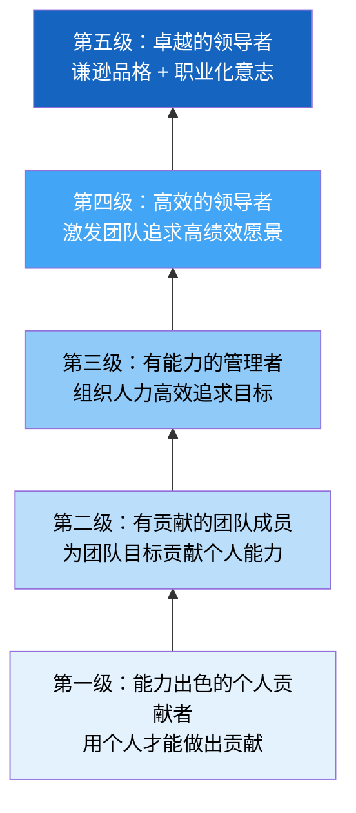
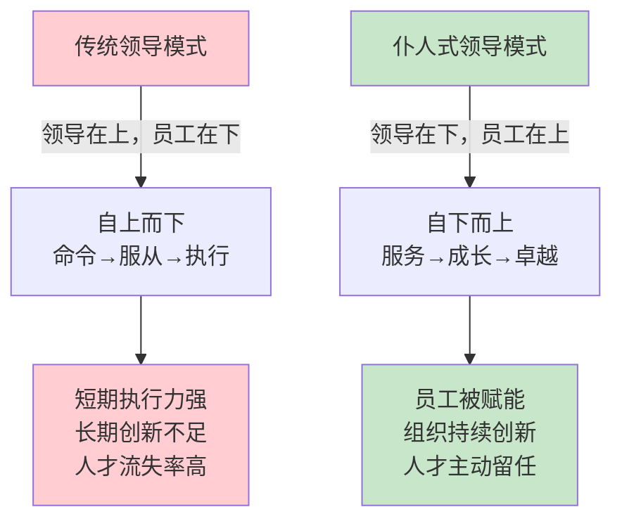
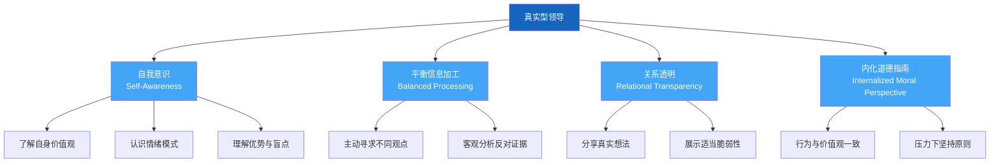
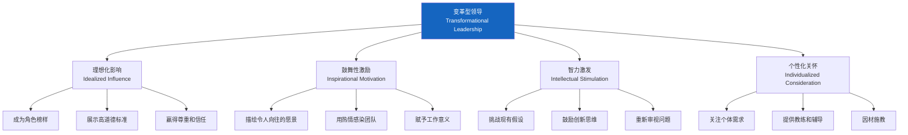
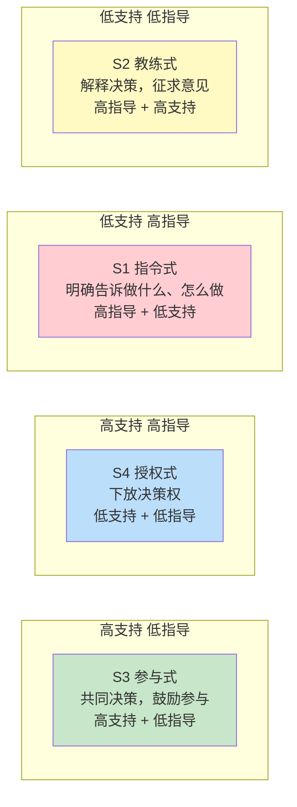
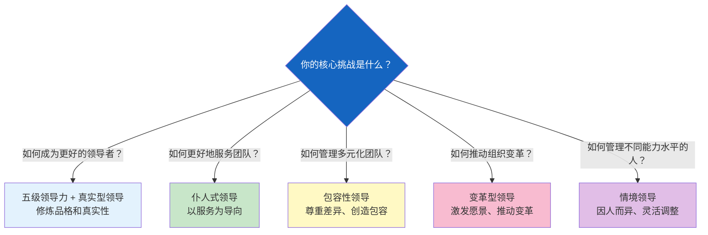

## 六、领导力模型

领导力模型是对"卓越领导者应该具备什么特质、如何行动"的系统化描述。不同的领导力模型从不同维度回答这个问题——有的关注领导者的内在品格，有的关注领导者与追随者的关系，有的关注领导者对环境的适应。掌握这些模型，不是为了机械套用，而是建立一个多元的"透镜库"，让你在不同情境下选择最合适的领导方式。

本章系统讲解六个经过大量实证研究验证的领导力模型，从理论基础到实践方法，从入门认知到高阶应用，帮助你构建完整的领导力认知框架。

### 6.1 五级领导力（Level 5 Leadership）

#### 理论来源与研究基础

吉姆·柯林斯（Jim Collins）在《从优秀到卓越》（*Good to Great*）中，对1435家世界500强企业进行了长达5年的筛选研究，最终找到了11家实现了从"优秀"到"卓越"跨越的公司（15年间累计股票收益率超过市场平均水平3倍以上）。这些公司有一个共同特征：它们的领导者都不是光芒四射的明星型CEO，而是一种特殊类型的领导者——五级领导者。

这个发现颠覆了当时"企业需要魅力型领袖"的主流认知。柯林斯的数据显示，对照组公司（未能实现跨越的公司）中，不乏拥有明星CEO的企业，但它们的卓越往往是短暂的，一旦明星离开，企业就回到平庸。

#### 五级领导力的层级体系

五级领导力是一个递进的层级金字塔，每一级都是上一级的基础：

**第一级：能力出色的个人贡献者（Highly Capable Individual）**

这一级的核心是"个人专业能力"。处于这个层级的人通过自身的才能、知识、技能和良好的工作习惯做出贡献。他们的价值来源于"我能做什么"。

具体表现：
- 具备扎实的专业技能，能高质量完成本职工作
- 有自律的工作习惯，不需要外部督促
- 能够独立解决问题，承担个人责任
- 对专业领域有持续学习的热情

适合的角色：技术专家、独立贡献者、初级岗位。这是领导力发展的起点，也是很多人终身停留的层级——完全没有问题，不是每个人都必须成为管理者。

**第二级：有贡献的团队成员（Contributing Team Member）**

从"我能做什么"到"我能为团队做什么"的转变。这一级的核心是"协作能力"。处于这个层级的人能够在团队中有效合作，将个人能力转化为团队产出。

具体表现：
- 理解团队目标，并使个人工作与之对齐
- 愿意分享信息和知识，不搞信息壁垒
- 能够处理团队中的正常冲突，不回避也不激化
- 在团队讨论中提出有价值的观点，也尊重他人的观点
- 能够根据团队需要调整自己的角色和工作方式

关键跃迁：从"个人绩效导向"到"团队成果导向"。很多人在这个跃迁上卡住，因为他们的自我价值感过度绑定在个人表现上。

**第三级：有能力的管理者（Competent Manager）**

从"为团队贡献"到"管理团队"的转变。这一级的核心是"组织能力"。处于这个层级的人能够组织人力资源，有效率和有效果地追求既定目标。

具体表现：
- 能够将组织目标分解为可执行的计划
- 能够合理分配任务，做到人岗匹配
- 能够建立基本的绩效管理体系（目标设定、过程跟踪、结果评估）
- 能够处理团队中的行政事务和资源协调
- 能够进行有效的招聘和人员配置

关键能力：计划、组织、协调、控制——这是经典的管理四大职能。大多数中层管理者处于这个层级，他们能把事情做对（do things right），但不一定能做对的事情（do the right things）。

**第四级：高效的领导者（Effective Leader）**

从"管理团队"到"领导组织"的转变。这一级的核心是"愿景激励"。处于这个层级的人能够激发团队追求高绩效的愿景和标准。

具体表现：
- 能够描绘令人信服的组织愿景
- 能够将愿景转化为具体的战略方向
- 能够激发团队成员的内在动机，而非仅仅依赖外在激励
- 能够建立高绩效文化，设定高标准并坚持执行
- 能够吸引和培养优秀人才

关键跃迁：从"做对事情"到"做对的事情"。第四级领导者开始关注方向和意义，而不仅仅是效率和执行。这是大多数领导力培训的目标层级。

**第五级：卓越的领导者（Level 5 Executive）**

五级领导力的核心发现。这一级的领导者将两种看似矛盾的特质集于一身：**个人层面的谦逊**和**职业层面的坚定意志**。

个人谦逊的表现：
- 不爱出风头，不追求个人英雄形象
- 成功时看向窗外——将功劳归于团队、运气和外部因素
- 失败时照镜子——主动承担责任，反思自身不足
- 培养接班人，使组织在自己离开后仍然持续成功
- 从不接受媒体的个人吹捧，更愿意谈论公司和团队

职业意志的表现：
- 为了组织的长远利益，做出困难但正确的决定
- 面对挫折和困难时绝不退缩
- 设定极高的绩效标准，不容忍平庸
- 在必要时进行残酷的组织变革（裁员、关闭业务线、重组团队）

**核心悖论**：五级领导者不是不强势，而是他们的强势只用在推动组织目标上，从不用在个人出风头上。他们是"仆人式的国王"——为组织服务，但对组织的方向有着钢铁般的意志。

#### 五级领导力的典型人物

| 领导者 | 公司 | 谦逊表现 | 坚定意志表现 |
|--------|------|----------|-------------|
| 达尔文·史密斯 | 金佰利 | 低调到几乎不为人知，从不接受媒体采访 | 将公司从造纸厂转型为消费品巨头，砍掉了核心造纸业务 |
| 科尔曼·莫克勒 | 雅培制药 | 穿着朴素，自己开车上班，办公室只有普通经理大小 | 将公司从制药公司转型为多元化医疗健康公司 |
| 高乐普 | 吉列 | 出席活动总是坐在后排，从不夸耀自己 | 在竞争对手恶意收购时坚决抵抗，保护公司长期战略 |
| 比尔·盖茨（早期） | 微软 | 生活相对朴素，大量捐款但从不大肆宣传 | 对产品质量和市场地位有着近乎偏执的追求 |

#### 五级领导力的培养路径

五级领导力不是天生的，柯林斯的研究中发现，五级领导者通常经历过两个关键转折点：

**转折点一：觉醒**——通常是一次深刻的个人经历（家庭变故、重大挫折、宗教信仰转变等），让领导者开始反思自我与世界的关系，从"自我中心"转向"超越自我"。

**转折点二：认知**——当领导者发现自己在做正确的事情时获得了巨大的满足感（而非在获得个人荣耀时），他们开始将领导力重新定义为"为更大的使命服务"。

实践建议：
1. 定期自我反思：我的决策是出于组织利益还是个人利益？
2. 练习"窗口和镜子"思维：成功时列出3个他人的贡献，失败时列出3个自己的责任
3. 主动培养接班人：如果你离开，组织能正常运转吗？
4. 寻找超越个人的使命：你的工作如何服务于比你自己更大的东西？

#### 常见误区

- **误区一**：五级领导力 = 软弱/没脾气。事实相反，五级领导者在追求组织目标时比任何人都强硬。
- **误区二**：五级领导者天生如此。大多数五级领导者经历了后天的转变，通常是通过一次深刻的人生经历。
- **误区三**：只有CEO才需要五级领导力。任何层级的管理者都可以修炼谦逊与坚定并存的品格。
- **误区四**：五级领导力就是低调做人。低调只是表象，核心是对组织使命的绝对忠诚和对绩效标准的毫不妥协。

---

### 6.2 仆人式领导（Servant Leadership）

#### 理论来源

罗伯特·格林利夫（Robert Greenleaf）在1970年发表了论文《仆人式领导》（*The Servant as Leader*），提出了一个颠覆性的观点：**最有效的领导者，是那些首先将自己视为服务者的人**。

格林利夫在AT&T工作了近40年，他的理论不是来自象牙塔，而是来自对组织运作的深刻观察。他发现，那些最成功的领导者都有一个共同特点：他们把下属的成长和成功视为自己的首要责任。

这个理念来自赫尔曼·赫塞的小说《东方之旅》（*The Journey to the East*）：故事中的仆人Leo看似只是为旅行团做杂务，但当Leo消失后，整个团队分崩离析——原来Leo才是真正的领导者和精神核心。

#### 仆人式领导的核心逻辑

传统领导模式的核心假设是"领导知道答案，员工执行命令"。仆人式领导模式的核心假设是"员工最接近问题，领导应该帮助员工解决问题"。这不是简单的谦虚，而是一种更有效的组织运作方式。

#### 仆人式领导的十大特征

格林利夫提出了仆人式领导者的十大核心特征，这不是一份清单，而是一个相互关联的系统：

**1. 倾听（Listening）**

不只是听员工说了什么，还要听他们没说什么。仆人式领导者通过深度倾听来理解员工的真实需求和关切。

实操方法：
- 一对一定期谈话，不带议程，只是倾听
- 提出开放性问题："你最近在想什么？""有什么事情让你感到困扰？"
- 在会议中最后一个发言，先听完所有人的观点
- 注意非语言信号：表情、语气、肢体语言
- 倾听后给予反馈："我听到你说的是……，我理解得对吗？"

**2. 同理心（Empathy）**

理解他人的感受和观点，不轻易评判。同理心不是同意对方，而是理解对方。

实操方法：
- 当员工犯错时，先问"发生了什么？"而不是"你为什么这么做？"
- 尝试从对方的视角看问题：如果我处在他的位置，我会怎么想？
- 承认对方的感受："我能理解你为什么会感到沮丧"
- 避免过早给出建议——有时候人们需要的是被理解，而不是被指导

**3. 治愈（Healing）**

帮助他人和自己实现情感上的愈合，修复破碎的关系。组织中的人际创伤（冲突、背叛、失败）如果不被处理，会成为团队效能的障碍。

实操方法：
- 在团队冲突后组织复盘，但目的不是追责，而是理解和修复
- 为员工创造安全的空间来表达挫折和不满
- 当团队经历重大变化或失败时，主动关注团队成员的情绪状态
- 领导者自己也需要治愈——寻找导师、教练或同行支持

**4. 觉察（Awareness）**

对自我和周围环境保持高度觉察，包括对自身局限性的觉察。觉察是改变的前提——你无法改变你看不到的东西。

实操方法：
- 定期进行自我反思：我今天的行为是否与我的价值观一致？
- 寻求360度反馈，了解自己对他人的影响
- 注意自己的情绪模式：什么时候我容易发怒？什么时候我倾向于回避？
- 保持对组织动态的觉察：团队士气如何？有哪些潜在的冲突正在酝酿？

**5. 说服（Persuasion）**

通过说服而非命令来影响他人，寻求共识而非强制服从。这不是软弱，而是一种更持久的影响力来源。

实操方法：
- 在推动决策时，先解释"为什么"，再说明"做什么"
- 邀请不同意见，在决策前充分讨论
- 当团队不同意你的观点时，认真考虑他们是否有道理
- 通过逻辑和数据来说服，而非通过权威和职位

**6. 概念化（Conceptualization）**

超越日常管理，进行战略性思考。仆人式领导者不仅要处理今天的问题，还要为明天做准备。

实操方法：
- 每周至少留出2小时的"战略思考时间"，不处理日常事务
- 阅读行业报告、跨领域书籍，拓宽视野
- 将组织的日常工作与长远使命联系起来
- 鼓励团队成员也进行战略性思考，而非只关注眼前任务

**7. 前瞻性（Foresight）**

预见未来趋势和可能的结果，提前做好准备。前瞻性不是预测未来，而是基于对过去和现在的深入理解来推断可能的未来。

实操方法：
- 关注行业趋势和技术发展，定期进行环境扫描
- 在做决策时考虑"如果这个决定出了问题，最坏的结果是什么？"
- 建立预警机制，在问题变得严重之前识别风险
- 学习历史案例，理解"什么导致了成功，什么导致了失败"

**8. 管家意识（Stewardship）**

将组织资源视为信任的托付，为整个组织和社会的利益服务。管家意识意味着领导者不把组织当作自己的财产，而是当作需要被妥善管理的信托。

实操方法：
- 在资源分配时优先考虑组织的长期利益，而非短期收益
- 在决策时考虑所有利益相关者（员工、客户、社区、环境），而非仅考虑股东
- 培养组织的可持续发展能力，而非过度消耗资源
- 在财务管理上保持透明和负责任

**9. 致力于人的成长（Commitment to the Growth of People）**

帮助每个人实现全面发展——不仅是职业能力的成长，也包括人格和精神的成长。这是仆人式领导与其他领导力模型最大的区别。

实操方法：
- 为每位团队成员制定个人发展计划（不仅是技能培训）
- 支持员工的学习和探索，即使这些学习与当前工作不直接相关
- 在员工犯错时将其视为学习机会，而非惩罚的理由
- 投入时间和资源为员工提供教练和辅导
- 关心员工作为"完整的人"的需求——家庭、健康、兴趣爱好

**10. 建设社区（Building Community）**

在组织中营造归属感和共同体意识。在远程工作和零工经济日益普遍的今天，这一点变得尤为重要。

实操方法：
- 创造非正式的社交机会（团队午餐、兴趣小组、社区活动）
- 建立共同的仪式和传统（入职仪式、里程碑庆祝、团队纪念日）
- 鼓励跨部门和跨层级的交流和合作
- 在组织内部倡导互帮互助的文化
- 将组织的责任延伸到所在的社区

#### 仆人式领导的实践案例

**案例一：星巴克的霍华德·舒尔茨**

霍华德·舒尔茨在1982年加入星巴克时，公司只有4家门店。他最大的创新不是咖啡本身，而是对待员工的方式。他坚持为包括兼职员工在内的所有员工提供医疗保险和股票期权（他称之为"豆股"），这在当时的零售行业是闻所未闻的。

他的逻辑很简单："我们的品牌是通过与顾客的每一次互动来建立的，而创造这些互动的是我们的员工（他称之为'伙伴'）。如果我们照顾好我们的伙伴，他们就会照顾好我们的顾客，生意自然会好。"

结果：在舒尔茨的领导下，星巴克从4家门店扩展到了超过30,000家，成为全球最大的咖啡连锁品牌。

**案例二：西南航空的赫布·凯莱赫**

赫布·凯莱赫提出了著名的优先级排序："员工第一，顾客第二，股东第三。"这听起来违反直觉，但他的逻辑是：如果员工开心，他们会提供出色的客户服务；如果客户服务出色，顾客会持续回来；如果顾客持续回来，股东就会得到回报。

他的实践：
- 建立了以幽默和乐趣为核心的企业文化
- 在航空业大规模裁员时坚持不裁员
- 给予员工极大的自主权——空乘人员可以自由地用幽默的方式进行安全演示
- 在招聘时优先考虑态度，而非技能（"我们可以教会你如何做这份工作，但无法教会你如何微笑"）

结果：西南航空连续47年盈利，是美国航空史上唯一从未经历大规模裁员或破产的大型航空公司。

**案例三：微软的萨提亚·纳德拉**

2014年萨提亚·纳德拉接任微软CEO时，微软正陷入内部政治斗争和创新停滞的困境。纳德拉用一个词重新定义了微软的文化：**从"无所不知"（know-it-all）到"无所不学"（learn-it-all）**。

他的仆人式领导实践：
- 每周定期与不同层级的员工进行"倾听之旅"
- 公开谈论自己作为自闭症孩子父亲的经历，展示脆弱性
- 将高管的绩效考核从"你做了什么"改为"你帮助他人做了什么"
- 推动"成长型思维"文化，鼓励试错和学习
- 在他的领导下，微软的市值从约3000亿美元增长到了超过3万亿美元

#### 仆人式领导的适用场景与局限

**最适合的场景：**
- 知识密集型行业（技术、咨询、教育、医疗）
- 需要高度创新和自主性的团队
- 需要长期人才留存的组织
- 服务型组织（客户满意度取决于员工满意度）

**可能不太适合的场景：**
- 军队和准军事组织（需要明确的命令链和快速执行）
- 危机情境（需要快速决策，没有时间充分讨论）
- 初创公司早期（需要强有力的方向指引，可能没有资源做全面的员工关怀）
- 绩效差距极大的团队（有些成员可能需要更直接的管理）

**关键原则：** 仆人式领导不是"不管理"或"放任"。它是一种更高级的管理方式——通过服务来实现领导。如果团队成员不称职或不负责任，仆人式领导者的"服务"包括帮助他们改善表现或找到更适合的岗位。

---

### 6.3 真实型领导（Authentic Leadership）

#### 理论背景

真实型领导理论在21世纪初获得了广泛关注，背景是安然事件（2001年）、世通丑闻（2002年）等大规模企业欺诈事件。这些事件暴露了一个核心问题：**当领导者不真实时，组织会发生什么？**

比尔·乔治（Bill George）——美敦力公司（Medtronic）前CEO——在2003年出版的《真实领导力》（*Authentic Leadership*）中提出，企业需要的不是更多的领导技巧，而是更真实的领导者。

研究者布鲁斯·阿沃利奥（Bruce Avolio）和威廉·加德纳（William Gardner）进一步将真实型领导发展为学术理论，发表了大量实证研究，证明真实型领导与员工信任、工作满意度、组织承诺和绩效之间存在显著的正相关关系。

#### 真实型领导的四个核心维度

**维度一：自我意识（Self-Awareness）**

深刻了解自己的优势、劣势、价值观和情感。真实型领导者不会试图成为别人，而是充分发挥自己的独特优势。

自我意识包含四个层面：

| 层面 | 说明 | 自问 |
|------|------|------|
| 价值观意识 | 了解自己的核心价值观和信念 | 什么对我最重要？我绝不会为了什么而妥协？ |
| 情绪意识 | 认识自己的情绪模式和触发点 | 什么情况容易让我愤怒/焦虑/兴奋？我如何处理这些情绪？ |
| 能力意识 | 了解自己的优势和盲点 | 我擅长什么？我在哪些方面需要他人的补充？ |
| 影响意识 | 理解自己对他人的影响 | 我的行为如何影响了周围的人？他们在我面前是什么状态？ |

培养自我意识的方法：
1. **写反思日记**：每天花10分钟记录关键事件、自己的反应和背后的动机
2. **寻求反馈**：定期向信任的同事、下属和上级寻求坦诚的反馈
3. **心理测评**：使用MBTI、DISC、盖洛普优势等工具辅助自我认知
4. **教练对话**：与专业教练定期对话，帮助发现盲点
5. **正念练习**：通过冥想和正念练习提升对自身情绪和思维的觉察

**维度二：平衡信息加工（Balanced Processing）**

客观地看待信息，不因个人偏见而扭曲判断。真实型领导者在做决定前会主动寻求不同的观点，并认真考虑与自己立场相反的证据。

这不是"优柔寡断"——平衡信息加工是说在决策之前充分考虑不同意见，而不是永远不做决定。它要求领导者克服两种常见的认知偏差：

- **确认偏差**：只关注支持自己观点的信息，忽略反对意见
- **锚定效应**：过度依赖第一个获得的信息，后续调整不足

培养平衡信息加工的方法：
1. **红队机制**：在重大决策前组建"红队"，专门挑战和质疑主流方案
2. **魔鬼代言人**：在团队讨论中指定一人担任"魔鬼代言人"，负责提出反对意见
3. **决策日志**：记录每个重大决策的理由和反对意见，事后复盘时回顾
4. **多源信息**：主动从不同来源获取信息，避免"回音室效应"
5. **暂停机制**：在重大决策前给自己24小时的"冷静期"，重新审视判断

**维度三：关系透明（Relational Transparency）**

在与他人的互动中保持开放和真诚。真实型领导者分享自己的想法和感受，而不是隐藏在面具后面。

关系透明的关键原则：

- **透明≠完全坦露**：真实型领导不意味着把所有想法和感受都公之于众。它意味着你分享的内容是真实的，但你仍然可以选择分享什么、不分享什么
- **真诚≠无过滤**：你可以真诚地表达关切，同时用建设性的方式表达
- **展示脆弱≠展示弱点**：脆弱（vulnerability）是有选择地展示不确定性或挑战，让他人感到"领导者也是人"；弱点是暴露你的能力缺陷

培养关系透明的方法：
1. **分享决策过程**：不仅告诉团队"做什么"，还告诉他们"为什么这样做"
2. **承认不确定性**："我不确定这个方案是否正确，但基于目前的信息，这是我认为最合理的选择"
3. **公开犯错**：当你犯了错误，主动承认并分享你从中学到了什么
4. **一致的言行**：你说什么就做什么，不搞"说一套做一套"
5. **反馈文化**：在团队中建立双向反馈的习惯，既能给予也能接受反馈

**维度四：内化道德指南（Internalized Moral Perspective）**

行为由内在价值观驱动，而非外部压力。真实型领导者有清晰的道德标准，并在面对压力时坚持这些标准。

这在实践中意味着什么？当公司短期利益与你的价值观冲突时，你会怎么做？当行业潜规则与你的道德标准不一致时，你会怎么做？当上级要求你做你认为不对的事情时，你会怎么做？

培养内化道德指南的方法：
1. **明确价值观**：写下你的核心价值观（3-5个），并将其作为决策的参考框架
2. **道德困境讨论**：定期与团队讨论道德困境案例，建立共同的道德语言
3. **价值观审计**：定期回顾自己的决策，问"这个决定是否符合我的价值观？"
4. **寻找道德榜样**：在你的行业和生活中寻找值得学习的道德榜样
5. **建立支持系统**：找到能与你坦诚讨论道德困境的同行或导师

#### 真实型领导的测量工具

学术界已经开发了多个经过验证的真实型领导测量工具：

- **真实型领导问卷（ALQ）**：由布鲁斯·阿沃利奥开发，包含16个题目，测量四个维度
- **真实型领导行为清单（ALBI）**：由迈克尔·克恩开发，更侧重于可观察的行为
- **真实型领导综合模型（CAL）**：结合了真实型领导与积极心理资本的测量

#### 真实型领导的常见误区

- **误区一**："真实"意味着"做自己就好"。事实是，真实型领导需要持续的自我反思和成长，不是放任自己的缺点。
- **误区二**：真实型领导就是"坦率直言"。不分场合、不分方式的坦率可能造成伤害，真实型领导需要在真诚和体贴之间找到平衡。
- **误区三**：真实型领导与领导力发展矛盾。真实型领导不是拒绝学习新技能，而是在学习和成长的过程中保持真实——承认自己不擅长什么，然后努力提升。
- **误区四**：真实型领导不能改变风格。真实型领导不意味着只有一种领导方式。你可以在不同情境下调整你的行为方式，只要这些行为与你的核心价值观一致。

---

### 6.4 包容性领导（Inclusive Leadership）

#### 理论背景

包容性领导的研究起步于21世纪初，但其重要性在近十年急剧上升。驱动因素包括：全球化带来的文化多样性增加、"黑人的命也是命"等社会运动、女性领导力的崛起，以及研究发现多样性团队在正确管理下确实比同质化团队表现更好。

德勤（Deloitte）的研究显示，包容性领导力高的团队，其决策质量提高87%，创新产出提高20%，团队绩效提高17%。但多样性本身不会自动带来这些好处——没有包容性领导的多样性甚至可能导致冲突增加和绩效下降。

关键区别：
- **多样性（Diversity）**：团队在人口统计学和认知特征上的差异程度——这是一个状态描述
- **包容性（Inclusion）**：团队成员是否感到被尊重、被重视、被信任、被赋予参与权——这是一个体验描述
- **包容性领导（Inclusive Leadership）**：领导者创造包容性环境的能力和行为

#### 包容性领导的六个特征

2016年，德勤的伯恩-多瑞（Bourke）和塔尔博特（Talbot）通过对全球超过100名高管的研究，识别出了包容性领导的六个核心特征：

**1. 可见的承诺（Visible Commitment）**

公开展示对多元化和包容性的承诺，不是停留在口号上，而是通过实际行动来证明。

具体行为：
- 将多元化和包容性纳入组织战略目标，而不仅仅是人力资源部门的KPI
- 在高管团队会议上定期讨论多元化和包容性议题
- 亲自参与多元化和包容性项目（如担任导师、赞助少数群体员工）
- 在招聘和晋升决策中主动挑战无意识偏见
- 对不包容的行为采取零容忍态度，无论犯错者的级别高低

**2. 谦逊（Humility）**

承认自己的局限性和偏见。包容性领导者知道，他们对世界的理解是不完整的，每个人都有自己看不到的盲点。

具体行为：
- 公开承认自己的不足和学习过程："我不完全理解这个文化背景，但我愿意学习"
- 在不确定时主动询问，而非假装理解
- 当员工指出自己的偏见时，感谢而非防御
- 把犯错当作学习机会，而非需要掩盖的尴尬

**3. 对差异的好奇（Curiosity About Differences）**

对不同的观点和经历保持开放和好奇，将差异视为学习的机会而非威胁。

具体行为：
- 主动了解不同文化背景的同事的生活经历
- 在团队讨论中邀请不同背景的成员发言
- 问出真诚的问题（而非评判性的问题），例如："你能帮我理解一下你看待这个问题的方式吗？"
- 阅读不同文化和群体的书籍、文章和报道
- 鼓励团队成员分享不同的观点，即使这些观点与主流不同

**4. 文化智慧（Cultural Intelligence）**

理解和适应不同文化的行为和规范。文化智慧不仅适用于国际团队——即使在同一个国家，不同地区、不同代际、不同社会背景的人也有不同的沟通风格和期望。

文化智慧的四个组成部分：
- **认知CQ**：了解不同文化的价值观、规范和实践
- **元认知CQ**：在跨文化互动中有意识地调整自己的思维模式
- **动机CQ**：对跨文化互动有积极的兴趣和信心
- **行为CQ**：能够根据情境调整自己的语言和非语言行为

培养文化智慧的方法：
1. 学习霍夫斯泰德文化维度理论，了解不同文化的差异
2. 在国际团队中注意沟通风格差异（直接vs间接、低语境vs高语境）
3. 在会议中注意不同文化对"沉默"的不同解读（同意vs不认同vs在思考）
4. 了解不同文化对"权威"和"等级"的不同态度

**5. 有效协作（Effective Collaboration）**

通过多元化来增强团队的创造力和决策质量，而非仅仅将不同背景的人放在一起。

具体行为：
- 在团队讨论中确保每个人都有发言机会，防止少数人主导讨论
- 使用结构化的决策工具（如名义群体技术、德尔菲法）来确保所有观点被听到
- 当出现分歧时，引导团队将分歧视为"更多视角"而非"冲突"
- 建立共同的团队规范，让不同背景的成员都能在其中感到舒适
- 利用数字化工具让内向的成员也能充分表达观点（如匿名投票、在线文档协作）

**6. 勇气（Courage）**

在面对不公正时挺身而出，即使这意味着挑战权威或冒犯他人。这是包容性领导中最难但最重要的特征。

具体行为：
- 当你看到有人被不公平对待时，当场介入（"我注意到这个建议最初是由小张提出的，让我们确保她得到认可"）
- 当团队讨论中出现歧视性或排斥性的言论时，直接指出（"我们不使用这种表述方式"）
- 当组织的政策或实践存在系统性偏见时，向上级和决策者提出质疑
- 愿意为了正确的事情承受代价——包括职业生涯的风险

#### 包容性领导的实践框架

**日常实践清单：**

| 场景 | 包容性做法 | 排斥性做法 |
|------|-----------|-----------|
| 会议发言 | 先邀请安静的成员发言，注意打断模式 | 只听到最响亮的声音 |
| 招聘面试 | 结构化面试，标准化评分，多元化面试小组 | 非结构化聊天，"文化匹配"主导 |
| 绩效评估 | 基于行为证据，检查评分模式的群体差异 | 依赖主观印象，"潜力"评估 |
| 社交活动 | 选择所有人都能参与的活动和时间 | 只在酒吧或高尔夫球场谈事 |
| 反馈给予 | 对所有人给予同等质量和频率的发展性反馈 | 对"像自己的人"投入更多关注 |
| 意见冲突 | 视为学习机会，探索不同视角背后的原因 | 视为"不配合"或"缺乏团队精神" |

#### 包容性领导的自评工具

以下是一个简化版的包容性领导力自评，帮助你识别自己的强项和发展领域。对每个陈述，用1（很少）到5（几乎总是）评分：

**自我觉察维度：**
1. 我意识到自己的无意识偏见可能影响决策
2. 我主动寻求与我不同的人的意见
3. 当我犯了不包容的错误时，我能够承认并改正

**关系维度：**
4. 我确保团队中每个人的声音都被听到
5. 我在社交场合中主动包括被忽视的人
6. 我对团队成员的文化和个人背景表现出真诚的好奇

**行为维度：**
7. 当我看到不公正的行为时，我会当场介入
8. 我在招聘和晋升决策中使用客观标准
9. 我根据团队成员的不同需求调整我的领导方式

**组织维度：**
10. 我推动组织政策和流程的公平性审查
11. 我积极赞助和指导来自少数群体的人才
12. 我将多元化和包容性视为战略优势，而非合规义务

**评分解读：**
- 48-60分：你已经是包容性领导的典范，继续发挥你的优势
- 36-47分：你有良好的基础，可以重点发展较弱的维度
- 24-35分：你正在发展的路上，建议系统学习并寻求反馈
- 12-23分：这是一个重要的成长机会，建议从自我觉察开始

---

### 6.5 变革型领导（Transformational Leadership）

#### 理论来源

变革型领导理论由詹姆斯·麦格雷戈·伯恩斯（James MacGregor Burns）在1978年的《领导力》（*Leadership*）一书中首次提出，后由伯纳德·巴斯（Bernard Bass）发展为完整的理论体系。

伯恩斯区分了两种领导类型：
- **交易型领导（Transactional Leadership）**：通过"交易"来领导——你完成任务，我给你报酬；你犯了错误，我给你惩罚。本质上是一种"契约关系"。
- **变革型领导（Transformational Leadership）**：通过"变革"来领导——提升追随者的意识层次，激发他们超越自我利益，为更高的使命而努力。本质上是一种"道德关系"。

变革型领导是过去40年中被研究最多、实证支持最强的领导力理论之一。元分析研究显示，变革型领导与员工满意度、组织承诺、工作绩效和组织公民行为之间存在显著的正相关关系。

#### 变革型领导的四个维度（4I模型）

**维度一：理想化影响（Idealized Influence, II）**

变革型领导者通过自身的品格和行为成为追随者的角色榜样。他们不只是告诉人们该做什么，而是用行动展示什么是正确的。

实践要点：
- 在困难面前展现勇气和决心，而非退缩和推诿
- 坚持高道德标准，即使这意味着短期利益的损失
- 将团队和组织的利益置于个人利益之上
- 通过持续一致的行为赢得信任，而非通过言语承诺

**维度二：鼓舞性激励（Inspirational Motivation, IM）**

变革型领导者能够描绘一个令人向往的未来愿景，并用热情和乐观来激励团队。

实践要点：
- 用清晰、简洁、有感染力的语言描绘愿景
- 将日常工作与更大的使命和意义联系起来
- 在困难时期展示乐观和韧性，给团队信心
- 设定具有挑战性但可实现的目标，激发团队的斗志
- 使用故事和隐喻来传达愿景——人们更容易被故事打动

**维度三：智力激发（Intellectual Stimulation, IS）**

变革型领导者鼓励追随者以新的方式思考问题，挑战现有假设，质疑旧的做法。

实践要点：
- 提出启发性的问题："如果资源无限，你会怎么做？""我们为什么一直这样做？"
- 鼓励团队成员挑战你的观点，而非要求服从
- 将失败重新框架为学习机会："我们从这次实验中学到了什么？"
- 创造安全的环境，让团队成员敢于提出"疯狂"的想法
- 引入跨领域的知识和方法，激发新的思考角度

**维度四：个性化关怀（Individualized Consideration, IC）**

变革型领导者关注每个追随者的独特需求、能力和潜力，充当教练和导师的角色。

实践要点：
- 了解每个团队成员的职业目标和发展需求
- 根据每个人的能力和准备度调整你的领导方式（参见情境领导模型）
- 提供个性化的反馈和发展建议
- 在一对一会议中花时间了解每个人的挑战和进展
- 为高潜力成员创造成长机会（重要项目、跨部门轮岗、高管接触）

#### 变革型领导 vs 交易型领导

| 维度 | 变革型领导 | 交易型领导 |
|------|-----------|-----------|
| 影响机制 | 内在动机：使命感、成长、价值认同 | 外在动机：报酬、晋升、惩罚规避 |
| 关注焦点 | 愿景和变革 | 目标和交易 |
| 领导者角色 | 导师、教练、变革推动者 | 监督者、协调者、资源分配者 |
| 跟随者发展 | 激发潜能，超越自我 | 完成既定任务 |
| 适用情境 | 需要变革、创新和突破的时期 | 稳定运营、流程执行、日常管理 |
| 持续性 | 能够激发长期的承诺和变革 | 效果在"交易"停止时消失 |

**关键洞察：** 最有效的领导者不会只使用一种风格。变革型领导和交易型领导是互补的，而非对立的。你需要变革型领导来激发愿景和变革，也需要交易型领导来确保日常执行和绩效管理。

---

### 6.6 情境领导（Situational Leadership）

#### 理论来源

情境领导模型由保罗·赫塞（Paul Hersey）和肯·布兰查德（Ken Blanchard）在1969年提出，是最早强调"领导力应该因情境而变"的理论之一。

核心假设：**没有一种"最好的"领导风格。最有效的领导风格取决于追随者的能力和意愿水平。**

这个模型的实用性在于它非常直接——它不只是告诉你"什么是好的领导力"，而是告诉你"在这种具体情况下，你应该怎么做"。

#### 四种领导风格

情境领导模型根据两个维度来定义领导风格：
- **指导行为（Task Behavior）**：领导者定义角色、告诉做什么、怎么做、何时做、在哪里做的程度
- **支持行为（Relationship Behavior）**：领导者进行双向沟通、倾听、鼓励、促进互动的程度

这两个维度的组合产生了四种领导风格：

**S1：指令式（Telling / Directing）——高指导 + 低支持**

领导者提供明确的指导和密切的监督。决策由领导者做出，沟通主要是单向的（从领导到下属）。

适用情境：下属的能力低但意愿高（或至少不低）。典型场景包括新员工入职、任务初次分配、紧急情况。

具体行为：
- 设定明确的目标和期限
- 提供详细的步骤说明
- 密切监督执行过程
- 给予频繁的反馈和纠正

**S2：教练式（Selling / Coaching）——高指导 + 高支持**

领导者仍然主导决策，但会向下属解释决策的原因，征求他们的意见，并鼓励双向沟通。

适用情境：下属的能力有一定提升但仍不足，意愿可能波动（时而信心不足、时而热情减退）。

具体行为：
- 解释决策背后的"为什么"
- 给予鼓励和支持来建立信心
- 继续提供指导，但开始征求下属的意见
- 帮助下属理解任务与更大目标的关系

**S3：参与式（Partarticipating / Supporting）——低指导 + 高支持**

领导者将决策权与下属共享。领导者不再主导决策，而是提供支持、鼓励和资源。

适用情境：下属的能力已经足够，但意愿可能不足（可能是因为缺乏信心、动力或安全感）。

具体行为：
- 邀请下属参与决策过程
- 提供鼓励和情感支持
- 促进问题解决，而非直接给答案
- 认可和庆祝下属的成就

**S4：授权式（Delegating）——低指导 + 低支持**

领导者将决策和执行的权力完全交给下属，只进行适度的监督。

适用情境：下属的能力和意愿都很高。他们既知道怎么做，也有动力去做。

具体行为：
- 下放决策权和执行权
- 信任下属自行解决问题
- 保持适度的监督，但不干预
- 只在下属主动请求时提供支持

#### 四种追随者准备度

| 准备度 | 能力 | 意愿 | 典型场景 | 推荐风格 |
|--------|------|------|----------|----------|
| R1 | 低 | 低/不确定 | 新员工、新任务、缺乏信心的成员 | S1 指令式 |
| R2 | 低到中 | 不稳定 | 学习中的成员，有时积极有时沮丧 | S2 教练式 |
| R3 | 中到高 | 不稳定 | 有能力但缺乏信心或动力的成员 | S3 参与式 |
| R4 | 高 | 高 | 经验丰富、自驱力强的成员 | S4 授权式 |

#### 情境领导的常见错误

- **错误一：风格固化**——领导者只习惯使用一种领导风格，无论下属的需求如何。例如，习惯于S1的领导者在面对R4下属时仍事无巨细地指挥，导致优秀员工感到不被信任。
- **错误二：过早授权**——在下属能力不足时就下放权力，导致失败和挫败。授权必须以能力为基础。
- **错误三：过度管理**——在下属完全胜任后仍然密切监督，消耗双方的时间和精力。
- **错误四：忽略意愿**——只关注能力，忽略意愿。能力可以通过培训提升，但意愿问题往往更复杂（可能涉及信心、动力、个人问题等）。
- **错误五：一刀切**——对整个团队使用同一种风格，而实际上每个成员的准备度可能不同。

#### 情境领导的实践方法

**步骤一：评估每位团队成员的准备度**
- 对每个关键任务，评估成员的能力（能否独立完成？）和意愿（是否有信心和动力？）
- 准备度不是固定不变的——同一个人对不同任务的准备度可能不同

**步骤二：选择匹配的领导风格**
- 对R1成员使用S1：提供清晰的指导和密切的监督
- 对R2成员使用S2：在指导的同时给予鼓励和解释
- 对R3成员使用S3：让他们参与决策，给予情感支持
- 对R4成员使用S4：下放权力，信任他们的判断

**步骤三：根据进展调整风格**
- 随着成员能力的提升，逐步从S1→S2→S3→S4过渡
- 当成员遇到新的挑战或信心受挫时，可能需要暂时回调到更指导性的风格
- 定期与成员沟通，了解他们的需求变化

---

### 六大领导力模型的综合对比

#### 模型对比矩阵

| 模型 | 核心焦点 | 提出者 | 最适合场景 | 主要局限 |
|------|----------|--------|-----------|----------|
| 五级领导力 | 领导者品格（谦逊+意志） | 柯林斯 | 需要长期卓越的组织高层 | 培养路径不明确，更多是描述性的 |
| 仆人式领导 | 领导者与追随者的关系 | 格林利夫 | 知识密集型、服务型组织 | 可能不适用于危机情境 |
| 真实型领导 | 领导者的真实性 | 乔治、阿沃利奥 | 信任缺失的环境、变革时期 | "真实"的边界难以把握 |
| 包容性领导 | 多元化与包容 | 德勤团队 | 多元化团队、全球化组织 | 需要长期文化变革，短期效果有限 |
| 变革型领导 | 激发追随者超越自我 | 伯恩斯、巴斯 | 需要变革和创新的时期 | 可能过度依赖领导者个人魅力 |
| 情境领导 | 因情境调整领导风格 | 赫塞、布兰查德 | 管理能力参差不齐的团队 | 模型简化了现实的复杂性 |

#### 如何选择和运用这些模型

这些模型不是互相排斥的，而是相互补充的。一个成熟的领导者应该具备从多个模型中选择合适工具的能力：

**整合运用的建议：**

1. **品格基础**：以五级领导力的谦逊与坚定、真实型领导的真实性作为品格基础——这是一切领导力的根基
2. **关系导向**：用仆人式领导的服务精神和包容性领导的包容意识来建立与团队的关系
3. **情境灵活**：用情境领导模型来指导具体场景下的行为选择
4. **变革能力**：用变革型领导的方法来推动必要的变革和创新
5. **持续进化**：这六个模型不是学完就放下的理论，而是需要在实践中不断练习和内化的工具

#### 领导力模型的发展趋势

当代领导力研究正在向以下方向发展：

1. **复杂性领导**：在VUCA（易变、不确定、复杂、模糊）时代，领导者需要拥抱复杂性，而非试图简化一切
2. **共享式领导**：领导力不再是某个人的专属，而是在团队中根据情境动态流转
3. **分布式领导**：在扁平化组织中，领导力分散在组织的各个层级和节点
4. **敏捷领导**：在快速变化的环境中，领导者需要像敏捷开发一样——快速迭代、持续反馈、灵活调整
5. **AI时代领导**：当AI承担越来越多的分析和执行任务时，领导者的价值将更多体现在愿景、共情、创造力和道德判断上

---

### 实践工具箱

#### 领导力自我评估

花30分钟完成以下评估，帮助你识别自己最自然的领导风格和最有潜力的发展方向。

**第一部分：我的自然领导风格（选择最符合的描述）**

1. 当团队遇到困难时，我倾向于：
   - A. 直接给出解决方案（指令式倾向）
   - B. 解释方案并征求意见（教练式/变革型倾向）
   - C. 引导团队自己找到解决方案（参与式/仆人式倾向）
   - D. 信任团队自行处理（授权式/五级倾向）

2. 我最看重的领导品质是：
   - A. 清晰的方向和执行力
   - B. 激励和鼓舞他人的能力
   - C. 真诚和透明
   - D. 包容和尊重差异

3. 在成功时，我最自然的反应是：
   - A. 总结经验，优化流程
   - B. 感谢团队，庆祝成就
   - C. 归功于团队和运气
   - D. 思考下一步如何做得更好

**第二部分：我的发展领域**

回顾过去三个月，是否有以下情况发生（勾选所有适用项）：
- [ ] 有团队成员反馈说我不够倾听
- [ ] 在多元化议题上我感到不确定或不自在
- [ ] 我发现自己难以在不同情境下切换领导风格
- [ ] 我过于关注任务执行，忽略了关系建设
- [ ] 在推动变革时遇到较大阻力
- [ ] 我不确定自己的领导价值观是什么
- [ ] 我对团队中的差异化管理做得不够

每个勾选项都指向一个可能需要发展的领域。

#### 30天领导力提升计划

| 周次 | 重点 | 每日行动 | 周末反思 |
|------|------|----------|----------|
| 第1周 | 自我觉察 | 每天写5分钟反思日记，记录关键事件和自己的反应 | 回顾一周的日记，识别模式 |
| 第2周 | 倾听与同理心 | 每天与一位团队成员进行15分钟不带议程的对话 | 我从这些对话中学到了什么？ |
| 第3周 | 反馈与透明 | 每天向一位团队成员给予具体的正面反馈 | 我在哪一天最难给出反馈？为什么？ |
| 第4周 | 情境适应 | 每天评估一位团队成员的准备度，调整我的领导方式 | 这种调整带来了什么变化？ |
