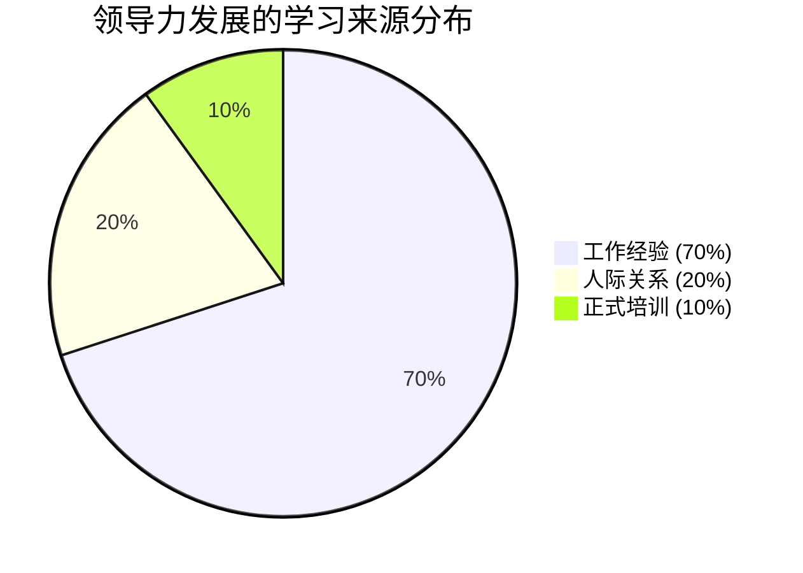
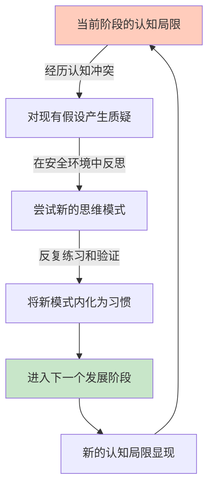
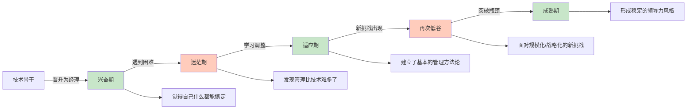
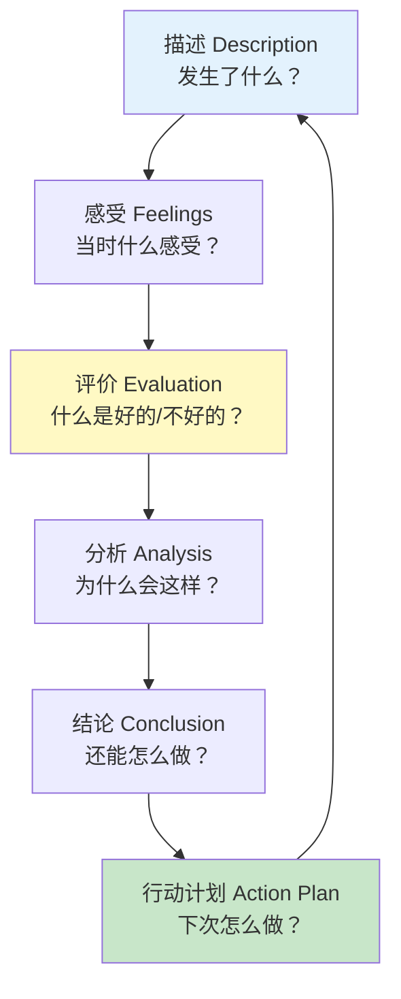
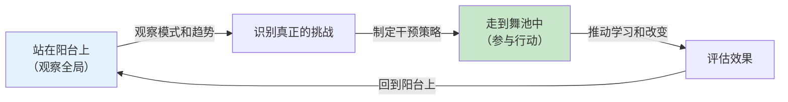

## 七、领导力发展理论

领导力究竟是天生的禀赋，还是后天习得的能力？这是领导力研究领域最古老的争论之一。现代领导力发展理论给出了一个明确的答案：**领导力可以通过系统化的发展过程来培养和提升**。然而，"可以发展"并不意味着"容易发展"——领导力的成长遵循特定的规律，理解这些规律才能设计出真正有效的发展路径。

本节将系统梳理领导力发展的核心理论，从学习来源（70-20-10法则）、认知发展阶段（凯斯西储大学模型）、能力习得过程（四阶段模型）、反思实践方法（舍恩理论），到建构发展理论、领导力身份发展理论和适应性领导力发展框架，帮助你理解领导力成长的底层机制，找到最适合自己的发展路径。

### 7.1 领导力发展的70-20-10法则

#### 7.1.1 理论来源与核心发现

70-20-10法则源自美国创造性领导力中心（Center for Creative Leadership, CCL）在1980年代由Michael Lombardo和Robert Eichinger主持的一项大规模研究。他们对近200名成功高管进行了深度访谈，追溯其领导力成长的关键经历，发现领导力发展的学习来源呈现出一个稳定的分布模式。

**70%来自工作经验**：最具挑战性的工作任务是领导力发展最重要的来源。具体包括：

- **新挑战**：第一次管理团队、第一次负责大型项目、第一次进入陌生市场——这些"第一次"迫使你跳出舒适区，快速学习新的领导技能。研究表明，约75%的高管认为"被安排到一个超出当前能力范围的岗位"是他们领导力成长最关键的转折点。
- **跨职能调动**：从技术岗位转到业务岗位，从总部调到区域，从单一职能到综合管理——跨职能经历能够打破思维定式，培养全局视角。通用电气（GE）的领导力发展体系就以频繁的岗位轮换为核心机制，杰克·韦尔奇本人在成为CEO之前经历过GE的多个业务板块。
- **危机处理**：企业危机、团队冲突、项目失败——这些负面经历同样是宝贵的学习来源。CCL的研究发现，约25%的高管将"经历一次重大失败"列为最具发展价值的事件。
- **从零开始搭建**：创建新团队、开拓新业务、建立新流程——这些"从无到有"的挑战要求领导者运用全面的领导技能。
- **管理变革**：组织重组、战略转型、文化变革——变革管理是高级领导力的核心能力，只能在真实情境中学习。

**20%来自人际关系**：与导师、教练、同事和上级的互动是领导力发展的重要来源。具体包括：

- **正式导师关系**：一位经验丰富的导师可以帮助你避开常见的领导力陷阱，提供基于亲身经验的指导。研究表明，有导师的领导者在晋升速度上比没有导师的同事快25%-30%。
- **360度反馈**：来自上级、同事和下属的全方位反馈能够帮助你看到自己的盲点。很多人在领导力上的短板并非能力不足，而是缺乏自我认知。
- **同行学习小组**：与处于相似发展阶段的领导者定期交流，分享经验、互相挑战，形成一个安全的学习环境。
- **下属的反馈**：你的团队是你领导力最直接的"镜子"。团队的敬业度、离职率、绩效表现，都是领导力效果的真实指标。
- **教练对话**：专业教练通过结构化的提问和反馈，帮助你深化自我认知，突破发展瓶颈。

**10%来自正式培训**：阅读、课程、研讨会等正式学习提供了理论框架和工具方法。正式培训的价值在于：

- 提供系统化的知识框架
- 引入新的概念和思维模型
- 创造安全的练习环境
- 扩展人际网络

#### 7.1.2 法则的深度解读与常见误解

70-20-10法则常被简单化理解为"培训不重要"，这是一个严重的误读。该法则的真正含义是：**三者缺一不可，但权重不同**。

| 维度 | 正确理解 | 常见误解 |
|------|---------|---------|
| 比例含义 | 大致的比例关系，非精确数字 | 认为必须严格按7:2:1分配 |
| 工作经验 | 必须是有挑战性的、有反思的 | 认为只要工作年限够长就行 |
| 人际关系 | 需要高质量的互动和反馈 | 认为社交活动就是人际关系学习 |
| 正式培训 | 是其他两种学习的基础和催化剂 | 认为培训基本没有用 |
| 适用范围 | 更适合中高级领导者 | 认为对所有层级都适用 |

特别需要注意的是：**对于初级领导者，正式培训的权重应该更高**。一个刚开始带团队的新经理，需要先通过培训掌握基本的管理工具和框架，然后才能在实践中有效学习。CCL的后续研究也确认，70-20-10的比例会随着领导经验的增加而变化——初级领导者的比例更接近50-30-20。

#### 7.1.3 实践应用：设计你的领导力发展计划

基于70-20-10法则，一个有效的领导力发展计划应该包含以下要素：

**工作经验层面（主动创造挑战）：**
1. 每季度主动承接至少一个超出当前能力范围的项目
2. 申请跨部门/跨职能的轮岗机会
3. 主动请缨处理危机或难题
4. 承担一个从零开始的任务（新团队、新业务、新流程）
5. 担任跨文化或跨区域的项目负责人

**人际关系层面（建立反馈网络）：**
1. 寻找一位内部导师（比你高2-3个层级的资深领导者）
2. 聘请一位专业教练（至少持续6个月）
3. 建立一个3-5人的同行学习小组
4. 每季度进行一次非正式的360度反馈
5. 定期与下属进行一对一发展对话

**正式培训层面（选择性投入）：**
1. 每年参加1-2个高质量的领导力发展项目
2. 每月阅读1本领导力相关书籍
3. 参加行业领袖的讲座和工作坊
4. 加入专业协会和学习社区
5. 利用在线学习平台补充特定技能

### 7.2 领导力发展的阶段理论

#### 7.2.1 凯斯西储大学的认知复杂性发展模型

凯斯西储大学（Case Western Reserve University）的Robert Kegan和Lisa Lahey等研究人员，基于Lawrence Kohlberg的道德发展理论和Jane Loevinger的自我发展理论，提出了一套系统的成人认知复杂性发展框架。他们发现，成人的认知复杂性会随着年龄和经验的增长而发展，领导力也随之经历不同的阶段。

这一理论的核心洞察是：**领导力的瓶颈往往不是技能不足，而是认知结构的局限**。一个停留在"以自我为中心"阶段的领导者，无论学习多少沟通技巧和管理工具，都无法真正做到以团队为中心的领导。

#### 7.2.2 六个发展阶段详解

**阶段一：以自我为中心（Egocentric）**

认知特征：
- 将世界分为"对我有利"和"对我不利"两类
- 难以理解他人的立场和感受
- 将他人视为达成自己目标的工具或障碍
- 对反馈高度防御，倾向于外部归因

领导表现：
- 领导方式以指令和控制为主
- 决策高度集中，不听取他人意见
- 团队成员被视为执行工具
- 用奖惩来驱动行为，缺乏内在激励

典型场景：一位新晋技术经理认为自己是最懂技术的人，所有技术决策都必须经过他的审批。当团队成员提出不同意见时，他会感到权威受到挑战并产生防御反应。

发展阶段：大约15-20%的成年人长期处于此阶段，多见于缺乏管理经验的新晋领导者。

**阶段二：社交中心（Socialized）**

认知特征：
- 高度认同组织规范和群体价值观
- 依赖外部标准来定义"好"与"坏"
- 顺从权威，渴望获得认可和归属
- 难以在群体压力下坚持独立判断

领导表现：
- 领导方式偏向参与式和共识式
- 过度依赖团队一致性，难以做出不受欢迎的决定
- 在面对上级和下属利益冲突时倾向于顺从上级
- 重视团队和谐，可能回避必要的冲突

典型场景：一位部门经理在面对团队内部分歧时，总是试图让所有人达成一致，结果决策过程冗长，错失市场时机。他担心做出不受欢迎的决定会影响团队关系。

发展阶段：大约35-40%的成年人处于此阶段，是最大的一个群体，常见于从专业岗位转为管理岗位的领导者。

**阶段三：以成就为中心（Achievement）**

认知特征：
- 关注结果和效率，以目标为导向
- 能够建立系统和流程来驱动执行
- 开始发展个人的判断标准
- 能够在一定程度上整合不同观点

领导表现：
- 目标导向、绩效驱动
- 善于制定战略和分解目标
- 建立绩效管理体系，用数据说话
- 可能过度关注结果而忽视过程和人

典型场景：一位业务总监善于设定清晰的目标和KPI，推动团队高效执行。但他发现，随着团队规模扩大，单靠目标管理已经不够——团队成员需要更多的发展指导和情感支持。

发展阶段：大约20-25%的成年人处于此阶段，常见于中高层管理者，是"高效能领导者"的典型特征。

**阶段四：个人主义者（Individualist）**

认知特征：
- 开始质疑组织规范和行业惯例
- 发展出独立的思考框架和价值体系
- 能够同时持有多种相互矛盾的观点
- 对自我和他人的复杂性有更深的理解

领导表现：
- 发展出个人独特的领导风格
- 开始尝试变革和创新
- 能够在规范和个人判断之间找到平衡
- 更加重视领导力的本质而非形式

典型场景：一位副总裁开始质疑公司既有的管理模式，尝试引入更灵活的组织形式。他能够在传统和创新之间找到平衡，但有时会因为过于特立独行而与高层产生摩擦。

发展阶段：大约10-15%的成年人达到此阶段，常见于高级管理者和企业创始人。

**阶段五：战略家（Strategist）**

认知特征：
- 能够整合个人发展和组织发展的需求
- 理解系统的复杂性和相互依存关系
- 能够在多个时间尺度上进行战略思考
- 将矛盾和张力视为创新的来源

领导表现：
- 系统思考、组织变革
- 能够设计和推动组织层面的转型
- 善于在复杂环境中找到简洁有力的杠杆点
- 培养下属的认知发展，而非仅提升其技能

典型场景：一位CEO在面对行业颠覆性变革时，不仅调整了公司的战略方向，还重新设计了组织架构和文化，使公司具备持续适应变化的能力。他能够同时关注短期生存和长期发展。

发展阶段：大约5%的成年人达到此阶段，是高级领导者中的佼佼者。

**阶段六：炼金术士（Alchemist）**

认知特征：
- 能够在多个系统层面同时工作
- 将个人使命与社会使命相整合
- 能够创造新的社会现实和可能性
- 对人性的复杂性和潜能有深刻理解

领导表现：
- 推动社会层面的变革和创新
- 能够整合看似对立的价值和理念
- 在危机中展现出非凡的洞察力和创造力
- 成为行业的精神领袖和变革推动者

典型场景：像纳尔逊·曼德拉、甘地这样的领袖，能够在个人、组织和社会多个层面同时工作，推动根本性的社会变革。在商业领域，像稻盛和夫、任正非这样的企业家也展现出类似的特质。

发展阶段：不到1%的成年人达到此阶段，是领导力发展的最高境界。

#### 7.2.3 阶段发展的关键机制

阶段发展的核心驱动力是**认知冲突**（cognitive conflict）——当现有认知框架无法有效处理当前的领导挑战时，领导者被迫扩展自己的认知结构。但仅有冲突是不够的，还需要以下条件：

1. **安全的反思环境**：领导者需要一个可以坦诚面对自己局限性的空间（教练、导师、同侪小组）
2. **新的思维工具**：需要接触到能够帮助自己重新框定问题的概念和框架
3. **反复练习的机会**：新的认知模式需要在真实情境中反复应用才能内化
4. **支持性的关系**：来自教练、导师或同伴的支持和挑战

### 7.3 领导力能力习得的四阶段模型

#### 7.3.1 从"不知道自己不知道"到"不需要想就会做"

领导力发展不是一条平滑的上升曲线，而更像是一条"过山车"——有高峰也有低谷，有突破也有倒退。这一模型源于心理学家Martin Broadwell在1969年提出的"意识-能力"矩阵（Consciousness-Competence Matrix），后来被Noel Burch在Gordon Training International进一步发展为四阶段模型。

**第一阶段：不知不能（Unconscious Incompetence）**

你不知道自己不知道什么。这是领导力发展的起点，你可能对自己的领导力盲点毫无察觉。

具体表现：
- "我觉得我沟通能力挺好的"（实际上团队成员觉得你从不听他们说话）
- "我的团队执行力很强"（实际上是因为他们害怕你而不是认同你）
- "我不需要学什么领导力理论，靠经验就够了"

如何突破：
- 进行正式的360度反馈评估
- 观察优秀领导者的做法，与自己对比
- 请信任的人坦诚告诉你你的盲点
- 参加领导力评估工具（如Hogan Assessment、MBTI等）

**第二阶段：知而不能（Conscious Incompetence）**

你开始意识到自己的不足。这可能会带来不适和焦虑，但这是成长的必经之路。

具体表现：
- "我现在才知道，原来我的倾听能力这么差"
- "我学了反馈技巧，但每次用起来都很别扭"
- "我知道应该授权，但总是忍不住插手"

如何应对：
- 接受不适感是正常的学习信号
- 将大目标分解为小步骤，逐步练习
- 寻找安全的练习环境（教练、同侪小组）
- 记录自己的进步，保持耐心

**第三阶段：知而能之（Conscious Competence）**

你知道该怎么做，但需要刻意努力。新的领导行为还没有变成习惯，需要持续的练习。

具体表现：
- "我现在能在重要对话前做好准备，提醒自己先听后说"
- "我会在每周一对一中刻意练习反馈技巧"
- "我设置提醒来检查自己是否在适当授权"

如何提升：
- 建立固定的练习节奏（如每周一次刻意练习）
- 请同事在你忘记时提醒你
- 记录练习日志，追踪进步
- 逐渐增加练习的难度和复杂度

**第四阶段：不自觉能（Unconscious Competence）**

好的领导行为已经成为自然而然的习惯。你不需要刻意提醒自己，就能做出有效的领导行为。

具体表现：
- 在高压情境下自然地先倾听后回应
- 授权已成为一种本能，不需要刻意提醒
- 能够在复杂对话中灵活切换不同的领导风格

如何保持：
- 定期反思，避免退回到"不知不能"
- 挑战自己学习更高层次的领导技能
- 成为他人的教练，通过教学来深化自己的理解
- 警惕"熟练的无能"——习惯化的行为有时会阻碍进一步发展

#### 7.3.2 过山车模型：领导力成长的真实路径

领导力发展并非线性上升，而是呈现出波浪式前进的特征。以下是一个典型的技术管理者领导力成长路径：

每一个"低谷"实际上都包含了一次从"不知不能"到"不自觉能"的完整四阶段循环。理解这一点对于领导力发展至关重要：**低谷不是失败，而是成长的信号**。当你感到困难和不适时，恰恰说明你正在学习新的东西。

#### 7.3.3 常见的停滞点及突破策略

| 停滞点 | 典型表现 | 突破策略 |
|--------|---------|---------|
| 阶段一停滞 | 拒绝反馈，认为"我不需要改变" | 寻找信任的人进行真诚对话；进行匿名360度评估 |
| 阶段二放弃 | "太难了，我不适合做管理" | 接受不适感是正常的；找到安全的练习空间；设定小目标 |
| 阶段三疲劳 | "太累了，还是按老办法吧" | 建立固定练习节奏；找到学习伙伴互相督促；庆祝小进步 |
| 阶段四自满 | "我已经很成熟了，不需要继续学习" | 定期进行360度反馈；学习更高层次的领导力理论 |

### 7.4 反思性实践（Reflective Practice）

#### 7.4.1 舍恩的理论框架

唐纳德·舍恩（Donald Schön）在其1983年的经典著作《反思性实践者》（The Reflective Practitioner）中提出，专业能力的核心不是理论知识的积累，而是在实践中不断反思和调整的能力。这一理论对领导力发展具有深远的影响。

舍恩区分了两种反思模式：

**行动中反思（Reflection-in-Action）**

在领导过程中实时调整自己的行为。这需要高度的自我觉察和灵活性——你能够在行动的当下"跳出自己"，观察正在发生的事情，并做出调整。

具体表现：
- 在会议中发现讨论偏离主题，能够及时调整议程
- 在冲突发生时，能够暂停并改变自己的沟通方式
- 在谈判中观察对方的反应，实时调整策略
- 在团队士气低落时，能够感知并改变自己的领导方式

如何培养行动中反思能力：
1. **正念练习**：每天10分钟的正念冥想，训练"观察自己"的能力
2. **情绪觉察**：在重要对话前，先觉察自己的情绪状态
3. **微暂停**：在做出反应前，给自己3秒钟的暂停时间
4. **模式识别**：积累足够多的经验后，能够快速识别情境模式

**对行动的反思（Reflection-on-Action）**

在领导行为之后，回顾和分析自己的表现，提取经验教训。这需要建立反思的习惯和系统。

具体表现：
- 每次重要会议后记录反思笔记
- 定期回顾自己的决策过程和结果
- 分析成功和失败案例中的关键因素
- 与教练或导师讨论自己的领导体验

#### 7.4.2 结构化反思框架

舍恩的理论需要具体的工具才能落地。以下是几种经过验证的结构化反思框架：

**框架一：Gibbs反思循环（Gibbs' Reflective Cycle）**

使用示例：一次失败的团队沟通
- **描述**：我在周一的团队会议上宣布了一个重大变革，团队反应消极。
- **感受**：我感到沮丧和意外，没想到大家会反对。
- **评价**：提前沟通做得不好，直接在全员会议上宣布让团队措手不及。
- **分析**：变革管理的基本原则是先争取关键利益相关者的支持，再逐步扩大沟通范围。我跳过了这个步骤。
- **结论**：下次宣布重大变革前，应该先与核心团队成员一对一沟通。
- **行动计划**：建立一个"变革沟通清单"，包含利益相关者分析、预沟通计划和反馈收集机制。

**框架二：AAR（After Action Review，行动后复盘）**

AAR源自美国军队的实践，是一种简洁高效的事后反思方法。每次重大领导行为后，花15-30分钟回答四个问题：

1. **预期目标是什么？**（What was supposed to happen?）
2. **实际发生了什么？**（What actually happened?）
3. **为什么有差异？**（Why was there a difference?）
4. **我们从中学到了什么？**（What can we learn from this?）

**框架三：领导力日记**

每天花10分钟记录以下内容：

日期：____
今日最重要的领导行为：____________________
效果如何：____________________
我的假设是什么：____________________
假设被验证了吗：____________________
如果重来一次，我会怎么做：____________________
明天我想尝试的一个改变：____________________

#### 7.4.3 反思实践的常见障碍与解决方案

| 障碍 | 表现 | 解决方案 |
|------|------|---------|
| 时间不足 | "太忙了，没时间反思" | 将反思嵌入现有流程（会议后5分钟AAR） |
| 不知道反思什么 | "我觉得挺好的，没什么好反思的" | 使用结构化框架引导反思 |
| 回避不适 | "回想那些失败太痛苦了" | 与教练或信任的同伴一起反思 |
| 流于形式 | "每次都写一样的内容" | 设定具体的反思问题和挑战 |
| 缺乏行动 | "反思了但没有改变" | 每次反思必须输出一个具体行动 |

### 7.5 建构发展理论（Constructive Developmental Theory）

#### 7.5.1 Kegan的发展框架

哈佛大学教育学院的Robert Kegan提出的建构发展理论（Constructive-Developmental Theory），是理解领导力发展最深刻的理论框架之一。Kegan的核心观点是：**成人的发展不仅仅是知识和技能的积累，更是认知结构的根本性转变**。

Kegan将成人发展划分为五个"意识秩序"（Orders of Consciousness），每个秩序代表了一种根本不同的"认识世界的方式"：

**第二秩序意识（社会化心智）**：
- 你被自己的角色、规则和期望所定义
- 你认同于特定的信念体系、传统或权威
- 你的"自我"就是你所归属的群体和文化
- 约35%的成年人停留在此阶段

领导力表现：严格执行组织规则，忠诚于上级和组织文化，但缺乏独立判断能力。在面对组织变革时容易感到迷失。

**第三秩序意识（自我主导心智）**：
- 你能够从外部视角审视自己所归属的系统
- 你发展出独立的价值观、信念和身份
- 你能够为自己的选择和行为负责
- 约45%的成年人处于此阶段

领导力表现：能够根据自己的价值观和目标做出决策，不再盲目遵从组织规范。善于制定战略和管理复杂项目。但有时可能过于坚持己见，难以真正理解他人的立场。

**第四秩序意识（自我转化心智）**：
- 你认识到自己的身份和价值观本身就是一种建构
- 你能够同时持有多种相互矛盾的视角
- 你将自己视为一个不断演变的过程，而非一个固定的实体
- 约8-10%的成年人达到此阶段

领导力表现：能够真正理解多元观点，在矛盾和张力中创造新的可能性。善于处理复杂性和模糊性，能够在变革中保持灵活性。

**第五秩序意识（自我超越心智）**：
- 你能够超越任何单一的身份或框架
- 你将所有知识和经验视为暂时的、局部的
- 你能够在多个系统层面之间自由切换
- 极少数成年人达到此阶段

领导力表现：能够在最复杂的环境中保持清明的判断，推动深层次的组织和社会变革。

#### 7.5.2 Kegan理论对领导力发展的启示

Kegan理论最重要的启示是：**很多领导力挑战的根源不是技能不足，而是认知发展阶段的局限**。

例如，一个处于第三秩序意识（自我主导心智）的领导者，可能会在以下场景中遇到困难：
- 需要真正理解和整合与自己完全不同的观点
- 需要在高度不确定的环境中做出决策
- 需要管理一个高度多元化的团队
- 需要推动深层的组织文化变革

这些挑战需要第四秩序意识（自我转化心智）的认知能力——能够将自己从任何单一的立场中"解耦"，从多个视角同时看问题。

发展建议：
1. **识别自己的当前阶段**：通过专业的建构发展访谈（Subject-Object Interview）或自评工具
2. **寻找认知冲突**：主动接触与自己思维方式不同的人和观点
3. **在安全环境中练习**：通过教练、同侪小组或学习社区练习新的认知模式
4. **接受发展是缓慢的**：认知结构的转变通常需要数年时间，而非数周或数月

### 7.6 领导力身份发展理论（Leader Identity Development）

#### 7.6.1 从"我是谁"到"我如何领导"

领导力身份发展理论关注的核心问题是：**一个人如何从"不是领导者"发展为"领导者"**？这不仅仅是技能的习得，更是一个身份的转变过程。

研究者如Bruce Avolio和William Gardner提出了"真实型领导力发展"（Authentic Leadership Development）框架，强调领导力发展的核心是：

1. **自我觉察的深化**：不断加深对自己优势、劣势、价值观和情感的理解
2. **自我认同的整合**：将"领导者"这个角色与自己的核心身份整合
3. **自我调节能力的发展**：学会管理自己的情绪、动机和行为
4. **积极心理资本的积累**：培养自信、乐观、希望和韧性

#### 7.6.2 领导力身份发展的四个阶段

**阶段一：探索期（Exploration）**
- 开始思考"我是否想成为领导者"
- 观察不同类型的领导者，寻找认同的榜样
- 对"领导者"这个身份产生初步的认知
- 关键挑战：克服"领导者都是天生的"这种固定心态

**阶段二：承诺期（Commitment）**
- 做出"我要成为领导者"的决定
- 开始投入时间和精力发展领导能力
- 承担第一个领导角色或项目
- 关键挑战：面对初期的困难和挫折

**阶段三：整合期（Integration）**
- 将"领导者"这个身份与自己的核心身份整合
- 发展出个人独特的领导风格和理念
- 在领导角色中感到自然和舒适
- 关键挑战：避免身份固化，保持成长的开放性

**阶段四：生成期（Generativity）**
- 开始培养下一代领导者
- 将自己的领导力经验转化为可传授的知识
- 关注领导力的传承和影响
- 关键挑战：平衡个人发展和人才培养

#### 7.6.3 领导力身份发展的实践方法

**方法一：领导力叙事（Leadership Narrative）**

写下你的"领导力故事"——你是如何走到今天这个位置的？哪些经历塑造了你的领导风格？哪些人影响了你对领导力的理解？

写作提示：
- 你第一次意识到自己有领导潜力是什么时候？
- 哪个领导者对你影响最大？为什么？
- 你最引以为豪的一次领导经历是什么？
- 你最失败的一次领导经历是什么？你从中学到了什么？
- 你的领导哲学是什么？这个哲学是如何形成的？

**方法二：领导力画像（Leadership Portrait）**

请3-5位了解你的人（上级、同事、下属、朋友）各自用3个词描述你的领导风格，然后与你自己的描述进行对比。这种对比往往能揭示你对自我认知的盲点。

**方法三：角色模型分析（Role Model Analysis）**

选择3位你敬佩的领导者（可以是现实中的，也可以是历史人物），分析：
- 他们身上你最欣赏的特质是什么？
- 这些特质与你的价值观有什么关联？
- 你如何在自己的领导实践中发展这些特质？

### 7.7 适应性领导力发展理论

#### 7.7.1 Heifetz的适应性领导力框架

哈佛大学肯尼迪学院的Ronald Heifetz提出了"适应性领导力"（Adaptive Leadership）理论，这一理论对理解领导力发展具有重要意义。

Heifetz区分了两类问题：

**技术性问题（Technical Problems）**：
- 问题定义清晰，解决方案已知
- 可以依靠现有的专业知识和权威来解决
- 例如：修复一个已知的系统故障、按照既定流程处理客户投诉

**适应性挑战（Adaptive Challenges）**：
- 问题定义模糊，没有现成的解决方案
- 需要学习新的价值观、信念和行为方式
- 不能仅靠权威来解决，需要利益相关者的参与
- 例如：推动组织文化变革、应对行业颠覆性变革

#### 7.7.2 适应性领导力的核心原则

**区分技术性问题和适应性挑战**：很多领导力失败的根源在于，领导者用处理技术性问题的方式来处理适应性挑战——他们试图提供答案，但实际上需要的是帮助人们学习和改变。

**"站在阳台上"和"走到舞池中"**：有效的领导者需要在两种视角之间不断切换——既要有"阳台上"的全局视野，又要有"舞池中"的行动参与。

**调节压力水平**：适应性学习需要适度的"压力"——太少的压力导致自满，太多的压力导致防御。领导者的任务是创造一个"有压力但安全"的学习环境。

**让工作回到人民身上**：不要试图替人们解决他们自己需要解决的问题。适应性领导力的核心是帮助人们发展自己解决问题的能力。

#### 7.7.3 适应性领导力对发展的启示

Heifetz的理论对领导力发展有三个重要启示：

1. **发展本身就是一种适应性挑战**：提升领导力不是一个技术性问题（不是"学习几个技巧就好"），而是一个需要持续学习和改变的适应性挑战。
2. **在"发展区"中学习**：就像健身需要在"肌肉酸痛"的边缘训练一样，领导力发展需要在"认知舒适区"的边缘学习。
3. **发展需要"有压力的安全环境"**：既需要足够大的挑战来推动成长，又需要足够的安全网来允许失败。

### 7.8 综合应用：设计你的领导力发展路径

#### 7.8.1 自我诊断：确定你的发展阶段

在设计发展路径之前，首先需要确定自己当前所处的发展阶段。以下是一个简化的自评工具：

**自评维度一：认知复杂性**
- [ ] 我倾向于从单一视角看问题
- [ ] 我能够理解不同的观点，但很难整合
- [ ] 我能够在矛盾中找到平衡
- [ ] 我能够创造新的框架来理解复杂问题

**自评维度二：领导力身份**
- [ ] 我还不确定自己是否想成为领导者
- [ ] 我正在努力成为领导者
- [ ] 领导者是我的核心身份之一
- [ ] 我的主要关注点是培养下一代领导者

**自评维度三：能力习得**
- [ ] 我不确定自己有哪些领导力盲点
- [ ] 我知道自己的不足，但改变很困难
- [ ] 我能够在刻意练习中表现出色
- [ ] 有效的领导行为已经成为自然习惯

**自评维度四：反思能力**
- [ ] 我很少反思自己的领导行为
- [ ] 我偶尔反思，但不够系统
- [ ] 我有固定的反思习惯
- [ ] 我能够在行动中实时调整

根据自评结果，确定你的主要发展需求，然后选择对应的策略。

#### 7.8.2 不同阶段的发展策略

**初级领导者（刚开始带团队）**：
- 重点：建立基本的管理技能和领导力认知
- 比例：正式培训40% + 工作经验40% + 人际关系20%
- 推荐行动：
  1. 参加一个系统的新经理培训项目
  2. 找一位经验丰富的内部导师
  3. 建立每周领导力日记的习惯
  4. 主动承担小型项目的领导职责

**中级领导者（管理一个部门或团队）**：
- 重点：发展认知复杂性和战略思维
- 比例：工作经验50% + 人际关系30% + 正式培训20%
- 推荐行动：
  1. 申请跨部门项目或轮岗
  2. 聘请一位专业教练
  3. 加入高管学习社区
  4. 系统学习适应性领导力理论

**高级领导者（高管或企业创始人）**：
- 重点：发展自我转化心智和系统思维
- 比例：工作经验60% + 人际关系30% + 正式培训10%
- 推荐行动：
  1. 承担跨组织或行业层面的领导角色
  2. 建立一个深度的同侪学习小组
  3. 参与高级领导力发展项目（如哈佛的高管课程）
  4. 开始系统地培养下一代领导者

#### 7.8.3 90天领导力发展启动计划

以下是一个可执行的90天发展计划模板：

**第1-30天：自我认知**
- 完成一次360度反馈评估
- 撰写个人领导力叙事（2000字以上）
- 确定3个最想发展的领导力维度
- 找到一位导师或教练
- 建立每日10分钟的反思日记习惯

**第31-60天：刻意练习**
- 选择1-2个具体的领导力行为进行刻意练习
- 每周与导师/教练进行一次对话
- 在至少2个真实场景中应用新的领导行为
- 每周进行一次AAR复盘
- 阅读1本领导力相关书籍

**第61-90天：巩固与扩展**
- 进行第二次360度反馈，评估进步
- 将反思日记从每日改为每周深度反思
- 主动承担一个新的领导力挑战
- 与同侪小组分享你的发展经验
- 制定下一个90天的发展计划

### 7.9 常见误区与纠正

**误区一："领导力是天生的，学不来"**

纠正：领导力确实受个性影响，但研究表明，领导力的60%-70%可以通过后天学习和发展获得。CCL的研究显示，大多数有效的领导者都是在经历挑战和失败后逐步成长的。

**误区二："参加了领导力培训就等于提升了领导力"**

纠正：培训只占领导力发展的10%。没有后续的实践、反馈和反思，培训的效果会在2-4周内衰减80%以上。培训的价值在于提供框架和工具，真正的学习发生在实践中。

**误区三："领导力发展是直线向上的"**

纠正：领导力发展是波浪式的，有高峰也有低谷。低谷和失败是发展的重要组成部分。当你感到困难和不适时，恰恰说明你正在学习新的东西。

**误区四："领导力发展阶段越高越好"**

纠正：并非所有情境都需要最高阶段的领导力。在稳定环境中，一个"以成就为中心"的领导者可能比一个"战略家"更有效。关键是找到与当前情境匹配的领导力水平。

**误区五："只要做够年头就能成为好领导"**

纠正：经验是领导力发展的必要条件，但不是充分条件。没有反思的经验只是时间的堆积，不会自动转化为领导力。10年重复相同的工作，不如3年有意识的挑战性经历。

**误区六："领导力发展只是高层的事"**

纠正：领导力发展应该从第一线管理者开始。研究表明，一线管理者对员工敬业度和绩效的影响最大——他们是员工体验的"守门人"。

***

