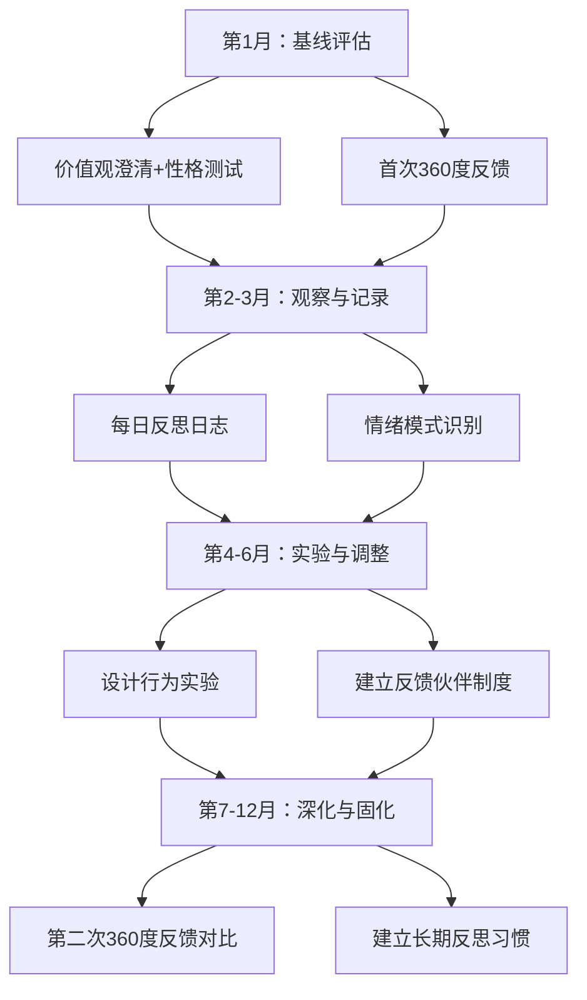
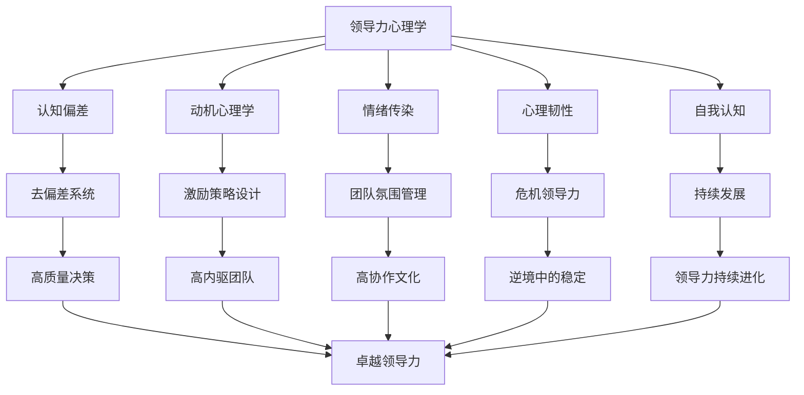

## 八、领导力心理学

领导力的本质是影响他人的能力，而影响的前提是理解——理解人的思维如何运作、动机如何产生、情绪如何传播、韧性如何建立、自我如何被感知。领导力心理学不是一门玄学，而是一套基于实证研究的系统框架，帮助领导者在人性的底层逻辑上构建影响力。

本章从五个维度展开：认知偏差（你如何思考）、动机心理学（他人为什么行动）、情绪传染（团队氛围如何形成）、心理韧性（逆境中如何保持效能）、自我认知（你如何看待自己以及他人如何看待你）。每个维度都遵循"理论→机制→实操→工具"的路径，确保从认知到行动的完整闭环。

### 8.1 认知偏差与领导力决策

#### 8.1.1 为什么领导者必须理解认知偏差

丹尼尔·卡尼曼（Daniel Kahneman）在《思考，快与慢》中提出了人类思维的双系统模型：系统1是快速、直觉、自动的思维方式；系统2是缓慢、理性、需要努力的思维方式。领导者在高压环境下大量依赖系统1做决策，这使得认知偏差成为影响决策质量的最大隐形杀手。

认知偏差不是"不够聪明"的表现，而是人类大脑进化的产物——它在远古环境中帮助我们快速做出生存决策，但在现代组织的复杂环境中往往导致系统性错误。

#### 8.1.2 领导者最常踩的八大认知偏差

**确认偏差（Confirmation Bias）**

倾向于寻找、解释和记忆支持自己已有观点的信息，同时忽略或贬低相反的证据。

运作机制：大脑在接收到符合已有信念的信息时会释放多巴胺，产生"我果然是对的"的愉悦感，这进一步强化了选择性接收信息的倾向。

领导者场景：CEO在评估一项战略决策时，只听取支持该战略的汇报，下意识地忽略了反对意见；招聘面试中，面试官在头30秒形成的印象会影响整场面试的提问方向和评分。

纠正方法：
- **魔鬼代言人制度**：在重大决策会议中指定专人负责提出反对意见
- **红队分析**：组建独立团队对决策方案进行攻击性审查
- **预设失败法（Pre-mortem）**：在执行决策前假设"这个项目已经失败了"，倒推可能的失败原因
- **强制信息多元化**：要求汇报必须包含至少30%的反对证据或风险信息

**光环效应（Halo Effect）**

因为某人在一个维度上表现出色，就自动推断其在其他维度上同样优秀。

运作机制：大脑倾向于用整体印象替代细致评估，一个突出的正面特征会"辐射"到对该人其他特征的评价上。

领导者场景：技术能力最强的工程师被提拔为技术总监，但忽略了其缺乏沟通能力和管理意愿；某次项目汇报表现突出的员工被默认为"什么都行"的人。

纠正方法：
- **结构化评估**：使用标准化的评估维度和评分标准，对每个维度独立打分
- **多人评估**：让不同视角的评估者独立评估同一个人
- **行为锚定**：评估基于具体行为事件而非整体印象
- **反向验证**：对于高潜力人才，故意寻找其薄弱环节

**沉没成本谬误（Sunk Cost Fallacy）**

因为已经投入了大量时间、金钱或精力而不愿意放弃，即使继续投入的预期回报为负。

运作机制：放弃已投入的资源会产生"损失感"，而人对损失的敏感度是对收益敏感度的2-2.5倍（前景理论），这使得"止损"在心理上极其困难。

领导者场景：已经投入2000万的项目明显方向错误，但CEO坚持"已经花了这么多钱不能白费"；一个明显不合适的员工因为已经入职两年而被继续留用。

纠正方法：
- **归零思考法**：假设今天是第一天接手这个项目/团队，你还会做出同样的选择吗？
- **定期项目审计**：每季度对所有在执行的项目进行独立评估，不考虑历史投入
- **设定止损线**：在项目启动时就预先定义"什么条件下必须停止"
- **换人评估**：让不了解项目历史的外部人员评估是否继续

**群体思维（Groupthink）**

团队为了维护内部和谐和一致性而压制不同意见，导致决策质量急剧下降。这个概念由心理学家欧文·贾尼斯（Irving Janis）在分析猪湾事件等重大决策失败后提出。

群体思维的八个症状：
1. 无敌幻觉：过度乐观，低估风险
2. 集体合理化：为决策寻找合理化的借口
3. 道德确信：认为团队的立场在道德上无懈可击
4. 刻板印象：将对手简单化、标签化
5. 从众压力：对持不同意见者施加压力
6. 自我审查：成员主动压抑自己的疑虑
7. 全体一致幻觉：沉默被误读为同意
8. 心理护卫：成员自发屏蔽外部负面信息

纠正方法：
- **制度化异议**：每次决策会议必须有专门的反对环节，由不同的人轮流担任反对者
- **匿名投票**：在讨论前先进行匿名投票，避免权威人物定调
- **外部引入**：定期邀请外部专家或跨部门人员参与决策讨论
- **领导后表态**：领导者在讨论中最后发言，避免率先定调

**可得性偏差（Availability Bias）**

根据最容易想到的信息来做判断，而非基于完整的数据集。

领导者场景：因为最近一次客户投诉的印象深刻，就过度投入客户服务改进，忽略了更严重但不那么"生动"的产品质量问题；因为某次裁员经历的创伤记忆，在需要人员优化时过度犹豫。

纠正方法：
- **数据驱动决策**：重大决策必须基于数据而非案例记忆
- **系统化信息收集**：使用检查清单确保信息来源的全面性
- **时间延迟**：在情绪化的事件后等待24-48小时再做决策

**锚定效应（Anchoring Effect）**

过度依赖第一次获得的信息（"锚点"），后续判断围绕这个锚点进行调整，但调整往往不充分。

领导者场景：谈判中先出价的一方设定了锚点；绩效评估中"去年的评分"成为今年评估的隐性锚点；预算编制以上年基数为锚点而非以实际需求为基准。

纠正方法：
- **主动设定锚点**：在谈判和评估中，先进行独立评估再参考外部信息
- **多锚点策略**：从多个独立来源获取参考信息
- **反向锚定**：从极端相反的角度重新思考问题

**幸存者偏差（Survivorship Bias）**

只关注成功案例而忽略失败案例，导致对成功概率和成功路径的严重误判。

领导者场景：只研究"成功企业的管理实践"，忽略了采用同样做法但失败的企业；看到某个辍学创业成功的故事就低估教育的价值。

纠正方法：
- **主动收集失败案例**：建立"失败案例库"，系统分析失败的原因
- **基准率思维**：关注成功/失败的统计概率，而非个别极端案例
- **全面样本**：在分析行业趋势时，确保样本包含失败和退出的企业

**现状偏差（Status Quo Bias）**

倾向于维持现状，即使改变的预期收益明显高于维持现状。

领导者场景：组织架构多年未调整，即使业务已经发生根本性变化；明知某个流程低效但"大家都在用"就不去改变。

纠正方法：
- **定期"归零"审视**：每半年问一次"如果从零开始，我们还会这样设计吗？"
- **小步快跑**：通过小规模试点降低改变的心理门槛
- **可视化不改变的代价**：计算"维持现状一年后的机会成本"

#### 8.1.3 建立个人去偏差系统

| 环节 | 具体做法 | 频率 |
|------|----------|------|
| 决策前 | Pre-mortem分析、强制列举反对理由 | 每次重大决策 |
| 决策中 | 指定魔鬼代言人、使用结构化决策框架 | 每次决策会议 |
| 决策后 | 事后复盘、对比预期与实际结果 | 每月一次 |
| 日常训练 | 读反面观点、记录自己的判断失误 | 每日 |

### 8.2 动机心理学

#### 8.2.1 自我决定理论（Self-Determination Theory）

爱德华·德西（Edward Deci）和理查德·瑞安（Richard Ryan）提出的自我决定理论是当代动机心理学最有影响力的理论之一。该理论认为人类有三种基本心理需求，当这些需求被满足时，个体会产生内在动机——出于兴趣、好奇心和满足感而行动，而非依赖外部奖励或惩罚。

**三种基本心理需求**：

**自主性（Autonomy）**——对行为的掌控感

不是"想做什么就做什么"，而是"感觉自己的行动是出于自愿而非被迫"。即使在执行上级安排的任务时，如果员工能参与决策过程、拥有方法选择权、理解任务的意义，自主性需求仍然可以被满足。

领导实践：
- 传达"做什么"和"为什么"，把"怎么做"的决定权交给团队
- 提供选择而非命令："我们需要完成X目标，你觉得用A方案还是B方案？"
- 减少微观管理，关注结果而非过程
- 允许员工在工作时间内投入一定比例的自主项目

**胜任感（Competence）**——感觉自己能有效地应对环境

人类需要感觉到自己在成长、在掌握新技能、在有效应对挑战。过于简单的任务让人感到无聊，过于困难的任务让人感到挫败，最理想的挑战水平是"跳一跳够得着"。

领导实践：
- 根据员工能力水平匹配适当难度的任务
- 提供及时、具体、建设性的反馈
- 设计清晰的成长路径，让员工看到进步
- 创造"心流"条件：明确目标、即时反馈、技能与挑战匹配

**归属感（Relatedness）**——与他人建立有意义的连接

人类是社会性动物，需要感觉自己被关心、被重视、属于某个群体。归属感不是表面的团建活动，而是深层次的被接纳和被理解的感觉。

领导实践：
- 花时间了解每个团队成员的个人情况和职业目标
- 创造团队共同经历（不是只有工作，也包括共同面对困难）
- 在团队中建立互助而非内部竞争的文化
- 对每个人的贡献给予具体而非笼统的认可

#### 8.2.2 内在动机与外在动机的互动

**过度理由效应（Overjustification Effect）**

当外在奖励被引入到一个原本由内在动机驱动的活动中时，内在动机会被削弱。经典的实验：给本来喜欢画画的孩子金钱奖励后，他们画画的兴趣反而降低了。

领导陷阱：
- 把所有事情都与绩效奖金挂钩，导致员工失去对工作本身的兴趣
- 过度使用竞争排名，把合作变为零和博弈
- 对创新行为给予僵化的考核指标，扼杀探索精神

正确做法：
- 对于本身就有趣味和意义的工作，使用信息性反馈而非控制性奖励
- 奖励应追随行为而非诱导行为——在员工自发做出贡献后给予认可，而非用奖励来"购买"行为
- 将外在奖励定位为"感谢"而非"交换"

#### 8.2.3 麦克莱兰的成就动机理论

大卫·麦克莱兰（David McClelland）提出人类有三种后天习得的核心动机，不同的人有不同的动机组合：

**成就动机（Achievement Motivation）**——追求卓越、超越标准

高成就动机的人特征：喜欢中等难度的挑战（成功概率30%-50%）；偏好个人责任明确的任务；需要及时反馈来衡量进步；对金钱奖励的激励效果不如对成就感本身。

激励策略：提供清晰的目标和可衡量的里程碑；给予适度的自主权和挑战性任务；及时反馈进展；让他们看到自己工作的影响。

**亲和动机（Affiliation Motivation）**——建立和维护良好人际关系

高亲和动机的人特征：重视被接纳和认可；偏好合作而非竞争；在冲突环境中感到不适；为了关系和谐可能回避必要的冲突。

激励策略：营造温暖的团队氛围；提供合作型的工作任务；在团队中公开认可其贡献；帮助其发展处理冲突的能力。

**权力动机（Power Motivation）**——影响和控制他人

权力动机分为两种类型：
- 个人化权力：追求个人地位和控制，倾向于积累和展示权力
- 社会化权力：追求通过影响他人来实现更大的目标，倾向于赋能他人

激励策略：对社会化权力动机者，提供领导机会和更大的影响范围；对个人化权力动机者，需要设定边界同时引导其将权力用于建设性方向。

#### 8.2.4 期望理论（Expectancy Theory）

维克多·弗鲁姆（Victor Vroom）的期望理论认为，一个人的行为动机取决于三个因素的乘积：

动机强度 = 期望（E）× 手段（I）× 效价（V）

- **期望（Expectancy）**："如果我努力，我能达到目标吗？"——对努力-绩效关系的信念
- **手段（Instrumentality）**："如果我达到目标，我会得到奖励吗？"——对绩效-结果关系的信念
- **效价（Valence）**："这个奖励对我有价值吗？"——对结果的偏好程度

三个因素中任何一个接近零，动机就会消失。领导者的任务是同时优化三个因素：
- 提升期望：提供培训、资源、支持，让员工相信目标可达
- 强化手段：建立清晰、公平、可信的绩效-奖励链接
- 匹配效价：了解每个员工真正看重什么，提供个性化的激励

#### 8.2.5 动机诊断与干预矩阵

| 动机问题 | 可能原因 | 诊断方法 | 干预策略 |
|----------|----------|----------|----------|
| 不愿尝试 | 期望低（认为做不到） | 询问对目标可行性的看法 | 降低难度、分解任务、提供技能培训 |
| 尝试但不坚持 | 手段低（认为做了也没用） | 检查过往承诺是否兑现 | 建立可靠的绩效-奖励链接 |
| 完成但无热情 | 效价低（奖励不是想要的） | 了解个人核心驱动力 | 匹配个性化的激励方式 |
| 表面努力 | 内在动机缺失 | 观察是否只在被监督时才努力 | 增强自主性、胜任感、归属感 |

### 8.3 情绪传染与团队氛围

#### 8.3.1 情绪传染的科学基础

情绪传染（Emotional Contagion）是指一个人的情绪状态通过面部表情、语音语调、身体语言和行为方式"传染"给周围的人。纽约大学的研究者Sigal Barsade通过实验证明，仅仅一个团队成员的情绪就能显著影响整个团队的情绪状态、合作行为和工作绩效。

神经科学基础：镜像神经元（Mirror Neurons）系统使人类在观察他人情绪表达时会自动激活自己的相关情绪脑区，产生"共鸣"体验。这个过程大部分是无意识的——你甚至不会意识到自己被他人的情绪影响了。

**领导者的放大器效应**：由于领导者在组织中拥有更高的可见度、关注度和权力地位，其情绪状态对团队的影响被显著放大。研究显示，领导者的面部表情和肢体语言被团队成员关注的频率是普通成员的5-7倍。

#### 8.3.2 正面情绪传染的机制与实践

**正面情绪传染路径**：

加州大学洛杉矶分校Barbara Fredrickson的"拓展-建构理论"（Broaden-and-Build Theory）表明，正面情绪不仅让人感觉好，还会拓展人的思维广度和行为选择，建构持久的心理资源（如韧性、社会关系、创造性问题解决能力）。

实践方法：
- **情绪启动**：在团队会议开始时花2-3分钟分享积极消息或小成就
- **庆祝微胜利**：不要等到项目结束才庆祝，识别和庆祝过程中的小进展
- **正面反馈优先**：保持正面反馈与建设性反馈至少3:1的比例
- **叙事领导力**：用鼓舞人心的故事来传递愿景，而非只有数据和指标

#### 8.3.3 负面情绪的管理与转化

负面情绪传染的杀伤力更大：研究表明，负面情绪的传染速度是正面情绪的3-5倍，持续时间也更长。一次领导者的愤怒发作可能需要5-7次正面互动才能消除其影响。

**负面情绪管理框架**：

1. **觉察（Awareness）**——在情绪爆发前识别它
   - 身体信号：心跳加速、肌肉紧张、呼吸变浅
   - 思维信号：绝对化思维（"总是""永远"）、灾难化思维
   - 行为信号：想要摔东西、提高音量、离开

2. **暂停（Pause）**——给自己一个缓冲
   - "6秒法则"：杏仁核驱动的情绪冲动在6秒后开始衰减
   - 实操：感到愤怒时深呼吸3次、倒杯水、去洗手间
   - 延迟反应："这个我需要想一想，稍后回复你"

3. **重新评估（Reappraisal）**——换一个角度看
   - "他不是在针对我，他只是在表达挫败感"
   - "这个错误虽然严重，但也是一个学习机会"
   - "压力是暂时的，这个问题是有解决方案的"

4. **表达（Expression）**——以建设性的方式沟通
   - 使用"我"语句而非"你"语句："我对这个结果感到担忧"而非"你让我很失望"
   - 描述行为而非评判人格："这份报告中有三处数据错误"而非"你太粗心了"
   - 提供方向而非只有批评："我们需要在下周前修正这些数据"而非"这太糟糕了"

#### 8.3.4 团队情绪地图

领导者需要定期感知团队的情绪状态。以下是一个简单的诊断工具：

| 维度 | 观察指标 | 健康信号 | 预警信号 |
|------|----------|----------|----------|
| 能量 | 会议参与度、语言活跃度 | 积极发言、热烈讨论 | 沉默、走神、频繁请假 |
| 情绪基调 | 面部表情、互动方式 | 微笑、开玩笑、主动帮助 | 烦躁、回避、抱怨增多 |
| 协作意愿 | 信息分享、跨团队合作 | 主动分享、乐于协助 | 信息囤积、推诿责任 |
| 压力水平 | 工作时长、错误率 | 稳定产出、合理加班 | 持续加班、错误频发 |

### 8.4 心理韧性与逆境领导

#### 8.4.1 什么是心理韧性

心理韧性（Psychological Resilience）不是"硬扛"或"麻木不仁"，而是在面对压力、挫折、创伤和不确定性时，能够有效应对、适应和恢复的能力。高心理韧性的领导者不是不会感到压力和痛苦，而是能够在痛苦中保持功能、在混乱中找到方向、在失败后快速恢复。

心理学家Ann Masten将心理韧性称为"普通魔法"（Ordinary Magic）——它不是少数人拥有的超能力，而是大多数人都可以发展的心理能力。

#### 8.4.2 心理韧性的4C模型

英国学者Peter Clough和Doug Sutherland提出的4C模型是目前应用最广泛的心理韧性框架之一：

**控制（Control）**——情绪控制和生活控制

情绪控制：在压力下能管理自己的情绪反应，不被情绪淹没。不是压抑情绪，而是能够选择在何时、以何种方式表达情绪。

生活控制：感觉自己能对生活中发生的事情产生影响，而非完全被环境摆布。

发展方法：
- 冥想和正念练习（每天10-15分钟即可产生显著效果）
- 识别"影响圈"和"关注圈"：将精力集中在自己能控制的事情上
- 建立日常仪式感：在不确定的环境中创造可控的小秩序

**承诺（Commitment）**——对目标的坚持和对生活的投入

高承诺的人能够全身心投入当前的任务和目标，不轻易被干扰或放弃。他们知道自己要什么，也知道为什么要。

发展方法：
- 将大目标分解为可管理的小目标，每个小目标都有明确的完成标准
- 定期重新连接目标的意义："我做这件事最终是为了什么？"
- 使用"如果-那么"计划（Implementation Intentions）预设应对障碍的方案

**挑战（Challenge）**——将困难视为成长机会

高挑战取向的人把变化和困难视为生活的一部分，甚至视为成长的机会，而非威胁。他们对舒适区之外的事物感到好奇而非恐惧。

发展方法：
- 刻意练习"认知重构"：每遇到困难，强制自己找出至少3个可能的积极面
- 记录"成长日志"：定期回顾从困难中学到了什么
- 主动接受适度挑战：从小的挑战开始，逐步建立"我能做到"的信心

**信心（Confidence）**——对自身能力的信念

高信心的人相信自己有能力完成任务、影响他人、在困难面前坚持。这不是盲目自信，而是基于过往经验和能力积累的真实信念。

发展方法：
- 记录"成功清单"：定期回顾自己克服困难的经历
- 刻意练习"能力区扩展"：主动在新领域积累成功经验
- 使用"力量组合"策略：将新挑战与已有优势结合

#### 8.4.3 领导者的韧性日课

| 时间 | 实践 | 时长 | 目的 |
|------|------|------|------|
| 早晨 | 冥想/正念呼吸 | 10分钟 | 建立情绪控制基线 |
| 早晨 | 回顾今日最重要的3个目标 | 5分钟 | 强化承诺和方向感 |
| 工作中 | 对困难事件进行"积极重评" | 随时 | 训练挑战取向 |
| 工作中 | 记录一次"小胜利" | 2分钟 | 积累信心素材 |
| 晚间 | 3件事感恩练习 | 5分钟 | 培养正面情绪基调 |
| 晚间 | 复盘：今天从什么困难中学到了什么？ | 10分钟 | 将经验转化为成长 |
| 每周 | 一次30分钟以上的运动 | 30分钟+ | 生理层面的压力释放 |

#### 8.4.4 危机中的领导力韧性

危机是心理韧性的终极检验。在危机中，领导者的反应速度、情绪稳定性和决策质量直接影响整个组织的存亡。

**危机领导力的五步框架**：

1. **暂停与评估（Stop & Assess）**
   - 不要立即反应，花几分钟评估情况
   - 问自己："我现在掌握了哪些事实？还有哪些关键信息缺失？"
   - 区分"紧急"和"重要"——危机中很多紧急的事未必重要

2. **稳定情绪（Stabilize）**
   - 接受"不确定性是危机的常态"
   - 使用箱式呼吸法（吸4秒-屏4秒-呼4秒-屏4秒）平复生理应激
   - 提醒自己："现在的感觉是正常的压力反应，不代表情况真的失控了"

3. **沟通核心信息（Communicate）**
   - 即使信息不完整，也要及时沟通——沉默比不确定更可怕
   - 框架："这是我们目前知道的...这是我们正在做的...这是我们接下来要做的..."
   - 承认不确定性："我们还不知道X，但我们正在全力确认"

4. **行动与调整（Act & Adapt）**
   - 采用70%信息法则：不需要等到掌握100%的信息才行动
   - 建立快速反馈循环：每小时/每天评估行动效果并调整
   - 保持灵活：危机中没有完美的计划，只有不断迭代的行动

5. **恢复与学习（Recover & Learn）**
   - 危机过后不要急于"翻篇"，留出时间进行复盘
   - 识别：哪些能力帮助我们度过了危机？哪些不足被暴露了？
   - 将危机中建立的能力固化为组织的长期能力

### 8.5 自我认知：领导力的底层操作系统

#### 8.5.1 为什么自我认知是领导力的基石

组织心理学家Tasha Eurich的研究发现，虽然95%的人认为自己有自我认知，但实际上只有大约10%-15%的人真正具备。更关键的是，自我认知是领导力的"乘数效应"——没有自我认知，其他领导力技能的效果会大打折扣。

自我认知分为两个维度：
- **内部自我认知（Internal Self-Awareness）**：了解自己的价值观、情绪、动机、优势、劣势和行为模式
- **外部自我认知（External Self-Awareness）**：了解他人如何看待自己

令人意外的是，这两个维度之间几乎没有相关性——你可以很了解自己但完全不知道别人怎么看你，反之亦然。最有效的领导者在两个维度上都表现出色。

#### 8.5.2 内部自我认知的深度开发

**价值观澄清练习**

价值观是决策的底层操作系统。当你的行为与价值观一致时，你会感到充实和有力；当两者冲突时，你会感到内耗和迷茫。

练习步骤：
1. 列出10个对你最重要的价值观（如诚信、成长、自由、安全感、影响力、创造力、家庭、健康、公平、卓越）
2. 如果只能保留5个，你会留下哪些？为什么？
3. 如果只能保留3个呢？
4. 对剩下的每个价值观，描述一个你活出这个价值观的具体场景
5. 回顾过去一年的重大决策，检验它们是否与你识别出的核心价值观一致

**情绪模式地图**

不是简单地问"你现在感觉如何"，而是识别反复出现的情绪模式：

| 识别维度 | 具体问题 |
|----------|----------|
| 触发器 | 什么样的情境最容易引发我的强烈情绪？ |
| 情绪类型 | 我最常体验到的情绪是什么？（焦虑、愤怒、沮丧、兴奋） |
| 身体信号 | 我的身体如何表达不同的情绪？（紧绷、心跳加速、胃不舒服） |
| 行为反应 | 我在不同情绪下倾向于做什么？（回避、攻击、过度工作、拖延） |
| 恢复方式 | 什么方法最有效地帮助我从负面情绪中恢复？ |

**优势与盲点诊断**

Tasha Eurich建议使用"什么"而非"为什么"的问题来自我反省。例如，不要问"我为什么总是焦虑？"（容易陷入反刍思维），而是问"什么情况让我感到焦虑？焦虑的时候我会做什么？什么方法能帮我缓解？"

常用工具：
- 盖洛普优势识别器（CliftonStrengths）
- MBTI / 大五人格测试（了解倾向性，不作为标签）
- 反思日志：每天花5分钟记录"今天什么事让我感觉最好/最差？为什么？"

#### 8.5.3 外部自我认知的获取

**360度反馈**

系统性地从上级、同级、下属和外部合作伙伴获取反馈。

实施要点：
- 选择匿名方式以获得更真实的反馈
- 问题要具体："在上次会议中，我的表达是否清晰？"比"我沟通能力如何？"更有效
- 重点不在于每条反馈的准确性，而在于多个反馈中反复出现的主题
- 接受反馈后不要急于辩解，先消化24小时再回应

**反馈伙伴制度**

找一个你信任且愿意对你说真话的人，建立定期反馈机制。约定：
- 每月一次正式的反馈对话
- 对方有权利在任何时间指出你的盲点
- 你的角色是倾听和感谢，不辩解
- 每次对话后记录关键洞察并制定改进行动

**行为实验**

如果你怀疑自己在某个方面有盲点，可以设计小实验来验证：
- 你觉得"我在会议上说太多了"？下次会议记录自己的发言时间和次数
- 你觉得"我对反馈不够开放"？请同事在下次会议后给你一个建设性批评，观察自己的第一反应
- 记录实验结果，用数据而非感觉来更新自我认知

#### 8.5.4 自我认知的四大陷阱

| 陷阱 | 表现 | 纠正方法 |
|------|------|----------|
| 过度自信 | 高估自己的能力和判断力，低估风险 | 主动寻找反面证据，使用概率思维 |
| 盲点失明 | 看不到自己的偏见和局限性 | 多元反馈渠道，定期接受外部评估 |
| 防御机制 | 将反馈视为攻击而非信息 | 培养"反馈即礼物"的心态，练习非反应性倾听 |
| 信息茧房 | 只听到支持自己的声音，自我认知基于不完整信息 | 主动接触不同观点，选择会说真话的人靠近 |
| 反刍思维 | 过度自我反省变成焦虑和自我批评 | 使用"什么"而非"为什么"的反省方式，设定反思时间上限 |

#### 8.5.5 自我认知发展路线图

### 8.6 综合应用：领导力心理学实践框架

#### 8.6.1 每周领导力心理自检清单

每周花15分钟回答以下问题：

- **认知**：本周我做的最重要的决策中，有没有可能受到认知偏差的影响？
- **动机**：我是否了解团队成员目前的核心动机和需求？做了什么来满足这些需求？
- **情绪**：本周我给团队传递了什么样的情绪基调？我是否有情绪失控的时刻？
- **韧性**：本周遇到了什么挑战？我如何应对的？从中学到了什么？
- **自我认知**：本周有没有收到让自己意外的反馈？我如何处理的？

#### 8.6.2 领导力心理学核心知识图谱

#### 8.6.3 本章核心要点回顾

1. **认知偏差是系统性的，不是偶然的**——每一位领导者都会受到认知偏差的影响，关键是建立系统性的去偏差机制
2. **动机不是单一维度的**——理解自主性、胜任感、归属感三大需求，以及成就、亲和、权力三大动机，才能精准激励
3. **情绪传染是真实的，而且领导者的影响被放大**——你的每一个表情和语调都在无形中塑造团队氛围
4. **心理韧性是可以训练的**——通过控制、承诺、挑战、信心四个维度的刻意练习，每个人都可以提升韧性
5. **自我认知需要刻意经营**——它不会自然产生，需要主动寻求反馈、持续反思、勇于面对盲点
