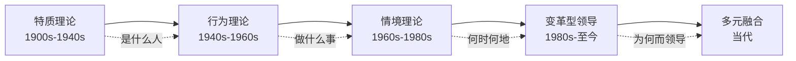
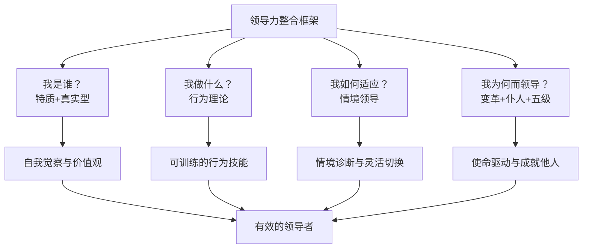
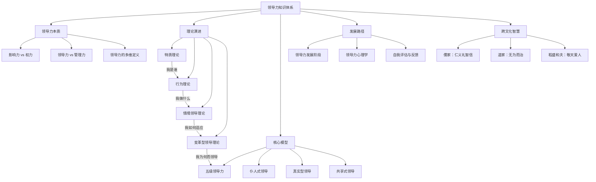

## 十、总结与整合

前九节分别从领导力的定义、特质、行为、情境适应、变革驱动、经典模型、发展路径、心理学机制和东方智慧等多个维度展开了论述。每一节都像是拼图的一块碎片——单独看有其价值，但只有拼在一起，才能看到领导力的完整图景。本节的核心任务就是完成这幅拼图：建立一个整合性的理论框架，让你不仅理解每一种理论"说了什么"，更理解它们之间"如何关联"以及"何时使用"。

---

### 10.1 理论演进的内在逻辑

领导力理论的发展并非随机的，而是沿着一条清晰的逻辑线索演进。理解这条线索，能帮助你把握整个知识体系的骨架。

#### 10.1.1 四次范式转移

领导力研究在过去一百多年中经历了四次重大的范式转移：

**第一次：从"天生的领导者"到"可培养的技能"（1900s-1940s）**

特质理论（Trait Theory）率先登场。早期研究者如斯托格迪尔（Stogdill）试图回答一个直觉性的问题："领导者和非领导者有什么不同？"他们列出了一长串特质——智力、自信、决断力、正直——试图找到"领导者的基因密码"。

然而，特质理论遭遇了根本性困境。斯托格迪尔本人在1948年的综述中指出：没有任何一组特质能在所有情境下区分领导者和非领导者。一个在战场上果断的将军，可能在和平时期的外交谈判中一败涂地。特质理论的失败不是因为它说错了什么，而是因为它遗漏了太多——它只看了领导者"是什么人"，没有看领导者"做了什么"，也没有看领导者所处的"环境是什么"。

**第二次：从"是什么人"到"做什么事"（1940s-1960s）**

行为理论（Behavioral Theory）将研究焦点从领导者的内在特质转向外在行为。俄亥俄州立大学的研究识别出"定规"（Initiating Structure）和"关怀"（Consideration）两个核心维度；密歇根大学的研究区分了"生产导向"和"员工导向"；布莱克和莫顿的管理方格将这两个维度交叉，形成了五种典型的领导风格。

行为理论的核心贡献在于它打开了"领导力可以学习"这扇门。如果领导力是一组行为，那么任何有意愿的人都可以通过训练来掌握这些行为。但行为理论也有盲区——它假设存在一种"最佳"的领导行为，忽略了情境因素。

**第三次：从"一种最佳方式"到"因时因地而变"（1960s-1980s）**

情境领导理论（Situational Leadership）打破了"最佳风格"的迷思。赫塞和布兰查德提出，有效的领导行为取决于下属的成熟度（能力+意愿）；菲德勒的权变模型指出，领导效能取决于领导风格与情境控制力的匹配；路径-目标理论强调领导者要根据下属特征和任务性质选择不同的行为方式。

这一范式的核心洞察是：**没有放之四海而皆准的领导法则，只有与情境匹配的领导行为。** 但它的局限在于过于关注"适应"，缺乏对"引领变革"的思考。

**第四次：从"适应现状"到"创造未来"（1980s-至今）**

变革型领导（Transformational Leadership）和交易型领导（Transactional Leadership）理论开启了新的维度。伯恩斯和巴斯的研究表明，最高层次的领导力不是在现有框架内优化，而是通过愿景、激励和个性化关怀来改变追随者的信念和价值观，让他们超越自我利益，为更高的目标而奋斗。

在此之后，领导力研究进入百花齐放的阶段：真实型领导强调自我觉察和价值观一致性；仆人式领导强调领导者的服务心态；共享式领导强调领导力在团队中的分布；敏捷领导力回应快速变化的商业环境。这些理论并非替代关系，而是从不同角度丰富了领导力的全貌。

#### 10.1.2 演进的核心趋势

将四次范式转移放在一起看，可以提炼出三个核心趋势：

| 趋势 | 从 | 到 | 含义 |
|------|-----|-----|------|
| 关注点转移 | 领导者本身 | 领导者-追随者-情境的互动系统 | 领导力不是一个人的事，而是关系和系统的产物 |
| 可塑性认知 | 天赋决定论 | 发展可塑论 | 领导力可以通过学习、训练和经验积累来提升 |
| 价值导向 | 效率和控制 | 意义和赋能 | 现代领导力的核心不是管控，而是激发人的潜能 |

---

### 10.2 七大理论流派的深度对比

仅有演进逻辑还不够，还需要对各理论流派进行横向对比，理解它们的互补关系。

#### 10.2.1 核心理论对照表

| 维度 | 特质理论 | 行为理论 | 情境领导 | 变革型领导 | 五级领导力 | 仆人式领导 | 真实型领导 |
|------|---------|---------|---------|-----------|-----------|-----------|-----------|
| **核心观点** | 领导者有特定的个人特质 | 领导力是可学习的行为模式 | 根据情境调整领导风格 | 通过愿景和激励推动变革 | 谦逊品格+专业意志力 | 通过服务他人来领导 | 保持真实、透明和诚信 |
| **研究焦点** | 领导者"是谁" | 领导者"做什么" | 领导者"如何适应" | 领导者"如何改变他人" | 领导者"如何持久卓越" | 领导者"如何服务" | 领导者"如何做自己" |
| **核心能力** | 自信、智力、正直、魅力 | 定规行为、关怀行为 | 诊断、灵活切换 | 愿景、感召、智力激发、个性化关怀 | 谦逊、意志、自律 | 倾听、共情、治愈 | 自我觉察、内化道德观、平衡处理 |
| **优势** | 直觉明确，易于识别 | 可操作、可训练 | 灵活实用，适用面广 | 能激发深层动机和创造力 | 经实证验证，长期有效 | 建立深层信任和忠诚 | 建立真诚的关系和信任 |
| **局限** | 无法穷尽特质，忽略情境 | 假设"最佳风格"存在 | 需要准确诊断情境 | 可能被用于操纵 | 难以快速培养 | 可能被误解为软弱 | 真实性难以衡量和训练 |
| **适用场景** | 领导者选拔和评估 | 领导力培训和发展 | 日常管理和决策 | 组织变革和创新驱动 | 长期组织卓越 | 团队建设和人才培养 | 信任危机修复和文化建设 |
| **代表学者** | Stogdill, Kirkpatrick, Locke | Ohio State, Michigan, Blake-Mouton | Hersey-Blanchard, Fiedler, House | Burns, Bass, Avolio | Jim Collins | Robert Greenleaf | Bill George, Avolio & Gardner |

#### 10.2.2 理论间的互补关系

这些理论之间不是非此即彼的对立关系，而是多维度的互补关系。可以用一个"领导力的四个问题"框架来整合：

- **"我是谁？"——特质理论 + 真实型领导**：你的性格特质、价值观和自我认知是领导力的根基。不了解自己，就无法有效地领导他人。
- **"我做什么？"——行为理论**：将内在能力转化为外在可见的行为模式，是领导力提升的起点。
- **"我如何适应？"——情境领导**：根据下属成熟度、任务性质和环境特征灵活调整策略。
- **"我为何而领导？"——变革型领导 + 仆人式领导 + 五级领导力**：领导力的终极意义不在于控制，而在于成就他人和创造价值。

---

### 10.3 东西方领导力智慧的融合

第九节介绍了东方领导力智慧，这里需要将东西方的智慧进行系统性对比和融合，形成更完整的认知。

#### 10.3.1 核心理念对照

| 维度 | 西方主流理论 | 东方传统智慧 | 融合洞察 |
|------|-------------|-------------|---------|
| **领导力来源** | 能力、行为、情境匹配 | 德行、修养、以身作则 | 既需要专业能力，也需要人格魅力 |
| **领导目标** | 达成目标、推动变革 | 修身齐家治国平天下 | 目标达成和自我修炼并行不悖 |
| **与下属关系** | 管理、激励、赋能 | 仁爱、教化、感召 | 制度管理与情感关怀双轨并行 |
| **权力观** | 赋予权力、影响他人 | 太上不知有之 | 最好的领导是让人感觉不到被领导 |
| **决策方式** | 数据驱动、系统分析 | 中庸之道、全局观 | 理性分析与直觉智慧结合 |
| **面对失败** | 复盘、改进、迭代 | 塞翁失马、否极泰来 | 保持韧性，将失败视为成长机会 |

#### 10.3.2 稻盛和夫：东西融合的典范

稻盛和夫的经营哲学之所以值得特别关注，是因为它成功地将东西方智慧融合为一套可操作的体系。他的"成功方程式"——**人生·工作的结果 = 思维方式 × 热情 × 能力**——既有东方"正心诚意"的修养功夫（思维方式），也有西方"目标导向"的执行精神（热情和能力）。

稻盛和夫创办了京瓷和KDDI两家世界500强企业，78岁高龄又临危受命拯救破产的日本航空。他的实践证明：真正的领导力超越文化边界，东方的"德"与西方的"术"可以完美结合。

---

### 10.4 从理论到实践的转化路径

理论如果不落地，就是纸上谈兵。这一节将整个基础理论部分的内容，转化为可执行的行动框架。

#### 10.4.1 领导力发展的四阶段模型

将前面所有理论整合为一个递进的发展路径：

**阶段一：自我认知（对应特质理论 + 真实型领导）**

核心任务：了解自己的领导力特质、盲区和价值观。

具体行动：
- 完成至少两种标准化的领导力评估工具（如DISC、MBTI、盖洛普优势识别）
- 向5-10位同事和下属收集360度反馈
- 撰写一份个人领导力宣言：你的核心价值观是什么？你的领导风格是什么？你绝不妥协的底线是什么？
- 每月进行一次自我反思，记录关键决策背后的思考过程

**阶段二：行为训练（对应行为理论）**

核心任务：将认知转化为可见的行为模式。

具体行动：
- 选择2-3个你最薄弱的领导行为（如倾听、授权、反馈），制定专项训练计划
- 在每次团队会议后，用5分钟复盘：我今天的行为是否体现了我想要的领导风格？
- 寻找一位领导力导师或教练，定期讨论你的行为转变
- 录制自己的演讲或会议发言，回看分析自己的非语言行为

**阶段三：情境应用（对应情境领导理论）**

核心任务：根据具体情境灵活切换领导风格。

具体行动：
- 对每位直接下属，评估其能力-意愿矩阵，制定个性化的领导策略
- 建立一个"情境诊断清单"：遇到决策时，先问自己"这个问题的紧迫程度如何？""下属的能力水平如何？""团队的信任度如何？"
- 每季度重新评估一次团队成员的发展阶段，调整领导方式
- 记录你遇到的3-5个典型管理情境，分析你当时的选择是否最优

**阶段四：引领变革（对应变革型领导 + 五级领导力 + 仆人式领导）**

核心任务：从"适应现状"升级为"创造未来"。

具体行动：
- 为团队或组织制定一个3-5年的愿景蓝图，确保它既有激励性又可实现
- 建立"领导者服务于团队"的机制：每月与每位下属进行一次一对一的发展对话
- 培养谦逊与意志的平衡：在战略方向上坚定不移，在方法和态度上保持开放
- 启动至少一个变革项目，全程实践变革型领导的四个维度（愿景感召、智力激发、个性化关怀、理想化影响）

#### 10.4.2 领导力能力雷达图

用以下维度定期自评（1-10分），追踪你的领导力发展轨迹：

| 能力维度 | 对应理论 | 自评分 | 行动计划 |
|---------|---------|-------|---------|
| 自我觉察 | 真实型领导 | ___ | 了解自己的优势、盲区和触发点 |
| 价值观一致性 | 真实型领导 | ___ | 言行一致，坚守核心价值观 |
| 沟通能力 | 行为理论 | ___ | 清晰表达、积极倾听、有效反馈 |
| 情境诊断 | 情境领导 | ___ | 准确评估下属成熟度和环境特征 |
| 灵活应变 | 情境领导 | ___ | 根据情境切换领导风格 |
| 愿景构建 | 变革型领导 | ___ | 描绘令人信服的未来图景 |
| 激励能力 | 变革型领导 | ___ | 激发他人超越自我的动力 |
| 谦逊品格 | 五级领导力 | ___ | 归功于外，承担责任 |
| 服务精神 | 仆人式领导 | ___ | 优先考虑团队成员的成长和福祉 |
| 德行修养 | 东方智慧 | ___ | 修身正己，以身作则 |

建议每3个月做一次自评，绘制雷达图，观察自己的成长轨迹。

---

### 10.5 常见认知误区与纠偏

在整合所有理论后，学习者最容易陷入以下误区：

#### 误区一："找到最适合我的理论就够了"

很多学习者在了解各种理论后，会选择一种"最符合自己直觉"的理论，然后排斥其他理论。比如，性格内向的人可能偏好仆人式领导，认为其他理论都太"强势"；性格外向的人可能偏好变革型领导，认为仆人式领导太"被动"。

**纠偏**：每一种理论都有其独特的价值和适用场景。领导力不是非此即彼的选择题，而是因时因地而变的应用题。你需要的不是"选一种理论"，而是"建立一个理论工具箱"——面对不同的人、不同的事、不同的环境，灵活调用不同的理论工具。

#### 误区二："理论学完了，领导力就提升了"

这是"知识幻觉"——读了很多领导力书籍，感觉自己已经"懂了"，但在实际工作中行为没有任何改变。领导力不是知识，而是能力。能力只能通过实践来获得，就像游泳不能通过阅读游泳教材来学会。

**纠偏**：每学完一个理论，立刻问自己三个问题："这个理论对我当下的工作有什么启发？""我明天可以做出什么不同的行为？""我如何衡量这个行为是否有效？"然后真正去执行，并在执行中修正。

#### 误区三："领导力只适用于管理者"

很多人认为"我不是管理者，领导力跟我无关"。这是一个根本性的误解。领导力的本质是影响力，而影响力存在于一切人际互动中——你在项目中说服同事支持你的方案，这是领导力；你在家庭中引导孩子建立正确的价值观，这是领导力；你在社区中组织邻里解决公共问题，这也是领导力。

**纠偏**：把领导力理解为"影响他人朝积极方向发展的能力"，而非"管理下属的能力"。从你当前的位置开始实践，不需要等一个"领导"头衔。

#### 误区四："好的领导应该对所有人都一样"

基于行为理论的"最佳风格"思维，很多学习者试图找到一种"公平"的领导方式，对所有人一视同仁。但情境领导理论告诉我们，公平不等于相同——对一个经验丰富但缺乏信心的员工和一个新手但充满热情的员工采用完全相同的方式，对两者都不公平。

**纠偏**：真正的公平是根据每个人的需求和发展阶段，提供最适合的支持和挑战。一个成熟的员工需要的是授权和信任，一个新手需要的是指导和结构化支持。

#### 误区五："东方智慧太虚，不如西方理论实用"

一些具有工程或商业背景的学习者认为东方领导力智慧（如"仁""道""无为而治"）过于抽象，不如西方理论的模型和工具有操作性。

**纠偏**：东方智慧的价值在于提供了西方理论较少涉及的"心性修炼"维度。德鲁克说过"管理的本质是激发善意"，这与儒家的"仁"和仆人式领导的服务精神高度一致。将东方智慧理解为领导力的"内功"，西方理论是"招式"——没有内功的招式是花架子，没有招式的内功是空谈。

---

### 10.6 领导力知识体系全景图

最后，将整个基础理论部分的所有内容整合为一张全景图，帮助你建立完整的知识地图。

#### 10.6.1 知识层次总结

| 层次 | 内容 | 对应章节 | 学习目标 |
|------|------|---------|---------|
| 认知层 | 领导力的本质与定义 | 第一节 | 纠正"领导力=管理"的误解，建立准确的心智模型 |
| 理论层 | 特质、行为、情境、变革四大理论流派 | 第二至五节 | 理解理论演进逻辑，掌握各理论的核心观点和适用场景 |
| 模型层 | 五级领导力、仆人式领导、真实型领导等经典模型 | 第六节 | 掌握可直接应用的分析框架和评估工具 |
| 发展层 | 领导力发展理论和心理学机制 | 第七至八节 | 理解领导力成长的底层机制和心理过程 |
| 智慧层 | 东方领导力哲学 | 第九节 | 拓展视野，将东西方智慧融会贯通 |
| 整合层 | 理论融合与实践转化 | 本节 | 建立个人的整合性领导力框架，为实践奠定基础 |

---

### 10.7 进入实践前的最后检查清单

在进入下一章——"领导力提升工具箱"——之前，用以下清单检验你是否真正理解了基础理论部分：

- [ ] 你能用一句话解释"领导力和管理的区别"吗？
- [ ] 你知道特质理论为什么无法单独解释领导力吗？
- [ ] 你能说出行为理论的两个核心维度及其含义吗？
- [ ] 面对一个能力不足但意愿很强的新员工，你知道应该采用什么领导风格吗？
- [ ] 你能解释变革型领导的四个核心维度吗？
- [ ] 你知道五级领导力为什么强调"谦逊+意志"的结合吗？
- [ ] 你能说出仆人式领导和传统领导的根本区别吗？
- [ ] 你理解"真实型领导"中的"真实"具体指什么吗？
- [ ] 你能解释儒家的"仁"如何与现代领导力理论对接吗？
- [ ] 你有清晰的个人领导力发展计划吗？

如果以上10个问题中有3个以上答不上来，建议回看对应章节。领导力的理论基础就像盖房子的地基——地基不牢，上面的建筑越高越危险。

---

### 10.8 章节衔接：从理论到实践

本节完成了基础理论部分的最后一块拼图。回顾整个基础理论部分的核心脉络：

> 领导力的本质是影响力 → 影响力既来自特质也来自行为 → 行为需要根据情境灵活调整 → 最高层次的领导力是通过愿景和关怀驱动变革 → 东方智慧为领导力提供了"心性修炼"的维度 → 所有这些理论需要整合为一个有机的知识框架。

下一章将进入"具体方案"部分，把这些理论转化为可执行的行动：从领导力自我评估开始，到团队建设、决策方法、沟通技巧、授权赋能、激励方法、变革管理、教练式领导，最终汇入领导力实践项目。理论已经铺好了路，实践的大门即将打开。
