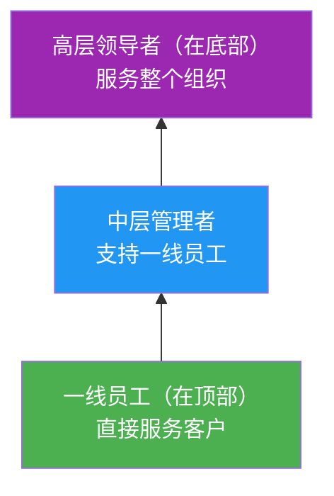
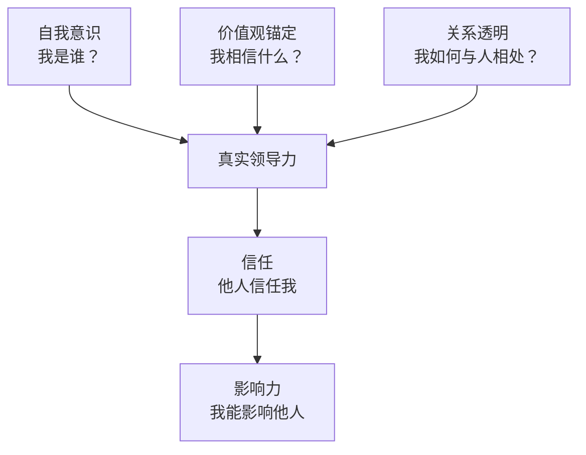
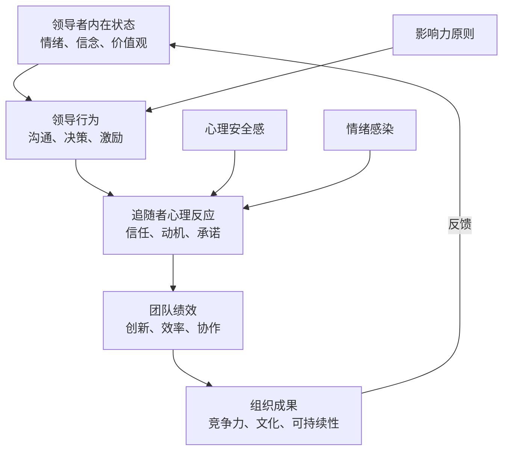
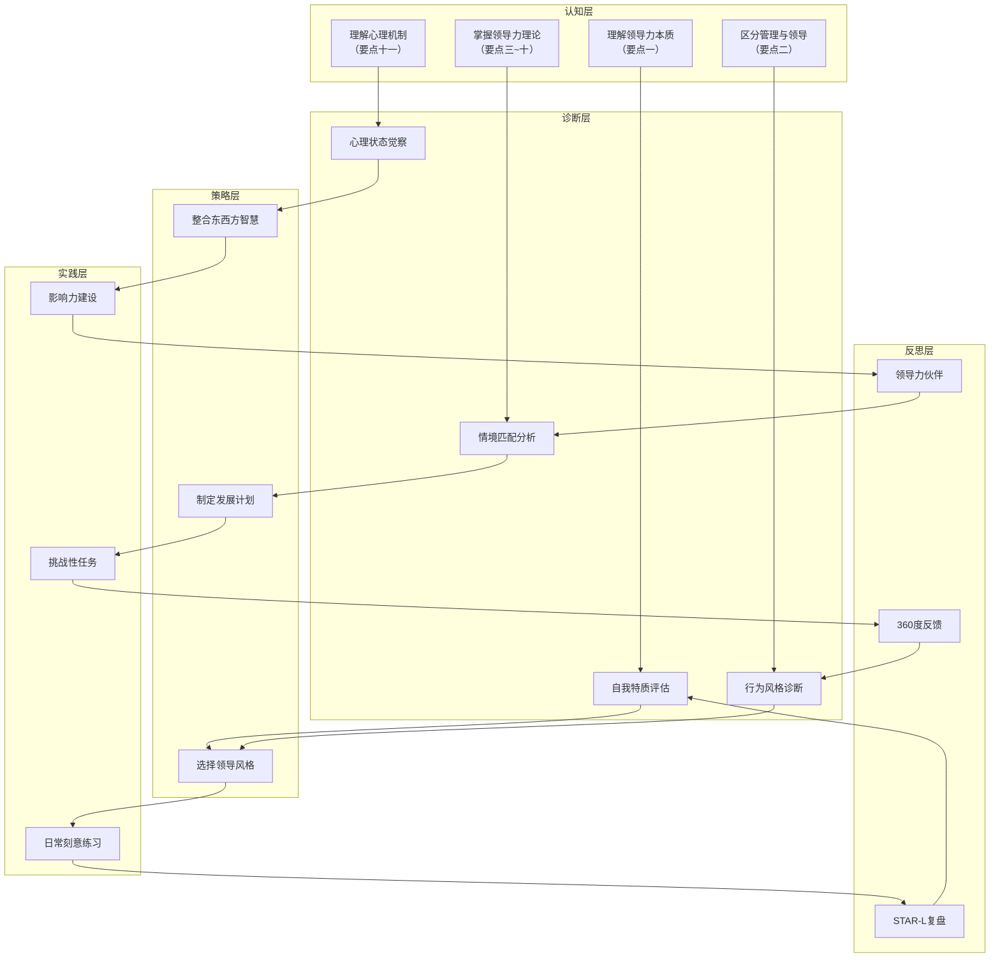

## 本章核心要点

领导力不是一套零散的知识点，而是一个从认知到实践的完整体系。本章从领导力的本质出发，依次梳理了特质理论、行为理论、情境领导、变革型领导以及多种领导力模型，融合了领导力心理学和东方智慧，最后落脚到发展路径。以下将这些内容提炼为十二个核心要点，每个要点不仅告诉你"是什么"，更告诉你"怎么用"和"避开什么坑"。

---

### 一、领导力的本质是影响力，而非权力

领导力最根本的定义是"影响他人朝共同目标努力的能力"（Northouse, 2022）。这个定义包含三个关键要素：**影响**（不是命令）、**共同目标**（不是个人私利）、**能力**（可以培养的技能）。这意味着领导力与职位无关——一个没有头衔的人可以拥有强大的领导力，而一个坐在高位上的人可能毫无领导力可言。

**理论基础**：约翰·麦克斯韦尔（John Maxwell）的"影响力法则"指出，领导力的唯一衡量标准就是影响力——不多也不少。加德纳（Howard Gardner）在《领导智慧》中进一步区分了"直接影响力"（面对面影响少数人）和"间接影响力"（通过制度、文化、符号影响多数人），现代领导者需要同时掌握两种影响力。

**实际案例**：在很多技术团队中，真正的"技术领袖"往往是那个没有管理头衔的高级工程师。当团队遇到技术分歧时，大家本能地看向他，不是因为他的职位，而是因为他的专业判断和过往积累的信任。Linus Torvalds 对 Linux 社区的影响力就完全建立在技术权威和项目愿景之上，而非任何行政权力。另一个案例是甘地——他从未担任过任何政府职务，却影响了整个印度的独立运动。

**影响力构建的四层模型**：

| 层级 | 来源 | 建立方式 | 持久性 |
|------|------|----------|--------|
| 第一层：职位影响力 | 组织授权 | 被任命为管理者 | 离职即消失 |
| 第二层：关系影响力 | 人际信任 | 持续帮助他人、兑现承诺 | 可持续数年 |
| 第三层：专业影响力 | 知识和技能 | 持续输出高质量成果、分享知识 | 长期有效 |
| 第四层：品格影响力 | 人格魅力和价值观 | 以身作则、长期一致的行为模式 | 终身有效 |

**实操建议**：
- 从你能影响的范围开始，不等任命。主动承担跨部门协调、组织知识分享、带领小型项目
- 建立专业权威：持续输出高质量的工作成果，让别人"遇到问题想找你"。具体做法：每周写一篇技术/行业洞察文章，每月做一次团队内部分享
- 培养关系账户：史蒂芬·柯维提出的"情感账户"概念——平时多帮助同事、多倾听、多给予正向反馈，这些"存款"在关键时刻会兑现。建议维护一个"关系地图"，标注与关键人物的关系状态和最近互动
- 从直接影响力开始：先影响身边3-5个人，再逐步扩大范围

**常见误区**：把"有权力"等同于"有领导力"。依赖权力驱动的领导往往在权力消失时立刻失去追随者。真正的领导力是即使你离开这个岗位，人们仍然愿意跟你走。另一个误区是试图同时影响所有人——影响力是逐层扩散的，先影响核心圈，再向外辐射。

---

### 二、管理与领导互补，缺一不可

管理应对复杂性——建立流程、分配资源、控制偏差；领导应对变革——指明方向、凝聚人心、推动突破。哈佛商学院教授约翰·科特（John Kotter）在《变革的力量》中明确区分了二者，指出它们不是对立关系，而是互补关系。一个组织需要管理来维持秩序，需要领导来推动变革。

**科特的领导与管理对比框架**：

| 维度 | 管理 | 领导 |
|------|------|------|
| 核心任务 | 应对复杂性 | 应对变革 |
| 制定议程 | 计划、预算（具体步骤和时间表） | 设立方向（愿景和战略） |
| 建立网络 | 组织、配置人员 | 联合、凝聚人心 |
| 执行计划 | 控制、解决问题 | 激励、鼓舞士气 |
| 结果 | 产生可预测的秩序 | 产生变革 |
| 时间框架 | 短期（季度/年度） | 长期（3-10年） |
| 风险态度 | 控制风险 | 承担风险 |

**实际案例**：杰克·韦尔奇在通用电气的成功，正是因为他同时具备强大的领导力和管理能力。他既能描绘"做第一或第二"的愿景（领导），又能通过六西格玛等管理体系将愿景落地（管理）。史蒂夫·乔布斯则是一个典型的"强领导弱管理"案例——他需要蒂姆·库克这样的管理高手来补充他的短板。比尔·盖茨早期也是"强领导弱管理"，后来通过引入史蒂夫·鲍尔默逐步补齐管理能力。

**自我诊断矩阵**：根据你的日常行为，判断你偏领导还是偏管理：

| 行为表现 | 偏领导 | 偏管理 |
|----------|--------|--------|
| 开会时 | 讨论方向和可能性 | 讨论进度和问题 |
| 遇到问题时 | 想"有没有更好的方向" | 想"怎么解决这个问题" |
| 做计划时 | 设定愿景和里程碑 | 分解任务和分配资源 |
| 对团队的关注 | "大家是否充满动力" | "大家是否在正确的轨道上" |
| 时间分配 | 思考、沟通、激励 | 检查、协调、优化流程 |

**实操建议**：
- 用上面的矩阵做自我诊断，找到你的倾向。偏领导的人要学会"落地"——把愿景分解为可执行的步骤；偏管理的人要学会"抬头"——定期从日常事务中抽身思考方向
- 在团队中搭配互补的人：如果你是愿景型领导，找一个执行力强的副手；如果你是管理型，找一个有远见的搭档
- 不同阶段侧重不同：初创期重领导（找方向），成熟期重管理（提效率），变革期重领导（破局），危机期重管理（稳定）
- 用"70-30法则"：无论你偏哪边，至少花30%的时间在另一边

**常见误区**：只谈愿景不建体系，或者只建体系不给方向。前者导致团队"激情满满但原地打转"，后者导致团队"高效地走向错误的方向"。还有一个误区是认为管理是"低级"的、领导是"高级"的——两者同等重要，只是作用不同。

---

### 三、特质可以培养，领导力不是天生的

特质理论告诉我们领导者有一些共性特质（自信、正直、热情、韧性等），但现代研究已经明确：这些特质不是基因决定的，而是可以通过后天刻意培养的。

**关键研究证据**：
- 斯托格迪尔（Ralph Stogdill, 1948）的元分析综述了124项研究，发现没有一组特质能一致地将领导者与非领导者区分开，但他也指出某些特质（智力、自信、决心、正直、社交能力）与领导效能有正相关
- 柯克帕特里克和洛克（Kirkpatrick & Locke, 1991）提出了"六大核心特质"：驱动力、领导动机、诚实与正直、自信、认知能力、商业知识。他们强调这些特质是"必要但不充分条件"——有特质不一定能成为好领导，但没有特质很难成为好领导
- Zenger Folkman对超过5万名领导者的360度评估数据分析表明，领导力效能与刻意发展行为的相关性极高，而与年龄、性别、职位的相关性极低

**领导力特质的可培养路径**：

| 核心特质 | 可培养程度 | 培养方法 | 培养周期 |
|----------|-----------|----------|----------|
| 自信 | 高 | 小步成功积累、技能提升、正向自我对话 | 3-6个月 |
| 正直 | 中 | 价值观澄清练习、言行一致的刻意坚持 | 6-12个月 |
| 韧性 | 高 | 压力训练、认知重构、建立支持网络 | 3-9个月 |
| 共情 | 高 | 主动倾听练习、换位思考日记、360度反馈 | 3-6个月 |
| 热情 | 中 | 找到使命感、与积极的人在一起、身体锻炼 | 1-3个月 |
| 决断力 | 高 | 决策框架训练、限时决策练习、复盘错误决策 | 3-6个月 |
| 社交能力 | 中-高 | 主动社交、加入社群、练习公开表达 | 6-12个月 |
| 智力 | 低-中 | 持续学习、批判性思维训练、跨领域阅读 | 长期 |

**实操建议**：
- 用上面的表格做自我评估，给每个特质打分（1-10），找到你最弱的2-3个，制定专项提升计划。比如缺乏公众表达能力，就加入演讲俱乐部（Toastmasters）；缺乏韧性，就从接受小挑战开始逐步升级
- 模仿你欣赏的领导者的行为模式，内化为自己的习惯。研究表明，"行为模仿"是学习领导行为最有效的方式之一（Bandura, 1977的社会学习理论）
- 不要试图"复制"别人，而是在自身基础上强化。内向型领导者同样优秀——苏珊·凯恩（Susan Cain）在《安静》中证明，内向型领导者在倾听、深度思考和一对一沟通方面有独特优势。关键是发挥自身优势，而非弥补所有短板

**常见误区**："我不是天生的领导者"——这是最大的自我设限。领导力是一组技能的集合，和学开车、学编程一样，需要练习。另一个误区是试图同时提升所有特质——聚焦2-3个最关键的短板，集中突破，比全面铺开效果好得多。

---

### 四、行为可以学习，风格可以切换

行为理论将领导力归结为两大维度：**任务导向**（关注目标达成）和**关系导向**（关注团队和谐）。研究表明，最有效的领导者在两个维度上都表现优秀。

**两大研究传统的发现**：

**俄亥俄州立大学研究（1940s-50s）**：通过"领导者行为描述问卷"（LBDQ），将领导行为分解为两个独立维度——"关怀"（Consideration）和"定规"（Initiating Structure）。研究发现，高关怀+高定规的领导者通常获得最高的团队满意度和绩效。

**密歇根大学研究（1950s-60s）**：将领导行为分为"员工导向"和"生产导向"。研究结论与俄亥俄州一致——同时关注员工和生产的领导者效果最好。

**布莱克和莫顿的管理方格（Managerial Grid, 1964）**：

高  9 | 1,9 |     |     |     | 9,9 |
关  8 |     |     |     |     |     |
心  7 |     |     |     |     |     |
人  6 |     |     |     |     |     |
的  5 |     |     | 5,5 |     |     |
程  4 |     |     |     |     |     |
度  3 |     |     |     |     |     |
    2 |     |     |     |     |     |
低  1 | 1,1 |     |     |     | 9,1 |
      +-----+-----+-----+-----+-----+
       低    2     3     4     5     高
              关心生产的程度 →

- **9,9型（团队型）**：高关心人 + 高关心生产，最理想的领导风格
- **9,1型（任务型）**：高关心生产 + 低关心人，效率高但员工流失大
- **1,9型（乡村俱乐部型）**：高关心人 + 低关心生产，氛围好但绩效差
- **5,5型（中庸型）**：两边都适中，不好不差
- **1,1型（贫乏型）**：两边都低，最差的领导风格

**实操建议**：
- 用"领导力行为日记"记录自己每天的领导行为，标注偏任务还是偏关系。坚持2-4周，你就能看到自己的行为模式
- 刻意练习你不擅长的维度：如果你总是任务导向，每天花15分钟和团队成员做非工作对话；如果你总是关系导向，练习在会议中直接指出问题而不是绕弯子
- 观察身边不同风格的领导者，分析他们的行为模式和效果。找3个你敬佩的领导者，每周记录一个你观察到的行为细节
- 用"情境-行为-结果"（SBR）框架复盘：今天的情境是什么？我做了什么行为？结果如何？

**常见误区**：认为只有一种"正确"的领导风格。事实上，纯粹的任务导向和纯粹的关系导向都有局限，灵活切换才是关键。另一个误区是把"关心人"等同于"讨好人"——真正的关系导向是帮助团队成员成长，而非避免一切冲突。

---

### 五、情境决定风格，没有万能药

赫塞-布兰查德（Hersey & Blanchard）的情境领导理论指出：最有效的领导风格取决于下属的**准备度**（能力+意愿的组合）。这个理论的核心洞察是——没有一种领导风格在所有情境下都有效。

**四种领导风格与四种准备度的匹配**：

| 下属准备度 | 能力 | 意愿 | 推荐风格 | 具体行为 | 典型场景 |
|-----------|------|------|----------|----------|----------|
| R1：没能力没意愿 | 低 | 低 | S1：指导式（高任务低关系） | 明确指令、密切监督、设定具体标准 | 新入职员工、被降级的员工 |
| R2：没能力有意愿 | 低 | 高 | S2：教练式（高任务高关系） | 解释决策原因、鼓励提问、给予情感支持 | 新手期的热情员工、转岗员工 |
| R3：有能力没意愿 | 高 | 低 | S3：支持式（低任务高关系） | 倾听顾虑、共同决策、提供认可 | 遇到瓶颈的老员工、经历挫折的骨干 |
| R4：有能力有意愿 | 高 | 高 | S4：授权式（低任务低关系） | 设定目标后放手、提供资源、信任 | 资深专家、高潜力人才 |

**实操案例**：一个新入职的程序员需要详细的代码规范和频繁的代码审查（S1指导式），而一个资深架构师只需要明确目标和截止日期（S4授权式）。用同一种方式对待两者，要么让新人感到被抛弃，要么让专家感到被冒犯。更微妙的是，同一个下属在不同任务上可能处于不同准备度——一个资深工程师在技术上是R4，但在带新人这件事上可能是R2。

**实操建议**：
- 对每个下属评估"能力×意愿"矩阵，匹配对应风格。建议每季度做一次正式评估，每月做一次快速检查
- 定期重新评估——人的状态是变化的。一个R2的新手可能在6个月后变成R4，但经历一次失败后可能退回到R3
- 不要把情境领导当作"控制下属的工具"，而是"帮助下属成长的脚手架"。目标是让每个下属最终达到R4
- 注意"意愿"不等于"态度"——一个态度积极但因缺乏资源而沮丧的下属，需要的是支持而非说教
- 与下属沟通你正在使用哪种风格，让他们理解你的意图。透明度能减少误解

**常见误区**：只用一种风格对待所有人，尤其是只用自己最舒适的那种。这是领导力失效的头号原因之一。另一个误区是把情境领导当作静态标签——人是动态变化的，同一个下属在不同任务、不同时期的准备度都不同。

---

### 六、变革需要愿景，也需要共情

变革型领导（Transformational Leadership）理论由伯恩斯（James MacGregor Burns, 1978）提出，后由巴斯（Bernard Bass, 1985）发展为完整的理论框架。它通过四个维度推动组织变革：

**四个维度详解**：

| 维度 | 定义 | 关键行为 | 案例 |
|------|------|----------|------|
| 理想化影响（Idealized Influence） | 以身作则，成为榜样 | 言行一致、承担风险、把团队利益放在个人利益之上 | 任正非在华为危机中把自己的股份稀释到不到1%，分配给员工 |
| 鼓舞性激励（Inspirational Motivation） | 描绘令人振奋的愿景 | 用简单有力的语言描述未来、在困难时刻传递信心 | 马斯克"让人类成为多星球物种"的愿景激励了SpaceX团队 |
| 智力激发（Intellectual Stimulation） | 鼓励创新和批判性思维 | 挑战假设、鼓励不同视角、容忍建设性失败 | 亚马逊的"逆向工作法"（Working Backwards）要求从客户需求倒推 |
| 个性化关怀（Individualized Consideration） | 关注每个人的成长需求 | 做导师而非监工、了解个人目标、提供定制化发展路径 | 奈飞（Netflix）的"人才密度"理念——为顶尖人才提供最优条件 |

**实际案例**：乔布斯回归苹果后，不是先砍产品线（那是管理），而是先描绘"Think Different"的愿景（那是领导）。他让工程师们相信自己在"改变世界"，而不是在"做一台电脑"。更具体地说，他用"现实扭曲力场"（Reality Distortion Field）激发团队挑战不可能——Macintosh团队成员安迪·赫兹菲尔德回忆说，乔布斯让他们相信自己在做"人类历史上最伟大的产品"。这种鼓舞性激励让团队突破了技术极限。

**变革型领导与交易型领导的对比**：

| 维度 | 变革型领导 | 交易型领导 |
|------|-----------|-----------|
| 激励方式 | 内在动机（使命感、成长） | 外在动机（奖惩、交换） |
| 关注点 | 愿景和方向 | 目标和绩效 |
| 关系模式 | 导师-追随者 | 买方-卖方 |
| 适用场景 | 变革期、创新期 | 稳定期、执行期 |
| 长期效果 | 组织文化变革 | 绩效达标 |

**实操建议**：
- 在推动变革前，先回答"为什么"——科特（Kotter）的变革八步模型的第一步就是"建立紧迫感"。人们需要知道变革的意义，否则他们会抵制
- 找到团队中的"早期采纳者"（约占15-20%），让他们成为变革的传教士。不要试图一次说服所有人，先影响那些愿意尝试的人
- 变革过程中关注个体感受，不要只盯着里程碑。用"变革曲线"（Kubler-Ross模型）理解人们在变革中的情绪反应：震惊→否认→愤怒→讨价还价→沮丧→接受→整合
- 持续沟通：科特指出变革失败的首要原因是"沟通不足"。同一个愿景需要反复沟通7次以上，人们才能真正理解和接受

**常见误区**：把变革型领导等同于"个人英雄主义"。变革型领导的核心是激发他人的内在动机，而不是自己冲锋陷阵。另一个误区是忽视变革中的"失去感"——对有些人来说，变革意味着失去熟悉的工作方式、关系和身份认同，承认这种失去感比强行推进行之有效得多。

---

### 七、谦逊是力量——五级领导力的悖论

柯林斯（Jim Collins）在《从优秀到卓越》中研究了1435家世界500强企业，最终找到11家实现了从"优秀"到"卓越"跨越的公司（15年间累计股票收益率超过市场平均水平3倍以上）。这些公司都有一个共同特征：它们的领导者是一种特殊类型——五级领导者。

五级领导者身上同时存在**极端的个人谦逊**和**强烈的职业意志**。他们不把功劳归于自己，但绝不放弃对卓越的追求。这个发现颠覆了"企业需要魅力型领袖"的主流认知。

**五级领导力的层级体系**：

| 层级 | 能力 | 典型表现 |
|------|------|----------|
| 第一级 | 能力出色的个人贡献者 | 用个人才能做出高质量贡献 |
| 第二级 | 有贡献的团队成员 | 为团队目标贡献个人能力，与他人协作 |
| 第三级 | 有能力的管理者 | 组织人力资源高效追求既定目标 |
| 第四级 | 高效的领导者 | 激发团队追求高绩效愿景和目标 |
| 第五级 | 卓越的领导者 | 谦逊品格 + 职业化意志，将个人谦逊与职业决心融为一体 |

**柯林斯的关键发现**：
- 对照组公司（未能实现跨越的公司）中，不乏拥有明星CEO的企业，但它们的卓越往往是短暂的——一旦明星离开，企业就回到平庸
- 五级领导者往往从内部晋升，而非外部空降
- 五级领导者更关注"谁"（先找对人）而非"什么"（先定方向）——"先人后事"原则

**实际案例**：达尔文·史密斯（Darwin Smith）担任金佰利CEO长达20年，将公司股票收益率做到了市场平均水平的4倍。他性格内向、低调，几乎不接受媒体采访，但在做出"出售造纸厂、全力投入消费品"的战略决策时展现出了钢铁般的意志。柯林斯评价他："他从不说'我做了什么'，总是说'我们做了什么'。"

**实操建议**：
- 成绩面前说"我们"，困难面前说"我"。这个简单的语言习惯能在潜移默化中建立信任
- 招聘和培养下属时，选择比你更优秀的人，不怕被超越。柯林斯指出，五级领导者最重要的决策之一就是"找到对的人上车"
- 建立"镜子与窗户"思维：出了问题看镜子（找自己的原因），取得成绩看窗户（归功于外在因素和团队）
- 用"贡献日志"追踪你每天的行为：哪些是为了个人荣耀？哪些是为了组织和团队的长远利益？

**常见误区**：把谦逊等同于软弱或缺乏主见。五级领导者的谦逊是"不居功"，不是"没立场"。面对核心价值观和战略方向，他们比任何人都坚定。另一个误区是认为五级领导力是"与生俱来的人格"——柯林斯的研究表明，五级领导力可以通过自我觉察和刻意练习逐步发展。

---

### 八、服务型领导——倒金字塔思维

罗伯特·格林利夫（Robert Greenleaf, 1970）提出了仆人式领导（Servant Leadership）的核心理念：领导者的首要角色是服务下属，帮助他们成长、成功。领导者的权力来自服务，而非来自控制。

**服务型领导的十大特征**（Larry Spears, 1996）：

| 特征 | 含义 | 实践表现 |
|------|------|----------|
| 倾听 | 主动倾听团队的声音 | 定期一对一沟通、不打断、不预判 |
| 共情 | 理解他人的感受和观点 | 站在下属角度思考问题 |
| 治愈 | 帮助他人克服困难和创伤 | 关注员工的情绪健康，提供支持 |
| 自我意识 | 了解自己的优势和局限 | 定期做360度反馈 |
| 说服力 | 用影响力而非权力推动决策 | 用数据和逻辑说服，而非命令 |
| 概念化 | 培养大局观和远见 | 定期从日常事务中抽身思考战略 |
| 前瞻性 | 预见未来趋势和挑战 | 建立定期的行业趋势扫描机制 |
| 管家精神 | 对组织资源负责 | 把组织利益放在个人利益之上 |
| 对人的承诺 | 相信每个人都有价值 | 投资于员工发展，包括可能离职的人 |
| 建设社区 | 创造归属感和协作文化 | 组织团建、建立互助机制 |

**实际案例**：星巴克前CEO霍华德·舒尔茨坚持为兼职员工提供医疗保险和股票期权。表面看增加了成本，实际上换来了极低的员工流失率（行业平均150%，星巴克约65%）和极高的服务质量，成为星巴克的核心竞争力。另一个案例是西南航空的赫布·凯莱赫（Herb Kelleher），他提出"员工第一，客户第二，股东第三"——看似违反直觉，但西南航空连续30年盈利，是航空业最成功的公司之一。

**"倒金字塔"组织结构**：

**实操建议**：
- 定期问你的下属："有什么阻碍了你的工作？我能帮你移除什么？"建议每月至少一次正式的"服务对话"
- 把你的资源（预算、培训机会、曝光机会）优先向团队倾斜。具体做法：把你的培训预算的70%用于团队成员而非自己
- 建立"向上服务"的机制：让团队成员定期匿名反馈你需要改进的地方
- 实践"走动式管理"（MBWA）：每周花2-3小时在一线，了解实际情况，而非只看报告

**常见误区**：把服务型领导等同于"讨好下属"或"没有底线"。服务型领导不是没有要求，而是通过服务来帮助团队达到更高标准。另一个误区是认为服务型领导"不适用于竞争激烈的环境"——恰恰相反，在人才竞争激烈的时代，服务型领导是留住顶尖人才的关键策略。

---

### 九、真实是基础——做真实的自己

真实型领导（Authentic Leadership）理论由比尔·乔治（Bill George, 2003）在《真诚领导》中系统提出，强调领导力的根基是"真实"——不是模仿别人，而是做最好的自己。

**四个核心维度**：

| 维度 | 定义 | 实践方法 |
|------|------|----------|
| 自我意识 | 了解自己的优缺点、价值观、情绪和动机 | 定期反思、写日记、做360度反馈、做性格测评（如MBTI、DISC） |
| 关系透明 | 坦诚沟通，分享真实想法和感受 | 开放分享决策理由、承认不确定性、鼓励他人表达真实想法 |
| 内化道德观 | 有清晰的价值观，并以此指导行为 | 写出个人价值观清单、在艰难决策前对照检查 |
| 平衡加工 | 客观听取不同意见后再做决策 | 主动征求反对意见、指定"魔鬼代言人"、匿名反馈机制 |

**真实型领导的"真我三角"模型**：

**实操建议**：
- 定期做360度反馈，了解你在别人眼中的形象与你自我认知之间的差距。研究表明，领导者自我认知与他人评价之间平均存在30%的偏差
- 敢于承认"我不知道"和"我错了"——布芮尼·布朗（Brené Brown）在《脆弱的力量》中证明，展现脆弱不会削弱权威，反而会增加信任
- 建立个人价值观清单（5-7条），在面临艰难决策时以此为锚。建议用"墓碑测试"——你希望墓碑上写什么？
- 区分"真实"和"任性"——真实型领导是基于自我意识的有选择的真实表达，不是"想什么说什么"

**常见误区**：把"真实"等同于"想说什么就说什么"。真实型领导是基于自我意识的真实，不是情绪化的本能反应。有时候真实意味着说"我现在不方便说"。另一个误区是把"真实"当作固定的——真实的领导力是不断进化的，随着你对自己和世界的理解加深，你的"真实"也在成长。

---

### 十、东方领导力智慧——儒道法融合

西方领导力理论侧重个人特质、行为和情境，东方领导力智慧则从"关系"和"系统"的角度理解领导力，提供了独特的视角和方法论。

**儒家领导力——仁义礼智信**：

| 核心概念 | 领导力含义 | 现代实践 |
|----------|-----------|----------|
| 仁 | 以仁爱之心对待每个人 | 关注员工福祉、建立"人本"文化 |
| 义 | 做正确的事，而非仅仅追求利益 | 在利润和伦理之间选择伦理 |
| 礼 | 尊重秩序和规范，同时以身作则 | 建立清晰的行为准则并带头遵守 |
| 智 | 有智慧和判断力 | 数据驱动决策 + 直觉判断 |
| 信 | 言行一致，赢得信任 | 兑现承诺、保持一致性 |

**道家领导力——无为而治**：

老子在《道德经》中提出了独特的领导力理念：
- "太上，不知有之"——最好的领导者，人们甚至不知道他的存在。功成事遂，百姓皆谓"我自然"
- 这种"无为而治"并非什么都不做，而是不强行干预，让系统自行运转。与现代服务型领导力和赋能型领导力异曲同工
- "上善若水"——水善利万物而不争，处众人之所恶。领导力如水，柔性但有力量

**法家领导力——制度与执行**：

韩非子的法家思想强调制度设计、赏罚分明、高效执行。与现代管理学中的"流程管理"和"绩效管理"高度契合。

**稻盛和夫——东西方融合的经营哲学**：

稻盛和夫创办了两家世界500强企业（京瓷、KDDI），并在78岁高龄成功拯救破产的日本航空。他的领导力公式：

> **人生/工作的结果 = 思维方式 × 热情 × 能力**

其中"思维方式"最为关键——它取值范围是-100到+100。能力再强、热情再高，如果思维方式是负数（自私、欺骗），结果就是负的。

稻盛的"六项精进"：
1. 付出不亚于任何人的努力
2. 要谦虚，不要骄傲
3. 要每天反省
4. 活着就要感谢
5. 积善行，思利他
6. 不要有感性的烦恼

**东西方领导力对比**：

| 维度 | 西方主流 | 东方智慧 | 互补价值 |
|------|----------|----------|----------|
| 核心 | 个人影响力 | 关系与和谐 | 既要有个人能力，也要建好关系 |
| 方向 | 变革和突破 | 顺应和平衡 | 既要有创新，也要有可持续性 |
| 方法 | 分析和框架 | 直觉和体悟 | 既要有逻辑，也要有洞察 |
| 时间观 | 短期可量化 | 长期积累 | 既要有KPI，也要有耐心 |
| 权力观 | 赋权和授权 | 修身和感召 | 既要有制度，也要有人格 |

**实操建议**：
- 在做重大决策前，用"仁义礼智信"五维检查：这个决定是否仁慈？是否正义？是否合乎规范？是否有智慧？是否言行一致？
- 实践"无为"的艺术：不是所有事情都需要你亲自干预。问自己："如果我不在，团队能处理好吗？"如果能，就放手
- 每天践行稻盛的"六项精进"，尤其是"每天反省"和"活著就要感谢"
- 把西方的分析框架和东方的整体思维结合——用分析框架拆解问题，用整体思维把握方向

**常见误区**：把东方智慧当作"玄学"或"心灵鸡汤"。儒道法的领导力思想经过了数千年的实践检验，其核心洞察与现代领导力研究高度一致。另一个误区是认为东方智慧"不适合现代商业"——稻盛和夫用它经营了两家世界500强企业，足以证明其普适性。

---

### 十一、心理机制——理解领导力的底层逻辑

领导力心理学揭示了领导行为背后的认知和情感机制，理解这些机制能让你的领导行为更加精准有效。

**影响力的心理学六大原则**（罗伯特·西奥迪尼《影响力》）：

| 原则 | 机制 | 领导力应用 |
|------|------|-----------|
| 互惠 | 人们倾向于回报他人的善意 | 先给予帮助、信息、资源，再提出请求 |
| 承诺与一致 | 人们倾向于保持言行一致 | 让团队成员公开承诺目标，提高执行概率 |
| 社会认同 | 人们参考他人的行为做决策 | 展示"大多数人都在做"的行为，推动变革 |
| 喜好 | 人们更容易被喜欢的人影响 | 建立良好的个人关系，展示亲和力 |
| 权威 | 人们倾向于服从专家和权威 | 展示专业能力，引用权威来源 |
| 稀缺 | 人们对稀缺资源更加重视 | 强调机会的独特性和时间紧迫性 |

**情绪感染理论**（Hatfield et al., 1993）：领导者的情绪状态会像病毒一样在团队中传播。研究表明，领导者的情绪对团队氛围的影响是普通成员的2-7倍。一个焦虑的领导者会制造焦虑的团队，一个平静自信的领导者会创造稳定的环境。

**心理安全感**（Amy Edmondson, 1999）：Google的"亚里士多德项目"（Project Aristotle）研究了180个团队后发现，心理安全感是高效团队最重要的特征。心理安全感意味着团队成员可以自由表达想法、承认错误、提出异议，而不用担心被惩罚或嘲笑。

**领导力心理机制全景图**：

**实操建议**：
- 每天开始工作前检查自己的情绪状态。如果发现自己焦虑或烦躁，先做5分钟深呼吸再与团队互动
- 刻意营造心理安全感：在会议中主动征求反对意见，对提出不同看法的人表示感谢而非反驳
- 运用互惠原则：主动帮助别人，不附加任何条件。当别人欠你一个"人情"时，自然更愿意支持你
- 运用承诺与一致原则：让团队成员在公开场合表达对目标的承诺（比如在团队会议上说出自己的季度目标）

**常见误区**：忽视领导力的心理层面，只关注"做什么"而忽略"怎么做"和"为什么这样做有效"。理解心理机制能让你的领导行为从"照本宣科"升级为"精准打击"。另一个误区是认为"心理安全感=没有冲突"——心理安全感恰恰鼓励建设性冲突，因为它让人们敢于表达不同意见。

---

### 十二、反思是关键——领导力是终身修炼

领导力发展理论指出，70%的领导力来自工作经验（尤其是挑战性任务），20%来自人际关系（导师、反馈），10%来自正式培训（Lombardo & Eichinger, 1996的"70-20-10"模型）。这意味着没有反思的经验只是重复，有反思的经验才是成长。

**领导力发展的五个阶段**（McCall, Lombardo & Morrison, 1988）：

| 阶段 | 典型经验 | 关键学习 | 典型年龄 |
|------|----------|----------|----------|
| 管理自我 | 从个人贡献者到开始影响他人 | 从"做事"到"做人" | 22-30岁 |
| 管理他人 | 从影响他人到正式管理团队 | 从"自己干"到"带人干" | 28-35岁 |
| 管理管理者 | 从直接管理到管理管理者 | 从"管人"到"建体系" | 33-42岁 |
| 管理职能部门 | 跨职能视野 | 从"专业"到"全局" | 38-50岁 |
| 管理企业 | 战略层面的领导 | 从"执行"到"使命" | 45-60岁 |

**领导力加速器——高影响力发展经历**（McCall研究）：

研究发现以下经历对领导力发展影响最大：
1. **从零开始创建项目**——没有任何既定框架，需要从零搭建团队和流程
2. **扭转困境**——接管一个失败的项目或团队，力挽狂澜
3. **岗位轮换**——跨职能、跨行业、跨文化的岗位经历
4. **从头做新产品/新业务**——没有先例可循，需要创造性的领导力
5. **管理大幅扩张的团队**——团队规模翻倍，需要快速建立新管理体系

**反思的结构化方法——"STAR-L"模型**：

| 步骤 | 问题 | 示例 |
|------|------|------|
| Situation（情境） | 当时的情况是什么？ | 团队士气低落，项目进度延迟 |
| Task（任务） | 我的目标是什么？ | 在2周内恢复团队士气，赶上进度 |
| Action（行动） | 我做了什么？ | 一对一沟通了解困难、重新分配任务、每日站会跟进 |
| Result（结果） | 结果如何？ | 士气恢复，但进度只赶上一半 |
| Learning（学习） | 我学到了什么？下次怎么改进？ | 应该更早发现士气问题，建立定期一对一机制 |

**实操建议**：
- 每周花30分钟做领导力反思日志。用STAR-L框架记录本周最重要的2-3个领导力事件
- 找一个信任的"领导力伙伴"，每两周互相反馈一次。研究表明，有反思伙伴的领导者成长速度是没有的2-3倍
- 主动寻求挑战性任务——舒适区里长不出领导力。如果你已经半年没有遇到让你感到焦虑的挑战，说明你在原地踏步
- 建立个人领导力发展档案：记录你的优势、短板、成长目标、关键经历和反思

**常见误区**：认为上了MBA或读了几本领导力书籍就能提升领导力。知识只是输入，反思和实践才是转化的关键环节。另一个误区是只反思"失败"——反思成功同样重要，理解"为什么成功"能帮助你复制成功模式。

---

### 整合：领导力发展全景框架

将以上十二个要点整合为一个可执行的发展框架：

### 领导力自我诊断工具

用以下评分表做快速自评（1-10分），识别你的优势和待提升领域：

| 领域 | 自评项目 | 评分 | 目标 |
|------|----------|------|------|
| 影响力 | 我能在没有权力的情况下影响他人 | | |
| 管理-领导平衡 | 我能在管理效率和领导方向之间灵活切换 | | |
| 特质发展 | 我正在有意识地培养领导力特质 | | |
| 行为灵活性 | 我能根据不同情境调整领导风格 | | |
| 情境适应 | 我对每个下属使用匹配其准备度的风格 | | |
| 变革能力 | 我能有效推动团队接受变革 | | |
| 谦逊与意志 | 我能在谦逊和坚定之间保持平衡 | | |
| 服务意识 | 我把团队的成长放在自己的荣耀之前 | | |
| 真实性 | 我在领导中保持真实，不伪装 | | |
| 东方智慧 | 我能在领导中融合东西方的智慧 | | |
| 心理洞察 | 我理解并运用领导力的心理机制 | | |
| 反思习惯 | 我有定期反思领导力行为的习惯 | | |

**评分解读**：
- **8-10分**：这是你的优势领域，可以作为你的"领导力招牌"
- **5-7分**：中等水平，有提升空间，适合在下一个季度重点突破
- **1-4分**：短板领域，需要立即制定提升计划

### 日常行动计划

| 频率 | 行动 | 对应要点 | 预期效果 |
|------|------|----------|----------|
| 每天 | 至少做一件影响他人的事（不靠权力） | 要点一 | 影响力逐步扩展 |
| 每天 | 检查自己的情绪状态，管理情绪感染 | 要点十一 | 团队情绪稳定 |
| 每天 | 切换一次领导风格，匹配不同情境 | 要点五 | 行为灵活性提升 |
| 每天 | 用"稻盛六项精进"之一做自我检查 | 要点十 | 东方智慧内化 |
| 每周 | 和一个下属做非工作对话 | 要点四、八 | 关系账户充值 |
| 每周 | 写一篇STAR-L领导力反思日志 | 要点十二 | 经验转化为成长 |
| 每两周 | 与领导力伙伴互相反馈 | 要点十二 | 发现盲区 |
| 每月 | 做一次360度反馈收集 | 要点九 | 自我认知校准 |
| 每月 | 做一次下属"准备度"评估 | 要点五 | 情境领导精进 |
| 每季度 | 主动承担一个挑战性任务 | 要点三、十二 | 突破舒适区 |
| 每季度 | 用自评表做一次全面诊断 | 全部 | 全局视角审视 |
| 每半年 | 重新评估领导力优势与短板 | 要点三 | 调整发展方向 |

### 阶段性成长路径

领导力的成长不是匀速的，而是分阶段的。以下是建议的阶段性重点：

**第一阶段：认知觉醒（1-3个月）**
- 重点：理解领导力的本质，完成自我评估
- 目标：知道自己在哪里，想去哪里
- 行动：读完本章所有理论，完成自评表，制定初步发展计划

**第二阶段：行为突破（3-6个月）**
- 重点：在2-3个关键领域开始刻意练习
- 目标：建立新的领导行为习惯
- 行动：选择最弱的2-3个领域，每周至少3次刻意练习

**第三阶段：风格形成（6-12个月）**
- 重点：整合多种领导理论，形成自己的领导风格
- 目标：从"模仿"到"创造"
- 行动：在不同情境中实验不同风格，找到最适合自己的组合

**第四阶段：影响力建设（12-24个月）**
- 重点：从"带好自己的团队"到"影响更广泛的范围"
- 目标：建立跨团队、跨组织的影响力
- 行动：承担跨部门项目、做行业分享、培养接班人

**第五阶段：智慧整合（24个月以上）**
- 重点：融合东西方智慧，形成独特的领导力哲学
- 目标：从"管理者"到"领导者"到"智者"
- 行动：指导他人、写作分享、参与行业社区

---

领导力不是一套你"学完就毕业"的知识，而是一种你"越练越深"的能力。这十二个要点为你提供了理论地图，但真正的旅程从你明天的每一个领导行为开始。记住稻盛和夫的话："人生/工作的结果 = 思维方式 × 热情 × 能力"——选择正向的思维方式，保持持续的热情，不断精进你的能力，领导力的提升就是自然而然的结果。
