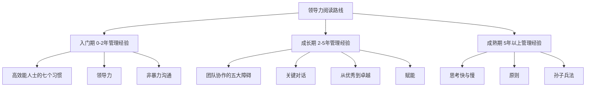
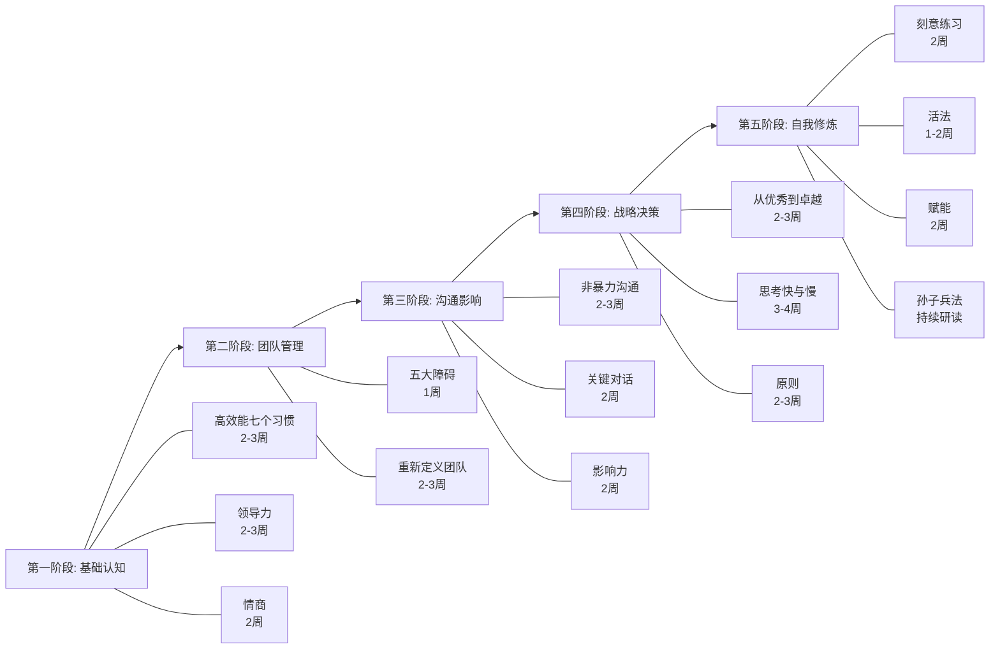

## 一、经典书籍推荐

领导力不是天赋，而是可以通过系统学习逐步构建的能力体系。书籍是最高效的学习载体之一——一位作者花费数年甚至数十年的研究和实践浓缩成一本书，你只需要几个小时就能吸收。但市面上领导力书籍数以千计，选错书不仅浪费时间，还可能建立错误的认知框架。

本节不是简单的"好书清单"，而是一份**分层分级的阅读路线图**。我们按照领导力发展的五个核心维度——理论根基、团队驾驭、沟通影响、战略决策、自我修炼——精选15本经过时间检验的经典，并为每本书提供**核心思想拆解、关键概念提炼、阅读方法指引和实操转化建议**。

### 1.1 如何高效阅读领导力书籍

在进入书单之前，先建立正确的阅读方法论。多数人读书的误区是：从头到尾读一遍，划几条线，然后放到书架上吃灰。领导力书籍的阅读需要一套不同的策略。

#### 阅读四步法

| 阶段 | 动作 | 时间占比 | 目标 |
|------|------|----------|------|
| **侦察** | 读目录、前言、每章首尾段 | 10% | 建立全书地图，识别高价值章节 |
| **精读** | 逐章深入，做笔记，画思维导图 | 40% | 理解核心论点和论证逻辑 |
| **转化** | 将书中概念映射到自己的工作场景 | 30% | 形成个人行动清单 |
| **践行** | 每周实践1-2个具体行为改变 | 20% | 将知识内化为能力 |

#### 不同阶段的阅读优先级

**核心原则：先读"道"再读"术"。** 很多初学者直接跳到具体技巧类书籍（比如"10个管理工具"），结果学了一堆碎片化的方法却不知道何时使用、为何有效。正确的路径是：先建立底层认知框架，再学习具体方法，最后才是工具和技巧。

---

### 1.2 领导力理论经典——建立认知根基

这三本书构成了领导力理论的"铁三角"：《领导力》定义了"做什么"，《从优秀到卓越》回答了"什么样的人能做好"，《高效能人士的七个习惯》解决了"如何从内到外成长"。

#### 《领导力》（The Leadership Challenge）

- **作者**：詹姆斯·库泽斯（James Kouzes）、巴里·波斯纳（Barry Posner）
- **版次建议**：第6版（2017年更新，增加了数字化时代案例）

**核心思想拆解：**

库泽斯和波斯纳通过超过30年、覆盖数百万领导者的实证研究，提炼出领导力的五种实践行为（The Five Practices of Exemplary Leadership），这是目前领导力领域被引用最多、实证支撑最强的模型之一：

1. **以身作则（Model the Way）**——明确个人价值观，用行动而非言语树立标准。领导者必须先厘清"我相信什么"，然后在日常行为中始终如一地践行。团队不会听你说什么，会看你做什么。
2. **共启愿景（Inspire a Shared Vision）**——描绘一个令人振奋的未来图景，并让团队成员看到自己在这个图景中的位置。关键不是你的愿景多宏大，而是团队成员能否在其中找到自己的意义。
3. **挑战现状（Challenge the Process）**——主动寻求变革和创新的机会，敢于冒险尝试新方法。卓越的领导者不满足于维持现状，他们持续寻找改进的空间。
4. **使众人行（Enable Others to Act）**——通过信任和授权，让每个人都能发挥最大潜力。领导力不是一个人的独角戏，而是让整个团队都能上台表演。
5. **激励人心（Encourage the Heart）**——真诚地认可每个人的贡献，庆祝团队的胜利。人不是机器，需要情感上的认可和鼓励。

**关键概念：信誉是领导力的基石。** 库泽斯和波斯纳在全球范围内的调查中反复验证了一个结论：人们最期望领导者具备的品质是"真诚"（honest）、"有远见"（forward-looking）、"有能力"（competent）、"有激发性"（inspiring）。四项中前三项的基础都是信誉。

**阅读方法：** 本书结构清晰，每章对应一种实践行为，每章末尾有"采取行动"的练习清单。建议每读完一章，从练习清单中选择2-3项，制定下周的行动承诺。不要贪多，一个月重点练习一种行为。

**实操转化：** 用书中的"个人最佳领导力实践"（Personal-Best Leadership Experience）练习，回顾自己过去最成功的一次领导经历，分析其中用到了五种实践中的哪些，这会帮你发现自己最自然的领导风格。

---

#### 《从优秀到卓越》（Good to Great）

- **作者**：吉姆·柯林斯（Jim Collins）
- **研究方法**：对1435家 Fortune 500 企业进行筛选，找出11家实现了从优秀到卓越跨越的公司，与对照组进行长达5年的对比研究

**核心思想拆解：**

**第五级领导力（Level 5 Leadership）**——这是全书最核心、也最容易被误解的概念。柯林斯发现，带领公司实现卓越跨越的领导者，不是那些魅力四射、个性张扬的明星CEO，而是同时具备两种矛盾特质的人：

- **极度谦逊的个人品格**：他们不把功劳归于自己，不追求个人名声，甚至在媒体采访中更多谈论团队和运气
- **极度坚定的职业意志**：为了公司的长期利益，他们能做出极其艰难的决定，包括裁员、关闭业务线、挑战董事会

这两种特质看似矛盾，实际上构成了一种独特的领导力形态——他们谦逊是因为把组织利益放在个人利益之上，坚定是因为对组织使命有不可动摇的信念。

**其他核心概念：**

- **先人后事（First Who, Then What）**——先找到对的人上车，再决定车开往哪里。卓越公司不先制定战略再招人，而是先确保关键位置上有合适的人。
- **刺猬理念（Hedgehog Concept）**——找到三环交叉点：你对什么充满热情？你能在什么方面做到世界级？什么能驱动你的经济引擎？三环重叠的领域就是你应该全力聚焦的方向。
- **飞轮效应（Flywheel Effect）**——卓越不是一蹴而就的突破，而是持续推动飞轮、每次积累一点点动能，直到量变引发质变。

**阅读方法：** 前三章是研究方法论和核心发现，必须精读。后续每章对应一个发现，可以根据自己的关注重点选择性阅读。特别注意第2章"第五级领导力"和第3章"先人后事"，这两章的含金量最高。

**常见误区：** 很多人读完后只记住了"第五级领导力=谦逊"，然后变得优柔寡断。柯林斯强调的是谦逊与坚定的**并存**，不是只有谦逊。真正的第五级领导者在该强硬的时候绝不退缩。

---

#### 《高效能人士的七个习惯》（The 7 Habits of Highly Effective People）

- **作者**：史蒂芬·柯维（Stephen R. Covey）
- **全球销量**：超过4000万册，被翻译成40种语言

**核心思想拆解：**

柯维的框架不是七个独立的习惯，而是一个**由内而外的成长路径**，分为三个阶段：

**第一阶段：个人领域的成功（依赖→独立）**
1. **积极主动（Be Proactive）**——在刺激和回应之间，人有选择的自由。领导力的起点不是改变别人，而是掌控自己的选择。关注"影响圈"而非"关注圈"——把精力放在你能改变的事情上。
2. **以终为始（Begin with the End in Mind）**——任何事物都经历两次创造：先在脑海中构想，再在现实中实现。领导者必须先想清楚"最终要达成什么"，然后倒推每一步行动。写个人使命宣言是这个习惯的核心实践。
3. **要事第一（Put First Things First）**——区分紧急与重要。多数人被紧急的事情推着走，却忽略了真正重要但不紧急的事（如战略规划、人才培养、自我提升）。领导者必须学会说"不"。

**第二阶段：公众领域的成功（独立→互赖）**
4. **双赢思维（Think Win-Win）**——不是你赢我输的零和博弈，而是寻找双方都能获益的解决方案。但柯维也强调，双赢不是无原则的妥协，如果找不到双赢方案，"不成交"（No Deal）也是合理选择。
5. **知彼解己（Seek First to Understand, Then to Be Understood）**——先倾听理解对方，再表达自己。多数人听别人说话时，脑子里已经在组织自己的回应了，这不是真正的倾听。"移情聆听"（Empathic Listening）是这个习惯的核心技能。
6. **统合综效（Synergize）**——1+1>2。通过尊重差异、整合不同观点，创造出任何一方单独都无法达成的成果。这是团队合作的最高境界。

**第三阶段：自我更新**
7. **不断更新（Sharpen the Saw）**——在身体、精神、智力、社会/情感四个维度持续投入和更新。领导力是一场马拉松，不是百米冲刺。

**为什么领导力必读：** 这本书看似是个人成长类书籍，但其核心思想——从自我管理到影响他人——正是领导力发展的底层逻辑。一个连自己都管理不好的人，不可能带领团队。

**阅读建议：** 不要一口气读完。每两周专注一个习惯，先理解概念，再做书中的练习，最后在工作和生活中刻意实践。建议每年重读一次，随着领导经验的增长，你会从同一本书中读出完全不同的深度。

---

### 1.3 团队管理经典——从管自己到管他人

领导力的核心战场是团队。以下三本书分别从团队协作障碍、组织形态变革、人才管理三个角度，提供了从微观到宏观的团队管理方法论。

#### 《团队协作的五大障碍》（The Five Dysfunctions of a Team）

- **作者**：帕特里克·兰西奥尼（Patrick Lencioni）
- **独特之处**：以商业小说的形式呈现，读起来像一部商战故事，但每个情节都对应一个真实的团队管理问题

**核心模型：**

兰西奥尼提出了团队协作的五层障碍模型，它是一个**金字塔结构**，底层障碍不解决，上层障碍就无法突破：

第五层：忽视结果（注意力放在个人利益而非团队目标上）
  ↑
第四层：逃避责任（不敢指出同伴的不足，怕破坏关系）
  ↑
第三层：欠缺投入（决策时模棱两可，执行时犹豫不决）
  ↑
第二层：惧怕冲突（回避建设性争论，用虚假和谐掩盖分歧）
  ↑
第一层：缺乏信任（不敢暴露弱点，不敢承认错误和不足）

**逐层拆解与对策：**

**第一层——缺乏信任的破解：** 这里的"信任"不是常规意义上"相信对方不会害我"的信任，而是更深层的"基于弱点的信任"（Vulnerability-Based Trust）——团队成员敢于在彼此面前暴露自己的弱点、承认自己的错误、说出"我不知道"。具体做法：个人经历练习（每人分享一段对自己影响深远的经历）、行为风格测评（如MBTI、DISC）、领导者率先示范脆弱性。

**第二层——惧怕冲突的破解：** 建设性冲突是团队做出好决策的必要条件。没有冲突的团队会议，要么是所有人都在隐藏真实想法，要么是领导者的独角戏。具体做法：挖掘冲突（领导者主动邀请不同意见）、实时提醒（当讨论过于和平时，指定一名"冲突提醒者"）。

**第三层——欠缺投入的破解：** 投入的前提是"意见被听到"，不一定是"意见被采纳"。很多团队成员对决策缺乏执行力，不是因为不同意，而是因为觉得自己的意见没人听。具体做法：明确截止日期（每个决策必须有明确的"何时执行"）、低风险决策练习（用小决策训练团队的承诺习惯）。

**第四层——逃避责任的破解：** 团队成员之间互相监督，而不是只靠领导者一个人盯着。具体做法：团队有效性练习（定期让每个成员回答"其他成员最需要改进什么"）、公开目标和标准。

**第五层——忽视结果的破解：** 将团队目标置于个人目标之上。具体做法：公开承诺团队目标、将团队目标与个人激励挂钩。

**阅读建议：** 先花2小时读完小说部分（大约占全书60%），理解五大障碍在实际场景中如何表现。然后对照评估工具，诊断自己的团队处于哪个层级。最后参考每个障碍的解决方案，制定行动计划。

---

#### 《赋能》（Team of Teams）

- **作者**：斯坦利·麦克里斯特尔（Gen. Stanley McChrystal）——前美国联合特种作战司令部指挥官
- **背景**：美军在伊拉克对抗基地组织的实战经验

**核心思想拆解：**

这本书解决的是一个根本性问题：**当对手是灵活的小型网络时，传统的大型层级组织如何应对？** 麦克里斯特尔发现，美军拥有世界上最先进的装备和训练，但在对抗分散、去中心化的基地组织时却频频受制。原因不在于个体能力，而在于组织结构——传统层级组织的信息流动太慢、决策链条太长、各部门之间存在"谷仓效应"（silo effect）。

**核心解决方案——从"效率"到"适应性"的范式转换：**

- **共享意识（Shared Consciousness）**：打破信息壁垒，让每个人都能看到全局。具体做法包括：每日作战简报（所有部门同时参与，共享当天的战场信息）、嵌入式人员（将特种部队成员嵌入到情报机构，反之亦然）、信息透明化。
- **赋能式领导（Empowered Execution）**：在共享意识的基础上，将决策权下放到最接近信息源的人。传统模式是"信息向上流动，决策向下传达"；新模式是"信息透明共享，决策就地做出"。

**关键洞察："效率"与"适应性"的权衡。** 工业时代的组织追求效率最大化——标准化流程、严格分工、集中控制。但在快速变化的环境中，过度优化的效率反而成为脆弱性的来源。你需要的不是更快的马，而是能随时变形的车。

**阅读建议：** 前半部分（军事案例）读起来引人入胜，但不要只当故事读——每个军事案例都对应一个商业管理的隐喻。后半部分的管理理论比较密集，建议配合实际工作场景做笔记。重点关注"共享意识"和"赋能"两个概念如何在你的团队中落地。

---

#### 《重新定义团队》（Work Rules!）

- **作者**：拉斯洛·博克（Laszlo Bock）——前谷歌人力运营高级副总裁
- **核心价值**：不是理论，而是谷歌10万人规模下验证过的人才管理实践

**核心思想拆解：**

博克将谷歌的人才管理哲学归纳为一个原则：**让工作变得更好（Make Work Better）**。具体展开为六个维度：

1. **赋予工作意义**——人们不仅为薪水工作，更需要知道自己的工作为什么重要。谷歌通过"使命连接"帮助每个工程师理解自己的代码如何影响全球数十亿用户。
2. **信任你的员工**——谷歌的TGIF（Thank God It's Friday）全员会议中，任何员工都可以向CEO提出最尖锐的问题，包括薪酬、战略、裁员等敏感话题。信息透明是最好的信任建设工具。
3. **只招比你优秀的人**——谷歌的招聘流程极其严格（平均需要4-6次面试），因为博克深信"一个平庸的招聘决定带来的负面影响，远大于你想象"。书中详细介绍了谷歌的"结构化面试"方法和"招聘委员会"制度。
4. **不要将人当作资源来管理**——取消管理者对员工薪酬、晋升的单方面决定权，改用"同行评审+委员会决策"的模式。
5. **关于薪酬的反直觉发现**——谷歌的研究发现，薪酬的绝对值不重要，重要的是"公平感"。给员工超出预期的薪酬（比他们认为自己值得的多15%-20%），比精确匹配市场水平更能激发动力。
6. **用数据说话**——谷歌的人力决策大量依赖数据，而不是管理者的直觉。例如，他们会追踪"管理者质量"与"团队绩效"的相关性，用数据验证管理实践的有效性。

**阅读建议：** 不要试图照搬谷歌的所有做法（你可能没有谷歌的资源和文化基础）。重点理解背后的逻辑——为什么这些做法有效？然后结合自己的团队规模、行业特点和文化背景，选择性地实践。书中每一章末尾都有"你可以明天就做的小事"（What You Can Do Starting Tomorrow），这些小实验门槛低、见效快，是最有价值的实操部分。

---

### 1.4 沟通与影响力经典——领导力的核心技能

领导力在很大程度上就是沟通力。以下三本书分别从同理心沟通、高难度对话、影响力心理学三个维度，构建了完整的领导者沟通能力框架。

#### 《非暴力沟通》（Nonviolent Communication, NVC）

- **作者**：马歇尔·卢森堡（Marshall B. Rosenberg）
- **学术背景**：临床心理学博士，师从人本主义心理学大师卡尔·罗杰斯

**核心方法论——四要素模型：**

| 要素 | 含义 | 错误示范 | 正确示范 |
|------|------|----------|----------|
| **观察** | 客观描述事实，不带评判 | "你总是迟到" | "这周三次会议你分别迟到了5分钟、10分钟和15分钟" |
| **感受** | 表达自己的真实感受 | "我觉得你不在乎" | "我感到有些焦虑" |
| **需要** | 说出感受背后的需要 | （通常被省略） | "因为我需要确保项目进度不受影响" |
| **请求** | 提出具体可执行的请求 | "你能不能靠谱一点" | "下次会议你能提前5分钟到吗" |

**为什么领导者必学NVC：** 管理者日常面对大量高情绪场景——绩效面谈、冲突调解、向上汇报、客户谈判。多数人在这些场景中要么压抑情绪（导致关系疏远），要么爆发情绪（导致关系破裂）。NVC提供了第三条路：诚实地表达自己，同时尊重地倾听对方。

**关键区分：** NVC不是"说话技巧"，而是一种思维方式的转变。它的核心假设是：所有人类行为的背后都是在试图满足某种需要。当你理解了这一点，就能从"评判行为"转向"理解需要"，从"对抗"转向"合作"。

**阅读建议：** 四要素看似简单，实际操作极其困难——因为我们的语言习惯已经根深蒂固。建议先用1-2周时间只练习"观察vs评判"这一个要素（做到客观描述事实而不带评判就已经是巨大进步），再逐步加入其他要素。可以找一个信任的同事或家人作为练习伙伴。

---

#### 《关键对话》（Crucial Conversations）

- **作者**：科里·帕特森（Kerry Patterson）、约瑟夫·格雷尼（Joseph Grenny）等四人
- **适用场景**：高风险、强情绪、不同意见的对话——绩效反馈、战略分歧、冲突处理、危机沟通

**核心框架：**

**什么是"关键对话"：** 当三个条件同时满足时——观点不同、情绪强烈、利害攸关——对话就变成了"关键对话"。大多数人在这类对话中的本能反应要么是"战斗"（攻击对方观点），要么是"逃跑"（回避问题），两者都无法解决问题。

**核心技巧——营造安全氛围：** 当对话陷入僵局或情绪失控时，问题通常不在内容层面，而在安全感层面。对方之所以沉默或攻击，是因为他们觉得不安全——觉得你在否定他们的人格，而不是否定他们的观点。

恢复安全感的两个方法：
- **对比法（Contrasting）**：先说"我不是"什么，再说"我是"什么。例如："我不是在质疑你的能力（消除误解），我是在讨论这个方案的风险点（明确目的）。"
- **共同目的（Mutual Purpose）**：找到双方都认可的共同目标。例如："我们都希望这个项目成功，所以让我们坦诚地讨论这个风险。"

**STATE模型——从沉默或暴力转向对话：**
- **S（Share your facts）**：从事实开始，而不是从结论或判断开始
- **T（Tell your story）**：分享你基于事实得出的推论
- **A（Ask for others' paths）**：邀请对方分享他们的事实和推论
- **T（Talk tentatively）**：用试探性而非确定性的语气表达
- **E（Encourage testing）**：主动邀请对方反驳你的观点

**阅读建议：** 本书的实用价值极高，但需要反复练习才能内化。建议从一个你一直在回避的关键对话开始——用书中的方法做准备，然后实际去做。第一次尝试可能不完美，但你会立刻感受到与"硬刚"或"逃避"完全不同的效果。

---

#### 《影响力》（Influence: The Psychology of Persuasion）

- **作者**：罗伯特·西奥迪尼（Robert B. Cialdini）——亚利桑那州立大学心理学和市场营销学教授
- **研究方法**：卧底研究——西奥迪尼花3年时间"潜入"各种依赖说服力的行业（汽车销售、房产中介、广告公司、慈善募捐等），从内部观察影响力的实际运作

**六大影响力原则：**

1. **互惠（Reciprocity）**——人们倾向于回报他人的善意。应用：先给予，再请求。但注意——小恩小惠有时比大恩更有效，因为人们在接受大恩时会产生"被操控感"而抗拒。
2. **承诺与一致（Commitment and Consistency）**——人们一旦做出承诺，就会倾向于保持一致。应用：让对方先做出小承诺（"你同意这个方向吗？"），再逐步升级到大承诺。
3. **社会认同（Social Proof）**——人们在不确定时会参考他人的行为。应用：展示"其他类似团队/公司已经这样做了"。
4. **喜好（Liking）**——人们更容易被自己喜欢的人说服。应用：先建立关系，再提出请求。相似性、赞美和合作是最有效的"喜好"建立工具。
5. **权威（Authority）**——人们倾向于服从权威。应用：展示你的专业资质和经验，但注意——权威需要在提出请求之前建立，而不是在提出请求时才亮出来。
6. **稀缺（Scarcity）**——人们更珍视稀缺的东西。应用：强调机会的独特性和时间限制，但必须是真实的稀缺，虚假紧迫感会严重损害信誉。

**领导者视角的阅读重点：** 不要只把这六条当作"说服别人的技巧"。作为领导者，更重要的是识别这些原则**何时被用在你身上**——供应商的"限时优惠"、候选人的"多个offer"、咨询公司的"标杆客户案例"——理解这些套路后，你才能做出真正理性的决策。

**阅读建议：** 每个原则对应一章，每章都有大量真实案例，读起来不枯燥。建议每周重点研究一个原则，同时做两件事：(1) 在自己的沟通中有意识地正面运用；(2) 在他人的沟通中识别这些原则的使用。

---

### 1.5 决策与战略思维经典——领导者的思维操作系统

领导者的每一个决策都影响着团队的方向和命运。以下三本书分别从认知心理学、系统化原则、东方战略智慧三个角度，帮助你建立更高质量的决策框架。

#### 《思考，快与慢》（Thinking, Fast and Slow）

- **作者**：丹尼尔·卡尼曼（Daniel Kahneman）——诺贝尔经济学奖得主，行为经济学奠基人
- **定位**：这不是一本"管理书"，而是一本关于人类思维局限性的书。理解这些局限，是做出高质量决策的前提

**核心模型——双系统理论：**

- **系统1（快思考）**：自动、快速、直觉性、几乎不费力。负责日常95%的决策——早上穿什么、午餐吃什么、对一个人的第一印象。
- **系统2（慢思考）**：刻意、缓慢、需要集中注意力、消耗认知资源。负责复杂决策——战略选择、投资评估、重大人事决定。

**领导力相关的认知偏差：**

| 偏差名称 | 含义 | 领导力场景中的表现 |
|----------|------|---------------------|
| **锚定效应** | 第一个接收到的数字会影响后续判断 | 面试时先看到的简历会"设定锚点"，影响后续候选人的评估 |
| **可得性偏差** | 容易回忆起的事件被高估概率 | 近期一次失败的招聘会导致过度谨慎，即使整体招聘成功率很高 |
| **确认偏差** | 倾向于寻找支持自己观点的证据 | 一旦认为某个下属"不行"，就会不自觉地关注他的错误而忽略成绩 |
| **损失厌恶** | 损失的痛苦是等额收益快乐的2倍 | 害怕失去现有业务而拒绝必要的变革 |
| **过度自信** | 高估自己判断的准确性 | CEO们对自己战略预测的准确度估计往往远高于实际 |
| **光环效应** | 对某人的某一特质的好感扩展到其他特质 | 因为某人口才好就认为他能力全面 |

**阅读建议：** 这本书500页，内容密集，不适合通读。建议按"问题导向"阅读——先翻到目录，找到与你当前领导力挑战最相关的章节（如决策、判断、直觉的局限性），精读这些部分。每读完一个偏差，在当天的工作中寻找自己身上是否有这个偏差。

---

#### 《原则》（Principles）

- **作者**：瑞·达利欧（Ray Dalio）——桥水基金创始人，管理超过1500亿美元资产
- **核心价值**：不是告诉你应该有什么原则，而是教你**如何建立自己的原则体系**

**核心思想拆解：**

**极度透明与极度真实（Radical Transparency and Radical Truth）：** 达利欧在桥水基金推行了一种极端的文化——所有会议都被录像、任何人都可以在公开场合质疑任何人（包括CEO）、每个决策的推理过程都被记录和回溯。这种文化的好处是：消除了办公室政治、减少了信息失真、加速了问题暴露。代价是：只有心理承受力极强的人才能适应。

**可信度加权决策（Believability-Weighted Decision Making）：** 不是"一人一票"的民主，也不是"老板说了算"的独裁，而是根据每个人在相关领域的过往表现来加权其意见的可信度。一个在该领域有20年成功经验的人的意见，权重自然高于刚入行的新人。

**五步流程法：**
1. 设定清晰的目标
2. 识别阻碍目标的问题
3. 诊断问题的根本原因
4. 设计解决方案
5. 执行方案

这个流程看似简单，但达利欧强调，多数人在第3步就失败了——他们跳过根本原因诊断，直接跳到解决方案，结果治标不治本。

**阅读建议：** 全书分为三个部分——自传、生活原则、工作原则。建议先读自传部分（了解达利欧的经历和思考方式），然后重点精读工作原则。不必全盘接受，桥水的文化非常极端，关键是理解背后的逻辑，然后找到适合你自己团队的"浓度"。

---

#### 《孙子兵法》

- **作者**：孙武
- **成书时间**：约公元前512年
- **地位**：世界上最早的系统性军事战略著作，被翻译成29种语言，影响了从拿破仑到松下幸之助的无数战略家

**核心思想的现代领导力映射：**

| 孙子兵法原文 | 核心思想 | 现代领导力应用 |
|-------------|----------|----------------|
| "知己知彼，百战不殆" | 全面了解自己和对手 | 竞争分析、SWOT分析、360度反馈 |
| "上兵伐谋，其次伐交" | 最高明的策略是以谋略取胜 | 战略规划优于盲目执行 |
| "兵贵胜，不贵久" | 速战速决 | 快速迭代、小步快跑 |
| "以正合，以奇胜" | 正面交锋配合出奇制胜 | 核心业务稳定运营+创新业务探索 |
| "将者，智信仁勇严也" | 领导者的五种品质 | 智慧（决策力）、诚信（信誉）、仁爱（关怀）、勇气（担当）、严明（纪律） |
| "上下同欲者胜" | 团队目标一致 | 组织使命对齐、OKR管理 |

**特别值得深思的战略思想：**

**"不战而屈人之兵"——竞争的最高境界是不竞争。** 在商业中，这意味着：与其在红海中肉搏，不如开辟蓝海；与其打败竞争对手，不如让自己变得不可替代。

**"势"的概念——领导力的杠杆效应。** 孙子讲的"势"不是个人力量的大小，而是通过正确的布局、时机和节奏，用最小的力量产生最大的效果。好的领导者不是最勤奋的人，而是最会"借势"的人。

**阅读建议：** 版本选择很关键。纯文言文版本读起来费力，过度白话的版本又丢失了韵味。推荐选择有**原文+注释+商业案例**三合一的版本，如华杉的《华杉讲透孙子兵法》。建议逐篇精读，每篇配合一个现代商业案例来理解。

---

### 1.6 自我修炼与情商——领导力的内在根基

领导力的终极瓶颈不是技能，而是自我认知。以下三本书从情商科学、能力发展方法论、东方经营哲学三个维度，帮助你突破领导力的内在天花板。

#### 《情商》（Emotional Intelligence）

- **作者**：丹尼尔·戈尔曼（Daniel Goleman）
- **学术地位**：首次系统论证了情商（EQ）对个人成功的预测力甚至超过智商（IQ）

**情商的五个维度：**

1. **自我觉察（Self-Awareness）**——准确识别自己的情绪状态及其对他人的影响。领导力应用：当你感到愤怒时，意识到"我现在在生气，这个情绪正在影响我的判断"，而不是在愤怒中做出决定。
2. **自我调节（Self-Regulation）**——管理自己的情绪和冲动。领导力应用：在团队面前保持冷静，即使内心焦虑。不是压抑情绪，而是选择合适的时机和方式表达。
3. **内驱力（Motivation）**——出于内在标准而非外在奖励的追求卓越。领导力应用：在没有外部激励时依然能保持高标准，因为你的动力来自对工作的意义感。
4. **同理心（Empathy）**——理解他人的情绪和立场。领导力应用：在做人事决定时能考虑到当事人的感受，在沟通时能站在对方的角度思考。
5. **社交技能（Social Skills）**——管理关系、建立网络、引导他人。领导力应用：建立广泛的人际网络、有效管理冲突、激励和影响他人。

**戈尔曼的关键发现：** 对于高层领导者，情商的重要性是智商和技术能力的两倍。而且越往高层走，情商的区分度越大——因为高层管理者在智商和技术能力上已经经过筛选，差异不大，真正的差距来自情商。

**阅读建议：** 本书前半部分讲理论，后半部分讲应用。建议先读应用部分（特别是"情商与领导力"相关章节），再回到理论部分补充理解。配合做一份权威的情商测评（如EQ-i 2.0），获得自己的情商基线数据。

---

#### 《刻意练习》（Peak: Secrets from the New Science of Expertise）

- **作者**：安德斯·埃里克森（K. Anders Ericsson）——"刻意练习"理论的提出者，佛罗里达州立大学心理学教授
- **核心发现**：卓越不是天赋的产物，而是正确练习的结果

**刻意练习的四个核心要素：**

1. **明确且具体的目标**——不是"提升领导力"这样模糊的目标，而是"在本周的团队会议中，用5分钟时间做一次清晰的愿景陈述"这样具体的目标。
2. **专注和有意识的练习**——不是机械重复，而是每次都把注意力集中在需要改进的特定方面。开会不叫练习，带着"这次我要特别注意倾听不同意见"的意图去开会才叫练习。
3. **及时反馈**——你必须知道自己的表现如何才能改进。获取反馈的方式包括：录像回放、360度反馈、教练指导、同伴观察。
4. **走出舒适区**——刻意练习的本质是不断挑战自己能力的边界。如果你觉得练习很轻松，说明你没有在进步。

**领导力的刻意练习框架：**

领导力与运动、音乐等技能不同，没有标准的练习动作。但刻意练习的原则依然适用：

- **分解技能**：将"领导力"分解为具体的子技能（如公开演讲、一对一反馈、战略规划、冲突调解）
- **设计练习**：针对每个子技能设计练习场景（如用Toastmasters练习演讲、用角色扮演练习反馈）
- **获取反馈**：找到一位可信赖的导师或教练，定期复盘你的领导行为
- **持续迭代**：每周选择1-2个微行为进行改进，而不是试图一次改变所有

**阅读建议：** 前3章讲理论（核心概念），后4章讲应用。重点读第4章"在工作中运用刻意练习"和第7章"成为杰出人物的路线图"。读完后，用刻意练习框架为自己设计一份为期12周的领导力提升计划。

---

#### 《活法》

- **作者**：稻盛和夫——日本"经营之圣"，创立了京瓷和KDDI两家世界500强企业，78岁高龄出山拯救破产的日本航空
- **哲学背景**：融合了佛教思想、中国儒学和现代经营实践

**核心思想拆解：**

**人生方程式：人生·工作的结果 = 思维方式 × 热情 × 能力**

这个方程式的精妙之处在于"思维方式"是-100到+100的范围，而热情和能力只是0到100。一个能力强、热情高但思维方式为负的人（比如聪明但自私的领导者），不仅自己走不远，还会给组织带来巨大破坏。

**"利他之心"的经营哲学：** 稻盛和夫认为，商业的本质是利他——你的产品或服务必须对社会有价值，企业才能长久生存。这不是道德说教，而是一个务实的商业逻辑：利他→获得客户信任→持续经营→利润自然产生。

**"敬天爱人"：** "敬天"是遵循事物的本质规律和正道；"爱人"是关爱他人、为他人着想。这四个字浓缩了服务型领导力的精髓——尊重规律、关怀人性。

**六项精进（稻盛和夫的日常修行）：**
1. 付出不亚于任何人的努力
2. 要谦虚，不要骄傲
3. 每天反省
4. 活着就要感谢
5. 积善行，思利他
6. 不要有感性的烦恼

**阅读建议：** 这本书不厚，语言平实，但每一句都是稻盛和夫几十年实践的结晶。建议不要快速读完，而是每天读一小段，然后花时间反思。特别适合在职业生涯的低谷期阅读——稻盛和夫自己的经历（考大学失利、入职公司濒临破产、身患肺结核）证明了"思维方式"比外在条件重要得多。

---

### 1.7 主题阅读路线图

不要随机阅读，按照以下路线图系统构建领导力知识体系：

**总时长：** 按照每周5小时的阅读时间，完成全部15本书大约需要**10-12个月**。这不是赛跑，而是投资——每天30分钟的持续阅读，一年后你的领导力认知会有质的飞跃。

### 1.8 阅读中的常见误区

| 误区 | 后果 | 正确做法 |
|------|------|----------|
| 只读不做 | 知识停留在"知道"层面，无法转化为能力 | 每本书至少形成3个可执行的行动项，并在2周内实践 |
| 只读一类书 | 认知单一，缺乏多维度视角 | 五个维度交替阅读，避免"锤子思维" |
| 追求读书数量 | 浅尝辄止，每本书只学了皮毛 | 10本书各读一遍不如3本书各读三遍 |
| 全盘接受书中观点 | 失去独立思考能力 | 批判性阅读：这个观点的证据充分吗？在我的情境中适用吗？ |
| 读完就放 | 一个月后遗忘80%的内容 | 建立读书笔记系统，定期回顾和分享 |
| 只读西方书籍 | 忽略东方管理智慧 | 中西结合，特别是《孙子兵法》《活法》等东方经典提供独特视角 |

### 1.9 延伸阅读：每个维度的进阶书目

当你完成了以上15本核心书目后，可以按维度进一步深入：

**领导力理论进阶：**
- 《仆人式领导》（The Servant as Leader）——罗伯特·格林利夫：服务型领导力的奠基之作
- 《第五项修炼》——彼得·圣吉：学习型组织的系统思维
- 《基业长青》——吉姆·柯林斯：《从优秀到卓越》的前作，研究卓越公司的共同特质

**团队管理进阶：**
- 《无限游戏》——西蒙·斯涅克：从"有限思维"转向"无限思维"
- 《奈飞文化手册》——帕蒂·麦考德：自由与责任并存的极端文化实验
- 《增长黑客》——肖恩·埃利斯：数据驱动的团队增长方法论

**沟通影响力进阶：**
- 《高难度谈话》——道格拉斯·斯通等：比《关键对话》更深入的困难对话方法论
- 《故事的力量》（Storyworthy）——马修·迪克斯：用故事影响他人
- 《提问的力量》——弗兰克·赛斯诺：通过提问而非陈述来引导思考

**战略决策进阶：**
- 《反脆弱》——纳西姆·塔勒布：如何从不确定性中获益
- 《好战略，坏战略》——理查德·鲁梅尔特：什么是真正的战略
- 《竞争战略》——迈克尔·波特：经典竞争分析框架

**自我修炼进阶：**
- 《心流》——米哈里·契克森米哈赖：最优体验的心理学
- 《正念的奇迹》——一行禅师：用正念提升自我觉察
- 《被讨厌的勇气》——岸见一郎：阿德勒心理学的人生哲学

---

**最后的话：** 书单再好，不读等于零。从今天开始，选一本最适合你当前阶段的书，打开第一页。领导力的成长没有捷径，但有路径——这些书就是前人走过的、验证过的路径。你不需要全部读完，但你需要开始。
