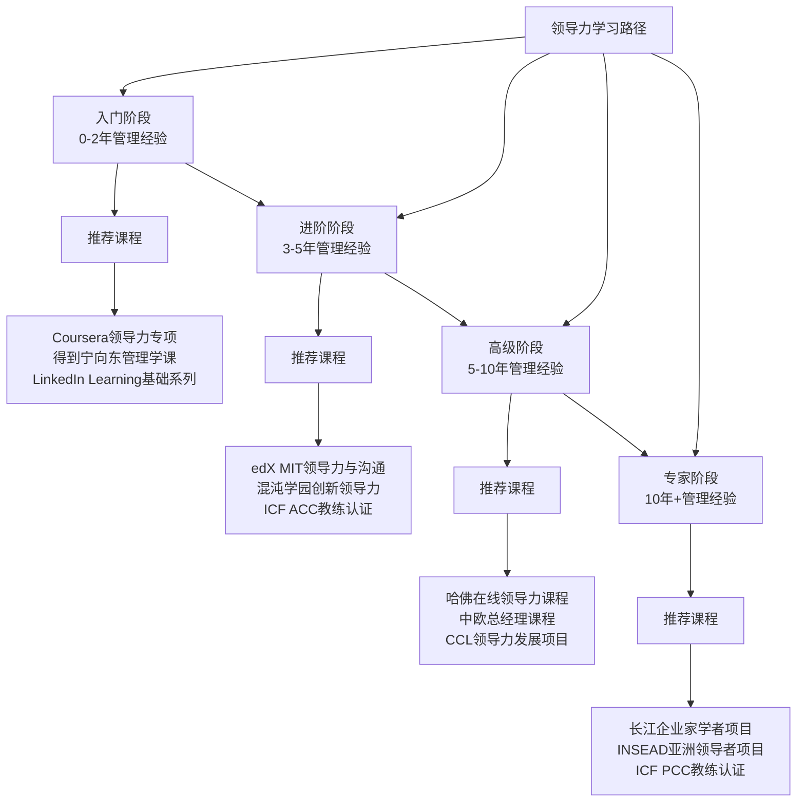

## 二、优质课程推荐

领导力课程市场鱼龙混杂，从免费的在线公开课到数十万元的EMBA项目，选择范围极广。本节按预算、层级和学习目标，系统梳理值得投入的优质课程，帮你找到最适合自己的学习路径。

### 2.1 选课评估框架

在投入时间和金钱之前，先建立评估标准。好的领导力课程应该满足以下条件：

| 评估维度 | 核心问题 | 权重 |
|---------|---------|------|
| 内容深度 | 是否覆盖理论+方法+实操三层？ | ★★★★★ |
| 师资背景 | 讲师是否有真实领导经验+学术背景？ | ★★★★☆ |
| 互动设计 | 是否有案例讨论、同伴学习、作业反馈？ | ★★★★☆ |
| 学习社群 | 是否提供同学网络和后续交流机会？ | ★★★☆☆ |
| 时间投入 | 每周需要多少小时？能否坚持完成？ | ★★★☆☆ |
| 证书价值 | 证书在行业内的认可度如何？ | ★★☆☆☆ |
| 性价比 | 学费与获得的能力提升是否匹配？ | ★★★★☆ |

**三个常见陷阱：**

1. **名校光环陷阱**：哈佛、沃顿的品牌确实好，但如果课程内容与你的实际需求不匹配，花10万学完也用不上。先明确需求，再选课程。
2. **碎片化陷阱**：每天5分钟的音频课适合了解概念，但领导力是实践技能，光听不做等于没学。碎片化学习只能作为补充，不能作为主修。
3. **证书迷恋陷阱**：很多培训机构用"国际认证"做卖点，但企业HR看重的是你能解决什么问题，不是墙上挂了多少证书。

### 2.2 国际顶尖课程

#### 2.2.1 顶级商学院课程

这些课程适合预算充足、追求系统性学习的中高层管理者：

**哈佛商学院「领导力与组织行为」**

- **形式**：在线短期课程（8-12周）/ 线下沉浸式课程（3-5天）
- **核心内容**：
  - 领导力理论全景：从特质理论到变革型领导
  - 组织行为学：理解个体、群体和组织层面的行为规律
  - 团队管理：高绩效团队的构建与维护
  - 变革管理：如何在不确定性中引领组织转型
- **教学方法**：案例教学法（Case Method），以真实商业案例为基础，学员需要在课前阅读完整案例，课堂上进行高强度讨论
- **费用**：在线课程 $1,500-$3,000，线下课程 $10,000-$15,000
- **适合人群**：5年以上管理经验的中高层管理者
- **网址**：hbs.edu/executive
- **真实评价**：案例讨论的深度是其他平台无法比拟的，但价格确实不菲。如果预算有限，可以先看哈佛商学院出版社的案例集（约$30-50/本）预热

**沃顿商学院「领导力影响力」**

- **形式**：在线课程（6-8周，每周6-8小时）
- **核心内容**：
  - 影响力构建：如何在没有正式权力的情况下影响他人
  - 说服力科学：基于行为科学的说服技巧
  - 谈判策略：从博弈论到实际谈判场景
  - 决策心理学：理解决策偏差和群体思维
- **特色**：学术严谨，大量引用沃顿教授的原创研究
- **费用**：$2,000-$3,000
- **适合人群**：各级管理者，特别是需要跨部门协作的角色
- **网址**：online.wharton.upenn.edu

**斯坦福商学院「领导力与人才管理」**

- **形式**：在线课程（10周）
- **核心内容**：
  - 人才识别与发展：如何发现和培养高潜力人才
  - 组织设计：打造支持创新的组织架构
  - 文化塑造：从价值观到行为规范的落地
- **特色**：硅谷视角，强调创新和敏捷
- **费用**：$2,500-$4,000
- **适合人群**：科技行业管理者、创业公司创始人

**INSEAD「亚洲国际领导者项目」**

- **形式**：线下集中授课（新加坡/枫丹白露校区）
- **核心内容**：
  - 跨文化领导力：在多元文化环境中有效领导
  - 全球战略思维：从区域到全球的视角转换
  - 网络构建：与来自40+国家的高管建立联系
- **费用**：€15,000-€20,000
- **适合人群**：有国际业务需求的高管
- **网址**：insead.edu

#### 2.2.2 在线学习平台课程

性价比更高的选择，适合预算有限但愿意投入时间的学习者：

**Coursera「领导力专项课程」（University of Michigan）**

- **形式**：4门课程组成专项，每门4-6周
- **课程结构**：
  - 第1门：领导力基础——什么是领导力，领导与管理的区别
  - 第2门：团队管理——如何建立和维护高效团队
  - 第3门：影响力与说服——非权力影响力的核心技能
  - 第4门：领导力实践——将所学应用到实际工作场景
- **特色**：免费旁听全部内容，付费（约$49/月）可获得证书和作业批改
- **适合人群**：领导力入门者、想系统了解领导力框架的人
- **网址**：coursera.org

**edX「领导力与沟通」（MIT）**

- **形式**：在线课程（6周，每周3-5小时）
- **核心内容**：
  - 沟通作为领导力工具
  - 公共演讲与影响力
  - 冲突管理与协商
- **费用**：免费旁听 / $149（含证书）
- **适合人群**：需要提升沟通能力的技术背景管理者
- **网址**：edx.org

**LinkedIn Learning「领导力基础」系列**

- **形式**：短视频课程（每个3-10分钟，总计2-4小时）
- **推荐课程**：
  - 《新经理基础》：从IC到管理者的转型
  - 《领导力基础》：Simon Sinek 讲授核心理念
  - 《情商领导力》：Daniel Goleman 情商理论应用
- **费用**：$29.99/月（LinkedIn Premium包含）
- **适合人群**：时间碎片化、需要快速获取知识点的职场人士
- **网址**：linkedin.com/learning

**MasterClass「领导力大师课」**

- **形式**：视频课程（每门2-4小时）
- **推荐讲师**：
  - Bob Iger（迪士尼前CEO）：战略决策与创新领导
  - Howard Schultz（星巴克创始人）：价值观驱动的领导
  - Anna Wintour（Vogue主编）：创意领导力与决策力
- **特色**：制作精良，适合激发灵感，但实操深度有限
- **费用**：$10-$20/月（年度订阅）
- **适合人群**：想从顶级领导者身上获取灵感的人

### 2.3 国内优质课程

#### 2.3.1 顶级商学院课程

**中欧国际工商学院「总经理课程」**

- **形式**：线下集中授课（每月2-3天，持续1年）
- **核心内容**：
  - 战略思维：从行业分析到战略制定
  - 领导力发展：自我认知与领导风格优化
  - 组织管理：组织架构设计与人才管理
  - 财务思维：非财务背景管理者的财务素养
- **特色**：中西结合，案例既包含国际巨头也有中国本土企业
- **费用**：15-20万元
- **适合人群**：企业高管、业务线负责人
- **网址**：ceibs.edu
- **真实评价**：校友网络是最大资产，很多同学后续成为商业伙伴。但课程节奏较紧，需要保证出勤率

**长江商学院「企业家学者项目」**

- **形式**：非脱产学习，每月集中2-3天，持续2年
- **核心内容**：
  - 领导力哲学：东西方领导智慧融合
  - 组织进化：从管控到赋能的组织转型
  - 人文素养：历史、哲学、艺术对领导力的滋养
- **费用**：60-80万元
- **适合人群**：企业创始人、董事长级别
- **网址**：ckgsb.edu.cn

**清华经管「高级管理培训」**

- **形式**：短期集中课程（3-5天）
- **推荐课程**：
  - 《卓越领导力修炼》：3天，聚焦领导力自我认知
  - 《组织变革与领导力》：5天，深度探讨变革管理
- **费用**：1-3万元/课程
- **适合人群**：中高层管理者
- **网址**：sem.tsinghua.edu.cn

**北大光华「管理者领导力发展项目」**

- **形式**：模块制学习（每月1次，每次2-3天）
- **核心内容**：
  - 领导力心理学：理解人性与行为动机
  - 团队领导力：从个人能力到团队赋能
  - 组织文化：打造高绩效文化
- **费用**：6-10万元
- **适合人群**：3年以上管理经验的中层管理者
- **网址**：gsm.pku.edu.cn

#### 2.3.2 在线学习平台课程

**混沌学园「创新领导力」**

- **形式**：线上视频+线下大课（每年12次线下大课）
- **核心内容**：
  - 创新思维：第一性原理、非连续性创新
  - 商业模式：商业模式画布与创新
  - 领导力实践：创新组织的领导方式
- **特色**：聚焦创新和创业领域，案例以中国互联网公司为主
- **费用**：约1-2万元/年
- **适合人群**：创业者、创新管理者、产品经理
- **网址**：hundun.cn
- **真实评价**：线下大课的氛围和社交价值不错，但线上课程质量参差不齐，建议先试听再决定

**得到App「宁向东的管理学课」**

- **形式**：音频课程（300+讲，每讲10-15分钟）
- **核心内容**：
  - 管理学经典理论的通俗解读
  - 中国商业环境下的管理实践
  - 团队管理、决策、沟通等实用技能
- **特色**：清华大学教授授课，学术功底深厚，语言通俗易懂
- **费用**：199元（一次购买永久收听）
- **适合人群**：管理入门者、想系统了解管理学框架的人
- **网址**：dedao.cn

**得到App「刘润·5分钟商学院」**

- **形式**：音频课程（每天1讲，5分钟）
- **核心内容**：
  - 商业知识体系：从底层逻辑到具体方法
  - 管理技巧：沟通、激励、授权等实用技能
  - 战略思维：商业模式和竞争策略
- **特色**：每天5分钟，碎片化学习无压力
- **费用**：199元/年
- **适合人群**：职场人士、想快速获取商业知识的人
- **真实评价**：适合碎片化学习建立知识框架，但深度有限，需要配合其他课程深入

**知乎知学堂「管理能力提升营」**

- **形式**：直播+录播+社群
- **核心内容**：
  - 新任管理者转型
  - 团队管理实战
  - 向上管理与向下管理
- **费用**：9.9-299元（体验营）
- **适合人群**：新晋管理者、想检验自己是否适合管理岗的人

**腾讯课堂/网易公开课**

- **免费课程推荐**：
  - 网易公开课引进的耶鲁大学《心理学导论》：理解人性是领导力的基础
  - 网易公开课引进的哈佛大学《公正》：培养伦理决策能力
  - 腾讯课堂上的各类管理实战课：质量参差，建议看评价选择
- **适合人群**：预算有限的学习者

#### 2.3.3 行业特定课程

**互联网行业**

- **起点学院「产品总监修炼之道」**：适合产品线管理者
- **极客时间「技术领导力实战课」**：适合从技术转管理的CTO/技术总监
- **三节课「业务增长操盘手」**：适合业务线负责人

**传统行业**

- **中欧「家族企业传承课程」**：适合家族企业接班人
- **清华「国企改革与领导力」**：适合国企管理者
- **长江「新经济与传统产业融合」**：适合传统行业转型者

### 2.4 专业认证课程

认证课程的价值在于系统性和行业认可度，但要理性看待证书本身的价值。

#### 2.4.1 国际权威认证

**CCL（创造性领导力中心）领导力发展项目**

- **机构背景**：全球最大的领导力发展机构之一，1970年成立，总部在美国北卡罗来纳州
- **核心项目**：
  - 《领导力基础》：3天线下，聚焦自我认知和领导风格
  - 《高级领导力项目》：5天，面向C-level高管
  - 《教练式领导》：培养教练型领导能力
- **特色**：基于40年研究数据，强调自我认知和反馈
- **费用**：$3,000-$10,000不等
- **适合人群**：各级管理者
- **网址**：ccl.org
- **真实评价**：CCL的360度反馈工具非常有价值，能帮你看到自己看不到的盲点

**DDI（智睿咨询）领导力加速项目**

- **机构背景**：全球领先的人才管理咨询公司
- **核心项目**：
  - 《领导力加速》：基于评估的发展项目
  - 《高潜人才发展》：识别和培养高潜力领导者
  - 《继任规划》：为关键岗位建立人才梯队
- **特色**：强调评估驱动发展，先评估再定制发展计划
- **费用**：企业定制项目，个人课程 $2,000-$5,000
- **适合人群**：HR专业人士、企业高管
- **网址**：ddiworld.com

**ICF（国际教练联合会）认证教练课程**

- **机构背景**：全球最大的教练认证机构
- **认证等级**：
  - ACC（助理认证教练）：60小时培训 + 100小时教练经验
  - PCC（专业认证教练）：125小时培训 + 500小时教练经验
  - MCC（大师认证教练）：200小时培训 + 2,500小时教练经验
- **核心价值**：教练技术是现代领导力的重要组成部分，学会提问比学会指示更重要
- **费用**：培训费用 $5,000-$15,000（因培训机构而异）
- **适合人群**：想转型做企业教练的人、想提升教练式领导能力的管理者
- **网址**：coachingfederation.org

**SHL/CEB 领导力评估与发展**

- **机构背景**：全球人才评估领域领导者（现属Gartner）
- **核心工具**：
  - OPQ32：职业性格问卷，识别领导潜力
  - MQ：管理问卷，评估管理风格
  - AQR：成就问卷，预测领导绩效
- **适合人群**：HR专业人士、人才发展负责人
- **网址**：shl.com

#### 2.4.2 国内权威认证

**中国人力资源开发研究会「领导力发展师」认证**

- **认证等级**：初级、中级、高级
- **核心内容**：领导力理论、评估工具、发展方法
- **费用**：3,000-8,000元
- **适合人群**：HR从业者、培训师

**国际教练联盟（ICF）中国区认证**

- **特色**：中文授课，但认证标准与国际接轨
- **推荐机构**：创问教练中心、埃里克森教练学院
- **费用**：3-8万元

### 2.5 免费与低成本学习资源

不是所有人都有预算参加顶级商学院课程。以下资源同样有价值：

#### 2.5.1 免费在线课程

| 平台 | 课程名称 | 来源 | 时长 | 特色 |
|------|---------|------|------|------|
| Coursera | 领导力基础 | 密歇根大学 | 4周 | 可免费旁听 |
| edX | 领导力与沟通 | MIT | 6周 | 学术深度 |
| Khan Academy | 领导力入门 | 自制 | 2小时 | 通俗易懂 |
| YouTube | Simon Sinek 领导力演讲 | TED/个人 | 各30-60分钟 | 激发灵感 |
| B站 | 各类领导力讲座 | 搬运+原创 | 各1-2小时 | 中文资源 |
| 网易公开课 | 耶鲁心理学导论 | 耶鲁大学 | 24讲 | 理解人性 |
| 网易公开课 | 哈佛公正课 | 哈佛大学 | 12讲 | 伦理决策 |

#### 2.5.2 低成本精品课程

**得到App 精选**（100-300元）

- 《宁向东的管理学课》：199元，300+讲，系统管理学框架
- 《刘润·5分钟商学院》：199元，每天5分钟，商业知识体系
- 《熊逸讲透资治通鉴》：299元，从历史中学习领导智慧
- 《华杉讲透孙子兵法》：199元，战略思维的底层逻辑

**知乎盐选会员**（198元/年）

- 《管理者必修课》系列
- 《职场领导力》专栏
- 《团队管理实战》专栏

**微信读书会员**（19元/月）

- 可阅读大量领导力经典书籍的电子版
- 比买纸质书性价比高很多

### 2.6 按发展阶段的课程推荐路径

不同阶段的管理者需要不同的课程，以下是系统化的学习路径：

#### 2.6.1 入门阶段（0-2年管理经验）

**核心需求**：从个人贡献者转型为管理者，建立管理基础认知

**推荐组合**：

1. **主线课程**：Coursera「领导力专项课程」（密歇根大学）
   - 为什么选它：免费旁听，系统覆盖领导力基础，有同伴学习
   - 时间投入：每周4-6小时，持续4个月
   
2. **辅助课程**：得到App「宁向东的管理学课」
   - 为什么选它：碎片化学习，建立管理学知识框架
   - 时间投入：每天15分钟，持续6个月

3. **必读书籍**：《格鲁夫给经理人的第一课》+《从技术走向管理》

**避坑提示**：这个阶段不要报太贵的课程，先把基础打好。很多新管理者犯的错误是跳过基础直接学"高级领导力"，结果学了一堆概念用不上。

#### 2.6.2 进阶阶段（3-5年管理经验）

**核心需求**：提升影响力、学会教练式领导、开始带团队

**推荐组合**：

1. **主线课程**：edX「领导力与沟通」（MIT）
   - 为什么选它：提升非权力影响力，学会用沟通影响他人
   
2. **特色课程**：混沌学园「创新领导力」
   - 为什么选它：培养创新思维，学习如何在组织中推动变革
   
3. **认证课程**：ICF ACC教练认证培训
   - 为什么选它：教练技术是现代领导者的核心技能

4. **必读书籍**：《高效能人士的七个习惯》+《领导力21法则》

#### 2.6.3 高级阶段（5-10年管理经验）

**核心需求**：战略思维、组织发展、高层领导力

**推荐组合**：

1. **主线课程**：哈佛商学院在线领导力课程
   - 为什么选它：顶级案例教学，提升战略思维
   
2. **深度课程**：中欧国际工商学院「总经理课程」
   - 为什么选它：中西结合，建立高端人脉网络
   
3. **发展项目**：CCL领导力发展项目
   - 为什么选它：360度反馈，发现领导盲点

4. **必读书籍**：《从优秀到卓越》+《第五项修炼》

#### 2.6.4 专家阶段（10年+管理经验）

**核心需求**：传承智慧、影响组织文化、培养下一代领导者

**推荐组合**：

1. **旗舰课程**：长江商学院「企业家学者项目」
   - 为什么选它：人文素养与商业智慧融合，顶级人脉圈
   
2. **国际课程**：INSEAD「亚洲国际领导者项目」
   - 为什么选它：跨文化领导力，全球视野
   
3. **教练认证**：ICF PCC教练认证
   - 为什么选它：从领导者转型为教练型领导者

### 2.7 课程学习方法论

报了课程不等于学了课程。以下是最大化学习效果的方法：

#### 2.7.1 学习前的准备

1. **明确学习目标**：不要为了学而学，问自己"学完这个课程，我能解决什么具体问题？"
2. **评估时间投入**：很多课程的完成率不到10%，主要是因为时间规划不合理。先算好每周能投入多少小时
3. **找到学习伙伴**：一个人学习容易放弃，找1-2个同事或朋友一起学，互相督促

#### 2.7.2 学习中的执行

1. **主动学习**：不要只是听课，要做笔记、写反思、完成作业
2. **立即应用**：每学完一个模块，找机会在工作中实践。学到授权技巧，这周就尝试授权一项任务
3. **记录案例**：把工作中遇到的问题记录下来，尝试用课程理论分析

#### 2.7.3 学习后的转化

1. **建立个人知识库**：把课程笔记整理成自己的领导力手册
2. **定期复盘**：每月回顾一次所学内容，检查应用情况
3. **分享输出**：把学到的知识分享给团队，教学是最好的学习

#### 2.7.4 ROI 最大化策略

| 策略 | 具体做法 | 预期收益 |
|------|---------|---------|
| 组合学习 | 1门付费课程 + 2门免费课程 + 3本书 | 节省50%费用，覆盖面更广 |
| 企业报销 | 很多公司有培训预算，主动申请 | 降低个人支出 |
| 早鸟优惠 | 很多课程提前报名有折扣 | 节省10-20% |
| 团购优惠 | 找同事一起报名，谈团体价 | 节省15-30% |
| 复训机会 | 选择提供免费复训的课程 | 一次投入，多次学习 |

### 2.8 常见选课误区

**误区一：只看品牌不看内容**

很多人一看到"哈佛""沃顿"就报名，但这些顶级商学院的课程往往是针对特定人群设计的。一个新晋管理者去学C-level高管的课程，不仅听不懂，还会浪费钱。

**正确做法**：先评估自己的阶段和需求，再选匹配的课程。入门阶段选Coursera/得到，比选哈佛更合适。

**误区二：只学理论不实践**

很多人把课程当知识付费内容，听一遍就结束了。但领导力是实践技能，光听不做等于没学。

**正确做法**：每学完一个模块，必须找机会实践。学到授权技巧，这周就尝试授权一项任务。

**误区三：证书越多越好**

有些HR从业者热衷于考各种证书，但企业看重的是你能解决什么问题，不是墙上挂了多少证书。

**正确做法**：选择1-2个高含金量的认证深入学习，而不是考10个入门级证书。

**误区四：只学一门课程**

领导力是综合能力，一门课程不可能覆盖所有方面。

**正确做法**：建立组合学习体系：1门系统课程 + 若干专题课程 + 持续阅读 + 实践反思。

**误区五：忽视免费资源**

很多人认为免费课程质量不行，但实际上Coursera/edX上的很多免费课程来自顶级大学，质量比很多付费课程还好。

**正确做法**：先用免费资源建立基础认知，再根据需要选择付费课程深入学习。

### 2.9 课程与实践的结合建议

学习领导力课程只是起点，真正的成长来自实践。以下是将课程所学转化为实际能力的建议：

#### 2.9.1 建立「领导力实验室」

在你的团队中选择一个小范围作为"实验室"，尝试应用课程中学到的技巧。比如：

- 学了「教练式领导」→ 下次和下属一对一谈话时，用GROW模型提问
- 学了「变革管理」→ 在下一次团队变动中，应用Kotter的8步变革模型
- 学了「激励理论」→ 针对不同团队成员的动机，设计差异化的激励方案

#### 2.9.2 寻找导师和教练

课程能给你框架，但导师和教练能给你个性化指导：

- **内部导师**：找公司里你尊敬的高管，请他们定期指导
- **外部教练**：如果有预算，请一位ICF认证教练，每月1-2次对话
- **同行小组**：找3-5个同级别的管理者，定期交流领导力挑战

#### 2.9.3 建立反馈机制

领导力的提升需要持续反馈：

- **360度反馈**：每年做一次，了解上级、同级、下属对你的评价
- **自我反思日记**：每周花15分钟记录本周的领导力实践和反思
- **团队反馈会**：每季度开一次匿名反馈会，了解团队对你的看法

---

领导力课程是加速器，不是替代品。再好的课程也不能替你去实践、去犯错、去成长。选择适合自己阶段的课程，带着问题去学习，带着行动去实践，这才是领导力成长的正确路径。
