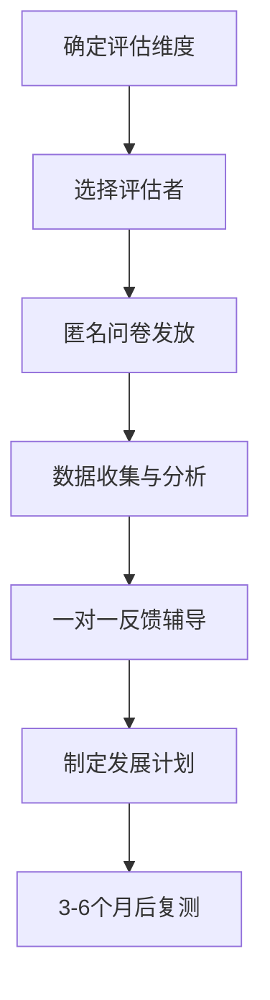
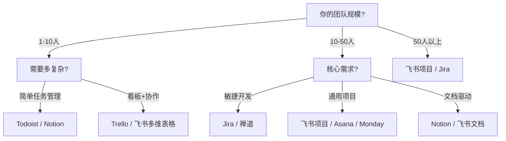

## 三、实用工具推荐

工具是领导力落地的放大器。选对工具，能让领导者的洞察力、决策力和影响力成倍放大；选错工具，则可能制造更多管理噪音，消耗团队精力。本节按"评估自我→管理团队→驱动决策→持续成长"四个维度，系统梳理领导者必备的实用工具，并给出选择标准、使用场景和避坑指南。

### 3.1 领导力评估工具：认识真实的自己

领导力的起点是自我认知。彼得·德鲁克说："你无法管理你不了解的东西。"评估工具的价值不在于给你贴标签，而在于提供一面结构化的镜子，让你看到自己的盲区。

#### 3.1.1 MBTI 性格类型指标

MBTI（Myers-Briggs Type Indicator）基于荣格心理类型理论，将人的偏好归纳为四个维度、十六种类型。

**四个维度解析：**

| 维度 | 两极 | 核心差异 |
|------|------|----------|
| 精力来源 | E（外倾）vs I（内倾） | 从社交中获取能量 vs 从独处中恢复能量 |
| 信息获取 | S（感觉）vs N（直觉） | 关注具体事实 vs 关注模式和可能性 |
| 决策方式 | T（思考）vs F（情感） | 依据逻辑分析 vs 依据价值观和人际影响 |
| 生活方式 | J（判断）vs P（知觉） | 偏好计划和秩序 vs 偏好灵活和开放 |

**领导者使用场景：**
- **团队组建**：了解团队成员的认知偏好，避免同质化。一个全是NT型的团队可能擅长战略但忽略执行细节；一个全是SJ型的团队可能执行力强但缺乏创新。
- **沟通适配**：对S型下属讲具体数据和案例，对N型下属讲愿景和方向；对T型成员用逻辑说服，对F型成员先建立情感连接。
- **冲突调解**：很多团队冲突本质是认知偏好冲突——不是谁对谁错，而是看待问题的维度不同。

**使用注意事项：**
- MBTI衡量的是"偏好"而非"能力"。一个T型领导者完全可以发展出高情商，只是需要更多刻意练习。
- 不要用于招聘筛选或绩效评估，这是对工具的误用。MBTI适合团队建设和自我认知，不适合做人事决策。
- 官方评估需付费（约49.95美元），免费版本可信度参差不齐。如需专业施测，建议找认证施测师。
- 网址：www.myersbriggs.org

#### 3.1.2 DISC 行为风格评估

DISC模型由威廉·马斯顿提出，将行为风格分为四种类型，是职场中应用最广泛的行为评估工具之一。

**四种行为风格详解：**

| 类型 | 核心特征 | 工作优势 | 潜在盲区 | 沟通策略 |
|------|----------|----------|----------|----------|
| D（支配型） | 直接、果断、结果导向 | 快速决策、推动变革 | 忽视他人感受、过于强势 | 直奔主题，给出选项而非指令 |
| I（影响型） | 热情、乐观、善于社交 | 激励团队、建立关系 | 缺乏细节关注、容易承诺过多 | 先建立关系，给予认可和赞赏 |
| S（稳健型） | 耐心、可靠、重视和谐 | 团队稳定器、执行可靠 | 抗拒变化、难以说不 | 给予安全感，循序渐进推动改变 |
| C（谨慎型） | 精确、系统、追求质量 | 风险把控、质量保证 | 过度分析、决策缓慢 | 提供数据和逻辑，尊重专业性 |

**领导者实操指南：**
- **识别自己**：大多数领导者偏D或DI型——因为果断和影响力是领导岗位的天然筛选器。但纯D型领导者最大的风险是"一言堂"，需要刻意练习倾听。
- **识别下属**：观察日常行为模式比问卷更准确。注意一个人在压力下的反应——D型在压力下变得更强势，I型变得更情绪化，S型变得退缩，C型变得吹毛求疵。
- **灵活切换**：高效领导者能在不同情境下切换风格。对D型下属给自主权，对I型下属给舞台，对S型下属给安全感，对C型下属给细节。
- 网址：www.discprofile.com

**DISC与MBTI的互补使用：** MBTI解释"为什么"（认知偏好），DISC解释"怎么做"（行为表现）。两者结合能更立体地理解一个人。建议团队同时使用两种工具，但间隔至少一个月，避免信息过载。

#### 3.1.3 盖洛普优势识别器（CliftonStrengths）

盖洛普优势识别器基于积极心理学，识别个人的34个天赋主题中的前5大优势（完整版可看到全部排序）。

**核心理念：** 传统管理思维关注"补短板"——你沟通不好就去上沟通课，你逻辑不强就去学逻辑。盖洛普的研究表明：**卓越的领导者不是没有弱点，而是极致发挥了自己的优势**。花80%的精力发展优势，20%的精力管理弱点（注意是"管理"而非"消除"）。

**34个天赋主题分为四大领域：**

| 领域 | 包含主题举例 | 对领导力的价值 |
|------|-------------|---------------|
| 执行力 | 成就、责任、纪律、排难 | 将战略转化为行动，确保落地 |
| 影响力 | 统率、沟通、取悦、自信 | 向外发声，争取资源，推动变革 |
| 关系建立 | 体谅、个别、交往、包容 | 凝聚团队，建立信任，培养人才 |
| 战略思维 | 分析、前瞻、战略、学习 | 洞察趋势，深度思考，制定方向 |

**领导者使用方法：**
- **个人层面**：做完测评后，不要只看报告。花一周时间记录：什么时候你感到"心流"状态？什么时候你在不知不觉中投入了大量精力？这些时刻往往对应你的核心优势。
- **团队层面**：绘制团队优势地图。如果团队80%的人都是"战略思维"象限，那执行力和影响力就是团队短板，需要有意识地引入或培养这些维度的人才。
- **1:1对话**：与下属做优势对话。不是告诉他们"你的优势是X"，而是问"你觉得什么时候你最投入、最有成就感？"然后将答案与测评结果对照。
- 网址：www.gallup.com/cliftonstrengths（测评约24.99美元起）

#### 3.1.4 360度反馈工具

360度反馈是领导者自我认知最直接的工具——它不是问卷自评，而是让上级、同级、下属和合作方从多个角度评价你的领导行为。

**实施流程：**

**关键维度设置：**

| 维度 | 评估要点 | 自评与他评差距的典型含义 |
|------|---------|----------------------|
| 战略视野 | 能否看清方向、提前布局 | 差距大=自视过高或沟通不足 |
| 决策质量 | 决策速度、信息充分度、结果 | 差距大=决策过程不够透明 |
| 团队赋能 | 授权程度、培养下属 | 差距大=过度控制或忽视培养 |
| 沟通影响 | 表达清晰度、倾听质量 | 差距大=说得多听少 |
| 结果交付 | 目标达成、质量标准 | 差距大=标准不一致 |
| 诚信正直 | 言行一致、公平公正 | 任何差距都需高度重视 |

**常用工具对比：**

| 工具 | 特点 | 适用规模 | 费用参考 |
|------|------|---------|---------|
| Korn Ferry 360 | 与领导力素质模型深度结合，有海量标杆数据 | 大中型企业 | 按人头收费，通常$200-500/人 |
| DDI 360 | 侧重领导行为和发展建议 | 大中型企业 | 按项目报价 |
| SurveyMonkey / 问卷星 | 灵活自定义，成本低 | 中小团队 | 免费到几百元/月 |
| 飞书OKR+绩效 | 与日常管理流程打通 | 使用飞书的团队 | 含在飞书企业版中 |

**使用避坑指南：**
- **匿名性是生命线**。如果员工怀疑反馈会被追踪到个人，数据就完全失真了。至少需要5个以上评估者才能保证匿名。
- **不要一次性评估太多维度**。6-8个核心维度足够，超过12个评估者会疲劳敷衍。
- **自评与他评的差距比绝对分数更有价值**。差距大的维度才是最需要关注的发展方向。
- **360反馈不是绩效考核**。一旦与薪酬晋升挂钩，人们就不会说真话。它应该是纯发展导向的。
- **一年最多做一次**，否则评估疲劳会降低数据质量。

#### 3.1.5 情商评估工具

领导力的"软实力"核心是情商。以下工具可帮助评估和提升情商水平：

| 工具 | 衡量内容 | 特点 |
|------|---------|------|
| EQ-i 2.0 | 情绪智力的五个复合量表 | 全球应用最广的情商评估，有标准化常模 |
| MSCEIT | 情绪感知、使用、理解和管理能力 | 能力型测试，不是自评，更客观 |
| ESCI（情商与社会能力问卷） | 12项能力素质 | 丹尼尔·戈尔曼团队开发，可结合360使用 |

### 3.2 团队管理工具：让协作产生倍增效应

团队管理工具的核心价值不是"管人"，而是降低协作成本、提升信息透明度、让每个人把精力花在有价值的事情上。

#### 3.2.1 OKR 目标管理工具

OKR（Objectives and Key Results）是英特尔首创、谷歌发扬光大的目标管理框架。它解决的核心问题是：**如何让整个组织朝同一个方向努力，同时保持每个人的自主性？**

**OKR的基本结构：**

Objective（目标）：鼓舞人心、定性描述
  ├── Key Result 1：可衡量、有挑战性
  ├── Key Result 2：可衡量、有挑战性
  └── Key Result 3：可衡量、有挑战性

**OKR与KPI的核心区别：**

| 维度 | OKR | KPI |
|------|-----|-----|
| 目的 | 对齐方向、激发挑战 | 考核绩效、确保底线 |
| 设定方式 | 自下而上+自上而下结合 | 通常自上而下分解 |
| 评分标准 | 完成60-70%即为良好 | 完成100%才算达标 |
| 与薪酬关系 | 不直接挂钩 | 通常直接挂钩 |
| 更新频率 | 季度为主 | 年度为主 |
| 适用场景 | 创新性、探索性工作 | 成熟业务、标准化流程 |

**主流OKR工具对比：**

| 工具 | 优势 | 劣势 | 适用场景 | 费用参考 |
|------|------|------|---------|---------|
| 飞书OKR | 与飞书生态深度集成，OKR自动关联文档和任务 | 仅限飞书用户 | 已使用飞书的团队 | 含在企业版中 |
| Tita | 功能全面，支持OKR+绩效+项目一体化 | 界面稍复杂 | 追求一体化管理的中型企业 | 30-50元/人/月 |
| Worktile | 项目管理+OKR结合好 | OKR深度不如专业工具 | 项目驱动型团队 | 19-39元/人/月 |
| Lark（国际版飞书） | 多语言支持好 | 国内使用需翻墙 | 有海外团队的企业 | 含在企业版中 |
| Weekdone | 简洁、周报+OKR结合 | 中文支持弱 | 小团队快速上手 | 免费-10美元/人/月 |

**OKR落地的常见坑：**
- **把KPI包装成OKR**："完成100万营收"是KPI不是OKR。好的O应该是"成为区域市场的首选品牌"，KR才是"Q2实现100万营收"。
- **数量过多**：每个团队每季度3-5个O，每个O下3-5个KR。超过这个数量，OKR就变成了待办事项列表。
- **设定后不管**：OKR需要每周check-in、每月复盘。没有check-in的OKR等于没有OKR。

#### 3.2.2 项目管理工具

项目管理工具是领导者"看见全局"的眼睛。选工具的核心标准不是功能多少，而是**团队愿不愿意用**。

**选型决策树：**

**主流工具深度对比：**

| 工具 | 学习成本 | 协作体验 | 自定义能力 | 适合场景 | 费用 |
|------|---------|---------|-----------|---------|------|
| 飞书项目 | 低 | 与飞书IM/文档无缝 | 中等 | 已用飞书的国内团队 | 含在企业版 |
| Jira | 高 | 强大的工作流引擎 | 极强 | 技术团队、敏捷开发 | $8.15/人/月起 |
| Asana | 中 | 界面直观、多视图 | 中等 | 跨部门协作 | $10.99/人/月起 |
| Notion | 中 | 文档+数据库融合 | 强 | 内容驱动的团队 | $8/人/月起 |
| Trello | 低 | 看板直观 | 弱 | 小团队、简单项目 | 免费-$5/人/月 |
| 钉钉Teambition | 低 | 与钉钉集成好 | 中等 | 已用钉钉的团队 | 含在钉钉专业版 |

**领导者使用项目管理工具的关键原则：**
- **不要把自己变成"工具管理员"**。领导者应该看仪表盘和看板，而不是在Jira里写ticket。把工具操作下放给项目经理或Scrum Master。
- **关注瓶颈而非进度**。项目管理中最有价值的不是"完成了多少"，而是"什么在阻碍我们"。用工具的阻塞标记、风险标记功能，把注意力集中在卡点上。
- **定期清理看板**。过期任务、僵尸项目会让工具变成垃圾场。每月做一次看板清理，关闭过期任务，归档旧项目。

#### 3.2.3 团队沟通工具

沟通工具选型的核心矛盾是：**功能丰富**与**信息噪音**之间的平衡。功能越多，噪音越多；但功能太少，又不够用。

**沟通工具矩阵：**

| 工具 | 即时消息 | 语音/视频 | 文档协作 | 项目管理 | 生态集成 |
|------|---------|---------|---------|---------|---------|
| 飞书 | ✅ | ✅ | ✅ | ✅ | 最全面 |
| 钉钉 | ✅ | ✅ | ✅ | ✅ | 阿里生态 |
| 企业微信 | ✅ | ✅ | 弱 | 弱 | 微信生态 |
| Slack | ✅ | ✅ | 弱 | 弱 | 海外工具生态最强 |
| Microsoft Teams | ✅ | ✅ | ✅ | ✅ | Office 365生态 |

**领导者沟通习惯建议：**
- **异步优先**：不是所有事都需要即时回复。建立"紧急程度标签"文化——真正紧急的事打电话，一般紧急的事发消息，不紧急的事写文档/发邮件。
- **信息分层**：日常沟通用IM群组，决策讨论用会议（有会议纪要），知识沉淀用文档。很多团队的信息混乱源于这三个通道的混用。
- **减少会议**：能用文档异步讨论的，不要开同步会议。必须开会的，提前发材料、控制时长、输出行动项。
- **注意消息边界**：企业微信最大的优势是连接微信生态，但也很容易让人24小时在线。领导者要以身作则，下班后非紧急事项不发消息。

#### 3.2.4 反馈与认可工具

持续反馈是高效团队的基石。传统的一年一次绩效考核已经远远不够——员工需要实时、具体、可操作的反馈。

**反馈工具对比：**

| 工具 | 核心功能 | 特色 | 适用场景 |
|------|---------|------|---------|
| 飞书绩效 | OKR+绩效+360一体 | 与飞书工作流打通 | 飞书生态团队 |
| 北森 | 人才全生命周期管理 | 功能全面、定制化强 | 中大型企业 |
| Tita | OKR+绩效+反馈一体化 | 轻量上手快 | 中小团队 |
| 15Five | 周报+反馈+认可+1:1 | 专注管理者体验 | 追求管理体验的团队 |
| Culture Amp | 员工体验平台 | 数据分析和基准对比强 | 注重员工体验的企业 |

**建立反馈文化的关键实践：**
- **SBI反馈法**：Situation（场景）→ Behavior（行为）→ Impact（影响）。不要说"你沟通能力不行"，要说"在昨天的项目评审会上（S），你没有提前发送会议材料（B），导致大家没有充分准备，讨论效率很低（I）"。
- **正负反馈比例**：研究表明高效团队的正负反馈比例约为5:1。不是不能批评，而是日常要大量给出具体认可。
- **向上反馈机制**：工具要支持下属对上级的匿名反馈。很多领导者只向下给反馈，却从不要求下属给自己反馈。

### 3.3 决策与战略分析工具

领导者的核心产出是决策质量。以下工具帮助系统化地分析问题、降低决策偏差。

#### 3.3.1 SWOT 与进阶分析框架

SWOT（优势、劣势、机会、威胁）是最经典的战略分析工具，但大多数人用得过于粗糙。

**SWOT的正确用法：**
1. **不要独立填写**。优势和劣势是内部因素（可以改变），机会和威胁是外部因素（只能适应）。把内部和外部交叉分析才是关键。
2. **TOWS矩阵**是SWOT的进阶版：

| | 机会（O） | 威胁（T） |
|---|---------|---------|
| **优势（S）** | SO策略：用优势抓机会 | ST策略：用优势化解威胁 |
| **劣势（W）** | WO策略：弥补劣势抓机会 | WT策略：收缩防守、规避风险 |

3. **每个象限不超过5个要点**。超过说明分析不够聚焦，需要进一步筛选优先级。

#### 3.3.2 决策矩阵（Decision Matrix）

当面临多个方案时，决策矩阵是最实用的选择工具。

**操作步骤：**
1. 列出所有候选方案
2. 确定评估维度（如成本、效率、风险、可行性）
3. 为每个维度赋权重（权重总和=100%）
4. 对每个方案在每个维度上打分（1-10分）
5. 加权计算总分

**示例：选择团队协作工具**

| 维度 | 权重 | 飞书(评分×权重) | 钉钉(评分×权重) | Slack(评分×权重) |
|------|------|----------------|----------------|-----------------|
| 功能全面性 | 30% | 9×30%=2.7 | 7×30%=2.1 | 6×30%=1.8 |
| 学习成本 | 20% | 8×20%=1.6 | 8×20%=1.6 | 5×20%=1.0 |
| 费用 | 15% | 7×15%=1.05 | 8×15%=1.2 | 5×15%=0.75 |
| 生态集成 | 20% | 9×20%=1.8 | 7×20%=1.4 | 6×20%=1.2 |
| 数据安全 | 15% | 8×15%=1.2 | 7×15%=1.05 | 6×15%=0.9 |
| **总分** | **100%** | **8.35** | **7.35** | **5.65** |

#### 3.3.3 战略分析常用工具汇总

| 工具 | 用途 | 适用场景 | 输出物 |
|------|------|---------|--------|
| 波特五力模型 | 分析行业竞争格局 | 进入新市场、竞争策略制定 | 行业吸引力评估 |
| BCG矩阵 | 产品组合分析 | 多产品线资源分配 | 产品定位图（明星/金牛/问题/瘦狗） |
| 商业模式画布 | 商业模式设计与迭代 | 创业、新业务规划 | 一页纸商业模式图 |
| PESTEL分析 | 宏观环境扫描 | 战略规划前期 | 宏观趋势清单 |
| 价值链分析 | 识别竞争优势来源 | 运营优化、战略定位 | 价值活动链与成本结构 |
| 情景规划 | 应对不确定性 | 长期战略、风险管理 | 多个可能未来的情景描述 |

### 3.4 学习与成长工具：领导者的自我进化系统

领导力不是一次性习得的技能，而是终身修炼。以下工具帮助领导者建立持续学习的系统。

#### 3.4.1 读书与知识管理

| 工具 | 特点 | 最佳用法 |
|------|------|---------|
| 微信读书 | 中文书库最全、社交读书体验好 | 日常阅读、快速检索 |
| 得到 | 精品知识付费课程 | 系统学习商业/管理知识 |
| Notion / Obsidian | 个人知识管理系统 | 建立领导力知识库、读书笔记网络 |
| Readwise | 自动同步各平台划线笔记 | 将阅读笔记系统化、定期回顾 |
| 播客（日谈公园、得到头条等） | 碎片时间学习 | 通勤时间保持信息摄入 |

**领导者必读书单（按成长阶段）：**

| 阶段 | 推荐书目 | 核心收获 |
|------|---------|---------|
| 新任管理者 | 《格鲁夫给经理人的第一课》《高效能人士的七个习惯》 | 管理的基本功和个人效能 |
| 中层领导者 | 《从优秀到卓越》《第五项修炼》《赋能》 | 组织建设和系统思维 |
| 高层领导者 | 《战略的本质》《创新者的窘境》《原则》 | 战略决策和组织文化 |
| 跨领域拓展 | 《思考快与慢》《反脆弱》《枪炮病菌与钢铁》 | 认知升级和全局视野 |

#### 3.4.2 教练与导师工具

| 工具/方法 | 用途 | 适用场景 |
|----------|------|---------|
| GROW模型 | 结构化教练对话 | 1:1辅导下属 |
| 行动学习（Action Learning） | 通过解决真实问题来学习 | 高潜人才培养 |
| 外部教练（ICF认证） | 专业一对一教练 | C-level高管发展 |
| 同行学习小组（Peer Group） | 同级别领导者的经验交流 | 中层管理者互相学习 |

**GROW教练对话框架：**
- **G（Goal）**：你想要达到什么目标？
- **R（Reality）**：当前的实际情况是什么？
- **O（Options）**：你有哪些选择？
- **W（Will）**：你决定怎么做？什么时候开始？

#### 3.4.3 领导力发展平台

| 平台 | 内容 | 适合谁 | 费用参考 |
|------|------|--------|---------|
| Coursera / edX | 名校领导力课程（MIT、Wharton等） | 想系统学习的领导者 | 免费旁听-$300/课程 |
| 长江商学院/中欧商学院 | 中国顶尖商学院课程 | 企业高管 | 数万到数十万元 |
| 德锐领导力 | 本土化领导力培训 | 中高层管理者 | 按项目报价 |
| 馒头商学院 | 实战型商业课程 | 中基层管理者 | 几百到几千元 |
| LinkedIn Learning | 英文领导力课程库 | 有英文基础的管理者 | $29.99/月 |

### 3.5 工具选型的核心原则

工具不在多，在于用得好。以下是选型时必须遵循的原则：

**原则一：解决真问题，而非制造新问题**

问自己：引入这个工具解决了什么具体痛点？如果答不上来，就不需要引入。很多团队引入了十几个工具，每个工具用到20%的功能，信息分散在各个平台，反而增加了管理成本。

**原则二：先试后买，小范围验证**

任何工具先在一个小团队试用2-4周，确认确实解决了问题再推广。大规模引入后发现不合适，切换成本极高。

**原则三：生态一致性优先**

优先选择同一个生态的工具。全用飞书、全用钉钉、全用Office 365——工具之间的数据打通比单个工具的极致功能更重要。

**原则四：领导者亲自用，但不要深度用**

领导者应该是工具的"用户"而非"管理员"。你要用OKR看板了解团队进展，但不需要自己配置OKR系统。你要用项目管理工具看项目状态，但不需要自己写ticket。深度配置交给项目经理或运营。

**原则五：定期审计，果断淘汰**

每季度审计一次团队工具使用情况。使用率低于30%的工具，果断停掉。工具是有维护成本的——不仅是费用，更是团队的认知负荷。

### 3.6 常见误区与纠正

| 误区 | 危害 | 纠正 |
|------|------|------|
| 工具越多越专业 | 信息碎片化、团队疲劳 | 精选3-5个核心工具，深入使用 |
| 盲目跟风大厂工具 | 大厂工具可能不适合小团队 | 根据自身规模和需求选型 |
| 只关注功能不关注体验 | 团队不愿意用，工具形同虚设 | 让最终用户参与选型决策 |
| 评估工具当考核工具 | 评估结果失真、员工抵触 | 评估用于发展，考核另行设计 |
| 引入工具不培训 | 工具闲置、使用方式错误 | 正式上线前安排系统培训和答疑 |
| 领导自己不带头用 | 团队觉得"这只是HR的项目" | 领导者率先垂范，公开分享使用体验 |
