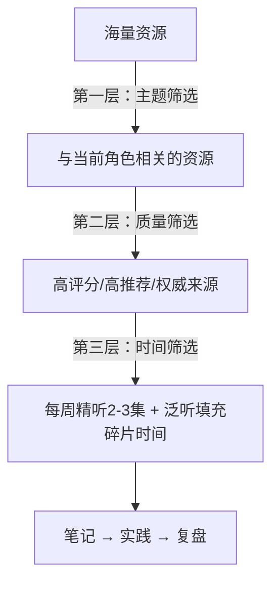

## 四、播客与视频资源

播客和视频是领导力学习中不可替代的媒介形态——它们传递的不仅是信息，更是语调、情绪、叙事节奏和真实对话中的思维碰撞。与书籍相比，视听资源更擅长呈现"领导者如何思考"的过程，而不仅仅是"他们做了什么"的结论。本章按主题领域、难度层级和使用场景，系统梳理最值得投入时间的播客与视频资源，并给出可操作的学习策略。

### 4.1 为什么视听资源对领导力学习不可替代

领导力不是纯知识学科，它高度依赖情境感知、情绪共鸣和行为示范。视听资源在三个维度上提供书籍无法替代的价值：

**第一，隐性知识的传递。** 一位CEO在播客中如何组织语言、如何回应尖锐问题、如何在不确定中做出判断——这些"怎么做"的隐性知识只能通过观察真实对话获得。领导力学者Henry Mintzberg强调，管理是"实践的艺术"，而播客恰恰提供了大量"实践中的领导力"样本。

**第二，时间碎片的利用。** 通勤、健身、家务等场景无法阅读，但可以听播客。一个每天通勤30分钟的职场人，一年通过播客可以获取约120小时的高质量领导力内容，相当于精读40本书的时间投入。

**第三，多元视角的快速切换。** 视频和播客通常以访谈形式展开，一集之内你能听到CEO、学者、教练、一线管理者对同一话题的不同看法。这种多视角密度是任何单一作者的书籍难以企及的。

### 4.2 英文播客精选

英文播客整体质量高于中文播客，尤其在领导力领域，大量顶尖学者和实践者选择播客作为首选传播渠道。以下按主题分类推荐。

#### 4.2.1 综合领导力与管理

**HBR IdeaCast（哈佛商业评论）**

- 制作方：Harvard Business Review
- 更新频率：每周二更新
- 单集时长：25-30分钟
- 内容特点：每期邀请一位商业领袖或学者，围绕一个管理热点展开深度对话。选题紧扣当下商业趋势，同时保持学术严谨性。
- 适合人群：中层管理者、MBA学生、对管理学前沿感兴趣的专业人士
- 推荐入门集数：
  - "How to Be a Better Leader"系列——每年年初发布，总结当年领导力趋势
  - 任何包含Amy Cuddy、Adam Grant、Herminia Ibarra作为嘉宾的集数
- 收听平台：Apple Podcasts、Spotify、HBR官网
- 学习建议：每集听完后用一句话总结核心观点，一个月后回看笔记检验记忆留存率

**The McKinsey Podcast**

- 制作方：McKinsey & Company
- 更新频率：每两周
- 单集时长：20-35分钟
- 内容特点：基于麦肯锡研究报告展开，数据密度高，分析框架清晰。涵盖组织变革、数字化转型、人才战略等话题。
- 适合人群：高级管理者、战略咨询从业者
- 与HBR IdeaCast的区别：麦肯锡更偏"组织层面"的领导力，HBR更偏"个人层面"的领导力

**Coaching for Leaders with Dave Stachowiak**

- 更新频率：每周
- 单集时长：30-50分钟
- 内容特点：专注"如何辅导他人成长"这一领导力核心技能。主持人Dave本身就是领导力教练，问题精准，嘉宾分享实操性强。
- 适合人群：新晋管理者、团队负责人、HR从业者
- 独特价值：大量关于"一对一谈话"、"反馈技巧"、"授权方法"的实操内容，是新手管理者的救命稻草

#### 4.2.2 深度对话与思维启发

**The Tim Ferriss Show**

- 主持人：Tim Ferriss（《每周工作4小时》作者）
- 更新频率：每周
- 单集时长：1-3小时
- 内容特点：采访各行各业的顶尖人物——企业家、运动员、科学家、艺术家——深入挖掘他们的日常习惯、思维模型和决策框架。
- 适合人群：对跨领域学习感兴趣的领导者
- 领导力相关推荐集数：
  - 采访Ray Dalio的集数（讨论原则式决策）
  - 采访Ed Catmull的集数（讨论皮克斯的创意领导力）
  - 采访General Stanley McChrystal的集数（讨论分布式领导力）
- 使用策略：时长较长，建议1.5倍速收听，用Pocket Casts或Overcast的智能跳过静音功能

**Dare to Lead with Brené Brown**

- 主持人：Brené Brown（休斯顿大学研究教授）
- 更新频率：不定期，通常每月2-4集
- 单集时长：30-60分钟
- 内容特点：围绕勇气、脆弱性、信任和归属感展开。Brené用严谨的社会科学研究支撑每一个观点，同时保持极强的情感感染力。
- 核心理念：领导力不是"永远正确"，而是"敢于脆弱"。这与传统领导力叙事形成鲜明对比。
- 适合人群：所有层级的领导者，尤其适合那些试图建立"心理安全"文化的管理者
- 配套阅读：同名书籍《Dare to Lead》

**The Knowledge Project with Shane Parrish**

- 主持人：Shane Parrish（Farnam Street博客创始人）
- 更新频率：每月2-3集
- 单集时长：60-90分钟
- 内容特点：专注"心智模型"和"决策质量"，嘉宾多为投资家、科学家和企业高管。对话深度极高，信息密度大。
- 与Tim Ferriss的区别：Tim更偏"习惯和方法"，Shane更偏"思维和判断"
- 适合人群：高级管理者、决策者、对认知科学感兴趣的人

#### 4.2.3 组织与文化

**WorkLife with Adam Grant**

- 主持人：Adam Grant（沃顿商学院组织心理学教授）
- 更新频率：季节性更新
- 单集时长：30-45分钟
- 内容特点：每季围绕一个组织主题深入探讨——如何让工作不无聊、如何对抗群体思维、如何建设反馈文化。学术严谨性和故事性兼备。
- 独特价值：Adam是少数能将学术研究翻译成大众语言的学者，每一集都基于实证研究而非个人观点。
- 推荐集数：
  - "Bonus: How to Stop Lying to Yourself"（关于自我欺骗和决策盲区）
  - "The Real Reason Employees Quit"（关于人才流失和管理责任）

**First Round Review**

- 制作方：First Round Capital（顶级风投）
- 内容形式：主要是文字长文，但其配套播客和视频访谈质量极高
- 内容特点：聚焦科技创业公司的领导力和管理实践，实操性极强，全是"怎么做的"而非"应该怎么做"
- 独特价值：你能听到硅谷一线管理者分享真实的管理失误和教训，没有任何包装

#### 4.2.4 沟通与影响力

**Think Fast, Talk Smart（斯坦福商学院）**

- 主持人：Matt Abrahams
- 更新频率：每周
- 单集时长：20-40分钟
- 内容特点：专注沟通技巧——演讲、会议发言、即兴表达、冲突对话。每集提供可直接使用的技巧和框架。
- 适合人群：所有需要提升沟通能力的领导者
- 与领导力的关联：领导力的本质是影响力，影响力的基础是沟通

**HBR's Women at Work**

- 制作方：Harvard Business Review
- 内容特点：聚焦女性在职场中的领导力挑战——性别偏见、晋升障碍、薪酬谈判、工作与生活平衡。
- 独特价值：不仅是女性领导者的资源，也是男性领导者理解性别议题、建设包容性文化的必听内容

### 4.3 中文播客与音频节目

中文领导力播客整体起步较晚，但近年来出现了一批高质量的内容。以下筛选标准：内容有深度、更新稳定、主持人有专业背景。

#### 4.3.1 商业与管理

**得到·管理学通识（刘润）**

- 平台：得到App
- 内容特点：刘润以清晰的逻辑框架拆解管理学核心概念，每个概念都配以中国商业案例。
- 适合人群：管理入门者、从技术转管理的职场人
- 使用策略：作为系统学习的"骨架"，再用英文播客补充"血肉"

**混沌学园音频课**

- 平台：混沌学园App及官网（www.hundun.cn）
- 内容特点：邀请中国顶尖企业家和学者授课，涵盖创新管理、战略思维、组织变革。课程质量参差不齐，需筛选。
- 推荐讲师：李善友（创新理论）、曾鸣（战略）、陈威如（平台战略）
- 注意：部分课程偏向"认知升级"而非具体管理方法，需根据个人需求选择

**商业就是这样（第一财经）**

- 平台：小宇宙、Apple Podcasts、喜马拉雅
- 内容特点：以商业案例分析为主，深入拆解企业决策背后的逻辑。虽然不是直接的领导力播客，但理解商业决策是高级领导者的必备素养。
- 适合人群：中高级管理者、对商业逻辑感兴趣的人

#### 4.3.2 个人成长与认知

**樊登读书**

- 平台：樊登读书App（www.dushu.io）
- 内容特点：樊登每周讲解一本书，涵盖管理学、心理学、经济学等领域。讲解风格通俗易懂，适合快速了解书籍核心观点。
- 领导力相关推荐书目讲解：
  - 《可复制的领导力》（樊登自己的书，讲解标准化管理方法）
  - 《高效能人士的七个习惯》
  - 《关键对话》
  - 《非暴力沟通》
- 局限性：每本书30-60分钟的讲解必然有信息损失，适合"选书"而非"读书替代"
- 最佳使用方式：先听樊登了解框架→感兴趣则精读原书→再听一次巩固理解

**日谈公园·商业单集**

- 平台：小宇宙、Apple Podcasts
- 内容特点：主节目是文化类播客，但不定期邀请商业领袖做深度访谈，对话质量很高。
- 适合人群：偏好轻松对话风格的听众

**硬地骇客**

- 平台：小宇宙
- 内容特点：聚焦独立开发者和小型团队的管理实践，讨论远程协作、自组织、精益创业等话题。
- 适合人群：技术团队负责人、创业者、对新型组织形态感兴趣的人

#### 4.3.3 心理学与人际关系

**Steve说**

- 平台：小宇宙、Apple Podcasts
- 内容特点：心理咨询师Steve从心理学角度解读人际关系、情绪管理、自我认知等话题。
- 与领导力的关联：领导力的核心能力——情商、自我觉察、同理心——都有深厚的心理学基础。这个播客帮助你从底层理解这些能力。

**得意忘形播客**

- 平台：小宇宙
- 内容特点：张潇雨主持，讨论投资、商业、认知科学和哲学，思维密度高。
- 适合人群：对跨学科思维感兴趣的高级管理者

### 4.4 视频课程与演讲

#### 4.4.1 TED演讲——领导力必看清单

TED是领导力学习的免费宝藏库。以下按主题整理最值得看的演讲：

**领导力本质与愿景**

| 演讲者 | 题目 | 核心观点 | 时长 |
|---------|------|----------|------|
| Simon Sinek | How Great Leaders Inspire Action | 领导力从"为什么"开始，而非"做什么" | 18分钟 |
| Simon Sinek | Why Good Leaders Make You Feel Safe | 安全感是领导力的前提条件 | 12分钟 |
| Roselinde Torres | What It Takes to Be a Great Leader | 伟大领导者的三个简单问题 | 9分钟 |
| Drew Dudley | Everyday Leadership | 领导力存在于日常的小瞬间 | 6分钟 |

**团队与文化**

| 演讲者 | 题目 | 核心观点 | 时长 |
|---------|------|----------|------|
| Amy Edmondson | Building a Psychologically Safe Workplace | 心理安全是高效团队的基石 | 11分钟 |
| Margaret Heffernan | Dare to Disagree | 建设性冲突是组织进步的动力 | 13分钟 |
| Yves Morieux | How Too Many Rules at Work Keep You from Getting Things Done | 简化协作比增加规则更有效 | 12分钟 |

**自我领导与成长**

| 演讲者 | 题目 | 核心观点 | 时长 |
|---------|------|----------|------|
| Brené Brown | The Power of Vulnerability | 脆弱性是连接和领导力的核心 | 20分钟 |
| Angela Duckworth | Grit: The Power of Passion and Perseverance | 毅力比天赋更能预测成功 | 6分钟 |
| Carol Dweck | The Power of Believing That You Can Improve | 成长型思维改变一切 | 10分钟 |
| Sheryl Sandberg | Why We Have Too Few Women Leaders | 女性领导力的结构性障碍 | 15分钟 |

**沟通与影响力**

| 演讲者 | 题目 | 核心观点 | 时长 |
|---------|------|----------|------|
| Julian Treasure | How to Speak So That People Want to Listen | 让人愿意倾听的说话技巧 | 10分钟 |
| Celeste Headlee | 10 Ways to Have a Better Conversation | 高质量对话的十个原则 | 12分钟 |
| Amy Cuddy | Your Body Language May Shape Who You Are | 肢体语言影响自信和他人感知 | 21分钟 |

**TED使用策略：**
- 不要随机观看，按主题清单系统学习
- 每个演讲看两遍：第一遍感受，第二遍做笔记
- 搜索"TED Talks"标签页可以看到所有领导力相关演讲
- TED官网（www.ted.com）提供多语言字幕，英文不好的可以从中文字幕开始

#### 4.4.2 YouTube频道精选

**Leadership & Management**

| 频道名 | 内容特点 | 更新频率 | 适合人群 |
|--------|----------|----------|----------|
| Simon Sinek | 领导力哲学、团队建设、企业文化 | 每周 | 所有层级 |
| Stanford Graduate School of Business | 斯坦福商学院公开课和嘉宾讲座 | 每周 | 高级管理者 |
| Harvard Business Review | 管理理论和商业案例视频版 | 每周 | 中高级管理者 |
| Charisma on Command | 沟通技巧、魅力修炼、社交能力 | 每周 | 所有层级 |
| Brian Tracy | 目标管理、时间管理、销售领导力 | 每周 | 初中级管理者 |

**频道使用建议：**
- YouTube的推荐算法容易让你陷入"信息茧房"，建议用订阅列表而非首页推荐
- 善用播放列表功能，按主题而非时间线学习
- 开启英文字幕（非自动生成），提升听力的同时积累专业词汇

#### 4.4.3 中文视频平台

**B站（bilibili）**

- 搜索关键词：领导力、管理学、团队管理、OKR、教练式管理
- 推荐UP主：
  - 半佛仙人：商业分析视角，帮助理解企业决策逻辑
  - 巫师财经（早期内容）：企业战略和资本运作分析
  - 各商学院官方账号：清华、北大、中欧等商学院会发布公开课片段
- 使用策略：B站的优势是弹幕文化，能看到其他人对同一内容的不同理解，这本身就是一种"多视角学习"

**得到App视频课**

- 推荐课程：
  - 宁向东的《管理学课》（系统性的管理学框架）
  - 刘润的《5分钟商学院》（碎片化但覆盖面广）
  - 脱不花的《沟通训练营》（实操性极强的沟通技巧）

**混沌学园App**

- 推荐系列：
  - 创新院系列课程（李善友主讲，偏哲学思维）
  - 实战营系列（一线企业家分享真实管理经验）
- 注意：混沌学园的内容偏向"认知升级"风格，有些人会觉得过于抽象。如果你更喜欢实操内容，优先选择得到。

### 4.5 领导力学习的视听资源使用策略

拥有一份资源清单只是起点，如何将视听内容转化为实际的领导力提升，需要系统的学习策略。

#### 4.5.1 构建个人学习体系

**三层过滤模型：**

**具体操作：**

1. **主题聚焦期（1-3个月）：** 选择一个与当前工作最相关的主题（如"新晋管理者适应"、"团队冲突处理"），集中听这个主题的所有资源
2. **横向拓展期（3-6个月）：** 在核心主题稳固后，开始听相关主题（如从"团队管理"拓展到"组织文化"、"战略思维"）
3. **综合应用期（持续）：** 不再按主题，而是按兴趣和需求随机收听，同时定期回顾之前的笔记

#### 4.5.2 从"听过"到"会用"的转化方法

大多数人的问题不是"资源不够"，而是"听了很多但没有转化为行为改变"。以下是经过验证的转化方法：

**费曼笔记法（播客版）：**
1. 听完一集后，合上手机，用自己的话写下3个核心要点
2. 假设你要向团队成员解释这集内容，你会怎么讲？
3. 找到一个可以在本周工作中尝试的具体行动点
4. 一周后复盘：这个行动产生了什么效果？

**领导力播客讨论小组：**
- 找2-3个同事，每周听同一集播客
- 用30分钟午餐时间讨论：你同意吗？在我们的团队中适用吗？
- 这种讨论本身就是一种领导力练习——你在练习"引导对话"和"挑战假设"

**90天实践循环：**
第1个月：密集学习（每周3-5集）+ 选择1个重点能力
第2个月：刻意练习（每周1-2集）+ 在工作中反复使用
第3个月：复盘总结 + 选择下一个重点能力

#### 4.5.3 避免常见误区

**误区一：收藏不等于学习。** 很多人的习惯是"看到好播客就收藏"，然后永远不听。解决方法：每周日晚上从收藏夹中选择下周要听的3集，其余删除。好内容永远会再次出现，不必囤积。

**误区二：只听不练。** 听播客会产生"我在进步"的错觉，但如果没有行为改变，只是消遣。检验标准：本月你从播客中学到了什么，并在工作中实际使用了？如果答案是"没有"，说明学习方法需要调整。

**误区三：只听一种风格。** 如果你只听激励型内容（如Simon Sinek），你的领导力认知会偏向"愿景和感召"；如果你只听实操型内容（如HBR IdeaCast），你会偏向"工具和方法"。两者都需要。

**误区四：追求"最新"而非"最好"。** 播客的时效性并不强——一集3年前关于"如何给反馈"的播客，今天依然完全适用。不要被"最新发布"绑架，按主题而非时间线选择内容。

**误区五：忽略速度调节。** 1.5倍速可以让你在相同时间内获取50%更多信息，且研究表明对理解力影响很小。对于信息密度不高的访谈（如Tim Ferriss的寒暄部分），甚至可以用2倍速。但请注意：首次听高质量学术内容时（如Adam Grant引用研究数据时），建议用正常速度。

### 4.6 不同阶段的学习路径推荐

#### 4.6.1 新手期（0-1年管理经验）

**目标：** 建立领导力基本认知框架

| 周次 | 播客/视频 | 学习主题 |
|------|-----------|----------|
| 第1-2周 | Simon Sinek TED演讲 + HBR IdeaCast入门集 | 领导力的本质是什么 |
| 第3-4周 | Coaching for Leaders 入门集 | 如何进行一对一谈话 |
| 第5-6周 | Brené Brown TED + Dare to Lead入门集 | 脆弱性和信任 |
| 第7-8周 | Think Fast, Talk Smart 入门集 | 基础沟通技巧 |
| 第9-12周 | 樊登读书 + 得到管理学课 | 系统性管理知识框架 |

**每周时间投入：** 3-5小时（通勤+运动时间即可覆盖）

#### 4.6.2 成长期（1-5年管理经验）

**目标：** 深化特定能力，建立管理风格

- 核心播客：WorkLife with Adam Grant、Coaching for Leaders
- 能力聚焦：根据自身短板选择一个主题（反馈技巧、冲突管理、战略思维等），集中听3个月
- 视频补充：斯坦福商学院YouTube频道的相关讲座
- 中文资源：混沌学园的相关课程

#### 4.6.3 精通期（5年以上管理经验）

**目标：** 跨领域整合，形成独特的领导哲学

- 核心播客：The Knowledge Project、Tim Ferriss Show（选择性收听）
- 学习方式：从"学方法"转向"学思维模型"，关注嘉宾的决策框架而非具体技巧
- 输出驱动：开始在团队内部分享播客内容，用自己的语言转述，这会倒逼你真正理解
- 前沿关注：First Round Review、McKinsey Podcast，跟踪最新组织管理趋势

### 4.7 播客工具与收听效率提升

**推荐播客App：**

| App | 平台 | 核心优势 | 价格 |
|-----|------|----------|------|
| Pocket Casts | iOS/Android/Web | 智能过滤、跨平台同步、变速播放 | 一次性购买 |
| Overcast | iOS | 语音增强、智能跳过静音 | 免费+内购 |
| 小宇宙 | iOS/Android | 中文播客最全、社区评论 | 免费 |
| Apple Podcasts | iOS/Mac | 系统内置、Siri支持 | 免费 |
| Spotify | 全平台 | 音乐+播客一体、推荐算法 | 免费+Premium |

**效率技巧：**
- 善用"章节标记"功能：许多高质量播客（如HBR IdeaCast）会在节目中打章节标记，你可以跳过不相关的部分
- 创建"领导力"播放列表：将所有领导力相关播客集中在一个列表中，避免每次手动选择
- 利用"稍后收听"功能：通勤时快速标记感兴趣的集数，周末集中精听
- 下载离线收听：避免地铁等无网络场景浪费时间

### 4.8 资源持续更新策略

领导力领域的播客和视频资源更新很快，以下方法帮你持续发现好内容：

1. **关注推荐者：** Adam Grant、Simon Sinek等意见领袖会定期在社交媒体推荐新播客
2. **订阅HBR Newsletter：** 每周邮件中会推荐当期最值得关注的播客集数
3. **加入学习社区：** Reddit的r/leadership、知乎的"领导力"话题，经常有人分享好资源
4. **年度盘点：** 每年12月花1小时搜索"best leadership podcasts 20XX"，更新你的资源清单
5. **以书找播客：** 当你读到一本好的领导力书籍时，搜索作者是否在某个播客做过访谈——这通常比书籍更生动、更贴近当下
