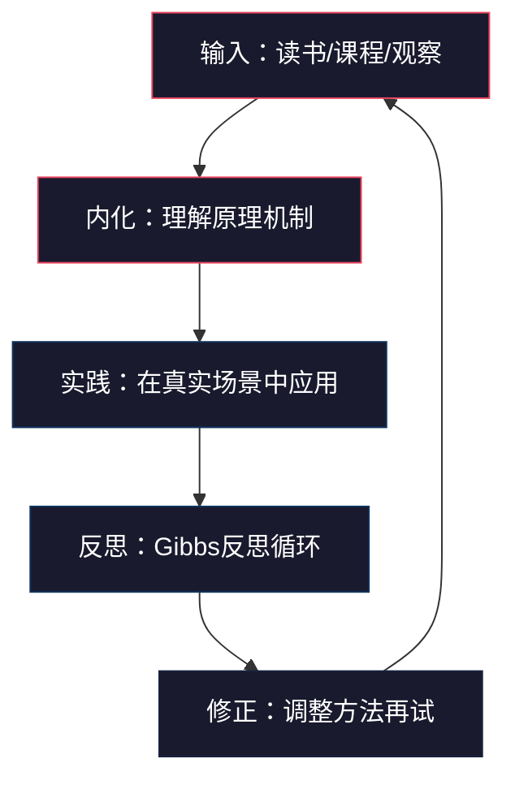
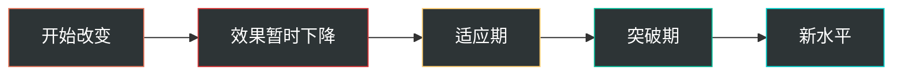

## 五、学习建议

推荐的书籍、课程、工具再好，如果学习方法不对，效果也会大打折扣。大多数人买了10本书读了2本，报了3门课完成1门，收藏了无数文章一篇没看——这不是意志力问题，而是缺乏一套系统的学习方法。本节提供一套**经过验证的领导力学习方法论**，帮助你把外部资源真正转化为内在能力。

### 学习方法的底层逻辑：为什么大多数人的领导力学习无效？

在讨论具体方法之前，先理解一个关键事实：领导力学习和知识类学习有本质区别。

| 维度 | 知识类学习（如编程、财务） | 领导力学习 |
|------|--------------------------|-----------|
| 学习方式 | 读→理解→记忆→应用 | 体验→反思→修正→再体验 |
| 反馈周期 | 即时（代码能跑/不能跑） | 延迟（行为影响数周后才显现） |
| 衡量标准 | 客观（对/错） | 主观（有效/无效/因人而异） |
| 关键瓶颈 | 知识量 | 自我觉察 + 实践机会 |
| 学习曲线 | 线性可预期 | 非线性，会有平台期 |

这意味着：用背单词的方式学领导力（只读书不实践）注定失败。领导力的学习必须遵循**"输入-实践-反思-修正"的螺旋上升模型**。

### 根据自身水平选择学习路径

不同阶段的学习者需要不同的资源配置和学习策略。盲目地从高难度资源开始，容易因"看不懂"而放弃；一直停留在入门资源，则会陷入"舒适区陷阱"。

#### 入门级：建立认知框架（0-3个月）

**目标**：理解"领导力是什么"，建立基本的自我认知。

**推荐资源配置**：

| 资源类型 | 具体推荐 | 学习方式 | 时间投入 |
|----------|----------|----------|----------|
| 核心书籍 | 《高效能人士的七个习惯》 | 精读 + 每章写500字心得 | 每周3-4小时，6周读完 |
| 在线课程 | Coursera「领导力入门」系列 | 看视频 + 完成课后作业 | 每周2-3小时，8周完成 |
| 测评工具 | MBTI / DISC / 盖洛普优势测评 | 完成测评 + 阅读报告 + 写自我分析 | 一次性2-3小时 |
| 日常练习 | 每日反思日志（15分钟） | 坚持30天不间断 | 每天15分钟 |

**学习策略**：

1. **先读"为什么"再读"怎么做"**。不要跳过理论直接找技巧——没有理论支撑的技巧是死知识。比如学习"以身作则"这个领导行为，先理解为什么领导者的行为比语言更有影响力（社会学习理论：人们倾向于模仿有权威地位的人的行为模式），再去实践。
2. **每读完一章，回答三个问题**：
   - 这章的核心观点用一句话概括是什么？
   - 这个观点在我过去的经历中有没有反例？
   - 下周我可以做一件什么事来验证这个观点？
3. **建立"领导力观察笔记本"**：记录你观察到的其他领导者的行为——上级、同事、公众人物——分析哪些行为有效、哪些无效、为什么。

#### 中级：技能深化与实践（3-12个月）

**目标**：将理论转化为可操作的技能，在真实场景中反复练习。

**推荐资源配置**：

| 资源类型 | 具体推荐 | 学习方式 | 时间投入 |
|----------|----------|----------|----------|
| 核心书籍 | 《领导力》《团队协作的五大障碍》《非暴力沟通》 | 主题阅读（同一主题读3-5本） | 每月1本，精读 |
| 系统课程 | 中欧商学院/混沌学园领导力课程 | 线下+线上结合，完成案例作业 | 按课程安排 |
| 同行交流 | 加入管理者读书会或学习小组 | 每两周一次讨论，分享实践心得 | 每月4-6小时 |
| 实践工具 | SBI反馈模型、GROW教练模型、决策矩阵 | 每周至少实际使用2次 | 融入日常工作 |

**学习策略**：

1. **主题阅读法**：不要一本一本地孤立阅读，而是围绕同一主题同时阅读3-5本书。例如学习"团队管理"时，同时读《团队协作的五大障碍》《重新定义团队》《赋能》，对比三位作者的观点差异，形成自己的判断。具体操作：
   - 第1周：快速翻阅3本书的目录，画出知识图谱
   - 第2-4周：精读每本书的核心章节（通常占全书40%的内容）
   - 第5周：写一篇3000字的综合对比笔记
2. **费曼学习法**：每学完一个知识点，试着用最简单的语言向一个不懂管理的人解释清楚。如果你解释不清楚，说明你还没真正理解。推荐方法：找一位非管理岗的朋友，每两周给他讲一个领导力概念，观察他是否能听懂。
3. **技能刻意练习卡**：为每个核心技能制作练习卡片：

【技能：SBI反馈模型】
练习目标：能够在不看笔记的情况下，自然流畅地进行SBI反馈
当前水平：□需要提示 □能完成但不流畅 □自然流畅
本周练习场景：周三代码评审时对小王使用正面SBI反馈
练习记录：
  第1次：_____（自我评分1-5）
  第2次：_____（自我评分1-5）
  第3次：_____（自我评分1-5）
复盘发现：_____

#### 高级：战略思维与个人风格（1年以上）

**目标**：形成独特的领导风格，发展战略影响力。

**推荐资源配置**：

| 资源类型 | 具体推荐 | 学习方式 | 时间投入 |
|----------|----------|----------|----------|
| 深度书籍 | 《原则》《思考，快与慢》《孙子兵法》 | 批判性精读 + 写书评 | 每月1本 |
| 高管项目 | 哈佛/CCL高管发展项目 | 沉浸式学习+行动学习项目 | 按项目安排 |
| 导师/教练 | 找一位资深高管或专业教练 | 每月1-2次深度对话 | 每月3-4小时 |
| 跨界学习 | 哲学、历史、军事战略、心理学 | 广泛涉猎，提炼思维模型 | 持续进行 |

**学习策略**：

1. **"读薄"与"读厚"交替**：
   - 读薄：用一张A4纸提炼一本书的核心框架（不超过10个关键词）
   - 读厚：基于这个框架，结合自己的实践经验，写出比原书更详细的个人理解
2. **建立个人领导力原则库**：像达利欧那样，从阅读、实践、反思中提炼出自己的原则。每条原则包含：
   - 原则陈述（一句话）
   - 来源（哪本书/哪次经历启发了你）
   - 适用条件（什么场景下这条原则最有效）
   - 一个真实案例（你亲身经历的）

【我的领导力原则 #7】
原则：在不确定环境中，速度比完美更重要
来源：OODA决策循环理论 + 2024年Q3产品上线经历
适用条件：信息不完整、时间窗口有限、可逆决策
案例：去年Q3我们花了3周做需求评审追求完美，
竞争对手2周就上线了MVP抢占了市场。后来我们
改用"两周迭代+快速验证"模式，反而更早找到了
正确的产品方向。

3. **跨领域思维迁移**：高级领导者的学习不应局限于管理领域。推荐阅读：
   - **军事战略**（《孙子兵法》《战争论》）→ 学习战略思维和资源调配
   - **哲学**（《沉思录》《论语》）→ 学习价值观领导和自我修养
   - **心理学**（《思考，快与慢》《影响力》）→ 学习认知偏差和人性
   - **历史**（《人类简史》《罗马人的故事》）→ 学习组织兴衰规律

### 五种核心学习方法详解

#### 方法一：主题阅读法——建立系统认知

**为什么单独读一本书效果有限？**

任何一本书都只是作者视角下的片面真理。单本书容易造成"管窥效应"——你以为自己理解了这个主题，实际上只看到了一个角度。主题阅读法通过同时对比多本同主题书籍，帮助你建立多维度、更完整的认知。

**具体操作步骤**：

1. **选题**：确定一个具体的学习主题（如"团队信任""授权管理""变革领导"）
2. **选书**：围绕这个主题选3-5本书，确保包含：
   - 1本经典理论书（奠基之作）
   - 1本实操工具书（有具体方法和模板）
   - 1本案例/传记书（真实故事）
   - 1本反面或争议观点（形成批判性思维）
3. **快速扫描**：花2小时翻阅所有书的目录和章节摘要，画出主题知识地图
4. **精读核心章节**：通常每本书只有30-40%的内容是核心，其余是展开和案例——聚焦核心
5. **对比笔记**：用表格形式对比不同作者的观点：

| 主题问题 | 作者A观点 | 作者B观点 | 作者C观点 | 我的判断 |
|----------|-----------|-----------|-----------|----------|
| 信任如何建立？ | 通过一致性行为 | 通过脆弱性展示 | 通过共同经历 | |
| 信任破裂后能修复吗？ | 非常困难 | 可以但需要时间 | 取决于破裂方式 | |

6. **综合输出**：写一篇3000字以上的主题综述，包含你的独立判断

#### 方法二：案例学习法——从他人经验中汲取智慧

**为什么纯理论学习容易"听了很多道理，依然过不好"？**

因为人类大脑天然对故事和场景更敏感，对抽象理论的记忆力很差。案例学习法把抽象理论"锚定"在具体场景中，大幅提升知识的可提取性。

**三类案例来源及使用方法**：

**商业案例（来自课程和书籍）**：
- 阅读时不要只看结论，先看情境——"如果我是当时的决策者，我会怎么做？"
- 然后对比案例中领导者的实际做法和最终结果
- 最后总结：这个案例说明了什么原理？我能从中学到什么？

**个人案例（来自自己的经历）**：
- 每周选取一个本周发生的关键事件
- 用STAR框架记录：

Situation（情境）：发生了什么？背景是什么？
Task（任务）：我当时的职责和目标是什么？
Action（行动）：我具体做了什么？
Result（结果）：产生了什么影响？短期和长期分别是什么？

- 然后对照所学理论分析：我的行为符合哪个理论框架？哪些地方做得好？哪些地方可以改进？

**观察案例（来自他人的行为）**：
- 每周观察一位领导者的行为（上级、同事、公众人物），记录1-2个关键场景
- 分析：这个行为的效果如何？如果换成我会怎么做？这个行为背后隐含什么领导理念？

#### 方法三：实践验证法——每学必练

**核心原则：学到的每一个新方法，必须在72小时内至少实践一次。**

研究表明，知识如果不在72小时内应用，遗忘率高达75%。领导力技能尤其如此——读完"如何进行有效授权"的章节，如果下周再实践，你大概率已经忘了关键步骤。

**72小时实践启动清单**：

| 学到的内容 | 72小时内可以做的最小实践 |
|------------|------------------------|
| SBI反馈模型 | 在下一次一对一中对下属做一次正面SBI反馈 |
| 深度倾听 | 在下一次对话中刻意不打断，用复述确认对方的意思 |
| GROW教练模型 | 在下一次辅导中尝试只用提问不用建议 |
| 决策矩阵 | 用决策矩阵分析一个本周需要做的决策 |
| 冲突处理模型 | 回忆最近一次冲突，用Thomas-Kilmann模型分析我当时选了哪种模式 |

**实践中的常见陷阱及应对**：

- **陷阱1："我没有实践机会"** → 应对：创造机会。主动请缨带一个项目、组织一次团队讨论、申请跨部门合作。领导力实践机会不是等来的，是主动争取的。
- **陷阱2："实践效果不好就放弃了"** → 应对：第一次尝试效果不好是正常的。任何新技能都需要5-8次练习才能初步掌握。把"失败"重新定义为"数据点"——每次不成功都告诉你一个有价值的信息。
- **陷阱3："工作太忙没时间练习"** → 应对：领导力练习不需要额外时间，它就是你日常工作的最佳方式。开会时练习倾听，做决策时用决策矩阵，给反馈时用SBI模型——这些不是"额外的练习"，而是"更好的工作方式"。

#### 方法四：交流分享法——打破认知盲区

**为什么独自学习容易走偏？**

因为每个人都有认知盲区——自己看不到的弱点和偏见。只有通过他人的反馈和不同视角的碰撞，才能发现自己看不到的东西。

**三种有效的交流学习方式**：

**1. 建立或加入管理者学习小组**
- 规模：4-8人，跨部门或跨公司效果更好
- 频率：每两周一次，每次2小时
- 模式：每次由一位成员分享一个真实的领导力挑战案例，其他人提问和建议
- 规则：保密、不评判、只提供建设性反馈

**学习小组讨论框架**（每次90分钟）：

第1阶段：案例呈现（20分钟）
分享者描述挑战案例，其他人只听不提问

第2阶段：澄清提问（10分钟）
其他人提出信息澄清类问题（不带建议的纯提问）

第3阶段：多角度分析（30分钟）
每人从自己的经验和角度分享看法
使用"我注意到...""如果是我可能...""有一个可能性是..."等句式

第4阶段：分享者回应（15分钟）
分享者回应哪些观点有启发，哪些不适用

第5阶段：行动承诺（10分钟）
分享者确定1-2个具体行动，下次小组会时回顾进展

第6阶段：元反馈（5分钟）
大家讨论这次讨论过程本身哪些做得好、哪些可改进

**2. 找一位"学习搭档"**
- 找一位和你水平相近、但视角不同的管理者
- 每周花30分钟互相分享本周的领导力实践和反思
- 互相挑战对方的盲点——"你有没有考虑过另一种可能？"

**3. 向下属征求反馈**
- 每季度用匿名问卷收集团队反馈：

请用1-5分评估以下方面（1=非常不同意，5=非常同意）：

1. 我的上级能够清晰地传达团队目标和方向
2. 当我犯错时，上级的反馈帮助我成长而不是打击我
3. 我的上级在做重要决策前会征求团队意见
4. 我的上级言行一致，值得信赖
5. 我的上级关心我的职业发展

开放问题：
- 如果可以改变上级的一个行为，你希望是什么？
- 上级做的最好的一件事是什么？

#### 方法五：定期复盘法——把经验变成能力

**为什么有些人工作10年，实际上只把1年的经验重复了10次？**

因为他们没有复盘的习惯。经验不会自动转化为能力——只有经过结构化反思的经验才能带来成长。研究表明，坚持复盘的管理者，其领导力成长速度是不复盘者的2.5-3倍。

**四层复盘体系**：

**每日微复盘（5分钟）**：
今天最重要的一个领导力行为是什么？
→ 效果如何？（1-5分）
→ 如果重来一次，我会怎么调整？
→ 明天我要刻意练习什么？

**每周复盘（30分钟）**：
本周领导力实践回顾：
1. 本周做得最好的3件事是什么？为什么好？
2. 本周最遗憾的1件事是什么？根本原因是什么？
3. 本周收到了什么反馈？我如何解读这些反馈？
4. 下周的领导力重点是什么？

**每月深度复盘（1-2小时）**：
使用Gibbs反思循环完整走一遍：

1. 描述：本月最重要的3个领导力场景
2. 感受：我在这些场景中的情绪状态如何？
3. 评估：哪些做得好？哪些不好？
4. 分析：好的背后是什么原理？不好的根本原因是什么？
5. 结论：我学到了什么？形成了什么判断？
6. 行动：下个月我将采取的2-3个具体改变

**每季度战略复盘（半天）**：
- 回顾季度初设定的领导力发展目标
- 用360度反馈数据评估进展
- 调整下季度的学习重点
- 更新个人领导力原则库

### 学习计划模板：12周领导力学习启动方案

以下是一个可直接使用的12周学习计划模板，适用于中级水平的学习者：

| 周次 | 输入（读书/课程） | 实践（每日行动） | 反思（复盘输出） |
|------|-------------------|-------------------|-------------------|
| 第1周 | 《领导力》第1-3章 | 每日写领导力反思日记 | 写出个人领导力定义 |
| 第2周 | 《领导力》第4-6章 | 练习倾听：每次对话不打断 | 记录3次倾听实践的效果 |
| 第3周 | 《领导力》第7-10章 | 练习SBI正面反馈2次 | 分析反馈对象的反应 |
| 第4周 | **复盘周：回顾前3周** | 继续每日反思 | 写3000字阶段总结 |
| 第5周 | 《团队协作的五大障碍》上半 | 与团队成员进行一对一沟通 | 记录团队信任现状评估 |
| 第6周 | 《团队协作的五大障碍》下半 | 组织一次团队信任建设活动 | 复盘活动效果和不足 |
| 第7周 | 《非暴力沟通》第1-4章 | 练习非暴力沟通四要素3次 | 对比之前和现在的沟通方式 |
| 第8周 | **复盘周：回顾前3周** | 继续每日反思 | 写3000字阶段总结 |
| 第9周 | 《非暴力沟通》第5-8章 | 练习在冲突中使用NVC | 记录冲突处理的新旧对比 |
| 第10周 | 主题阅读：对比3本书的观点 | 使用决策矩阵做2个决策 | 写主题阅读对比笔记 |
| 第11周 | 补充阅读：选择1本推荐课程 | 教练对话练习2次 | 记录被教练者的反馈 |
| 第12周 | **总复盘** | 继续每日反思 | 写12周学习总报告 |

**每周学习节奏建议**：

周一：阅读新章节（1.5小时）
周二：阅读续 + 做笔记（1小时）
周三：确定本周实践目标（15分钟）
周四-周五：在工作中实践（融入日常）
周六：写本周复盘笔记（30分钟）
周日：休息或轻度阅读

### 常见学习误区与纠正

#### 误区一：收藏=学习

**症状**：收藏了上百篇领导力文章，买了十几本书，报了3门在线课程，但都没有认真看过。

**本质原因**：收藏行为本身会产生"我已经在学习了"的虚假满足感，降低了真正的行动动力。

**纠正方法**：
- 实行"一进一出"原则：每收藏/购买一个新资源，必须先完成一个已有资源
- 设置"收藏清理日"：每月最后一天清理收藏夹，超过3个月未看的资源直接删除
- 记住：**一个读完并实践了的普通资源，价值远超十个收藏了但没看的经典资源**

#### 误区二：只读书不实践

**症状**：读了很多领导力书籍，能说出各种理论和模型，但在实际工作中行为模式没有改变。

**本质原因**：把"知道"等同于"做到"。实际上，从"知道"到"做到"之间隔着反复练习、失败、修正的漫长过程。

**纠正方法**：
- 每读完一本书，列出3个可以立即实践的行动项
- 设置实践优先级：**实践>阅读**。如果时间有限，宁可少读一章书也要完成本周的实践任务
- 建立"读-做-写"三步循环：读了一个知识点 → 立即实践 → 写下实践感受

#### 误区三：追求面面俱到

**症状**：试图同时提升所有领导力维度——沟通、决策、授权、激励、战略——结果哪个都没有突破。

**本质原因**：领导力是一个多维能力，同时提升所有维度会分散注意力，导致每个维度都停留在表面。

**纠正方法**：
- 采用"季度聚焦"策略：每个季度只聚焦1-2个维度
- 用"木桶思维"找最短板：哪个维度对你的工作影响最大？从那里开始
- 其他维度保持"最低维护"即可——不是不管，而是不重点突破

#### 误区四：忽视反馈

**症状**：闭门修炼，不寻求外部反馈，自己觉得自己进步很大，但团队感受不到变化。

**本质原因**：领导力的衡量标准不是你自认为如何，而是团队成员的实际感受和行为变化。没有外部反馈，你永远无法知道自己在他人眼中的真实表现。

**纠正方法**：
- 每季度做一次简短的360度反馈
- 建立"反馈搭档"：找一位信任的同事，每周互相给一个真实反馈
- 学会**主动请求反馈**的句式："在刚才的会议中，你觉得我的表达方式有什么可以改进的？"

#### 误区五：照搬他人方法

**症状**：看到某位CEO的做法很成功，就直接照搬到自己的团队，结果水土不服。

**本质原因**：领导力高度依赖情境——团队成熟度、组织文化、行业特点、个人风格都会影响一个方法的有效性。照搬他人的方法而不考虑自身情境，就像穿别人的鞋子——尺码不对。

**纠正方法**：
- 学习方法背后的**原理**，而非方法本身的具体形式
- 每次借鉴他人方法时，先问三个问题：
  1. 这个方法成功的前提条件是什么？
  2. 我的团队/组织是否具备这些条件？
  3. 需要做哪些调整才能适配我的情境？
- 小范围试验，验证有效后再推广

### 学习效果评估：如何知道自己在进步？

领导力学习不像考试有明确分数，但你可以通过以下维度来追踪进步：

#### 量化指标

| 指标 | 测量方式 | 频率 | 进步信号 |
|------|----------|------|----------|
| 团队满意度 | 匿名问卷（5分制） | 每季度 | 分数持续上升 |
| 一对一沟通质量 | 自评+下属反馈 | 每月 | 下属更愿意主动沟通 |
| 决策速度与质量 | 记录决策过程和结果 | 每次重大决策 | 决策周期缩短、成功率提升 |
| 冲突解决效果 | 冲突事件记录 | 每次冲突 | 冲突复发率下降 |
| 授权成功率 | 授权记录表 | 每月 | 下属独立完成率提升 |
| 反思日志质量 | 自评 | 每月 | 反思深度增加（从描述事件到分析原因） |

#### 质性指标（更真实但更难衡量）

- **下属开始主动和你讨论困难问题**：说明他们信任你
- **上级开始征求你对跨部门问题的意见**：说明你的影响力在扩大
- **团队成员之间自发地协作而非等你安排**：说明你赋能到位
- **面对突发情况时团队成员不慌张**：说明你建立了清晰的愿景和信任基础
- **其他部门的人主动找你请教管理问题**：说明你的领导力品牌开始外溢

### 长期学习心态建设

#### 接受"J型曲线"

领导力提升的过程不是直线上升，而是典型的J型曲线——刚开始改变行为方式时，效果可能反而变差（因为不熟练），坚持一段时间后才会出现质的飞跃。

在效果暂时下降的阶段，大多数人会放弃并回到旧模式。能坚持走过这段"低谷期"的人，最终都会迎来突破。

#### 保持"成长型思维"

斯坦福大学心理学家卡罗尔·德韦克的研究表明，拥有"成长型思维"的人（认为能力可以通过努力提升）比"固定型思维"的人（认为能力是天生的）在长期发展中表现显著更好。具体到领导力学习：

- **固定型思维**："我天生就不是当领导的料"→ 放弃学习
- **成长型思维**："我现在领导力还不够好，但通过学习和练习可以提升"→ 持续进步

#### 最重要的一个建议

**立即开始，不要等到"准备好了"再开始。**

你永远不会觉得"准备好了"。领导力是在实践中成长的，不是在准备中成长的。今天就选择一个本章介绍的方法，在明天的工作中尝试一次。一次不完美的一对一沟通，胜过读十篇关于一对一沟通的文章。

> 读完本节后，你的第一个行动应该是：翻开日历，在本周内标记出一个具体的时间，用来完成你选择的第一个学习行动。如果不在日历上，它就不存在。
