# 第十七章 外语学习

## 章节概览

> "语言的边界就是世界的边界。" —— 路德维希·维特根斯坦

外语学习是现代人自我提升中投入产出比最高的技能之一。它不仅是一种沟通工具，更是重塑大脑结构、拓展认知边界、打开职业天花板的系统性工程。本章将从认知科学的底层原理出发，经过方法论的系统梳理，落地到可执行的学习方案，最终帮你建立起一套属于自己的外语学习操作系统。

---

## 为什么需要学习外语

### 认知层面：重塑大脑的终身投资

学习外语不是简单的"多记一套词汇"，而是在物理层面改变大脑结构。以下是经过严格同行评审的研究结论：

**神经可塑性增强**。2012年发表在《Annals of Neurology》上的一项针对648名参与者、追踪长达21年的纵向研究（Bak et al.）表明，双语者在一般智力和阅读能力测试中的得分显著高于单语者，且这种优势在儿童期和老年期尤为明显——也就是说，外语学习的好处贯穿一生。

**执行功能提升**。Ellen Bialystock教授在约克大学长达数十年的研究系列证明，双语者在需要抑制干扰、切换注意力和管理工作记忆的任务中表现更优。大脑长期管理两套语言系统，相当于每天进行高强度的认知体操。

**延缓认知衰退**。2013年《Neurology》期刊的研究（Alladi et al.）追踪了648名印度痴呆症患者，发现双语者比单语者平均晚4.5年出现痴呆症状。这一发现被后续多项研究反复验证，双语已成为目前最有效的非药物性认知保护因素之一。

**大脑结构变化**。使用磁共振成像（MRI）的研究发现，双语者的大脑左侧顶下小叶的灰质密度显著增加，这一区域与语言处理和工作记忆密切相关。即便是成年后开始学习外语的成年人，也能观察到类似的结构性变化。

| 认知能力维度 | 双语者优势 | 研究来源 |
|:---|:---|:---|
| 注意力控制 | 抑制无关刺激的能力更强 | Bialystock et al., 2004 |
| 任务切换 | 切换成本更低，反应更快 | Prior & MacWhinney, 2010 |
| 工作记忆 | 容量和效率均有提升 | Morales et al., 2013 |
| 元语言意识 | 更早理解语言的符号性质 | Bialystock, 2001 |
| 创造性思维 | 思维更灵活，概念整合能力更强 | Kharkhurin, 2010 |
| 痴呆症延迟 | 平均延迟4.5年发病 | Alladi et al., 2013 |

### 职业层面：直接关联收入和机会

外语能力对职业发展的影响不是抽象的"拓宽视野"，而是可以量化的经济回报：

**薪资溢价**。根据《The Economists》2014年的分析报告，英语流利的工作者在全球非英语母语国家平均获得30-50%的薪资溢价。在欧洲，掌握两门外语的求职者比只掌握母语的求职者平均薪资高出11-15%（欧洲委员会2017年语言技能调查）。

**职业准入门槛**。根据EF（英孚教育）发布的2023年英语熟练度指数（EF EPI），全球前10大经济体中有8个把英语作为商务通用语言。在科技、金融、咨询、学术等行业，英语不是加分项，而是基本准入门槛。

**信息获取广度**。互联网上约60%的内容是英语，而中文内容约占1.5%（W3Techs, 2024）。掌握英语意味着你的信息获取能力扩大40倍。这意味着你能更早获取前沿技术文档、行业报告、学术论文和开源社区的讨论。

**跨境协作能力**。在远程工作和全球化团队成为常态的今天，能够用英语进行技术讨论、商务谈判和日常沟通的人，天然拥有更大的协作半径。

### 文化与个人成长层面

**思维方式的扩展**。语言不只是沟通工具，它塑造思维模式。Sapir-Whorf假说的强版本（语言决定思维）虽然过于极端，但弱版本（语言影响思维）已被大量实验支持。例如，中文使用量词系统培养了分类思维，而英语的时态系统强化了时间线性思维。学习一门新语言，本质上是在训练一种新的思维操作系统。

**直接体验文化的能力**。翻译永远是信息的有损压缩。读莎士比亚的原文和读中文译本，是两种完全不同的体验。能用日语看动漫、用韩语听K-pop、用法语读加缪，这种沉浸式的文化体验是任何翻译都无法替代的。

**社交网络的扩展**。掌握一门新语言，等于获得了一个新的社交网络的入口。无论是在国际会议上自由交流，还是在旅行中与当地人深入对话，外语能力直接提升了社交质量和人生体验的丰富度。

---

## 本章内容框架

本章共分五大部分，遵循"道→法→术→器→避坑"的逻辑递进结构：

```mermaid
graph TD
    A[第十七章 外语学习] --> B[基础理论篇]
    A --> C[具体方案篇]
    A --> D[产品推荐篇]
    A --> E[学习路径篇]
    A --> F[常见误区篇]

    B --> B1[第二语言习得理论]
    B --> B2[认知语言学基础]
    B --> B3[习得心理学]
    B --> B4[记忆科学与间隔重复]
    B --> B5[语言学习策略]
    B --> B6[关键期假说与年龄]
    B --> B7[动机理论]
    B --> B8[认知负荷理论]
    B --> B9[多语言学习]
    B --> B10[神经科学基础]

    C --> C1[英语整体方法论]
    C --> C2[听力训练方案]
    C --> C3[口语提升方案]
    C --> C4[阅读能力培养]
    C --> C5[写作能力培养]
    C --> C6[词汇积累方案]
    C --> C7[日语学习方案]
    C --> C8[其他语言方案]
    C --> C9[词汇记忆详解]
    C --> C10[口语提升详解]
    C --> C11[考试备考策略]
    C --> C12[个性化学习计划]

    D --> D1[经典书籍推荐]
    D --> D2[学习APP推荐]
    D --> D3[在线课程推荐]
    D --> D4[学习工具推荐]
    D --> D5[学习资源网站]
    D --> D6[学习设备推荐]
    D --> D7[选择产品原则]

    E --> E1[零基础到初级路径]
    E --> E2[初级到中级路径]
    E --> E3[中级到高级路径]
    E --> E4[高级到精通路径]

    F --> F1[十个常见误区逐一破解]

    style A fill:#1a1a2e,stroke:#e94560,color:#fff
    style B fill:#16213e,stroke:#0f3460,color:#fff
    style C fill:#16213e,stroke:#0f3460,color:#fff
    style D fill:#16213e,stroke:#0f3460,color:#fff
    style E fill:#16213e,stroke:#0f3460,color:#fff
    style F fill:#16213e,stroke:#0f3460,color:#fff
```

### 基础理论篇（道）

本篇解决"为什么这样学"的问题。包含10个子章节，系统梳理第二语言习得（SLA）领域的核心理论：

1. **第二语言习得理论概述** — 克拉申的输入假说、输出假说、互动假说的完整理论图景
2. **认知语言学与语言学习** — 构式语法、隐喻理论、原型理论如何指导学习策略
3. **二语习得心理学** — 语言焦虑、自我效能感、学习者信念等心理因素的影响机制
4. **记忆科学与语言学习** — 间隔重复、测试效应、编码深度等记忆原理的具体应用
5. **语言学习策略** — 元认知策略、认知策略、社会情感策略的分类与实践
6. **关键期假说与年龄** — 不同年龄段学习外语的科学分析，破除"太晚了"的迷思
7. **动机理论与语言学习** — 内在动机vs外在动机、Gardner的融合型动机理论、动机维持策略
8. **认知负荷理论** — 如何根据大脑的工作记忆限制来优化学习材料设计
9. **多语言学习** — 多语者大脑的运作机制、语言迁移效应、同时学习多门语言的策略
10. **神经科学基础** — 大脑语言处理的神经机制、双语大脑的结构差异

### 具体方案篇（术）

本篇解决"具体怎么做"的问题。这是全章的实战核心，包含12个子章节：

1. **英语学习的整体方法论** — 从顶层设计的角度梳理英语学习的全局框架
2. **听力训练方案** — 精听、泛听、影子跟读法的具体操作流程和材料推荐
3. **口语提升方案** — 从发音矫正到流利表达的完整训练体系
4. **阅读能力培养** — 分级阅读、快速阅读、深度阅读的策略和书单
5. **写作能力培养** — 从句子到段落到文章的系统写作训练
6. **词汇积累方案** — 高频词汇表、词根词缀法、语境记忆法的整合方案
7. **日语学习方案** — 假名、汉字、语法、听说的系统日语学习路径
8. **其他语言学习方案** — 韩语、法语、西班牙语、德语等热门语言的学习要点
9. **词汇记忆方法详解** — Anki使用指南、记忆宫殿、词频分析等深度技巧
10. **口语提升方法详解** — 语料库构建、口语思维训练、高频表达积累
11. **考试备考策略** — 雅思、托福、JLPT、TOPIK等考试的针对性备考方案
12. **制定个性化学习计划** — 根据个人时间、目标、水平量身定制学习计划的模板和方法

### 产品推荐篇（器）

本篇解决"用什么学"的问题。包含7个子章节，覆盖从书籍到APP到设备的完整工具链：

1. **经典书籍推荐** — 不同水平、不同目标的最佳教材和辅助读物
2. **学习APP推荐** — Duolingo、Anki、HelloTalk等主流工具的深度评测和使用技巧
3. **在线课程推荐** — Coursera、B站、YouTube等平台的优质课程筛选
4. **学习工具推荐** — 语法检查、发音评测、写作辅助等工具链
5. **学习资源网站** — 免费和付费的优质学习资源站点汇总
6. **学习设备推荐** — 词典笔、电子词典、降噪耳机等硬件设备的选购建议
7. **选择学习产品的原则** — 面对海量工具如何做出理性选择的决策框架

### 学习路径篇

本篇解决"我现在该做什么"的问题。为不同起点和不同目标的学习者提供清晰的进阶路线图，每条路径都标明了预期时间投入和阶段性里程碑。

### 常见误区篇

本篇解决"哪些做法是错的"的问题。逐一揭示语言学习中10个最具破坏力的常见误区，每个误区都配有科学解释和正确做法。

---

## 学习外语的五个核心理念

在进入具体内容之前，请先建立以下五个底层认知。这些理念贯穿本章始终，理解它们能帮助你在后续的学习过程中少走大量弯路。

### 理念一：语言是技能，不是知识

这是最根本的认知转变。

很多人把学外语当作学历史——上课、背诵、考试。但语言的本质是一种运动技能（motor skill），它更接近弹钢琴或打篮球，而不是记忆事实。你不会通过阅读游泳教材学会游泳，同样，你不会通过背语法书学会说外语。

**这意味着什么？**

- 判断学习效果的标准不是"我知道多少语法规则"，而是"我能在真实场景中多流畅地使用"
- 学习活动的重心应该从"理解和记忆"转向"使用和练习"
- 正如学习乐器需要每天练习音阶，语言学习需要每天进行输入和输出练习
- "学会了"的真正标准是自动化——不用思考就能正确使用，就像你开车时不用想"先踩离合再挂挡"

神经科学的证据支持这一观点：语言能力的神经表征主要存储在程序性记忆系统（基底神经节和小脑），而非陈述性记忆系统（海马体和颞叶）。这意味着语言学习本质上是建立和强化神经通路的过程，需要大量重复和实践。

### 理念二：输入决定输出的质量上限

克拉申（Stephen Krashen）的输入假说（Input Hypothesis）是第二语言习得研究中影响最大的理论之一。其核心主张是：语言习得发生在学习者接触到"可理解性输入"（comprehensible input）时，即略高于其当前水平的语言材料。

用公式表达就是 **i+1**：i代表你当前的语言水平，1代表略高于当前水平的内容。

**实践含义：**

- 在学习初期，大量输入（听和读）比大量输出（说和写）更重要
- 学习材料的难度需要精确控制——太简单无法进步，太难导致挫败感
- 大量、持续、可理解的输入是语言习得的必要条件，不是充分条件
- 没有足够的输入积累，口语训练和语法练习都是空中楼阁

但输入假说也有其局限性。Merill Swain的输出假说（Output Hypothesis）指出，输出练习（说和写）在语言习得中扮演着不可替代的角色——它迫使学习者从语义加工转向句法加工，注意到自己语言系统中的缺口。因此，最佳策略是前期以大量输入为主、适当输出为辅，后期逐步加大输出比重。

**一个实用的输入/输出配比参考：**

| 学习阶段 | 输入占比 | 输出占比 | 说明 |
|:---|:---|:---|:---|
| 入门期（0-6个月） | 80% | 20% | 以听力和阅读为主，少量跟读模仿 |
| 初级期（6-18个月） | 70% | 30% | 开始简单的口语和写作练习 |
| 中级期（18-36个月） | 55% | 45% | 大量对话练习和写作训练 |
| 高级期（36个月以上） | 40% | 60% | 以输出驱动，用输出发现输入缺口 |

### 理念三：坚持比方法更重要，但正确的方法让坚持变得容易

语言学习是一场马拉松，不是百米冲刺。没有任何方法能在短期内让一个人流利掌握一门外语——如果有人这样承诺，那一定是骗局。

但坚持并不意味着痛苦的意志力消耗。真正聪明的做法是通过系统设计让学习变得可持续：

**降低启动成本**。把学习材料放在触手可及的地方，让"开始学习"这一步尽可能简单。手机里装好APP，床头放好书，耳机随时备好。行为科学的研究表明，降低启动阻力比增强动机更有效。

**建立触发机制**。把外语学习绑定到已有的日常习惯上。例如：通勤路上听英语播客、午休时用APP刷单词、睡前读10分钟英文书。习惯堆叠（habit stacking）是行为设计中最可靠的策略之一。

**设计即时反馈**。没有反馈的学习是低效的。定期测试自己的水平，记录进步数据，参加口语角或在线交流——让自己"看到"进步是最强的动机维持手段。

**控制学习强度**。每天30分钟的持续学习，一年累计182小时，其效果远超偶尔的周末突击。认知科学中的"间隔效应"（spacing effect）证明，分散在多个时间段的学习比集中在单次的学习更有效。

| 学习模式 | 年度总时长 | 词汇习得量 | 口语流畅度提升 | 可持续性 |
|:---|:---|:---|:---|:---|
| 每天30分钟 | 182小时 | ~2000词 | 显著 | 高 |
| 每周一次2小时 | 104小时 | ~800词 | 微弱 | 中 |
| 寒暑假突击 | ~120小时 | ~1000词 | 短暂提升后衰退 | 低 |
| 每天30分钟 + 周末2小时 | 286小时 | ~3500词 | 快速显著提升 | 高 |

### 理念四：犯错是进步的阶梯，不是失败的标志

语言学习中最大的心理障碍不是难度，而是对犯错的恐惧。很多人学了十几年英语仍然无法开口，根本原因是害怕犯错、害怕被嘲笑。

**从认知科学的角度理解犯错：**

大脑的语言学习机制依赖于"预测-反馈"回路。当你说出一个句子时，大脑在做预测——这个词对不对？语法对不对？对方能理解吗？当收到反馈（被纠正、对方的理解或困惑表情）时，大脑更新其内部模型。犯错是这个模型更新过程的核心驱动力——没有错误信号，大脑就无法调整其语言系统。

**实用的犯错心态建设：**

- **目标设定**：把目标从"说对"改为"说出来"。在口语练习阶段，流利度优先于准确度
- **错误日志**：记录每次犯的错误，每周回顾。你会发现同样的错误犯几次后就会自动修正
- **安全环境**：先在低风险环境中练习（语言交换伙伴、AI对话工具），建立信心后再进入高风险场景
- **母语者视角**：你听外国人说中文时犯错会觉得好笑还是鄙视？大多数情况是善意的微笑。别人对你也一样

### 理念五：兴趣是学习效率的最大乘数

神经科学的大量研究证明，积极情绪和兴趣能够显著增强记忆编码效率。当大脑处于好奇、兴奋、愉悦的状态时，海马体的活动增强，记忆形成的速度和质量都会提高。

**在实践中应用这一理念：**

- **材料选择**：用你感兴趣的内容学外语。喜欢体育就看ESPN，喜欢科技就听Lex Fridman Podcast，喜欢烹饪就看英文食谱
- **方式选择**：喜欢社交就找语言交换伙伴，喜欢游戏就玩英文游戏，喜欢追剧就看原声剧集
- **多感官参与**：结合听觉（播客）、视觉（视频）、触觉（打字写作）、动觉（边走边听）等多种感官通道，让学习过程更丰富有趣
- **里程碑庆祝**：每完成一个阶段性目标，给自己一个小奖励。正向反馈循环能显著提升长期坚持率

---

## 语言能力水平的衡量标准

在开始学习之前，你需要了解国际通用的语言能力评估框架，这样你才能准确定位自己的起点、设定合理的目标、选择匹配难度的学习材料。

### 欧洲共同语言参考框架（CEFR）

CEFR是目前全球最广泛使用的语言能力评估标准，将语言能力分为六个等级：

| 等级 | 名称 | 能力描述 | 对应词汇量（英语） | 预计学习时长 |
|:---|:---|:---|:---|:---|
| A1 | 入门 | 能理解和使用最基本的日常表达，能进行简单的自我介绍 | ~500词 | 80-100小时 |
| A2 | 初级 | 能理解日常高频表达，能描述简单的生活需求 | ~1500词 | 160-200小时 |
| B1 | 中级 | 能理解工作、学习中的常规话题，能处理旅行中的大部分情景 | ~3000词 | 350-400小时 |
| B2 | 中高级 | 能理解复杂文本的主旨，能与母语者进行流利自然的交流 | ~6000词 | 500-650小时 |
| C1 | 高级 | 能理解各种复杂文本，能在社交和职业场合灵活运用语言 | ~10000词 | 700-800小时 |
| C2 | 精通 | 能轻松理解几乎所有听到和读到的内容，表达精准流畅 | ~15000词+ | 1000-1200小时 |

> **注：** 学习时长为英语对中文母语者的参考值，数据来源于英国文化协会（British Council）和美国外交学院（FSI）的语言难度分类。实际时长因个人学习方法、投入时间和语言天赋差异会有显著不同。

### 常见考试与CEFR的对应关系

| 考试 | A1 | A2 | B1 | B2 | C1 | C2 |
|:---|:---|:---|:---|:---|:---|:---|
| 雅思 IELTS | — | — | 4.0-5.0 | 5.5-6.5 | 7.0-8.0 | 8.5-9.0 |
| 托福 TOEFL iBT | — | — | 42-71 | 72-94 | 95-114 | 115-120 |
| 多邻国 Duolingo | 10-15 | 20-25 | 30-40 | 45-75 | 80-105 | 110-160 |
| JLPT（日语） | N5 | N4 | N3 | N2 | N1 | — |
| TOPIK（韩语） | TOPIK I | TOPIK I | TOPIK II 3级 | TOPIK II 4级 | TOPIK II 5-6级 | — |

### AI时代的语言学习：变与不变

近年来ChatGPT、Claude等AI语言模型的兴起引发了一个热门讨论：学外语还有必要吗？

**变的部分：**
- 翻译工具的即时可用性降低了"生存级"外语需求——出国旅行时，实时翻译已经足够应付基本交流
- AI对话伙伴（如ChatGPT语音模式）提供了前所未有的24小时可用、零社交压力的口语练习工具
- AI写作辅助工具可以帮助你快速修改和润色外语写作
- 语言学习的门槛降低了——AI可以充当任何水平的耐心教师

**不变的部分：**
- 深度理解一种文化仍然需要真正的语言能力——AI翻译能传达信息，但无法传达语感、幽默、言外之意
- 职场中的有效沟通需要即时的、自然的语言反应，翻译工具在实时会议和社交场合仍然笨拙
- 语言学习对大脑的认知训练价值无法被AI替代——你是要锻炼大脑，不是让AI替你锻炼
- 学习外语的过程本身就是一种自我提升——纪律、毅力、跨文化理解力，这些品质在AI时代更加珍贵

**结论：** AI不是替代语言学习的理由，而是语言学习的强力加速器。善用AI工具可以将你的学习效率提升2-3倍，但语言能力的核心——理解和表达的神经通路——只能通过你自己的大脑来建立。

---

## 如何使用本章

本章的设计理念是"工具书"而非"教科书"——你不需要从头读到尾，而是根据自己的需求跳转到相关章节。

### 按读者类型的阅读建议

| 读者类型 | 建议阅读路径 | 预计阅读时长 |
|:---|:---|:---|
| 外语学习新手 | 本章概览 → 基础理论1-4 → 学习路径 → 具体方案1-6 | 3-4小时 |
| 有一定基础想突破 | 基础理论4-5 → 具体方案中对应技能章节 → 常见误区 | 2-3小时 |
| 想学特定语言 | 基础理论1-2 → 具体方案中对应语言章节 → 产品推荐 | 2小时 |
| 备考雅思/托福 | 具体方案11(考试备考) → 具体方案各技能章节 → 产品推荐 | 2-3小时 |
| 家长辅导孩子 | 基础理论6(年龄因素) → 基础理论7(动机) → 产品推荐 → 学习路径 | 1.5-2小时 |
| 快速概览 | 本章概览（本文件）+ 学习路径 + 常见误区 | 1小时 |

### 快速自测：你的外语学习起点在哪里

在开始具体学习之前，花5分钟回答以下问题，帮助你定位自己的当前水平和核心需求：

1. **你目前能听懂多少目标语言的日常对话？** （几乎听不懂 / 能听懂关键词 / 能理解大意 / 能跟上正常语速）
2. **你目前能用目标语言进行多长时间的连续表达？** （无法开口 / 几句话 / 几分钟 / 自由对话）
3. **你学习外语的主要目的是什么？** （工作需要 / 考试通过 / 出国生活 / 兴趣爱好 / 辅导孩子）
4. **你每天能投入多少时间学习？** （15分钟以下 / 15-30分钟 / 30-60分钟 / 1小时以上）
5. **你之前是否有过失败的学习经历？如果有，你认为主要原因是？**

根据你的回答，在后续的"学习路径"章节中找到匹配的起点方案。

---

## 本章适用人群

本章内容面向以下六类核心读者：

**职场人士**。需要英语或其他外语来处理邮件、参加国际会议、阅读行业资料、与海外客户沟通。核心诉求是实用性和效率——在有限时间内获得最大的职业回报。

**留学备考者**。需要通过雅思、托福、GRE、JLPT等语言考试。核心诉求是针对性——知道考什么、怎么考、怎么拿到目标分数。

**终身学习者**。纯粹出于兴趣和自我提升而学习外语。核心诉求是可持续性和乐趣——享受学习过程，不以考试为目标。

**重学者**。曾经在学校学过多年外语但效果不佳，或者长时间不用已经遗忘。核心诉求是重建信心和找到正确方法——他们往往有基础但缺乏有效的学习策略。

**家长**。希望辅导孩子学外语或为孩子选择合适的学习资源和路径。核心诉求是了解语言学习的科学原理，做出对孩子最有利的教育决策。

**多语言学习者**。已经掌握一门外语，想要学习新的语言。核心诉求是利用语言迁移效应和已有的学习经验，更高效地掌握新语言。

无论你属于哪一类，本章的理论框架、方法论和工具推荐都适用于你。你只需要根据自己的具体目标和当前水平，在学习路径章节中找到对应的起点即可。

---

> 准备好了吗？让我们从基础理论开始，建立对外语学习的科学认知，然后一步步走向实践。外语学习不需要天赋，不需要语言天分，需要的只是正确的方法和持续的行动。
