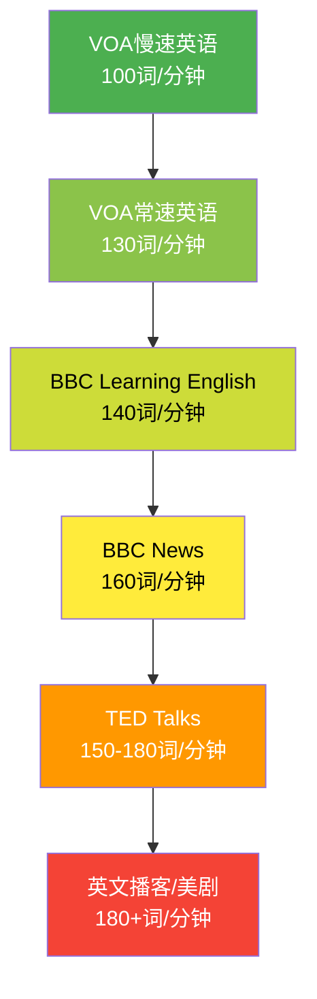
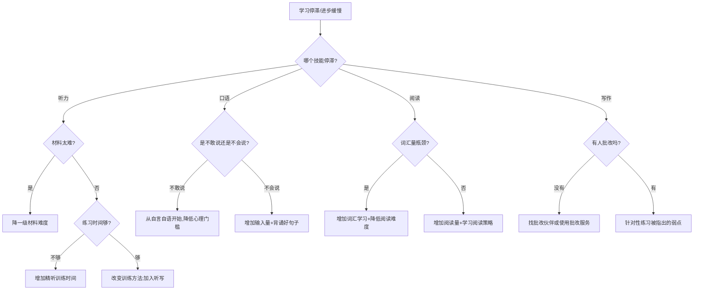

# 外语学习：学习路径

学习任何技能都需要路线图，外语学习尤其如此。语言能力是一个多维度、长周期的系统工程，没有清晰的路径规划，学习者很容易在"什么都学一点"的泥潭中消耗热情。本节提供一套从语言选择到高阶精通的完整路径体系，覆盖英语、日语、韩语、法语、西班牙语、德语六大语种，以及留学备考、职场提升、旅游速成等特殊场景，并为每个阶段提供可执行的日程安排、资源推荐和里程碑检验标准。

## 一、选择学什么语言：决策框架

在投入数百甚至数千小时之前，先花一小时想清楚"学什么"和"为什么学"，能避免日后走大量弯路。

### 1.1 按目标导向选择语言

| 目标类型 | 推荐语言 | 理由 |
|----------|----------|------|
| 职业发展/全球化通用 | 英语 | 全球商务、学术、科技的通用语言，覆盖最广 |
| 留学北美/英联邦 | 英语 | 学术环境的必要条件 |
| 留学日本 | 日语 | 日本大学课程多以日语授课，生活也高度依赖日语 |
| 留学韩国/追星娱乐 | 韩语 | 韩流文化产业发达，韩国留学性价比高 |
| 留学欧洲（公立免学费） | 法语/德语 | 法国、德国公立大学免学费，需语言达标 |
| 外贸/拉美市场 | 西班牙语 | 拉美市场广阔，西班牙语是仅次于中文的第二大母语人数语言 |
| 学术研究（哲学/文学/音乐） | 德语/法语 | 大量经典文献为德语或法语原版 |
| 个人兴趣/文化探索 | 任意 | 选择最能激发兴趣的语言，兴趣是坚持的最大动力 |

### 1.2 按难度评估选择语言

不同语言的学习难度差异巨大。美国外交学院（FSI）基于数十年培训数据，将语言按英语母语者的学习难度分为四类。对于中文母语者，难度排序有所不同：

| 语言 | FSI等级 | 中文母语者预估时长 | 核心难点 | 核心优势 |
|------|---------|-------------------|----------|----------|
| 英语 | I级 | 600-750小时 | 发音系统复杂、拼写不规则 | 教育体系有基础、资源最丰富 |
| 西班牙语 | I级 | 600-750小时 | 动词变位、语法性别 | 发音规则、与英语同源词多 |
| 法语 | I级 | 600-750小时 | 发音连诵、动词变位 | 与英语同源词极多（约40%词汇） |
| 德语 | II级 | 750-900小时 | 四格变位、名词性别、语序 | 发音相对规则、逻辑性强 |
| 日语 | III级 | 2200小时 | 三套书写系统、敬语、语法结构 | 汉字优势（中文字形相近） |
| 韩语 | III级 | 2200小时 | 敬语层级、语法结构 | 表音文字（谚文）易学、无汉字 |

### 1.3 语言选择决策矩阵

当你在两门语言之间犹豫时，用以下四个维度打分（1-5分），加总后选择分数最高的：

评估维度         权重    说明
──────────────────────────────────────────────
动机强度         ×3      你有多想学？内在动机最重要
使用场景         ×2      学完在哪里用？频率多高？
时间预算         ×2      你每天/每周能投入多少时间？
学习资源可用性   ×1      你能否方便地获取教材、语伴、环境？

**示例**：一个想进日企、每天能学1小时、喜欢动漫的人选择日语：
- 动机强度：4×3=12
- 使用场景：4×2=8
- 时间预算：3×2=6
- 资源可用性：5×1=5
- 总分：31

另一个想留学法国、每天能学45分钟的人选择法语：
- 动机强度：5×3=15
- 使用场景：5×2=10
- 时间预算：2×2=4
- 资源可用性：4×1=4
- 总分：33 → 选法语

## 二、语言学习路径的科学依据

### 2.1 为什么需要分阶段

第二语言习得研究表明，语言能力的增长不是线性的，而是呈S型曲线——初期进步缓慢（建立基础），中期快速提升（大量可理解性输入产生质变），后期进步再次放缓（接近瓶颈）。

克拉申（Stephen Krashen）的"i+1输入假说"指出：学习者接触比当前水平略高一点的输入材料时，习得效率最高。太简单则无进步，太难则无法理解。分阶段学习的核心，就是在每个阶段提供恰当难度的"i+1"输入。

### 2.2 阶段划分的科学标准

| 水平阶段 | CEFR等级 | 词汇量参考 | 听力理解能力 | 口语产出能力 |
|----------|----------|-----------|-------------|-------------|
| 入门 | A1 | 500-800 | 简单指令和问候 | 自我介绍、基本需求 |
| 初级 | A2 | 1500-2500 | 慢速清晰的日常对话 | 日常话题简短交流 |
| 中级 | B1 | 4000-5000 | 常速新闻主旨理解 | 就熟悉话题较流利讨论 |
| 中高级 | B2 | 7000-8000 | 电影/演讲主旨理解 | 复杂话题论证表达 |
| 高级 | C1 | 12000-15000 | 各种口音无字幕理解 | 专业领域深度交流 |
| 精通 | C2 | 20000+ | 近母语水平 | 近母语水平 |

### 2.3 每日学习时间与进步速度的关系

语言学习遵循"边际收益递减"规律——每天学习30分钟的效率（每小时进步量）高于每天学习5小时。但总进步量仍与总投入时间成正比。

| 每日投入时间 | 达到B1水平所需时间 | 达到C1水平所需时间 | 适合人群 |
|-------------|-------------------|-------------------|----------|
| 30分钟 | 18-24个月 | 5-7年 | 上班族、时间紧张者 |
| 1小时 | 10-14个月 | 3-4年 | 业余学习者（推荐） |
| 2小时 | 6-8个月 | 2-2.5年 | 全力投入者 |
| 4小时+ | 3-5个月 | 1-1.5年 | 全日制学习者 |

---

## 三、英语学习完整路径

英语是全球学习人数最多的外语，资源最丰富，路径最成熟。以下路径按"每天投入1-1.5小时"设计，实际进度可根据个人时间按比例调整。

### 3.1 阶段一：零基础到初级（0-6个月，A1→A2）

#### 阶段目标

- 掌握英语48个音素的准确发音（英式RP或美式GA选一种）
- 掌握1500-2000个高频词汇（覆盖日常文本的85%）
- 理解慢速清晰英语对话的70%以上
- 能进行1-2分钟的自我介绍和日常简单交流
- 能读懂200词以内的简单短文

#### 第1个月：语音系统建立

语音是这个阶段最值得投入的部分。发音一旦固化，后期纠正的成本是初期学习的10倍以上。神经语言学研究表明，成年学习者的语音感知窗口在开始学习的前3-6个月内最为敏感。

**周计划安排：**

| 周次 | 核心任务 | 每日时间分配 | 具体练习 |
|------|---------|-------------|----------|
| 第1周 | 26个字母+5个长元音+7个短元音 | 40分钟：20分钟跟读+20分钟听辨 | 用音标对照口型图逐个攻克 |
| 第2周 | 8个双元音+核心辅音（p/b/t/d/k/g等） | 40分钟：20分钟跟读+20分钟最小对立体练习 | ship/sheep, bad/bed, cat/cut对比练习 |
| 第3周 | 剩余辅音（θ/ð/ʃ/ʒ/tʃ/dʒ等）+连读规则 | 45分钟：含15分钟连读专项 | "not at all"→/nɒtætɔːl/整体发音 |
| 第4周 | 重音规则+基本语调（升调/降调） | 45分钟：含15分钟语调模仿 | 陈述句降调、一般疑问句升调 |
| 第5-6周 | 综合巩固+简单句子的节奏感 | 50分钟：含20分钟段落朗读 | 新概念英语第一册跟读 |
| 第7-8周 | 弱读、缩读、语流中的自然发音 | 50分钟：含20分钟真实语速材料 | I'm gonna wanna gonna等口语缩读 |

**发音学习方法——"四步模仿法"：**

1. **听准**：先听3遍标准发音，不跟读，专注于听音位特征
2. **对比**：将目标音与母语中相似的音对比，找到差异点
3. **模仿**：跟读10遍以上，每次都录音
4. **校验**：回放录音，与原音对比，标注差异，继续修正

**推荐资源：**

- **视频**：Rachel's English（美式，YouTube免费，口型特写清晰）、BBC Learning English Pronunciation（英式）
- **APP**：ELSA Speak（AI语音评测，精准指出发音问题，免费版够用）、Sounds: The Pronunciation App（Macmillan出品，音标卡片）
- **教材**：《新概念英语》第一册跟读模仿（经典且循序渐进）
- **音标工具**：Cambridge Dictionary在线版（英美双发音，可对比）

#### 第2-3个月：基础词汇+核心语法

**词汇学习策略：**

不要按字母顺序背单词表。高频词统计显示，英语中最常用的1000个词覆盖了日常口语的85%和书面文本的80%。优先掌握这些词，学习效率远高于从A背到Z。

| 词汇量 | 口语覆盖率 | 书面覆盖率 | 对应阶段 |
|--------|-----------|-----------|----------|
| 500词 | 75% | 70% | 完成第2个月 |
| 1000词 | 85% | 80% | 完成第3个月 |
| 2000词 | 90% | 85% | 完成初级阶段 |
| 3000词 | 93% | 88% | 中级初期 |
| 5000词 | 95% | 92% | 中级完成 |

**每日词汇学习流程（20个新词，共30分钟）：**

1. 前5分钟：快速浏览20个词的发音和基本义
2. 中间15分钟：每个词造一个与自己生活相关的例句，大声朗读
3. 后10分钟：用Anki录入（正面=英文句子留空，反面=答案+发音+图片）
4. 睡前5分钟：复习今日Anki卡片（利用睡眠巩固记忆的科学原理）

**核心语法进度：**

| 月份 | 语法内容 | 学习方法 |
|------|---------|----------|
| 第2个月 | be动词、一般现在时、名词单复数、人称代词 | 通过Duolingo建立直觉→翻阅语法书补充规则 |
| 第3个月 | 现在进行时、一般过去时、there is/are、介词 | 在简单阅读中识别语法现象→总结规律 |

**推荐资源：**

- **APP**：Duolingo（免费，游戏化设计适合初期建立习惯，每日15-20分钟）
- **教材**：English Grammar in Use 初级版（Murphy著，全球最畅销语法书，左页讲解右页练习）
- **词汇**：Anki + 剑桥英语频率词表（可直接导入共享牌组）

#### 第4-6个月：听说读写全面提升

这个阶段要从"单项输入"转向"四项并行"，建立语言运用的基本循环。

**每日学习安排（约60-70分钟）：**

| 时段 | 活动 | 时长 | 具体内容 |
|------|------|------|----------|
| 早起通勤 | 泛听 | 15分钟 | VOA慢速英语或ESL Pod（被动听即可） |
| 午休前 | 词汇+语法 | 15分钟 | Anki复习+Duolingo一个单元 |
| 晚间集中 | 精听训练 | 15分钟 | 一段VOA慢速，听写→对照→跟读 |
| 晚间集中 | 口语练习 | 10分钟 | 自言自语描述今天做了什么 |
| 晚间集中 | 阅读练习 | 15分钟 | Oxford Bookworms入门级或Graded Reader |
| 睡前 | 写作练习 | 5分钟 | 写3-5个今天学到的词的例句 |

**精听训练四步法：**

1. **盲听**：不看文本，听2遍，写下听到的关键词
2. **对照**：看原文，标记没听出来的地方
3. **分析**：为什么没听出来？是连读？弱读？生词？语速？
4. **跟读**：模仿原音的语速、语调、节奏，至少5遍

#### 阶段里程碑（自评检验）

完成零基础到初级阶段后，用以下标准自评。全部打勾则可进入下一阶段：

- [ ] 能准确发出48个音素，录音对比偏差度低于20%
- [ ] Anki词汇量测试显示已掌握1500+词
- [ ] 听VOA慢速英语，能理解80%以上的内容
- [ ] 能用英语自我介绍持续1分钟不卡壳
- [ ] 能阅读Oxford Bookworms Level 1，理解率90%以上
- [ ] 能写50词的英文段落，语法错误率低于30%

#### 常见问题速查

**Q：发音总是不标准怎么办？**
A：99%的情况是"听得不够准"而非"嘴巴不够灵活"。先用ELSA Speak等AI工具精确诊断哪些音有问题，然后对着镜子看口型，逐个音素攻克。不要同时纠多个音。

**Q：背了单词总是忘怎么办？**
A：这是正常的——艾宾浩斯遗忘曲线告诉我们，新信息在24小时内会遗忘70%。解决方案不是"背更多遍"，而是"在正确的时间复习"。Anki的间隔重复算法就是为此设计的。另外，一个词需要在7个不同语境中遇到才能真正内化，所以"背单词+大量阅读"的组合远胜于"只背单词"。

**Q：看不懂语法书怎么办？**
A：先通过Duolingo等APP建立语法的"感性认识"（你见过这个句型很多次了），再翻语法书理解"为什么这样"。顺序不能反——先有语感，再学规则。

---

### 3.2 阶段二：初级到中级（6-18个月，A2→B1）

#### 阶段目标

- 词汇量达到4000-5000（覆盖日常文本92%）
- 听懂常速英语新闻的70%以上
- 就日常话题进行5分钟以上的连续对话
- 阅读中等难度英文文章（如BBC News简化版）
- 写出结构完整的250词短文

#### 核心突破：听力是这个阶段的主战场

研究表明，中级学习者最常遇到的瓶颈是"听不懂真实语速的英语"。原因是：教科书录音的语速（约100词/分钟）远低于真实对话（150-180词/分钟）。从慢速到常速的过渡，需要系统性训练。

**听力升级路径（第7-12个月重点）：**

**每日学习安排（约80-90分钟）：**

| 时段 | 活动 | 时长 | 月度侧重 |
|------|------|------|----------|
| 通勤/做家务 | 影子跟读 | 20分钟 | 7-9月用VOA常速，10-12月用BBC |
| 通勤/做家务 | 泛听播客 | 20分钟 | All Ears English / 6 Minute English |
| 午休 | 词汇学习 | 15分钟 | Anki复习+从阅读中积累新词 |
| 晚间 | 精听训练 | 20分钟 | 听写→对照→跟读→复述 |
| 晚间 | 口语练习 | 15分钟 | 第7-9月自言自语+语伴；第10-12月语伴+话题讨论 |
| 晚间 | 阅读 | 15分钟 | 7-9月分级读物；10-12月英文新闻网站 |
| 周末 | 写作 | 30分钟 | 英文日记100-200词+每周一篇250词短文 |

**影子跟读（Shadowing）详解——中级阶段最高效的口语训练法：**

影子跟读是指在听到音频后0.5-1秒内，几乎同步地重复所听到的内容。它由Alexander Arguelles教授推广，被证明能同时提升发音、语调、流利度和听力。

操作步骤：
1. 先听一遍材料，理解大意
2. 第二遍开始跟读，尽量与原音保持0.5-1秒的延迟
3. 如果跟不上，放慢速度（用播放器降速到0.8x），跟上后恢复正常速度
4. 每天坚持20分钟，选1-2分钟的片段反复练习
5. 录音对比，重点关注语调和节奏而非个别单词

**口语突破策略：**

中级阶段的口语核心问题不是"不会说"，而是"不敢说"和"说得不流利"。解决方案：

1. **降低心理门槛**：先从"自言自语"开始——每天用英语描述你正在做的事情，没人听就不怕犯错
2. **找语伴**：HelloTalk（免费，找母语者互相教）、Tandem（类似功能）、italki（付费外教课，但质量有保证）
3. **话题清单**：不要漫无目的地聊，每次语伴对话前准备3个话题和相关词汇
4. **录音复盘**：每月录一段2分钟的独白，与3个月前对比，看到进步会极大增强信心

**阅读升级路径（第13-18个月重点）：**

| 阶段 | 材料 | 阅读策略 | 目标 |
|------|------|----------|------|
| 第13-15月 | Oxford Bookworms Level 3-4 | 广泛阅读为主，查词不超过每页3个 | 建立阅读信心和习惯 |
| 第15-16月 | BBC Learning English / VOA News | 精读+泛读结合，标注好的表达 | 适应真实语言风格 |
| 第16-18月 | 简单原版书（如《小王子》英译、《谁动了我的奶酪》） | 章节制阅读，每章总结 | 过渡到无辅助阅读 |

**写作能力培养：**

| 时间 | 练习内容 | 字数 | 重点 |
|------|---------|------|------|
| 第7-9月 | 每日英文日记 | 50-100词 | 用今天学的词造句，不求完美 |
| 第10-12月 | 每日日记+每周短文 | 日记100词+短文200词 | 学习段落结构（主题句-支撑-总结） |
| 第13-18月 | 每周议论文 | 250-300词 | 学习对比、因果、举例等论证方法 |

#### 突破中级瓶颈的关键策略

中级阶段（B1）是大多数学习者的"死亡谷"——据统计，约70%的外语学习者会在这个阶段停滞不前。原因是：基础阶段的进步是显而易见的（从0到能说话），而中级阶段的进步是渐进的（从能说话到说得好），感知上容易觉得"没有进步"。

**突破瓶颈的五把钥匙：**

**第一把：从教科书材料转向真实语言**
教科书的语言是"净化过的"——语法正确、语速均匀、词汇简单。真实世界的语言充满了俚语、连读、口音变化和文化梗。中级阶段必须开始接触真实材料，即使一开始只能听懂50%。

**第二把：从输入转向输出**
初级阶段80%的时间用于输入（听+读），中级阶段应该将输出（说+写）的比例提高到40%。用输出驱动输入——先尝试说，发现说不出来的地方，带着问题去输入。

**第三把：设定具体可衡量的目标**
"提高英语"是一个无效目标。"3个月内能听懂BBC新闻70%"是一个有效目标。SMART原则适用于语言学习：Specific（具体）、Measurable（可衡量）、Achievable（可达成）、Relevant（相关）、Time-bound（有时限）。

**第四把：建立语言社交圈**
加入英语学习社群（豆瓣小组、微信群、Reddit的r/languagelearning），或找到固定语伴。社交化学习不仅提供练习机会，更重要的是提供"社交承诺"——你约了语伴就不会偷懒。

**第五把：使用"任务驱动法"**
给自己一个需要用英语完成的真实任务：看一部完整的英文电影写影评、读一本英文书写读书笔记、做一个英文PPT给朋友展示。任务完成后，你会获得巨大的成就感和真实的语言运用能力。

#### 阶段里程碑

- [ ] 词汇量达到4000-5000（用Test Your Vocab网站测试）
- [ ] 听VOA常速/BBC 6 Minute English，理解率70%+
- [ ] 与语伴就日常话题连续对话5分钟以上
- [ ] 能独立阅读BBC News简化版文章，查词少于每页5个
- [ ] 能在30分钟内写出结构清晰的250词短文
- [ ] 通过CET-4（大学英语四级）或同等水平测试

---

### 3.3 阶段三：中级到中高级（18-36个月，B1→B2）

#### 阶段目标

- 词汇量达到8000-10000
- 听懂TED演讲和英文播客的80%以上
- 就社会、科技、文化等复杂话题进行深入讨论
- 阅读英文原著和专业文献
- 写出论证有力的500词文章

#### 学习重心转移

这个阶段的核心特征是：**从"学习英语"转向"用英语学习"**。你不再是为了学语言而学，而是用英语去获取你真正感兴趣的知识和信息。

| 维度 | 初级-中级 | 中级-中高级 |
|------|----------|------------|
| 学习材料 | 教科书+分级读物 | 真实材料（新闻、播客、原著） |
| 学习目标 | 掌握语言本身 | 用语言获取信息、表达观点 |
| 词汇来源 | 词汇表+APP | 从阅读和听力中自然积累 |
| 语法学习 | 规则记忆 | 通过大量输入内化 |
| 口语练习 | 回答问题、描述图片 | 讨论、辩论、演讲 |
| 写作练习 | 句子→段落→短文 | 议论文、报告、分析文章 |

#### 深度听力训练（第19-24个月）

**精听材料选择：**

| 材料 | 时长 | 语速 | 适合月度 | 特点 |
|------|------|------|----------|------|
| TED Talks | 5-18分钟 | 150-180词/分 | 19-21月 | 有字幕、有视觉辅助、话题丰富 |
| TED Radio Hour | 50分钟 | 140-160词/分 | 21-23月 | 深度讨论、多个嘉宾、更接近真实对话 |
| BBC Global News Podcast | 30分钟 | 160-180词/分 | 23-24月 | 新闻英语、多种口音 |
| 英文有声书 | 不限 | 130-160词/分 | 全程 | 配合纸书同步阅读效果最佳 |

**高级精听方法——"五层过滤法"：**

1. **第一遍：主旨**——听完后用一句话总结这段话讲了什么
2. **第二遍：细节**——记笔记，捕捉关键数字、人名、时间
3. **第三遍：语言**——标记好的表达、生词、搭配
4. **第四遍：跟读**——影子跟读，模仿语速和语调
5. **第五遍：复述**——不看原文，用自己的话复述内容

#### 高级口语训练（第25-30个月）

这个阶段的口语目标从"能说"升级为"说得好"——表达准确、逻辑清晰、有说服力。

**口语提升的三条路径：**

**路径一：英语角和讨论会**
- 线下英语角（很多城市图书馆和咖啡馆有定期活动）
- 线上讨论会（Meetup.com上的English Conversation Club）
- 每周至少参加一次，每次90分钟以上

**路径二：一对一外教课**
- italki上找专业教师（非母语教师约50-100元/小时，母语教师约150-300元/小时）
- 每周1-2次，每次45-60分钟
- 每次课前准备话题和想练习的表达

**路径三：英语演讲和辩论**
- 加入Toastmasters（全球最大的演讲俱乐部，很多城市有分会）
- 练习3-5分钟的英语演讲，从脱稿开始
- 辩论训练逻辑组织能力和临场反应能力

**口语质量提升的三个维度：**

| 维度 | 初级水平表现 | 中高级目标表现 | 训练方法 |
|------|------------|--------------|----------|
| 准确性 | 语法错误频出 | 复杂句型基本正确 | 写下要说的话→朗读→脱稿说 |
| 流利度 | 频繁停顿、嗯啊 | 自然流畅，偶有犹豫 | 影子跟读+限时独白练习 |
| 复杂度 | 简单句为主 | 复合句、从句、学术词汇 | 背诵好的演讲段落并模仿 |

#### 高级阅读和写作（第31-36个月）

**阅读材料升级：**

| 月份 | 推荐材料 | 阅读量目标 | 阅读策略 |
|------|---------|-----------|----------|
| 31-33月 | 英文原著小说（入门级：《The Giver》《Wonder》《A Man Called Ove》） | 每月1本（约200页） | 不查词先读，遇到关键词再查 |
| 33-35月 | 严肃媒体（The Economist, The Atlantic, TIME） | 每周3-5篇长文 | 标注论证结构，学习写作手法 |
| 35-36月 | 与专业相关的英文文献 | 每月2-3篇 | 学习学术英语的表达规范 |

**写作训练进阶：**

| 月份 | 练习类型 | 字数 | 重点技能 |
|------|---------|------|----------|
| 31-33月 | 读后感/影评 | 400-500词 | 表达个人观点+论据支撑 |
| 33-35月 | 议论文 | 500-700词 | 正反论证、逻辑连接词、段落衔接 |
| 35-36月 | 分析报告 | 600-800词 | 数据引用、结构化表达、学术风格 |

**写作提升的关键习惯：**

1. **写完必改**——第一稿写完后至少修改两遍：第一遍改语法和用词，第二遍改结构和逻辑
2. **使用Grammarly**——免费版能捕捉80%的语法和拼写错误，Premium版还提供风格建议
3. **找人批改**——Lang-8（免费互助批改平台）或italki的写作批改服务
4. **模仿好文章**——选一篇你喜欢的英文文章，分析它的结构和用词，然后用同样的结构写不同话题的文章

#### 阶段里程碑

- [ ] 词汇量达到8000-10000
- [ ] 听TED Talks（无字幕），理解率80%+
- [ ] 就一个复杂话题用英语讨论10分钟以上
- [ ] 读完一本英文原著（200页以上），理解率85%+
- [ ] 能在45分钟内写出600词以上的论证文章
- [ ] 通过CET-6（大学英语六级）或雅思6.5分

---

### 3.4 阶段四：中高级到高级（36个月以上，B2→C1/C2）

#### 阶段目标

- 词汇量达到15000+（含学术词汇和专业词汇）
- 无字幕理解各种口音和语速的英语内容
- 在专业领域用英语工作（邮件、会议、报告、演讲）
- 阅读各种类型的英文文献，包括专业和学术类
- 写出专业水准的英文文章

#### 沉浸式环境构建

到达高级阶段后，最重要的不再是"学英语"，而是"用英语生活"。你需要将英语从"学习科目"转变为"日常工具"。

**沉浸式环境构建清单：**

| 场景 | 具体做法 | 难度 |
|------|---------|------|
| 手机/电脑 | 系统语言切换为英文 | ★☆☆ |
| 娱乐 | 电影/剧集只看英文字幕→无字幕 | ★★☆ |
| 阅读 | 日常阅读全部切换为英文（新闻、社交媒体） | ★★☆ |
| 思考 | 尝试用英语在脑中自言自语 | ★★★ |
| 工作 | 英文邮件、英文会议（如果环境允许） | ★★★ |
| 社交 | 英文社交媒体发帖、英文博客 | ★★☆ |
| 学习 | 任何新知识都用英文搜索和学习 | ★★☆ |

#### 专业英语提升

| 专业方向 | 核心能力 | 推荐资源 | 训练方法 |
|----------|---------|----------|----------|
| 商务英语 | 邮件、会议、谈判、演讲 | 《Market Leader》系列教材、Harvard Business Review | 模拟商务场景练习+阅读商业案例 |
| 学术英语 | 论文写作、学术演讲、文献阅读 | 《Academic Writing for Graduate Students》 | 模仿顶级期刊论文的写作结构 |
| 技术英语 | 文档阅读、技术讨论、API文档 | Stack Overflow、GitHub、技术博客 | 每天阅读英文技术文章+写英文注释 |
| 法律英语 | 合同、法律文书、法庭用语 | 《Introduction to International Legal English》 | 阅读真实法律文件+模拟法律场景 |

#### 文化深度理解

语言学习的最高层次是文化理解。一个C2水平的学习者不仅需要语言能力，还需要理解语言背后的文化语境。

**文化学习的四个层次：**

1. **表层文化**：节日、饮食、服饰——容易了解，但不深入
2. **行为文化**：社交礼仪、商务习惯、沟通风格——影响日常交往
3. **观念文化**：价值观、世界观、思维方式——影响深层理解
4. **语言文化**：幽默、讽刺、典故、隐喻——影响真正的"地道表达"

**推荐的文化学习资源：**
- 纪录片：BBC纪录片系列（自然、历史、社会）
- 脱口秀：The Daily Show, Last Week Tonight（理解时事幽默和讽刺）
- 文学：诺贝尔文学奖获奖作品（理解深层文化价值观）
- 播客：This American Life, Radiolab（了解美国社会和文化）

#### 阶段里程碑

- [ ] 词汇量达到15000+
- [ ] 无字幕看懂英文电影和纪录片，理解率90%+
- [ ] 用英语主持会议或做正式演讲
- [ ] 读完10本以上英文原著
- [ ] 能撰写英文报告/论文，达到发表水平
- [ ] 雅思7.5+或同等水平

---

## 四、日语学习完整路径

日语是中国学习者的第二大外语选择。中文母语者学习日语有独特优势：日语中约2000个常用汉字中，大部分与中文汉字字形相同或相近。但日语的语法结构（SOV语序）、敬语系统（尊敬语、谦让语、丁宁语三种敬语并存）和三套书写系统（平假名、片假名、汉字混合使用）构成了独特的挑战。

### 4.1 阶段一：零基础到N5（0-6个月）

#### 阶段目标

- 熟练掌握平假名46个和片假名46个（包括浊音、半浊音、拗音）
- 掌握约800个基础词汇
- 掌握です/ます体、基本助词（は、が、を、に、で、と、も、の）
- 能进行简单的自我介绍和日常问候

#### 五十音图攻克策略

五十音图是日语的字母表，是所有后续学习的基础。不要跳过这一步——五十音不熟练会拖累后续所有学习。

**推荐的四十天攻克计划：**

| 阶段 | 天数 | 内容 | 方法 |
|------|------|------|------|
| 平假名基础 | 第1-10天 | あ行～わ行（46个） | 每天学5个：描红→默写→听音辨认 |
| 平假名巩固 | 第11-15天 | 全部平假名综合 | 打乱顺序听写、用平假名写简单词语 |
| 片假名基础 | 第16-25天 | ア行～ワ行（46个） | 与对应的平假名对照学习 |
| 浊音半浊音 | 第26-30天 | が行、ぱ行等 | 结合外来语单词记忆片假名浊音 |
| 拗音 | 第31-35天 | きゃ、しゃ、ちゃ等 | 用常见词练习（しゃしん写真、ちゃお茶等） |
| 综合巩固 | 第36-40天 | 全部假名 | 读简单句子、标注汉字的假名读音 |

**五十音学习工具推荐：**
- **APP**：日语五十音图（免费，含笔顺动画）、Duolingo日语课程
- **教材**：《标准日本语》初级上册（人民教育出版社，体系最成熟）
- **视频**：B站"葉子先生酱"五十音系列（讲解清晰，适合零基础）
- **练习法**：用假名写自己的名字、朋友的名字、熟悉的品牌名（Toyota=トヨタ、Sony=ソニー）

#### 基础语法进度

| 月份 | 语法内容 | 核心知识点 |
|------|---------|-----------|
| 第2个月 | です/ます体 | 肯定/否定/疑问三种形式，名词句和动词句 |
| 第3个月 | 基础助词 | は（主题）、を（宾语）、に（时间/地点）、で（场所/手段） |
| 第4个月 | 形容词 | い形容词和な形容词的活用，比较句 |
| 第5个月 | 动词基础 | ます形、て形、ない形三种变化 |
| 第6个月 | 综合运用 | 简单对话、购物、问路等场景练习 |

#### 日语学习的中文母语者特殊优势

| 优势领域 | 具体表现 | 利用方法 |
|----------|---------|----------|
| 汉字理解 | 看到汉字能猜出大意 | 集中精力学习假名和语法，汉字辅助理解 |
| 文化接近 | 对日本文化有一定了解 | 利用动漫、日剧等兴趣材料辅助学习 |
| 汉字书写 | 笔顺基本相同 | 节省书写练习时间，专注读音和意义差异 |

**注意：汉字"假朋友"陷阱**——日语中有些汉字与中文含义完全不同，如「手紙」（日语=信，不是手纸）、「勉強」（日语=学习，不是勉强）、「丈夫」（日语=结实，不是丈夫）。专门整理一份"中日同形异义词表"能避免大量误解。

### 4.2 阶段二：N5到N3（6-18个月）

#### 阶段目标

- 词汇量达到3750（N3要求）
- 掌握中级语法（条件句、被动、使役、授受动词等）
- 能理解日常场景的日语
- 能阅读中等难度的日文文章

#### 学习重点

**语法深化：**
- 动词的各种变形（可能形、被动形、使役形、使役被动形）
- 条件句（と、ば、たら、なら四种条件的区别）
- 敬语系统入门（尊敬语和谦让语的基本形式）
- 授受动词（あげる、もらう、くれる及其敬语形式）

**听力训练材料升级：**
1. NHK World Easy Japanese → NHK News Web Easy
2. 日剧（带日语字幕）→ 日剧（无字幕）
3. 日语播客（日本語の森、Nihongo con Teppei）

**阅读训练：**
- NHK News Web Easy（简化版新闻，有假名标注）
- 日语绘本和儿童读物
- 开始接触简单的小说（如东野圭吾的作品，用词相对简单）

### 4.3 阶段三：N3到N1（18-42个月）

#### 阶段目标

- 词汇量达到10000+（N1要求约2000个汉字+10000词汇）
- 掌握高级语法和表达
- 能理解各种类型的日文材料
- 能在日语环境中自如交流

#### 学习重点

**N2阶段（18-30个月）：**
- 高级语法（书面语表达、文语残留表达）
- 词汇量达到6000
- 阅读一般性日文文章和新闻
- 能进行较复杂的日常对话

**N1阶段（30-42个月）：**
- 10000+词汇，含大量汉字词汇
- 理解抽象话题的讨论和演讲
- 阅读报纸社论、文学作品
- 能在正式场合用日语表达

**日语能力考试（JLPT）备考策略：**

| 考试级别 | 备考时长 | 每日学习时间 | 重点 |
|---------|---------|-------------|------|
| N5 | 3-6个月 | 1小时 | 五十音+基础语法+800词汇 |
| N4 | 6-12个月 | 1-1.5小时 | 初级语法+1500词汇 |
| N3 | 12-18个月 | 1.5-2小时 | 中级语法+3750词汇+听力强化 |
| N2 | 18-30个月 | 2-2.5小时 | 高级语法+6000词汇+阅读速度 |
| N1 | 30-42个月 | 2.5-3小时 | 最高级语法+10000词汇+综合能力 |

---

## 五、韩语学习路径

韩语是近年来增长最快的外语学习方向之一。韩语最大的学习优势在于其书写系统——谚文（한글）是一种表音文字，由世宗大王在1443年设计，逻辑性极强，被语言学家誉为"世界上最科学的书写系统之一"。通常1-2周就能掌握基本的读写。

### 5.1 韩语学习难度分析

| 方面 | 难度 | 说明 |
|------|------|------|
| 字母系统 | ★☆☆☆☆ | 谚文只有40个字母（21元音+19辅音），逻辑性强，1-2周可掌握 |
| 发音 | ★★★☆☆ | 送气/不送气对立、紧音、收音（받침）是中文母语者的难点 |
| 语法 | ★★★★☆ | SOV语序、助词系统、动词词尾变化复杂 |
| 敬语 | ★★★★★ | 韩语敬语比日语更复杂，分为主体尊敬、客体尊敬、听者尊敬三个维度 |
| 词汇 | ★★★☆☆ | 约60%词汇为汉字词，中文母语者有优势 |

### 5.2 学习路径规划

#### 入门阶段（0-4个月）

| 月份 | 核心任务 | 每日时间 |
|------|---------|----------|
| 第1个月 | 谚文字母+基础发音规则 | 45分钟：描红→听音→辨认→简单词拼读 |
| 第2个月 | 基础词汇（500词）+基本语法（입니다/합니다体） | 1小时：词汇30分+语法30分 |
| 第3个月 | 助词系统+基本动词变形+800词 | 1小时：语法40分+听力20分 |
| 第4个月 | 综合运用+简单对话+1200词 | 1小时15分：综合练习 |

**推荐资源：**
- 教材：《延世韩国语》（延世大学编，体系完整）
- APP：Duolingo韩语、TOPIK考试官方APP
- 视频：B站"韩语养乐多老师"系列

#### 初级到中级（4-18个月）

| 时间段 | 学习重点 | 词汇目标 | 对应考试 |
|--------|---------|----------|----------|
| 4-9月 | 基本时态、形容词活用、日常会话 | 2000-3000词 | TOPIK I（1-2级） |
| 9-18月 | 中级语法、新闻阅读、听力训练 | 4000-5000词 | TOPIK II（3-4级） |

#### 中级到高级（18-36个月）

| 时间段 | 学习重点 | 词汇目标 | 对应考试 |
|--------|---------|----------|----------|
| 18-30月 | 高级语法、敬语体系、写作训练 | 6000-8000词 | TOPIK II 5级 |
| 30-36月 | 学术韩语、专业韩语、文化理解 | 10000+词 | TOPIK II 6级 |

---

## 六、法语、西班牙语、德语学习路径概要

以下三种语言对英语学习者来说相对友好（同属印欧语系，大量同源词汇），因此路径较日语和韩语简短。

### 6.1 法语学习路径

**法语核心难点：**
- 发音：连诵（liaison）、鼻化元音、小舌音r——初学者发音准确度直接影响后续听力
- 语法：名词有阴阳性（每个名词都要记性别）、动词变位（每个动词在六个人称下都要变）
- 拼写：法语拼写比英语规则得多，但字母组合发音规则需要系统学习

**学习时间线：**

| 阶段 | 时间 | 词汇量 | 能力目标 | 对应考试 |
|------|------|--------|---------|----------|
| A1-A2 | 0-6个月 | 1500-2500 | 基本日常交流 | DELF A2 |
| B1 | 6-14个月 | 4000-5000 | 独立使用法语生活 | DELF B1 |
| B2 | 14-24个月 | 7000-8000 | 学术和职业使用 | DELF B2 |
| C1-C2 | 24-36个月 | 12000+ | 近母语水平 | DALF C1/C2 |

**推荐资源：**
- 教材：《简明法语教程》（中国学习者经典教材）、《Alter Ego+》（法国原版教材）
- APP：Duolingo法语、TV5Monde法语学习网站（免费，真实新闻材料）
- 播客：Coffee Break French（分级播客，从零基础开始）
- 发音：法语助手APP（词典+发音）

### 6.2 西班牙语学习路径

**西班牙语核心优势：**
- 发音极度规则——字母和发音一一对应，几乎没有例外
- 语法比法语简单——动词变位虽然存在但规律性强
- 与英语同源词极多——约30-40%的英语词汇与西班牙语同源

**学习时间线：**

| 阶段 | 时间 | 词汇量 | 能力目标 | 对应考试 |
|------|------|--------|---------|----------|
| A1-A2 | 0-6个月 | 1500-2500 | 基本日常交流 | DELE A2 |
| B1 | 6-12个月 | 4000-5000 | 独立使用 | DELE B1 |
| B2 | 12-20个月 | 7000-8000 | 学术和职业使用 | DELE B2 |
| C1-C2 | 20-30个月 | 12000+ | 近母语水平 | DELE C1/C2 |

**推荐资源：**
- 教材：《现代西班牙语》（外研社，中国学习者经典）
- APP：Duolingo西班牙语、SpanishDict（免费词典+动词变位表）
- 播客：Notes in Spanish、SpanishPod101
- 视频：Dreaming Spanish（沉浸式西班牙语输入）

### 6.3 德语学习路径

**德语核心难点：**
- 四个格（主格、宾格、与格、属格）影响冠词、形容词和代词的变化
- 三种语法性（阳性、阴性、中性）——每个名词都要记性
- 语序规则——动词第二位原则和框形结构
- 复合词——德语以超长复合词著称（如Rechtsschutzversicherungsgesellschaften）

**学习时间线：**

| 阶段 | 时间 | 词汇量 | 能力目标 | 对应考试 |
|------|------|--------|---------|----------|
| A1-A2 | 0-8个月 | 1500-2500 | 基本日常交流 | Goethe-Zertifikat A2 |
| B1 | 8-16个月 | 4000-5000 | 独立使用 | Goethe-Zertifikat B1 |
| B2 | 16-26个月 | 7000-8000 | 学术和职业使用 | Goethe-Zertifikat B2 |
| C1-C2 | 26-36个月 | 12000+ | 近母语水平 | Goethe-Zertifikat C1/C2 |

**推荐资源：**
- 教材：《新求精德语强化教程》（同济大学编，中国最经典德语教材）
- APP：Duolingo德语、DW Learn German（德国之声免费课程）
- 播客：Slow German mit Annik Rubens（慢速德语播客）
- 语法：《德语语法解析与练习》（同济大学出版社）

---

## 七、特殊场景学习路径

### 7.1 雅思备考路径（目标6.5-7分）

雅思（IELTS）是全球认可度最高的英语能力考试之一，适用于留学英联邦国家、移民和部分职场场景。

#### 备考总览

| 阶段 | 时长 | 每日投入 | 核心任务 |
|------|------|----------|----------|
| 诊断期 | 第1周 | 3小时 | 做一套完整真题，测试当前水平 |
| 基础期 | 第2-8周 | 2-3小时 | 词汇+语法补强，听力阅读基础训练 |
| 强化期 | 第9-16周 | 3-4小时 | 四科专项训练，掌握答题技巧 |
| 冲刺期 | 第17-20周 | 3-4小时 | 模考+薄弱环节突破+考前调整 |

#### 四科备考策略

**听力（Listening）：**
- 雅思听力的语速约130-160词/分钟，难度适中但信息密度大
- 核心技巧：预读题目→听关键词→注意转折词（but, however, actually）
- 推荐材料：剑桥雅思真题4-18（真题是唯一可靠的备考材料）
- 每天精听1个Section（约10分钟音频，精听耗时30-40分钟）

**阅读（Reading）：**
- 雅思阅读的难点不是"读不懂"，而是"读不完"——3篇文章40道题60分钟
- 核心技巧：先看题目→带着问题扫读→定位关键词→精读相关段落
- 词汇量要求：7000-8000词是基础，8000+才能从容应对
- 每天练习1篇阅读（严格计时20分钟），分析错题原因

**写作（Writing）：**
- Task 1（小作文）：图表描述，150词以上，掌握描述趋势、比较数据的模板句型
- Task 2（大作文）：议论文，250词以上，学习不同话题的论证结构
- 核心：逻辑清晰比词汇华丽更重要。考官看的是"论证质量"而非"词汇难度"
- 每周写2篇大作文+1篇小作文，务必找人批改或使用批改服务

**口语（Speaking）：**
- Part 1：日常问答（4-5分钟）——准备常见话题的高频问题
- Part 2：独白（2分钟）——准备15-20个万能素材，灵活套用
- Part 3：深入讨论（4-5分钟）——练习表达观点、举例、对比
- 每天录音练习15-20分钟，回放检查流利度和语法错误

#### 雅思分数对照与目标设定

| 雅思分数 | 对应能力 | 适用场景 |
|---------|---------|----------|
| 5.0-5.5 | 基本交流，较多错误 | 部分预科、语言班 |
| 6.0-6.5 | 有效交流，偶有错误 | 大部分本科、研究生申请 |
| 7.0-7.5 | 流利准确 | 名校申请、专业注册 |
| 8.0-8.5 | 接近母语水平 | 顶尖要求、翻译相关 |
| 9.0 | 母语水平 | 极少数人达到 |

### 7.2 托福备考路径（目标90-100分）

托福（TOEFL）主要适用于留学北美。与雅思相比，托福全程机考，口语对着电脑说，听力占比最大。

**托福备考的特殊注意事项：**

| 维度 | 与雅思的区别 | 备考建议 |
|------|------------|----------|
| 听力 | 占比最大（30分/120分），贯穿听力、口语、写作三科 | 精听训练是重中之重 |
| 口语 | 对着电脑说，限时回答，无人互动 | 练习限时独白，用录音软件模拟考试 |
| 写作 | 有综合写作（听+读+写） | 练习边听边记笔记的能力 |
| 词汇 | 偏学术，难度略高于雅思 | 重点背托福学科词汇（生物、天文、地质等） |

**托福备考时间线（以每天3小时为基准）：**

1. **第1-4周**：词汇突破（托福核心词汇4000词）+听力基础训练
2. **第5-8周**：阅读技巧训练+综合写作基础
3. **第9-12周**：口语模板训练+听力精听强化
4. **第13-16周**：TPO模考（每周1-2套）+薄弱项集中突破
5. **第17-18周**：全真模考+考前心理调整

### 7.3 考研英语备考路径

考研英语是中国研究生入学考试的重要科目，分为英语一（难度较大，适用于学术型硕士）和英语二（相对简单，适用于专业型硕士）。

**备考时间线：**

| 阶段 | 时间 | 任务 | 每日时间 |
|------|------|------|----------|
| 基础阶段 | 大三上学期(9月)-寒假 | 考研词汇5500词+长难句分析 | 1.5小时 |
| 强化阶段 | 大三下学期(3月-6月) | 阅读真题精做+完形填空+翻译技巧 | 2小时 |
| 提高阶段 | 暑假(7月-8月) | 真题二刷+新题型+写作模板 | 2.5小时 |
| 冲刺阶段 | 大四上学期(9月-12月) | 真题三刷+作文背诵+模考 | 2小时 |

**考研英语的特殊技巧：**
- 阅读是分值最大的部分（40分），真题阅读要反复精做，每篇至少分析到"能给别人讲解"的程度
- 长难句是考研英语的核心难点——系统学习定语从句、状语从句、同位语从句、倒装句等的拆解方法
- 作文分大作文（图画/图表描述+议论）和小作文（应用文），背诵20篇范文模板+练习10篇自由写作

### 7.4 职场英语提升路径

职场英语与学术英语的核心区别在于：**实用导向、场景明确、即时反馈**。

**职场英语三阶段提升：**

| 阶段 | 时间 | 目标 | 核心训练内容 |
|------|------|------|------------|
| 基础职场 | 1-3个月 | 能处理日常职场沟通 | 邮件写作（模板+常用句型）、电话接听、会议参与 |
| 流利职场 | 3-6个月 | 能主持会议和做展示 | PPT演示技巧、谈判用语、跨文化沟通礼仪 |
| 专业职场 | 6-12个月 | 能在全英文环境中工作 | 行业术语、报告撰写、客户沟通、危机处理 |

**职场高频场景速查表：**

| 场景 | 核心技能 | 推荐练习方式 |
|------|---------|------------|
| 英文邮件 | 结构化表达、礼貌用语、简洁明了 | 收集好的邮件模板，每天仿写一封 |
| 电话会议 | 听力+即时反应、礼貌打断、确认信息 | 听商务播客+模拟电话场景 |
| 商务展示 | 逻辑结构、视觉辅助、Q&A应对 | 练习3分钟/5分钟/10分钟三种时长的演讲 |
| 谈判沟通 | 坚定但礼貌的表达、让步和条件句 | 角色扮演练习 |
| 工作汇报 | 数据描述、趋势分析、结构化表达 | 用英语写周报/月报 |

### 7.5 旅游英语速成路径

如果短期内需要出国旅行，可在1-2个月内集中学习旅游英语。目标不是"学好英语"，而是"能应付旅行中的基本沟通"。

| 周次 | 场景 | 核心句型示例 | 学习时长 |
|------|------|------------|----------|
| 第1周 | 机场交通 | Where is the check-in counter? / I'd like a window seat. / How do I get to...? | 每天40分钟 |
| 第2周 | 住宿 | I have a reservation under the name... / Could I have a late checkout? | 每天40分钟 |
| 第3周 | 餐饮 | Could I see the menu? / I'm allergic to... / Could we split the bill? | 每天40分钟 |
| 第4周 | 购物观光 | How much is this? / Do you have this in a different size? / Where is the entrance? | 每天40分钟 |
| 第5-6周 | 紧急情况 | I need help. / Where is the nearest hospital? / I've lost my passport. | 每天40分钟 |
| 第7-8周 | 综合演练 | 模拟全部场景对话+自由练习 | 每天50分钟 |

**旅游英语的"生存包"——必须会的50个句子：**

这里不逐一列出，但建议你按以下类别各准备5-10个核心句型：问路、交通、住宿、餐饮、购物、紧急求助、数字和时间表达、礼貌用语。用Anki制作一套旅游专用卡片，出发前每天复习15分钟。

---

## 八、学习路径的动态调整

### 8.1 自评体系：知道你在哪

学习路径不是固定的轨道，而是需要根据你的实际进度不断调整的动态规划。以下是每个阶段的自评方法：

**词汇量自评工具：**
- **Test Your Vocab**（testyourvocab.com）：在线测试，5分钟得出词汇量估算
- **Anki统计**：如果用Anki背单词，直接看"已掌握"卡片数量
- **分级阅读测试**：看哪个级别的书能读懂80%以上

**听力自评方法：**
- 找一段对应水平的音频（如VOA慢速对应A2，BBC常速对应B1），不看文本听一遍
- 能理解80%以上 = 达到该水平
- 能理解60-80% = 该水平的中期
- 低于60% = 需要回到上一级别材料

**口语自评方法：**
- 录一段2分钟的英语独白（话题：描述你的家乡/你的工作/你的爱好）
- 回放评估：流利度（停顿次数）、准确度（语法错误数）、复杂度（句型多样性）
- 每3个月录一次，对比进步

**写作自评方法：**
- 用Grammarly检查一篇你的作文
- 关注：错误数量、词汇多样性（unique words ratio）、句子平均长度
- 每月写一篇自评作文，跟踪这些指标的变化

### 8.2 路径调整决策树

当你感觉学习停滞时，按以下决策树排查原因：

### 8.3 突破平台期的系统方法

语言学习中的平台期（plateau）不是偶然现象，而是大脑将新知识"固化"的必经过程。认知科学研究表明，技能习得过程中的"停滞期"实际上是大脑在进行隐性学习——你没有感觉到进步，但你的大脑正在整合和巩固之前学到的内容。

**突破平台期的六步法：**

1. **确认是否真的在平台期**——用上面的自评方法量化测试，而不是凭感觉判断。很多人自以为"没有进步"，实际上词汇量和听力理解率都在缓慢提升。

2. **改变输入模式**——如果你一直在用APP学习，换成看书；如果一直在听播客，换成看视频。大脑对新刺激模式的反应更敏感。

3. **提升输入难度**——平台期往往意味着当前难度的材料已经"太舒适了"。主动挑战更难的材料，即使一开始只能理解50%。

4. **增加输出练习**——如果你的输入练习占80%，尝试把输出比例提高到50%。说和写能暴露你以为"已经掌握"但其实还不牢固的知识点。

5. **设定一个具体的新挑战**——比如"一个月内读完一本英文原著"或"参加一次英语演讲"。具体的目标提供方向感和紧迫感。

6. **接受并信任过程**——如果确认自己的学习方法和投入时间没有问题，那就相信进步正在发生。语言学习的进步曲线不是平滑的直线，而是阶梯形的。

### 8.4 学习时间的长期管理

语言学习是一场以年为单位的马拉松，不是以天为单位的短跑。长期时间管理的关键不是"每天学多久"，而是"如何让学习成为不需要意志力的习惯"。

**习惯建立的三要素：**

| 要素 | 说明 | 实操方法 |
|------|------|----------|
| 触发信号 | 什么情况下你会想起学英语 | 绑定固定场景：通勤=听播客，睡前=背单词 |
| 行为本身 | 具体做什么 | 最小可行学习量：每天至少10分钟（即使状态不好也能完成） |
| 即时奖励 | 学完后获得什么正反馈 | Anki的连续打卡天数、词汇量增长图表、学完一课的成就系统 |

**工作日 vs 周末的差异化安排：**

| | 工作日 | 周末 |
|--|--------|------|
| 时间 | 碎片化（通勤+午休+睡前） | 整块时间（2-3小时） |
| 内容 | 被动输入为主（听播客、背单词） | 主动练习为主（口语、写作、精读） |
| 目标 | 保持语感，不中断 | 深度学习，突破瓶颈 |
| 最低标准 | 30分钟 | 1小时 |

**关于"学习假"：**

如果感到极度疲惫或倦怠，可以给自己放1-3天的"学习假"。但注意以下原则：
- 不超过一周——超过一周后重新开始的心理阻力会急剧增大
- 保持最低限度的接触——放假期间也听一首英文歌或看一条英文推文
- 不要有负罪感——短暂的休息能让后续学习更高效

---

## 九、多语言学习者的进阶策略

如果你学完一门语言后想学第二门、第三门，以下策略可以帮助你提高效率。

### 9.1 语言间的正迁移和负迁移

**正迁移（帮助你学习）：**
- 英语→法语：约40%词汇同源（information/formation/nation等）
- 英语→西班牙语：约30%词汇同源，语法结构相似
- 英语→德语：同属日耳曼语系，部分词汇同源
- 日语→韩语：语法结构高度相似（SOV语序、助词系统、敬语体系），句型可直接对应
- 中文→日语：汉字优势，部分词汇含义相同

**负迁移（干扰你学习）：**
- 同时学两门语法相似的语言（如法语和西班牙语）容易混淆——建议一门达到B1后再学另一门
- 母语习惯导致的语序错误——如中文母语者学英语时常省略主语

### 9.2 多语言学习的最佳顺序

| 顺序 | 推荐组合 | 理由 |
|------|---------|------|
| 最高效 | 英语→法语/西语/德语 | 英语基础打牢后，同语系语言学习速度翻倍 |
| 最实用 | 英语→日语/韩语 | 覆盖东亚两大经济体+文化圈 |
| 最有挑战 | 日语→韩语 | 语法相似但书写系统完全不同，互相促进 |
| 不推荐 | 同时开始两门新语言 | 认知负荷过大，两门都学不好 |

### 9.3 多语言学习者的时间分配建议

| 语言数量 | 建议每日总时间 | 分配策略 |
|----------|--------------|----------|
| 1门 | 1-2小时 | 全部投入 |
| 2门 | 2-2.5小时 | 主力语言70%，第二语言30% |
| 3门 | 3小时 | 主力语言50%，第二语言30%，第三语言20% |

**核心原则：** 新语言的学习不应以牺牲主力语言的维护为代价。如果你的英语已经达到B2，每周仍需投入3-4小时维护（听播客、阅读、偶尔口语练习），同时将剩余时间分配给新语言。

---

## 十、本节小结

语言学习路径的核心不是一套固定的时间表，而是一套**可调节的框架**。它回答了三个关键问题：

1. **学到什么程度算完成一个阶段？** → 每个阶段的里程碑清单
2. **每个阶段具体做什么？** → 每日/每周的学习安排和方法
3. **遇到问题怎么调整？** → 自评体系和调整决策树

无论你选择哪种语言、处于哪个阶段，以下原则始终适用：

- **输入优先**：在能输出之前，先确保有足够的可理解性输入
- **高频少量**：每天30分钟持续一年，胜过每天5小时坚持一个月
- **输出驱动**：中级以后，用输出（说、写）来倒逼输入（听、读）
- **真实材料**：尽早从教科书过渡到真实的语言材料
- **科学工具**：善用Anki间隔重复、AI语音评测、Grammarly等工具提升效率
- **享受过程**：选择你感兴趣的内容和方式，让学习本身成为乐趣而非负担

开始行动，持续学习，定期评估，灵活调整——这就是语言学习最朴素也最有效的路径。

***
