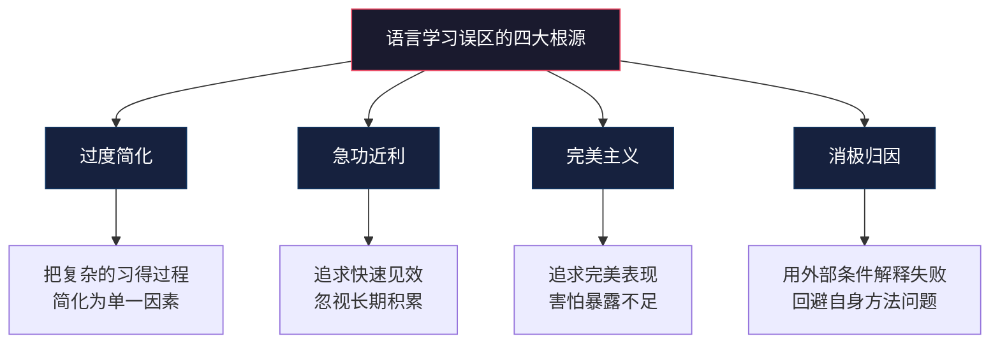
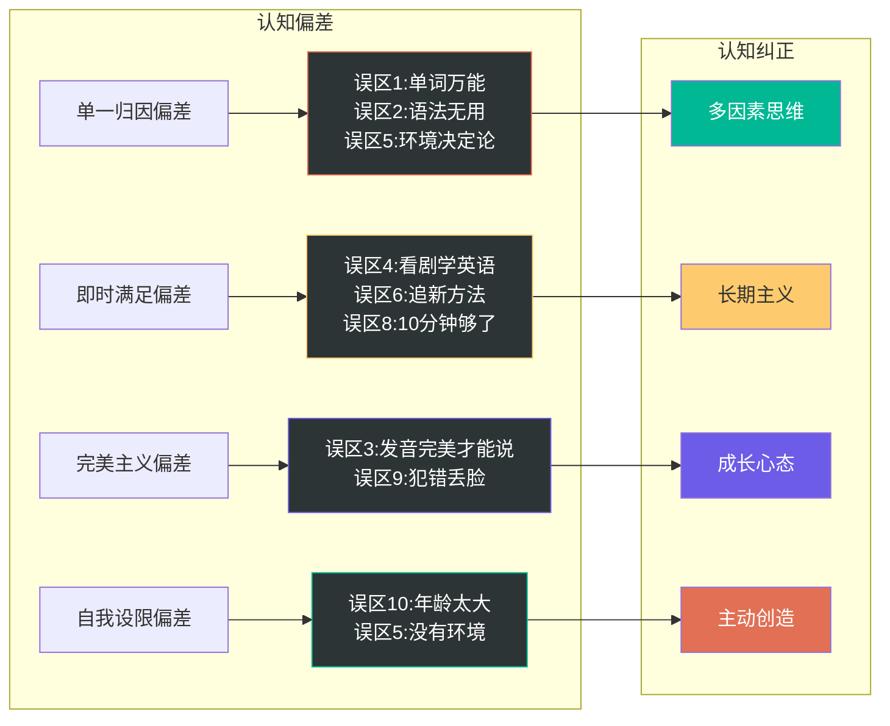

# 外语学习：常见误区与认知纠偏

语言学习领域充斥着大量似是而非的观念，这些观念有的来自直觉，有的来自营销话术，有的来自对科学研究的断章取义。它们像隐形的陷阱，让无数学习者在错误的方向上浪费时间、消耗热情，最终放弃学习。

本章逐一拆解语言学习中最常见的十大误区，给出科学依据和可操作的纠正方案。每个误区都配有"误区自测"清单，帮助你快速判断自己是否中招。

---

## 误区诊断框架

在逐个拆解误区之前，先建立一个统一的认知框架，帮助你理解误区产生的根源：

**快速自测：你容易掉入哪些误区？**

| 误区类型 | 典型内心独白 | 受害程度 |
|----------|-------------|---------|
| 过度简化 | "背完这本单词书我就厉害了" | ★★★★☆ |
| 急功近利 | "有没有一个月速成的方法？" | ★★★★★ |
| 完美主义 | "等我发音标准了再开口" | ★★★★☆ |
| 消极归因 | "没有语言环境所以学不好" | ★★★☆☆ |

---

## 误区一：背单词是学英语最重要的事

### 误区描述

大量学习者将"背单词"等同于"学英语"。他们的学习日常是：打开单词APP刷200个单词，打开单词书从A背到Z，把词汇量从3000刷到8000，然后发现——自己的英语水平并没有实质性提高。阅读原版书依然磕磕绊绊，听BBC依然像听天书，开口说英语依然词不达意。

### 误区自测

你是否有以下行为？

- [ ] 每天花超过50%的学习时间在背单词上
- [ ] 衡量自己英语水平时只看词汇量数字
- [ ] 背单词时只记中文释义，不看例句和搭配
- [ ] 认识很多单词但写不出完整的好句子
- [ ] 经常在单词APP和单词书之间切换，寻找"更好的背词法"

如果命中3条以上，你很可能陷入了"单词崇拜"误区。

### 为什么这是误区

**语言能力是一个多维系统，词汇只是其中一个维度。** 根据Bachman的语言能力模型（1990），语言交际能力由以下部分组成：

| 能力维度 | 说明 | 占比（估算） |
|---------|------|-------------|
| 语法能力 | 词汇、语法、语音、拼写 | 30% |
| 语篇能力 | 衔接、修辞组织 | 15% |
| 语用能力 | 言外功能、社会语言学能力 | 25% |
| 策略能力 | 交际策略、补偿策略 | 15% |
| 流利度 | 自动化加工的速度 | 15% |

词汇知识（语法能力的子项）在整个语言能力中只占约15%-20%的权重。把80%的学习时间投入在只占20%权重的维度上，效率自然低下。

**"认识"一个词和"掌握"一个词是完全不同的两件事。** Nation（2001）提出了词汇知识的九个维度：

1. **形式——口语**：听到时能识别
2. **形式——书面**：看到时能识别
3. **形式——产出**：能正确拼写和发音
4. **含义——形式联结**：能说出/写出对应的单词
5. **含义——概念**：知道单词的核心含义
6. **含义——联想**：知道同义词、反义词、上下位词
7. **搭配**：知道常与哪些词一起使用
8. **语法功能**：知道在句子中充当什么成分
9. **使用限制**：知道在什么语域、什么场合使用

大多数背单词APP只能帮你覆盖维度1-5，而维度6-9才是真正决定你能否"用"这个单词的关键。一个"认识"5000词但只覆盖维度1-5的学习者，其有效词汇量可能只有1500-2000。

**脱离语境的词汇记忆存在严重的迁移失败问题。** 认知心理学中的"编码特异性原则"（Encoding Specificity Principle, Tulving 1973）指出：记忆的提取效率取决于编码时的语境与提取时的语境的匹配程度。你在单词APP中以"abandon = 放弃"的形式编码的单词，到了真实阅读语境中（"He abandoned his plan after careful deliberation"），很可能无法被激活，因为编码语境完全不匹配。

### 正确做法

**原则：在语境中学词，在使用中巩固，在循环中强化。**

**步骤一：通过大量可理解性输入自然积累词汇**

选择难度略高于当前水平的阅读材料（每页生词不超过5个），在阅读中遇到生词时：
1. 先根据上下文猜测含义
2. 查词典确认含义，重点看英文释义和例句
3. 记录单词的完整信息：词义、搭配、例句、词根词缀

**步骤二：用间隔重复系统（SRS）复习语境卡片**

不要制作"abandon = 放弃"这种孤立卡片，而是制作包含完整语境的卡片：

正面：He _____ his plan after careful deliberation.
背面：abandoned（放弃）— abandon sth after careful deliberation
      搭配：abandon hope/a plan/a ship
      词根：a-(away) + ban(d)(命令) → 命令离开 → 放弃

推荐工具：Anki（免费、跨平台、高度可定制）、SuperMemo（算法最优但界面老旧）

**步骤三：通过输出练习巩固词汇**

每周至少进行一次以下输出练习：
- 用本周学到的10个新词写一段200字的短文
- 用新学的搭配造3个句子，发到语言交换社区请母语者修改
- 在口语练习中有意识地使用本周新词

**步骤四：建立个人词汇网络**

用思维导图工具（如XMind、MindNode）将新词按主题、词根、搭配关系组织成网络。研究表明，组织化的信息比零散信息的记忆保持率高3-5倍。

---

## 误区二：语法不重要，能交流就行

### 误区描述

有些人走向另一个极端，认为语法学习是浪费时间，只要能表达意思就够了。他们主张"自然习得"语法，反对系统学习语法规则，甚至嘲笑认真学习语法的人"太死板"。

### 误区自测

- [ ] 从未系统学习过语法，全凭语感
- [ ] 觉得语法课无聊且无用
- [ ] 写作时语法错误频繁但从不在意
- [ ] 认为"老外也不讲究语法"
- [ ] 说英语时只用最简单的句型，回避复杂结构

### 为什么这是误区

**语法是语言的骨架。** 没有语法，词汇只是一堆散落的零件。试比较：

- ❌ "Yesterday I go hospital friend sick buy fruit"
- ✅ "Yesterday I went to the hospital because my friend was sick, so I bought some fruit for him."

两句话用的词汇几乎相同，但第二句因为有正确的语法结构（时态、介词、连词、从句），信息传达清晰准确。第一句则需要听者进行大量的"脑补"，在真实交流中极易产生误解。

**克拉申的监控假说（Monitor Hypothesis）为语法学习提供了理论依据。** 克拉申认为，有意识学习的语法知识可以作为"监控器"，在输出时检查和修正语言形式。虽然监控器不能替代自然习得，但在以下场景中非常有价值：

| 场景 | 监控器的作用 |
|------|------------|
| 正式写作 | 有充足时间检查语法，监控器全功率运作 |
| 准备演讲 | 可以提前修改讲稿中的语法错误 |
| 考试 | 明确的语法知识能显著提升成绩 |
| 事后复盘 | 回顾自己的表达，发现并纠正错误 |

**严重缺乏语法会导致"化石化"（fossilization）。** 语言学中的化石化现象指的是：学习者的某些错误如果长期得不到纠正，会固化为永久性的语言习惯，日后极难改正。Selin（1996）的研究表明，早期缺乏语法指导的学习者，其语法化石化程度显著高于有系统语法学习的学习者。

### 正确做法

**原则：系统学框架，大量输入内化，输出时监控。**

**第一阶段：建立语法骨架（1-3个月）**

选择一本体系化的语法书，通读一遍，建立整体框架。不需要记住每个细节，重点是知道"英语语法有哪些模块"：

| 语法模块 | 核心内容 | 学习优先级 |
|---------|---------|-----------|
| 句子结构 | 五种基本句型、主谓宾定状补 | ★★★★★ |
| 时态系统 | 16种时态的形态和用法 | ★★★★★ |
| 从句 | 定语从句、名词性从句、状语从句 | ★★★★☆ |
| 非谓语动词 | to do / doing / done | ★★★★☆ |
| 虚拟语气 | if条件句、wish/suggest等 | ★★★☆☆ |
| 特殊句式 | 倒装、强调、省略 | ★★★☆☆ |

推荐语法书：
- 入门：《English Grammar in Use》（Raymond Murphy）— 剑桥经典，适合初中级
- 进阶：《高级英语语法》（张道真）— 中文讲解，体系完整
- 深入：《A Comprehensive Grammar of the English Language》（Quirk等）— 学术参考级

**第二阶段：通过大量输入内化语法（长期）**

系统学过语法规则后，通过大量阅读和听力来"验证"和"内化"这些规则。每当你在阅读中遇到一个之前学过的语法结构，大脑会自动进行模式匹配，这个过程就是内化。

具体方法：
- 阅读时有意识地关注句子结构，遇到复杂句做"句子拆分"练习
- 听力时关注母语者如何使用时态、连接词、语调来传达语法信息
- 收集"语法金句"——那些体现了重要语法规则的优美句子

**第三阶段：在输出中实践和监控**

- 写作时先关注内容表达，写完后专门用一轮来检查语法
- 口语中不要过度监控（这会严重影响流利度），但在事后复盘时关注语法问题
- 使用语法检查工具（如Grammarly）作为辅助，但不完全依赖

**关键提醒：不要因为害怕语法错误而不敢开口。** 语法监控主要适用于写作和准备性口语。在即兴口语中，流利度和沟通效果优先于语法正确性。

---

## 误区三：发音不标准就不要开口说

### 误区描述

很多学习者因为发音不标准、有口音而不敢开口说英语。他们花大量时间在发音练习上，追求"像母语者一样"的发音，却始终觉得"还没准备好"，一直不开始真正的口语练习。

### 误区自测

- [ ] 练口语之前必须先"把发音练好"
- [ ] 对自己的口音感到羞耻
- [ ] 从不主动和外国人说话，怕被听出"中式发音"
- [ ] 花大量时间模仿某个特定口音（美音/英音）
- [ ] 觉得有口音就代表英语不好

### 为什么这是误区

**发音是通过实践提高的技能，不是通过准备达到的前提。** 这就像一个人因为怕游得不好看而拒绝下水——永远也学不会游泳。发音器官（舌头、嘴唇、声带）的肌肉记忆只有通过实际发音练习才能建立，光听不说是无法形成肌肉记忆的。

**口音不是缺陷，而是身份的一部分。** 全球约有15亿英语使用者，其中母语者仅约3.8亿。换言之，全球75%的英语使用者都带有非母语口音。Crystal（2003）在《English as a Global Language》中指出，英语已经不再属于任何单一文化，"标准发音"的概念本身就在被重新定义。

国际商务中常见的英语口音包括印度口音、日本口音、法国口音、中国口音、阿拉伯口音等。只要发音清晰、不影响理解，口音不仅不是障碍，有时反而是文化多样性的体现。

**发音的"可理解性"（intelligibility）比"接近母语"（nativeness）更重要。** Munro和Derwing（2011）的研究区分了三个概念：

| 概念 | 定义 | 重要性 |
|------|------|--------|
| 可理解性 | 听者能否正确理解说话者的意图 | ★★★★★ |
| 可理解度 | 听者需要多大努力才能理解 | ★★★★☆ |
| 口音程度 | 与母语发音的相似度 | ★★☆☆☆ |

研究结论很明确：**你应该追求的是让别人听懂你，而不是让别人觉得你像美国人/英国人。**

**焦虑是口语进步的最大敌人。** 克拉申的情感过滤假说（Affective Filter Hypothesis）指出，焦虑、不自信和低动机都会在学习者头脑中形成一道"过滤器"，阻止输入的语言材料被大脑加工和吸收。因为害怕发音不好而不敢说，不仅无法提高口语，连听力和整体语言能力的提升都会被拖累。

### 正确做法

**原则：先开口说，再逐步优化；追求清晰，不追求完美。**

**第一步：立即开始口语练习**

从今天就开始。哪怕只能说"I am learning English. My English is not good, but I am trying"，也要开口说。

**第二步：做一次发音诊断**

用以下方法快速了解自己的发音弱点：

1. 录一段1分钟的英语朗读（可以用手机录音）
2. 上传到发音评估工具（如Elsa Speak、Speechling）
3. 获得发音报告，了解哪些音素需要重点练习

**第三步：针对性纠正核心发音问题**

中国学习者最常见的发音问题及纠正方法：

| 问题 | 示例 | 纠正方法 |
|------|------|---------|
| th音发成s/z | think→sink, this→zis | 舌尖放在上下齿之间，气流从舌齿间通过 |
| v/w混淆 | very→wery, west→vest | v：上齿咬下唇；w：双唇圆拢 |
| r/l混淆 | right→light, road→load | r：舌尖不接触任何部位，舌后部隆起；l：舌尖抵上齿龈 |
| 尾辅音吞音 | bed→be, like→lai | 刻意发出词尾辅音，即使很轻 |
| 元音长度不分 | sheep/ship, beat/bit | 长元音拉长1.5-2倍，短元音干脆利落 |

**第四步：通过跟读和模仿建立肌肉记忆**

跟读法（Shadowing）是最有效的发音练习方法之一：
1. 选择一段1-2分钟的音频（播客、新闻、有声书）
2. 第一遍：纯听，理解内容
3. 第二遍：看文本，标注重音、连读、语调
4. 第三遍：跟读，尽量与原声同步
5. 第四遍：录音对比，找出差距
6. 每天坚持15-20分钟

**第五步：找到安全的口语练习环境**

- 语言交换APP（HelloTalk、Tandem）：和正在学中文的外国人互相练习
- AI口语练习工具（如ChatGPT语音模式、Pi）：无压力的口语练习
- 英语角/语言交换活动：面对面的社交口语练习
- 自言自语：每天用英语描述自己的所见所想

---

## 误区四：看美剧就能学好英语

### 误区描述

很多人相信，只要多看美剧、英剧，英语水平就能自然提高。他们每天花1-2小时追剧，几年下来看了上百部剧，但英语能力并没有明显进步——听力依然听不懂无字幕的内容，口语依然只能蹦单词。

### 误区自测

- [ ] 看美剧时全程开中文字幕
- [ ] 看完一部剧后说不出5个新学的表达
- [ ] 选择的剧集难度远超自己的水平
- [ ] 把看美剧当作主要的英语学习方式
- [ ] 看剧时90%的注意力在剧情上，10%在语言上

### 为什么这是误区

**看美剧≠学英语。** 看美剧只是一种输入方式，而且如果不加控制，它是一种非常低效的输入方式。原因如下：

**原因一：注意力资源被剧情消耗**

认知心理学中的"选择性注意"理论告诉我们，人的注意力资源是有限的。当剧情紧张刺激时，大脑会将几乎全部注意力分配给"理解剧情"，语言信息被自动过滤掉。你可能看了10集《越狱》，记住了Michael Scofield的每一个逃跑计划，但学到了多少英语表达？可能接近零。

**原因二：中文字幕阻断了语言加工**

当你开着中文字幕时，大脑会走"捷径"——直接通过中文理解剧情，完全绕过了英语加工的环节。脑成像研究（Marian et al., 2016）表明，双语者在看到母语文字时，第二语言的加工区域几乎不被激活。也就是说，中文字幕模式下，你的英语大脑在"睡觉"。

**原因三：语言难度不匹配**

《权力的游戏》《纸牌屋》《绝命毒师》……这些剧的语速快、俚语多、文化背景复杂，远超初中级学习者的理解能力。根据克拉申的输入假说，有效的语言输入应该是"i+1"——略高于当前水平。如果你只能听懂30%的内容，那大部分输入都是"噪音"，大脑无法从中习得语言。

**原因四：缺乏输出和复习环节**

看美剧是一种被动的输入活动，没有输出练习，没有间隔复习，学到的表达很快就会遗忘。根据艾宾浩斯遗忘曲线，没有复习的新信息在24小时后遗忘率达67%。

### 正确做法

**原则：把看美剧从"娱乐"变成"有目的的学习活动"。**

**阶段一：选对剧集**

| 水平 | 推荐剧集类型 | 推荐剧目 | 原因 |
|------|------------|---------|------|
| 初级 | 动画片、儿童节目 | 《Peppa Pig》《Dora》 | 语速慢、用词简单、画面辅助理解 |
| 初中级 | 情景喜剧 | 《Friends》《Modern Family》 | 对话为主、场景生活化、笑点帮助记忆 |
| 中级 | 职业剧、校园剧 | 《Suits》《Gossip Girl》 | 词汇丰富、语速适中、有专业词汇 |
| 中高级 | 剧情类、悬疑类 | 《Breaking Bad》《Sherlock》 | 语速接近正常、表达多样 |

**阶段二：采用"三遍学习法"**

**第一遍（理解剧情）**：开中英双字幕或中文字幕，完整观看，理解剧情和主要人物关系。

**第二遍（学习语言）**：只开英文字幕，每集分3-4个段落观看。每看完一段，暂停，完成以下操作：
1. 记录3-5个有用的表达（单词、短语、句型）
2. 选择1-2句台词做跟读模仿
3. 理解其中的文化背景和幽默点

**第三遍（内化巩固）**：尝试关闭字幕观看。听不懂的地方反复回放，实在听不懂再看英文字幕。

**阶段三：建立"美剧学习笔记"**

每部剧建立一个学习笔记，记录以下内容：

剧名：Friends S01E01
日期：2025-01-15

【新词汇/表达】
1. "We were on a break!" — on a break = 暂时分开
2. "How you doin'?" — Joey的经典搭讪语，注意语调上扬
3. "pivot!" — Ross搬家时的经典场景，pivot = 转动、旋转

【语法观察】
- 条件句的使用："If I were you, I'd..."
- 现在完成时的口语用法："I've never..."

【文化知识点】
- Thanksgiving在Friends中是重要场景，了解美国感恩节文化
- "going Dutch" = AA制

【跟读练习】
选了3句做了跟读，录音在手机里

**阶段四：巩固输出**

- 用学到的表达写一段话或发一条英文朋友圈
- 在口语练习中尝试使用新学的俚语和表达
- 每周末复习本周的学习笔记

---

## 误区五：学英语必须要有语言环境

### 误区描述

很多学习者抱怨："我没有语言环境，所以学不好英语。"他们把学不好英语归因于外部条件——不出国、身边没有外国人、公司不用英语——并以此为理由放弃努力。

### 误区自测

- [ ] 经常用"没有语言环境"作为学不好英语的理由
- [ ] 认为出国就能自动学好英语
- [ ] 从未尝试过创造虚拟语言环境
- [ ] 身边没有外国人就觉得没有练习对象
- [ ] 把"环境"看作学好英语的前提条件

### 为什么这是误区

**反例一：出国多年但英语依然很差的人比比皆是。** 在美国、英国、澳大利亚的华人社区中，大量移民生活了十几年甚至几十年，英语水平依然停留在初级阶段。他们虽然身处英语环境，但日常只与华人交流，看中文媒体，上中文网站。环境摆在那里，但没有被利用。

**反例二：从未出国但英语流利的人同样比比皆是。** 在中国的大学里，很多英语专业的学生从未出过国，但通过系统的课程学习、大量的阅读输入、认真的口语练习，达到了专业八级或雅思7.5+的水平。在国内的互联网公司，很多技术岗位的工程师通过阅读英文文档、参与GitHub讨论、观看英文技术视频，英语水平远超"环境论"者的预期。

**核心结论：语言环境是充分条件，不是必要条件。** 有好的语言环境确实能加速学习，但没有语言环境也不是学不好的理由。在互联网时代，"没有语言环境"这个借口已经越来越站不住脚。

**自我实现预言效应。** 心理学中的"自我实现预言"（Self-fulfilling Prophecy）在此表现得淋漓尽致：当你相信"没有环境就学不好"时，你不会去主动创造环境、寻找机会，结果自然学不好——这反过来"验证"了你的信念，形成恶性循环。

### 正确做法

**原则：主动创造环境，而非等待环境降临。**

**第一层：数字环境改造（立即可做）**

将你的数字生活切换为英语环境：

| 设备/应用 | 改造方法 | 效果 |
|----------|---------|------|
| 手机系统语言 | 改为English | 每天接触几百个英语界面元素 |
| 社交媒体 | 关注英文账号（Twitter/X、Reddit） | 被动接收英语信息流 |
| 搜索引擎 | 使用Google英文搜索 | 搜索习惯英语化 |
| 浏览器 | 安装沉浸式翻译插件 | 中英对照阅读 |
| 邮箱/通知 | 订阅英文Newsletter | 每天收到英语内容推送 |
| 娱乐 | Netflix/YouTube优先 | 替代中文视频平台 |

**第二层：输入环境构建**

- **播客**：每天通勤时间听英语播客（推荐：BBC 6 Minute English、All Ears English、TED Talks Daily）
- **有声书**：用Audible听英文有声书，选择听过的中文原著的英文版
- **新闻**：每天读1-2篇英文新闻（推荐：BBC News、The Guardian、CNN）
- **阅读**：每周读英文原版书或文章，从自己感兴趣的主题开始

**第三层：输出环境构建**

- **语言交换**：用HelloTalk、Tandem找语伴，每天文字或语音交流15分钟
- **AI对话**：用ChatGPT、Claude等AI工具进行英语对话练习
- **写作社区**：在Lang-8、italki社区发布英语作文，请母语者修改
- **英语自言自语**：每天用英语描述自己的日常活动、内心想法

**第四层：社交环境构建**

- 参加当地的English Corner（英语角）
- 加入英语学习社群（微信群、Discord、Telegram）
- 报名英语口语课程（线下或线上一对一）
- 参加Toastmasters演讲俱乐部

**核心心态转变：不要问"环境能给我什么"，要问"我能创造什么环境"。**

---

## 误区六：学习方法越新越好

### 误区描述

一些学习者热衷于追逐最新的学习方法和工具。他们频繁更换学习策略——这个月用Anki，下个月换Memrise，再下个月试试AI对话；今天听说"影子跟读法"好，明天听说"全身反应法"妙，后天又被"多邻国游戏化学习"吸引。尝试了无数种方法，始终没有在任何一个方法上坚持足够长的时间。

### 误区自测

- [ ] 过去半年内更换过3种以上的学习工具/方法
- [ ] 总是在搜索"最有效的英语学习方法"
- [ ] 看到新的学习法就忍不住想尝试
- [ ] 每种方法都只坚持了2-4周就觉得"没效果"
- [ ] 花在"寻找方法"上的时间比"执行方法"还多

### 为什么这是误区

**学习方法≠学习效果。** 方法只是路径，走路（执行）才能到达目的地。一个"80分的方法"坚持执行一年，效果远胜于"100分的方法"只执行一个月。

**语言习得的底层机制不会因为工具而改变。** 无论你用Anki还是Memrise，大脑的记忆机制都是间隔重复；无论你跟读真人还是AI，语言输出的练习效果都取决于练习量和反馈质量。工具在变，但学习的底层规律不变。

**频繁切换方法的隐性成本极高：**

| 成本类型 | 具体表现 |
|---------|---------|
| 学习曲线成本 | 每次换工具都要花时间熟悉新界面和功能 |
| 习惯断裂成本 | 刚建立的学习习惯被打断，需要重新建立 |
| 数据迁移成本 | 旧工具中的学习记录、笔记可能无法迁移 |
| 心理成本 | "又没找到对的方法"的挫败感和焦虑 |
| 机会成本 | 花在"找方法"上的时间本可以用来实际学习 |

### 正确做法

**原则：选一个经过验证的方法，执行到位，微调迭代。**

**第一步：选择经过验证的核心方法**

以下方法经过了数十年的语言教学研究验证，可以放心使用：

- **输入假说实践**：大量可理解性输入（阅读+听力），选择略高于当前水平的材料
- **间隔重复**：使用SRS系统复习词汇和表达（Anki是首选）
- **输出练习**：每天口语练习15-30分钟 + 每周写作1-2篇
- **跟读模仿**：每天跟读15-20分钟，改善发音和流利度
- **错误记录**：建立"错误本"，定期复习常犯的错误

**第二步：选择2-3个核心工具，深入使用**

| 功能 | 推荐工具 | 选择理由 |
|------|---------|---------|
| 词汇记忆 | Anki | 免费、算法成熟、社区资源丰富 |
| 口语练习 | HelloTalk + ChatGPT语音 | 真人+AI互补 |
| 阅读输入 | Kindle + 沉浸式翻译 | 电子书+即时查词 |
| 听力输入 | 播客App + YouTube | 免费、内容丰富 |
| 写作练习 | Grammarly + Lang-8 | AI纠错+人工反馈 |

**第三步：给方法足够的试验期**

- 任何新方法至少坚持3个月再评估效果
- 评估标准：不看"感觉"，看客观指标（词汇量增长、阅读速度、口语流利度）
- 如果3个月后确实效果不佳，再考虑调整——注意是"调整"，不是"推翻重来"

**第四步：区分"优化"和"更换"**

- **优化**：继续使用同一工具，调整参数或使用方式（如调整Anki的复习间隔、改变跟读的材料难度）——这是好的
- **更换**：彻底放弃当前工具，换一个新的——这需要慎重

---

## 误区七：翻译思维是学英语的大敌

### 误区描述

一些人（特别是一些英语培训机构和"成功学"博主）认为，用中文翻译来理解英语是完全错误的，应该从第一天起就"用英语思维"来学习。他们甚至主张完全避免任何翻译，实行"全沉浸式"学习。

### 误区自测

- [ ] 读英语时严格禁止自己在脑中翻译成中文
- [ ] 认为"翻译思维"是英语不好的根本原因
- [ ] 用英英词典时看不懂释义但坚持不用英汉词典
- [ ] 认为"想中文再翻译成英语"是错误的思考方式
- [ ] 因为偶尔用中文理解英语而自责

### 为什么这是误区

**母语是认知的基石，不能被绕过。** 认知语言学研究表明，成年人学习第二语言时，母语的语义系统已经根深蒂固地建立起来了。新的语言形式在大脑中的表征，不可避免地会与母语系统发生联系。硬性切断这种联系，不仅不现实，还会增加不必要的认知负荷。

**适度使用母语具有积极的辅助作用。** Cook（2001）在《Using the First Language in the Classroom》中总结了多项研究，发现适度使用母语在外语学习中的积极作用：

- **理解复杂概念**：解释抽象语法概念时，用母语确认理解比用英语猜更高效
- **词汇记忆**：通过母语翻译建立词义联结，在初学阶段是有效的记忆策略
- **情感支持**：在焦虑感较高时，偶尔使用母语能降低情感过滤
- **元认知**：用母语进行"关于学习的学习"（如总结学习策略、反思学习过程）效率更高

**关键是"适度"，而非"完全排斥"或"完全依赖"。** 翻译思维的问题不在于"使用翻译"，而在于"过度依赖翻译"——即每个英语句子都必须经过中文翻译才能理解。

### 正确做法

**原则：以英语直接理解为目标，以母语辅助为过渡手段。**

**阶段一：允许使用中文辅助（初级阶段）**

- 遇到新概念时，先尝试通过英语释义和例句理解，实在不理解再查中文翻译
- 使用"英汉双解词典"而非纯英汉或纯英英词典
- 复杂语法规则可以先用中文理解透彻，再通过英语例句巩固

**阶段二：逐步减少中文依赖（中级阶段）**

- 切换到英英词典（推荐：Oxford Learner's Dictionary、Longman Dictionary）
- 阅读时尝试"意会"——遇到生词先通过上下文猜测，不急着查词典
- 开始用英语写学习笔记（哪怕写得很简单）

**阶段三：建立英语思维（高级阶段）**

- 直接用英语理解英语，中间不经过中文翻译
- 用英语解释英语概念："What does 'sarcasm' mean? It means saying the opposite of what you really mean, usually to be funny or to criticize."
- 用英语进行内心独白和自我对话
- 用英语做梦（这是英语思维初步建立的标志之一）

**注意：即使是高级学习者，在遇到非常抽象或文化特有的概念时，借助母语理解也是完全正常的。** 不要因为偶尔需要中文辅助而自责。

---

## 误区八：每天学10分钟就够了

### 误区描述

一些APP和课程宣传"每天只需10分钟"就能学好英语。多邻国的猫头鹰每天提醒你"只要5分钟"，各种短视频告诉你"碎片化学习"是未来的趋势。很多学习者被这种承诺吸引，认为每天在手机上学10-15分钟，日积月累就能达到流利。

### 误区自测

- [ ] 主要学习方式是每天刷10-15分钟的APP
- [ ] 从未进行过超过30分钟的连续英语学习
- [ ] 认为"碎片化学习"足以达到流利水平
- [ ] 把APP上的连续打卡天数等同于英语进步
- [ ] 学了半年以上，英语水平没有明显提升

### 为什么这是误区

**语言习得需要大量的时间投入，这是不可压缩的硬指标。** 欧洲共同语言参考框架（CEFR）对各等级的学习时间有明确的估算：

| CEFR等级 | 能力描述 | 累计学习时间 |
|---------|---------|------------|
| A1 入门 | 能理解和使用最基本的日常表达 | 80-100小时 |
| A2 初级 | 能进行简单的日常交流 | 180-200小时 |
| B1 中级 | 能处理旅行中大多数情况 | 350-400小时 |
| B2 中高级 | 能与母语者流利交流 | 500-600小时 |
| C1 高级 | 能灵活有效地使用语言 | 700-800小时 |
| C2 精通 | 接近母语者水平 | 1000-1200小时 |

如果每天学习10分钟（约0.17小时），达到B2水平（流利交流的基本门槛）需要：500÷0.17≈2941天≈8年。而且这还是理想状态下的估算——10分钟的碎片化学习效率远低于集中的深度学习，实际所需时间可能翻倍。

**10分钟无法进入"深度学习状态"。** 认知心理学中的"任务切换成本"研究表明，大脑进入一种任务的深度专注状态需要约15-23分钟（Mark et al., 2008）。如果你只学10分钟，大脑刚刚从"日常模式"切换到"学习模式"，时间就到了。这意味着你的10分钟学习几乎全程处于"浅层加工"状态，记忆编码效率极低。

**碎片化学习适合"复习"，不适合"学习新内容"。** 碎片时间（通勤、排队、午休）可以用来：
- 复习Anki卡片
- 泛听英语播客
- 浏览英文新闻

但以下活动需要集中的、不被打断的时间：
- 学习新的语法概念
- 精听/精读训练
- 口语练习
- 写作练习
- 跟读模仿

### 正确做法

**原则：核心学习时间不可压缩，碎片时间用于辅助巩固。**

**每日学习时间分配建议：**

| 学习者类型 | 核心学习时间 | 碎片学习时间 | 总计 |
|-----------|------------|------------|------|
| 业余学习者（目标：日常交流） | 30-45分钟 | 15-20分钟 | 45-65分钟 |
| 认真学习者（目标：流利使用） | 60-90分钟 | 20-30分钟 | 80-120分钟 |
| 高强度学习者（目标：考试/工作） | 120-180分钟 | 30-40分钟 | 150-220分钟 |

**核心学习时间安排（以60分钟为例）：**

前5分钟：热身（复习昨天的内容，听一段轻松的英语）
20分钟：输入训练（精读或精听，注意力高度集中）
15分钟：语法或词汇学习（新内容学习）
15分钟：输出练习（口语或写作）
5分钟：总结复盘（记录今天的收获和问题）

**碎片学习安排：**

- 通勤时间（30-60分钟）：听英语播客或有声书
- 午休前（10分钟）：复习Anki卡片
- 排队/等待（5-10分钟）：浏览一条英文新闻
- 睡前（10分钟）：泛读英文文章或Kindle阅读

**质量比时间更重要。** 一个小时的专注学习，效果胜过三个小时的心不在焉。学习时关闭手机通知，专注于当前任务，确保每一分钟的学习都是高质量的。

---

## 误区九：犯错是丢脸的事

### 误区描述

很多学习者对犯错有强烈的恐惧心理。他们宁愿不开口也不愿说错，写英语邮件反复检查十遍才敢发送，参加英语角时只听不说。在他们的认知中，犯错等于丢脸，等于"英语不好"，等于被人看不起。

### 误区自测

- [ ] 在公共场合说英语时极度紧张
- [ ] 犯了语法错误后会反复回想、自我批评
- [ ] 因为怕犯错而回避英语交流机会
- [ ] 说英语前必须在脑中把句子"排练"到完美
- [ ] 别人纠正你的错误时感到羞耻

### 为什么这是误区

**犯错是语言习得的核心机制之一。** 从认知科学的角度看，犯错不是学习的副产品，而是学习本身。Swain（1985）的"输出假说"（Output Hypothesis）指出，学习者在输出语言时会经历三个认知过程：

1. **注意功能**：输出时注意到自己"想说但说不出来"的差距，触发对新知识的注意
2. **假设检验功能**：通过输出尝试新的语言形式，根据反馈验证假设是否正确
3. **元语言功能**：在修正错误的过程中，反思语言的运作规则

这三个过程都以"犯错"为前提——不犯错意味着没有尝试新形式，没有尝试意味着没有学习发生。

**错误是学习进度的"路标"，不是能力的"判决书"。** 每一个错误都在告诉你：

- 这个知识点你还没有完全掌握（需要更多输入和练习）
- 你的大脑正在尝试使用新的语言形式（学习正在发生）
- 你有改进的具体方向（而非模糊的"英语不好"）

**犯错恐惧会导致严重的"回避行为"。** 语言学习研究中有一个概念叫"回避策略"（avoidance strategy）——学习者为了不犯错，故意回避使用复杂的语言结构，只用自己有把握的简单表达。Schachter（1974）的研究发现，中国和日本的英语学习者使用定语从句的频率远低于波斯和阿拉伯学习者——不是因为他们不会，而是因为他们刻意回避。回避策略让学习者永远停留在舒适区，无法突破到更高的语言水平。

**母语者的真实态度：几乎没人会在意你的错误。** 多项跨文化研究表明，以英语为母语的人在与非母语者交流时，通常表现出高度的宽容和耐心。他们关注的是你传达的信息，而不是你的语法是否完美。在真实的国际交流中，一个敢于开口、表达清晰但有语法错误的人，远比一个沉默不语的人更受欢迎。

### 正确做法

**原则：接受犯错是学习的一部分，将错误转化为进步的阶梯。**

**心态层面：重新定义"犯错"**

- 把"我又犯错了"替换为"我又发现了一个可以改进的地方"
- 把"别人会笑话我"替换为"别人在帮我发现问题"
- 把"我说得很烂"替换为"我在练习，练习就是会说得很烂"

**行为层面：主动暴露错误**

- 在安全的环境中（语言交换伙伴、AI工具）大量输出，不怕犯错
- 主动请求纠正："Please correct my mistakes, I want to improve."
- 参加"错误分享会"——和学习伙伴互相分享最近犯的错误

**工具层面：建立"错误成长档案"**

创建一个系统化的错误记录本，不是简单记录错误，而是记录错误的模式和改进：

【错误日期】2025-01-15
【错误类型】时态错误
【错误表达】"I go to the hospital yesterday."
【正确表达】"I went to the hospital yesterday."
【根本原因】动词过去式变化不熟练
【改进措施】复习不规则动词表，做10道时态练习题
【一周后复查】✓ 已掌握，类似的错误未再犯

---

## 误区十：我年纪太大了，学不好英语

### 误区描述

很多成年学习者认为自己错过了语言学习的"黄金年龄"，现在已经"太老了"，大脑已经"固化了"，不可能学好英语了。特别是30岁、40岁以上的学习者，这种想法非常普遍。

### 误区自测

- [ ] 认为"小时候没学好，现在来不及了"
- [ ] 用年龄作为学不好英语的借口
- [ ] 认为成年人的大脑不适合学语言
- [ ] 看到年轻人英语好就感叹"要是我年轻时也这样就好了"
- [ ] 因为年龄而降低对自己的期望

### 为什么这是误区

**关键期假说被过度解读了。** Lenneberg（1967）提出的关键期假说（Critical Period Hypothesis）确实指出，儿童在语言习得方面具有一定的时间窗口优势，主要体现在语音习得方面。但这个假说被大众过度解读为"过了关键期就学不好语言"，这是不准确的。

后续大量研究（包括Birdsong 1999、Marinova-Todd et al. 2000、Singleton & Ryan 2004）表明：

- 关键期效应主要体现在语音/口音方面，在语法、词汇、阅读等方面的影响要小得多
- 很多成年后开始学习的学习者达到了近母语水平
- 关键期假说本身就存在争议，学界并未达成共识

**成年学习者具有独特的优势：**

| 优势维度 | 具体表现 |
|---------|---------|
| 认知能力 | 成熟的逻辑思维、分析能力、抽象推理能力 |
| 学习策略 | 能够有意识地使用和优化学习策略 |
| 元认知 | 能够监控和调节自己的学习过程 |
| 已有知识 | 丰富的母语知识和世界知识可以迁移 |
| 学习动机 | 成年人通常有明确的学习目的和内驱力 |
| 自律能力 | 更强的自我管理和时间管理能力 |

**神经科学证据：成人大脑仍然具有高度可塑性。** 20世纪末的神经科学研究推翻了"成人大脑不再改变"的旧观念。Draganski等（2004）的研究发现，即使是成年人的大脑，在学习新技能时也会发生结构性变化——灰质密度增加、白质连接增强。这个发现对语言学习的启示是：成年后开始学语言，大脑仍然会为你"铺路"。

**数据证据：大量成年后成功的语言学习者存在。**

- 语言学家史蒂芬·克拉申本人就是成年后学习了多门外语
- 著名作家约瑟夫·康拉德20多岁才开始学英语，最终成为英语文学大师
- 大量移民在成年后移居新国家，通过努力达到了高水平的语言能力

### 正确做法

**原则：发挥成人优势，接受局限性，设定合理目标。**

**第一：承认并利用成人学习者的优势**

- 利用逻辑思维能力：系统学习语法规则，建立知识框架
- 利用分析能力：对比中英文差异，理解语言背后的逻辑
- 利用已有知识：通过词根词缀、中文借词等建立知识联结
- 利用自律能力：制定学习计划并坚持执行

**第二：正视并应对年龄相关的挑战**

| 挑战 | 应对策略 |
|------|---------|
| 语音习得可能不如儿童 | 通过大量跟读练习弥补；追求"清晰可理解"而非"完美口音" |
| 记忆力可能下降 | 利用间隔重复（Anki）和多感官记忆（听+看+写+说） |
| 时间精力有限 | 利用碎片时间做轻量学习，保证核心学习时段 |
| 容易焦虑和自我怀疑 | 设定小目标，关注进步而非完美 |

**第三：设定分阶段的合理目标**

不要一上来就设定"像母语者一样流利"这种不切实际的目标。分阶段设定：

- **3个月目标**：能进行基本的日常自我介绍和简单对话
- **6个月目标**：能阅读简单的英文文章，听懂慢速英语
- **1年目标**：能流利地进行日常话题的英语交流
- **2年目标**：能处理工作中的英语交流和邮件
- **长期目标**：能自由地使用英语进行阅读、交流和工作

---

## 误区背后的心理学规律

以上十大误区并非随机出现，它们背后有共同的心理学规律在起作用：

**认知纠偏的核心策略：**

| 认知偏差 | 纠偏思维 | 实操方法 |
|---------|---------|---------|
| 单一归因 | 多因素思维 | 语言能力=词汇+语法+语音+语用+策略+流利度 |
| 即时满足 | 长期主义 | 设定季度目标，用"进步日志"追踪长期变化 |
| 完美主义 | 成长心态 | Carol Dweck的"还没有"思维："我还不是很好——还没有" |
| 自我设限 | 主动创造 | 不问"条件够不够"，问"我能做什么" |

---

## 避坑速查表

以下表格汇总了十大误区的核心信息，方便快速查阅：

| # | 误区 | 核心错误 | 正确认知 | 行动要点 |
|---|------|---------|---------|---------|
| 1 | 背单词最重要 | 单一归因 | 词汇只是语言能力的一个维度 | 语境学词+SRS复习+输出巩固 |
| 2 | 语法不重要 | 极端对立 | 语法是输出质量的保障 | 系统学框架，输入内化，写作时监控 |
| 3 | 发音好才能开口 | 完美主义 | 发音通过说来提高 | 立即开口，追求清晰不追求完美 |
| 4 | 看美剧能学好 | 被动输入 | 无目的看剧≈娱乐 | 三遍学习法+笔记+输出巩固 |
| 5 | 必须有语言环境 | 外部归因 | 环境可主动创造 | 数字环境改造+社交环境构建 |
| 6 | 方法越新越好 | 追逐新奇 | 执行力>方法 | 选一个验证过的方法，坚持3个月 |
| 7 | 翻译思维有害 | 非黑即白 | 适度翻译是过渡手段 | 阶段性减少母语依赖 |
| 8 | 每天10分钟够了 | 最小化投入 | 深度学习需要时间 | 核心时段≥30分钟+碎片辅助 |
| 9 | 犯错很丢脸 | 恐惧心理 | 犯错是学习的核心机制 | 主动暴露错误+错误成长档案 |
| 10 | 年龄太大学不了 | 自我设限 | 成人有独特优势 | 发挥优势，设定分阶段目标 |

---

## 总结

以上十大误区涵盖了外语学习中最常见的认知陷阱。总结起来，这些误区有四个共同根源：

1. **过度简化**：把复杂的语言学习过程简化为单一因素（背单词/语法/环境/年龄）
2. **急功近利**：追求快速见效（看剧学英语/追新方法/每天10分钟）
3. **完美主义**：追求完美表现，害怕暴露不足（发音完美才能说/犯错丢脸）
4. **消极归因**：用外部条件解释失败，回避自身方法问题（没有环境/年龄太大）

**克服误区的核心方法论：**

- **认知升级**：理解语言学习的科学原理，用知识武装自己，不被营销话术和流行观念误导
- **系统行动**：基于科学方法制定学习计划，输入+输出+坚持三位一体
- **成长心态**：把每一次犯错、每一次困难都看作进步的机会
- **长期坚持**：语言学习是马拉松，不是短跑。每天进步一点点，时间会给你答案

语言学习没有捷径，但有弯路。识别并避开这些误区，你已经走在了大多数人前面。

