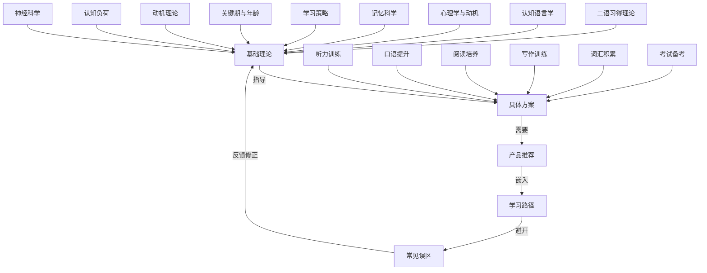
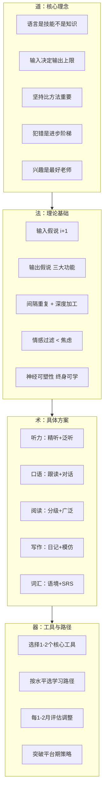

# 外语学习：本章小结

## 一、全章知识地图

本章从理论到实践，系统构建了一套完整的外语学习方法论。五个板块并非并列关系，而是层层递进的逻辑链条：**理论奠基 → 方法落地 → 工具赋能 → 路径导航 → 避坑纠偏**。在进入具体行动之前，有必要先建立全局视野。

下面将从每个维度提炼核心结论，然后整合成一套可立即执行的行动框架。

---

## 二、理论基础：九块基石的实践启示

基础理论篇涵盖了九个相互关联的理论领域。这些理论的价值不在于学术记忆，而在于每一次学习决策——选什么材料、用什么方法、怎么分配时间——都有科学依据。

### 2.1 核心理论速查表

| 理论 | 核心观点 | 一句话行动指南 |
|------|---------|--------------|
| 克拉申输入假说 | 可理解性输入（i+1）是习得的唯一驱动力 | 听读略高于当前水平的材料，语言自然生长 |
| 斯韦恩输出假说 | 输出具有注意、假设检验、元语言三大功能 | 每天必须有说/写的输出练习，光听不够 |
| 隆的交互假说 | 意义协商使输入更可理解 | 找真人对话，不要只和机器练 |
| 记忆科学 | 间隔重复 + 深度加工是长期记忆的关键 | 用Anki类工具，当天→1天→3天→7天→14天→30天复习 |
| 认知语言学 | 语言基于使用，构式比规则更有效 | 学短语和搭配，不要孤立背单词和语法 |
| 关键期假说 | 儿童语音习得有优势，但成人认知和策略优势明显 | 任何时候开始都不晚，善用分析能力 |
| 动机理论 | 内在动机靠胜任感、自主感、归属感维持 | 找到"为什么学"，选感兴趣的内容，加入社群 |
| 认知负荷理论 | 工作记忆只能同时处理4-7个信息单元 | 遇到难点先拆解，不要试图一口吃成胖子 |
| 神经可塑性 | 大脑终身可塑，学习本身改变大脑结构 | 瓶颈期是大脑在重组，坚持就会突破 |

### 2.2 三条贯穿全章的核心原理

从所有理论中可以提炼出三条贯穿始终的原理，它们是整章内容的"道"：

**原理一：输入决定输出的上限。** 克拉申的输入假说、频率理论、认知语言学的"语言基于使用"观点，共同指向同一个结论——你能够输出的语言水平，取决于你输入的质量和数量。没有足够的输入，再多的语法练习和口语训练都事倍功半。但输入不是被动接收，施密特的注意假说提醒我们：必须有意识地关注语言形式，否则"听而不闻"。

**原理二：技能需要程序化，不能停留在陈述性知识。** 记忆科学区分了陈述性记忆（知道规则）和程序性记忆（自动运用）。语言学习的终极目标是将有意识学习的知识通过大量练习转化为自动化技能。这解释了为什么"看懂语法书"和"流利说出口"之间存在巨大鸿沟——跨越这条鸿沟的唯一桥梁是大量、反复、多样化的练习。

**原理三：情感状态是学习效率的隐形开关。** 克拉申的情感过滤假说、班杜拉的自我效能感理论、契克森米哈赖的心流理论，共同揭示了一个事实：焦虑、恐惧、自我怀疑会直接阻断语言输入的处理通道。创造低焦虑的学习环境、允许犯错、设定可达成的小目标，不是"心灵鸡汤"，而是有神经科学和心理学实证支撑的硬核策略。

---

## 三、具体方案：四维能力体系的训练要点

具体方案篇是本章的核心实操部分，覆盖了听力、口语、阅读、写作四大维度，以及词汇积累、日语和其他语言的专项方案。

### 3.1 四维能力训练核心对照

| 维度 | 核心方法 | 每日最低投入 | 关键指标 |
|------|---------|------------|---------|
| 听力 | 精听（逐句听写+分析）+ 泛听（大量接触） | 30-45分钟 | 从慢速→常速→无字幕影视 |
| 口语 | 影子跟读 + 自言自语 + 语伴对话 | 20-30分钟 | 从模仿→自由表达→深度讨论 |
| 阅读 | 分级阅读 + 广泛阅读 + 精读分析 | 30分钟 | 从分级读物→新闻→原著 |
| 写作 | 自由写作 + 模仿写作 + 日记 | 15-20分钟 | 从句子→段落→完整文章 |

### 3.2 词汇积累的正确姿势

词汇是贯穿四维能力的底层基础设施。本章强调的词汇学习原则是：

- **语境优先**：在句子和文章中学单词，不要背单词表。一个单词脱离语境就像鱼离开水，背住了也不会用。
- **间隔重复**：利用遗忘曲线的规律，在即将遗忘的时刻复习，用最小的时间投入获得最大的记忆保持。Anki等SRS工具是实现这一策略的最佳载体。
- **输出巩固**：学完一个单词后，必须在24小时内用它造一个句子或写一段话。只输入不输出的词汇，会在记忆中迅速衰减。
- **深度加工**：为新单词找词源、编故事、画思维导图、找母语中的类比。加工越深，记忆越牢。
- **搭配为王**：不要孤立记忆"make"和"decision"，要一起记"make a decision"。构式语法告诉我们，语言知识以"形式-意义配对"的形式存储，短语比单词更接近真实的语言使用。

### 3.3 口语突破的三个阶段

口语是大多数中国学习者最薄弱的环节。本章方案将口语提升分为三个阶段：

**阶段一：模仿期（0-6个月）。** 核心任务是影子跟读——听到什么立刻跟着说，不经过中文翻译。目标是建立口腔肌肉记忆，让英语的语音、语调、节奏成为身体的一部分。每天20分钟影子跟读，选择一个口音（美式或英式）坚持模仿，不要混杂。

**阶段二：输出期（6-18个月）。** 核心任务是从模仿转向自主表达。三种练习方式并行：自言自语（每天10分钟，用英语描述今天发生的事）、语伴对话（每周3次以上，每次30分钟）、录音回听（每周至少1次，录下自己的口语并回听，找出问题）。

**阶段三：精进期（18个月以上）。** 核心任务是从"能说"到"说得好"。重点训练复杂话题的讨论能力、正式场合的表达能力、学术讨论和辩论能力。参加英语角、与外教深度对话、练习英语演讲和展示。

### 3.4 考试备考的通用策略

无论备考雅思、托福、四六级还是考研英语，核心策略是相通的：

1. **先诊断再治疗**：做一套真题，找出薄弱环节，集中突破。
2. **真题为王**：模拟题的质量参差不齐，真题才是最接近考试的材料。
3. **时间管理**：严格按照考试时间模拟练习，培养时间感。
4. **错题本制度**：记录每一道做错的题，分析错因，定期回顾。

---

## 四、产品推荐：资源整合的行动地图

产品推荐篇覆盖了七大维度的学习资源。这些资源不是独立存在的，而是构成一个完整的学习闭环。

### 4.1 资源闭环模型

书籍建框架 → 课程打基础 → APP做巩固 → 工具提效率 → 网站拓输入 → 设备创环境

### 4.2 三套组合方案

| 方案 | 月花费 | 适合人群 | 核心搭配 |
|------|--------|---------|---------|
| 零成本起步 | 0元 | 学生党、试水者 | B站免费课 + Anki + BBC Learning English + 手机录音 |
| 高效投资型 | 50-150元 | 上班族、备考者 | 经典教材 + 1-2个付费APP + AI写作批改 |
| 全沉浸式 | 300元+ | 留学计划、快速突破 | 专业课程 + Kindle英文原版 + 降噪耳机+平板 |

### 4.3 选产品的四个原则

1. **解决痛点而非追逐新奇**：先问"这个工具解决的是我的什么问题"，再决定是否购买。
2. **反馈机制优先**：优先选择能给你即时反馈的工具（AI语法纠错、口语评分、写作批改）。没有反馈的学习就像对着墙壁打球。
3. **少即是多**：手机里3个以上英语APP却都在吃灰？立刻卸载到只剩1-2个，集中精力。资源的价值在于使用频率，不在于拥有数量。
4. **坚持3个月再评估**：给每种工具至少3个月的试验期，不要频繁更换。

---

## 五、学习路径：从零基础到高级的路线图

学习路径篇为不同起点的学习者设计了清晰的进阶路线。核心数据如下：

### 5.1 英语学习四级路径

| 阶段 | 时间跨度 | 词汇量 | 核心里程碑 |
|------|---------|--------|-----------|
| 零基础→初级 | 0-6个月 | 1500-2000 | 正确发音44个音素，听懂VOA慢速80%，简单自我介绍 |
| 初级→中级 | 6-18个月 | 4000-5000 | 听懂常速新闻70%，日常对话5分钟以上，通过四级 |
| 中级→中高级 | 18-36个月 | 8000-10000 | 听懂TED演讲80%，阅读英文原著，通过六级或雅思6.5 |
| 中高级→高级 | 36个月+ | 15000+ | 英语环境自如工作，学术写作，雅思7.5+ |

### 5.2 日语学习路径速览

| 阶段 | 时间跨度 | 词汇量 | 对应考试 |
|------|---------|--------|---------|
| 零基础→入门 | 0-6个月 | 800 | N5 |
| 入门→基础 | 6-12个月 | 1500-2000 | N4 |
| 基础→中级 | 12-18个月 | 3750 | N3 |
| 中级→中高级 | 18-30个月 | 6000 | N2 |
| 中高级→高级 | 30-42个月 | 10000 | N1 |

### 5.3 路径调整的核心原则

以上路径是通用参考，实际执行需要根据三个变量调整：

- **可用时间**：每天能投入多少时间？时间少则进度放慢，但不要低于每天30分钟的底线。
- **学习目标**：是为了考试、工作还是兴趣？目标不同，侧重不同。考试导向要多做真题，工作导向要多练商务场景，兴趣导向要选择自己喜欢的材料。
- **当前水平**：从哪里开始？可能需要回退或跳过某些阶段。建议做一次水平测试（如EF SET免费测试）来准确定位。

### 5.4 突破平台期的七个策略

语言学习中经常会遇到"怎么学都没有进步"的平台期。这是正常现象，突破方法：

1. **改变学习方式**：如果一直在看书，试试看视频；如果一直在听，试试说。
2. **增加输入难度**：尝试更难的材料，挑战舒适区。
3. **增加输出练习**：如果输入太多，尝试更多地输出。
4. **设定新目标**：给自己一个新的挑战，如参加演讲比赛或翻译一篇文章。
5. **休息调整**：适当休息，让大脑有时间消化和巩固已学内容。
6. **回顾进步**：回顾自己几个月前的水平，看到已经取得的进步。
7. **寻求反馈**：请教师或语伴评估自己的水平，找出需要改进的地方。

---

## 六、常见误区：十个必须纠正的错误认知

常见误区篇揭示了十个广为流传的错误观念。它们的共同特点是过度简化、急功近利、完美主义或消极心态。

### 6.1 十大误区速查表

| 误区 | 错误逻辑 | 正确认知 |
|------|---------|---------|
| 背单词最重要 | 词汇量 = 语言能力 | 词汇只是砖块，语法、语音、语用才是建筑结构 |
| 语法不重要 | 能交流就行 | 语法是骨架，完全忽视会导致表达混乱和误解固化 |
| 发音不好就不开口 | 等发音完美了再说 | 不开口发音永远提高不了，有口音是正常的 |
| 看美剧就能学好 | 沉浸 = 习得 | 不做笔记、不精听、只看中文字幕，看100部也没用 |
| 必须有语言环境 | 没环境学不好 | 互联网时代虚拟环境唾手可得，关键是方法和态度 |
| 方法越新越好 | 频繁换方法追新奇 | 最好的方法是能坚持执行的方法，给每种方法3个月 |
| 翻译思维是大敌 | 完全排斥中文 | 初级阶段适度使用母语是正常的，逐步过渡即可 |
| 每天10分钟就够了 | 碎片化万能 | 10分钟只够复习，系统学习至少30-60分钟 |
| 犯错是丢脸的事 | 害怕犯错不敢开口 | 犏错是学习的必经之路，不犯错说明没在学习 |
| 年纪太大学不好 | 错过关键期 | 成人在认知、策略、动机上有明显优势，任何时候开始都不晚 |

### 6.2 误区背后的共同心理机制

这十个误区并非随机出现，它们背后有共同的心理机制在驱动：

**恐惧驱动的回避**：害怕犯错、害怕发音不好、害怕被嘲笑——这些恐惧的本质是将"语言能力"与"自我价值"绑定在一起。一旦说错一个词就觉得"我不够聪明"，这种心态会直接触发克拉申所说的"情感过滤器"，阻断语言输入的处理。

**捷径心理**：背单词最快、看美剧最轻松、每天10分钟最省力——这些误区满足了人类"用最小努力获得最大回报"的本能。但语言学习的本质是技能习得，技能只能通过大量、持续、有质量的练习获得，没有捷径。

**外部归因**：没有语言环境、年纪太大、没有天赋——这些借口将学习效果归因于外部不可控因素，从而回避了"方法不对"或"投入不够"这个真正的原因。自我决定理论告诉我们，将控制权交给外部因素会直接削弱内在动机。

---

## 七、整合行动框架：从读完到落地

读完本章后，最重要的不是记住多少理论，而是立即采取行动。以下是一个经过整合的行动框架，将全章内容浓缩为可执行的步骤。

### 7.1 第一步：自我诊断（30分钟）

在开始任何学习之前，先完成三件事：

1. **水平测试**：做一次标准化测试（EF SET、雅思模拟、托福模拟），明确自己当前的客观水平。
2. **目标设定**：用SMART原则写下你的语言学习目标——具体、可衡量、可达成、相关、有时限。例如："6个月内雅思达到6.5分"比"提高英语"有效100倍。
3. **资源审计**：盘点你当前已有的学习资源（书籍、APP、课程、设备），砍掉冗余，只保留最顺手的1-2个。

### 7.2 第二步：制定个人学习计划（1小时）

根据你的水平、目标和可用时间，制定一个具体的学习计划：

**时间分配参考**（每天60分钟为例）：

| 活动 | 时间 | 占比 | 说明 |
|------|------|------|------|
| 听力输入 | 20分钟 | 33% | 精听10分钟 + 泛听10分钟 |
| 阅读输入 | 15分钟 | 25% | 分级阅读或新闻阅读 |
| 词汇复习 | 10分钟 | 17% | Anki间隔重复 |
| 口语输出 | 10分钟 | 17% | 影子跟读或自言自语 |
| 写作输出 | 5分钟 | 8% | 英文日记或造句 |

**注意**：以上比例可根据个人薄弱环节调整。听力差则增加听力时间，口语差则增加口语时间。但总体原则是输入（听+读）占60-70%，输出（说+写）占30-40%。

### 7.3 第三步：建立学习习惯系统

语言学习是一场马拉松，不是短跑。建立可持续的学习习惯比任何学习技巧都重要。

**习惯堆叠**：将英语学习绑定到已有的日常习惯上。例如："每天早上刷牙后听10分钟英语播客""每天午休前用Anki复习20个单词""每天睡前写3句英文日记"。

**环境设计**：将手机和电脑系统语言改为英语。在常用APP（微信、微博）中关注英语学习账号。在书桌、床头、卫生间放置英语学习材料。降低启动学习的阻力，让英语融入日常环境。

**进度追踪**：使用习惯追踪APP（如Habitica、Streaks）记录每天的学习完成情况。可视化自己的连续学习天数，利用"不想打破连胜"的心理来维持动力。

### 7.4 第四步：定期评估与调整

建议每1-2个月进行一次学习效果评估：

- **词汇量测试**：使用Test Your Vocabulary等在线工具
- **听力理解测试**：听一段新材料，测试理解率
- **口语录音对比**：录下自己的口语，与2个月前的录音对比
- **写作样本对比**：对比2个月前和现在的写作样本

根据评估结果调整学习计划：
- 进步明显 → 加快进度，增加挑战
- 某方面薄弱 → 增加相应练习时间
- 感到疲倦 → 减少学习量或更换学习材料
- 失去兴趣 → 尝试新的学习方式或材料

---

## 八、贯穿全章的五大核心理念

在本章的开篇，我们提出了五个核心理念。经过理论、方法、工具、路径、误区的全面展开，现在有必要回到这些理念，用全章的内容来充实它们。

### 8.1 语言是技能，不是知识

这是整章最底层的认知前提。知识可以通过记忆获得，技能只能通过练习获得。你不会通过读一本游泳书学会游泳，同样不会通过背一本语法书学会英语。技能习得的唯一路径是：**大量、持续、有反馈的练习**。记忆科学中的程序性记忆理论精确地解释了这一机制——语言知识（陈述性记忆）必须通过反复练习转化为自动化技能（程序性记忆），才能被自如运用。

### 8.2 输入决定输出的上限

克拉申的输入假说、频率理论、认知语言学的"基于使用"观点，共同指向这一结论。但需要注意三个容易被忽视的细节：

- **输入必须是"可理解的"**：i+1，不是i+5。材料太难等于噪音。
- **输入必须是"注意的"**：施密特的注意假说提醒我们，被动接收不等于有效输入。必须有意识地关注语言形式。
- **输入必须是"大量的"**：达到流利水平通常需要数千小时的语言接触。每天30分钟，一年只有182小时——这是远远不够的。

### 8.3 坚持比方法更重要

这不是说方法不重要，而是说**最好的方法是能够坚持执行的方法**。频繁更换学习策略是语言学习的大忌。选定一套经过验证的方法（大量输入 + 持续输出 + 间隔重复），给它至少3个月的时间，然后根据实际效果调整。每天30分钟的持续学习，胜过偶尔一次的长时间突击。

### 8.4 犯错是进步的阶梯

斯韦恩的输出假说告诉我们，犯错时"注意到差距"正是促进习得的关键机制。克拉申的情感过滤假说告诉我们，害怕犯错的焦虑会直接阻断语言习得。从神经科学的角度看，每次犯错并纠正，大脑都在强化正确的神经通路。犯错不是失败的标志，而是学习正在发生的证据。

### 8.5 兴趣是最好的老师

自我决定理论指出，自主感（选择自己感兴趣的内容）是维持内在动机的三大基本需求之一。如果你讨厌新闻，就不要强迫自己听BBC；如果你喜欢游戏，就用英文游戏来学习；如果你喜欢音乐，就用英文歌来练习听力和发音。学习材料的趣味性不是"锦上添花"，而是决定你能否坚持下去的关键因素。

---

## 九、一张图总结全章

---

## 十、最后的话

语言学习是一段旅程，而非一个目的地。在这段旅程中，你会经历词汇记不住的挫败、听力听不懂的焦虑、口语说不出的窘迫、平台期停滞不前的迷茫。这些都是正常的，每一个成功掌握外语的人都经历过同样的阶段。

区别在于：成功者没有在这些困难面前停下来。他们接受了语言学习的本质——**大量的、持续的、有质量的输入和输出，加上科学的记忆策略和积极的学习心态**。

本章为你提供了理论依据、具体方法、工具资源、学习路径和避坑指南。现在，所有的准备工作都已经完成。剩下的只有一件事：

**开始行动。今天就开始。哪怕只学10分钟。**

记住这个公式：

> **语言学习成果 = 正确的方法 × 持续的努力 × 积极的心态**

三个因素缺一不可，相乘而非相加。方法再好，不坚持等于零；坚持再久，方法不对等于浪费；方法对了也坚持了，但心态消极（焦虑、恐惧、自我怀疑），效率会大打折扣。

现在，翻开你的Anki，打开你的听力材料，或者对着镜子用英语说一句"Hello, I'm starting my language learning journey today."——这就是你外语学习之旅的第一步。

祝你旅途愉快。
