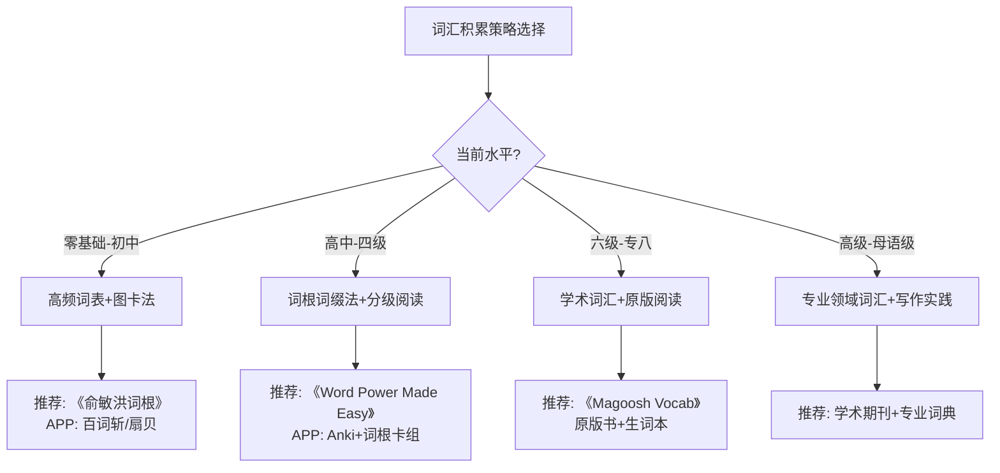
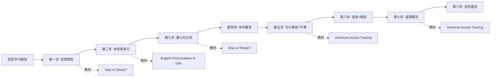
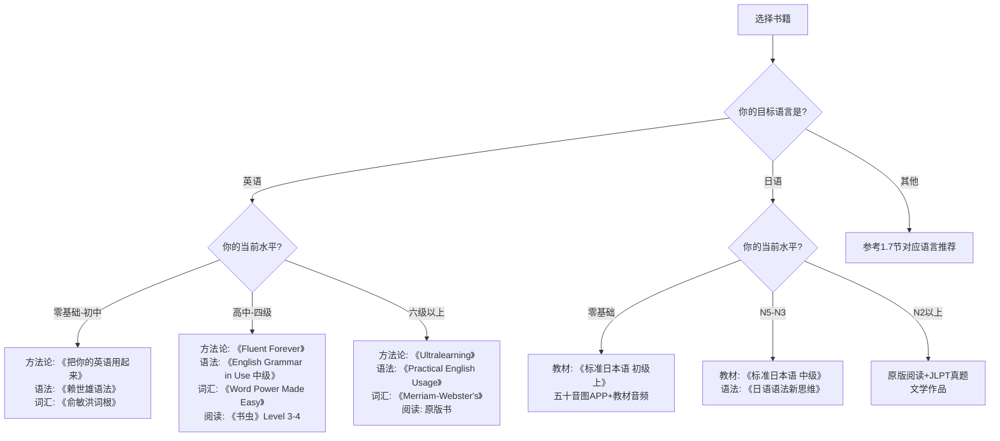

## 一、经典书籍推荐

在外语学习的工具箱中，书籍始终占据着不可替代的核心地位。与APP的碎片化、课程的单向输出不同，一本好的语言学习书籍提供的是**系统化的知识框架**——它将作者数年甚至数十年的学习经验浓缩为可反复查阅、深度消化的结构化内容。研究表明，深度阅读（deep reading）能激活大脑的默认模式网络（Default Mode Network），促进知识的长时记忆编码，这是刷短视频和做闪卡无法替代的认知过程。

本节按语言和功能分类，精选经过时间验证的经典书籍，为不同水平、不同目标的学习者提供清晰的选择路径。每本书的推荐都包含适用人群、核心方法论、版本选择建议和搭配使用方案，而非简单的书评堆砌。

### 1.1 英语学习方法论类

方法论类书籍解决的是"怎么学"的根本问题。在投入大量时间和金钱之前，花一周读一本方法论书籍，可以避免数月甚至数年的低效努力。以下是经过大规模读者验证的优质方法论书籍。

#### 1.1.1 《把你的英语用起来》— 伍君仪、刘晓光

**核心理念：** 系统介绍了"透析法"英语学习理念，强调通过大量阅读和听力输入来自然习得英语。"透析"的含义是：像医学透析一样，让大量真实英语材料"流过"你的大脑，在反复接触中自然内化语言规律。

**方法论拆解：**
- **输入假说的实践化：** 书中将Krashen的"可理解性输入"理论转化为具体操作——选择 i+1 难度的材料（即比当前水平略高一点点的材料），通过上下文猜测词义，而非逐词查词典
- **透析法操作流程：** 每页只查1-2个生词→大量泛读→在语境中反复遇到同一批词汇→自然习得。核心在于"量"而非"精"
- **资源推荐体系：** 书中附带大量分级阅读资源和听力资源的推荐，按照难度梯度排列

**适用人群：** 英语基础薄弱（CET-4以下）、长期苦学无果、对传统"背单词-学语法"模式感到厌倦的学习者。

**优势：** 操作性极强，拿到就能用。中文写作，无阅读障碍。

**局限：** 对口语和写作的产出技能覆盖不足，更偏向输入型学习。

#### 1.1.2 《英语学习的革命》— 李笑来

**核心理念：** 结合作者自身的英语学习经历，提出了"输入驱动学习"和"大量重复练习"的方法论。核心观点是：语言不是"学"会的，而是"用"会的；大脑需要足够多的输入量才能建立语言直觉。

**关键洞察：**
- **"用进废退"原则：** 语言能力和其他技能一样，不使用就会退化。书中强调建立"每天接触英语"的习惯比任何学习技巧都重要
- **"重复"的力量：** 与第二语言习得理论中的"频率效应"（frequency effect）高度吻合——高频接触的语言模式会被大脑自动归纳为规则
- **心态建设：** 大篇幅讨论了学习焦虑、完美主义陷阱等心理障碍，这在同类书籍中较为少见

**适用人群：** 有一定英语基础但长期停滞不前、需要改变学习观念和心态的学习者。

**搭配建议：** 可与《把你的英语用起来》对照阅读，两者方法论相似但侧重不同——李笑来更偏"道"（理念），伍君仪更偏"术"（操作）。

#### 1.1.3 《Fluent Forever》— Gabriel Wyner

**核心理念：** 基于最新语言学习科学研究，提出了一套完整的外语学习方法论。作者是歌剧演唱家，因职业需要在短时间内学会多种语言，其方法经过了极端条件下的实战检验。

**四步学习法详解：**

| 阶段 | 目标 | 核心工具 | 时间投入 |
|------|------|---------|---------|
| 第一步：发音训练 | 建立准确的语音表征 | 最小对立体训练、IPA音标 | 1-2周 |
| 第二步：词汇构建 | 掌握625个高频词 | 图片联想卡片（非翻译） | 4-6周 |
| 第三步：语法内化 | 通过句子模式吸收语法 | 间隔重复+造句 | 持续进行 |
| 第四步：输出实践 | 开始说和写 | 语言交换、写作练习 | 词汇量1000+后 |

**科学依据：**
- 基于认知心理学的"测试效应"（testing effect）：主动回忆比被动复习有效300%
- 采用"纯目标语"卡片：避免母语翻译造成的中介语固化
- 间隔重复算法（SM-2）：根据遗忘曲线动态调整复习间隔

**适用人群：** 有一定英语阅读能力（需阅读英文原版），愿意投入时间建立系统学习方法的中高级学习者。适合准备学习第二、第三门外语的人。

**版本说明：** 建议阅读英文原版，中文翻译版《学外语之道》翻译质量尚可但部分术语不够准确。

#### 1.1.4 《The Polyglot Dream》— Luca Lampariello

**核心理念：** 作者精通十余种语言（均为C1以上水平），书中分享了他20余年的语言学习哲学。与多数方法论书籍不同，Luca更强调学习过程中的"享受"和"好奇心"，而非效率最大化。

**核心方法：**
- **双向翻译法（Bidirectional Translation）：** 将目标语文章翻译为母语，再从母语翻译回目标语，通过对比发现差距
- **"思维语言化"：** 逐步培养用目标语思考的能力，而非在脑中"翻译"
- **深度而非广度：** 主张在一门语言达到B2水平后再开始下一门，避免"什么都会一点，什么都不精通"

**适用人群：** 对多语言学习感兴趣、愿意长期投入（非速成心态）的学习者。

#### 1.1.5 《How to Learn Any Language》— Barry Farber

**核心理念：** 出版于1991年，是语言学习方法论的经典之作。作者是美国记者和政治家，精通25种语言。虽然出版年代较早，但其核心方法经过了数十年的验证。

**经典方法：**
- **"分散注意力法"：** 将语言学习渗透到日常生活的每一个缝隙中——卡片随身带、广播背景听、标签贴满家
- **"四面出击法"：** 同时使用多种学习渠道（阅读、听力、口语、写作），而非单一线性推进
- **卡片系统：** 书中详细描述了实体卡片的制作和使用方法，这是Anki等现代SRS软件的原型

**适用人群：** 所有水平的学习者。特别适合喜欢实体工具、不依赖电子设备的学习者。

**历史价值：** 了解语言学习方法论的演进历史，对比现代工具（Anki、ChatGPT）与传统方法的异同。

#### 1.1.6 《Ultralearning》— Scott H. Young

**核心理念：** 作者在一年内自学通过了MIT计算机科学的四年课程（MIT Challenge），又在一年内学会了四种语言（西、葡、中、韩）。书中总结了高效自学的九条原则，其中多条直接适用于语言学习。

**核心原则与语言学习的映射：**

| Ultralearning原则 | 语言学习应用 | 实操举例 |
|-------------------|-------------|---------|
| 直接性（Directness） | 在实际场景中学习，而非"准备好了再用" | 第一天就尝试用目标语点餐 |
| 检索练习（Retrieval） | 主动回忆而非被动复习 | 合上书尝试复述刚读的内容 |
| 反馈（Feedback） | 尽早获取纠正性反馈 | 用iTalki找母语者对话 |
| 间隔（Spacing） | 分散学习而非集中突击 | 每天30分钟 > 周末3小时 |
| 纠错（Error Correction） | 识别并纠正系统性错误 | 录音回听自己的发音 |

**适用人群：** 有较强自学能力和自律性的学习者。适合想要快速突破的学习者，但需要接受高强度的学习节奏。

#### 1.1.7 《语言本能》（The Language Instinct）— Steven Pinker

**核心理念：** 严格来说这不是一本"学习方法"书，而是一本认知科学科普书。MIT教授Steven Pinker从进化心理学的角度解释了人类为什么天生具备语言能力。理解语言的本质，有助于破除"我没有语言天赋"的错误信念。

**对语言学习者的启发：**
- 语言能力是进化赋予全人类的本能，而非少数人的天赋
- 儿童学语言快不是因为"关键期"的神秘优势，而是因为沉浸时间和无心理负担
- 语法不是"规则"，而是大脑内隐归纳出的模式——这支持了"大量输入"的学习方法

**适用人群：** 对语言学习的科学基础感兴趣的学习者。不适合作为"工具书"，但能从根本上改变对语言学习的认知。

#### 1.1.8 《刻意练习》（Peak）— Anders Ericsson

**核心理念：** 佛罗里达州立大学心理学教授Ericsson通过数十年研究"专家表现"，提出了"刻意练习"（deliberate practice）理论。虽然不是语言学习专用书籍，但其理论完全适用于语言技能的精进。

**刻意练习的四要素与语言学习：**
1. **明确的改进目标：** 不是"提高口语"，而是"减少过去式和过去分词的混淆"
2. **专注的练习：** 关闭手机，全神贯注地做30分钟发音练习
3. **即时反馈：** 使用语音识别软件或母语者获得发音纠正
4. **走出舒适区：** 选择略高于当前水平的任务

**适用人群：** 中高级学习者遇到瓶颈时的突破指南。特别适合CET-6以上、雅思6.5以上想要继续提升的学习者。

### 1.2 英语语法类

语法是语言的骨架。系统学习语法不是为了"背规则"，而是为了建立对目标语言结构的直觉理解。好的语法书应该让你"恍然大悟"而非"越学越晕"。

#### 1.2.1 《English Grammar in Use》— Raymond Murphy

**全球地位：** 剑桥大学出版社出版，全球销量超过1亿册，是英语语法学习的"圣经"级教材。

**版本选择指南：**

| 版本 | 英文名 | CEFR等级 | 适合人群 | 建议用时 |
|------|--------|---------|---------|---------|
| 初级版 | Essential Grammar in Use | A1-A2 | 零基础到初中水平 | 2-3个月 |
| 中级版 | English Grammar in Use | B1-B2 | 高中到大学水平 | 3-4个月 |
| 高级版 | Advanced Grammar in Use | C1-C2 | 大学英语专业/高级学习者 | 持续参考 |

**使用方法：**
- 不要从头到尾线性阅读，先做每单元开头的测试题，做错的单元才需要学
- 每个单元独立成章，可以按需查阅，不必按顺序
- 书后附有完整答案，适合自学
- 建议配合Cambridge LMS（Learning Management System）的在线练习

**版本注意：** 购买时认准Cambridge University Press正版，国内有多个"借鉴"版本质量参差不齐。推荐购买第五版（最新），纸张和排版质量显著优于早期版本。

#### 1.2.2 《语法俱乐部》— 旋元佑

**独特价值：** 这本书最大的特点是用**中文思维**来解释英语语法的内在逻辑，而非简单地翻译英文语法书。作者旋元佑是台湾英语教育界的传奇人物，其讲解风格被读者形容为"语法界的侦探小说"。

**核心特色：**
- **从句子的本质出发：** 先建立"主语+动语+补语"的核心框架，再层层展开
- **"理解优于记忆"：** 每个语法规则都给出"为什么这样"的解释，而非"规则就是这样"
- **中文类比法：** 用中文语法的相似结构帮助理解英语语法，降低认知负荷

**适合中国学习者的理由：**
- 中文母语者学英语语法最大的障碍是"语言距离"——英语和中文的语法结构差异极大
- 传统的英文语法书（如English Grammar in Use）默认读者已具备基本的英语语法直觉
- 旋元佑用中文建立桥梁，让读者先"理解"再"记忆"

**适用人群：** 所有以中文为母语的英语学习者。特别推荐给"语法学了很多遍但总觉得没学透"的学习者。

#### 1.2.3 《赖世雄经典英语语法》— 赖世雄

**定位：** 赖世雄老师是台湾最受欢迎的英语教育家之一，其教学风格以通俗易懂、幽默风趣著称。

**使用建议：**
- 适合英语基础薄弱（初中水平以下）的学习者入门
- 配合赖世雄的音频课程使用效果倍增——听讲解+看文字的双通道输入
- 语法点的覆盖广度不如English Grammar in Use，但入门友好度更高
- 可以作为"暖身教材"，学完后过渡到English Grammar in Use

**与《语法俱乐部》的区别：** 赖世雄更偏向"教学型"（告诉你怎么做），旋元佑更偏向"理解型"（告诉你为什么）。建议基础弱选赖世雄，基础中等选旋元佑。

#### 1.2.4 《Practical English Usage》— Michael Swan

**定位：** 这不是一本系统教材，而是一本**用法参考书**。全书按字母顺序排列了600多个常见的英语用法问题，每个问题用2-3页的篇幅给出清晰的解释。

**使用场景：**
- 写作时遇到"since和for的区别""虚拟语气的用法"等具体问题，直接查阅
- 纠正长期存在的语法误区——书中专门设有"common mistakes"板块
- 英语教师的案头参考书

**典型查阅示例：**
- `data`作主语时动词用单数还是复数？→ 查"uncountable nouns"
- `If I was`和`If I were`哪个对？→ 查"subjunctive"
- `used to`和`would`的区别？→ 查"used to"

**适用人群：** 中高级学习者（CET-4以上）和英语教师。不适合作为入门教材，但作为工具书的价值极高。

#### 1.2.5 《English Grammar: A University Course》— Angela Downing & Philip Locke

**定位：** 大学英语语法教材，系统性和理论深度远超上述书籍。全书从音系学、形态学、句法学到语篇分析，覆盖了英语语法的完整体系。

**适用场景：** 英语专业学生、英语教师、翻译工作者。不是用来"学英语"的，而是用来"研究英语"的。

**建议：** 除非你是英语专业或从事英语教学工作，否则不需要读这本书。对大多数学习者来说，English Grammar in Use + Practical English Usage的组合已经足够。

### 1.3 英语词汇类

词汇是语言的血肉。没有足够的词汇量，即使语法再好也无法理解或表达。但"背单词"不是唯一的词汇积累方式——通过词根词缀理解词汇的构成逻辑，通过大量阅读在语境中自然习得，都是更高效的方法。

#### 1.3.1 《Word Power Made Easy》— Norman Lewis

**核心方法：** 通过拉丁语和希腊语词根系统地扩展英语词汇。全书以词根为线索，将看似无关的词汇串联成有机的词汇网络。

**方法论详解：**
- **词根网络法：** 每章围绕一个核心词根展开。例如，词根`bene-`（好）→ benefit（利益）、benevolent（仁慈的）、benediction（祝福）
- **即时测试：** 每讲完一组词汇就进行自我测试，强化记忆
- **词汇档案卡：** 书中建议读者建立自己的词汇档案，记录每个新词的词源、用法和例句

**数据支撑：** 英语中约60%的词汇来源于拉丁语和希腊语。掌握200个核心词根，可以帮助理解和记忆超过10000个英语单词。

**使用建议：**
- 认真完成每个章节的练习，不要只看不做
- 将学到的词根应用到日常阅读中，遇到生词时尝试拆解词根
- 全书大约需要6-8周完成，建议每天30分钟

**适用人群：** 已有CET-4词汇量基础、想要系统性扩展词汇量的学习者。特别适合准备GRE、SAT等学术英语考试的学生。

#### 1.3.2 《Merriam-Webster's Vocabulary Builder》

**定位：** 韦氏词典出品，权威性毋庸置疑。同样采用词根词缀法，但比Word Power Made Easy更简洁紧凑。

**与Word Power Made Easy的对比：**

| 维度 | Word Power Made Easy | Merriam-Webster's Vocabulary Builder |
|------|---------------------|--------------------------------------|
| 深度 | 更深入，每个词根展开更多 | 相对简洁 |
| 练习 | 练习丰富，互动性强 | 练习较少 |
| 收词量 | 词汇量更大 | 约1200个核心词 |
| 难度 | 中高级 | 中级 |
| 价格 | 较贵 | 便宜 |

**建议：** 入门选Merriam-Webster's（简洁不劝退），进阶选Word Power Made Easy（深度够）。

#### 1.3.3 《Vocabulary Builder》— Chris Lele（Magoosh）

**定位：** 面向GRE、学术英语的词汇学习书。Magoosh是美国知名的在线考试培训机构，这本词汇书是其课程体系的配套材料。

**特色：**
- 按主题分组（如"法律词汇""科学词汇""文学词汇"），更贴近学术场景
- 通过真实语境中的例句来学习词汇，而非孤立的词表
- 包含常见混淆词辨析（如affect/effect, complement/compliment）

**适用人群：** 准备GRE、GMAT、SAT等学术考试的学生。非考试目的的学习者不推荐——词汇选择偏学术，日常英语用不到。

#### 1.3.4 《英语词根与单词的说文解字》— 俞敏洪

**定位：** 中文撰写的英语词根词缀学习书。俞敏洪是新东方创始人，这本书是其早期的代表作。

**优势：**
- 全中文讲解，零英语门槛
- 结合中国学习者常见的词汇记忆痛点
- 词根分类清晰，适合入门

**局限：** 出版年代较早（2002年），部分例词和用法略显陈旧。但对于入门了解词根词缀法完全够用。

#### 1.3.5 分级词汇积累策略

不同水平的学习者应该采用不同的词汇策略：

### 1.4 英语阅读类

阅读是语言学习中"输入量"最大的技能。通过分级阅读逐步提升难度，是建立语言直觉最有效的方式之一。

#### 1.4.1 分级读物体系

**《书虫》系列（Oxford Bookworms Library）**

牛津大学出版社出版，全球最权威的英语分级读物系列。

| 级别 | 词汇量 | CEFR等级 | 典型书目 | 适合人群 |
|------|--------|---------|---------|---------|
| Starter | 250 | A1 | 《The Girl with Green Eyes》 | 初中生/零基础 |
| Level 1 | 400 | A1+ | 《The Elephant Man》 | 初中生 |
| Level 2 | 700 | A2 | 《White Death》 | 初中-高一 |
| Level 3 | 1000 | A2+ | 《The Jungle Book》 | 高一-高二 |
| Level 4 | 1400 | B1 | 《The Canterbury Tales》 | 高二-大一 |
| Level 5 | 1800 | B2 | 《Great Expectations》 | 大一-大二 |
| Level 6 | 2500 | B2+ | 《The Importance of Being Earnest》 | 大二以上 |

**使用建议：**
- 选择比当前水平低一级的级别开始，建立信心后再提升
- 每本书至少读两遍：第一遍查生词理解剧情，第二遍享受阅读流畅感
- 配合有声版使用，同时训练阅读和听力

**《床头灯英语学习读本》**

国内原创的英语分级读物，难度介于书虫Level 2-4之间。优势是内容更贴近中国学习者的兴趣和认知水平，但分级精度不如书虫系列。

**《Graded Readers》系列（Cambridge/Oxford/Penguin）**

各大出版社都有自己的分级读物系列。选择时认准"graded reader"标识和CEFR等级标注即可。推荐：
- Cambridge English Readers：原创故事而非简写名著，文学性更高
- Penguin Readers：简写经典名著为主，与书虫系列互补
- Oxford Bookworms：覆盖最广，选择最多

#### 1.4.2 进阶阅读推荐

当词汇量超过3000、可以独立阅读分级读物Level 4以上时，应该逐步过渡到原版书阅读。

**入门原版书推荐（由易到难）：**

| 书名 | 作者 | 难度 | 推荐理由 |
|------|------|------|---------|
| 《Charlotte's Web》 | E.B. White | ★★☆☆☆ | 儿童文学经典，语言优美简洁 |
| 《The Old Man and the Sea》 | Hemingway | ★★☆☆☆ | 海明威的简洁风格适合英语学习 |
| 《Harry Potter》系列 | J.K. Rowling | ★★★☆☆ | 情节吸引人，读起来不费力 |
| 《The Great Gatsby》 | F. Scott Fitzgerald | ★★★☆☆ | 短小精悍，文学价值高 |
| 《1984》 | George Orwell | ★★★★☆ | 词汇量适中，思想深刻 |
| 《Sapiens》 | Yuval Harari | ★★★★☆ | 非虚构类，学术英语入门 |
| 《Thinking, Fast and Slow》 | Daniel Kahneman | ★★★★★ | 学术英语进阶，逻辑严密 |

**原版书阅读技巧：**
1. **不要查每一个生词：** 先根据上下文猜测，只有影响理解的关键词才查
2. **Kindle的X-Ray功能：** 快速查看人物关系和词频统计
3. **每天固定时间：** 建立"英文阅读时间"的习惯，每天至少20分钟
4. **从兴趣出发：** 喜欢什么就读什么，不要强迫自己读"应该读"的书

### 1.5 口语和发音类

发音是很多中国学习者的"短板"。中式发音不仅影响理解，还会降低说英语的信心。以下书籍从不同角度系统地解决了发音问题。

#### 1.5.1 《American Accent Training》— Ann Cook

**核心价值：** 系统讲解美式英语发音的权威教材，配有完整音频。与其他发音书不同的是，这本书不仅讲单个音素，更注重**语流特征**——连读、弱读、缩读、语调、节奏。

**内容结构：**
1. **元音和辅音系统：** 美式英语的完整音素系统，每个音素配有口型图
2. **连读规则：** 辅音+元音连读、相同辅音合并、T/D的特殊处理
3. **弱读模式：** 功能词（the, a, is, have）在自然语流中的弱化形式
4. **语调和节奏：** 英语的"重音计时"节奏模式与中文"音节计时"的区别
5. **综合练习：** 模仿真实对话录音

**使用方法：**
- 配合音频使用，先听→模仿→录音→对比
- 每天练习20-30分钟，坚持2-3个月会有明显改善
- 重点关注"语流"而非"单个音"——连读和弱读比单个音素更重要

**适用人群：** 想要学习美式英语发音的中高级学习者。要求有基本的英语听力能力（能听懂慢速英语）。

#### 1.5.2 《Ship or Sheep?》— Ann Baker

**核心价值：** 通过最小对立体（minimal pairs）训练来区分发音相似的音素。例如 ship/sheep, bat/bet, full/fool 等。

**为什么最小对立体有效：**
- 大脑对音素的感知是"类别化"的——母语中区分的音素容易听出来，母语中不区分的音素容易忽略
- 通过反复对比训练，可以"重新校准"大脑的音素感知系统
- 这是第二语言习得研究中被反复验证有效的方法

**适用人群：** 听力和发音都有困难的学习者。特别是分不清长短元音（如bit/beat）、清浊辅音（如pat/bat）的学习者。

**配套：** 《Tree or Three?》是同一作者的入门版，难度更低。

#### 1.5.3 《English Pronunciation in Use》— Mark Hancock

**定位：** 剑桥大学出版社出版的发音教材系列，分为初级、中级和高级三个版本。与American Accent Training相比，这套书更注重英式发音。

**版本对比：**

| 版本 | 适合水平 | 侧重点 | 推荐配套 |
|------|---------|--------|---------|
| 初级 | A1-A2 | 基本音素+重音 | 剑桥初级语法 |
| 中级 | B1-B2 | 连读+语调+语流 | 剑桥中级语法 |
| 高级 | C1-C2 | 口音辨析+正式/非正式语体 | 剑桥高级语法 |

**与American Accent Training的区别：** 英式vs美式；练习更多vs讲解更多；剑桥体系vs独立教材。

#### 1.5.4 发音学习路线图

### 1.6 日语学习类

日语是中国人学习最多的第二外语之一。中日共享汉字的优势让中国学习者在阅读上有天然优势，但语法结构（SOV语序）和敬语系统的差异也构成了独特的挑战。

#### 1.6.1 《标准日本语》（新版）— 人民教育出版社

**地位：** 中国使用最广泛的日语教材，也是日语能力考试（JLPT）的主要备考教材之一。

**版本选择：**

| 版本 | 册数 | 对应JLPT等级 | 适合人群 | 特点 |
|------|------|-------------|---------|------|
| 初级上 | 1册 | N5 | 零基础 | 五十音图+基础句型 |
| 初级下 | 1册 | N4 | 学完初级上 | 基础语法+日常会话 |
| 中级上 | 1册 | N3 | 学完初级下 | 复杂语法+阅读训练 |
| 中级下 | 1册 | N2 | 学完中级上 | 高级语法+长文阅读 |
| 高级 | 2册 | N1 | 学完中级下 | 学术日语+文学选读 |

**使用建议：**
- 新版（2005年后出版）远优于旧版，认准"第二版"或"第三版"
- 配合APP"标准日本语"的官方音频使用
- 课文要背诵，不是"读懂"而是"内化"
- 语法解释偏简略，遇到不理解的语法点需要查阅《日语语法新思维》补充

**常见误区：** 很多学习者只看语法讲解不读课文，导致"语法全会但说不出完整句子"。课文是语法规则的活用示范，必须精读。

#### 1.6.2 《大家的日本语》（みんなの日本語）— スリーエーネットワーク

**定位：** 日本原版日语教材，全球使用最广泛的日语教材之一。与《标准日本语》的最大区别是：这本书是日本人在日本为外国人编写的，更注重实际会话场景。

**与《标准日本语》的对比：**

| 维度 | 标准日本语 | 大家的日本语 |
|------|-----------|-------------|
| 编写视角 | 中国人为中国人编写 | 日本人为外国人编写 |
| 语法讲解 | 详细中文解释 | 简略日文+教师手册补充 |
| 会话场景 | 偏教材化 | 更贴近真实生活 |
| 配套资源 | 官方APP+音频 | 翻译手册+练习册+音频 |
| 自学友好度 | ★★★★★ | ★★★☆☆ |
| 口语实用性 | ★★★☆☆ | ★★★★★ |

**选择建议：** 自学选《标准日本语》，跟老师学或有日语环境选《大家的日本语》。

#### 1.6.3 《日语语法新思维》— 陈一红

**核心价值：** 用中文讲解日语语法的深层逻辑，帮助学习者"理解"而非"记忆"日语语法。与旋元佑的《语法俱乐部》理念相似，但针对的是日语。

**特色：**
- 从"日语思维"出发解释语法，而非简单地将日语语法套入中文框架
- 大量对比中文和日语的思维方式差异，帮助建立日语语感
- 对助词（は、が、を、に等）的讲解尤其精彩，是很多学习者的"顿悟之书"

**适用人群：** 学完《标准日本语》初级后、想要深入理解日语语法逻辑的学习者。

#### 1.6.4 日语进阶阅读推荐

| 书名 | 作者 | 难度 | 适合水平 |
|------|------|------|---------|
| 《日本语能力测试N2阅读》 | 人教社 | N2 | JLPT N2备考 |
| 《日语短篇小说精选》 | 各位作家 | N2-N1 | 文学阅读入门 |
| 《挪威的森林》日文原版 | 村上春树 | N1 | 进阶阅读+文学欣赏 |
| 《菊与刀》日文原版 | 鲁思·本尼迪克特 | N1 | 学术阅读+文化理解 |

### 1.7 其他语言学习类

#### 1.7.1 韩语

| 书名 | 作者/出版 | 适合水平 | 特点 |
|------|----------|---------|------|
| 《新标准韩国语》 | 外研社 | 零基础-N3 | 中国高校通用教材，语法讲解详细 |
| 《延世韩国语》 | 延世大学 | 零基础-N1 | 韩国原版教材，体系完整，语境真实 |
| 《韩国语语法入门》 | 李翊燮 | 初级-中级 | 语法参考书，适合查漏补缺 |
| 《TOPIK词汇大纲》 | 韩国教育课程评价院 | 初级-高级 | 考试词汇标准，按频率排序 |

**韩语学习关键点：** 韩语和日语的语法结构高度相似（SOV语序、助词系统、敬语系统），如果先学了日语再学韩语，可以节省大量语法学习时间。

#### 1.7.2 法语

| 书名 | 作者/出版 | 适合水平 | 特点 |
|------|----------|---------|------|
| 《简明法语教程》 | 孙辉 | 零基础-B1 | 中国最经典的法语教材，语法系统 |
| 《Reflets》（走遍法国） | Hachette | 零基础-B1 | 法国原版教材，场景真实 |
| 《Grammaire progressive du Français》 | CLE International | A1-C2 | 法语语法渐进系列，分4个等级 |
| 《Le Petit Prince》 | 圣-埃克苏佩里 | A2+ | 法语入门原版阅读首选 |

#### 1.7.3 德语

| 书名 | 作者/出版 | 适合水平 | 特点 |
|------|----------|---------|------|
| 《新求精德语强化教程》 | 同济大学 | 零基础-B2 | 中国最通用的德语教材 |
| 《Menschen》 | Hueber | 零基础-B1 | 德国原版教材，文化内容丰富 |
| 《德语语法解析与练习》 | 外研社 | 初级-高级 | 语法专项，适合查漏补缺 |
| 《Die Verwandlung》（变形记） | 卡夫卡 | B2+ | 德语文学经典入门 |

#### 1.7.4 西班牙语

| 书名 | 作者/出版 | 适合水平 | 特点 |
|------|----------|---------|------|
| 《现代西班牙语》 | 外研社 | 零基础-B2 | 中国高校通用教材 |
| 《Aula Internacional》 | Difusión | 零基础-B2 | 西班牙原版教材，交际法 |
| 《Gramática de uso del Español》 | SM | A1-C2 | 语法工具书，按主题排列 |
| 《Cien Años de Soledad》 | 马尔克斯 | C1+ | 西班牙语文学巅峰之作 |

### 1.8 多语言学习与语言学习哲学类

以下书籍不限于某一门语言，而是从更高的视角审视语言学习的本质。

#### 1.8.1 《The Way of the Linguist》— Steve Kaufmann

**作者背景：** 加拿大外交官，精通20余种语言。70多岁仍在学习新语言，是世界上最多产的语言学习者之一。创办了LingQ语言学习平台。

**核心观点：**
- 语言学习的关键是"大量可理解性输入"——听和读的量要足够大
- 不要追求完美，接受"足够好"的水平就大胆开口
- 享受学习过程比追求效率更重要——只有享受才能坚持

**对传统教学的批判：** Kaufmann强烈反对语法翻译法和课堂教学模式，认为它们效率低下且容易导致"分析瘫痪"——花太多时间研究语法而不敢开口。

#### 1.8.2 《Polyglot: How I Learn Languages》— Kató Lomb

**作者背景：** 匈牙利翻译家，自学掌握了16种语言，其中大部分是在成年后学会的。她是"多语言者"（polyglot）运动的先驱人物。

**核心启示：**
- **成年后学语言完全可以达到高水平：** Lomb证明了"关键期假说"并非铁律
- **阅读是语言学习的基础：** 她的学习方法以大量阅读为核心
- **犯错是进步的阶梯：** 她鼓励学习者不怕犯错，在错误中学习
- **语言学习是终身事业：** 她80多岁仍在学习新语言

**特别推荐理由：** 这本书是免费公开的（作者已去世，版权过期），在网上可以找到英文版PDF。

#### 1.8.3 《Babel No More》— Michael Erard

**核心内容：** 一本关于"超级多语言者"（hyperpolyglots）的科学调查报告。作者走访了世界各地的语言天才，试图理解他们的大脑和学习方法。

**关键发现：**
- 真正精通10种以上语言的人比想象中少得多
- 超级多语言者往往具有更强的工作记忆和更好的听觉处理能力
- 但"方法"和"坚持"比"天赋"更重要——即使是语言天才也投入了惊人的学习时间

**适用人群：** 对语言学习科学感兴趣的学习者。不适合作为"工具书"，但能帮助建立对语言学习的理性预期。

### 1.9 书籍选择决策指南

面对如此多的书籍，如何做出选择？以下决策树可以帮助你快速定位适合自己的书籍。

### 1.10 书籍购买与使用建议

#### 1.10.1 购买渠道

| 渠道 | 优势 | 劣势 | 适合 |
|------|------|------|------|
| 京东/当当 | 正品保证，售后好 | 价格较高 | 正版教材 |
| 拼多多 | 价格低 | 盗版风险 | 非核心参考书 |
| 孔夫子旧书网 | 绝版书/二手书 | 品相参差 | 经典旧版教材 |
| 亚马逊Kindle | 电子版便携 | 无法做笔记 | 原版英文书 |
| Z-Library | 免费 | 版权争议 | 先试读再决定是否购买 |

#### 1.10.2 实体书vs电子书

| 维度 | 实体书 | 电子书 |
|------|--------|--------|
| 阅读体验 | 更佳，无屏幕疲劳 | 便携，可即时查词 |
| 做笔记 | 灵活，边写边画 | 高亮+笔记同步 |
| 长期记忆 | 更好（空间记忆效应） | 较差 |
| 价格 | 较贵 | 便宜/免费 |
| 携带 | 重 | 轻便 |

**建议：** 教材和语法书买实体版（需要反复翻阅、做笔记），原版小说买电子版（阅读量大、需要查词功能）。

#### 1.10.3 读书方法论

买了书不等于学了书。以下是经过验证的高效读书方法：

**SQ3R法（适用于教材类）：**
1. **Survey（浏览）：** 先快速浏览目录、标题、加粗文字，建立整体框架
2. **Question（提问）：** 将标题转化为问题，如"什么是现在完成时？"
3. **Read（阅读）：** 带着问题阅读正文
4. **Recite（复述）：** 合上书，尝试用自己的话复述刚才读的内容
5. **Review（复习）：** 第二天快速回顾昨天的内容

**主题阅读法（适用于方法论类）：**
- 选定一个主题（如"词汇记忆"），同时阅读3-5本相关书籍
- 对比不同作者的观点，找出共性和差异
- 形成自己的综合理解，而非盲从某一位作者

### 1.11 本节小结

经典书籍的价值在于其**系统性、深度和经过时间验证的有效性**。在选择书籍时：

1. **先选方法论：** 在投入学习之前，先花一周读一本方法论书籍，避免低效努力
2. **匹配当前水平：** 选择适合自己水平的书籍，太难会劝退，太简单会浪费时间
3. **买精不买多：** 每个类别选1-2本精读，而非买一堆翻翻就放
4. **配合使用：** 教材+语法+词汇+阅读的组合比单打独斗更有效
5. **读完比读多重要：** 一本读完的书胜过十本翻了几页的书

