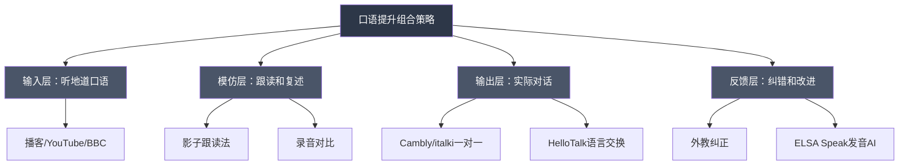

## 三、在线课程推荐

在线课程是外语学习体系中最接近"正规教育"的学习形式——它提供结构化的课程大纲、循序渐进的难度设计、以及（在大多数情况下）来自专业教师或母语者的指导。与碎片化的APP学习不同，在线课程要求学习者投入整块时间，按照课程节奏系统推进，这对于建立完整的语言能力框架至关重要。

本节将从课程平台类型、选课策略、英语课程（按技能分类）、考试备考课程、多语种课程、以及学习路径设计六个维度，为你提供一份详尽的在线课程指南。

### 3.1 在线课程的类型与选课策略

#### 3.1.1 在线课程的主要类型

外语在线课程并非只有一种形态，了解不同类型课程的特点，才能根据自身需求做出最优选择。

| 课程类型 | 典型平台 | 学习节奏 | 互动程度 | 适合人群 | 价格区间 |
|---------|---------|---------|---------|---------|---------|
| MOOC（大规模开放课程） | Coursera、edX、中国大学MOOC | 自主节奏或固定开课日期 | 低至中（论坛讨论） | 自律性强、喜欢系统学习的学习者 | 免费旁听至数千元/证书 |
| 一对一真人授课 | italki、Cambly、Preply | 灵活预约 | 高（实时对话） | 需要口语练习、个性化指导的学习者 | 50-300元/小时 |
| 结构化录播课程 | Udemy、Skillshare、B站 | 完全自主 | 低（留言区） | 时间不固定、喜欢反复观看的学习者 | 免费至数百元/课程 |
| 直播小班课 | 新东方在线、流利说Live | 固定时间 | 中至高 | 需要课堂氛围和同伴互动的学习者 | 数千元至万元/期 |
| AI自适应课程 | Duolingo、Babbel、流利说 | 完全自主 | 中（AI反馈） | 喜欢碎片化学习、即时反馈的学习者 | 免费至数百元/年 |
| 沉浸式课程 | FluentU、LingQ | 完全自主 | 低至中 | 希望通过真实语料学习的学习者 | 100-800元/年 |

#### 3.1.2 选课的五个核心维度

选课不是看哪个平台广告多、哪个课程便宜，而是需要基于以下五个维度做出理性判断：

**维度一：明确学习目标**

不同的学习目标指向不同的课程类型。问自己一个问题：我学这门语言，最终要达到什么效果？

- **应试需求**（雅思6.5、N2、TOPIK4级）→ 选择专门的备考课程，而非通用英语课程
- **职场应用**（商务邮件、会议发言、行业术语）→ 选择商务语言课程或行业英语课程
- **日常交流**（旅游、交友、生活）→ 选择口语导向的课程，配合真人对话练习
- **学术研究**（论文写作、文献阅读、学术报告）→ 选择学术英语课程
- **兴趣驱动**（看懂原版电影、阅读原版小说）→ 选择以内容为载体的沉浸式课程

**维度二：评估当前水平**

选课最常见的错误是"高估自己"。一个A2水平的学习者直接上B2课程，不仅学不到东西，还会因为挫败感而放弃。建议在选课前完成一次标准化水平测试：

- **英语**：剑桥英语水平测试（Cambridge English Test，免费在线）、EF SET（50分钟标准测试，免费）
- **日语**：JLPT官方样题、Marugoto在线水平测试
- **韩语**：TOPIK官方样题、Sejong Korean水平测试
- **法语/西班牙语/德语**：Alliance Française在线测试、Instituto Cervantes在线测试、Goethe-Institut在线测试

这些测试的结果可以帮助你精准定位自己所在的CEFR等级（A1-C2），从而选择难度匹配的课程。

**维度三：考量时间投入**

诚实评估你每周能投入多少时间学习语言。这个数字决定了你适合什么样的课程节奏：

- **每周1-3小时**：选择完全自主节奏的录播课程或MOOC，不要报名有固定截止日期的课程
- **每周3-7小时**：可以选择有固定节奏的MOOC课程，或每周1-2次一对一课程
- **每周7-15小时**：可以报读直播小班课，或同时搭配MOOC+一对一课程
- **每周15小时以上**：可以考虑全日制语言项目或密集课程

**维度四：预算规划**

语言学习是一项长期投资，但并不意味着越贵越好。以下是不同预算区间的最优策略：

- **零预算**：利用MOOC免费旁听、YouTube教学频道、免费APP（Duolingo基础版）、语言交换APP（HelloTalk/Tandem），可以搭建完整的学习体系
- **500元/年以内**：付费APP订阅（Duolingo Plus、Babbel）+ 偶尔的一对一外教课程
- **2000-5000元/年**：系统MOOC课程（含证书）+ 每周1次一对一外教课程
- **5000-15000元/年**：高质量MOOC专项课程 + 每周2-3次一对一外教课程 + 专业备考资料
- **15000元/年以上**：全日制在线语言项目、高端一对一课程（如专业商务英语教练）

**维度五：教学方法匹配**

不同的教学方法适合不同的学习风格：

- **语法翻译法**（Grammar-Translation）：通过语法规则和翻译练习学习，适合喜欢逻辑分析的学习者
- **交际法**（Communicative Language Teaching）：强调真实语境中的交流能力，适合想快速开口的学习者
- **任务型教学法**（Task-Based Language Teaching）：通过完成具体任务来学习语言，适合喜欢实践的学习者
- **沉浸式教学**（Immersion）：全程使用目标语言，适合有一定基础的学习者
- **自然法/可理解输入**（Comprehensible Input）：基于Krashen的输入假说，强调大量可理解输入，适合听力和阅读导向的学习者

了解自己的学习风格偏好，选择匹配的教学方法，可以显著提高学习效率和坚持率。

### 3.2 综合英语课程

#### 3.2.1 MOOC平台的英语课程

**Coursera英语课程**

Coursera是全球最大的MOOC平台之一，与世界顶级大学合作提供英语课程。其英语课程的核心优势在于课程质量有保障——大多数课程由知名大学的教授设计和授课，课程结构完整，包含视频讲座、阅读材料、作业和测验。

| 课程名称 | 提供机构 | 难度等级 | 核心内容 | 费用 | 推荐指数 |
|---------|---------|---------|---------|------|---------|
| English for Career Development | 宾夕法尼亚大学 | 中级（B1-B2） | 求职英语：简历撰写、面试技巧、职场沟通 | 旁听免费，证书约300元 | ★★★★★ |
| Learn English: Advanced Grammar Specialization | 加州大学尔湾分校 | 中高级（B2-C1） | 系统高级语法：复杂句型、时态、语气 | 旁听免费，证书约600元/专项 | ★★★★★ |
| English Composition | 杜克大学 | 中高级（B2+） | 学术写作：论证结构、修辞策略、研究写作 | 旁听免费，证书约300元 | ★★★★☆ |
| Academic English: Writing Specialization | 加州大学尔湾分校 | 中高级（B2-C1） | 学术英语写作：从段落到论文的完整流程 | 旁听免费，证书约600元/专项 | ★★★★★ |
| English for Business and Entrepreneurship | 宾夕法尼亚大学 | 中级（B1-B2） | 商务英语：商业计划、融资、谈判 | 旁听免费，证书约300元 | ★★★★☆ |
| English for Science, Technology, Engineering, and Mathematics | 宾夕法尼亚大学 | 中级（B1-B2） | STEM领域学术英语 | 旁听免费，证书约300元 | ★★★★☆ |

**Coursera的使用策略**：大多数Coursera课程允许免费旁听（Audit），你可以访问所有视频和大部分阅读材料，但无法提交作业和获得证书。对于纯学习目的，旁听完全足够。如果你需要证书（用于求职或留学申请），则需要付费。Coursera Plus年费约3000元，可以无限访问大部分课程，如果你计划一年内完成3门以上课程，这是更划算的选择。

**edX英语课程**

edX由哈佛大学和MIT联合创立，课程质量与Coursera处于同一水平，但在学术英语和写作方面的课程尤为出色。

| 课程名称 | 提供机构 | 难度等级 | 核心内容 | 费用 |
|---------|---------|---------|---------|------|
| Upper-Intermediate English | 雷丁大学 | 中高级（B2） | 综合英语提升：语法、词汇、阅读、写作 | 旁听免费，证书约300元 |
| English for Academic Purposes | 多所大学 | 中高级（B2-C1） | 学术英语：论文写作、文献综述、学术演讲 | 旁听免费，证书约300元 |
| English Grammar and Style | 昆士兰大学 | 中级（B1-B2） | 英语语法与写作风格 | 旁听免费，证书约300元 |
| Communicating Strategically in English | 多所大学 | 中级（B1-B2） | 英语沟通策略 | 旁听免费，证书约300元 |

**中国大学MOOC（icourse163.org）**

中国大学MOOC是国内最大的MOOC平台，由网易与高教社合作运营。对于英语学习者，该平台的独特优势在于：课程完全免费（包括证书）；部分课程提供中英双语讲解，降低了纯英语课程的学习门槛；课程内容可能更贴近中国学习者的实际需求和常见痛点。

推荐关注的英语课程方向：
- **大学英语类**：北京大学、清华大学、复旦大学等高校的大学英语课程
- **考研英语**：专门针对考研英语的系统课程
- **学术英语写作**：面向需要撰写英文学术论文的研究生和学者
- **英语语音学**：系统讲解英语发音的语音学课程

**学堂在线（xuetangx.com）**

清华大学发起的MOOC平台，英语课程质量较高，尤其推荐清华大学的学术英语课程系列。

#### 3.2.2 综合英语课程平台

**Udemy英语课程**

Udemy是一个全球性的在线课程市场，任何人都可以在上面发布课程。这意味着课程质量参差不齐，但也意味着价格通常较低（常有促销，课程价格可低至几十元）。

选择Udemy英语课程的关键技巧：
- 只选择评分4.5以上、评价数超过1000的课程
- 查看讲师的资质和背景
- 利用30天退款保证试听
- 等待促销活动购买（Udemy几乎每个月都有大促，原价数百元的课程促销时通常只要几十元）

推荐的Udemy英语课程系列：
- **The Complete English Language Course**（Jon Smith）：从零到中高级的完整英语课程
- **English Grammar Launch**（Adrian Veale）：语法专项突破
- **Complete English Course: English Speaking, English Grammar**（TJ Walker）：口语+语法综合课程
- **English Pronunciation - Learn to Speak Like a Native**：发音专项课程

**FluentU**

FluentU的核心理念是"通过真实语料学语言"——它收集了大量真实的英语视频（电影预告片、新闻片段、音乐MV、TED演讲等），为每个视频配上交互式字幕，点击任何单词即可查看释义、例句和发音。

- 费用：免费试用7天，之后约150-200元/月，年付约800-1000元
- 特色功能：视频字幕交互、词汇追踪、个性化推荐、语境学习
- 适合人群：中级以上学习者（A2+），喜欢通过看视频学英语的人
- 推荐指数：★★★★☆

FluentU的最大优势是让学习者在真实的语言环境中学习词汇和表达，而不是在人造的课文语境中。但它的缺点是价格较高，且对于初级学习者来说难度偏大。

**LingQ**

LingQ由多语言学习者Steve Kaufmann创立，其核心理念是"大量阅读和听力输入"。平台允许你导入任何文本和音频内容（网页文章、电子书、播客等），系统会自动将你认识和不认识的单词标记为不同颜色，帮助你跟踪词汇学习进度。

- 费用：免费基础版（功能受限），付费版约500-700元/年
- 特色功能：内容导入、词汇追踪、LingQ统计、社区分享内容
- 适合人群：中高级学习者，喜欢大量阅读输入的学习者
- 支持语言：20+种语言
- 推荐指数：★★★★☆

### 3.3 口语专项课程

口语能力是大多数外语学习者最渴望提升、也最难以通过自学突破的技能。在线课程中，口语课程的形态从录播讲解到一对一真人对话不等，效果差异巨大。

#### 3.3.1 一对一外教平台

一对一外教平台是提升口语最直接、最高效的方式。以下是主流平台的详细对比：

**Cambly**

Cambly的核心卖点是"随时约课、即开即学"——你不需要提前预约，任何时候打开APP都可以立即与在线的母语外教开始视频通话。这对于时间不固定的学习者来说是巨大的优势。

| 维度 | 详情 |
|------|------|
| 教师资质 | 以英语母语者为主（美国、英国、加拿大、澳大利亚等），部分有教学证书 |
| 课程形式 | 一对一视频通话，无固定教材，自由对话或按教师建议进行 |
| 适合水平 | 中级以上（B1+），初级学习者可能难以充分利用 |
| 价格 | 约80-150元/小时（取决于套餐），年付套餐更优惠 |
| 优势 | 随时约课、外教质量稳定、无课程绑定 |
| 不足 | 费用较高、无系统课程大纲、不适合零基础学习者 |
| 推荐指数 | ★★★★★ |

**Cambly使用建议**：如果你是中级以上学习者，Cambly最适合作为"口语练习的日常工具"——每天15-30分钟的自由对话，保持口语的流利度和自信心。不必过于纠结每次对话的主题，重点是"开口说话"本身。

**italki**

italki是全球最大的在线语言教师平台，拥有超过10,000名教师，覆盖150+种语言。它的核心优势是"选择多、价格灵活"——你可以根据教师的资历、国籍、教学风格、价格和评价来选择最适合自己的老师。

| 维度 | 详情 |
|------|------|
| 教师类型 | 专业教师（Professional Teacher）和社区导师（Community Tutor）两类 |
| 专业教师 | 持有教学证书或语言学学位，提供系统课程和考试备考 |
| 社区导师 | 母语者但不一定有教学证书，适合口语练习和文化了解 |
| 课程形式 | 一对一视频通话，教师通常会根据你的需求定制课程内容 |
| 适合水平 | 全水平段（零基础到高级），因为可以找到愿意用简单语言教初级学习者的教师 |
| 价格 | 社区导师约50-100元/小时，专业教师约100-300元/小时 |
| 优势 | 教师选择极多、价格灵活、支持几乎所有语言、可以上试听课 |
| 不足 | 教师质量参差不齐（需要仔细筛选）、需要提前预约 |
| 推荐指数 | ★★★★★ |

**italki选师技巧**：
1. 先明确你的学习目标（口语练习？语法讲解？考试备考？写作批改？）
2. 筛选条件设置为：目标语言母语者、价格区间、可用时间
3. 查看教师的自我介绍视频和学生评价
4. 先预约一节30分钟的试听课（很多教师提供折扣试听课）
5. 在试听课中评估：教师的发音是否清晰、是否能根据你的水平调整难度、是否善于引导对话、纠错是否及时准确
6. 如果不合适，不要犹豫换老师——italki上有足够多的选择

**Preply**

Preply的定位与italki类似，但在某些方面有所不同：

| 维度 | 详情 |
|------|------|
| 教师筛选 | 比italki更严格的教师审核机制 |
| 课程系统 | 提供更结构化的课程大纲（针对部分语言） |
| 保证政策 | 如果第一节课不满意，可以免费更换教师 |
| 价格 | 约50-200元/小时（因教师和语言而异） |
| 优势 | 教师质量相对稳定、有课程大纲、支持多种语言 |
| 不足 | 教师数量不如italki多、部分语言选择有限 |
| 推荐指数 | ★★★★☆ |

#### 3.3.2 口语专项录播课程

如果你暂时无法负担一对一外教课程，或者想在上外教课之前先打好口语基础，以下录播课程可以帮到你：

**Rachel's English（YouTube频道）**

Rachel's English是YouTube上最受欢迎的美式英语发音教学频道之一，拥有超过400万订阅者。Rachel是一名专业的语音教练，她的视频系统讲解了美式英语的每一个音素（包括元音、辅音、辅音连缀）、重音模式、节奏、连读、弱读、缩读等语音现象。

- 费用：YouTube免费，网站（rachelsenglish.com）提供更系统的付费课程
- 核心内容：40+个英语音素的详细发音教学、口腔肌肉运动图解、常见发音错误纠正、真实语境中的语音现象
- 适合人群：所有想改善美式英语发音的学习者
- 推荐指数：★★★★★

**BBC Learning English**

BBC Learning English是BBC官方的英语学习平台，已有数十年历史。它的内容涵盖语法、词汇、发音、新闻英语、日常英语等几乎所有领域，并且持续更新。

- 费用：完全免费
- 核心系列：
  - **6 Minute English**：6分钟英语播客，每期围绕一个话题，适合中级学习者
  - **The English We Speak**：讲解英式英语中的口语表达和俚语
  - **Pronunciation**：英式英语发音教学
  - **News Review**：用新闻事件教英语词汇和表达
  - **English in a Minute**：一分钟讲解一个英语知识点
- 适合人群：所有水平的学习者（有从初级到高级的分层内容）
- 推荐指数：★★★★★

**English with Lucy（YouTube频道）**

Lucy是一位英国英语教师，她的频道专注于英式英语的发音、词汇和表达方式。她的视频风格生动有趣，经常对比英式英语和美式英语的差异。

- 费用：YouTube免费，网站提供付费课程
- 核心内容：英式发音教学、英美差异对比、高级词汇替换、日常口语表达
- 适合人群：想学习英式英语的中高级学习者
- 推荐指数：★★★★☆

**EngVid（engvid.com）**

EngVid是一个由多位英语教师共同维护的教学网站，每位教师都有自己的教学风格和专长领域。网站内容涵盖语法、词汇、发音、考试备考、商务英语等。

- 费用：完全免费
- 核心优势：11位不同风格的教师、1000+免费视频课程、按难度和主题分类、配有小测验
- 推荐教师：
  - **Adam**：语法和写作（讲解清晰、逻辑性强）
  - **Rebecca**：发音和口语（语速适中、适合初中级）
  - **Alex**：日常英语和文化（风格轻松、实用性强）
  - **James**：高级词汇和表达（适合高级学习者）
- 推荐指数：★★★★★

#### 3.3.3 口语练习的组合策略

单独使用任何一种口语课程都有局限性。最有效的口语提升策略是"组合拳"：

推荐的每周口语练习组合：

| 时间 | 活动 | 工具/平台 | 目的 |
|------|------|---------|------|
| 每天15分钟 | 听英语播客或YouTube | BBC 6 Minute English、Rachel's English | 输入地道口语素材 |
| 每天10分钟 | 影子跟读练习 | 每日英语听力APP、ELSA Speak | 模仿发音和语调 |
| 每周2-3次，每次30分钟 | 一对一外教对话 | Cambly或italki | 实际对话输出 |
| 每周1-2次，每次20分钟 | 语言交换 | HelloTalk或Tandem | 免费口语练习 |
| 每周1次，15分钟 | 录音回听和自我评估 | 手机录音 | 发现发音问题 |

### 3.4 听力和发音课程

听力和发音是语言学习中最基础也最容易被忽视的两项技能。很多学习者的口语问题，根源其实在于听力——听不清就模仿不准，模仿不准就说不好。

#### 3.4.1 听力课程与资源

**TED Talks + TED-Ed**

TED演讲不仅是获取知识的窗口，更是极佳的英语听力学习材料。每篇演讲通常10-20分钟，配有完整的字幕和多语言翻译。

- 如何用TED学英语：
  1. 第一遍：不看字幕，测试理解程度
  2. 第二遍：打开英文字幕，核对不理解的部分
  3. 第三遍：暂停记录生词和好的表达
  4. 第四遍：影子跟读，模仿演讲者的语速和语调
- 推荐频道：TED-Ed（5分钟左右的教育动画，语言更简洁）

**播客推荐（按难度分级）**

| 难度 | 播客名称 | 内容特点 | 推荐理由 |
|------|---------|---------|---------|
| 初级（A2） | 6 Minute English（BBC） | 每期6分钟，围绕一个日常话题 | 语速慢、有文字稿、词汇有解释 |
| 初级（A2） | Spotlight English | 用慢速英语讲解新闻和故事 | 专为英语学习者设计的语速 |
| 中级（B1） | All Ears English | 两个美国女性的英语教学对话 | 自然对话、实用表达、语速适中 |
| 中级（B1） | Culips ESL Podcast | 英语学习播客，讲解口语表达 | 每期聚焦一个实用主题 |
| 中高级（B2） | Luke's English Podcast | 英国英语教师的播客 | 幽默、自然、英式英语 |
| 中高级（B2） | The Moth | 真实故事讲述 | 地道口语、丰富情感表达 |
| 高级（C1） | This American Life | 美国公共广播深度报道 | 复杂叙事、多种口音 |
| 高级（C1） | Radiolab | 科学与哲学话题 | 学术词汇、抽象思维表达 |
| 高级（C1+） | Lex Fridman Podcast | 深度访谈（科技、哲学、科学） | 高级学术词汇、长篇讨论 |

#### 3.4.2 发音课程

**美式发音课程推荐**

1. **Rachel's English**（前文已详述）——美式发音的"圣经级"资源
2. **American Accent Training**（Ann Cook著）——配合书籍使用的音频课程，系统讲解美式发音的所有方面
3. **Sounds of Speech**（爱荷华大学）——免费在线工具，用3D动画展示每个英语音素的口腔运动过程（soundsofspeech.uiowa.edu）

**英式发音课程推荐**

1. **English with Lucy**（前文已详述）——英式发音教学
2. **BBC Learning English Pronunciation**——BBC官方的英式发音系列课程
3. **Pronunciation Studio**（pronunciationstudio.com）——专业的英式发音在线课程，付费

**发音学习的关键原则**

发音学习不是"听然后重复"这么简单。有效的发音训练需要经历以下几个步骤：

1. **听觉辨别**：先能听出目标音素和母语音素的区别（如 /θ/ 和 /s/ 的区别）
2. **发音部位理解**：了解舌头、嘴唇、气流应该如何运动（看发音器官图解或视频）
3. **单独练习**：单独练习目标音素，可以用镜子观察口型
4. **最小对立对练习**：通过对比词（如 think/sink、three/free）来强化辨别和产出能力
5. **语境中练习**：将目标音素放入单词、短语、句子中练习
6. **语流中练习**：在自然对话中注意目标音素的发音

### 3.5 考试备考课程

考试备考是外语学习中的重要应用场景。与通用语言课程不同，备考课程需要精准对标考试大纲、熟悉题型、掌握应试技巧。以下是主要语言考试的备考资源推荐。

#### 3.5.1 雅思（IELTS）备考课程

**免费资源**

| 资源名称 | 类型 | 核心内容 | 推荐指数 |
|---------|------|---------|---------|
| IELTS Liz（ieltsliz.com） | 网站+YouTube | 前雅思考官的全方位备考指导，写作和口语部分尤为出色 | ★★★★★ |
| Simon's IELTS（ielts-simon.com） | 博客 | 前考官Simon的写作范文和技巧，被称为"雅思写作圣经" | ★★★★★ |
| IELTS Advantage（YouTube） | YouTube频道 | 听说读写四项的系统备考策略 | ★★★★☆ |
| 雅思哥APP | APP | 口语题库预测、真题回忆、考友社区 | ★★★★☆ |
| Road to IELTS（British Council） | 在线课程 | 官方免费版提供30小时备考内容 | ★★★★☆ |

**付费课程**

| 课程名称 | 平台 | 费用 | 核心内容 | 适合人群 |
|---------|------|------|---------|---------|
| IELTS Band 7+ Complete Prep Course | Udemy | 约100-200元（促销价） | 全科系统备考课程 | 目标6.5-7.5的考生 |
| IELTS Academic Test Preparation | edX（University of Queensland） | 旁听免费，证书约300元 | 学术雅思系统备考 | 学术类考生 |
| Road to IELTS Full Version | British Council | 约200元 | 官方备考资源完整版 | 所有雅思考生 |
| 新东方雅思在线课程 | 新东方在线 | 数千至万元不等 | 中教+外教结合的系统备考 | 需要中文讲解的考生 |

**雅思备考的课程使用策略**：

1. **了解考试结构**：先花1-2天通读雅思官方指南，了解四项考试的题型、评分标准和时间要求
2. **做一次模考**：用剑桥雅思真题做一次完整模考，确定当前水平和薄弱项
3. **针对性学习**：根据薄弱项选择专项课程（如写作弱就重点跟Simon的写作课）
4. **定期模考**：每2-3周做一次完整模考，检验进步情况
5. **口语模拟**：找外教或语伴进行口语模拟考试（italki上有很多雅思口语教师）

#### 3.5.2 托福（TOEFL）备考课程

**免费资源**

| 资源名称 | 类型 | 核心内容 | 推荐指数 |
|---------|------|---------|---------|
| TOEFL Resources（YouTube） | YouTube频道 | Michael Goodine的全方位托福备考，讲解清晰实用 | ★★★★★ |
| ETS官方练习材料 | 官方网站 | 免费模考题和备考指南（ets.org/toefl） | ★★★★★ |
| 小站托福APP | APP | 托福真题、TPO练习、社区讨论 | ★★★★☆ |
| Notefull（YouTube） | YouTube频道 | 托福口语和写作的实用技巧 | ★★★★☆ |
| TST Prep（YouTube） | YouTube频道 | 托福口语策略和模板 | ★★★★☆ |

**付费课程**

| 课程名称 | 平台 | 费用 | 核心内容 |
|---------|------|------|---------|
| Magoosh TOEFL | Magoosh官网 | 约700-1200元 | 视频课程+1000+练习题+模考，有分数保证 |
| TOEFL iBT Complete Online Course | Udemy | 约100-200元（促销价） | 全科系统备考 |
| 新东方托福在线课程 | 新东方在线 | 数千至万元不等 | 中教讲解+模考+批改 |

#### 3.5.3 其他英语考试备考

**大学英语四六级（CET-4/CET-6）**

| 资源 | 类型 | 费用 | 推荐指数 |
|------|------|------|---------|
| B站四六级备考课程 | 视频 | 免费 | ★★★★☆ |
| 新东方在线四六级课程 | 在线课程 | 数百至千元 | ★★★★☆ |
| 星火英语APP | APP | 免费基础版 | ★★★☆☆ |

**剑桥商务英语（BEC）**

| 资源 | 类型 | 费用 | 推荐指数 |
|------|------|------|---------|
| Cambridge官方备考材料 | 书籍+在线 | 约200-400元/级 | ★★★★★ |
| Udemy BEC备考课程 | 在线课程 | 约100-200元 | ★★★★☆ |

**PTE Academic**

| 资源 | 类型 | 费用 | 推荐指数 |
|------|------|------|---------|
| PTE官方备考（pearsonpte.com） | 在线练习 | 免费试用+付费 | ★★★★★ |
| E2Language（YouTube+网站） | 视频+课程 | YouTube免费，网站付费 | ★★★★★ |
| PTE猩际APP | APP | 免费基础版 | ★★★★☆ |

#### 3.5.4 日语能力考试（JLPT）备考课程

JLPT是全球范围内最权威的日语水平考试，分为N5（最低）到N1（最高）五个等级。

| 等级 | 对应水平 | 推荐备考资源 | 备考周期建议 |
|------|---------|------------|------------|
| N5 | 入门 | Duolingo日语课程 + 新标日初级上 | 2-3个月 |
| N4 | 初级 | 新标日初级上下 + Tae Kim's Grammar Guide | 3-4个月 |
| N3 | 中级 | 新标日中级 + Nihongo-Pro在线课程 | 4-6个月 |
| N2 | 中高级 | 新标日中级上下 + NHK日语学习 + Sou Matome系列 | 6-12个月 |
| N1 | 高级 | 完全掌握系列 + Shin Kanzen Master系列 + NHK新闻 | 6-12个月 |

**JLPT备考在线课程推荐**：
- **Nihongo-Pro**（nihongo-pro.com）：专业的日语在线课程，提供JLPT备考课程和一对一课程
- **Waseda Japanese Online Course**：早稻田大学的日语在线课程，系统性强
- **B站JLPT备考频道**：免费的中文讲解备考课程，推荐搜索"叶子先生"、"日语老师hina"等UP主
- **NHK World Japanese Lessons**：NHK官方的日语学习网站，提供从入门到中级的系统课程，完全免费

#### 3.5.5 其他语种考试备考

**韩语TOPIK备考**

| 资源 | 类型 | 费用 | 推荐指数 |
|------|------|------|---------|
| TOPIK官网样题（topik.go.kr） | 官方样题 | 免费 | ★★★★★ |
| Talk To Me In Korean（talktomeinkorean.com） | 在线课程+YouTube | 基础免费，系统课程付费 | ★★★★★ |
| KBS World Korean | 播客/视频 | 免费 | ★★★★☆ |
| 首尔大学韩国语在线课程 | MOOC | 免费 | ★★★★☆ |

**法语DELF/DALF备考**

| 资源 | 类型 | 费用 | 推荐指数 |
|------|------|------|---------|
| TV5Monde（tv5monde.com） | 在线练习 | 免费 | ★★★★★ |
| France24法语新闻 | 视频/播客 | 免费 | ★★★★☆ |
| Alliance Française在线课程 | 在线课程 | 付费 | ★★★★★ |
| Kwiziq法语语法 | 在线练习 | 免费基础版 | ★★★★☆ |

**德语Goethe-Zertifikat备考**

| 资源 | 类型 | 费用 | 推荐指数 |
|------|------|------|---------|
| Goethe-Institut在线课程 | 在线课程 | 付费（约1000-5000元） | ★★★★★ |
| Deutsche Welle（dw.com/learn-german） | 在线课程 | 免费 | ★★★★★ |
| Easy German（YouTube） | YouTube频道 | 免费 | ★★★★☆ |

**西班牙语DELE备考**

| 资源 | 类型 | 费用 | 推荐指数 |
|------|------|------|---------|
| Instituto Cervantes在线课程 | 在线课程 | 付费 | ★★★★★ |
| SpanishDict（spanishdict.com） | 词典+语法+练习 | 免费 | ★★★★★ |
| Dreaming Spanish（YouTube） | YouTube频道 | 免费 | ★★★★☆ |

### 3.6 多语种综合学习平台

以下平台支持多种语言的学习，适合学习非英语语种的学习者，或者同时学习多门语言的学习者。

#### 3.6.1 大型多语种平台

**Duolingo（多邻国）**

Duolingo支持40+种语言的学习，是全球用户量最大的语言学习APP。它的核心优势在于游戏化设计——通过积分、连续天数、排行榜、生命值等机制，让学习变得像玩游戏一样上瘾。

- 费用：免费（含广告），Super版约140元/年
- 适合水平：零基础到中级（A1-B1）
- 优势：游戏化设计激励持续学习、课程完全免费、支持语种最多
- 不足：口语和写作练习不足、语法讲解较浅、高级内容有限
- 最佳使用方式：作为"保持学习习惯"的工具，而非唯一的课程来源
- 推荐指数：★★★★☆

**Memrise**

Memrise的核心特色是"真人视频+助记法"——它的课程中包含大量母语者在真实场景中说话的视频片段（"Learn with Locals"功能），让你听到课本之外的真实语言。同时，它使用各种记忆技巧（联想、谐音、图片）帮助你记住单词。

- 费用：免费基础版，Pro版约300元/年
- 支持语言：20+种
- 适合水平：零基础到中级（A1-B1）
- 优势：真人视频素材、记忆方法有效、社区贡献内容丰富
- 不足：语法教学不够系统、对话练习不足
- 推荐指数：★★★★☆

**Busuu**

Busuu在多语种平台中的独特之处在于"社区批改"功能——你完成的写作和口语练习会被该语言的母语者社区成员批改，同时你也可以批改其他学习者提交的中文练习。这种互惠机制让学习者获得了真人反馈，而不需要额外付费。

- 费用：免费基础版（功能受限），Premium约600元/年
- 支持语言：14种
- 适合水平：零基础到中高级（A1-B2）
- 优势：社区批改功能、课程结构系统完整、有官方认证（McGraw-Hill教育证书）
- 不足：免费版内容有限、语种选择不如Duolingo多
- 推荐指数：★★★★☆

**Babbel**

Babbel的核心理念是"实用会话优先"——课程设计围绕真实生活场景（点餐、问路、看病、求职面试等），让你在最短的时间内学会实际对话。它的语法讲解比Duolingo更系统，课程质量被认为是语言学习APP中最高的之一。

- 费用：约500-900元/年（不提供完全免费版）
- 支持语言：14种
- 适合水平：零基础到中级（A1-B1）
- 优势：课程质量高、注重实际对话能力、语法讲解清晰
- 不足：费用较高、语种选择有限、高级内容不足
- 推荐指数：★★★★☆

#### 3.6.2 语言交换平台

语言交换平台提供了一种"零成本练口语"的方式——你教对方你的母语，对方教你他的母语。

**HelloTalk**

HelloTalk是最大的语言交换社交平台，用户遍布全球。它不仅支持文字聊天，还支持语音消息和语音/视频通话，并内置了翻译、纠错、朗读等辅助功能。

- 费用：免费基础版，VIP约300元/年
- 核心功能：文字/语音/视频聊天、AI翻译和纠错、动态发布（类似朋友圈）、语伴匹配
- 使用技巧：主动发布动态展示你的学习进度，吸引更多语伴；坚持每天至少一条语音消息
- 推荐指数：★★★★☆

**Tandem**

Tandem的定位比HelloTalk更注重"高质量社交"——它的用户审核更严格，社区氛围更友好。

- 费用：免费基础版，Pro约400元/年
- 核心功能：语伴匹配、文字/语音/视频聊天、话题建议、翻译辅助
- 推荐指数：★★★★☆

#### 3.6.3 非英语语种专项课程

**日语课程**

| 课程/平台 | 类型 | 费用 | 核心内容 | 推荐指数 |
|----------|------|------|---------|---------|
| NHK World Japanese Lessons | 在线课程 | 免费 | 从零到中级的系统日语课程，NHK官方出品 | ★★★★★ |
| Waseda Japanese Online | MOOC | 部分免费 | 早稻田大学的日语课程，学术性强 | ★★★★☆ |
| 日语综合教室（B站） | 视频 | 免费 | 中文讲解的系统日语课程 | ★★★★☆ |
| JapanesePod101 | 播客+视频 | 免费基础版 | 日语学习播客，内容极为丰富 | ★★★★☆ |
| Marugoto Online | 在线课程 | 免费 | 日本国际交流基金的官方日语课程 | ★★★★★ |

**韩语课程**

| 课程/平台 | 类型 | 费用 | 核心内容 | 推荐指数 |
|----------|------|------|---------|---------|
| Talk To Me In Korean | 在线课程+播客 | 基础免费 | 韩国最受欢迎的韩语学习平台，讲解生动有趣 | ★★★★★ |
| KBS Korean Language | 视频 | 免费 | KBS官方韩语学习节目 | ★★★★☆ |
| Sejong Korean（世宗学堂） | 在线课程 | 免费 | 韩国官方的韩语教育平台 | ★★★★★ |
| Coursera First Step Korean | MOOC | 旁听免费 | 延世大学的韩语入门课程 | ★★★★☆ |

**法语课程**

| 课程/平台 | 类型 | 费用 | 核心内容 | 推荐指数 |
|----------|------|------|---------|---------|
| TV5Monde | 在线练习 | 免费 | 法语学习资源宝库，新闻+练习+文化 | ★★★★★ |
| France24 | 视频/播客 | 免费 | 法语新闻，高级听力练习材料 | ★★★★☆ |
| Duolingo法语课程 | APP | 免费 | 法语入门 | ★★★★☆ |
| Alliance Française在线 | 在线课程 | 付费 | 全球最权威的法语教学机构 | ★★★★★ |
| Coffee Break French | 播客 | 免费 | 轻松有趣的法语学习播客 | ★★★★☆ |

**德语课程**

| 课程/平台 | 类型 | 费用 | 核心内容 | 推荐指数 |
|----------|------|------|---------|---------|
| Deutsche Welle Learn German | 在线课程 | 免费 | 德国之声官方德语课程，从A1到C1 | ★★★★★ |
| Goethe-Institut在线课程 | 在线课程 | 付费 | 歌德学院官方课程，全球最权威 | ★★★★★ |
| Easy German | YouTube | 免费 | 街头采访风格的德语学习视频 | ★★★★☆ |
| Deutsch für Euch | YouTube | 免费 | 德语语法讲解，风格轻松 | ★★★★☆ |

**西班牙语课程**

| 课程/平台 | 类型 | 费用 | 核心内容 | 推荐指数 |
|----------|------|------|---------|---------|
| SpanishDict | 网站 | 免费 | 最全面的西班牙语在线词典+语法课程 | ★★★★★ |
| Dreaming Spanish | YouTube | 免费 | 基于"可理解输入"理念的西语学习 | ★★★★★ |
| Instituto Cervantes | 在线课程 | 付费 | 西班牙官方的西语教学机构 | ★★★★★ |
| Coffee Break Spanish | 播客 | 免费 | 轻松有趣的西语学习播客 | ★★★★☆ |

### 3.7 课程学习的效率优化

选对课程只是第一步，如何高效地学完课程、内化知识才是关键。

#### 3.7.1 MOOC课程的高完课率策略

MOOC课程的平均完课率不到10%——这意味着绝大多数人报了名却没有学完。以下是经过验证的提高完课率的策略：

**策略一：报名不超过2门课程**

同时报名多门课程是完课率的最大杀手。给自己一个硬性规则：任何时候同时进行的课程不超过2门。一门学完再报下一门。

**策略二：固定学习时间**

把课程学习时间写进你的日程表，像对待工作会议一样对待它。推荐每天固定一个时间段（如早上7:00-7:45或晚上9:00-9:45）用于课程学习。

**策略三：设置里程碑和奖励**

把一门课程分解成若干个小里程碑（如"完成第1-3单元"、"完成期中作业"），每完成一个里程碑给自己一个小奖励（看一部电影、吃一顿好的、买一本新书）。

**策略四：加入学习社群**

很多MOOC课程都有配套的学习论坛或社群。主动加入讨论、回答其他学员的问题，不仅能加深理解，还能增强"社交承诺"——当你在社群中活跃时，更不容易放弃。

**策略五：边学边用**

每学完一个知识点，立刻找机会使用它：写一段英语日记、和语伴讨论这个话题、在社交媒体上用目标语言发一条动态。知识只有在使用中才能真正内化。

#### 3.7.2 课程笔记的有效方法

看课程视频时做笔记，不是逐字抄写老师的PPT，而是要用"主动加工"的方式：

1. **Cornell笔记法**：将笔记页分为三栏——右侧记主要笔记，左侧记关键词和问题，底部记总结
2. **思维导图法**：用思维导图将课程内容可视化，适合语法和词汇的系统梳理
3. **Anki卡片制作**：每学完一节课，将重要知识点制作成Anki卡片，利用间隔重复巩固记忆
4. **错题本**：将作业和测验中做错的题目整理到错题本，定期复习

#### 3.7.3 课程组合方案推荐

以下是针对不同学习目标的课程组合方案：

**方案一：英语零基础到日常交流（6-12个月）**

| 阶段 | 时间 | 课程 | 预算 |
|------|------|------|------|
| 入门期 | 第1-3个月 | Duolingo每天15分钟 + BBC Learning English每天20分钟 | 0元 |
| 基础期 | 第4-6个月 | Coursera英语基础课程 + italki每周1次外教 | 约200元/月 |
| 提升期 | 第7-9个月 | 英语播客每天30分钟 + italki每周2次外教 | 约400元/月 |
| 巩固期 | 第10-12个月 | FluentU视频学习 + Cambly每天15分钟 | 约600元/月 |

**方案二：雅思备考6.5分（3-6个月）**

| 阶段 | 时间 | 课程 | 预算 |
|------|------|------|------|
| 评估期 | 第1周 | EF SET水平测试 + 剑桥雅思真题模考 | 0元 |
| 基础期 | 第1-2个月 | IELTS Liz写作课（免费） + edX雅思课程 | 0-300元 |
| 冲刺期 | 第3-4个月 | Simon写作范文精读 + italki雅思口语外教 | 约500元/月 |
| 模考期 | 第5-6个月 | 每周2次完整模考 + 针对性补弱 | 200-500元 |

**方案三：日语N2备考（12-18个月）**

| 阶段 | 时间 | 课程 | 预算 |
|------|------|------|------|
| N5入门 | 第1-3个月 | 新标日初级上 + NHK日语课程 | 约50元（教材费） |
| N4基础 | 第4-6个月 | 新标日初级下 + Tae Kim语法指南 | 约50元 |
| N3中级 | 第7-10个月 | 新标日中级 + JapanesePod101 + Anki | 约200元 |
| N2冲刺 | 第11-18个月 | Sou Matome系列 + Shin Kanzen Master + NHK新闻 | 约500元 |

### 3.8 常见选课误区

#### 误区一："免费的就不好，付费的才靠谱"

真相：很多免费课程的质量远超付费课程。BBC Learning English、Rachel's English、NHK日语课程、Deutsche Welle德语课程——这些都是世界级的免费资源。决定课程质量的不是价格，而是课程设计者的专业水平和投入程度。

#### 误区二："有名师的课一定好"

真相：一个教师在某个领域很知名，不代表他的在线课程适合你。课程的选择应该基于你的水平、学习目标和学习风格，而不是教师的名气。很多"名师"的课程因为面向太广泛的受众，反而缺乏针对性。

#### 误区三："报了课就等于学了"

真相：报名和购买课程时产生的"多巴胺"会让你产生一种"已经开始学习了"的错觉。事实上，课程只有被打开、观看、练习、复习之后才真正有价值。避免"收藏家谬误"——不要把囤积课程当作学习本身。

#### 误区四："课程越多越好"

真相：同时进行多个课程不仅不会加速学习，反而会因为注意力分散和认知过载而降低学习效率。每次聚焦1-2门课程，学完再学新的，这才是最高效的方式。

#### 误区五："跟完课程就够了"

真相：任何课程都只是学习的起点，不是终点。课程给你的是知识框架和学习方法，真正的语言能力需要在课程之外的大量输入（阅读、听力）和输出（写作、口语）中建立。一门3个月的课程学完后，至少需要同等时间的课外实践才能将知识转化为能力。

***

*在线课程是语言学习的重要工具，但不是唯一的工具。最有效的学习策略是将课程学习与APP练习、真人对话、自主输入输出等多种方式相结合，构建一个完整的个人化学习生态系统。选择课程时，始终以你的学习目标和当前水平为导向，而不是被营销文案和名师光环所左右。*
