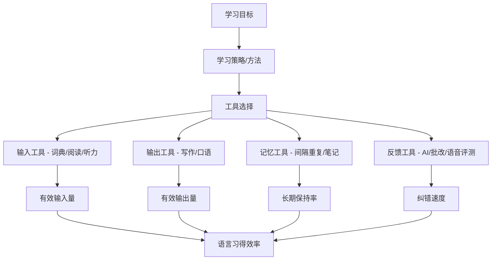
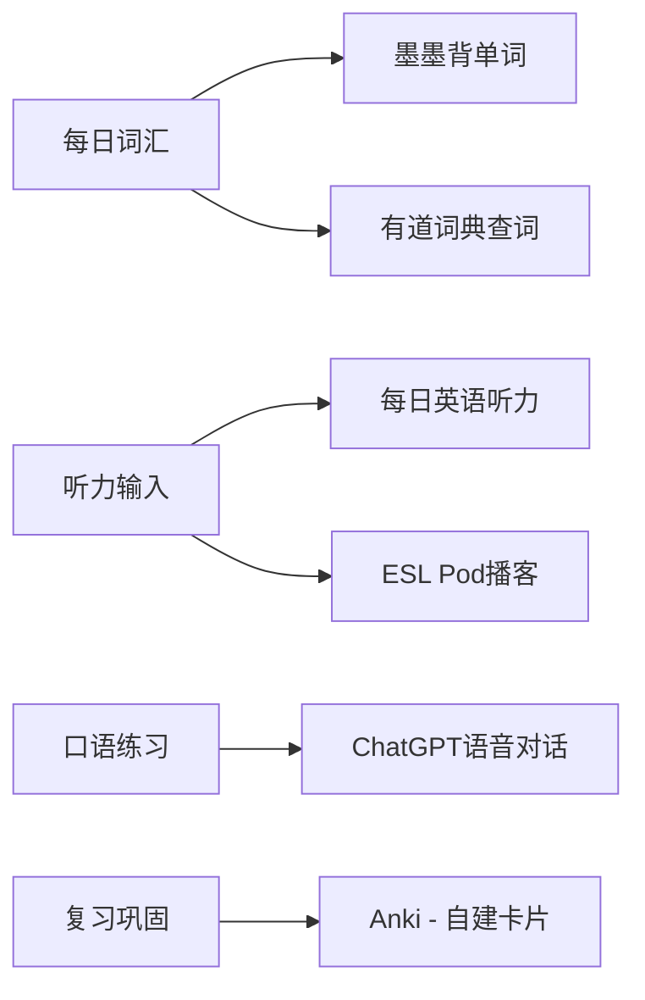

## 四、学习工具推荐

语言学习工具不是"用了就能学好"的魔法棒，而是放大器——放大你的学习效率，也可能放大你的错误习惯。本节的核心目标是帮助你建立**工具选择的决策框架**，再逐类推荐经过验证的优质工具。

### 4.1 工具选择的认知框架

#### 4.1.1 工具的角色定位

在语言学习的"道法术器"体系中，工具属于"器"的层面。工具本身不会替代你的学习过程，但它决定了你每小时能获取多少有效输入（comprehensible input）、能产生多少有效输出（pushed output）、以及反馈循环的延迟有多短。

#### 4.1.2 工具选择的三条原则

**原则一：匹配当前阶段**

初学者、中级学习者、高级学习者需要的工具完全不同。初学者需要一个好用的双语词典和一个基础词汇APP；中级学习者需要英英词典、阅读辅助工具和口语练习平台；高级学习者需要母语级语料库、学术写作工具和深度文化资源。很多人犯的错误是：初级阶段就上高级工具（比如直接用Merriam-Webster英英词典查词，结果每个释义里又有3个不认识的词），或者高级阶段还停留在初级工具（比如都CET-6了还在用有道词典看中文释义）。

**原则二：工具数量最小化**

心理学中的"选择过载"（Choice Overload）效应在语言学习工具选择上表现得尤为明显。工具太多会导致：每次学习前花时间纠结用哪个、数据分散在多个平台无法整合、学习习惯碎片化难以坚持。建议每个功能类别只保留1-2个主力工具，总计不超过6-8个。

**原则三：数据可迁移性优先**

优先选择支持数据导出的工具。你今天在某个APP里积累的词汇本、笔记、学习记录，如果不能导出，就意味着你被这个平台锁定了。选择支持CSV/JSON导出、或基于开放格式（如Markdown）的工具，让你的学习数据始终掌握在自己手中。

#### 4.1.3 工具组合的典型模式

| 学习者类型 | 核心工具组合 | 工具数量 | 特点 |
|:---|:---|:---:|:---|
| 零基础入门者 | 双语词典 + 词汇APP + 基础课程APP | 3 | 简单直接，降低决策负担 |
| 初级进阶者 | 双语词典 + Anki + 阅读APP + 语法APP | 4 | 引入间隔重复，开始阅读输入 |
| 中级突破者 | 英英词典 + Anki + 浏览器插件 + AI对话工具 | 4 | 英英思维转换，开始沉浸式输入 |
| 高级精进者 | 语料库 + 学术写作工具 + 母语内容平台 | 3-4 | 接近母语者的信息获取方式 |
| 应试备考者 | 词典 + 真题库 + 错题本工具 + 模考平台 | 4 | 目标明确，工具围绕考试设计 |

### 4.2 词典工具

词典是语言学习者最基本的工具，但"怎么查词典"这件事本身就值得专门学习。查词典不是找到中文翻译就结束，而是一个完整的认知过程：看音标、看词性、看英文释义、看例句、看搭配、看词源。

#### 4.2.1 双语词典

**有道词典**

有道词典是国内用户量最大的词典工具，核心优势是词库覆盖面广、响应速度快、支持离线使用。

- **适用阶段**：零基础到中级学习者
- **核心功能**：英汉/汉英查询、离线词典包、单词本同步、每日一句推送
- **使用建议**：在初级阶段使用有道词典完全没有问题，但要注意逐步过渡。当你的词汇量超过4000（大约CET-4水平）之后，建议开始尝试用英英释义理解单词，减少对中文翻译的依赖。具体做法：在有道词典的设置中开启"英英释义优先显示"，先看英文解释，看不懂再看中文。
- **注意事项**：有道词典的中文释义有时过于笼统，特别是对于一词多义的单词。比如"run"有几十个义项，有道可能把所有中文翻译堆在一起，让你误以为这些义项之间没有区别。

**欧路词典**

欧路词典相比有道词典的核心优势在于**支持自定义词库导入**。你可以把MDX格式的专业词典（如柯林斯、牛津高阶、朗文等的MDX版本）导入欧路，实现一个APP内多词典联合查询。

- **适用阶段**：所有阶段，特别是需要多词典对比查询的学习者
- **核心功能**：MDX词库导入、多词典联合查询、划词取词、生词本同步
- **使用建议**：导入2-3本权威词典（推荐朗文+柯林斯+韦氏的组合），查询时同时查看多本词典的释义和例句。这种"交叉验证"式的查词方式能帮你更准确地理解单词的使用场景和语义边界。
- **高级用法**：欧路词典支持Anki联动，可以将生词本直接导出为Anki卡片格式，省去手动制卡的时间。

**DeepL翻译**

DeepL不是传统词典，而是翻译工具，但在语言学习中它有独特价值。当你遇到一整句话或一段话看不懂时，逐词查词典太慢，DeepL的翻译质量目前在主流翻译工具中排名第一。

- **适用阶段**：所有阶段
- **核心功能**：高质量神经网络翻译、支持文档翻译、API接口
- **使用建议**：不要把DeepL当拐杖用。正确的用法是：先自己尝试理解，遇到实在看不懂的再用DeepL翻译，然后对比自己的理解和翻译结果，找出差距。这种"先猜后验证"的过程本身就是有效的学习。

#### 4.2.2 英英词典

从双语词典过渡到英英词典，是语言学习中最重要的认知转变之一。双语词典本质上是在做"符号替换"（英文符号→中文符号），而英英词典强迫你用英语理解英语，建立的是真正的"英语思维"。

**朗文当代高级英语词典（Longman Dictionary of Contemporary English, LDOCE）**

朗文词典是中级学习者过渡到英英词典的最佳选择，原因在于它的释义词汇量限制在2000个常用词以内。这意味着只要你掌握了最基础的2000个英语词汇，就能读懂朗文的任何一条释义。

- **适用阶段**：词汇量3000+的中级学习者
- **核心功能**：2000词释义词汇、丰富的例句（来自语料库）、词频标注（标注了最常用的3000词和学术词汇）、搭配信息、用法说明专栏
- **使用建议**：重点关注三样东西——英文释义本身（理解单词的精确含义）、例句（理解单词的实际用法）、搭配栏（知道哪些词经常和它一起出现）。朗文的"Language Activator"功能是同义词辨析的利器，写作时不确定用哪个近义词，查一下Activator就能明白它们之间的细微差别。

**柯林斯COBUILD高级英语词典（Collins COBUILD）**

柯林斯词典的独特之处在于它的释义方式——用完整的句子来解释单词，而不是传统的短语释义。比如解释"reluctant"时，传统词典写"不情愿的"，柯林斯写"If you are reluctant to do something, you are unwilling to do it and hesitate before doing it." 这种句子式释义给你提供了大量真实语境。

- **适用阶段**：词汇量4000+的学习者
- **核心功能**：句子式释义、词频星级标注（从一星到五星，直观显示常用程度）、丰富的语料库例句、语法模式标注
- **使用建议**：柯林斯的词频星级系统非常实用。英语中约有15万个常用词，但日常交流只需要5000-6000个。通过星级标注，你可以快速判断一个词值不值得花时间深入学习。

**Merriam-Webster韦氏词典**

韦氏词典是美国最权威的词典，相当于美国的"新华字典"。它的释义精准、词源信息丰富、同义词辨析深入，但释义用词难度较高，不适合初中级学习者直接使用。

- **适用阶段**：词汇量8000+的高级学习者
- **核心功能**：权威的美式英语释义、详细的词源（Etymology）、Word of the Day、Thesaurus（同义词词典）
- **使用建议**：韦氏词典最大的价值在于词源信息。很多高级词汇都有拉丁语、希腊语、法语等词源，理解词源能帮你触类旁通地理解一组相关词。比如你查"benevolent"时看到词源是拉丁语"bene"（好）+"volent"（希望），以后遇到"benefit""benediction""benevolent"就都能理解了。

**Cambridge Dictionary剑桥词典**

剑桥词典兼顾英英释义和多种学习功能，是英式英语的权威参考。它的在线版完全免费，且提供英美双发音、CEFR等级标注（A1-C2）和剑桥语料库例句。

- **适用阶段**：所有阶段（有CEFR等级标注，自适应难度）
- **核心功能**：英英+英汉双解、CEFR等级标注、语法专栏、常见错误纠正、Quiz功能
- **使用建议**：剑桥词典的"English Profile"功能特别实用——它按照CEFR等级标注每个单词，你可以通过查看单词的等级来判断自己的掌握是否到位。比如一个B1的词你还不认识，说明你的基础词汇需要补课。

#### 4.2.3 词典使用进阶技巧

**多词典交叉查询法**：同一个单词至少查2本词典。不同词典的侧重点不同——朗文的例句丰富，柯林斯的句子式释义帮助理解语境，韦氏的词源信息帮助记忆。交叉查询后，你对一个单词的理解会比只查一本词典深3-5倍。

**词块查词法**：不要只查单个单词，要查词组和搭配。比如学习"make"这个词时，不要只看"make = 做/制造"，而要查"make a decision/make sense/make up for/make it"这些词组，因为这些词组才是真实使用中的基本单位。

**建立个人词典**：用Notion或Obsidian建立自己的词典扩展版——每学一个新词，记录词典释义之外的个人理解、联想、例句、搭配和个人造句。这不是浪费时间，而是把被动知识转化为主动知识的过程。

### 4.3 间隔重复与记忆工具

间隔重复（Spaced Repetition）是语言学习中被科学验证最充分的记忆技术。其核心原理来自Ebbinghaus遗忘曲线：记忆在学习后会按照指数衰减规律遗忘，但如果在即将遗忘时进行复习，记忆保持的时间会延长。间隔重复系统（SRS）通过算法自动安排复习时间，确保你在最需要的时候复习每个知识点。

#### 4.3.1 Anki

Anki是间隔重复领域的"瑞士军刀"，功能最强大、社区最活跃、数据完全开源。它的名字来自日语"暗記"（记忆），最初就是为语言学习设计的。

**核心优势**：
- **FSRS算法**（2024年后版本默认启用）：比传统SM-2算法更精准，根据你的实际遗忘率动态调整复习间隔，减少30-50%的无效复习
- **完全可定制**：卡片格式、复习参数、学习步骤全部可以调整
- **跨平台同步**：Windows/Mac/Linux/iOS/Android全覆盖，通过AnkiWeb同步
- **插件生态**：2000+插件扩展功能，从语音合成到图片遮罩应有尽有
- **社区牌组**：共享牌组库中有大量高质量的预制牌组，省去制卡时间

**使用建议**：

1. **自己做卡比用现成牌组好**。做卡片的过程本身就是学习（生成效应，Generation Effect）。但如果你时间有限，可以先用社区牌组，再逐步替换成自己做的卡片。
2. **卡片设计遵循最小信息原则**。一张卡片只考一个知识点。"apple = 苹果"是一张好卡片，"apple = 苹果，是水果，红色，很甜"就是一张坏卡片——因为你可能认识"苹果"但不知道它是什么颜色，这时候整张卡片就无法评价。
3. **添加上下文**。卡片正面除了单词本身，最好加一个使用该词的例句（挖空该词）。纯单词→中文翻译的卡片只能训练"再认"能力，而带上下文的挖空卡片能训练你在真实语境中的理解能力。
4. **控制每日新卡数量**。建议每天新卡不超过20-30张。新卡太多会导致复习量暴增（Anki的复习量和新卡数是指数关系），最终因为复习压力过大而放弃。

**Anki的致命弱点**：界面丑陋、学习曲线陡峭、移动端收费（iOS版本$24.99）。如果你对技术不太熟悉，可以考虑下面的替代工具。

#### 4.3.2 墨墨背单词

墨墨背单词是国内做得最好的词汇记忆APP，核心卖点是它自研的记忆算法和简洁的界面设计。

- **适用场景**：备考各种英语考试（四六级、考研、雅思、托福、GRE等）
- **核心优势**：内置了几乎所有主流考试的词汇书、记忆曲线可视化、抗遗忘策略自动化
- **付费模式**：免费版有词汇上限（600个），解锁全部功能需要购买词汇上限，价格根据需求量不同从几十到上百元不等
- **使用建议**：墨墨的优势在于"开箱即用"——选一本词汇书，设置每日学习量，跟着系统走就行。适合不想折腾Anki但又想要间隔重复效果的学习者。

#### 4.3.3 Quizlet

Quizlet是一个通用的闪卡学习平台，社区内容极其丰富，支持多种学习模式（闪卡、学习、拼写、测试、匹配游戏等）。

- **适用场景**：初学者、喜欢游戏化学习方式的学习者
- **核心优势**：界面美观、社区牌组海量、支持多人协作学习、有Live多人对战模式
- **使用建议**：Quizlet的间隔重复功能不如Anki强大（其算法相对简单），但它的游戏化设计和社交功能能提高学习动力。适合在学习初期建立习惯的阶段使用，后期可以迁移到Anki。

### 4.4 阅读辅助工具

阅读是语言输入量最大的渠道。对于中高级学习者来说，大量阅读（Extensive Reading）是提升语言能力最有效的方法之一。阅读辅助工具的核心价值在于**降低阅读阻力**——让你能流畅地阅读英文内容，而不是每隔30秒就停下来查词典。

#### 4.4.1 浏览器插件

**Language Reactor**

Language Reactor是目前最强大的视频学习辅助工具，原名"Language Learning with Netflix"。它能在Netflix和YouTube视频上叠加双语字幕，让你在看视频的同时学习语言。

- **核心功能**：
  - Netflix/YouTube双语字幕同步显示
  - 点击任意单词查看释义（弹出词典）
  - 自动暂停模式：每句台词后自动暂停，适合精听
  - 台词导出：将所有字幕导出为文本，用于复盘
  - 机器对话功能：基于视频内容生成对话练习
- **使用建议**：不要开双语字幕当"拐杖"用。推荐的学习顺序是：第一遍不开字幕纯听→第二遍开英文字幕→第三遍开双语字幕确认理解→第四遍不开字幕重复跟读。每一遍都有明确的学习目标。

**沉浸式翻译（Immersive Translate）**

沉浸式翻译是一个网页双语翻译插件，核心价值在于让你能阅读任何英文网页而不被生词卡住。

- **核心功能**：
  - 网页双语对照翻译（保留原文，翻译显示在下方）
  - 支持多种翻译引擎（DeepL、Google、OpenAI、Claude等）
  - PDF翻译、电子书翻译（EPUB格式）
  - YouTube字幕翻译
  - 鼠标悬停翻译段落
- **使用建议**：沉浸式翻译最大的价值不是让你"看懂英文网页"，而是让你在**可理解输入区间**（i+1）内阅读。建议只在遇到大量生词的网页时使用，对于你能读懂70-80%的内容，关掉翻译效果更好。

**沙拉查词（Saladict）**

沙拉查词是一个聚合词典划词翻译插件，核心优势在于**一次划词同时查询多本词典**。

- **核心功能**：
  - 划词/双击/快捷键取词
  - 同时查询多个在线词典（可以自定义词典列表）
  - 支持PDF划词（通过沙拉查词的独立PDF阅读器）
  - 生词本功能，支持导出到Anki
  - 词根词缀分析
- **使用建议**：在沙拉查词的设置中添加3-5本你常用的词典（推荐朗文+柯林斯+剑桥+有道的组合），这样每次查词都能同时获得多角度的释义信息。生词本功能可以设置自动同步到Anki，实现"阅读中遇到→一键收藏→自动生成Anki卡片→间隔复习"的完整流程。

**Readlang**

Readlang是一个专为语言学习者设计的网页阅读辅助工具。核心体验是：在任何网页上点击一个单词，就能看到翻译并自动收藏到生词本。

- **核心功能**：点击即翻译、自动收集生词、支持将阅读内容转为学习材料、词频分析
- **使用建议**：Readlang的最大优势在于其**阅读量追踪**功能——它会记录你的阅读词汇量增长曲线，让你直观看到进步。

#### 4.4.2 电子阅读器辅助

**Kindle词典联动**

Kindle阅读器内置了多语种词典，阅读英文原著时长按单词即可查看释义，且自动将查过的单词收集到"Vocabulary Builder"中。这个功能被严重低估了——它本质上是一个"在真实阅读中自动收集生词"的系统。

- **使用建议**：
  1. 选择难度适中的英文原著（每页生词不超过5个）
  2. 将默认词典设置为英英词典（Kindle支持下载第三方词典）
  3. 阅读时只查影响理解的关键词，不查所有生词
  4. 每周打开Vocabulary Builder复习一次查过的词
  5. 推荐Kindle词典：*Oxford Dictionary of English*或*Merriam-Webster*

### 4.5 听力与口语练习工具

听力和口语是语言学习中"最需要反馈"的技能——你需要知道自己听错了什么、说错了什么才能改进。传统学习方式中，这种反馈只能来自老师或母语者，但AI技术已经改变了这一格局。

#### 4.5.1 听力练习工具

**每日英语听力（DeDao）**

每日英语听力是国内最全的英语听力资源平台，内容从VOA慢速到TED演讲到BBC纪录片全覆盖。

- **核心功能**：海量听力资源、逐句精听模式、语速调节（0.5x-2.0x）、AB复读、听力文本对照
- **使用建议**：精听时使用"逐句模式"——每句话先听3遍尝试听写，再看文本核对，标记听错的部分，最后跟读。这种"听写→核对→跟读"的三步法是听力提升最有效的方法。

**Podcasts（播客）**

播客是沉浸式听力输入的极佳来源，推荐以下分层列表：

| 水平 | 推荐播客 | 特点 |
|:---|:---|:---|
| 初级 | ESL Pod、BBC Learning English | 语速慢、词汇简单、有讲解 |
| 中级 | 6 Minute English (BBC)、All Ears English | 正常语速、日常话题 |
| 中高级 | TED Talks Daily、Freakonomics Radio | 学术/商业话题、真实语速 |
| 高级 | This American Life、Hardcore History | 长篇叙事、俚语、文化背景 |

**使用建议**：不要只"听"播客，要"用"播客。具体方法：选择一个5-10分钟的片段→第一遍纯听理解大意→第二遍跟读模仿语音语调→第三遍摘抄好词好句→第四遍用自己的话复述内容。一个5分钟的片段用这种方式学习，效果远超泛听1小时。

#### 4.5.2 口语练习工具

**AI对话工具（ChatGPT / Claude / Gemini）**

AI对话工具是口语练习的革命性工具。它解决了语言学习中最大的痛点：没有对话伙伴。你可以随时随地用任何语言和AI对话，它不会嫌你烦、不会嘲笑你的错误、不会因为你说得慢就不耐烦。

**具体使用方法**：

1. **角色扮演对话**：给AI设定一个具体场景（在餐厅点餐、在机场问路、和同事讨论项目），让它扮演对话另一方。这种场景化练习比随机聊天有效得多。
2. **语音输入模式**：使用ChatGPT或Gemini的语音模式，用语音而非文字进行对话。这能同时训练你的口语流利度和听力理解能力。
3. **语法纠正请求**：对话结束后，让AI总结你在对话中犯的语法错误，并给出正确的表达方式。提示词示例："Please list all the grammar mistakes I made in our conversation, explain why they're wrong, and give me the correct versions."
4. **难度调节**：明确告诉AI你的水平（"I'm an intermediate English learner, please use simple vocabulary and speak slowly"），它会自动调整输出难度。

**ELSA Speak**

ELSA Speak是一款基于AI语音识别的发音训练APP，它能精确分析你的每个音素的发音准确度。

- **核心功能**：AI发音评分（精确到音素级别）、个性化发音课程、口腔肌肉运动指导
- **适用场景**：纠正特定发音问题（如中国人常见的th/v/l/r音区分）
- **使用建议**：ELSA的核心价值在于**精确反馈**——它能告诉你具体是哪个音素发得不对，以及舌位/口型应该怎么调整。但要注意：ELSA的评分是基于"接近母语发音"的标准，不必追求100%准确，能达到85%以上就足以正常交流了。

**Tandem / HelloTalk**

Tandem和HelloTalk是语言交换社交平台，连接全球语言学习者，让母语者互相帮助学习对方的语言。

- **核心功能**：文字/语音消息交流、纠错功能（对方可以标记你的错误）、视频通话、语言伙伴匹配
- **使用建议**：在这些平台上，"互助"是关键——你帮对方学中文，对方帮你学英文。选择一个语言伙伴后，建议建立固定的交流习惯（比如每周三次语音通话，每次30分钟），而不是随机闲聊。质量比数量重要。

### 4.6 写作辅助工具

写作是语言输出的最高形式，也是最需要反馈的技能。写作辅助工具的核心价值在于提供**即时反馈**——不用等老师批改，写完就能看到问题。

#### 4.6.1 语法与风格检查

**Grammarly**

Grammarly是目前最成熟的英语写作辅助工具，能实时检测拼写、语法、标点和风格问题。

- **免费版功能**：基础语法检查、拼写检查、标点检查
- **付费版（Premium）功能**：高级语法建议、风格优化建议、词汇增强建议、抄袭检测、语调检测
- **使用建议**：不要把Grammarly当成"自动纠错机"用——看到红线就点"Accept"。正确的用法是：先看Grammarly指出的问题类型（是语法错误？还是风格建议？），理解为什么这是个问题，然后自己修改。这样每次使用Grammarly都是一次学习机会。
- **局限性**：Grammarly对语法的检测很准确，但对"是否地道"的判断有时不够准确。它可能会建议你把一个地道但少见的表达改成一个常见但平庸的表达。这种时候要相信自己的语感。

**QuillBot**

QuillBot的核心功能是**改写（Paraphrase）**——输入一个句子，它会用不同的表达方式重写，同时保持原意。这对英语写作学习非常有价值。

- **核心功能**：多种改写模式（标准、流畅、正式、简洁、扩展等）、语法检查、摘要生成、引用生成
- **使用建议**：当你写出一个句子但觉得不够好时，输入QuillBot看看它的改写版本。对比差异，思考它为什么改了那个地方。这是提升写作水平的极佳方法。但绝对不要把QuillBot当成代写工具——让AI替你写作业不会让你学到任何东西。

#### 4.6.2 学术写作工具

**Writefull**

Writefull是专为学术写作设计的AI辅助工具，它基于大量学术论文语料库训练，能给出符合学术写作规范的建议。

- **核心功能**：学术用语建议、标题和摘要生成、语法和风格检查（学术语境特化）、语言质量评分
- **适用场景**：撰写英文论文、期刊投稿、学术报告

**Ludwig.guru**

Ludwig是一个英语句子搜索引擎——输入一个句子或短语，它会从学术论文、权威媒体、官方文件中找到真实使用该表达的例句。

- **核心功能**：句子级语料库搜索、同义句对比、语法模式确认
- **使用建议**：写作时不确定某个表达是否正确，把你的句子输入Ludwig搜索。如果有大量权威来源使用了相似表达，说明你的用法是正确的；如果搜索结果寥寥无几，可能需要换一种说法。

### 4.7 笔记与知识管理工具

语言学习是长期积累的过程，笔记系统决定了你的学习成果能否沉淀、能否被复习、能否被整合。一个好的笔记系统不仅记录知识点，还要建立知识点之间的关联。

#### 4.7.1 Obsidian

Obsidian是基于Markdown的本地知识管理工具，它的核心理念是**双向链接**——每条笔记都可以链接到其他笔记，形成一个知识网络。

**在语言学习中的应用**：

1. **词汇网络**：每个单词一条笔记，记录释义、例句、搭配、词根、同义词、反义词。通过双向链接，相关词汇之间形成网络。比如"abundant"链接到"plentiful""scarce"（反义词）、"abundance"（名词形式）。
2. **语法知识库**：每个语法点一条笔记，链接到使用该语法的例句、常犯错误、相关语法点。比如"虚拟语气"链接到"if条件句""wish+过去式""suggest+should"等子知识点。
3. **阅读笔记**：每本书/每篇文章一条笔记，摘抄好词好句，链接到词汇笔记和语法笔记。

**使用建议**：Obsidian的学习曲线比较陡峭，不适合技术小白。如果你愿意花时间学习，它的回报是巨大的——一个运营了半年以上的Obsidian知识库，会成为你独一无二的"语言大脑"。

#### 4.7.2 Notion

Notion是一个全能型工作空间，特点是模板丰富、协作方便、界面美观。

**在语言学习中的应用**：

1. **学习计划表**：用Database功能创建学习任务管理表，设置每日/每周学习目标
2. **词汇表**：用Database创建结构化词汇表，字段包括单词、释义、例句、掌握程度、复习日期
3. **学习日志**：每天记录学习内容和时间，月末统计学习数据
4. **资源收集**：收藏好文章、好视频、好课程

**使用建议**：Notion的优势在于"开箱即用"——不需要学习任何技术知识，拖拽操作就能创建复杂的表格和页面。缺点是数据存储在云端，导出格式有限。

#### 4.7.3 Anki的笔记功能

Anki不仅是闪卡工具，也可以作为笔记工具使用。每张卡片背面可以包含大量注释信息，复习时自然就能看到。

- **使用建议**：在Anki卡片的"Extra"字段中添加额外信息——词源故事、记忆技巧、相关例句、个人联想。这些信息会随着你的复习周期定期出现，帮助你从多个维度巩固记忆。

### 4.8 AI学习工具深度指南

AI工具正在重塑语言学习的方式。2024年以后，AI已经从"辅助工具"升级为"学习伙伴"——它能陪你对话、帮你改作文、为你解释语法、给你生成练习题。但AI工具也有明显的局限性，需要正确使用。

#### 4.8.1 ChatGPT

ChatGPT是目前功能最全面的AI语言学习工具。它的对话能力让你可以把它当作一个随叫随到的语言伙伴。

**最佳使用场景**：

1. **语法解释**：遇到不懂的语法点，让ChatGPT用简单易懂的语言解释，并给出多个例句。提示词："Explain the difference between 'used to' and 'would' for past habits, with 5 example sentences for each."
2. **作文批改**：把你的英文作文发给ChatGPT，让它从语法、词汇、逻辑、风格四个维度给出反馈。提示词："Please review my essay. Check for grammar errors, suggest better vocabulary, evaluate the logical flow, and comment on the writing style."
3. **语境化学习**：让ChatGPT根据你的水平和兴趣生成学习材料。提示词："Create a short story (200 words) at B1 level about a detective solving a mystery. Use the past tense frequently."
4. **发音规则总结**：让ChatGPT总结特定发音规则。提示词："List all common English words where the letter 'c' is pronounced as /s/ instead of /k/, grouped by pattern."

**局限性**：
- 不适合做发音训练（它没有语音识别能力到音素级别）
- 语法建议偶尔有误（特别是涉及微妙的语用差异时）
- 不适合替代系统的语法学习（它的回答是碎片化的，不会给你一个完整的语法体系）

#### 4.8.2 Claude

Claude在语言学习方面的一个突出优势是**长文本处理能力**——你可以把一整篇文章甚至一整本书发给它分析。

**最佳使用场景**：
1. **文章分析**：发一篇英文文章，让Claude分析其中的高级词汇、复杂句型、修辞手法
2. **对比写作**：把你的作文和一篇范文一起发给Claude，让它详细分析差距在哪里
3. **文化背景解释**：阅读中遇到不理解的文化梗、典故、习语，让Claude解释其来源和含义

#### 4.8.3 语音合成工具

**Speechify / Natural Reader / Edge大声朗读**

语音合成工具能将任何文字转换为自然语音，用于听力训练。

- **使用方法**：把阅读材料用TTS工具朗读出来，边听边看文本，训练"听觉词汇"
- **进阶用法**：先只听不看文本，尝试听写；然后对比文本核对。这种"听写训练"对听力提升效果极佳
- **选择建议**：目前质量最高的免费TTS是Microsoft Edge浏览器内置的"大声朗读"功能，支持多种口音（美式、英式、澳式），语速可调

#### 4.8.4 AI工具使用注意事项

**不要过度依赖AI**。AI工具最大的风险是让你产生"我在学习"的错觉——和ChatGPT聊了一小时感觉很充实，但实际上你的语言能力并没有实质性提高。AI对话的舒适区是"你打字它回复"，但这回避了语言学习中最困难的部分：实时口语反应、听力理解、发音训练。

**正确使用AI的三七原则**：AI辅助时间占30%（用AI改作文、解释语法、生成练习），自主练习时间占70%（自己阅读、自己写作、自己对话练习）。如果反过来，你的AI使用就过度了。

**验证AI的输出**。AI会犯错，特别是在语法解释的细微之处和文化背景的准确性上。把AI给出的语法建议当作"参考"而非"真理"，重要知识点还是需要查阅权威语法书确认。

### 4.9 发音训练工具

发音是很多中国英语学习者的"最后一公里"问题。发音训练工具的核心价值在于提供**视觉化反馈**——让你"看到"自己的发音和目标发音之间的差异。

**Forvo**

Forvo是全球最大的发音词典，收录了来自母语者的真实发音。你可以搜索任何单词，听到来自不同国家母语者的发音版本。

- **使用建议**：当你要学一个新单词的发音时，在Forvo上听2-3个不同母语者的版本，注意他们之间的共性和差异。如果某个音你一直发不准，反复听Forvo上母语者的发音，然后录音对比。

**ELSA Speak**（已在口语工具部分介绍）

**YouGlish**

YouGlish是一个基于YouTube的发音搜索工具——输入一个单词或短语，它会从YouTube视频中找到包含该表达的片段，让你听到母语者在真实语境中的发音。

- **使用建议**：YouGlish的价值在于"真实语境中的发音"——词典里的发音是孤立的、刻意的，而YouGlish给你的是自然语境中的真实发音。特别适合学习连读、弱读、吞音等自然语流现象。

### 4.10 工具组合实操方案

理论讲完了，下面给出几个具体可执行的工具组合方案。

#### 4.10.1 零基础到CET-4（约0→4500词汇量）

**每日工具使用流程**（约60分钟）：
1. 墨墨背单词：20分钟（每天新词15个+复习）
2. 每日英语听力：20分钟（精听1-2个短文）
3. ChatGPT语音对话：15分钟（练习基础对话）
4. Anki复习：5分钟（复习自己收集的生词）

#### 4.10.2 CET-4到CET-6/雅思6.5（约4500→8000词汇量）

**每日工具使用流程**（约90分钟）：
1. Anki复习：15分钟（已有卡片复习）
2. 英文阅读（用沉浸式翻译辅助）：30分钟
3. 英英词典查词（欧路+朗文）：在阅读中随查
4. 写作练习（Grammarly检查）：20分钟
5. 口语对话（ChatGPT语音模式）：15分钟
6. 听力（播客/YouTube+Language Reactor）：10分钟

#### 4.10.3 雅思7+到接近母语（8000+词汇量）

**每日工具使用流程**（约60分钟）：
1. 英文原著阅读（Kindle+英英词典）：30分钟
2. 写作（Writefull学术写作辅助）：15分钟
3. 口语（Tandem语言交换伙伴）：15分钟

### 4.11 常见工具使用误区

**误区一：收藏=学会**

收藏了一堆工具、保存了一堆资源，但从未真正使用过。工具的价值在于使用，不在于收藏。一个你每天都在用的有道词典，比你收藏了但从未打开过的朗文词典有用一万倍。

**误区二：工具越多越好**

同时使用8个APP，每个都浅尝辄止。结果是：数据分散、习惯碎片化、无法形成正反馈循环。精简工具，深度使用，比广撒网有效得多。

**误区三：只用舒适区工具**

永远只用双语词典、永远只看带字幕的视频、永远只做选择题。语言学习的本质是**走出舒适区**，工具应该是帮你更高效地走出舒适区的手段，而不是让你停留在舒适区的温床。

**误区四：过度追求"最佳工具"**

花了两周时间对比各种词典APP的优劣，最终选了一个，用了三天又开始对比。工具选择的"80/20法则"：大部分主流工具的功能差异不超过20%，但你花在选择工具上的时间可能是100%。快速选一个主流工具，立刻开始学习，比反复对比有效得多。

**误区五：忽视数据备份**

你在某个APP里积累了三年的词汇本、笔记、学习记录，然后这个APP下架了/涨价了/跑路了。所有积累一夜归零。**定期导出你的学习数据**，这是使用任何工具的前提条件。

### 4.12 本节小结

| 工具类别 | 核心推荐 | 替代方案 | 选一个就够 |
|:---|:---|:---|:---:|
| 双语词典 | 欧路词典（可导入MDX） | 有道词典 | ✓ |
| 英英词典 | 朗文（中级）/韦氏（高级） | 剑桥/柯林斯 | ✓ |
| 间隔重复 | Anki | 墨墨背单词/Quizlet | ✓ |
| 阅读辅助 | 沉浸式翻译 | Language Reactor | ✓ |
| 划词查词 | 沙拉查词 | Readlang | ✓ |
| 听力练习 | 每日英语听力 | Podcasts | ✓ |
| 口语练习 | ChatGPT语音模式 | Tandem/ELSA | ✓ |
| 写作辅助 | Grammarly | QuillBot | ✓ |
| 笔记管理 | Obsidian/Notion | Anki笔记功能 | ✓ |
| 发音训练 | Forvo + ELSA | YouGlish | ✓ |

**核心原则回顾**：

1. 工具是放大器，不是替代品——它放大你的努力，但不会替代你的努力
2. 匹配阶段选择工具，不要跨级使用
3. 每类工具只保留1-2个，总数不超过6-8个
4. 优先选择数据可导出的工具
5. 三七原则：AI辅助30%，自主练习70%

选择好工具后，最重要的事情是：**开始使用，持续使用，深度使用**。再好的工具吃灰了也是废物，再普通的工具用到极致也是神器。
