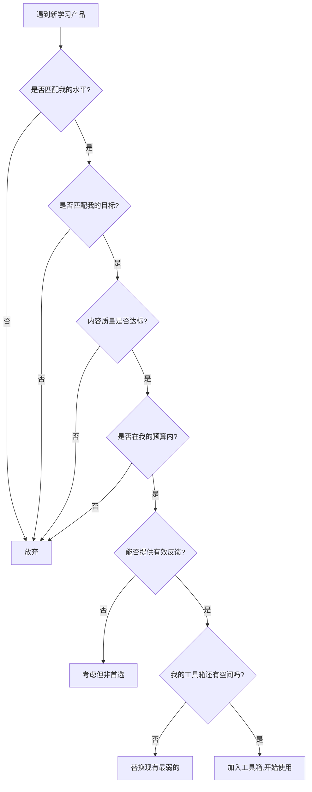

## 七、选择学习产品的原则

前面六节推荐了大量学习产品——书籍、APP、课程、工具、网站、设备。面对琳琅满目的选择，很多学习者陷入两个极端：要么什么都不选，停留在"等我找到最好的那个再开始"的无限拖延中；要么什么都下载，手机里装了十几个学习APP却没有一个真正用透。本节的目的，是给你一套可以反复使用的筛选框架，让你在未来面对任何学习产品时，都能在5分钟内做出理性判断。

### 7.1 匹配原则：找到属于你的那个

匹配原则是选择学习产品的第一原则，也是最容易被忽视的原则。大多数人的选择逻辑是"别人推荐什么我用什么"，但学习效果的决定因素不是产品本身的质量，而是产品与学习者之间的契合度。

#### 7.1.1 水平匹配：难度阶梯理论

语言学习领域有一个被广泛验证的理论——克拉申（Stephen Krashen）的"i+1输入假说"。这个理论认为，有效的语言输入应该略高于学习者当前的水平（i代表当前水平，+1代表略高于当前的可理解输入）。太难的材料会产生焦虑和挫败感，太简单的材料则无法触发认知加工，两者都无法带来实质性的进步。

水平匹配的操作方法：

| 当前水平 | 适配产品特征 | 举例 |
|---------|------------|------|
| 零基础（A1） | 有母语解说、有图示、节奏慢、词汇量控制在500以内 | Duolingo入门课程、《新概念英语》第一册、BBC Learning English的"6 Minute English" |
| 初级（A2） | 双语对照、语法有系统讲解、附带练习 | 多邻国中阶、每日英语听力的VOA慢速、EnglishPod初级 |
| 中级（B1-B2） | 以目标语言为主、有分级标注、附带语境解释 | TED-Ed动画、《经济学人》Espresso、播客All Ears English |
| 高级（C1-C2） | 全目标语言、原始语速、无删减内容 | 原版小说、CNN/BBC新闻原速、学术论文、Podcast访谈原声 |

实际操作建议：很多产品提供分级测试（如多邻国的入学测试、EF SET免费水平测试），先做一次标准化测试确定自己的CEFR等级（A1到C2），再按照上面的表格匹配产品。不要凭感觉判断自己的水平——研究表明，自评水平与实际水平的偏差平均达到一个半级别，中级学习者尤其容易高估自己。

#### 7.1.2 目标匹配：终点决定路径

不同的学习目标需要完全不同的资源配置。这里区分四种典型目标场景：

**场景一：应试备考（高考/四六级/考研/雅思/托福/GRE）**

考试是最容易选错产品的场景。很多备考者下载了大量"英语学习APP"来准备考试，这是典型的弯路。应试备考应选择"以考试大纲为核心"的产品——真题集、模拟题、考试专用词汇书。通用型英语学习APP的效率远低于针对性备考材料。

具体原则：
- 词汇：选择与考试大纲匹配的词汇书/APP，而非通用词汇APP。四级备考用四级词汇，而非托福词汇。
- 真题：真题是最宝贵的备考资料。优先选择包含近10年真题详解的教材。
- 模考：选择支持计时模拟考试的产品，真实还原考试环境。
- 技巧：选择有明确题型拆解和答题策略的产品，而非泛泛的"提高英语"课程。

**场景二：日常交流（出国旅游/外企工作/社交）**

日常交流场景的核心是"听说"能力。优先选择那些强调口语练习、听力训练、情景对话的产品。语法规则可以暂时放一放，先建立沟通的自信和流利度。

具体原则：
- 选择有语音识别和口语评分功能的产品（如多邻国的发音练习、Speechling的AI发音纠正）。
- 选择基于真实生活场景的课程（如餐厅点餐、机场值机、商务会议）。
- 选择可以与真人对话的平台（如italki、HelloTalk、Tandem），AI对话是次选。

**场景三：学术研究（论文阅读/学术写作/学术会议）**

学术场景需要高度专业化的词汇和表达。通用英语学习产品的帮助有限，应该选择专业学术英语（EAP）资源。

具体原则：
- 阅读：直接从本领域的英文论文开始，用词典辅助阅读，不要等"学好英语再读论文"。
- 写作：选择有学术写作模板和润色功能的工具（如Grammarly Premium、QuillBot、Writefull）。
- 听力：从本领域学术讲座视频入手（如MIT OpenCourseWare、Coursera学术课程），先熟悉学术表达模式。

**场景四：兴趣驱动（看剧/读小说/追星/游戏）**

兴趣驱动的学习是最可持续的，但也最容易"学了个寂寞"——看了100集美剧英语却毫无进步。关键在于产品设计是否将"娱乐"和"学习"做了有效结合。

具体原则：
- 选择有"精听/精读"功能的产品，而非只有泛听/泛读（如Language Reactor浏览器插件可以让Netflix变成学习工具）。
- 选择有学习路径引导的娱乐型产品，而非纯娱乐。
- 设定明确的"娱乐学习比"：每小时娱乐内容中至少有15分钟是"有意识的学习时间"（查词、跟读、复述）。

#### 7.1.3 风格匹配：认知风格的自我诊断

每个人的认知加工方式不同，同样的产品在不同人手里效果差异巨大。以下是五种常见学习风格与产品类型的对应关系：

| 学习风格 | 核心特征 | 最适产品类型 | 应避免的产品 |
|---------|---------|------------|------------|
| 视觉型 | 通过图表、颜色、空间关系记忆 | 思维导图APP、视频课程、图文并茂的教材 | 纯音频课程、长篇文字教材 |
| 听觉型 | 通过声音、节奏、语调学习 | 播客、有声书、歌曲学习、跟读模仿 | 纯文本学习、视觉型APP |
| 动觉型 | 通过身体参与和动手操作学习 | 互动式APP、角色扮演、白板书写、实物对照 | 被动听讲、纯阅读 |
| 阅读/写作型 | 通过文字输入输出学习 | 阅读+笔记APP、写作批改、词汇卡片 | 纯视频课程、游戏化APP |
| 社交型 | 通过与人互动学习 | 语伴平台、小组学习、直播课堂 | 孤立式自学APP |

快速自我诊断方法：回忆你过去学得最好的一次经历——是看书学会的？听讲座学会的？跟人讨论学会的？还是动手实操学会的？那个场景所对应的学习风格就是你的主导风格。大多数人的主导风格和辅助风格各占一个，完全单一风格的人很少。

### 7.2 质量原则：五个维度评估产品质量

匹配度解决的是"适不适合我"的问题，质量原则解决的是"这个产品本身好不好"的问题。以下五个维度构成一个完整的产品质量评估框架。

#### 7.2.1 内容准确性

语言学习产品的核心是内容。内容不准确的产品不仅浪费时间，还会固化错误认知——一旦形成错误的语言习惯，纠正成本是学习成本的3-5倍。

评估方法：
- 随机抽查10个知识点，与权威来源交叉验证（如语法规则对照《薄冰英语语法》或Cambridge Grammar of English）。
- 检查音标标注是否准确（很多国产APP的音标标注有明显错误）。
- 检查例句是否自然地道，而非生硬的中式翻译。
- 查看内容更新时间——过时的内容（如仍在教"thou"这类古英语用法的教材）会误导学习方向。

#### 7.2.2 科学性与教学设计

好的学习产品背后有教育学和认知科学的支撑，而不是简单地堆砌内容。以下特征可以判断一个产品的教学设计是否科学：

**间隔重复（Spaced Repetition）**：是否根据遗忘曲线安排复习节点。这是被认知科学最广泛验证的学习策略之一——Ebbinghaus遗忘曲线表明，新学的内容如果不复习，24小时后遗忘66%，一周后遗忘77%。间隔重复通过在即将遗忘时触发复习，将记忆效率提升300%-400%。Anki类产品是这一原理的最佳实践。

**主动回忆（Active Recall）**：是否鼓励学习者主动提取记忆，而非被动浏览。研究显示，主动回忆的记忆保持率是被动复习的2-3倍。闪卡类产品、填空练习、听写练习都是主动回忆的设计。

**可理解输入+输出驱动**：是否同时提供可理解的输入（听、读）和有反馈的输出（说、写）。纯粹的输入学习（只听不说是很多"哑巴英语"的根源）和纯粹的输出练习（没有足够的输入素材）都无法带来高效进步。

**即时反馈**：是否在学习者犯错时提供即时、具体的纠正。延迟反馈的学习效率是即时反馈的40%-60%。语音识别打分、AI语法纠错、写作即时批改都是即时反馈的实现方式。

#### 7.2.3 用户体验与交互设计

即使内容再好，糟糕的用户体验也会导致用户流失。以下因素直接影响学习的可持续性：

- **启动成本**：从"想学习"到"开始学习"需要几步？需要3步以上的产品会增加心理阻力。Duolonian的成功很大程度上归功于"打开即学"的零启动成本设计。
- **加载速度**：页面/课程加载超过3秒，50%的用户会选择放弃。
- **界面清晰度**：功能是否一目了然，不需要"学习如何使用学习工具"。
- **多设备同步**：是否支持手机、平板、电脑跨设备无缝切换。学习场景不固定的产品容易被打断。
- **通知机制**：是否有智能的推送提醒机制。完全不提醒的产品容易被遗忘，但过度推送的产品会引发反感。理想状态是可自定义频率的温和提醒。

#### 7.2.4 社区与生态

优秀的产品往往有一个活跃的社区。社区的价值在于：

- **问题解答**：遇到困难时可以从社区获取帮助。
- **学习氛围**：看到其他人在坚持学习，自己也更有动力。
- **经验分享**：社区中他人的学习方法和踩坑经验是宝贵的参考。
- **内容更新**：活跃的社区意味着产品在持续迭代，内容不会过时。

判断方法：查看产品是否有活跃的论坛/Discord/QQ群/微信群，用户反馈是否被重视和回应。

#### 7.2.5 口碑验证

不要只看应用商店的评分——很多高评分是刷出来的。更可靠的口碑验证方法：

- 在知乎、Reddit、小红书搜索"XX产品 + 真实评价/使用体验/测评"。
- 查看专业测评博主的深度使用报告（而非广告推广）。
- 问身边正在使用的朋友，要具体的学习数据——"用了多久？英语水平有什么变化？"
- 注意区分"好评"和"有效好评"——"界面很好看"是好评但没有信息量，"用这个APP两个月词汇量从3000涨到5000"才是有效好评。

### 7.3 实用原则：从"拥有"到"使用"的跨越

实用原则的核心思想是：产品的价值不在于拥有它，而在于使用它的频率和深度。

#### 7.3.1 不贪多，做减法

大多数学习者犯的最大错误是"囤积式学习"——下载了十几个APP，收藏了上百个网站，买了十几本书，但每个都浅尝辄止。这种行为的本质是用"收集资源的满足感"替代了"真正学习的痛苦感"。

黄金数字法则：
- **核心工具不超过3个**：一个用于知识输入（课程/书），一个用于巩固练习（APP/工具），一个用于输出反馈（口语/写作工具）。
- **辅助工具不超过2个**：词典、翻译、语法检查等辅助类。
- **总量上限**：同时在用的学习产品不超过5个。超过这个数字，你的注意力碎片化程度会急剧上升，每个产品的使用深度都会不够。

减法操作步骤：
1. 打开手机，列出所有学习类APP。
2. 回顾过去两周的使用记录，标注使用频率。
3. 卸载使用频率低于每周3次的所有APP。
4. 对剩下的APP，检查功能是否有重叠，保留功能最全的那个。
5. 对书架上的学习书籍，只留出当前正在用的1-2本，其余打包收起。

#### 7.3.2 成本效益分析

学习产品的成本不仅是金钱，还包括时间成本和注意力成本。

| 成本维度 | 说明 | 评估方法 |
|---------|------|---------|
| 金钱成本 | 购买/订阅费用 | 计算月均花费，与学习效果的预期做对比 |
| 时间成本 | 学习如何使用产品的时间 | 上手时间超过30分钟的产品值得重新考虑 |
| 注意力成本 | 产品是否分散注意力 | 有社交功能、游戏化过度的产品可能增加注意力消耗 |
| 机会成本 | 使用这个产品意味着不能用另一个 | 如果免费替代品能达到80%的效果，付费的边际收益是否值得 |

免费资源的隐藏成本：很多人认为"免费的就是最好的"，但免费资源往往有隐性成本——没有系统的学习路径（需要自己花时间规划），缺少进度追踪（需要自己记录学习数据），广告干扰（分散注意力），内容质量参差不齐（需要自己筛选）。适度的付费购买的是"系统性"和"省心"，这是免费资源很难提供的。

#### 7.3.3 碎片化与系统化的平衡

现代人的学习时间高度碎片化——通勤10分钟、午休15分钟、睡前20分钟。好的学习产品应该能适应这种碎片化场景，同时不失系统性。

碎片化友好的产品特征：
- 单次学习单元控制在5-15分钟。
- 支持离线使用（地铁上也能学）。
- 有进度保存功能，随时中断随时恢复。
- 无需复杂操作，打开即学。

系统性的保障：
- 有完整的学习路径或课程大纲。
- 有阶段性测试和水平评估。
- 能追踪长期学习数据和进步曲线。

最理想的组合是"碎片时间用APP巩固，整块时间用课程/书系统学习"——前者负责频率，后者负责深度。

### 7.4 持续性原则：习惯心理学的视角

再好的产品，不用起来就是废品。持续性原则关注的是：如何选择那些能让你"持续使用"的产品。

#### 7.4.1 降低启动摩擦

行为科学中的"福格行为模型"（BJ Fogg）指出，一个行为的发生需要三个要素同时满足：动机（想做）、能力（能做）、触发器（提醒做）。好的学习产品通过降低"能力"门槛来提高行为发生的概率。

具体策略：
- **放在手边**：将学习APP放在手机首屏最容易点击的位置，而非藏在文件夹深处。
- **绑定习惯**：将学习与已有习惯绑定。例如"每天早上刷牙后打开多邻国做1个单元"，利用已有的行为惯性带动新行为。
- **最小化启动**：选择"一键开始学习"的产品，而非需要多次点击、选择、加载的产品。

#### 7.4.2 内在激励机制

好的学习产品不是靠外部惩罚（如"不学习就扣积分"）来留住用户，而是激发内在动机。以下特征表明产品具有良好的内在激励机制：

**进步可视化**：能清晰看到自己的进步曲线——词汇量增长图、学习天数统计、能力雷达图。进步可视化将模糊的"感觉学了一些"转化为具体的"词汇量从2000涨到了3500"，这种成就感是坚持学习的核心动力。

**适度挑战**：学习内容的难度既不过于简单（无聊）也不过于困难（挫败），始终处于"心流通道"——略高于当前能力，但通过努力可以完成。优秀的产品通过自适应算法动态调整难度，维持这种微妙的平衡。

**社交连接**：与真人互动（语伴、学习小组、排行榜）产生的社交责任感和归属感，是很多学习者坚持下去的重要原因。但需要注意的是，社交功能是"增强剂"而非"主动力"——真正的动力必须来自内心。

**即时正反馈**：每次完成学习任务后的即时奖励（积分、徽章、鼓励语）能在短期内维持学习热情。但仅靠外部奖励的产品有"奖励衰减"问题——当奖励变得不再新鲜，学习热情也随之消退。因此，最优秀的产品会逐渐将用户的动力从外部奖励引导到内在成就感上。

#### 7.4.3 退出成本与迁移性

一个容易被忽视的因素是：当你想换产品时，你的学习数据能否带走？

- **数据导出**：是否支持导出学习记录、生词本、笔记。Anki在这方面做得最好——它完全开源，数据格式公开，可以自由迁移到任何支持Anki格式的平台。
- **标准格式**：产品使用的是开放标准还是封闭格式。使用开放标准（如CSV、JSON、Markdown）的产品，迁移成本远低于使用私有格式的产品。
- **依赖度评估**：问问自己——如果这个产品明天停止服务，我的学习会受到多大影响？如果答案是"完全无法继续"，说明你过度依赖单一产品了，需要建立备份方案。

### 7.5 反馈原则：闭环决定效果

语言学习是一个需要大量反馈的过程。没有反馈的学习就像在黑暗中射击——你可能打了100发子弹，但不知道有没有一颗命中目标。

#### 7.5.1 反馈的四种层次

| 反馈层次 | 说明 | 产品特征 | 效果等级 |
|---------|------|---------|---------|
| 对错反馈 | 告诉你答案对不对 | 多选题、判断题 | ★★☆☆☆ — 最基础，但信息量太少 |
| 解释反馈 | 告诉你为什么对/为什么错 | 语法解析、错因分析 | ★★★☆☆ — 有学习价值，但仍是被动接受 |
| 对比反馈 | 给出你的版本和正确版本的对比 | AI写作批改、语音对比 | ★★★★☆ — 能看到差距，触发自我修正 |
| 交互反馈 | 由真人或高级AI进行个性化纠正 | 一对一外教、AI口语伙伴 | ★★★★★ — 最高质量，但成本最高 |

选择产品时，优先选择能提供更高层次反馈的产品。如果预算有限，至少要确保有"解释反馈"——单纯的对错判断几乎无法带来学习进步。

#### 7.5.2 输出型产品的优先级

大多数学习者花80%以上的时间在"输入"（听、读）上，只有不到20%花在"输出"（说、写）上。但研究表明，输出练习的学习效率是纯输入的1.5-2倍。原因是输出练习迫使大脑主动检索和组织语言知识，这种"必要难度"（Desirable Difficulty）正是深度学习的触发器。

在选择学习产品时，有意识地提高输出型产品的比重：

- **口语输出**：italki（真人外教）、Speechling（AI发音纠正）、口语侠（AI对话）
- **写作输出**：Grammarly（语法纠错）、Lang-8/Hinative（母语者批改）、AI写作助手
- **综合输出**：多邻国的"造句练习"、Anki的"主动回忆"模式

一个合理的输入输出比建议：初期（A1-A2）输入占70%、输出占30%；中期（B1-B2）输入和输出各占50%；高级（C1以上）输入占40%、输出占60%。

### 7.6 评估决策流程：一张表搞定选择

把前面所有原则整合成一个可操作的评估流程。下次面对一个新的学习产品时，按以下步骤进行：

快速评分表（每个维度1-5分，总分25分，15分以上值得尝试）：

| 评估维度 | 评分标准 | 得分 |
|---------|---------|------|
| 水平匹配 | 1=完全不匹配, 5=完美匹配当前水平 | ___ |
| 目标匹配 | 1=与目标无关, 5=直接服务于目标 | ___ |
| 内容质量 | 1=有明显错误, 5=专业权威 | ___ |
| 反馈机制 | 1=无任何反馈, 5=有个性化交互反馈 | ___ |
| 实用性 | 1=启动成本高/不碎片化, 5=打开即学/碎片化友好 | ___ |

### 7.7 常见决策误区与纠正

#### 误区一：完美主义陷阱

"我还没找到最好的产品，所以先不开始。"

纠正：不存在"最好的"产品，只存在"够好的且你愿意用的"产品。任何主流学习产品的效果，只要你坚持使用3个月以上，都远胜于"找到完美产品后再开始"的无限等待。用一个"70分的产品"开始学习，比花3个月找一个"100分的产品"要高效得多。

#### 误区二：价格等于质量

"这个产品卖3000块，肯定比免费的好。"

纠正：价格反映的是商业模式，不一定是教学质量。多邻国（Duolingo）是免费产品，但其游戏化教学设计被哈佛教育学院研究验证有效。而一些高价课程可能只是用了更贵的营销包装。评估质量的标准应该是前面提到的五个维度，而不是价签。

#### 误区三：功能越多越好

"这个APP有听力、口语、阅读、写作、词汇、语法、翻译、社交功能，太全面了！"

纠正：功能全面的"瑞士军刀"型产品往往每个功能都做得平庸。一个在听力训练上做到极致的专业工具，往往比一个"什么都有但什么都不精"的全能APP更有效。选择产品时，优先考虑"这个产品最擅长的功能是否是我最需要的"，而非"这个产品有多少功能"。

#### 误区四：新技术等于好产品

"这个APP用了AI/VR/大数据/区块链技术，肯定很先进。"

纠正：技术是实现教学目标的手段，不是目标本身。一个使用了最新AI技术但教学设计混乱的产品，效果远不如一个技术简单但教学设计科学的产品。AI技术在语言学习中的价值在于"个性化反馈"和"自适应学习路径"，如果一个AI产品只是用AI生成内容而没有个性化调整，那AI的附加价值为零。

#### 误区五：一步到位思维

"我买了这个终身会员，以后就不用操心了。"

纠正：学习需求是动态变化的。初级阶段需要的产品和中高级阶段需要的产品完全不同。一次性投入大量资金购买"终身会员"，往往意味着你为用不到的功能付费了。更明智的做法是按阶段购买——每个阶段投入适量资金，根据实际进步情况调整下一个阶段的资源配置。

### 7.8 进阶：构建个人学习产品矩阵

当你对上述原则有了深入理解后，可以开始构建自己的"学习产品矩阵"——一个有结构、有层次、有备份的个人化学习资源体系。

#### 7.8.1 四象限矩阵法

按照"使用频率"和"依赖程度"两个维度，将自己的学习产品分为四类：

| 象限 | 特征 | 策略 | 举例 |
|------|------|------|------|
| 高频高依赖 | 每天使用，学习体系的核心 | 投入最多资源，确保质量最高 | 主教材、核心APP |
| 高频低依赖 | 每天使用，但可替代性强 | 保持使用，但不投入过多精力 | 词典、语法检查 |
| 低频高依赖 | 每周使用1-2次，但不可或缺 | 定期使用，确保功能正常 | 口语外教、模考系统 |
| 低频低依赖 | 偶尔使用，可有可无 | 定期清理，释放注意力资源 | 备用学习网站、辅助工具 |

理想的分布是：高频高依赖2-3个，高频低依赖1-2个，低频高依赖1-2个，低频低依赖尽量少。如果低频低依赖的产品过多，说明你的资源体系存在冗余，需要做减法。

#### 7.8.2 阶段性迭代

学习产品的选择不是一锤子买卖，而是一个需要定期迭代的过程。建议每3个月做一次"学习产品审计"：

1. **数据回顾**：查看每个产品的使用数据——使用天数、学习时长、完成课程数。
2. **效果评估**：与3个月前的水平对比，是否有可衡量的进步。
3. **痛点识别**：当前产品组合中最让你痛苦（不想打开、效率低下）的是哪个。
4. **替换决策**：用新的评估标准审视市场上的新产品，决定是否替换。
5. **预算调整**：根据实际效果调整下个季度的学习产品预算。

#### 7.8.3 冗余备份策略

不要把所有鸡蛋放在一个篮子里。为你的核心学习功能建立备份：

- **主教材有替代**：如果主教材用的是《新概念英语》，准备一套《剑桥英语》作为备用。
- **APP有替代**：核心APP如果突然停止服务或涨价，有备选方案。
- **数据有备份**：定期导出学习数据（生词本、学习记录），防止数据丢失。
- **方法有备份**：如果某天没条件使用APP学习（如手机没电），有离线方案可以应急。

### 7.9 本节核心要点

最后，将选择学习产品的完整框架浓缩为五个核心问题。面对任何学习产品，依次回答这五个问题：

> 1. **这个产品的难度是否匹配我当前的水平？**（匹配原则）
> 2. **这个产品是否直接服务于我的学习目标？**（匹配原则）
> 3. **这个产品的内容是否准确、教学设计是否科学？**（质量原则）
> 4. **这个产品能否提供有效的学习反馈？**（反馈原则）
> 5. **这个产品我能坚持使用多久？**（实用原则+持续性原则）

五个问题都是肯定答案，就值得投入。任何一个是否定答案，就慎重考虑或放弃。

记住：最好的学习产品不是那个评分最高、功能最多、价格最贵的，而是那个你每天愿意打开、持续使用、并从中获得正反馈的。工具是为学习服务的，不要反过来被工具绑架。

***
