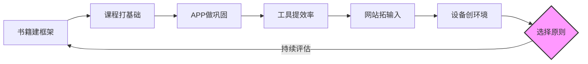
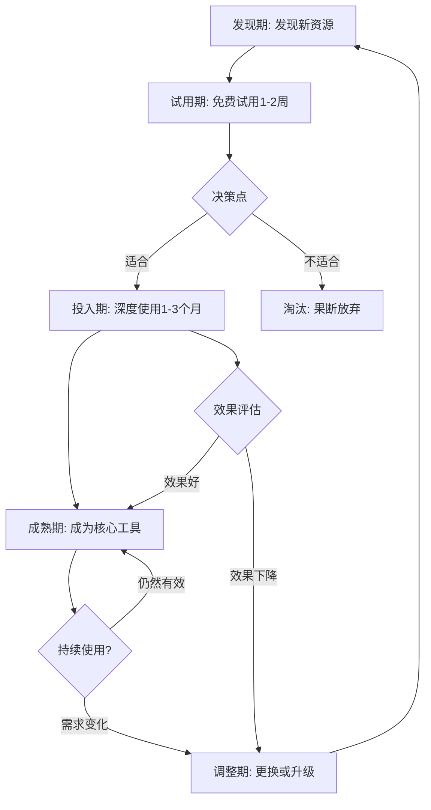

## 八、本节小结

产品推荐这一节从七个维度系统梳理了外语学习的资源生态。在结束本节之前，有必要将这些碎片化的信息整合成一张清晰的行动地图——不是简单重复前文，而是帮你建立一个可落地的资源组合方案，并提供一套持续优化资源体系的思维框架。

### 8.1 回顾：七大资源矩阵

先回顾一下我们覆盖的七个维度：

| 维度 | 核心价值 | 典型代表 | 适用场景 | 投入成本 |
|------|---------|---------|---------|---------|
| 经典书籍 | 体系化知识框架，适合深度学习 | 语法书、词汇书、分级读物 | 系统学习、打基础 | 30-200元/本 |
| 学习APP | 碎片化学习，降低启动成本 | 多邻国、不背单词、每日英语听力 | 碎片时间利用、习惯养成 | 免费-30元/月 |
| 在线课程 | 结构化教学，名师引领 | Coursera、网易公开课、B站系列课 | 系统学习、专项突破 | 免费-300元/月 |
| 学习工具 | 辅助效率提升 | Anki、欧路词典、Grammarly | 日常辅助、效率优化 | 免费-100元/月 |
| 学习资源网站 | 海量原版素材 | BBC Learning English、ESL Pod | 拓展输入、真实语料 | 免费为主 |
| 学习设备 | 沉浸式硬件体验 | Kindle、降噪耳机、录音笔 | 沉浸学习、环境营造 | 200-3000元（一次性） |
| 选择原则 | 科学决策，避免踩坑 | 匹配、质量、实用三大原则 | 购买决策、资源筛选 | 0元（认知层面） |

这七个维度并非独立存在，而是构成一个完整的学习闭环：

这个循环的关键在于：**选择原则贯穿始终**，它不是一个独立环节，而是每一步都需要的决策框架。你买一本书、下一个APP、报一门课，都要经过"匹配、质量、实用"三重过滤。没有这个过滤器，再好的资源也会变成收藏夹里的数字垃圾。

#### 各维度之间的协同关系

七个维度之间存在明确的协同效应，理解这些关系能帮你做出更聪明的资源组合：

**纵向递进关系**：书籍→课程→APP→工具，这是从"重学习"到"轻辅助"的递进。书籍提供最完整的知识体系，但阅读门槛最高；课程降低理解难度，但需要固定时间；APP把知识点切碎，适合碎片时间；工具则在后台默默提升效率。

**横向互补关系**：网站和设备分别从"内容供给"和"环境营造"两个角度补足学习生态。网站解决"学什么"的问题，设备解决"在哪学、怎么学得舒服"的问题。

**中枢调控关系**：选择原则是整个体系的中枢。它不产出内容，但决定了你投入的每一分钱、每一分钟是否花在了刀刃上。

### 8.2 资源组合方案：六套实战配置

根据不同的预算、阶段和目标，我整理了六套经过验证的组合方案。每套方案都标注了适用人群、核心搭配、预期效果和注意事项。

#### 方案一：零成本起步（月花费0元）

**适用人群**：学生党、想先试水的初学者、经济紧张但时间充裕的学习者。

**核心搭配**：
- **系统学习**：B站免费课程系列（如"英语兔"语法课、"Coach-Shane"口语课）
- **记忆巩固**：Anki（免费版，配合社区共享牌组）
- **听力阅读输入**：BBC Learning English（免费，内容分级清晰）
- **口语练习**：手机自带录音功能 + 英语趣配音（免费版）
- **写作辅助**：LanguageTool（免费开源语法检查）

**预期效果**：如果每天投入1-2小时，3个月内可以建立基本的学习习惯，听力和阅读有明显提升，口语和写作需要更长时间见效。

**注意事项**：免费方案的最大成本是时间。你需要花更多时间筛选资源、解决技术问题、寻找适合的材料。如果时间比金钱更紧缺，考虑升级到方案二。

#### 方案二：高效投资型（月花费50-150元）

**适用人群**：上班族、有明确考试目标的学习者、愿意用金钱换效率的人。

**核心搭配**：
- **主教材**：一套经典教材（如《新概念英语》全四册、《剑桥英语语法》）
- **词汇APP**：不背单词或墨墨背单词会员（约15-30元/月）
- **听力APP**：每日英语听力VIP（约15元/月，解锁精听功能）
- **AI写作批改**：Grammarly Premium或批改网（约30-50元/月）
- **口语陪练**：每周1-2次italki课程（约50-100元/次）

**预期效果**：付费工具提供更精准的反馈和更流畅的体验，能缩短30%-50%的摸索期。配合规律学习，6个月内可在目标考试中取得实质性进步。

**注意事项**：付费不等于有效。先用免费版试用1-2周，确认自己真的会用再付费。很多APP提供7天免费试用，充分利用这个窗口期。

#### 方案三：全沉浸式（月花费300-500元）

**适用人群**：有留学计划、希望快速突破瓶颈、或需要在短期内达到特定语言水平的学习者。

**核心搭配**：
- **专业课程**：Coursera专项课程（可申请助学金免费）或italki每周3-5次口语课
- **原版阅读**：Kindle Unlimited英文原版书库（约60元/月）
- **专业设备**：降噪耳机（如索尼WH-1000XM5，约2000元一次性投入）+ 平板电脑
- **高级工具**：Grammarly Premium + DeepL Pro（翻译对照学习）
- **社群学习**：加入付费学习社群或Language Exchange平台

**预期效果**：这种投入换取的是"语言环境的模拟"。在国内也能接近留学状态，每天接触英语的时间可达4-6小时。1年内口语和听力可达到接近母语者的日常交流水平。

**注意事项**：高投入意味着高期望，容易产生"花了这么多钱必须学好"的压力。记住：工具是辅助，坚持才是核心。如果发现压力过大，适当降级到方案二。

#### 方案四：考试冲刺型（月花费100-300元）

**适用人群**：正在备考雅思/托福/四六级/GRE等标准化考试的学习者。

**核心搭配**：
- **官方真题**：剑桥雅思真题集/ETS官方指南（必备，约100-200元）
- **专项突破**：针对薄弱项的专项APP（如雅思哥口语题库、小站托福）
- **模考平台**：定期参加模拟考试（如新东方在线模考）
- **写作批改**：专业写作批改服务（约30-80元/篇）
- **错题管理**：用Anki建立错题本，定期复习

**预期效果**：集中资源攻克考试，避免分散精力。通常2-3个月的集中备考可以看到明显的分数提升。

**注意事项**：考试冲刺和语言能力提升是两个不同的目标。考试技巧可以在短期内见效，但真正的语言能力需要长期积累。考试结束后，切换到长期学习方案。

#### 方案五：职场英语型（月花费100-200元）

**适用人群**：需要在工作中使用英语的职场人士，如外企员工、外贸从业者、技术人员。

**核心搭配**：
- **商务英语教材**：《Market Leader》系列或《Business Result》
- **行业词汇**：针对自己行业的英语词汇APP或词汇书
- **邮件写作**：Grammarly + 商务邮件模板库
- **会议听力**：TED Talks + 行业播客（如Harvard Business Review IdeaCast）
- **口语练习**：italki选择商务英语教师，模拟工作场景

**预期效果**：3-6个月内可以在工作中自信地使用英语进行邮件沟通、会议发言和报告撰写。

**注意事项**：职场英语的重点是实用性和效率，不需要追求"完美发音"或"文学性表达"。清晰、准确、专业是三个关键词。

#### 方案六：兴趣驱动型（月花费50-150元）

**适用人群**：没有考试压力，纯粹因为兴趣或个人发展想学英语的学习者。

**核心搭配**：
- **兴趣内容**：用英语追剧（Netflix双字幕）、听播客（如Serial、This American Life）、读原版小说
- **轻量学习**：多邻国每日打卡 + 薄荷阅读（分级读物）
- **社交学习**：HelloTalk或Tandem语言交换APP
- **创作输出**：用英语写日记、发Twitter/Reddit帖子

**预期效果**：这种方案的学习曲线最平缓，不会产生压力感。1-2年后可以无障碍地享受英语内容，具备基本的交流能力。

**注意事项**：兴趣驱动的最大风险是"只输入不输出"。享受内容的同时，要有意识地创造输出机会，否则容易停留在"能看懂但说不出"的阶段。

### 8.3 避坑指南：八个常见陷阱及应对策略

在选择和使用学习产品时，以下是最容易踩的坑。每个陷阱都附带具体的识别信号和应对方法。

#### 陷阱一：收藏=学会

**表现**：收藏夹里有几百个学习视频，网盘里存了几十G的学习资料，手机里装了5个以上的英语APP，但每天实际学习时间不到30分钟。

**本质**：这是一种"伪学习"行为。收藏和下载给你一种"我在学习"的虚假满足感，实际上消耗了你本该用于真正学习的精力。

**应对方法**：
1. 立即执行"资源断舍离"——手机APP只保留1-2个核心工具，其余全部卸载
2. 收藏夹只保留最近一周会用到的内容，其余移入"待定"文件夹，一个月后未打开的直接删除
3. 建立"用进废退"原则：一个资源如果两周没用过，说明它不适合当前阶段，果断放弃

#### 陷阱二：迷信"神器"

**表现**：看到"30天流利口语""背完这本书词汇量过万"的宣传就心动，频繁更换学习工具，每个都浅尝辄止。

**本质**：把语言学习简化为"找到对的工具"，忽视了学习本身需要的时间和努力。

**应对方法**：
1. 牢记一个事实：语言学习没有捷径，任何宣称"速成"的产品都在夸大其词
2. 选择工具时看它的"底层逻辑"是否科学（如间隔重复、可理解输入），而不是看它的宣传语有多吸引人
3. 一个工具至少使用一个月再评估效果，频繁更换只会让你永远停留在起跑线

#### 陷阱三：忽略反馈机制

**表现**：大量听和读（输入），但从不说和写（输出），或者输出后没有任何反馈。学了两年英语，做阅读理解还行，但开口就紧张，写作文全是语法错误。

**本质**：没有反馈的学习就像对着墙壁打球——你永远不知道自己偏了多远。输入和输出的比例失衡，会导致"哑巴英语"。

**应对方法**：
1. 选择产品时，优先考虑那些能提供即时反馈的工具：AI语法纠错（Grammarly）、口语评分（ELSA Speak）、写作批改（批改网）
2. 每周至少安排一次"输出练习"：写一篇短文、录一段口语、参加一次语言交换
3. 建立"反馈日志"：记录每次反馈中发现的问题，定期回顾，看是否有重复错误

#### 陷阱四：跟风购买

**表现**：看到博主推荐就下单，看到新APP就下载，朋友用什么自己就用什么，从不考虑是否适合自己。

**本质**：用"别人的选择"代替"自己的判断"，忽视了个体差异。

**应对方法**：
1. 花钱前先问自己三个问题：这个工具解决的是**我的**痛点吗？我能坚持每周使用至少3次吗？免费替代品是否已经够用？
2. 利用免费试用期（大多数APP提供7天免费试用），确认真的会用再付费
3. 记住：最贵的不一定最好，最火的不一定最适合你

#### 陷阱五：重输入轻输出

**表现**：每天花大量时间听英语、看英语，但从不开口说、不动手写。觉得自己"进步很大"，但一到实际交流就卡壳。

**本质**：语言是技能，不是知识。你不可能通过看游泳教学视频学会游泳，也不可能通过听英语学会说英语。

**应对方法**：
1. 强制设定"输出时间"：每天至少15分钟口语练习（哪怕是对着镜子自言自语）
2. 使用"输入-输出配比"原则：每2小时输入，至少搭配30分钟输出
3. 找一个语言伙伴或使用AI对话工具（如ChatGPT语音模式），创造真实的交流场景

#### 陷阱六：忽视学习环境

**表现**：在嘈杂的环境中学习，经常被打断，学习时频繁查看手机消息，没有固定的学习时间和地点。

**本质**：环境对学习效率的影响远超你的想象。一个好的学习环境能让效率翻倍，一个差的环境能让两小时的学习效果等于零。

**应对方法**：
1. 创建"学习仪式感"：固定时间、固定地点、固定工具，让大脑形成条件反射
2. 使用降噪耳机或白噪音APP隔绝干扰
3. 学习时开启手机"专注模式"，屏蔽所有非必要通知
4. 如果家里环境太差，考虑去图书馆或咖啡馆

#### 陷阱七：完美主义拖延

**表现**：总觉得"还没准备好"，要等买齐所有工具、看完所有攻略、找到最完美的学习计划才开始。结果永远在准备，从未真正开始。

**本质**：完美主义是行动的最大敌人。"最好的开始时间是现在"不是鸡汤，是事实。

**应对方法**：
1. 采用"最小可行学习"策略：今天就打开一个APP，学10分钟，这比"明天开始系统学习"有效一万倍
2. 接受"不完美"：你的发音不标准没关系，你的语法有错误没关系，重要的是你在用、在进步
3. 设定"启动门槛"极低的目标：每天只学5分钟。5分钟太少了？那就从这5分钟开始，你会发现一旦开始就停不下来

#### 陷阱八：孤立学习

**表现**：一个人默默学习，从不和别人交流，不参加学习社群，不寻求帮助。遇到问题自己扛，遇到瓶颈自己熬。

**本质**：语言是社交工具，学习语言的过程也应该是社交的。孤立学习不仅效率低，还容易失去动力。

**应对方法**：
1. 加入一个学习社群（微信群、Discord服务器、Reddit社区），定期分享学习心得
2. 找一个学习伙伴，互相监督、互相鼓励
3. 遇到问题不要死磕，善用搜索引擎、学习论坛和AI助手
4. 定期参加语言交换活动（线上或线下），在真实交流中检验学习成果

### 8.4 自我诊断：你的资源体系健康吗？

在你开始优化资源组合之前，先做一个快速的自我诊断。回答以下问题，统计你的"是"和"否"：

#### 资源健康度检查清单

| 检查项 | 是/否 |
|--------|-------|
| 我能在一个小时内列出我正在使用的所有学习资源 | |
| 这些资源中，至少80%在过去两周内被使用过 | |
| 我有明确的输入资源（听/读）和输出渠道（说/写） | |
| 我的学习工具中至少有一个提供即时反馈 | |
| 我的资源组合覆盖了至少3个维度（如书籍+APP+工具） | |
| 我没有为"可能有用但目前没用"的资源付费 | |
| 我能清楚说出每个资源解决的具体问题 | |
| 我的资源组合在过去3个月内做过调整 | |

**评分标准**：
- **7-8个"是"**：你的资源体系非常健康，只需定期微调
- **5-6个"是"**：基本健康，但有优化空间，重点关注"否"的项目
- **3-4个"是"**：存在明显问题，建议执行一次彻底的资源审计
- **0-2个"是"**：资源体系严重失衡，需要从零开始重建

### 8.5 资源生命周期管理

学习资源不是买来就完事了，它们有自己的生命周期。理解这个周期，能帮你更科学地管理资源投入。

**每个阶段的关键动作**：

**发现期**：保持开放心态，但不要冲动。看到新资源时，先记录下来，不要立即下载或购买。给自己24小时的"冷静期"。

**试用期**：充分利用免费试用功能。在试用期间，重点关注：界面是否顺手？内容是否匹配你的水平？反馈机制是否有效？每天使用是否方便？

**投入期**：决定投入后，给自己设定一个"承诺期"——至少使用一个月。在这一个月内，不要被其他新资源分散注意力。

**成熟期**：一个资源成为核心工具后，定期评估它的效果。如果连续两周感觉"没什么进步"，可能是时候调整了。

**淘汰期**：淘汰不是失败，是优化。一个资源在某个阶段不适合，不代表它永远没用。可以保留记录，未来需要时重新启用。

### 8.6 务实的行动建议

如果你读完这一节只记住一件事，那就是这句话：

> **在开始之前，先花30分钟做一次"学习审计"——盘点你当前已有的资源，评估哪些在真正被使用，哪些只是心理安慰。然后砍掉冗余，只保留最顺手的1-2个，用足一个月再考虑调整。**

以下是具体的执行步骤：

**第一步：资源盘点（10分钟）**
列出你目前拥有的所有学习资源，包括APP、书籍、课程、网站、设备。不要遗漏，哪怕是你"下载了但从没打开过"的。

**第二步：使用频率评估（5分钟）**
对每个资源标注过去两周的使用次数。0次的标红，1-3次的标黄，4次以上的标绿。

**第三步：价值判断（10分钟）**
对每个标红和标黄的资源，问自己：它解决的是什么问题？有没有其他资源已经在解决同样的问题？如果答案是"有替代品"或"其实不需要"，立即删除或取消订阅。

**第四步：组合优化（5分钟）**
确保你的资源组合至少覆盖三个维度，且有一个能提供反馈的工具。如果缺失某个维度，有针对性地补充一个资源，只补一个。

**第五步：设定检查点**
在日历上标记一个月后的日期，届时重复这个审计过程。资源管理是一次性的，是持续的习惯。

### 8.7 延伸思考：产品之上是什么？

产品和工具终究是"术"的层面，真正决定学习成败的是三个更根本的因素：

**动机的强度**：你为什么学英语？是为了考试、工作、留学，还是纯粹的兴趣？动机越具体、越强烈，你坚持学习的可能性就越大。"我想学好英语"是模糊的动机，"我需要在6个月内达到雅思7分才能申请目标学校"是具体的动机。

**习惯的稳定性**：每天固定时间学习30分钟，比"有空就学两小时"有效得多。习惯的力量在于它消除了"要不要学"的决策成本——到了时间就学，不需要意志力。

**方法的科学性**：用错误的方法努力，比不努力更可怕。间隔重复比集中突击有效，可理解输入比死记硬背有效，输出练习比纯输入有效。这些原理在后续章节会详细展开。

如果这三个问题的答案是肯定的，哪怕只有一本语法书和一支笔，你也完全能把外语学好。工具是锦上添花，不是雪中送炭。

下一节我们将从产品转向方法论，聊聊如何建立一套真正可持续的外语学习系统——不依赖任何特定工具，只依赖正确的原则和习惯。
