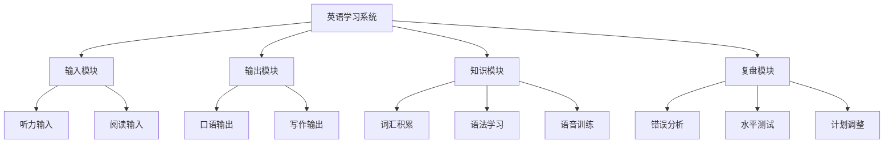

## 一、英语学习的整体方法论

本节是"具体方案"篇的总纲。后续章节将分别深入听力、口语、阅读、写作、词汇等专项训练，而本节的任务是建立一套**全局性的学习框架**——帮你理解英语学习的底层逻辑、不同阶段的策略重心、以及如何将各个专项训练串联成一个有机整体。

### 1.1 英语能力的全景模型

#### 1.1.1 四个维度：听、说、读、写

语言能力通常被分为四个维度：听力（Listening）、口语（Speaking）、阅读（Reading）和写作（Writing）。这四项技能并非孤立存在，而是相互依存、彼此促进的。听力和阅读是**输入型技能**（receptive skills），口语和写作是**输出型技能**（productive skills）。

一个常见的误解是把这四项技能当作可以单独攻克的"科目"。事实上，语言能力更像是一张网——每根线都与其他线相连。你听得越多，口语表达的素材就越丰富；你读得越深，写作的逻辑和用词就越精准。研究表明，在自然语言习得过程中，输入型技能的发展通常先于输出型技能，两者之间存在**时间差**——这完全正常，不必因为"听得懂但说不出"而焦虑。

#### 1.1.2 第五个维度：语法与语感

除了听、说、读、写，还有一个经常被忽略但至关重要的维度：**语法意识**（grammatical awareness）和**语感**（language intuition）。

语法意识是显性的——你知道规则，能在写作和口语中有意识地应用。语感是隐性的——你"感觉"某个句子是对的或不对的，但不一定能说清楚为什么。两者的关系类似于"知识"与"直觉"：语法意识是语感的基础，大量的语言输入是语感形成的催化剂。

在学习的初级阶段，语法意识的建立帮助你减少低级错误、建立基本的句子结构能力；在中高级阶段，语感的培养让你的语言输出更加自然、地道，不再依赖逐条对照语法规则。

#### 1.1.3 语言能力的层级划分

为了帮助你准确定位自己的水平，这里采用欧洲共同语言参考框架（CEFR）的六级体系，并附上与国内常见考试的对应关系：

| CEFR 等级 | 能力描述 | 国内考试对应 | 词汇量参考 |
|-----------|---------|------------|-----------|
| A1 入门 | 能理解和使用最基本的日常表达 | 初中英语水平 | ~1,000 词 |
| A2 基础 | 能描述个人背景、日常事务 | 高中英语水平 | ~2,000 词 |
| B1 中级 | 能处理旅行、工作中的大部分情境 | CET-4 水平 | ~4,000 词 |
| B2 中高级 | 能与母语者进行较流利的交流 | CET-6 / 雅思 6.0 | ~6,000 词 |
| C1 高级 | 能灵活、有效地使用语言 | 雅思 7.0+ | ~8,000 词 |
| C2 精通 | 接近母语者的水平 | 雅思 8.5+ | ~15,000+ 词 |

知道自己处于哪个层级，是制定有效学习计划的前提。后文将针对不同层级给出具体建议。

### 1.2 英语学习的七大黄金法则

在介绍具体方法之前，先总结几条经过第二语言习得研究验证的核心法则。这些法则不是"鸡汤"，每一条背后都有扎实的理论支撑。

#### 法则一：每天至少接触英语 30 分钟——持续性胜过强度

语言学习的关键在于**持续性**（consistency），而非单次学习的时长。认知科学中的"间隔效应"（spacing effect）表明，将学习分散到多个时间段比集中突击更有利于长期记忆的形成。

每天 30 分钟的稳定输入，效果远好于周末突击 5 小时。原因是：语言习得需要大脑在学习间隔期间进行"离线加工"（offline processing），包括记忆巩固、规则内化等过程。这些过程在睡眠和休息期间最为活跃。每天学习意味着大脑每天都有新的素材进行加工，而周末突击则意味着一周只有两天有素材输入，其余五天处于"停滞"状态。

**实操建议**：

- 利用碎片时间：通勤听播客（15 分钟）+ 午休读一篇短文（10 分钟）+ 睡前复习单词（5 分钟），轻松凑够 30 分钟
- 设定"最低承诺"：状态好的时候可以学 1-2 小时，状态不好的时候至少完成 15 分钟的最低承诺，保持学习惯性
- 使用习惯追踪工具（如 Habitica、Streaks）记录连续学习天数，利用"不想断链"的心理来维持坚持

#### 法则二：80% 的时间用于可理解性输入

克拉申的输入假说（Input Hypothesis）指出，语言习得的根本途径是接收**可理解性输入**（comprehensible input）——即略高于你当前水平的语言材料（i+1 理论）。

这意味着，你的大部分学习时间应该用于**听**和**读**适合你水平的材料。很多学习者把大量时间花在背单词、学语法、做练习题上，这些活动虽然有一定价值，但如果缺乏足够的输入作为基础，效果会大打折扣。

**"可理解"的标准**：你能理解材料的 70%-85%。低于 70% 说明太难，你会因为大量生词和复杂结构而无法理解整体意思；高于 85% 说明太简单，你接触不到新的语言元素，学习效率低。

**输入材料的选择梯度**：

- 初级：分级读物（如 Oxford Bookworms Starter-Level 1）、慢速英语新闻（如 VOA Special English）、ESL 播客
- 中级：英文小说（如 *The Old Man and the Sea*、*Charlotte's Web*）、TED 演讲、英文 YouTube 频道
- 高级：英文原版书籍、学术论文、英文脱口秀、英文播客（如 *This American Life*、*Radiolab*）

#### 法则三：选择你感兴趣的内容——兴趣是最高效的发动机

这一条看似简单，却是最容易被忽视的。很多人学英语时使用的是"应该学"的材料（枯燥的教材、标准化的新闻），而不是"想学"的材料。

认知心理学中的"情绪标记"（emotional tagging）理论表明，带有情绪体验的信息更容易被大脑编码和存储。当你对材料感兴趣时，你的注意力更集中、情感投入更深、记忆效果更好——这三者加在一起，学习效率至少提高 2-3 倍。

**兴趣驱动的学习路径举例**：

- 如果你喜欢烹饪：看英文烹饪视频（如 Gordon Ramsay 的 YouTube 频道），读英文食谱，学食物相关的词汇
- 如果你喜欢科技：读 TechCrunch、The Verge 的文章，听科技播客（如 *Reply All*、*Lex Fridman Podcast*）
- 如果你喜欢体育：看英文体育解说，读 ESPN 的报道，了解体育相关的俚语和表达
- 如果你喜欢音乐：听英文歌并研究歌词，了解歌手的采访，读音乐评论

#### 法则四：不要追求完美，要追求进步

语言学习是一个**非线性的进步过程**。你会经历快速进步期、平台期、甚至暂时的退步。这些都是正常现象。

很多学习者因为害怕犯错而不敢开口，因为追求"完美发音"而迟迟不开始口语练习，因为觉得"词汇量不够"而不敢读原版书。这种"完美主义陷阱"是语言学习最大的敌人之一。

语言学研究表明，犯错本身就是习得过程的一部分。斯韦恩的输出假说指出，当学习者尝试用目标语言表达时，他们会"注意到差距"（noticing the gap）——即意识到自己想表达的和能表达的之间的差异。这种"注意到差距"的体验恰恰是推动学习进步的驱动力。

**具体建议**：

- 设定"进步目标"而非"完美目标"：例如"这个月能听懂 70% 的 TED 演讲"，而不是"这个月完全听懂所有内容"
- 建立"错误日志"：记录自己犯的错误和纠正方法，定期回顾，见证自己的进步
- 接受"good enough"原则：在口语交流中，能传达意思比语法完全正确更重要

#### 法则五：创造英语环境——让英语成为生活的一部分

语言习得理论中的"沉浸"（immersion）概念表明，当学习者身处目标语言的环境中时，语言习得的速度会显著加快。你不需要出国也能创造"准沉浸"环境。

**环境改造清单**：

- 手机和电脑系统语言改为英文
- 社交媒体关注英文账号（Twitter/X、Reddit、YouTube）
- 娱乐时间 50% 以上切换为英文内容（电影、剧集、播客、游戏）
- 用英文写购物清单、日记、待办事项
- 手机输入法添加英文键盘，练习英文打字
- 浏览器默认搜索引擎改为英文版
- 参加英文线上社区（如 Discord 服务器、Reddit 子版块）

环境的力量在于**被动输入**：即使你没有刻意学习，环境中大量的英文信息也会被你的大脑无意识地处理，这正是克拉申所说的"潜意识习得"。

#### 法则六：输入与输出相结合——从理解到运用

仅靠输入是不够的。大量输入可以提高你的理解能力，但要真正掌握语言，你必须通过**输出**来检验和巩固所学知识。

斯韦恩的输出假说强调了输出的三个独特功能：（1）注意功能——输出让你发现自己的"知识盲区"；（2）假设检验功能——通过输出获得反馈，验证自己对语言规则的理解是否正确；（3）元语言功能——输出过程中你会反思和分析语言使用，促进内化。

**输入与输出的黄金比例**：

| 学习阶段 | 输入占比 | 输出占比 | 输出方式 |
|---------|---------|---------|---------|
| 初级（A1-A2） | 80% | 20% | 跟读、模仿、简单造句 |
| 中级（B1-B2） | 60% | 40% | 写日记、语言交换、主题讨论 |
| 高级（C1-C2） | 40% | 60% | 写文章、演讲、辩论、专业写作 |

#### 法则七：学习真实语言——跳出教材的框框

教科书上的语言往往经过"净化"和"简化"，与真实世界中使用的语言存在显著差距。如果你只学教材，你会发现：外国人说的英语你听不懂，因为你没接触过连读、弱读、口语缩略形式；你的表达虽然正确但听起来像机器人，因为你用的都是"教科书式"的完整句式。

**真实语言材料的特征**：

- 包含连读、弱读、吞音等自然语音现象
- 使用口语缩略形式（gonna, wanna, gotta, kinda）
- 包含俚语、习语、文化引用
- 语法不一定"规范"，但符合实际使用习惯
- 语速自然，不是刻意放慢的"教学语速"

**获取真实语言材料的途径**：

- YouTube 上的英文 vlog 和脱口秀
- 英文播客（选择对话类而非朗读类）
- 英文电影和电视剧（从带英文字幕开始）
- Reddit、Twitter/X 等社交媒体上的英文讨论
- 英文新闻节目（如 BBC World Service、CNN）

### 1.3 英语学习的系统框架

了解了基本法则之后，你需要一个系统框架来组织你的学习。以下是一个经过实践验证的**英语学习系统框架**，它将学习活动分为四个模块：

**输入模块**：每天的"主食"。包括听力输入（播客、视频、有声书）和阅读输入（文章、书籍、新闻）。这是语言习得的根本驱动力。

**输出模块**：每天的"练习"。包括口语输出（跟读、对话、自言自语）和写作输出（日记、邮件、文章）。输出是将"认识的"变成"会用的"的关键步骤。

**知识模块**：每周的"加餐"。包括词汇的系统积累、语法的专题学习、语音的刻意训练。这些是支撑输入和输出的底层基础设施。

**复盘模块**：每周/每月的"体检"。包括错误分析（找出反复犯的错误）、水平测试（评估进步情况）、计划调整（根据实际情况优化学习方案）。

### 1.4 不同阶段的学习策略

#### 1.4.1 零基础到初级（A1-A2）：打地基阶段

**核心目标**：建立基本的语音系统、掌握 1500-2000 个高频词汇、能理解和使用简单的日常表达。

**策略重心**：以输入为主（80%），少量输出（20%）。

**每日学习安排参考**（共 45-60 分钟）：

| 时间段 | 活动 | 目的 |
|-------|------|------|
| 15 分钟 | 语音学习（音标/自然拼读） | 建立正确的发音基础 |
| 15 分钟 | 分级听力材料 | 建立英语声音与意义的连接 |
| 15 分钟 | 词汇学习（间隔重复） | 积累高频核心词汇 |
| 10 分钟 | 跟读/模仿练习 | 初步的输出训练 |

**关键注意事项**：

- 不要跳过语音学习。很多学习者急于"学句子"而忽略了音标，导致后续发音问题难以纠正
- 不要纠结语法。这个阶段通过大量输入自然习得基础语法，不需要系统学习语法规则
- 使用有中文辅助的材料，降低认知负荷，确保输入是"可理解的"

#### 1.4.2 初级到中级（A2-B1）：快速成长阶段

**核心目标**：词汇量扩展到 4000+，能进行日常对话，能阅读简单文章，能写基本的段落和短文。

**策略重心**：输入和输出并重（60% 输入、40% 输出）。

**每日学习安排参考**（共 60-90 分钟）：

| 时间段 | 活动 | 目的 |
|-------|------|------|
| 20 分钟 | 分级听力/播客 | 持续扩大输入量 |
| 20 分钟 | 分级阅读/简单文章 | 提升阅读理解能力 |
| 15 分钟 | 词汇学习（语境中学） | 系统积累词汇 |
| 15 分钟 | 口语练习（跟读/语言交换） | 开始系统输出训练 |
| 10 分钟 | 写作练习（日记/段落） | 书面输出训练 |

**关键注意事项**：

- 开始使用英文-英文词典（如朗文、柯林斯），逐步减少对中文翻译的依赖
- 开始练习用英文思考，而不是"中文翻译成英文"
- 找到语言交换伙伴或使用 AI 口语练习工具，开始真实对话

#### 1.4.3 中级到中高级（B1-B2）：突破瓶颈阶段

**核心目标**：词汇量扩展到 6000+，能与母语者进行较流利的交流，能阅读中等难度的英文文章，能写结构完整的文章。

**策略重心**：以输出驱动输入（50% 输入、50% 输出），通过输出发现自己需要什么然后有针对性地输入。

**每日学习安排参考**（共 60-90 分钟）：

| 时间段 | 活动 | 目的 |
|-------|------|------|
| 20 分钟 | 英文原版内容（新闻/播客/视频） | 接触真实语言 |
| 15 分钟 | 原版阅读（小说/文章） | 深度阅读训练 |
| 20 分钟 | 口语练习（主题讨论/自由对话） | 流利度训练 |
| 15 分钟 | 写作练习（邮件/评论/短文） | 书面表达训练 |
| 10 分钟 | 词汇深化（搭配/近义词/用法） | 词汇质量提升 |

**关键注意事项**：

- 这个阶段最容易遇到"中级瓶颈"（intermediate plateau）——感觉自己怎么学都没有明显进步。突破瓶颈的关键是**增加输出的比重和难度**
- 开始关注"搭配"（collocation）而非孤立的单词。例如，不只是认识"make"和"decision"，而是知道"make a decision"（而非"do a decision"）
- 开始接触不同口音和语速的英语材料，提高听力的适应性

#### 1.4.4 中高级到高级（B2-C1）：精细化打磨阶段

**核心目标**：词汇量扩展到 8000+，能准确、得体地使用英语进行各种场景的交流，能阅读学术或专业材料，能写出高质量的文章。

**策略重心**：以输出为主（60% 输出、40% 输入），通过输出检验和精细化自己的语言能力。

**关键训练方向**：

- **语域意识**：学习区分正式和非正式用语，在不同场合使用恰当的语言风格
- **精确表达**：从"能表达意思"到"精确表达意思"——学习近义词之间的微妙差异
- **文化理解**：深入了解英语国家的文化、历史、社会背景，理解语言背后的文化含义
- **专业英语**：根据自己的职业或兴趣领域，学习专业英语

### 1.5 英语学习的时间管理

#### 1.5.1 最小可行学习量（Minimum Viable Learning）

对于工作繁忙的成年人，"每天学 2 小时"往往是不现实的承诺。与其设定做不到的目标然后放弃，不如设定"最小可行学习量"——即使在最忙的日子里也能完成的最低标准。

**最小可行学习量**：每天 15 分钟。具体安排：

- 5 分钟：用 Anki 复习单词（在通勤、排队等碎片时间完成）
- 5 分钟：听一段英文音频（播客片段、新闻摘要）
- 5 分钟：阅读一小段英文内容（手机上的英文新闻、社交媒体）

这 15 分钟的价值不在于学了多少新东西，而在于**保持了学习惯性**——你的大脑每天都在接触英语，语言能力就不会退化。

#### 1.5.2 理想学习量

如果你能够保证更多的学习时间，以下是不同时间投入的建议方案：

**30 分钟/天**：基础维持

- 10 分钟听力输入 + 10 分钟阅读输入 + 5 分钟词汇复习 + 5 分钟口语/写作练习

**60 分钟/天**：稳步提升

- 20 分钟听力输入 + 15 分钟阅读输入 + 10 分钟词汇学习 + 10 分钟口语练习 + 5 分钟写作练习

**90 分钟/天**：快速进步

- 在 60 分钟方案基础上，增加 15 分钟的精听/精读训练 + 15 分钟的深度口语/写作练习

**120 分钟/天**：高强度突破

- 在 90 分钟方案基础上，增加一节完整的语法专题学习（30 分钟）

#### 1.5.3 碎片时间的利用

现代人的大块时间有限，但碎片时间（通勤、排队、午休、等待）其实相当可观。碎片时间适合做以下学习活动：

| 碎片时间长度 | 适合的学习活动 |
|------------|--------------|
| 1-3 分钟 | 复习 Anki 单词卡片 |
| 3-5 分钟 | 听一小段英文播客/新闻 |
| 5-10 分钟 | 阅读一篇英文短文或社交媒体帖子 |
| 10-15 分钟 | 跟读/模仿一小段英文视频 |
| 15-30 分钟 | 听一段完整的英文播客或看一小段英文视频 |

**关键原则**：碎片时间适合做"被动输入"和"低认知负荷"的活动（听、读、复习），不适合做需要高度专注的活动（精听分析、写作练习）。把需要高度专注的活动留给大块时间。

### 1.6 常见的英语学习误区

在进入具体的专项训练之前，有必要先澄清一些广泛存在的误区，避免你在后续的学习中走弯路。

#### 误区一：背单词 = 学英语

很多学习者把大部分时间花在背单词上，认为"只要词汇量够大，英语自然就好了"。这是最大的误区之一。

词汇只是语言的"建筑材料"，光有材料没有"施工能力"（语法、搭配、语境理解），你仍然无法构建有效的语言表达。更糟糕的是，脱离语境背单词效率极低——你可能记住了单词的中文意思，但不知道如何正确使用它。

**纠正方法**：在语境中学单词（通过阅读和听力），学习单词时关注搭配和用法而非中文翻译，使用间隔重复系统而非死记硬背。

#### 误区二：语法不重要，多听多说自然就会

另一个极端是完全放弃语法学习，认为"小孩子不学语法也能说母语"。但成人和儿童的学习机制不同：成人已经形成了母语的思维模式，母语语法会持续"迁移"到外语中。没有语法意识的成人学习者，往往会把母语的句子结构直接套用到英语上，形成"中文式英语"（Chinglish）。

**纠正方法**：不需要像学校那样死抠语法细节，但需要建立基本的语法框架。在初级阶段系统学习核心语法（时态、语态、从句），然后通过大量输入来内化这些规则。

#### 误区三：发音不重要，能听懂就行

"发音无所谓，能沟通就行"——这种想法短期内看似可行，但长期来看会成为你英语能力的天花板。发音不标准会直接影响你的听力理解能力（因为你脑中的"声音模型"是错的，自然听不懂标准发音），也会导致母语者频繁需要你重复所说的话，影响交流效率和自信心。

**纠正方法**：在学习初期就系统学习英语的音标系统（推荐学习国际音标 IPA），重点掌握中英文之间的发音差异（如 th、v/w、l/r 等），通过跟读和模仿来训练口腔肌肉记忆。

#### 误区四：看美剧 = 学英语

看美剧对英语学习有帮助，但前提是你用正确的方式看。开着中文字幕刷完整季剧情，对英语学习的帮助约等于零——你的眼睛会自动锁定中文字幕，大脑完全不处理英文声音信号。

**纠正方法**：看美剧学习英语需要"刻意"的方式——第一遍不看字幕尝试理解，第二遍看英文字幕确认理解，第三遍跟读模仿，选择生活类场景的剧集（如 *Friends*、*Modern Family*）而非专业术语多的剧集（如 *House M.D.*、*The Big Bang Theory*）。

#### 误区五：学了很久感觉没进步，说明方法不对

语言学习的进步是**非线性**的，而且存在显著的"感知滞后"——你的实际能力在持续提升，但你自己感觉不到。这是因为语言能力的提升是渐进的、微小的，而你感知进步的方式往往是"里程碑式"的（突然发现自己能听懂某段对话了、突然发现自己能顺畅地说完一整段话了）。

**纠正方法**：定期录制自己的口语样本（每月一次），对比几个月前的录音，你会发现明显的进步；使用标准化测试（如 EF SET、雅思模拟）定期评估自己的水平；记录学习日志，回顾自己能做的事情的变化。

#### 误区六：找一个好老师/好教材就能学好

没有任何一个老师或教材能"替你学"。语言学习本质上是一个需要你自己投入大量时间和精力的过程。再好的老师，如果你课后不练习、不输入、不输出，也无法让你掌握语言。

**纠正方法**：把老师/教材当作"指南针"——帮你找到方向、避免弯路，但走路的人是你自己。真正决定学习效果的是你**课外自主学习的时间和质量**。

### 1.7 学习工具生态系统概览

在后续的专项训练章节中，我们会针对每个技能推荐具体的工具和资源。这里先做一个整体概览，帮助你建立对工具生态的全局认知。

#### 1.7.1 核心工具

**间隔重复软件**——词汇学习的基础工具：

- **Anki**（免费，全平台）：最强大的间隔重复软件，支持自定义卡片、共享牌组，有丰富的插件生态。缺点是学习曲线较陡，界面不够友好。
- **墨墨背单词**（中文界面）：专为中国英语学习者设计，内置多种词书，界面友好，但自定义能力不如 Anki。

**词典工具**——从中文释义过渡到英文释义的桥梁：

- 初级阶段：有道词典、欧路词典（支持中文释义）
- 中级阶段：朗文当代英语词典（LDOCE）、柯林斯 COBUILD（英文释义+例句丰富）
- 高级阶段：牛津英语词典（OED）、韦氏词典（Merriam-Webster）

**听力工具**：

- **每日英语听力**：海量听力材料，支持变速播放、单句循环、AB 复读
- **Podcast Addict / Apple Podcasts**：播客收听，支持变速播放
- **YouTube**：最丰富的英文视频资源，支持自动字幕和变速播放

**口语工具**：

- **AI 对话工具**（如 ChatGPT、Claude）：随时进行英文对话练习，不焦虑、不怕犯错
- **italki / Preply**：与真人母语者一对一在线课程
- **HelloTalk / Tandem**：语言交换社交平台，与母语者互相学习

#### 1.7.2 工具选择原则

面对琳琅满目的工具，记住一个原则：**工具是手段，不是目的**。选择工具的标准是：

1. **能坚持用**：界面友好、操作简便、不会因为太复杂而放弃
2. **适合你的水平**：太简单或太难的工具都不会有效果
3. **能提供反馈**：好的工具能告诉你哪里做得好、哪里需要改进
4. **数据可追踪**：能看到自己的学习进度和历史数据

最重要的一点：**不要花太多时间在"选工具"上**。很多人花了几个小时研究哪款背单词软件最好，却只背了 10 个单词。最好的工具就是你现在就开始用的那个。

### 1.8 学习计划的制定原则

在后续的"制定个性化学习计划"章节中，我们会提供详细的计划模板和案例。这里先介绍制定学习计划的核心原则，帮你建立正确的规划思维。

#### 1.8.1 目标设定：SMART 原则

好的学习目标应该是 SMART 的：

- **S**pecific（具体的）："提高口语流利度"太模糊，"能在 3 分钟内流利描述一张图片"更具体
- **M**easurable（可衡量的）：有明确的量化指标，如"雅思口语从 5.5 提到 6.5"
- **A**chievable（可实现的）：目标要有挑战性但不至于不可能，参考前文的层级划分
- **R**elevant（相关的）：目标与你的实际需求相关（工作需要、考试需要、兴趣驱动）
- **T**ime-bound（有时限的）：设定明确的截止日期，如"3 个月内"

#### 1.8.2 计划的层次结构

一个完整的学习计划应该包含三个层次：

**长期目标**（6-12 个月）：你要达到什么水平？例如："一年内通过 CET-6"或"一年内能流利进行英文工作汇报"。

**中期里程碑**（1-3 个月）：每 1-3 个月一个里程碑。例如："第 3 个月能听懂 80% 的 VOA 常速新闻"。

**每日任务**（每天）：具体的、可执行的每日学习任务。例如："听 1 段 5 分钟的 BBC 新闻 + 精听分析 + 跟读模仿"。

#### 1.8.3 计划的灵活性

再好的计划也需要根据实际情况调整。建议每 2-4 周进行一次"计划复盘"：

- 这个阶段的学习目标达到了吗？
- 哪些活动效果好？哪些效果差？
- 时间分配是否需要调整？
- 是否遇到了新的困难或瓶颈？

不要死守计划不变，也不要频繁改变计划。关键是在**坚持大方向**的前提下**灵活调整细节**。

### 1.9 本节小结

本节作为"具体方案"篇的总纲，建立了以下框架：

**全景模型**：英语能力 = 听说读写 + 语法语感五个维度，输入型技能先于输出型技能发展。

**七大黄金法则**：每天 30 分钟、80% 输入、兴趣驱动、追求进步、创造环境、输入输出结合、学习真实语言。

**系统框架**：输入模块 + 输出模块 + 知识模块 + 复盘模块，四个模块协同运作。

**阶段策略**：从零基础到精通分为四个阶段，每个阶段有明确的策略重心和时间分配建议。

**时间管理**：最小可行学习量 15 分钟/天，碎片时间利用策略，不同时间投入的方案。

**误区澄清**：背单词≠学英语、语法不能忽视、发音很重要、看美剧要刻意练习、进步是感知滞后的、好工具好老师无法替代自主投入。

**工具生态**：间隔重复软件、词典、听力工具、口语工具的选择原则——"能坚持用"比"功能最强"更重要。

**计划制定**：SMART 目标、三层计划结构、定期复盘调整。

在后续章节中，我们将逐项深入每个专项训练的具体方法。本节建立的框架将贯穿整个学习过程——无论你学到哪个阶段，都可以回到这里重新审视自己的学习策略是否合理。

***
