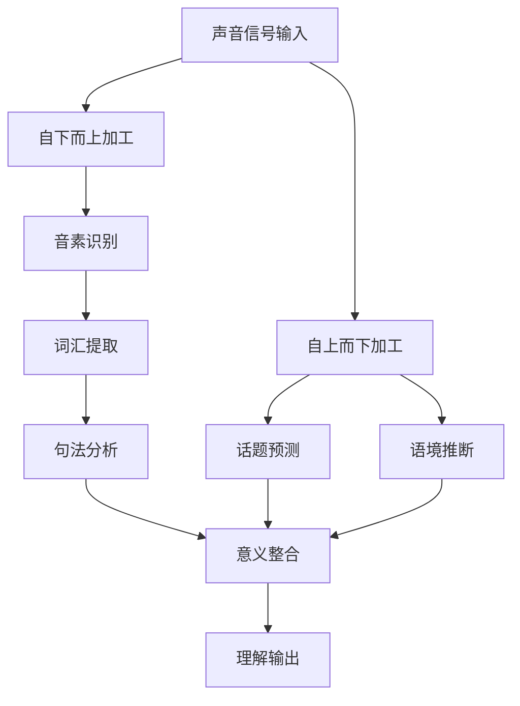

## 二、听力训练方案

听力是语言习得中最先启动却最后精通的技能。母语习得的研究表明，婴儿在出生前就开始处理语音信号（DeCasper & Fifer, 1980），而在二语学习中，听力往往是最容易被忽视、训练效率最低的环节。本章从认知科学原理出发，构建一套从零基础到高阶的完整听力训练体系。

### 2.1 听力理解的认知机制

理解听力的底层机制，才能设计出高效的训练方案。听力理解不是"被动接收声音"，而是大脑同时运行多个加工系统的复杂过程。

#### 2.1.1 自下而上加工（Bottom-Up Processing）

自下而上加工是指从最小的声音单位出发，逐层向上构建意义：

| 层级 | 加工内容 | 典型困难 |
|------|----------|----------|
| 音素层 | 识别单个音素（/p/ vs /b/） | 母语中不存在的音素难以分辨 |
| 音节层 | 识别音节结构（CV、CVC） | 辅音群识别困难（如 /str/） |
| 词汇层 | 将声音映射到已知词汇 | 连读导致词汇边界模糊 |
| 句法层 | 分析句子结构 | 语速快时来不及分析 |
| 语义层 | 整合理解句意 | 多义词的语境选择 |

中国学习者的典型瓶颈在**音素层和词汇层**——由于汉语是音节计时语言（syllable-timed），而英语是重音计时语言（stress-timed），学习者往往无法捕捉英语中被压缩的非重读音节。

#### 2.1.2 自上而下加工（Top-Down Processing）

自上而下加工是指利用已有知识和上下文来预测和补全听力信息：

- **话题知识**：熟悉的话题更容易理解，即使有些词没听清
- **语境线索**：前后文帮助推断听不清的内容
- **图式知识**：大脑中储存的"脚本"（如餐厅点餐的固定流程）
- **语用推理**：根据语气、场景推断言外之意

#### 2.1.3 两种加工的协同

高效听力者同时激活两种加工：底部快速识别声音，顶部不断预测和验证。低效听力者往往卡在自下而上加工的某个层级（通常是词汇识别），导致无法腾出认知资源进行自上而下的推断。

#### 2.1.4 工作记忆与听力

听力理解高度依赖工作记忆。Baddeley的工作记忆模型中，**语音环路**（phonological loop）负责临时存储和复述听到的语音信息，其容量约为2秒的语音流。当语速超过你的处理速度时，语音环路溢出，后续信息丢失。

这意味着：听力训练的核心目标之一，是**扩大语音环路的有效容量**——通过自动化低层级加工（音素识别、词汇提取），释放认知资源给高层级加工（意义整合、推理）。

### 2.2 听力能力的五级模型

听力能力并非线性增长，而是呈现出明显的阶段性特征。每个阶段有其核心矛盾和突破策略：

| 层级 | 名称 | 核心能力 | 典型表现 | 主要瓶颈 |
|------|------|----------|----------|----------|
| L1 | 辨音层 | 区分不同音素和单词 | 能听懂慢速、清晰的单词 | 陌生音素、连读 |
| L2 | 词汇识别层 | 快速将声音映射到已知词汇 | 能听懂慢速完整句子 | 听觉词汇量不足 |
| L3 | 句子理解层 | 实时处理完整句子 | 能跟上正常语速的简单对话 | 工作记忆容量 |
| L4 | 篇章理解层 | 把握长段落的逻辑结构 | 能听懂新闻报道和演讲 | 注意力维持 |
| L5 | 隐含意义层 | 理解言外之意、讽刺、幽默 | 能理解脱口秀、辩论、方言 | 文化背景知识 |

大多数中国英语学习者长期卡在L2到L3之间——认识的单词"看得懂听不懂"，根本原因是**听觉词汇量**和**视觉词汇量**脱节。解决方案见2.3节。

### 2.3 精听训练：听力提升的核心引擎

精听（Intensive Listening）是听力训练中投入产出比最高的方法。它要求学习者对一小段材料进行深度加工，逐词逐句地分析和理解。

#### 2.3.1 精听的认知原理

精听的本质是**可理解输入的精细化**（Krashen的i+1假说在听力领域的应用）。通过反复听同一材料，学习者能够：
- 将新词汇的声音形式与意义建立牢固联结
- 识别并适应连读、弱读、吞音等语音现象
- 建立语音模式的自动化识别

认知心理学中的**间隔重复效应**（spacing effect）同样适用于精听：同一材料在不同时间重复精听，效果优于连续听多次。

#### 2.3.2 标准精听七步法

**第一步：选择材料**

材料选择是精听成败的关键。理想材料应满足：
- 长度2-5分钟（太短缺乏上下文，太长注意力衰减）
- 生词率不超过5%（可理解性必须保证）
- 有配套文本（transcript）
- 语速略低于或等于你当前可处理的水平

| 水平 | 推荐材料 | 特点 |
|------|----------|------|
| 零基础 | 新概念英语第一册、ESL Pod | 语速极慢，词汇简单，有详细讲解 |
| 初级 | 新概念英语第二册、VOA慢速英语 | 语速较慢，词汇量约2000 |
| 中级 | VOA常速、BBC 6 Minute English、TED-Ed | 正常语速，词汇量约5000 |
| 中高级 | TED Talks、NPR Fresh Air、经济学人音频 | 语速较快，有口音变化 |
| 高级 | CNN/BBC直播、学术讲座、英文播客 | 各种口音，专业词汇，即兴表达 |

**第二步：盲听抓大意（第1遍）**

不看文本，完整听一遍，回答三个问题：
1. 这段话的主题是什么？
2. 说话者的立场或态度是什么？
3. 有哪些关键信息你捕捉到了？

这一步激活自上而下加工，为后续精听建立语境框架。

**第三步：逐句听写（第2-4遍）**

这是精听的核心步骤，也是最耗时但最有效的步骤：
- 以句子为单位暂停，写下听到的每个词
- 听不清的词用下划线标记，最多重复听5次
- 不要猜测——不确定的词就留空
- 注意标点符号的判断（语气下降=句号，语气上升=问号）

> **关键细节**：听写时不要按单词暂停，要按句子暂停。按单词暂停会打断语音流的自然节奏，无法训练你对连读和语流的感知。如果句子太长，可以按意群（语调群）暂停，但意群长度至少应包含3-5个词。

**第四步：对照原文，标记差异**

拿出原文逐词对照，用以下符号标记：

| 符号 | 含义 | 示例 |
|------|------|------|
| ○ | 漏听（完全没写出） | The ○ went to school |
| △ | 误听（听成了别的词） | He △said△told me |
| □ | 拼写错误（听对了但写错了） | □beautiful□beautifull |
| ★ | 连读/弱读导致的困难 | I'd like★a cup of tea |

**第五步：归因分析**

对每个标记出的错误，分析具体原因：

- **不认识的单词**：加入生词本，重点练习其发音
- **认识但听不出**：说明视觉词汇和听觉词汇脱节，需要反复听这个词的发音
- **连读/吞音**：标记连读点，学习对应的语音规则
- **语速太快**：降低播放速度再听，然后逐步恢复
- **语法不熟**：导致无法预测句子走向，需要补充语法知识
- **文化背景缺失**：补充相关背景知识

> **数据参考**：研究表明（Field, 2008），学习者在精听中约60%的错误源于词汇识别失败，20%源于语音现象（连读、弱读），15%源于语法处理，5%源于背景知识不足。将错误归类后针对性训练，效率比盲目刷题高3-5倍。

**第六步：跟读模仿（Shadowing）**

对照文本，播放音频同步跟读：
- 第1遍：看文本跟读，注意模仿语调和节奏
- 第2遍：看文本跟读，尝试完全同步（影子跟读）
- 第3遍：不看文本跟读，尽量跟上

影子跟读（Shadowing）是听力训练中被低估的利器。它同时激活听觉加工和发音系统，帮助建立"听到就能产出"的神经通路。Chernov（2004）的研究证实，影子跟读显著提升同声传译员的听力表现，对普通学习者同样有效。

**第七步：裸听验证（24小时后）**

间隔一天后，不看文本再听一遍：
- 是否能听懂每一个词？
- 是否能预测下一句的内容？
- 是否能注意到之前忽略的细节？

如果裸听仍有多处听不懂，说明精听效果不足，需要回到第三步重复。

#### 2.3.3 精听的进阶变体

**变速精听**：将播放速度设为1.25倍或1.5倍进行精听，训练大脑的快速处理能力。当1.5倍速精听变得轻松时，正常语速就会感觉"很慢"。

**填空精听**：将文本中每隔N个词挖空，边听边填。比完整听写更高效，适合中级以上学习者。

**同义转述精听**：听一段话后，不看文本用自己的话复述大意。训练听力理解和口语输出的双重能力。

**多口音对比精听**：同一话题选择英式、美式、澳式各一段，对比口音差异。适合中高级学习者突破口音障碍。

### 2.4 泛听训练：语感与沉浸的基石

泛听（Extensive Listening）与精听互补。如果说精听是"精确打击"，泛听就是"地毯轰炸"——通过大量接触真实语料，建立对英语语音、节奏、表达方式的整体感知。

#### 2.4.1 泛听的核心原则

1. **可理解性优先**：材料难度应使你能理解70-80%的内容。低于50%会变成"噪音"，高于90%则缺乏挑战
2. **不纠结细节**：遇到听不懂的词跳过，关注整体理解
3. **利用碎片时间**：通勤、做家务、运动、排队——这些时间原本是浪费的
4. **重复听有价值**：同一材料听3遍以上，每次都会有新的理解层次
5. **兴趣驱动**：选择你真正感兴趣的内容，否则坚持不下去

#### 2.4.2 泛听的三种模式

**被动泛听**：作为背景音播放，不要求专注。适合做重复性任务时（如洗碗、走路）。效果有限，但能维持语感。

**半主动泛听**：边做其他事边听，偶尔专注。能理解主要内容但不追求细节。适合通勤、轻度运动时。

**主动泛听**：专注听但不暂停、不查词、不回放。类似于阅读中的"泛读"。能理解80%以上的内容。适合每天固定时段。

> **重要提醒**：被动泛听不能替代精听和主动泛听。如果你的听力水平在L1-L3，被动泛听几乎没有效果——大脑无法从"噪音"中提取有意义的语言信号。被动泛听只对L4以上水平的学习者有维持语感的作用。

#### 2.4.3 泛听材料推荐

**英文播客（按难度排序）**：

| 播客名称 | 难度 | 特点 | 适用场景 |
|----------|------|------|----------|
| ESL Pod | 初级 | 语速极慢，有详细词汇解释 | 零基础入门 |
| 6 Minute English（BBC） | 初中级 | 6分钟一集，话题有趣 | 碎片时间 |
| All Ears English | 中级 | 对话形式，实用表达 | 日常泛听 |
| Luke's English Podcast | 中级 | 英式英语，幽默风趣 | 通勤泛听 |
| TED Radio Hour | 中高级 | TED演讲扩展版，深度话题 | 主动泛听 |
| This American Life | 高级 | 叙事风格，文化深度 | 沉浸式泛听 |
| Radiolab | 高级 | 科学+哲学，语速快 | 高阶挑战 |
| Hardcore History | 高级 | 超长深度历史叙事 | 高阶沉浸 |

**有声书**：
- 初级：Audible上的Graded Readers系列（分1-6级）
- 中级：Harry Potter系列（Jim Dale朗读版，语调丰富）
- 中高级：Malcolm Gladwell的书（语言平实，观点深刻）
- 高级：任何你感兴趣的原版书

**视频/影视**：
- 初级：Peppa Pig（小猪佩奇）、Dora the Explorer
- 中级：Friends（老友记）、The Office（美版）
- 中高级：TED Talks、纪录片（BBC Earth系列）
- 高级：脱口秀（John Oliver、Trevor Noah）、辩论节目

#### 2.4.4 影视剧听力的正确方法

很多人用看美剧学英语，但方法不对会变成"看中文字幕娱乐"：

1. **第1遍**：中文字幕，理解剧情（纯娱乐）
2. **第2遍**：英文字幕，关注表达方式，暂停记录生词
3. **第3遍**：无字幕，检验听力理解
4. **选段精听**：选择精彩片段，按照精听七步法深度学习

> **实操建议**：不要选剧情太复杂的剧（如权游），因为你的注意力会被剧情吸引而忽略语言。选择对话为主、场景日常的剧（如Friends、Modern Family），语言更贴近真实生活。

### 2.5 听力训练的阶段性规划

#### 2.5.1 入门期（0-3个月）：建立声音-意义联结

**目标**：能听懂慢速、清晰的简单对话

**每日训练安排**（30分钟）：

| 时段 | 内容 | 时长 | 方法 |
|------|------|------|------|
| 早晨 | 精听1段材料 | 20分钟 | 七步法 |
| 通勤 | 泛听已精听过的材料 | 10分钟 | 被动泛听 |

**核心材料**：VOA慢速英语、ESL Pod、新概念英语第二册

**关键指标**：
- 每周精听5段材料
- 每段材料至少精听3遍
- 生词本积累速度：每周20-30个听觉生词

#### 2.5.2 基础期（3-6个月）：扩大听觉词汇量

**目标**：能听懂日常对话，语速约120词/分钟

**每日训练安排**（45分钟）：

| 时段 | 内容 | 时长 | 方法 |
|------|------|------|------|
| 早晨 | 精听1段材料 | 25分钟 | 七步法+影子跟读 |
| 午间 | 听力词汇复习 | 10分钟 | Anki音频卡片 |
| 通勤/运动 | 泛听播客 | 10分钟 | 半主动泛听 |

**核心材料**：VOA常速、BBC 6 Minute English、TED-Ed

**关键指标**：
- 听觉词汇量达到3000+
- 精听错误率降至20%以下
- 能裸听复述精听过的内容大意

#### 2.5.3 提高期（6-12个月）：突破连读与语速障碍

**目标**：能听懂新闻报道，语速约150词/分钟

**每日训练安排**（60分钟）：

| 时段 | 内容 | 时长 | 方法 |
|------|------|------|------|
| 早晨 | 精听新闻 | 30分钟 | 七步法+变速训练 |
| 午间 | 变速精听回顾 | 10分钟 | 1.25倍速重听 |
| 通勤 | 泛听播客 | 15分钟 | 主动泛听 |
| 睡前 | 影视剧片段 | 5分钟 | 无字幕盲听 |

**核心材料**：BBC Global News Podcast、NPR、CNN 10

**关键指标**：
- 听觉词汇量达到5000+
- 能以1.25倍速听懂常速材料
- 精听错误率降至10%以下

#### 2.5.4 进阶期（1-2年）：理解复杂语篇与口音

**目标**：能听懂TED演讲、播客讨论，适应多种口音

**每日训练安排**（60分钟）：

| 时段 | 内容 | 时长 | 方法 |
|------|------|------|------|
| 早晨 | 精听TED/学术讲座 | 30分钟 | 转述复述法 |
| 通勤 | 泛听英文播客 | 20分钟 | 主动泛听 |
| 晚间 | 口音适应训练 | 10分钟 | 多口音对比 |

**核心材料**：TED Talks、Freakonomics Radio、澳大利亚ABC广播

**关键指标**：
- 能听懂80%以上的TED演讲
- 能适应英式、美式、澳式口音
- 能理解快速对话中的幽默和讽刺

#### 2.5.5 高级期（2年+）：自由听力

**目标**：能听懂各种口音、语速、场景

**每日训练安排**（60分钟，以兴趣驱动）：

- 听英文播客/有声书作为日常娱乐
- 听实时新闻/直播保持敏感度
- 参加英文讲座/会议，实时理解
- 与母语者交流，理解俚语和文化梗

### 2.6 听力中的常见障碍与突破策略

#### 2.6.1 障碍一：连读、弱读与吞音

这是中国学习者面临的最大听力障碍。英语是重音计时语言，非重读音节会被极度压缩，导致"听到的英语"和"书上的英语"完全不同。

**核心语音规则清单**：

| 规则 | 示例 | 听起来像 |
|------|------|----------|
| 辅音+元音连读 | pick_it_up | pi-cki-tup |
| 相同辅音合并 | black_cat | bla-cat |
| /t/ 在两元音间浊化 | water | wader |
| /h/ 脱落（弱读代词） | tell_him | tell-im |
| want_to → wanna | I want to go | I wanna go |
| going_to → gonna | going to do | gonna do |
| have_to → hafta | I have to go | I hafta go |
| -ing → -in' | running | runnin' |

**突破方法**：

1. **系统学习**：推荐Adrian Underhill的"Sound Foundations"或Rachel's English（YouTube频道），系统学习英语语音规则
2. **最小对立体训练**：针对容易混淆的音素对（ship/sheep、bed/bad）进行专项训练
3. **连读标注训练**：拿一段文本，手动标注所有可能的连读点，然后听音频验证
4. **影子跟读**：每天15分钟，模仿母语者的语流节奏，不要逐词跟读，要以意群为单位

#### 2.6.2 障碍二：语速过快

**根本原因**：不是耳朵听不清，而是大脑处理速度跟不上。低层级加工（音素识别、词汇提取）占用太多认知资源，导致高层级加工（意义整合）被挤压。

**突破方法**：

1. **变速训练法**：
   - 第1周：0.75倍速精听
   - 第2周：0.85倍速精听
   - 第3周：1.0倍速精听
   - 第4周：1.15倍速精听
   - 第5周：1.25倍速精听
   - 第6周：回到1.0倍速——你会发现变"慢"了

2. **意群听法**：训练自己以3-5个词的意群为单位处理信息，而不是逐词处理。方法是边听边在脑中"画线"分隔意群。

3. **预测训练**：听前先看话题，预测可能听到的内容。预测越具体，实际听时的处理负担越轻。

#### 2.6.3 障碍三：口音多样性

世界英语（World Englishes）时代，只听懂标准美式或英式英语是不够的。

**主要英语口音特征速查**：

| 口音 | 核心特征 | 代表材料 |
|------|----------|----------|
| General American（美式） | 卷舌/r/明显，t浊化 | CNN、NPR |
| RP British（英式） | 不卷舌，/æ/偏/ɑː/ | BBC、女王演讲 |
| Australian | 元音上移，语调上升 | ABC Australia |
| Indian | 送气/p,t,k/，卷舌/t,d/ | NDTV、TED India |
| Irish | /θ/→/t/，语调独特 | RTÉ广播 |
| Singaporean | 声调节奏，语法简化 | CNA |

**渐进式口音适应计划**：
1. 先精通一种口音（建议美式或英式）
2. 每周安排1-2次不同口音的听力材料
3. 记录每种口音的"听觉陷阱"（如澳式day听起来像die）
4. 通过影子跟读模仿不同口音，内化其发音特征

#### 2.6.4 障碍四：听力焦虑与注意力衰退

听力焦虑是"一听到英语就紧张，大脑一片空白"的现象。它会导致工作记忆容量进一步缩小，形成恶性循环。

**应对策略**：

1. **渐进暴露**：从极简材料开始（30秒慢速对话），逐步增加难度和长度
2. **预听准备**：听前先浏览话题关键词，降低不确定性
3. **容错心态**：接受"不需要听懂每一个词"，训练自己在模糊中提取关键信息
4. **分段听**：长材料分段处理，每段2-3分钟，中间短暂休息
5. **正念训练**：注意力走神时，温和地将注意力拉回，不要自责

> **科学依据**：Vogely（1998）的研究发现，听力焦虑与听力表现呈显著负相关（r=-0.62）。降低焦虑的最有效方法是"可控难度"——材料难度略低于当前水平，让学习者体验到成功感。

#### 2.6.5 障碍五：听觉词汇量与视觉词汇量脱节

这是中国英语学习者最隐蔽的障碍：你认识5000个单词（视觉），但只有2000个能在听力中识别出来（听觉）。

**根因**：中国英语教育以阅读和书写为主，学生从未建立单词的"声音印迹"。看到"vegetable"认识，听到/ˈvedʒtəbl/却反应不过来。

**解决方案**：

1. **有声词汇学习**：学习新词时必须听发音，跟读3遍以上。推荐使用有发音功能的词典（欧路词典、有道词典）
2. **音频闪卡**：用Anki制作只有音频（没有文字）的闪卡，训练纯听觉词汇提取
3. **听觉词汇测试**：定期自测——听一段材料，数一下能实时识别多少个词
4. **先听后读**：接触新材料时，先听2遍再看文本，建立"声音优先"的习惯

### 2.7 高级听力策略

#### 2.7.1 笔记听力法（Note-Taking While Listening）

适用于学术讲座、会议、考试等需要边听边记的场景：

**Cornell笔记法的听力版**：
┌─────────────────────────────────────────┐
│ 关键词/问题栏    │    详细笔记栏          │
│                  │                        │
│  Main idea?     │  speaker argues that   │
│  3 reasons?     │  1. cost reduction     │
│                  │  2. user experience    │
│                  │  3. market share       │
│                  │                        │
├──────────────────┴────────────────────────│
│ 总结：speaker主张X，给出3个理由...          │
└──────────────────────────────────────────┘

**核心原则**：
- 用缩写和符号，不要写完整单词
- 记录关键词而非完整句子
- 用箭头、星号等标记逻辑关系
- 听完后立即补充和整理笔记

#### 2.7.2 听力中的元认知策略

元认知策略是指"对自己听力过程的监控和调节"：

**听前**：
- 明确听的目的（获取大意？获取细节？学习表达？）
- 预测可能的内容
- 激活相关背景知识

**听中**：
- 监控理解程度："我理解了多少？70%？50%？"
- 识别困难点："是词汇？语速？口音？"
- 调整策略：理解率低于50%时降低难度，高于90%时提高难度

**听后**：
- 回顾关键信息
- 评估自己的表现
- 调整下次的材料难度和训练方法

#### 2.7.3 听力与口语的联动训练

听力和口语是互相促进的——你能发出的音，才能更好地识别它。

**影子跟读（Shadowing）的完整训练方案**：

1. **同步跟读**：与音频同时发声，不暂停。训练语流处理能力
2. **延迟跟读**：比音频慢1-2个词跟读。训练工作记忆
3. **看文本跟读**：降低认知负担，专注于语音模仿
4. **无文本跟读**：纯听觉输入，训练最高难度
5. **角色扮演跟读**：一人分饰多角，模仿不同角色的语调

每天15分钟影子跟读，坚持3个月，听力会有质的飞跃。

### 2.8 听力训练工具箱

#### 2.8.1 播放器与变速工具

| 工具 | 平台 | 核心功能 | 推荐指数 |
|------|------|----------|----------|
| PotPlayer | Windows/Mac | 0.2-12倍变速，AB复读 | ★★★★★ |
| VLC | 全平台 | 变速播放，支持各种格式 | ★★★★ |
| Audacity | 全平台 | 音频编辑，变速不变调 | ★★★★ |
| Podcast Addict | Android | 播客变速，剪辑收藏 | ★★★★ |
| Overcast | iOS | 智能加速，去除静音 | ★★★★★ |
| 朗易思听 | iOS/Android | 逐句播放，双语字幕 | ★★★★ |

#### 2.8.2 听写与精听工具

| 工具 | 特点 | 适用场景 |
|------|------|----------|
| Dictation.io | 在线听写，自动比对 | 快速听写练习 |
| DailyDictation.com | 分级听写材料 | 系统听写训练 |
| EnglishCentral | 视频听写+发音评分 | 综合训练 |
| 每日英语听力App | 海量材料+逐句精听 | 日常精听 |
| Aboboo | 变速+复读+听写 | 专业精听 |

#### 2.8.3 听力词汇积累工具

| 工具 | 用途 |
|------|------|
| Anki | 音频闪卡，间隔重复 |
| 欧路词典 | 查词+听发音+加入生词本 |
| Quizlet | 制作听力词汇集 |
| Vocabulary.com | 语境中学习词汇 |

#### 2.8.4 AI辅助听力训练

- **ChatGPT/Claude**：输入听力材料文本，让它分析连读点、生词、文化背景
- **Whisper（OpenAI）**：语音转文字，自动对照你的听写
- **ELSA Speak**：AI发音评估，反向提升听力辨音能力
- **Speechling**：真人+AI结合的听说训练平台

### 2.9 听力训练的常见误区

#### 误区一：只听不写

很多人认为"多听就行了"，只是被动地播放音频。研究表明（Goh, 2000），没有反馈的被动听力对初中级学习者几乎无效。没有听写和对照，你无法知道自己哪里听错了，也就无法改进。

**纠正**：精听必须包含听写环节，至少每周3次完整精听。

#### 误区二：材料太难

选择超出自己水平太多的材料（如直接听CNN新闻），导致大量听不懂，挫败感强，最终放弃。

**纠正**：遵循i+1原则，选择能理解70-80%的材料。觉得简单？那说明你还没掌握——试试裸听复述，看能还原多少细节。

#### 误区三：只精听不泛听

精听效率高但量不足。只靠每天20分钟精听，无法建立对英语语音的整体感知。

**纠正**：精听和泛听的时间比建议为1:2。每天30分钟精听+60分钟泛听。

#### 误区四：忽视发音训练

"我只需要听，不需要说"——这种想法会严重限制听力进步。语音产出和语音感知共享神经通路，你能发出的音，才能更敏锐地识别它。

**纠正**：每天至少10分钟影子跟读或发音练习。

#### 误区五：长期只听一种口音

只听美式英语，遇到英式或澳式就懵了。

**纠正**：从第6个月开始，每周安排1-2次不同口音的听力材料。

#### 误区六：听力笔记太详细

边听边逐字记录，导致注意力全部放在"写"上，反而没听到后面的内容。

**纠正**：笔记记录关键词和逻辑结构，不是听写。用符号和缩写，听完后再补充。

#### 误区七：不做听后回顾

听完就放下，不复习。根据艾宾浩斯遗忘曲线，24小时后会遗忘约70%的内容。

**纠正**：精听材料在24小时后裸听复习，泛听材料中挑选精彩片段重复听。

### 2.10 不同场景的听力训练方案

#### 2.10.1 应试听力（四六级/雅思/托福）

| 考试 | 题型特点 | 训练重点 |
|------|----------|----------|
| CET-4/6 | 选择题，语速适中 | 关键词捕捉，排除干扰项 |
| 雅思 | 填空+选择+匹配 | 笔记听力，拼写准确 |
| 托福 | 学术讲座，无文本 | 笔记听力，逻辑把握 |
| PTE | 口语+听力交叉 | 跟读复述，速记能力 |

**应试听力专项训练**：
1. 熟悉题型和出题套路
2. 限时模拟——严格按考试时间练习
3. 错题归因——每道错题分析原因
4. 高频场景词汇积累——校园、图书馆、租房、学术讲座

#### 2.10.2 职场听力

**场景**：电话会议、商务谈判、产品演示、日常沟通

**训练重点**：
- 数字和日期的快速识别（这是很多人的弱点）
- 商务缩写和行话（ROI、KPI、EOD、ASAP）
- 不同口音同事的适应（印度口音、日本口音、法国口音）
- 电话/视频会议中的噪音环境适应

**推荐材料**：BBC Business Daily、Bloomberg播客、Harvard Business Review IdeaCast

#### 2.10.3 学术听力

**场景**：大学课程、学术讲座、论文答辩、学术会议

**训练重点**：
- 学术词汇识别（Academic Word List，570词族）
- 讲座的逻辑结构（引言→论点→论据→结论）
- 笔记能力（Cornell笔记法）
- Q&A环节的快速反应

**推荐材料**：MIT OpenCourseWare、Coursera课程、TED-Ed

### 2.11 听力训练的科学支撑

#### 2.11.1 关键研究发现

- **Krashen（1982）**：可理解输入（comprehensible input）是语言习得的核心。听力材料必须大部分可理解。
- **Field（2008）**：听力理解失败的主因是词汇识别而非语法分析。
- **Vandergrift（2007）**：元认知策略训练能显著提升听力表现（效果量d=0.73）。
- **Chang & Read（2006）**：重复听同一材料比听不同材料更有效。
- **Smemoe & Haslam（2013）**：影子跟读对听力提升的效果显著高于纯听力训练。

#### 2.11.2 最小有效剂量

根据多项研究的综合分析，听力训练的最小有效剂量是：

| 水平 | 每日最小量 | 推荐量 | 上限（超过无显著收益） |
|------|------------|--------|------------------------|
| 初级 | 20分钟 | 30-45分钟 | 90分钟 |
| 中级 | 30分钟 | 45-60分钟 | 120分钟 |
| 高级 | 20分钟 | 60分钟 | 无上限（以兴趣驱动） |

超过上限的训练会出现注意力疲劳，边际收益递减甚至为负。质量永远比数量重要。

### 2.12 30天听力突击计划

如果你需要在30天内快速提升听力（如备考），可以参考以下高强度计划：

**第1-10天：基础夯实**
- 每天精听2段材料（七步法），共60分钟
- 每天影子跟读15分钟
- 每天泛听30分钟（选择已精听过的材料）

**第11-20天：强度提升**
- 每天精听2段新材料 + 1段复习，共75分钟
- 每天变速精听1段（1.25倍速），15分钟
- 每天泛听45分钟（含新题材）

**第21-30天：模拟冲刺**
- 每天精听1段新材料 + 2段复习，共60分钟
- 每天模拟考试听力1套，30分钟
- 每天泛听30分钟（无字幕影视）

> **预期效果**：30天高强度训练后，精听错误率可降低30-50%，整体听力理解能力提升约一个层级。但这是"应急方案"——长期稳定的进步需要持续的日常训练。

听力能力的提升是"慢变量"——你可能连续几周感觉不到进步，但在某个时间点突然发现"之前听不懂的东西现在听懂了"。这就是大脑在底层建立新的语音处理模式后，涌现出的突变式进步。坚持训练，不要在黎明前放弃。
