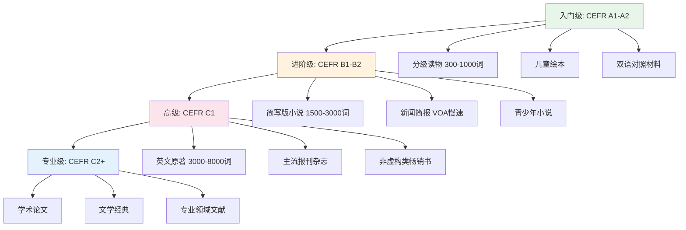
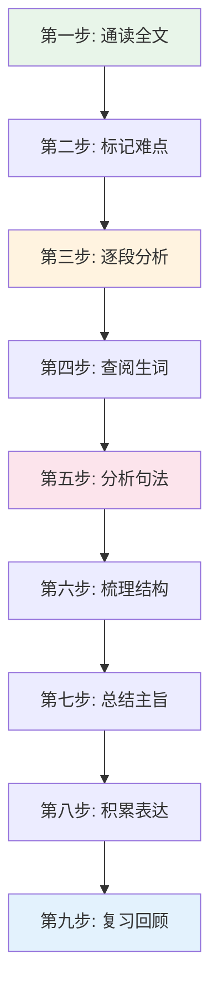
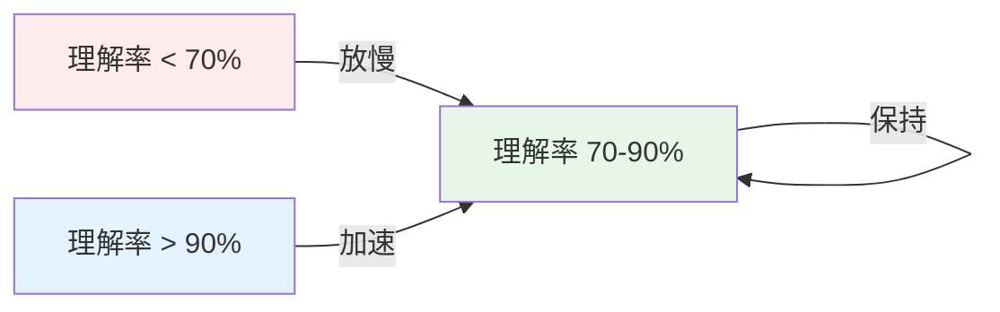
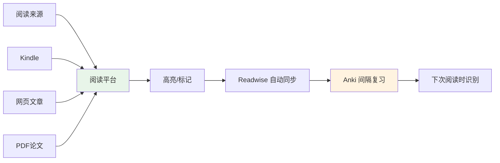
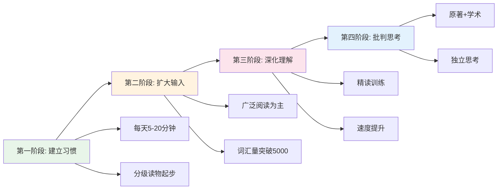

## 四、阅读能力培养

阅读是语言输入的核心通道，也是从"学语言"过渡到"用语言"的关键桥梁。听和说解决的是日常交流，而读和写决定了你能否真正进入目标语言的知识世界——阅读学术论文、欣赏文学作品、理解新闻评论、掌握专业文献。没有阅读能力，你永远只能停留在口语层面的浅层交流。

本章从阅读的科学原理出发，系统讲解分级阅读、阅读策略、速度训练、词汇积累、批判性阅读、数字工具链、阅读习惯养成等完整体系，帮助你从"读不懂"一步步走向"读得快、读得深、读得透"。

---

### 4.1 阅读的认知科学基础

在讨论具体方法之前，先理解大脑如何处理阅读信息，这将帮助你选择更有效的训练策略。

#### 4.1.1 阅读的三层加工模型

大脑处理文字信息分为三个层次：

1. **解码层（Decoding）**：识别字母/单词，建立"符号→语音→意义"的映射。初学者大量认知资源消耗在这一层。
2. **句法层（Syntactic Processing）**：理解句子结构，处理从句、倒装、省略等语法现象。中级学习者的瓶颈常在这里。
3. **语篇层（Discourse Processing）**：把握段落间的逻辑关系、作者意图、文章结构。这是高级阅读的核心能力。

初学者 ──→ 大量精力在解码层，逐词阅读，速度慢
中级者 ──→ 解码自动化，但复杂句法仍需分析
高级者 ──→ 解码+句法自动化，精力集中在语篇理解和批判分析

理解这个模型后，你就知道：**初学者的核心任务是让高频词汇解码自动化，而不是一上来就读原著。**

#### 4.1.2 "i+1"输入假说与阅读

语言学家克拉申（Krashen）的输入假说指出：最有效的语言输入是"i+1"——比你当前水平略高一点的内容。这在阅读中体现得最明显：

- **i-1（太简单）**：不会带来进步，但可以用来培养阅读习惯和速度
- **i+1（略高于当前水平）**：最佳学习区间，有一定挑战但不会完全看不懂
- **i+5（远超当前水平）**：频繁查词，理解碎片化，学习效率极低

关键原则：**宁可读简单的内容读得多，也不要读太难的内容读得痛苦。** 痛苦会摧毁你的阅读动力。

#### 4.1.3 眼动研究揭示的阅读规律

眼动追踪研究发现：

- 熟练阅读者的眼睛不是匀速移动的，而是呈"跳跃-停顿"模式（saccade-fixation）
- 每次停顿（fixation）约200-250毫秒，能处理约1.5个单词
- 初学者停顿次数多、时间长，回视（regression）频繁
- 熟练阅读者停顿次数少、时间短，几乎不回视

这意味着：**阅读速度训练的本质是减少不必要的停顿和回视，而不是单纯"眼睛扫得快"。**

---

### 4.2 分级阅读策略

分级阅读是阅读能力培养的基石。核心思想是：根据自己的实际水平选择材料，既不太简单也不太难，在"学习区"内持续输入。

#### 4.2.1 判断自己的阅读水平

不要凭感觉，用客观标准判断：

| 水平 | 判定标准 | 典型表现 |
|------|----------|----------|
| **舒适区** | 理解率 ≥ 95% | 流畅阅读，几乎不查字典，像读母语一样自然 |
| **学习区** | 理解率 80-95% | 偶尔遇到生词，整体意思把握准确，需要偶尔查词 |
| **恐慌区** | 理解率 < 80% | 频繁卡壳，读完一段仍不清楚说了什么，体验痛苦 |

**自测方法**：随机选一段200词的材料，正常速度阅读，读完后回答：
- 能否用一句话概括这段话的主旨？
- 能否说出3个关键细节？
- 生词率是否低于5%？

如果以上三项都满足，说明材料在你的学习区或舒适区；如果都不满足，说明材料太难了。

#### 4.2.2 分级阅读路线图

以下是英语学习者的典型分级阅读路径（其他语种可类比）：

#### 4.2.3 各级别材料推荐（含具体书单）

**入门级（A1-A2，词汇量 0-1500）：**

| 系列 | 特点 | 推荐理由 |
|------|------|----------|
| Oxford Bookworms Starter | 每本约1000词，含音频 | 经典分级读物，质量稳定 |
| Penguin Readers Level 1 | 每本约500-1000词 | 题材多样，故事性强 |
| I Can Read 系列 | 每页1-3句话，配大图 | 适合零基础，心理压力最小 |
| Side by Side 系列 | 对话为主，语法注释 | 适合自学，结构清晰 |
| 双语对照读物 | 中英文左右对照 | 遇到困难随时参考，减少挫败感 |

**进阶级（B1-B2，词汇量 1500-4000）：**

| 系列 | 特点 | 推荐理由 |
|------|------|----------|
| Oxford Bookworms Level 3-4 | 每本约5000-10000词 | 从简写过渡到原著的桥梁 |
| Penguin Readers Level 3-4 | 简写版经典小说 | 已知故事便于理解 |
| VOA Learning English | 慢速新闻，有文本+音频 | 时事话题，词汇实用 |
| National Geographic Kids | 科普内容，语言简洁 | 培养非虚构类阅读能力 |
| Diary of a Wimpy Kid | 青少年小说，口语化 | 幽默有趣，容易读下去 |

**高级（C1，词汇量 4000-8000）：**

| 材料类型 | 具体推荐 | 特点 |
|----------|----------|------|
| 畅销小说 | Harry Potter, The Hunger Games | 故事性强，语言现代 |
| 科普读物 | Sapiens, Thinking, Fast and Slow | 拓展词汇，提升思维 |
| 新闻杂志 | The Economist, The Atlantic | 地道表达，时事关联 |
| 非虚构 | Malcolm Gladwell 系列 | 叙事风格，可读性强 |
| 短篇小说集 | O. Henry, Roald Dahl 短篇 | 篇幅短，适合碎片时间 |

**专业级（C2+，词汇量 8000+）：**

| 材料类型 | 具体推荐 | 适用场景 |
|----------|----------|----------|
| 学术论文 | 本领域 top 期刊 | 专业发展必需 |
| 文学经典 | 1984, To Kill a Mockingbird | 深度语言素养 |
| 报纸深度报道 | The New York Times 长文 | 训练长文阅读耐力 |
| 专业教材 | 本领域英文原版教材 | 学习+语言双重收益 |

---

### 4.3 阅读策略体系

光有材料不够，还需要正确的策略。以下是从低到高的完整策略体系。

#### 4.3.1 广泛阅读（Extensive Reading）

广泛阅读的核心理念：**量大于精，享受大于分析。**

**操作原则：**

1. **选自己真正感兴趣的材料**——兴趣是最好的驱动力。喜欢科幻就读科幻，喜欢言情就读言情，不要强迫自己读"经典"。
2. **不频繁查字典**——遇到生词先猜，猜不出且影响理解才查。每页查词不超过2-3个。
3. **读完整本/整篇**——培养"一口气读完"的习惯，不要读一半换另一本。
4. **每天至少20分钟**——持续性比单次时长更重要。周末可以多读，但工作日至少保持20分钟。
5. **不要做笔记（除非特别想记）**——广泛阅读的目标是沉浸，频繁中断做笔记会破坏流畅感。

**广泛阅读的科学依据：**

研究（Nation, 2001; Waring & Takaki, 2003）表明，广泛阅读可以：
- 附带习得词汇（无需刻意记忆，在大量重复中自然学会）
- 提升语法直觉（见过足够多正确句子后，"感觉"什么是对的）
- 建立语篇图式（知道不同类型文本的典型结构）
- 提高阅读速度和流畅度

**关键指标：** 一个英语学习者每年阅读量达到100万词（约10-15本中等长度小说），阅读能力会有质的飞跃。

#### 4.3.2 精读（Intensive Reading）

精读的核心理念：**深度大于广度，分析大于感受。**

**精读的完整流程：**

**每一步的具体操作：**

**第一步：通读全文（不查词）**
- 目标：把握文章大意和整体结构
- 时间：2-5分钟（取决于文章长度）
- 问自己：这篇文章讲了什么？作者想表达什么？

**第二步：标记难点**
- 用不同符号标记：生词（下划线）、难句（括号）、好表达（星号）
- 不要在第一遍就停下来分析，保持阅读流

**第三步：逐段分析**
- 每段用一句话概括主旨
- 标注段落间的逻辑关系（因果、转折、递进、举例等）

**第四步：查阅生词**
- 先查影响理解的关键词
- 记录词义、词性、例句、搭配
- 标注这个词在本文中的具体含义（一词多义时）

**第五步：分析句法**
- 选出2-3个复杂句
- 找出主干（主语+谓语+宾语）
- 标注修饰成分（定语从句、状语从句、插入语等）
- 翻译句子，确保完全理解

**第六步：梳理结构**
- 画出文章的结构图（思维导图或大纲）
- 标注引言、论证、转折、结论等部分

**第七步：总结主旨**
- 用3-5句话总结全文
- 提炼作者的核心论点

**第八步：积累表达**
- 选出5-10个值得记忆的表达（短语、搭配、句型）
- 记录到 Anki 或笔记本中
- 为每个表达造一个与自己生活相关的例句

**第九步：复习回顾**
- 3天后再读一遍这篇文章
- 检查标记的生词是否还记得
- 尝试不看笔记复述文章大意

#### 4.3.3 SQ3R 阅读法

SQ3R 是经典的学术阅读方法，特别适合阅读教科书、论文、报告等信息密度高的材料：

| 步骤 | 英文 | 操作 | 目的 |
|------|------|------|------|
| **S** | Survey | 快速浏览标题、小标题、图表、首尾段 | 建立整体框架 |
| **Q** | Question | 把标题变成问题（如"什么是光合作用？"） | 带着目的阅读 |
| **R1** | Read | 带着问题仔细阅读 | 主动寻找答案 |
| **R2** | Recite | 合上书，尝试复述要点 | 检验理解程度 |
| **R3** | Review | 24小时后回顾笔记 | 对抗遗忘曲线 |

**SQ3R 的实际效果：** 研究表明，使用 SQ3R 方法的阅读者比普通阅读者理解率提高 30-40%，记忆保持率提高 50% 以上。

#### 4.3.4 略读与扫读（Skimming & Scanning）

这两种是功能性阅读技巧，在实际生活中使用频率极高：

**略读（Skimming）——快速获取主旨：**
- 只读标题、首段、每段首句、末段
- 关注关键词和转折词（however, but, therefore, in conclusion）
- 速度：每分钟 400-700 词
- 适用场景：浏览新闻、判断文章是否值得细读、快速了解一个话题

**扫读（Scanning）——快速定位信息：**
- 脑中带着明确问题，眼睛快速扫过文本
- 寻找特定信息：人名、数字、日期、关键词
- 速度：每分钟 600-1000 词
- 适用场景：查字典、找特定数据、确认某个事实

**训练方法：**
1. 拿一篇新闻文章，给自己30秒时间，然后合上写出主旨。反复练习直到30秒能准确概括。
2. 拿一份菜单/目录/时刻表，给自己10秒找到特定信息。反复练习提升扫读速度。

---

### 4.4 阅读速度训练

阅读速度直接影响信息获取效率。很多人认为"读得快就读不懂"，但研究表明：**适度提速反而能提升理解率**，因为快速阅读减少了走神和回视。

#### 4.4.1 阅读速度的正常范围

| 水平 | 速度（词/分钟） | 理解率 | 说明 |
|------|-----------------|--------|------|
| 初学者（外语） | 50-100 | 70-80% | 逐词解码阶段 |
| 中级学习者 | 100-200 | 75-85% | 能处理简单句子 |
| 高级学习者 | 200-350 | 80-90% | 接近母语阅读速度 |
| 母语者平均 | 250-350 | 80-90% | 自然阅读速度 |
| 速读训练后 | 400-600 | 70-80% | 牺牲部分理解换速度 |
| 专业速读者 | 600+ | 60-70% | 需要大量训练 |

**重要说明：** 外语阅读速度达到母语者的 60-70% 已经非常优秀。不要追求不切实际的速度目标。

#### 4.4.2 速度训练的具体方法

**方法一：手指/笔引导法**
- 用手指或笔尖沿着文字移动，引导眼睛跟随
- 逐步加快移动速度
- 原理：减少眼睛的无目的跳跃和回视

**方法二：计时阅读**
- 选一篇难度适中的文章（理解率应在 85% 以上）
- 计时阅读，记录用时
- 读完后回答3个理解问题
- 每天练习，逐步提升速度

**方法三：块状阅读**
- 从逐词阅读过渡到"意群"阅读
- 训练眼睛一次看3-5个词，而不是一个词
- 例如：The scientist / who discovered / the new element / won the Nobel Prize
- 长期练习后，意群会越来越大

**方法四：消除默读（Subvocalization）**
- 很多人阅读时会在心里"念出"每个词，这会把阅读速度限制在说话速度
- 训练方法：阅读时嘴里嚼口香糖、数数字、或哼音乐
- 注意：完全消除默读几乎不可能也不必要，目标是减少而非消除

**方法五：限时扫读训练**
- 给自己设定严格的时间限制（如3分钟读完一篇800词文章）
- 时间到就停，不管读到哪里
- 回答理解问题，检查理解率
- 逐步缩短时间或增加文章长度

#### 4.4.3 速度与理解的平衡

**黄金法则：理解率低于 70% 时放慢速度，高于 90% 时加快速度。**

不要为了追求速度而牺牲理解——这没有意义。阅读的最终目的是获取信息和享受内容，不是表演快速扫描。

---

### 4.5 阅读中的词汇策略

词汇量是阅读能力的基础。没有足够的词汇量，再好的阅读策略也无法发挥作用。

#### 4.5.1 词汇量与阅读理解的关系

| 词汇量 | 覆盖率（一般文本） | 阅读体验 |
|--------|-------------------|----------|
| 1,000 词 | ~80% | 频繁卡壳，难以连贯理解 |
| 2,000 词 | ~86% | 能抓住大意，细节大量丢失 |
| 3,000 词 | ~90% | 基本可读，生词影响理解 |
| 5,000 词 | ~95% | 舒畅阅读，偶尔查词 |
| 8,000 词 | ~98% | 自由阅读，几乎无障碍 |
| 15,000 词 | ~99% | 接近母语者水平 |

**关键数据：** 达到 95% 的覆盖率（约5000词），你才能"流畅地"阅读一般文本。低于这个阈值，阅读体验会很痛苦。**所以初期的首要目标是尽快积累到 3000-5000 词汇量。**

#### 4.5.2 阅读中遇到生词的处理策略

不是每个生词都需要查。以下是分层处理策略：

遇到生词
  │
  ├── 是否影响理解核心意思？
  │     ├── 否 → 跳过，继续读
  │     └── 是 ↓
  │
  ├── 能否从上下文猜测？
  │     ├── 能 → 猜测后继续，事后验证
  │     └── 否 ↓
  │
  ├── 这个词是否反复出现（3次以上）？
  │     ├── 否 → 查一下，不强记
  │     └── 是 ↓
  │
  └── 查词典 + 记录到 Anki + 造句

**分层策略的核心思想：** 你的注意力是有限资源，不要把它浪费在低频词上。优先处理高频反复出现的词汇。

#### 4.5.3 如何在阅读中高效积累词汇

**策略一：语境记忆法**
- 不要孤立地记单词，要记住整个搭配和语境
- 例：不要只记 "reluctant = 不情愿的"
- 而要记 "reluctant to admit = 不情愿承认" + 原文例句

**策略二：词汇笔记本模板**

每遇到一个值得记录的词汇，填写以下信息：

单词: reluctant /rɪˈlʌktənt/
词性: adjective
释义: 不情愿的，勉强的
搭配: reluctant to do sth, reluctant agreement
原文例句: She was reluctant to admit her mistake.
自造例句: I was reluctant to wake up early on Sunday.
同义词: unwilling, hesitant
反义词: willing, eager
来源: The Economist, 2024-03-15

**策略三：间隔重复 + 阅读结合**
- 在 Anki 中记录生词时，除了词义，还要附上阅读中遇到的原文
- 每天复习 Anki（10-15分钟）
- 同时保持每天的阅读量——Anki 复习是巩固，阅读是自然复习

**策略四：主题词汇网络**
- 按主题组织词汇，而不是按字母顺序
- 例如：读了一篇关于气候变化的文章，把相关词汇集中在一起：
  - carbon emissions, greenhouse effect, renewable energy, fossil fuel, sustainability, deforestation, biodiversity...

---

### 4.6 批判性阅读

高级阅读不仅要"读懂"，还要"读透"——理解作者的意图、评估论证的逻辑、形成自己的判断。

#### 4.6.1 批判性阅读的核心问题

每读一篇文章，尝试回答以下问题：

| 层次 | 问题 | 目的 |
|------|------|------|
| **表层** | 作者说了什么？ | 理解内容 |
| **意图** | 作者为什么这么说？ | 识别目的 |
| **逻辑** | 作者的论证是否有道理？ | 评估论证 |
| **立场** | 作者站在什么角度？ | 识别偏见 |
| **价值** | 这篇文章对我有什么用？ | 个人应用 |

#### 4.6.2 识别常见的逻辑谬误

在阅读议论性文章时，注意识别以下常见谬误：

| 谬误类型 | 英文名 | 举例 |
|----------|--------|------|
| 人身攻击 | Ad Hominem | "他是个商人，所以他的观点不可信" |
| 稻草人谬误 | Straw Man | 歪曲对方观点后攻击 |
| 诉诸权威 | Appeal to Authority | "爱因斯坦也这么说"（但讨论的不是物理） |
| 以偏概全 | Hasty Generalization | "我认识的两个程序员都秃顶，所以程序员都会秃顶" |
| 滑坡谬误 | Slippery Slope | "允许A就会导致B，最终导致灾难C" |
| 虚假二分 | False Dichotomy | "你要么支持我们，要么反对我们" |
| 循环论证 | Circular Reasoning | "这是真的因为书上写了，书上写的因为这是真的" |

识别这些谬误不仅是阅读能力的体现，更是独立思考的基础。

#### 4.6.3 不同文体的阅读策略

不同类型的文本需要不同的阅读策略：

**新闻报道：**
- 关注 5W1H（Who, What, When, Where, Why, How）
- 区分事实（fact）和观点（opinion）
- 注意信息来源的可靠性
- 对比多家媒体的报道角度

**学术论文：**
- 先读摘要和结论，判断是否值得细读
- 关注研究方法是否严谨
- 注意样本量和统计显著性
- 查看引用文献，追溯知识脉络

**文学作品：**
- 关注叙事视角（第一人称/第三人称/全知视角）
- 分析人物动机和关系
- 注意象征、隐喻、意象
- 思考作品的时代背景和社会意义

**技术文档：**
- 先看目录和结构
- 关注操作步骤和注意事项
- 实际动手验证
- 记录关键命令和配置

---

### 4.7 数字工具链

现代阅读离不开数字工具。以下工具可以大幅提升阅读效率和词汇积累效果。

#### 4.7.1 阅读平台

| 工具 | 平台 | 特点 | 适用场景 |
|------|------|------|----------|
| Kindle | 全平台 | 内置词典、生词本、进度追踪 | 长篇阅读首选 |
| 微信读书 | iOS/Android/网页 | 中英文切换方便、社交功能 | 中英对照阅读 |
| Apple Books | iOS/macOS | 系统集成好 | Apple 生态用户 |
| Pocket | 全平台 | 稍后阅读、离线保存 | 网文收藏 |
| Instapaper | 全平台 | 阅读模式、高亮批注 | 深度阅读网文 |
| Feedly | 全平台 | RSS 订阅聚合 | 定期阅读新闻博客 |

#### 4.7.2 词汇管理工具

| 工具 | 核心功能 | 推荐理由 |
|------|----------|----------|
| Anki | 间隔重复记忆卡片 | 科学记忆，自定义强 |
| Readwise | 聚合高亮、间隔复习 | 自动同步 Kindle 等平台的高亮 |
| 欧路词典 | 多词典查词、生词本 | 支持导入第三方词典 |
| 有道词典 | 快速查词、例句丰富 | 中文用户最熟悉的词典 |
| Vocabulary.com | 语境学习、自适应测试 | 游戏化学习体验 |

#### 4.7.3 推荐的工具组合工作流

**具体操作流程：**

1. **日常阅读**：用 Kindle 或微信读书阅读，遇到生词长按查词，有价值的句子高亮
2. **自动同步**：Readwise 每天自动同步高亮内容
3. **生成卡片**：Readwise 将高亮转化为 Anki 卡片（可设置自动导入）
4. **间隔复习**：每天花 10-15 分钟用 Anki 复习
5. **周回顾**：每周日回顾本周的阅读高亮，整理笔记

---

### 4.8 阅读习惯养成

知道方法不等于能做到。阅读能力的提升最终取决于你能否养成长期稳定的阅读习惯。

#### 4.8.1 启动阅读习惯的最低门槛

不要一开始就定"每天读1小时"的目标，这太大了。从**每天5分钟**开始：

| 阶段 | 目标 | 时长 | 策略 |
|------|------|------|------|
| 第1周 | 每天5分钟 | 7天 | 选最简单的材料，降低心理阻力 |
| 第2-3周 | 每天10分钟 | 14天 | 固定时间（如睡前） |
| 第4-6周 | 每天15分钟 | 21天 | 开始尝试略难的材料 |
| 第7周+ | 每天20-30分钟 | 持续 | 已成习惯，自然延长 |

**关键原则：** 宁可读5分钟也不要跳过一天。连续性比时长重要100倍。

#### 4.8.2 绑定触发场景

将阅读绑定到已有的日常习惯上：

- **通勤时** → 手机上读新闻或电子书
- **午休前** → 读10分钟 Kindle
- **睡前** → 读纸质书或 Kindle（避免手机蓝光）
- **等人时** → 手机上读 Pocket 收藏的文章
- **健身时** → 听有声书（也算广义的"阅读"输入）

#### 4.8.3 阅读追踪与反馈

**方法一：阅读日志**

每天记录：
日期: 2026-06-24
材料: Sapiens, Chapter 3
时长: 25分钟
页数: 12页
生词数: 8个
感受: 今天读到了农业革命的内容，比想象中有趣

**方法二：阅读量追踪**

- 用 Goodreads 追踪已读/在读/想读书目
- 用 Kindle 的阅读统计功能查看年度阅读量
- 设定年度目标（如：一年读完20本英文书）

**方法三：输出倒逼输入**

- 每读完一章，写3句话总结
- 每读完一本书，写一篇200字书评
- 参加线上读书会，定期分享阅读心得

#### 4.8.4 克服常见的阅读障碍

| 障碍 | 原因 | 解决方案 |
|------|------|----------|
| "读不下去" | 材料太难或不感兴趣 | 换更简单/更感兴趣的材料 |
| "读了就忘" | 只读不复习、不做笔记 | 建立复习系统（Anki + 周回顾） |
| "没有时间" | 没有固定阅读时间 | 绑定触发场景，从5分钟开始 |
| "速度太慢" | 词汇量不足或过度精读 | 先扩大词汇量，练习略读 |
| "看懂了但不会用" | 只输入不输出 | 写书评、做笔记、造句练习 |
| "中途放弃" | 目标太大，坚持不住 | 降低目标，加入读书社群 |

---

### 4.9 阅读能力的进阶路径

当你已经能够流畅阅读一般材料后，可以向更高层次发展。

#### 4.9.1 从分级读物到原著的过渡

这是很多学习者的"卡点"——分级读物读得很顺，但一翻开原著就懵了。

**过渡策略：**

1. **选择已知故事的原著**：读过中文版的书，再去读英文原著。你知道情节，理解压力大幅降低。
2. **从现代畅销书开始**：当代作者的语言更简洁直白，比19世纪经典容易得多。
3. **接受不完美理解**：读原著不需要100%理解，80%的理解率就可以享受故事。
4. **先读短篇再读长篇**：短篇小说（3000-10000词）是理想过渡材料。
5. **同一作者读多本**：熟悉一个作者的风格后，阅读速度会越来越快。

#### 4.9.2 平行阅读法

同时阅读同一主题的中英文材料，互相印证：

- 先读中文版，了解核心概念和术语
- 再读英文版，关注表达方式和术语的英文对应
- 对比两种语言处理同一主题的不同方式

这种方法特别适合学术类和专业类材料。

#### 4.9.3 深度阅读的"洋葱模型"

第一层：字面理解 —— 作者说了什么？
第二层：推理理解 —— 作者暗示了什么？
第三层：批判评估 —— 作者说得对不对？
第四层：创意联结 —— 这和我已知的有什么关系？
第五层：个人转化 —— 这如何改变我的想法和行为？

大多数学习者停留在第一、二层。要达到真正的高级阅读能力，需要训练自己进入第三、四、五层。

#### 4.9.4 多语种阅读能力的迁移

如果你已经掌握了一门外语的阅读能力，学习第二门外语的阅读会快得多：

- **元认知策略可迁移**：略读、扫读、猜词等策略是通用的
- **跨语言词汇关联**：英语-法语、英语-西班牙语有大量同源词
- **阅读耐力可迁移**：你已经习惯了"读不懂"的感觉，心理抗压能力更强
- **学习方法可复用**：分级阅读、Anki、Readwise 等工具链可以直接复用

---

### 4.10 常见误区与纠正

| 误区 | 为什么是错的 | 正确做法 |
|------|-------------|----------|
| "每个生词都要查" | 破坏阅读流，效率极低 | 只查影响理解的关键词 |
| "必须读经典名著" | 19世纪语言晦涩，容易放弃 | 先读现代作品，有兴趣再读经典 |
| "精读比泛读重要" | 没有大量输入，精读是空中楼阁 | 泛读为主，精读为辅（7:3） |
| "读得快就理解不好" | 研究表明适度提速反而提升理解 | 在理解率70-90%的范围内练习 |
| "只读不说写也没关系" | 输出是检验和巩固输入的最佳方式 | 阅读后写总结、书评、讨论 |
| "中文翻译帮助理解" | 长期依赖翻译会阻碍外语思维 | 逐步减少翻译，用英英词典 |
| "反复读同一本书浪费时间" | 重复阅读对初学者是高效的词汇巩固方式 | 同一本好书读2-3遍很有价值 |
| "看美剧=阅读训练" | 听觉输入和视觉输入是不同的能力 | 看剧练听力，阅读另需专门训练 |

---

### 4.11 实操模板

#### 模板一：每日阅读计划表

【每日阅读计划】
目标语言: 英语
当前水平: B1
今日材料: Oxford Bookworms Level 3 - "The Phantom of the Opera"
计划时长: 25分钟
阅读策略: 广泛阅读 + 标记生词

阅读前:
- 今天的状态(1-10): ___
- 今天的目标: 读完 Chapter 3

阅读后:
- 实际时长: ___分钟
- 读完页数: ___
- 遇到生词数: ___
- 查了几个词: ___
- 理解率自评(1-10): ___
- 今日收获: ___

#### 模板二：精读笔记模板

【精读笔记】
文章标题: ___
来源: ___
日期: ___

1. 主旨概括(3句话以内):
   ___

2. 文章结构:
   - 引言: ___
   - 论点1: ___
   - 论点2: ___
   - 论点3: ___
   - 结论: ___

3. 值得学习的表达(5-10个):
   | 表达 | 释义 | 原文例句 | 自造例句 |
   |------|------|----------|----------|
   | | | | |

4. 复杂句分析(2-3句):
   原句: ___
   主干: ___
   修饰: ___
   翻译: ___

5. 我的思考:
   - 我同意/不同意作者的观点，因为 ___
   - 这让我联想到 ___
   - 我可以在 ___ 场景中应用这个观点

#### 模板三：月度阅读追踪表

【月度阅读追踪】
月份: ___
目标: 读完 ___ 本书/ ___ 篇文章

| # | 书名/文章 | 开始日期 | 完成日期 | 类型 | 评分 | 备注 |
|---|----------|----------|----------|------|------|------|
| 1 | | | | | | |
| 2 | | | | | | |
| 3 | | | | | | |

本月统计数据:
- 总阅读时长: ___小时
- 总阅读页数: ___页
- 新学词汇: ___个
- 阅读笔记: ___篇

下月改进计划:
- ___

---

### 4.12 本章小结

阅读能力培养的核心路径可以总结为四个阶段：

**记住三个核心原则：**

1. **量变引起质变**——没有足够的阅读量，任何技巧都是空谈。先读起来，读得多。
2. **兴趣是最好的老师**——读你感兴趣的内容，不要强迫自己读"应该读"的内容。
3. **系统比意志力可靠**——建立工具链（Kindle + Readwise + Anki）和触发场景（通勤、睡前），让阅读成为自动行为，而不是每天都要靠意志力去做的事。

阅读能力是所有语言能力中最值得投资的一项——它带来的不仅是语言进步，更是知识获取能力的质的飞跃。

***
