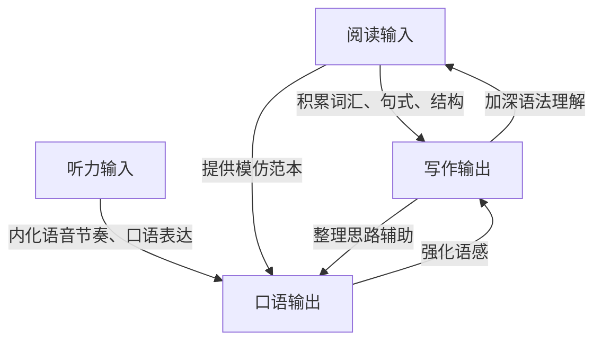
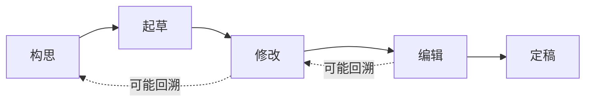

## 五、写作能力培养

写作是外语学习四项基本技能中最难自学的一项——它不像听力和阅读有大量现成材料，也不像口语可以靠环境沉浸自然习得。写作要求学习者同时调动语法、词汇、逻辑、修辞和文化知识，将被动语言能力转化为主动输出。正因如此，写作能力的高低是衡量外语综合水平的硬指标：一个人能听懂、读懂多少，只是输入储备；能写出什么，才真正反映他的语言掌控力。

本章从写作的认知本质出发，逐层展开写作能力的完整体系，覆盖从句子到篇章、从应试到专业、从模仿到创造的全部进阶路径。

### 5.1 写作能力的认知本质

#### 5.1.1 为什么写作最难

语言习得研究者 Stephen Krashen 提出"输入假说"（Input Hypothesis），认为可理解性输入（comprehensible input）是语言习得的核心。但后续研究者如 Merrill Swain 提出"输出假说"（Output Hypothesis），强调只有当学习者被迫产出语言时，才能真正内化语法规则、发现自身知识缺口。

写作的难度在于它是一个**同时多任务处理**过程：

| 认知层次 | 需要处理的任务 | 初学者的瓶颈 |
|---------|--------------|------------|
| 构思层 | 确定主题、组织论点、规划结构 | 想法模糊，不知从何下笔 |
| 组句层 | 选择词汇、构建语法、安排语序 | 频繁查词典，句式单调 |
| 组段层 | 逻辑衔接、段落展开、过渡自然 | 段落松散，缺乏连贯性 |
| 修辞层 | 风格选择、读者意识、语域恰当 | 不懂正式/非正式文体差异 |
| 修改层 | 检查错误、优化表达、打磨细节 | 不知道如何自我修改 |

母语写作者已经在潜意识中完成了前三个层次的自动化，可以把认知资源集中在构思和修辞上。而外语学习者的每一层都需要有意识地处理，这就像同时下五盘棋。

理解这一点很重要——它意味着写作训练必须**分层进行**，不能一上来就要求"写一篇好文章"。你必须先把句子写对，才能考虑段落；先把段落写好，才能构建篇章。

#### 5.1.2 写作与其他技能的关系

写作不是孤立的技能，它和听、说、读有深层联动：



具体联动关系：

- **读→写**：阅读是写作最直接的输入来源。你读到的句式、搭配、篇章结构，都会成为写作的素材库。大量研究表明，广泛阅读者的写作质量显著高于非阅读者——不是因为他们"学了语法"，而是因为他们在语境中内化了语言模式。
- **写→读**：写作过程中遇到的困难（"我想表达这个意思，但不知道怎么说"）会反过来提高阅读时的敏感度，让你在阅读中更关注表达方式。
- **听→写**：听力训练中的跟读和听写练习，能帮助你建立英语的韵律感，这种韵律感会让写出来的句子更自然。
- **说→写**：口语中的即兴组织能力可以迁移到写作中——很多高水平写作者在正式写作前会先用口语"说一遍"，把口语草稿整理成书面语。

**实操建议**：不要把写作当作独立模块来练。每天读20分钟英文→读完后用3句话总结→把3句话扩写成一段话，这就是读写联动的最简训练链。

### 5.2 写作能力的层次模型

#### 5.2.1 六级能力阶梯

写作能力的进阶不是线性的，更像螺旋上升。以下六级模型覆盖从零基础到专业写作者的完整路径：

| 级别 | 能力描述 | 典型产出 | 参考水平 |
|------|---------|---------|---------|
| L1 造句级 | 写出语法基本正确的单句 | 10-15词的简单句 | CEFR A1-A2 |
| L2 组段级 | 写出有中心思想的段落 | 80-150词的段落 | CEFR A2-B1 |
| L3 成篇章级 | 写出结构完整的短文 | 200-400词的完整文章 | CEFR B1-B2 |
| L4 论证级 | 写出逻辑严密的议论文 | 400-800词的深度论述 | CEFR B2-C1 |
| L5 风格级 | 根据语境灵活切换文体 | 学术论文/商务邮件/创意写作 | CEFR C1-C2 |
| L6 专业级 | 具备发表级写作能力 | 期刊文章/商业报告/文学创作 | 接近母语水平 |

每个级别都有明确的能力边界和训练重点：

- **L1→L2**：核心任务是语法准确和基本词汇扩展。瓶颈在于时态、冠词、介词等基础语法点。
- **L2→L3**：核心任务是学习段落展开和文章结构。瓶颈在于逻辑连贯性和过渡词使用。
- **L3→L4**：核心任务是论证深度和批判性思维。瓶颈在于"有观点但说不深"。
- **L4→L5**：核心任务是文体意识和语域切换。瓶颈在于不知道不同文体的规范。
- **L5→L6**：核心任务是精确性、原创性和专业深度。瓶颈在于"能写对但写不出彩"。

#### 5.2.2 自我评估方法

在开始训练前，先确定自己的级别。以下是快速评估方法：

**L1 测试**：用英语写5个句子，描述你今天的早餐。如果能写出"I had eggs and bread for breakfast this morning."这类句子，没有严重语法错误，你已达到L1。

**L2 测试**：用英语写一段100词左右的文字，描述你最喜欢的电影。如果段落有明确主题、2-3个支撑点、基本的连接词，你已达到L2。

**L3 测试**：用英语写一篇300词的短文，讨论"远程办公的优缺点"。如果文章有引言、正文（至少2个段落）、结论，论点有论据支撑，你已达到L3。

**L4 测试**：用英语写一篇500词的议论文，论点为"大学教育是否仍然值得"。如果能提出明确立场、使用具体数据/案例支撑、预判并回应反方观点，你已达到L4。

如果你在某个测试中感到力不从心，那就是你的训练起点。从这个级别开始，不要跳级——基础不牢，越级训练只会强化错误习惯。

### 5.3 写作过程：五步工作法

#### 5.3.1 写作不是"一次性写好"

很多学习者对写作的误解是：拿到题目→从头写到尾→检查一遍→交稿。这种"一次性写好"的模式在母语写作中都很难做到，在外语写作中几乎不可能产出高质量作品。

专业写作者遵循的是**过程写作法**（Process Approach），将写作拆解为五个阶段：



每个阶段的认知任务完全不同，分开处理才能让每个环节都做到位。

#### 5.3.2 第一步：构思（Prewriting）

构思阶段的目标是**把脑子里的想法倒出来**，不要考虑语法、拼写、格式。常见方法：

**头脑风暴法**：在纸中央写下主题，然后向四周延伸关联想法。比如主题是"学习外语的好处"，你可能想到：career（职业）、travel（旅行）、brain（大脑健康）、culture（文化理解）、salary（薪资提升）——这些就是你的潜在论点。

**提问法**：用5W1H提问来拓展思路：

- What：我想讨论什么？
- Why：为什么这个话题重要？
- Who：谁会受影响？
- When：这个问题在什么时候最突出？
- Where：在什么背景下发生？
- How：如何解决或应对？

**提纲法**：直接列出文章的骨架。一个好的提纲长这样：

```text
Topic: Should universities offer more online courses?
Thesis: Yes, but with important limitations.

I. Introduction
   - Hook: COVID accelerated online education
   - Thesis statement

II. Benefits of online courses
   - Accessibility (rural students, disabled students)
   - Flexibility (working students, parents)
   - Cost reduction (no physical infrastructure)

III. Limitations
   - Hands-on subjects (lab, art, medicine)
   - Social development concerns
   - Digital divide

IV. Balanced approach
   - Hybrid model
   - Investment in platform quality
   - Teacher training

V. Conclusion
   - Restate thesis
   - Call to action
```

**关键原则**：构思阶段产出的不是成品，是原材料。写得粗糙没关系，重要的是把思路理清楚。

#### 5.3.3 第二步：起草（Drafting）

起草阶段的目标是**把提纲扩展成完整段落**。在这个阶段，你终于可以开始写完整的句子了，但仍然不要过度纠结于完美。

起草阶段的核心技巧：

- **先写你最有把握的部分**。不必从引言开始——如果你对正文段落更有想法，先写正文。
- **每个段落只讲一个核心观点**。如果你发现一个段落里塞了两个观点，拆成两段。
- **暂时用简单句也行**。复杂句式可以在修改阶段再升级。先把意思表达出来。
- **标记你不确定的地方**。遇到不会的词或拿不准的语法，用方括号标记（如 [这个词怎么说？]），继续往下写。

**字数参考**：一篇IELTS大作文（250词要求）的起草时间建议控制在20-25分钟；一篇TOEFL独立写作（300词要求）建议25-30分钟。初学者可以适当放宽。

#### 5.3.4 第三步：修改（Revising）

修改是写作中最被低估的环节。很多学习者的"修改"只是检查拼写和语法——这不是修改，是校对。真正的修改关注的是**内容和结构**：

**修改清单（逐条检查）**：

| 检查项 | 具体问题 | 修改方法 |
|--------|---------|---------|
| 中心论点 | 文章的核心观点是否清晰？读者能否一句话概括你的立场？ | 如果不能，重写论点句 |
| 论证充分性 | 每个论点是否有具体证据支撑？ | 补充数据、案例、引用 |
| 逻辑连贯性 | 段落之间是否有逻辑关系？ | 添加过渡句或调整段序 |
| 段落聚焦 | 每段是否只有一个中心？ | 删除偏题内容或拆分段落 |
| 冗余删除 | 有没有说了等于没说的废话？ | 精简，每句话都要有信息量 |
| 观点平衡 | 是否考虑了反方观点？ | 添加让步段或让步句 |

**实操技巧——大声朗读**：把写好的文章大声读出来。你的耳朵会比眼睛更敏锐地捕捉到不通顺的地方。如果某句话读起来磕磕绊绊，它在纸面上也不会好看。

**反向提纲法**：写完初稿后，不看原文，为你的文章列一个新的提纲。然后对比你构思阶段的提纲——如果两个提纲差异很大，说明你的写作偏离了原始意图。

#### 5.3.5 第四步：编辑（Editing）

编辑才关注语言层面的准确性。此时文章的内容和结构已经稳定，你只需要打磨语言。

**编辑重点清单**：

1. **语法错误**：时态一致性、主谓一致、代词指代明确
2. **词汇精准度**：近义词区分（如 affect/effect, rise/raise）
3. **句式多样性**：是否有过多简单句？穿插复合句和复杂句
4. **连接词使用**：过渡是否自然，连接词是否准确
5. **格式规范**：标点、大小写、段落缩进

**常见语法错误速查表**：

| 错误类型 | 典型错误 | 正确写法 |
|---------|---------|---------|
| 时态混乱 | Yesterday I go to school. | Yesterday I went to school. |
| 主谓不一致 | The group of students are studying. | The group of students is studying. |
| 冠词缺失 | I want to buy car. | I want to buy a car. |
| 介词错误 | I am interested on music. | I am interested in music. |
| 句子碎片 | Because I was tired. | I went to bed early because I was tired. |
| 逗号拼接 | I was tired, I went to bed. | I was tired, so I went to bed. / I was tired; I went to bed. |
| 悬垂修饰语 | Walking to school, the rain started. | Walking to school, I got caught in the rain. |

#### 5.3.6 第五步：定稿与复盘

定稿不是结束——写完后的复盘才是能力增长的关键。

**复盘步骤**：

1. **保存所有版本**：用版本号命名（essay_v1, essay_v2），这样你能看到自己的修改轨迹。
2. **记录高频错误**：建立一个"我的错误清单"，每次写作后更新。大多数学习者反复犯同样的错误——如果你知道自己常犯 run-on sentences，下次写完后专门检查这一项。
3. **对比范文**：找一篇同主题的高分范文，对比差距。不是抄，是分析范文在论证深度、句式变化、词汇选择上的优势。
4. **提取新表达**：从阅读材料和范文中提取3-5个新的表达方式，下次写作时强制自己使用至少2个。

### 5.4 分层训练方案

#### 5.4.1 L1-L2：句子与段落训练

**阶段目标**：从写对句子到写好段落。

**训练1：句型替换练习**

同一个意思用5种不同的句式表达。这能打破"一种句式打天下"的惯性。

```text
原句：Technology has changed our lives significantly.

替换1（被动）：Our lives have been significantly changed by technology.
替换2（强调句）：It is technology that has changed our lives significantly.
替换3（倒装）：So significant has the change been that technology has reshaped our daily routines.
替换4（分词结构）：Having changed our lives significantly, technology continues to evolve.
替换5（名词化）：Technology has brought about significant changes to our lives.
```

每周做3次，每次改写5个句子，坚持一个月后你的句式库会显著扩大。

**训练2：段落展开模板**

初学者最实用的段落模板——**TEEL结构**：

```text
T - Topic Sentence（主题句）：I believe remote work offers significant advantages.
E - Explanation（解释）：Working from home eliminates commuting time and provides 
     a flexible schedule.
E - Evidence（证据）：According to a 2023 Stanford study, remote workers were 
     13% more productive than their in-office counterparts.
L - Link（链接回主题）：Therefore, remote work should be considered a viable 
     long-term option for many industries.
```

用TEEL结构每天写1个段落（80-120词），持续2周。每写完一段，自查四要素是否齐全。

**训练3：改写练习**

选择一段中文新闻，先自己翻译成英文，再对照官方英文版。这种"试错→对比→修正"的循环，比单纯背诵有效得多。推荐材料：中国日报双语版（China Daily Bilingual）。

#### 5.4.2 L2-L3：篇章构建训练

**阶段目标**：从写好段落到构建完整文章。

**训练1：文章骨架速写**

拿到题目后，只用5分钟写提纲（不写正文）。提纲要求：有明确的论点句（thesis statement），至少3个分论点，每个分论点下列出1个支撑证据。这种"只练骨架"的训练能快速提高你的构思速度。

**训练2：限时完整写作**

模仿考试环境：

| 练习类型 | 时间 | 字数 | 频率 |
|---------|------|------|------|
| IELTS Task 2 | 40分钟 | 250+词 | 每周2篇 |
| TOEFL独立写作 | 30分钟 | 300+词 | 每周2篇 |
| 自由话题 | 45分钟 | 400+词 | 每周1篇 |

**训练3：三段式议论文模板**

适用于大多数标准化考试和日常议论文写作：

```text
第一段：引言
  - 背景句（Background）：提供话题背景
  - 争议句（Debate）：引出不同观点
  - 论点句（Thesis）：表明你的立场

第二段：正方论证
  - 分论点1 + 具体例证
  - 分论点2 + 具体例证
  - （可选）让步 + 反驳

第三段：结论
  - 重述论点（换一种表达方式）
  - 总结关键论据
  - 建议或展望
```

#### 5.4.3 L3-L4：论证深化训练

**阶段目标**：从"能写"到"写得有深度"。

这个阶段的核心瓶颈不再是语法和词汇，而是**思维深度**。很多B2水平的学习者写出的文章"骨架完整但血肉单薄"——有论点但论据不足，有观点但缺乏分析。

**训练1：PEEL深度论证法**

比TEEL更进一层——加入分析（Analysis）环节：

```text
P - Point（论点）：Social media has a negative impact on teenagers' mental health.
E - Evidence（证据）：A 2023 meta-analysis in The Lancet found that adolescents 
     spending more than 3 hours daily on social media had double the risk of 
     depression.
E - Explanation（分析）：This correlation likely stems from constant social 
     comparison and the curated nature of online personas, which creates 
     unrealistic standards.
L - Link（回扣）：These findings suggest that parents and educators should 
     actively monitor and limit teenagers' social media consumption.
```

关键差异在Explanation——不是简单重复证据，而是分析"为什么"和"意味着什么"。

**训练2：反方论证练习**

每篇议论文必须包含一个让步段（concession paragraph），展示你考虑了反方立场：

```text
Admittedly, social media also offers benefits for teenagers. Platforms 
like YouTube provide educational content, and online communities can offer 
support for isolated youth. However, these benefits do not outweigh the 
well-documented mental health risks, especially when the platforms are 
designed to maximize engagement rather than user well-being.
```

这个结构（让步→转折→强化己方）是学术写作和高水平议论文的标配。

**训练3：数据引用训练**

学会在写作中引用具体数据和研究，这是从"泛泛而谈"到"有理有据"的关键跳跃：

```text
普通写法：Many people use social media.
数据写法：As of 2024, approximately 5.04 billion people worldwide use social 
media, representing 62.3% of the global population (DataReportal, 2024).

普通写法：Online learning is becoming more popular.
数据写法：The global e-learning market is projected to reach $400 billion by 
2026, up from $200 billion in 2019 (Research and Markets, 2022).
```

**练习方法**：每周选一个热门话题，搜索3-5个相关数据或研究报告，用这些数据写一篇400词的短文。

#### 5.4.4 L4-L5：文体切换训练

**阶段目标**：根据不同目的和读者调整写作方式。

到了这个阶段，你需要学会的不是"怎么写"，而是"为谁写"和"为什么写"。同一话题在不同文体中的写法完全不同：

**文体对比示例——主题：人工智能对就业的影响**

| 维度 | 学术论文 | 新闻报道 | 商务邮件 | 博客文章 |
|------|---------|---------|---------|---------|
| 语气 | 客观、正式 | 中立、简洁 | 礼貌、直接 | 亲切、个人化 |
| 人称 | 第三人称 | 第三人称 | 第一/第二人称 | 第一/第二人称 |
| 句式 | 复杂长句为主 | 短句为主 | 适中 | 口语化 |
| 词汇 | 专业术语 | 平实用语 | 商务用语 | 日常用语+比喻 |
| 开头 | Research on X has shown... | New study reveals... | I am writing to... | So I've been thinking about... |
| 证据 | 学术引用（APA格式） | 采访/数据 | 行业报告 | 个人经历/链接 |

**学术写作训练**：

学术写作有严格的规范。以下是核心要素：

```text
IMRaD 结构（实证论文）：
- Introduction：研究背景、问题陈述、研究意义
- Methods：研究方法、样本、数据来源
- Results：研究发现、数据呈现
- Discussion：结果分析、局限性、未来方向
```

学术写作中最常见的错误是**口语化倾向**。对照修正：

| 口语化表达 | 学术表达 |
|-----------|---------|
| a lot of | numerous / a considerable number of |
| get better | improve / enhance |
| think that | argue that / contend that |
| big | significant / substantial |
| show | demonstrate / indicate / reveal |
| thing | factor / element / component |

**商务写作训练**：

商务邮件是职场中最常用的写作形式。核心原则是 **BLUF**（Bottom Line Up Front）——先说结论，再给理由：

```text
差的写法：
Dear Mr. Smith,
I hope this email finds you well. I wanted to reach out regarding the 
project we discussed last week. There have been some developments that 
I think are worth mentioning...

好的写法：
Dear Mr. Smith,
The Q3 marketing report is ready for your review. [Attached]
Key findings: 15% increase in lead generation, 8% drop in conversion.
I recommend we adjust the targeting strategy before Q4.
Would you have 30 minutes this Thursday to discuss?

Best regards,
[Name]
```

#### 5.4.5 L5-L6：专业写作训练

**阶段目标**：达到发表级写作水平。

这个阶段的训练核心是**精确性**和**原创性**。你不再是"能表达清楚就行"，而是追求"用最精确的词、最恰当的结构、最有力的修辞"。

**训练1：精确用词练习**

同义词之间存在微妙的语义和语用差异。练习方法：选一个核心词（如"说"），列出所有同义词并标注使用场景：

```text
say    - 中性，最通用
state  - 正式，用于声明立场
claim  - 暗示可能有争议
argue  - 学术常用，有论据支撑的主张
assert - 强调自信和坚定
contend - 学术，强调在争议中坚持
maintain - 强调持续持有的观点
allege - 法律用语，未经证实的说法
purport - 带有怀疑色彩的声称
```

**训练2：风格模仿**

选一位你喜欢的英文作者，逐段分析其写作特征，然后模仿其风格写一篇自己的文章。推荐模仿对象：

| 作者 | 风格特征 | 适合练习方向 |
|------|---------|------------|
| George Orwell | 简洁、直白、有力 | 清晰表达 |
| Joan Didion | 精确、冷静、意象丰富 | 文学性散文 |
| Malcolm Gladwell | 叙事驱动、案例丰富 | 通俗解释复杂概念 |
| The Economist | 紧凑、机智、数据密集 | 分析性写作 |
| Tim Urban (Wait But Why) | 幽默、深入浅出、图文并茂 | 长文科普 |

**训练3：编辑别人的文章**

找一篇中等水平的英文文章（可以用AI生成一篇故意写得不太好的），逐句修改。给别人改文章比给自己改文章更有效——因为你不会有"写的时候觉得挺好"的认知偏差。

### 5.5 不同写作类型的专项训练

#### 5.5.1 描写文（Descriptive Writing）

描写文的核心是**Show, don't tell**——用具体的感官细节让读者"看到"场景，而不是告诉读者"这里很美"。

```text
Telling: The restaurant was nice.
Showing: Candlelight flickered across white tablecloths while the 
aroma of freshly baked bread drifted from the open kitchen.

Telling: She was nervous.
Showing: She tapped her foot under the table, her fingers 
fidgeting with the edge of her napkin as she glanced toward the door 
for the third time in two minutes.
```

**训练方法**：每天选一个日常场景（公交站、咖啡馆、卧室），用100词描写，要求至少涉及3种感官（视觉、听觉、嗅觉、触觉、味觉）。

#### 5.5.2 记叙文（Narrative Writing）

记叙文的核心是**结构**和**张力**。最基本的叙事结构：

```text
1. Setting（背景设定）：时间、地点、人物
2. Conflict（冲突/问题）：发生了什么？
3. Rising Action（发展）：情况如何变化？
4. Climax（高潮）：最关键的时刻
5. Resolution（结局）：问题如何解决？
6. Reflection（反思）：你学到了什么？
```

**训练方法**：用这个结构重述你最近经历过的一件事（如一次旅行、一次面试、一次误会），控制在300词以内。记住：不是流水账，要有冲突和转折。

#### 5.5.3 说明文（Expository Writing）

说明文的核心是**清晰**和**有序**。常见组织模式：

| 组织模式 | 适用场景 | 信号词 |
|---------|---------|--------|
| 时间顺序 | 历史事件、流程说明 | first, then, next, finally |
| 空间顺序 | 场景描述、地理介绍 | above, below, to the left, nearby |
| 因果分析 | 解释原因和结果 | because, therefore, as a result |
| 比较对比 | 分析异同 | similarly, however, on the other hand |
| 问题-解决方案 | 提出并解决问题 | the problem is, one solution is |
| 分类 | 将事物分组说明 | types of, categories of, falls into |

**训练方法**：选一个你熟悉的技术概念（如"什么是DNS"、"咖啡的制作过程"），用以上任一模式写一篇200词的说明文。难度在于用简单的语言解释复杂的概念。

#### 5.5.4 议论文（Argumentative Writing）

议论文是学术和职业写作中最常见的类型。除了前面介绍的论证方法，这里补充几个高级技巧：

**修辞诉求三要素（Aristotle's Appeals）**：

- **Ethos（人格诉求）**：建立你的可信度。引用权威来源、展示专业知识、承认局限性。
- **Pathos（情感诉求）**：触动读者的情感。使用具体的人的故事、生动的描写。
- **Logos（逻辑诉求）**：用逻辑和证据说服。数据、统计、因果推理。

优秀的议论文三者兼备，但以Logos为根基——没有逻辑支撑的情感煽动是宣传，不是论证。

**论证谬误自查表**：

| 谬误类型 | 错误示例 | 修正方法 |
|---------|---------|---------|
| 稻草人谬误 | "反对远程办公的人就是想控制员工" | 准确呈现对方观点 |
| 滑坡谬误 | "允许在家工作就会导致公司崩溃" | 论证每一步的因果关系 |
| 诉诸权威 | "爱因斯坦也这么说" | 引用相关领域的权威 |
| 以偏概全 | "我认识的人都不喜欢在线教育" | 提供代表性样本数据 |
| 虚假二分法 | "要么支持AI要么被淘汰" | 承认中间立场 |

### 5.6 写作素材与语料积累

#### 5.6.1 建立个人语料库

高水平写作者都有一个秘密武器：**个人语料库**——一个由你从阅读中积累的好句子、好搭配、好结构组成的数据库。

**语料库结构建议**：

```text
my_writing_corpus/
├── sentence_patterns/    # 句式模板
│   ├── opening.txt       # 好的开头句
│   ├── transition.txt    # 过渡句
│   ├── conclusion.txt    # 结论句
│   └── emphasis.txt      # 强调句
├── collocations/         # 搭配词组
│   ├── academic.txt      # 学术搭配
│   ├── business.txt      # 商务搭配
│   └── casual.txt        # 日常搭配
├── vocabulary/           # 精准词汇
│   ├── verbs.txt         # 精准动词
│   ├── adjectives.txt    # 精准形容词
│   └── adverbs.txt       # 精准副词
└── templates/            # 文体模板
    ├── essay.txt
    ├── email.txt
    └── report.txt
```

**积累方法**：每次阅读时，遇到让你觉得"写得真好"的句子，摘抄到对应文件中。每周复习一次，尝试在自己的写作中使用其中的2-3个。

#### 5.6.2 高频写作搭配

以下是按场景分类的高频搭配，可以直接用于写作：

**学术写作高频搭配**：

| 搭配 | 含义 | 例句 |
|------|------|------|
| conduct a study | 进行研究 | We conducted a study on... |
| shed light on | 阐明 | This finding sheds light on... |
| take into account | 考虑到 | Taking into account the limitations... |
| point to | 指向/表明 | The results point to a correlation... |
| call for | 呼吁/要求 | These findings call for further research. |
| give rise to | 导致/引起 | This practice gives rise to concerns... |
| in the wake of | 在……之后 | In the wake of the pandemic... |

**议论文高频搭配**：

| 搭配 | 含义 | 例句 |
|------|------|------|
| make a compelling case | 有力地论证 | The author makes a compelling case for... |
| weigh the pros and cons | 权衡利弊 | Before deciding, we must weigh the pros and cons. |
| bear in mind | 记住 | It is important to bear in mind that... |
| by the same token | 同样地 | By the same token, we should also consider... |
| turn a blind eye to | 对……视而不见 | We cannot turn a blind eye to this issue. |
| leave much to be desired | 有很多不足 | The current approach leaves much to be desired. |

#### 5.6.3 连接词与过渡表达完整清单

连接词是文章的"粘合剂"——用对了读者觉得文章流畅自然，用错了读起来磕磕绊绊。以下按功能分类：

| 功能 | 连接词 | 使用注意 |
|------|--------|---------|
| 补充 | furthermore, moreover, in addition, additionally, besides, also | furthermore比morever更正式 |
| 对比 | however, nevertheless, nonetheless, on the other hand, in contrast, conversely | however可放句首或句中 |
| 因果 | therefore, thus, hence, consequently, as a result, accordingly | thus比therefore更正式 |
| 举例 | for example, for instance, such as, to illustrate, namely | such as后接名词短语，不接完整句 |
| 让步 | although, despite, in spite of, admittedly, granted | despite后接名词/动名词，不接句子 |
| 总结 | in conclusion, to sum up, in summary, overall, all things considered | 避免用"In a nutshell"（过于口语化） |
| 递进 | not only...but also, what is more, more importantly | not only放句首需要倒装 |
| 时序 | subsequently, meanwhile, thereafter, previously, formerly | 书面语用subsequently不用then |
| 强调 | indeed, in fact, notably, particularly, especially | indeed可放句首表强调 |
| 类比 | similarly, likewise, in the same way, by the same token | likewise比similarly更正式 |

### 5.7 AI时代的写作能力

#### 5.7.1 AI写作工具的正确使用姿势

ChatGPT、Claude、Grammarly等AI工具已经彻底改变了写作生态。问题是：用AI辅助写作是作弊吗？答案取决于你怎么用。

**有害用法**（会让你的写作能力退化）：
- 让AI直接生成整篇文章然后提交
- 不看AI的修改建议，直接接受
- 从此不再自己思考结构和论点

**有益用法**（会加速你的进步）：
- **写作前**：让AI帮你头脑风暴论点和论据（但你自己选择和组织）
- **写作后**：让AI检查语法错误，但自己决定是否修改
- **对比学习**：自己写一篇→让AI也写一篇→对比差异，分析AI的结构和用词
- **解释语法规则**：把你的错误句子发给AI，让它解释为什么错

**关键原则**：AI是教练，不是代笔。你可以让教练指出你的问题、示范正确动作，但上场比赛必须自己来。

#### 5.7.2 用AI进行写作对话训练

一个高效的训练方法是**和AI进行写作对话**：

```text
Prompt：I wrote this paragraph about climate change. Please:
1. Rate it from 1-10 on clarity, logic, and vocabulary
2. Point out specific weaknesses
3. Suggest 3 alternative ways to express my main argument
4. Rewrite the weakest sentence

[your paragraph]
```

这种交互式训练比自己闷头写效率高很多——相当于有一个24小时在线的英语写作教练。

### 5.8 写作反馈系统

#### 5.8.1 反馈来源与优先级

| 反馈来源 | 可靠度 | 成本 | 适合阶段 |
|---------|--------|------|---------|
| 专业写作教师 | ★★★★★ | 高 | L3+，需要系统指导时 |
| 母语者语言交换伙伴 | ★★★★ | 中（时间） | L2+，日常练习 |
| AI写作助手（ChatGPT等） | ★★★★ | 低 | 所有阶段 |
| 语法检查工具（Grammarly） | ★★★ | 低 | L1+，基础纠错 |
| 在线写作社区 | ★★★ | 中 | L3+，需要多元视角 |
| 自我评估（对照清单） | ★★ | 低 | 所有阶段，日常训练 |

#### 5.8.2 建立反馈循环

最有效的反馈系统是一个**定期循环**：

```text
周一：写一篇短文（300词）
周二：用AI检查，分析反馈，记录错误类型
周三：根据反馈重写，对比两个版本
周四：请语言伙伴或AI评估修改版
周五：将本周新学到的表达加入语料库
周末：复习本周错误清单，总结进步
```

#### 5.8.3 从反馈中学习的正确方式

很多学习者收到反馈后只是"改了就算了"。这样反馈的价值只用了30%。

**正确的反馈处理流程**：

1. **分类**：把错误归类（语法类？词汇类？逻辑类？结构类？）
2. **找规律**：同一类错误出现了几次？是偶发还是系统性问题？
3. **追根溯源**：为什么犯这个错？是不知道规则，还是知道但用不出来？
4. **针对性练习**：针对这个错误类型做专项练习
5. **验证**：下次写作时专门注意这个点，看是否改善

### 5.9 常见误区与纠正

#### 误区一：用中文思维写英文

这是中国学习者最常见的问题。典型表现：

```text
中文思维：With the development of society, more and more people begin to 
realize the importance of education.

问题：这是典型的中式英语套话，"随着社会的发展"是中文作文的惯用开头。
英语母语者几乎不会这样写。

修改：Education has become a central concern for policymakers worldwide, 
driven by shifting economic demands and technological change.
```

**纠正方法**：多读英文原版材料，积累"英语人怎么开头"。中文作文喜欢从大背景说起，英文作文喜欢直接切入核心论点。

#### 误区二：追求长句和大词

很多学习者认为"用越长的句子和越高级的词汇，作文分数越高"。这是错的。

```text
过度复杂：The implementation of technological advancements in the realm of 
educational pedagogy has precipitated a paradigm shift in the modality 
through which knowledge is disseminated.

清晰表达：Technology has transformed how we teach and learn.
```

George Orwell 的写作六条原则中，最重要的一条就是：**如果能用短词，就不要用长词**。清晰永远比花哨更重要。

#### 误区三：背模板但不理解逻辑

很多应试学习者背了大量的"万能模板"，但不理解模板背后的逻辑。结果是：换一个题目就不会用了，或者用出来生硬牵连。

**正确做法**：理解模板的**功能**而非记忆模板的**文字**。比如"让步段"的功能是"承认对方有道理但己方更有道理"——理解了这个功能，你可以用任何表达方式实现它，不需要背固定句型。

#### 误区四：只写不改

"写完就扔"是写作进步最大的敌人。一篇作文如果不经过修改，你只练习了50%的能力（构思和起草），漏掉了另外50%（修改和编辑）。

**纠正**：养成"一文三改"的习惯——初稿完成后至少修改三遍，分别关注内容、结构和语言。

#### 误区五：忽视阅读输入

"我要提高写作，所以我要多写"——这逻辑只对了一半。写作是输出，输出的质量取决于输入的储备。没有大量阅读积累的写作，就像没有食材的厨房——技术再好也做不出好菜。

**建议配比**：阅读时间应该至少是写作时间的3倍。如果你每天花30分钟写作，就应该花90分钟阅读。

### 5.10 工具与资源推荐

#### 5.10.1 写作辅助工具

| 工具 | 功能 | 适用阶段 | 费用 |
|------|------|---------|------|
| Grammarly | 语法检查、风格建议 | 所有阶段 | 免费基础版 |
| Hemingway Editor | 检测句子复杂度、可读性评分 | L3+ | 免费网页版 |
| Ludwig.guru | 查找权威语境中的用法 | L3+ | 免费基础版 |
| COCA（美国当代英语语料库）| 查询词频和搭配 | L4+ | 免费 |
| Write & Improve (Cambridge) | AI评分+即时反馈 | L1-L4 | 免费 |
| Quillbot | 改写/同义替换 | L3+ | 免费基础版 |

#### 5.10.2 学习课程与书籍

| 资源 | 类型 | 适合级别 | 重点 |
|------|------|---------|------|
| *On Writing Well* - William Zinsser | 书 | L4+ | 非虚构写作的圣经 |
| *The Elements of Style* - Strunk & White | 书 | L3+ | 简洁写作的黄金法则 |
| *They Say / I Say* - Graff & Birkenstein | 书 | L3-L4 | 学术论证模板 |
| *Academic Writing for Graduate Students* - Swales & Feak | 书 | L5+ | 学术写作系统教程 |
| Coursera: Academic English (UCI) | 课程 | L2-L4 | 系统学术写作训练 |
| edX: English for Journalists (Berkeley) | 课程 | L4+ | 新闻写作专项 |

#### 5.10.3 在线写作社区

- **Lang-8 / HiNative**：母语者免费修改你的文章（你也修改别人的中文文章作为交换）
- **r/WriteStreakEN**：Reddit上的每日英文写作打卡社区
- **Write & Improve**：剑桥大学开发的AI评分系统，给出即时反馈
- **Daily Page**：每天推送一个写作提示，养成写作习惯

### 5.11 进阶：写作的底层能力

#### 5.11.1 批判性思维

写作的上限不取决于你的英语水平，而取决于你的思维水平。一个人如果用中文也写不出有深度的文章，换成英文只会更差。

批判性思维的核心训练：

- **区分事实和观点**："地球绕太阳转"是事实；"远程办公更好"是观点。写作中必须明确标注哪些是事实、哪些是你的判断。
- **识别隐含前提**：每个论证都有前提假设。"AI会取代很多工作"的前提假设是"技术发展速度超过劳动力适应速度"——找到这个前提，你就能找到反驳或支持的关键。
- **多角度看问题**：对任何话题，强迫自己写出正反两方各3个论点。这能防止你陷入思维定式。

#### 5.11.2 逻辑组织能力

逻辑组织不是英语问题，是思维习惯。训练方法：

- **每天做一次"一分钟论证"**：选一个随机话题（如"纸质书vs电子书"），在一分钟内在脑中构建：立场→3个论点→各1个论据。这种思维体操能显著提高你写作时的构思速度。
- **画思维导图**：在写任何文章之前，先画一张思维导图。这比线性提纲更能展示观点之间的关系。
- **练习"所以呢？"追问**：写下任何一个论点后，问自己"所以呢？这意味着什么？对谁有什么影响？"这种追问能让你的论证层层深入。

#### 5.11.3 跨文化写作意识

用英语写作时，你面对的可能是来自不同文化背景的读者。需要注意：

- **避免文化特定表达**：不写"这让我想到了屈原"——你的读者可能不知道屈原是谁。
- **注意敏感话题**：种族、宗教、政治话题在不同文化中的敏感度不同。
- **明确标注文化背景**：如果必须引用文化特定内容，简要解释背景。"In Chinese culture, the color red symbolizes luck and prosperity, which is why..."
- **数据和案例的通用性**：优先使用国际知名的数据和案例，而非只有一小部分读者能理解的例子。

### 5.12 本节小结

写作能力的培养是一个**长期、系统、分层**的过程。不存在"背了模板就能写好"的捷径，但存在"正确方法+持续练习=稳步进步"的确定路径。

**核心要点回顾**：

1. **分层训练**：从句子到段落到篇章，每个阶段打好基础再进入下一阶段
2. **过程写作**：构思→起草→修改→编辑→复盘，五步缺一不可
3. **读写联动**：阅读是写作最重要的输入来源，读写比至少3:1
4. **反馈循环**：定期获取反馈、分析错误规律、针对性改进
5. **思维先行**：写作的上限是思维能力，先练思维再练表达
6. **工具善用**：AI是教练不是代笔，用它加速学习而非替代学习

**每周写作训练计划模板**（根据个人水平调整强度）：

| 日期 | 训练内容 | 时间 | 备注 |
|------|---------|------|------|
| 周一 | 阅读+摘抄语料 | 40分钟 | 读1篇好文章，抄5个好句子 |
| 周二 | 句式/段落专项练习 | 30分钟 | TEEL/PEEL段落写作 |
| 周三 | 限时完整写作 | 40分钟 | 模拟考试环境 |
| 周四 | 修改+AI反馈 | 30分钟 | 对照修改清单逐项检查 |
| 周五 | 文体切换练习 | 30分钟 | 同一话题不同文体 |
| 周末 | 复盘+语料库更新 | 20分钟 | 更新错误清单和语料库 |

坚持三个月，你的写作能力会有质的飞跃。坚持一年，你将能用英语自信地表达任何想法。
