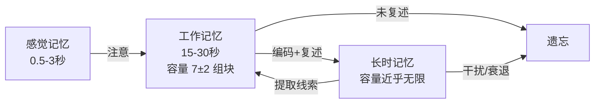
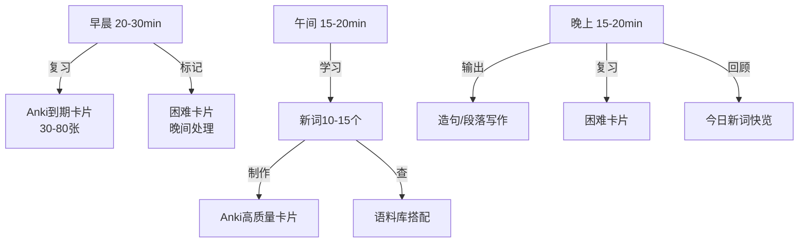

## 六、词汇积累方案

词汇是语言的建筑材料。没有足够的词汇量，语法再熟练也无法表达复杂思想；没有词汇深度，认识再多单词也无法地道使用。词汇积累不是"背单词"这么简单——它涉及认知科学、记忆心理学和语言学的交叉领域。本方案从词汇学习的认知原理出发，提供一套系统化、可落地的词汇积累体系。

### 6.1 词汇知识的完整图景

#### 6.1.1 词汇量的标准与分层

词汇量不是单一维度的数字。Nation（2001）在《Learning Vocabulary in Another Language》中指出，"认识"一个单词至少包含三个层次：

1. **形式层**：拼写、发音、重音位置
2. **意义层**：核心义、引申义、多义关系
3. **用法层**：词性、搭配、语域（正式/非正式）、语用规则

英语常用词汇量参考（基于BNC语料库词频统计）：

| 水平 | 词汇量 | 覆盖率 | 能力描述 | 典型考试对标 |
|------|--------|--------|----------|-------------|
| 入门 | 1,000-2,000 | ~85% 口语文本 | 基础生存交流 | CEFR A1-A2 |
| 初级 | 2,000-3,000 | ~90% 口语文本 | 日常话题交流 | CET-4 基础 |
| 中级 | 4,000-6,000 | ~95% 口语，~90% 报刊 | 一般阅读与工作沟通 | CET-4/CET-6 |
| 中高级 | 8,000-10,000 | ~98% 口语，~95% 报刊 | 流利交流、学术入门 | IELTS 6.5-7.0 |
| 高级 | 15,000-20,000 | ~98% 报刊 | 专业阅读、学术写作 | IELTS 7.5+，GRE |
| 母语水平 | 20,000-35,000 | ~99%+ | 原著阅读、专业讨论 | — |

**关键洞察**：从0到3,000词覆盖了约90%的日常口语，这意味着入门阶段的投入产出比最高。但覆盖率是非线性的——从95%提升到98%所需的词汇量，几乎等于前面所有词汇的总和。

#### 6.1.2 接受性词汇 vs 产出性词汇

词汇知识分为两个维度：

- **接受性词汇（Receptive Vocabulary）**：阅读和听力中能识别的词汇
- **产出性词汇（Productive Vocabulary）**：口语和写作中能主动使用的词汇

一般而言，接受性词汇量是产出性词汇量的2-3倍。许多学习者的瓶颈不是"认识的词太少"，而是"能用的词太少"。解决方案是**从输入到输出的刻意转化**——这正是本方案的核心设计逻辑。

#### 6.1.3 词汇深度 vs 词汇广度

词汇广度（breadth）是"认识多少词"，词汇深度（depth）是"对每个词了解多深"。Read（2004）提出的词汇深度知识框架包含：

| 维度 | 具体内容 | 举例（以 "run" 为例） |
|------|---------|---------------------|
| 多义性 | 一词多义的不同义项 | run a business / run fast / a run of bad luck |
| 搭配 | 常见共现词汇 | run a risk / run errands / in the long run |
| 同义/反义 | 语义网络中的位置 | jog, sprint（近义）；stop（反义） |
| 词族 | 派生形式 | runner, running, runaway |
| 语域 | 使用场合限制 | "commence"（正式）vs "start"（通用） |
| 语用 | 语境中的隐含意义 | "That's a great idea"（讽刺时含义相反） |

**结论**：高效的词汇学习不只是"背更多单词"，而是对每个已知单词进行"深度加工"。

### 6.2 词汇习得的认知科学基础

#### 6.2.1 记忆的三级模型

理解记忆机制，才能设计有效的学习策略：

- **感觉记忆**：大量信息涌入，只有被"注意"的才进入工作记忆
- **工作记忆**：容量有限（Miller, 1956: 7±2 个组块），是学习的瓶颈
- **长时记忆**：容量近乎无限，但需要有效的编码才能存入，需要提取线索才能调用

**词汇学习的核心挑战**：如何将新词从工作记忆有效地编码到长时记忆中，并建立足够多的提取线索。

#### 6.2.2 遗忘曲线与间隔重复

Ebbinghaus（1885）的遗忘曲线表明：

- 学习后20分钟：遗忘42%
- 学习后1小时：遗忘56%
- 学习后1天：遗忘66%
- 学习后1周：遗忘75%
- 学习后1个月：遗忘79%

间隔重复（Spaced Repetition）的科学原理：在即将遗忘时复习，用最小的时间成本维持最长的记忆保持。每次成功回忆都会延长下一次遗忘的时间间隔。

典型的间隔重复时间表：

| 复习轮次 | 间隔时间 | 累计学习后 |
|---------|---------|-----------|
| 第1次复习 | 学习后 1 天 | 第 1 天 |
| 第2次复习 | 3 天后 | 第 4 天 |
| 第3次复习 | 7 天后 | 第 11 天 |
| 第4次复习 | 14 天后 | 第 25 天 |
| 第5次复习 | 30 天后 | 第 55 天 |
| 第6次复习 | 60 天后 | 第 115 天 |

#### 6.2.3 深度加工理论

Craik & Lockhart（1972）的加工层次理论（Levels of Processing）指出：对信息加工越深，记忆越持久。

浅层加工（效果差）→ 深层加工（效果好）：

| 加工层次 | 操作 | 效果 |
|---------|------|------|
| 浅层：视觉 | 看单词拼写 | 短暂 |
| 中层：语音 | 朗读发音 | 中等 |
| 中层：语义 | 查中文意思 | 较好 |
| 深层：联想 | 与个人经验关联 | 持久 |
| 深层：生成 | 用新词造句写作 | 最持久 |
| 深层：情感 | 与情感体验绑定 | 极持久 |

**实操意义**：背单词时不要只是"看-读-记"，而要问自己："这个词和我的生活有什么关系？我能用它描述什么？"——这种自我参照效应（Self-Reference Effect）能显著提升记忆效果。

### 6.3 高效词汇学习的六维策略

#### 6.3.1 策略一：语境化学习（Contextual Learning）

**原理**：孤立的单词如同没有地址的房屋——大脑无法将其定位到已有的知识网络中。语境提供了"地址信息"，让新词能够嵌入到已有的语义网络。

**具体做法**：

1. **例句学习法**：每个新词至少配2个例句，分别展示不同义项或搭配
   - 学习 "address"：
     - 例句1（地址）：What's your home address?
     - 例句2（处理）：We need to address this issue immediately.
     - 例句3（演讲）：The president will address the nation tonight.

2. **段落阅读法**：选择略高于当前水平的阅读材料（生词率3-5%），在自然阅读中遇到新词时标记，读完后集中处理
   - 推荐材料来源：BBC Learning English、VOA慢速英语、Graded Readers分级读物

3. **词汇笔记本法**：建立个人词汇笔记本（纸质或电子），每条记录包含：
   ┌─────────────────────────────────────────┐
   │ 单词：elaborate                          │
   │ 发音：/ɪˈlæbərət/ (adj) /ɪˈlæbəreɪt/ (v)│
   │ 词性：adj. 精心制作的；v. 详细阐述        │
   │ 例句：Could you elaborate on that point?  │
   │ 搭配：elaborate on / elaborate plan        │
   │ 词族：elaborately(adv) elaboration(n)     │
   │ 联想：labor(劳动)→ 花费大量劳动 → 精心的  │
   │ 日期：2024-03-15  来源：TED Talk #1234     │
   └─────────────────────────────────────────┘

#### 6.3.2 策略二：词族网络学习法

**原理**：一个英语词根平均可以派生出6-12个常用词。学习词族而非单个词，能以几何级数扩大词汇量。

**实操：词族扩展模板**

以词根 "struct"（建造）为核心：

struct（建造）
├── structure (n.) 结构 → restructure (v.) 重组
├── construct (v.) 建造 → construction (n.) 建设 → constructive (adj.) 建设性的
├── destruct (v.) 毁坏 → destruction (n.) 破坏 → destructive (adj.) 破坏性的
├── instruct (v.) 指导 → instruction (n.) 指令 → instructor (n.) 讲师
└── obstruct (v.) 阻碍 → obstruction (n.) 障碍

一次学习 = 掌握10+个相关词汇，效率提升10倍。

**核心词根速查表**（每个词根附带5+派生词）：

| 词根 | 含义 | 派生词示例 |
|------|------|-----------|
| duct/duc | 引导 | conduct, produce, introduce, education, reduce, deduce |
| spect/spic | 看 | inspect, respect, perspective, spectator, suspect, conspicuous |
| port | 携带 | transport, export, import, report, portable, support |
| scrib/script | 写 | describe, prescribe, manuscript, inscription, subscribe |
| vert/vers | 转 | convert, reverse, diverse, controversy, universe, divert |
| mit/miss | 送 | submit, commit, permit, mission, dismiss, transmit |
| cept/ceiv | 拿取 | accept, concept, receive, perceive, deceive, intercept |
| ject | 投掷 | reject, project, inject, subject, object, eject |
| tract | 拉 | attract, extract, contract, distract, subtract, abstract |
| pos/pon | 放置 | compose, deposit, expose, oppose, propose, postpone |

**核心前缀速查表**：

| 前缀 | 含义 | 示例 |
|------|------|------|
| un- | 否定/相反 | unhappy, unable, undo, uncover, unusual |
| re- | 再次/回 | rewrite, review, return, recover, rebuild |
| pre- | 之前 | preview, predict, prepare, prevent, precede |
| dis- | 否定/分离 | disagree, disappear, disconnect, discover, distribute |
| inter- | 之间 | international, internet, interact, interpret, intervene |
| trans- | 跨越 | transport, transform, translate, transfer, transplant |
| mis- | 错误 | mistake, misunderstand, mislead, misfortune |
| over- | 过度 | overcome, overlook, overestimate, overwork |
| sub- | 下方/次级 | subway, submarine, submit, substitute, subsequent |
| super- | 上方/超越 | supervise, supernatural, superb, superficial |
| anti- | 反对 | antibiotic, antibody, antisocial, anticipate |
| co-/com-/con- | 共同 | cooperate, compose, connect, collaborate, communicate |

**核心后缀速查表**：

| 后缀 | 词性转换 | 示例 |
|------|---------|------|
| -tion/-sion | → 名词 | education, decision, communication, conclusion |
| -ful | → 形容词（充满） | beautiful, helpful, wonderful, meaningful |
| -less | → 形容词（无） | careless, homeless, useless, regardless |
| -ly | → 副词 | quickly, carefully, happily, effectively |
| -ize/-ise | → 动词 | organize, realize, memorize, analyze |
| -ment | → 名词 | development, achievement, agreement, movement |
| -ness | → 名词 | happiness, kindness, awareness, loneliness |
| -able/-ible | → 形容词（可…的） | readable, flexible, accessible, responsible |
| -ous/-ious | → 形容词 | dangerous, curious, obvious, ambitious |
| -er/-or | → 名词（人/物） | teacher, actor, computer, monitor |
| -ist | → 名词（…主义者） | scientist, artist, specialist, economist |
| -al | → 形容词/名词 | natural, national, approval, arrival |

#### 6.3.3 策略三：间隔重复系统（SRS）深度使用

**工具选择**：

| 工具 | 优势 | 劣势 | 适用场景 |
|------|------|------|---------|
| Anki | 高度可定制，算法成熟，社区牌组丰富 | 界面学习曲线陡峭 | 重度用户、长期备考 |
| 墨墨背单词 | 中文界面，内置词书，遗忘曲线可视化 | 自定义空间较小 | 中国英语学习者 |
| Quizlet | 界面友好，支持多人协作 | 免费版有广告 | 团队学习、短期突击 |
| RemNote | 结合笔记与SRS | 功能较复杂 | 需要笔记+背词一体化 |

**Anki 卡片设计最佳实践**：

卡片设计的质量直接决定复习效果。低质量的卡片会让SRS形同虚设。

❌ 错误卡片设计：
  正面：aberration
  背面：偏差，脱离常规

✅ 正确卡片设计：
  正面：The test results were an _______ from the expected pattern.
        (aberration)
  背面：aberration /ˌæbəˈreɪʃn/ n. 偏差，异常
        搭配：an aberration from
        词族：aberrant (adj.) 异常的
        记忆：ab(离开) + err(错误) + ation → 走偏了 → 偏差
        例句：This was no aberration — it reflected a systemic problem.

**高质量卡片的五要素**：
1. **完整句子填空**（而非裸词）：提供语境线索
2. **发音标注**：避免"看得懂但听不出"的问题
3. **搭配信息**：知道怎么用，而不只是什么意思
4. **记忆辅助**：词根拆解、谐音联想、图像关联
5. **第二个例句**：展示不同用法或语境

**每日SRS工作流**：

早上（20-30分钟）：
  1. 复习Anki推送的所有到期卡片（通常30-80张）
  2. 对"困难"卡片做标记，稍后处理

新词学习（15-20分钟）：
  3. 学习10-15个新词
  4. 为每个新词制作高质量卡片
  5. 在Anki中创建新卡片

晚上（5-10分钟）：
  6. 复习早上标记的"困难"卡片
  7. 快速浏览今天学的新词

#### 6.3.4 策略四：输出驱动的词汇激活

**原理**：被动词汇转为主动词汇的关键是"使用"。Laufer & Hulstijn（2001）的"投入量假设"（Involvement Load Hypothesis）指出：任务对词汇的投入量（需求、搜索、评估）越高，词汇习得效果越好。

**输出练习的三个层次**：

| 层次 | 活动 | 投入量 | 效果 |
|------|------|--------|------|
| 初级 | 用新词造句 | ★★☆ | 基本掌握用法 |
| 中级 | 用5-10个新词写一段话 | ★★★ | 建立词汇间的连接 |
| 高级 | 用新词写日记/短文/对话 | ★★★★ | 真实场景激活 |
| 最高 | 口语中即时使用新词 | ★★★★★ | 产出性词汇转化 |

**实操模板：每日词汇输出练习**

【造句练习】从今天学的10个新词中，选出5个，各造一个与自己生活相关的句子。

例：
1. elaborate - I need to elaborate my plan before presenting it to the team.
2. subsequent - The subsequent meeting confirmed our decision was right.
3. ambiguous - His ambiguous reply left everyone confused.
4. mitigate - We should mitigate the risks before launching the product.
5. prevalent - Remote work has become prevalent since the pandemic.

【段落练习】用剩余5个新词写一段100词左右的短文，主题不限。

【口语练习】找语伴或录音App，用今天学的3个新词进行2分钟独白。

#### 6.3.5 策略五：主题式词汇集群学习

**原理**：大脑倾向于将信息组织为"图式"（schema）。将词汇按主题聚类学习，能利用已有的知识框架来"挂载"新词汇，显著提升记忆效率。

**主题词汇集群示例：工作场景**

面试求职                    日常办公                    职场社交
├── resume/CV              ├── deadline               ├── colleague
├── cover letter           ├── agenda                 ├── supervisor
├── qualification          ├── presentation           ├── networking
├── interview              ├── spreadsheet            ├── collaborate
├── negotiate salary       ├── quarterly report       ├── mentor
└── offer letter           └── overtime               └── team building

会议讨论                    项目管理                    绩效评估
├── brainstorm             ├── milestone              ├── feedback
├── action items           ├── deliverable            ├── appraisal
├── consensus              ├── timeline               ├── promotion
├── minutes                ├── budget                 ├── incentive
├── postpone               ├── scope creep            ├── KPI
└── adjourn                └── stakeholder            └── appraisal

**推荐主题清单**（按优先级排序）：
1. 日常生活（饮食、购物、交通、天气）
2. 工作职场（见上方示例）
3. 科技互联网（AI、区块链、云计算、网络安全）
4. 社会话题（教育、医疗、环保、经济）
5. 学术写作（论证、引用、方法论、结论）
6. 文化娱乐（电影、音乐、体育、旅行）

#### 6.3.6 策略六：多感官通道整合

**原理**：Paivio（1986）的双重编码理论指出，同时使用语言通道和视觉通道编码信息，记忆效果比单一通道高50%以上。

**多感官学习清单**：

| 感官通道 | 具体操作 | 工具 |
|---------|---------|------|
| 视觉 | 看单词拼写、颜色标记、思维导图 | Anki图片卡、思维导图软件 |
| 听觉 | 听标准发音、跟读、听写 | Forvo、YouGDict、有声词典 |
| 动觉 | 手写单词、打字默写 | 纸笔、键盘打字练习 |
| 语义 | 查词源、联想画面、造句 | Etymonline、词源词典 |
| 情感 | 与个人经历关联、编故事 | 自由联想、个人日记 |

**实操：多感官学习一个新词的完整流程**（以 "perseverance" 为例）：

Step 1 - 视觉输入：看到这个单词，注意拼写结构
        per-se-ver-ance（4个音节）

Step 2 - 听觉输入：在Forvo或有声词典中听发音 /ˌpɜːsɪˈvɪərəns/
        跟读3遍，注意重音在第三个音节

Step 3 - 语义加工：拆解词根
        per(彻底) + severe(严格的) + ance(名词后缀)
        → 彻底严格地坚持 → 毅力、锲而不舍

Step 4 - 语境理解：
        "Perseverance is not a long race; it is many short races one after another."
        — Walter Elliot

Step 5 - 个人关联：
        想想自己坚持做某件事的经历（备考、健身、学编程）
        用perseverance描述那个过程

Step 6 - 产出练习：
        写一个句子：Learning English requires perseverance, 
        but the rewards are worth every effort.

Step 7 - 多媒体强化：
        搜索perseverance相关的TED演讲或名人名言
        在Anki卡片中添加图片或音频

### 6.4 词汇积累的工具生态

#### 6.4.1 查词工具

| 工具 | 特色 | 适用场景 |
|------|------|---------|
| 欧路词典 | 离线词库、多词典切换、生词本 | 日常查词首选 |
| Cambridge Dictionary Online | 英英释义精准、有发音和例句 | 中高级学习者 |
| Merriam-Webster | 美式英语权威、词源信息丰富 | 美式英语学习者 |
| Longman Dictionary | 用2000词定义所有词汇、搭配信息详尽 | 英英释义入门 |
| YouGlish | 搜索YouTube中单词的真实发音语境 | 发音和语境学习 |
| Etymonline | 英语词源学权威网站 | 词根词源研究 |

#### 6.4.2 语料库工具

语料库是词汇深度学习的秘密武器：

| 工具 | 用途 | 网址 |
|------|------|------|
| COCA（美国当代英语语料库） | 查看词频、搭配、语域分布 | corpus.byu.edu |
| BNC（英国国家语料库） | 英式英语用法参考 | corpus.byu.edu |
| Ludwig.guru | 搜索权威出版物中的例句 | ludwig.guru |
| SkELL | 基于语料库的例句和搭配推荐 | skell.sketchengine.eu |

**语料库使用示例**：在COCA中搜索 "commit" 的搭配，你会发现：
- commit a crime（最常见搭配）
- commit suicide
- commit to something（承诺）
- commit resources/funds（投入资源）

这种基于真实语料的搭配信息，比任何词典都更全面、更准确。

#### 6.4.3 阅读中的词汇积累工具

| 工具 | 功能 | 平台 |
|------|------|------|
| Readlang | 点击网页中的单词即显示翻译，自动保存到词汇库 | 浏览器扩展 |
| LingQ | 导入文章，标注已知/未知词，追踪学习进度 | Web/App |
| Kindle 内置词典 | 阅读英文原著时长按查词，自动记录"生词本" | Kindle 设备/APP |
| 浏览器扩展（如沙拉查词） | 网页划词翻译，支持多词典对比 | Chrome/Firefox |

### 6.5 词汇学习的每日计划与长期规划

#### 6.5.1 每日词汇学习流程（推荐时间：45-60分钟）

#### 6.5.2 长期词汇量增长规划

| 阶段 | 目标词汇量 | 每日新词 | 预计用时 | 重点策略 |
|------|-----------|---------|---------|---------|
| 第1-3月 | 0→2,000 | 15-20词/天 | 60min/天 | 高频词+基础词根词缀 |
| 第4-8月 | 2,000→5,000 | 12-15词/天 | 50min/天 | 主题词汇+搭配学习 |
| 第9-14月 | 5,000→8,000 | 10-12词/天 | 45min/天 | 阅读驱动+词汇深度 |
| 第15-24月 | 8,000→15,000 | 8-10词/天 | 40min/天 | 原著阅读+专业词汇 |
| 长期维护 | 15,000+ | 5词/天 | 30min/天 | 自然输入+深度加工 |

**注意**：以上为"纯新词学习"时间，不含阅读、听力等自然接触词汇的时间。实际学习中，大量词汇会在阅读和听力中自然习得（incidental learning），无需刻意学习。

#### 6.5.3 词汇量自测方法

定期测试是调整学习策略的依据：

| 测试工具 | 测试方式 | 精度 | 链接 |
|---------|---------|------|------|
| Test Your Vocab | 词表勾选法，5分钟 | 中等（±500词） | testyourvocab.com |
| Vocabulary Size Test | 选择题，基于BNC词频 | 较高 | vocabularysize.com |
| Nation's Vocabulary Size Test | 学术版，分频段测试 | 高 | 可搜索PDF |
| Anki统计 | 自动记录掌握率和复习数据 | 精确（限已学词） | Anki内置 |

建议每3个月自测一次，根据结果调整学习策略。

### 6.6 常见误区与纠正

#### 误区一：只背单词表，不用语境

**错误做法**：打开四六级词汇书，从A背到Z
**问题**：没有语境的词汇如同浮萍——记得快忘得更快，且不知道怎么用
**纠正**：每个单词必须搭配至少2个例句，优先在阅读中自然习得

#### 误区二：追求词汇量数字，忽视深度

**错误做法**：炫耀自己"背了10000个单词"但写不出通顺的句子
**问题**：知道中文释义 ≠ 掌握单词。认识 "make" 不代表会用 "make sense of / make do with / make up for"
**纠正**：学习新词时重点记忆搭配和用法，而不只是中文翻译

#### 误区三：SRS卡片设计粗糙

**错误做法**：正面"abandon"，背面"放弃"
**问题**：过于简单的卡片无法触发深度加工，复习效果极差
**纠正**：用句子填空、搭配信息、词根解析、多义项展示来丰富每张卡片

#### 误区四：只输入不输出

**错误做法**：每天看英文新闻、听播客，但从不开口或动笔
**问题**：接受性词汇无法自动转化为产出性词汇
**纠正**：每天至少花15分钟进行词汇输出练习（造句、写段落、口语使用）

#### 误区五：一次学太多新词

**错误做法**：一天背50-100个新词，追求速度
**问题**：超出工作记忆容量，大部分新词根本没进入长时记忆就遗忘了
**纠正**：每天10-15个新词为宜，宁可少而精，不可多而废

#### 误区六：忽视复习

**错误做法**：每天学新词，但不复习旧词
**问题**：没有复习的词汇学习如同往漏桶里灌水
**纠正**：遵循"复习优先"原则——先完成Anki推送的所有到期卡片，再学新词

#### 误区七：用中文思维翻译英文

**错误做法**：看到"解决问题"，先想到中文再翻译成 "solve the problem"
**问题**：中英并非一一对应。"解决"可以是 solve / resolve / address / tackle / deal with，各有细微差别
**纠正**：直接学习英文搭配（collocation），建立英语思维回路。在语料库中查看母语者怎么说

### 6.7 进阶：词汇学习的高阶技巧

#### 6.7.1 词源学深度学习

掌握词源能让词汇量呈指数增长。英语词汇的三大来源：

| 来源 | 占比 | 特点 | 示例 |
|------|------|------|------|
| 日耳曼语（Anglo-Saxon） | ~25% | 短词、高频、口语化 | water, house, eat, go, good |
| 法语/拉丁语 | ~60% | 中长词、正式、学术 | government, communication, justice |
| 希腊语 | ~10% | 长词、专业、科学 | philosophy, democracy, biology |

**规律**：越正式的场合，使用的拉丁/希腊源词汇越多。日常口语偏好日耳曼源短词。

| 日常（日耳曼源） | 正式（拉丁/法语源） | 学术（希腊源） |
|-----------------|-------------------|---------------|
| ask | inquire/question | interrogate |
| help | assist/aid | facilitate |
| think | consider/ponder | contemplate |
| buy | purchase | acquire/procure |
| enough | sufficient | adequate |

#### 6.7.2 搭配学习（Collocation）

搭配是母语者和高级学习者的核心区别。知道 "make a mistake" 而不是 "do a mistake"，知道 "heavy rain" 而不是 "strong rain"——这就是搭配知识。

**搭配的四种类型**：

| 类型 | 示例 | 规律 |
|------|------|------|
| 动词+名词 | make a decision, take a break | 动词选择固定 |
| 形容词+名词 | deep sleep, heavy traffic | 形容词非字面意义 |
| 名词+名词 | a sense of, a piece of | 量词和抽象搭配 |
| 副词+形容词 | completely wrong, utterly ridiculous | 强调搭配 |

**搭配学习方法**：
1. 遇到新词时，在COCA或SkELL中搜索其top 10搭配词
2. 用搭配词典（Oxford Collocations Dictionary）系统学习
3. 在Anki卡片中加入搭配信息

#### 6.7.3 语块学习（Chunks / Formulaic Sequences）

语块是预存的多词单位，母语者在语言产出时大量调用语块而非逐词组装。

**高频语块示例**：

| 语块 | 含义 | 使用场景 |
|------|------|---------|
| as a matter of fact | 事实上 | 强调观点 |
| on the other hand | 另一方面 | 对比论证 |
| it goes without saying | 不言而喻 | 强调共识 |
| by and large | 总体而言 | 总结评价 |
| in the long run | 从长远来看 | 展望未来 |
| last but not least | 最后但同样重要 | 列举收尾 |
| it turns out that | 原来/结果是 | 揭示发现 |
| the thing is | 问题是 | 口语转折 |
| I mean | 我的意思是 | 口语修正 |
| you know | 你知道 | 口语填充 |

**学习建议**：将语块作为整体记忆，就像记一个"长单词"。使用时直接调用，不需要临时组装。

#### 6.7.4 词汇与阅读能力的协同增长

研究表明（Nation, 2001），学习者在阅读中遇到的生词需要至少**5-16次有意义的重复接触**才能被习得。这意味着大量阅读本身就是最自然的词汇学习方式。

**阅读中的词汇积累策略**：

1. **98%规则**：选择生词率不超过2%的阅读材料（即每50个词中最多1个生词），这是"流畅阅读+自然习得"的最优区间
2. **窄式阅读（Narrow Reading）**：集中阅读同一主题或同一作者的多篇文章，反复接触该领域的专业词汇
3. **分级阅读进阶路径**：

Level 1: Oxford Bookworms Starter (400词) → 
Level 2: Penguin Readers Level 1-2 (1,000-1,500词) →
Level 3: Oxford Bookworms Level 3-4 (2,000-3,000词) →
Level 4: Penguin Readers Level 3-4 (3,000-5,000词) →
Level 5: 简写名著 (5,000-8,000词) →
Level 6: 原版书 (8,000+词)

### 6.8 实战模板：12周词汇突破计划

以下是一个从3,000词到6,000词的12周系统化计划：

| 周 | 每日新词 | 重点策略 | 每日时间分配 |
|----|---------|---------|-------------|
| 第1-2周 | 15词 | 高频词根词缀50个 + 基础高频词 | SRS 25min + 词根20min + 造句15min |
| 第3-4周 | 15词 | 工作/生活主题词汇集群 | SRS 25min + 主题学习20min + 写作15min |
| 第5-6周 | 12词 | 搭配学习 + 语块积累 | SRS 25min + 搭配15min + 阅读20min |
| 第7-8周 | 12词 | 阅读驱动词汇积累（分级读物） | SRS 20min + 阅读30min + 笔记10min |
| 第9-10周 | 10词 | 深度加工 + 词汇深度扩展 | SRS 20min + 语料库15min + 写作25min |
| 第11-12周 | 10词 | 综合复习 + 模拟测试 + 查漏补缺 | SRS 20min + 测试15min + 薄弱点突击25min |

**12周预期成果**：
- 新增掌握词汇：约1,500-2,000词（主动+被动）
- 词根词缀：掌握80+核心词根和30+常用前后缀
- 搭配能力：能正确使用200+常见搭配
- 阅读能力：能流畅阅读分级读物Level 4-5
- 测试验证：词汇量测试达到5,000-6,000区间

### 6.9 数据驱动：词汇学习的量化追踪

有效的词汇学习需要数据支撑。建议建立以下追踪体系：

**每周追踪指标**：
┌────────────────────────────────────────────────┐
│          词汇学习周报模板                        │
├────────────────────────────────────────────────┤
│ 新词学习数量：___ 个                            │
│ Anki复习完成率：___%                            │
│ Anki卡片正确率：___%（目标>85%）                │
│ 造句/写作使用新词数：___ 个                     │
│ 阅读时长：___ 分钟                              │
│ 阅读中的生词标记数：___ 个                      │
│ 本周最有效的学习策略：___________               │
│ 下周需要调整的方面：___________                 │
└────────────────────────────────────────────────┘

**数据来源**：
- Anki内置统计（复习量、正确率、学习曲线）
- 阅读App的生词本数据
- 手动记录的造句和写作产出

**每月复盘**：对比词汇量测试结果，分析哪些策略最有效，调整下月计划。

### 6.10 总结

词汇积累的本质不是"记忆"而是"习得"——通过大量有意义的接触和使用，让新词自然融入你的语言系统。核心原则是：

1. **科学复习**：利用间隔重复对抗遗忘曲线，用最小时间成本维持最大记忆量
2. **深度加工**：不满足于"认识"，追求"会用"——每个词都要深入到搭配、语境、用法层面
3. **词族网络**：利用词根词缀将词汇学习效率提升5-10倍
4. **输出驱动**：被动词汇转为主动词汇的唯一途径是"使用"
5. **数据追踪**：用量化指标监控学习效果，及时调整策略
6. **长期坚持**：词汇积累是一个以"月"和"年"为单位的长期工程，没有捷径，但有高效的方法

记住：**词汇量的增长是指数曲线**——前期积累慢，但当你的词汇量达到一定阈值后，阅读英文材料的速度会急剧提升，新词在阅读中自然习得的比率也会大幅增加，形成"词汇增长的正向飞轮"。坚持度过前期的积累阶段，后面的路会越走越轻松。
