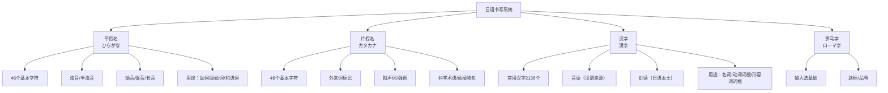

## 七、日语学习方案

日语是中国学习者人数增长最快的外语之一，也是仅次于英语的第二大热门外语学习方向。无论是出于动漫、游戏、日剧等文化产品的兴趣，还是出于留学、工作、学术研究的现实需求，日语都有庞大的学习群体。而中文母语者学习日语，有着得天独厚的优势——也有需要刻意克服的陷阱。

本节将从日语的语言特征出发，系统梳理中文母语者学习日语的优势与挑战，然后按照 JLPT（日本语能力测试）N5 到 N1 的五级体系，给出每个阶段的学习目标、核心内容、推荐资源和实操方法。同时涵盖听、说、读、写四项技能的训练策略，以及敬语、汉字、发音等日语特有难点的专项攻克方案。

### 7.1 日语的语言特征与中文母语者的优势分析

#### 7.1.1 日语在世界语言中的位置

日语是一种黏着语（agglutinative language），通过在词根上添加词缀来表达语法关系，这与中文的孤立语特征（不变化词形）截然不同。日语的书写系统是世界上最复杂的之一——同时使用三套文字体系：平假名、片假名和汉字（漢字），再加上罗马字（主要用于外来词标记和输入法）。

从语言谱系来看，日语的归属至今存在争议。主流语言学认为日语属于日本-琉球语系，与朝鲜语在语法结构上有相似之处，但与中文没有亲缘关系。不过，由于历史上大规模的汉字借用，日语在词汇层面与中文有大量重叠，这是中文母语者最大的天然优势。

| 语言特征 | 日语 | 中文 | 英语 |
|---------|------|------|------|
| 语系 | 日本-琉球语系（黏着语） | 汉藏语系（孤立语） | 印欧语系（屈折语→分析语） |
| 基本语序 | SOV（主语-宾语-动词） | SVO（主语-动词-宾语） | SVO（主语-动词-宾语） |
| 文字系统 | 假名 + 汉字 + 罗马字 | 汉字 | 拉丁字母 |
| 声调/重音 | 音高重音（pitch accent） | 声调（四声+轻声） | 重音（stress-timed） |
| 动词变化 | 六种时态 + 敬语变形 | 不变化 | 规则/不规则变化 |
| 助词系统 | 大量助词标记语法关系 | 无系统性助词 | 介词 |
| 敬语系统 | 极其复杂（三套体系） | 基本消亡 | 有限的礼貌层级 |

#### 7.1.2 中文母语者的五大优势

**优势一：汉字认知优势。** 日语常用汉字约 2136 个（「常用漢字表」），中文母语者天然认识这些字形。即使不知道日语读音，也能通过字形猜测词义。例如「経済」「社会」「教育」「環境」「政治」「科学」「技術」「歴史」等词，中文母语者一眼就能理解含义，无需额外记忆。

**优势二：大量中日同形同义词。** 日语中有大量从中文借入或中日共享的词汇，且含义相同或高度相似。据语言学统计，日语中约有 30%-40% 的词汇与中文存在形态上的关联。这些词涵盖政治、经济、法律、科学、文化等专业领域，使中文母语者在中高级阶段的词汇积累速度远超其他母语者。

**优势三：文化背景相通。** 中日两国共享东亚文化圈的诸多概念——儒学思想、佛教文化、汉字文化传统、季节感、礼仪规范等。理解日语中的文化隐含意义时，中文母语者有天然的背景知识优势。

**优势四：学习资源丰富。** 中国拥有全球最大的日语学习社群之一，学习资源极为丰富：从线下培训机构到线上课程，从教材出版到社区论坛，从动漫字幕组到学术翻译团队，中文母语者可以找到大量高质量的学习材料和交流机会。

**优势五：音系相对友好。** 日语只有 5 个元音（a/i/u/e/o）和约 20 个辅音，音节结构简单（以开音节为主），发音难度远低于法语、德语、阿拉伯语等语言。中文母语者已经具备四声声调的感知能力，对日语的音高重音有一定适应基础。

#### 7.1.3 中文母语者必须警惕的三大陷阱

然而，优势如果不加警惕，也可能变成学习障碍。中文母语者在日语学习中有一些特有的"坑"：

**陷阱一：汉字望文生义的误判。** 日语中有大量"和製漢語"（日本造的汉语词）和"同形异义词"，字形与中文相同但含义不同。如果凭中文直觉去理解，会闹出笑话甚至造成严重误解：

| 日语词 | 中文字面理解 | 日语实际含义 | 差异程度 |
|-------|------------|------------|---------|
| 勉強（べんきょう） | 勉强、不情愿 | 学习 | 完全不同 |
| 丈夫（じょうぶ） | 丈夫、配偶 | 结实、坚固 | 完全不同 |
| 大丈夫（だいじょうぶ） | 大丈夫、男子汉 | 没关系、不要紧 | 完全不同 |
| 手紙（てがみ） | 卫生纸 | 书信 | 完全不同 |
| 娘（むすめ） | 妈妈 | 女儿 | 完全不同 |
| 怪我（けが） | 怪我自己 | 受伤 | 完全不同 |
| 汽車（きしゃ） | 汽车 | 火车 | 完全不同 |
| 人参（にんじん） | 人参（药材） | 胡萝卜 | 部分不同 |
| 愛人（あいじん） | 爱人（配偶） | 情人 | 完全不同 |
| 老婆（ろうば） | 老婆（妻子） | 老太太 | 完全不同 |
| 検討（けんとう） | 检讨（自我反省） | 研究、商讨 | 部分不同 |
| 結構（けっこう） | 结构 | 不需要/非常（多义） | 部分不同 |

对策：遇到日语汉字词时，不要想当然地用中文含义去理解。建立一个"同形异义词"专项词库，系统性地整理和记忆。推荐使用 Anki 制作专门的"中日同形异义词"卡片组。

**陷阱二：忽视假名学习，过度依赖汉字。** 中文母语者容易犯的错误是觉得"汉字我都认识，假名随便学学就行了"。这会导致两个严重后果：一是假名不熟练导致阅读速度极慢（因为需要在汉字和假名之间不断切换注意力）；二是忽略了日语的语法信息——日语的语法功能词（助词、助动词、动词活用形）全部用假名标记，只看汉字等于跳过了语法层。

对策：在入门阶段就必须花足够的时间把假名练到自动化水平——看到假名不需要思考就能读出来，写假名不需要回忆笔顺就能流畅写出。这个基础不牢，后面所有学习都会被拖累。

**陷阱三：用中文语法思维造日语句子。** 中文是 SVO 语序，日语是 SOV 语序，这意味着句子的组织逻辑完全不同。中文说"我吃饭"，日语说"私は ご飯を 食べる"（我 饭 吃）。更深层的差异在于：日语的语法关系靠助词标记，动词在句末，信息的焦点分布与中文完全相反。中文母语者在造句时，本能地会把动词放在宾语前面，需要大量练习才能建立日语的语序直觉。

对策：从第一天开始就用日语的语序思维来造句。不要先想中文再翻译成日语，而是直接用日语的"主语-宾语-动词"结构来组织思维。大量的听读输入是建立语序直觉的最佳途径。

### 7.2 日语书写系统详解

日语的书写系统是所有主流语言中最复杂的——没有"之一"。它同时使用三套文字系统，每套都有不同的用途和规则。理解这套系统的设计逻辑，是学好日语的前提。

#### 7.2.1 平假名（ひらがな）——日语的"骨架"

平假名是日语最基础的书写系统，由汉字的草书演变而来。46 个基本平假名覆盖了日语所有的音节组合。平假名在日语中的作用相当于英语的字母表——不掌握它就无法读出任何一个完整的日语句子。

平假名主要用于：
- 助词（は、が、を、に、で、と、も、の 等）——标记句子成分的语法功能
- 助动词（です、ます、た、ない 等）——标记时态、否定、礼貌层级
- 动词/形容词的活用部分（食べる→食べた→食べない→食べます）
- 没有汉字或汉字太难的词汇（きれい、すごい、もっと、まだ 等）
- 儿童读物和初级学习材料的全文标记

**五十音图的记忆策略：**

五十音图按照"行"（あ行、か行、さ行……わ行）和"段"（あ段、い段、う段、え段、お段）排列，形成一个 5×10 的矩阵（加上单独的"ん"共 47 个字符）。推荐的记忆顺序：

1. **第一周：あ行～さ行（15 个字符）。** 这三行的发音最简单，且出现频率最高。每天 5 个，用描红本反复书写 20 遍以上，同时配合听音频模仿发音。
2. **第二周：た行～は行（15 个字符）。** 这三行开始出现一些对中文母语者来说不太熟悉的音（如"つ""ふ"）。
3. **第三周：ま行～わ行 + ん（17 个字符）。** 完成全部基本假名。
4. **第四周：浊音、半浊音、拗音。** 这些是在基本假名基础上添加标记的变化形式，规律性很强。

关键技巧：不要死记硬背每个假名的形状。利用"联想法"把假名与它的汉字来源关联起来。例如：
- 「あ」来源于汉字「安」的草书——想象一个安坐的人
- 「い」来源于汉字「以」的草书
- 「か」来源于汉字「加」的草书
- 「た」来源于汉字「太」的草书
- 「は」来源于汉字「波」的草书

**验证标准：** 当你能在 2 分钟内默写出全部 46 个基本平假名，且正确率达到 100% 时，才算真正掌握了平假名。在此之前不要急于进入下一个阶段。

#### 7.2.2 片假名（カタカナ）——外来词的标记系统

片假名与平假名一一对应，共 46 个基本字符，来源于汉字的偏旁部首。片假名的主要用途是标记外来词（外来語）、拟声拟态词、以及动植物的学名。

片假名在现代日语中的使用频率越来越高。据统计，日本人的日常用语中约有 10% 是片假名词汇，而在科技、商业、时尚等领域这个比例更高。掌握片假名对于阅读日文新闻、科技文献和商业材料至关重要。

片假名的学习技巧：
- 与平假名对照学习——每个片假名都对应一个平假名，先学平假名再学片假名效率更高
- 通过外来词来记忆片假名——很多片假名词汇就是英语词的音译。例如：コーヒー（coffee）、パソコン（personal computer）、テレビ（television）、レストラン（restaurant）
- 注意长音和促音的标记方式——外来词中的长音用"ー"表示，促音用小"ッ"表示

**常见片假名外来词速记表：**

| 片假名 | 来源词 | 含义 | 中文对应 |
|-------|--------|------|---------|
| コーヒー | coffee | 咖啡 | 咖啡 |
| テレビ | television | 电视 | 电视 |
| パソコン | personal computer | 电脑 | 电脑 |
| スマホ | smartphone | 智能手机 | 手机 |
| インターネット | internet | 互联网 | 互联网 |
| データ | data | 数据 | 数据 |
| ソフト | software | 软件 | 软件 |
| マニュアル | manual | 手册/自动 | 手册 |
| サービス | service | 服务/免费赠送 | 服务 |
| アルバイト | 德语 Arbeit | 兼职工作 | 打工 |

#### 7.2.3 汉字（漢字）——中文母语者的优势与注意事项

日语汉字是中文母语者的最大优势，但也是最大的潜在陷阱来源。日语常用汉字有 2136 个（2010 年版「常用漢字表」），其中大部分与中国简体字相同或高度相似，但也有不少差异需要注意。

**日语汉字的四种读法：**

日语汉字的最大特点是"一字多音"——同一个汉字在不同的词中可以有不同的读音。日语汉字的读音分为两大类：

1. **音读（おんよみ）：** 源自古代中国不同朝代传入的汉语发音。同一个汉字可能有多个音读，因为不同时期、不同地区传入的发音不同。例如"生"的音读有「セイ（sei）」「ショウ（shō）」等。
2. **训读（くんよみ）：** 日语原有的本土发音，被"配"到了对应的汉字上。例如"山"的训读是「やま（yama）」，"川"的训读是「かわ（kawa）」。

一般来说，单独使用一个汉字时多用训读（山→やま），与其他汉字组合成词时多用音读（山脈→さんみゃく）。但这个规律有大量例外，需要逐词记忆。

**中文母语者需要特别注意的汉字差异：**

| 类型 | 说明 | 举例 |
|------|------|------|
| 字形差异 | 日语保留了繁体字形或使用了不同的简化方式 | 日语「図」vs 中文「图」；日语「気」vs 中文「气」 |
| 新字体差异 | 日本战后进行了汉字简化，但简化方式与中国不同 | 日语「広」vs 中文「广」；日语「圧」vs 中文「压」 |
| 日本自造汉字 | 日本人根据汉字造字法自创的汉字（国字/和製漢字） | 働（働く=工作）、峠（山口）、畑（旱田）、辻（十字路口） |
| 同形异义 | 字形相同但含义不同（已在 7.1.3 节详述） | 勉強、娘、手紙 等 |

**汉字学习策略：**

对于中文母语者，汉字学习的重点不是"认字"（你已经认识大部分了），而是：
1. **记读音：** 每个汉字的音读和训读需要逐一记忆。利用"音读规律"可以举一反三——例如，知道"学"的音读是「ガク（gaku）」，就能推断出「学生（がくせい）」「学校（がっこう）」「大学（だいがく）」「文学（ぶんがく）」中"学"的发音。
2. **记书写差异：** 注意日语汉字的微小笔画差异，不要用中文写法代替日语写法。
3. **记特殊用法：** 日本自造汉字和同形异义词需要专门整理和记忆。

### 7.3 日语发音与音高重音

#### 7.3.1 日语的音系结构

日语的音系相当简单，这是它作为外语学习的"入门友好"特质之一。日语有 5 个元音：

| 元音 | 发音 | 类比中文 |
|------|------|---------|
| あ (a) | 开口度大，舌位低 | 类似中文"啊" |
| い (i) | 开口度小，舌位前高 | 类似中文"衣" |
| う (u) | 双唇不圆，舌位后高 | 类似中文"乌"但嘴唇不突出 |
| え (e) | 开口度中等，舌位中前 | 介于中文"鹅"和"诶"之间 |
| お (o) | 开口度中等，舌位后 | 类似中文"哦" |

辅音方面，日语约有 20 个辅音音位。对中文母语者需要注意的几个发音：

- **「つ (tsu)」：** 清齿龈塞擦音，不是中文的"次"也不是"苏"。舌尖抵住上齿龈后迅速放开，同时送气。
- **「ふ (fu)」：** 双唇摩擦音，不是唇齿摩擦音。上齿不接触下唇，而是双唇之间留一条缝吹气。
- **「らりるれろ (ra ri ru re ro)」：** 这不是英语的 r 也不是中文的 l，而是一个弹音（flap），舌尖轻弹一下上齿龈后部。
- **「长音」：** 日语有长短音区别，长音会改变词义。例如「おばさん（obasan，阿姨）」vs「おばあさん（obāsan，奶奶）」。

#### 7.3.2 音高重音（Pitch Accent）——被大多数教材忽略的关键要素

日语不是"没有声调"的语言——它有音高重音（pitch accent），只是类型与中文的声调不同。中文是"声调语言"（tonal language），每个音节有固定的声调模式；日语是"音高重音语言"（pitch accent language），音高的变化发生在音节之间，而不是单个音节上。

日语的音高重音模式分为四类（以东京方言为标准）：

- **平板型（平板型）：** 音高从第一个音节上升后保持高位。标记为 [0]。如：「はし[0]（箸，筷子）」
- **头高型（頭高型）：** 第一个音节高，之后全部低。标记为 [1]。如：「はし[1]（橋，桥）」
- **中高型（中高型）：** 中间某个音节是最高点。标记为 [2][3]等。如：「たまご[2]（卵，鸡蛋）」
- **尾高型（尾高型）：** 音高从第一个音节上升，到词尾保持高位（但后续的助词会下降）。标记与平板型相同 [0]，需通过后续助词判断。如：「おとこ[0]（男，男人）」

最经典的例子是「はし」：
- 箸[0]（筷子）：低-高模式，后续助词保持高音 → は↑し↓が
- 橋[1]（桥）：高-低模式 → は↓し↑が

**音高重音到底有多重要？** 这是一个有争议的话题。在实际交流中，日本人主要通过上下文来理解词义，纯粹因为音高重音错误导致误解的情况相对少见。但是，正确的音高重音会让你的日语听起来更自然、更地道，也更容易被听懂。在初级阶段不必过度纠结音高重音，但从中级阶段开始，应该有意识地去模仿和纠正。

建议：
1. 入门阶段：把精力集中在假名发音和基础语法上，音高重音暂时放一放。
2. 中级阶段：开始关注常用词的音高重音，使用 OJAD（Online Japanese Accent Dictionary）等工具查询。
3. 高级阶段：系统学习音高重音规则，通过模仿母语者的语调来自然习得。

#### 7.3.3 发音训练方法

**跟读训练（シャドーイング，Shadowing）：**

Shadowing 是语言学研究中公认的高效发音训练方法。操作方式是：播放一段日语音频，在听到声音后立即跟着模仿，延迟不超过 1 秒。这个练习强迫你的大脑同时处理"听"和"说"两个任务，能有效提高发音准确度和语速。

具体步骤：
1. 选择一段难度适中的音频（NHK新闻、教材课文录音均可），时长 2-3 分钟。
2. 先不看文本，纯听 2-3 遍，理解大意。
3. 打开文本，逐句暂停，查清生词和不理解的语法。
4. 不暂停播放，看着文本跟读 3-5 遍。
5. 不暂停播放，不看文本，纯靠听觉跟读 3-5 遍。
6. 录音对比自己的发音与原声的差异。

**录音对比法：**

用手机录下自己朗读日语的音频，然后与原声对比。你会发现很多自己意识不到的发音问题——可能是元音不够饱满，可能是辅音发音位置不对，可能是语速和节奏与母语者有差距。录音对比是成本最低、效果最好的自我纠错方法。

### 7.4 日语语法体系概览

#### 7.4.1 SOV 语序——日语语法的基石

日语的基本语序是 SOV（主语-宾语-动词），这与中文的 SVO 语序完全相反。动词永远放在句子末尾，这是日语最基本的语法特征，也是中文母语者需要最先适应的差异。

| 中文（SVO） | 日语（SOV） | 逐字直译 |
|------------|-----------|---------|
| 我吃饭。 | 私はご飯を食べます。 | 我 饭 吃。 |
| 我去学校。 | 私は学校に行きます。 | 我 学校 去。 |
| 我读了这本书。 | 私はこの本を読みました。 | 我 这本书 读了。 |
| 我昨天看了电影。 | 私は昨日映画を見ました。 | 我 昨天 电影 看了。 |

日语的语序虽然灵活（因为助词标记了每个成分的语法角色），但动词在句末这个规则几乎是不可违反的。

#### 7.4.2 助词系统——日语语法的"关节"

助词（じょし）是日语语法中最核心、也最容易用错的部分。助词紧跟在名词、动词等词后面，标记该词在句子中的语法功能。中文靠语序来表达语法关系，日语靠助词。

**必须掌握的核心助词：**

| 助词 | 功能 | 例句 | 说明 |
|------|------|------|------|
| は (wa) | 主题标记 | 私**は**学生です。（我是学生。） | 标记句子的主题（不一定是主语） |
| が (ga) | 主语标记 | 猫**が**います。（有猫。） | 标记动作的执行者或存在的主体 |
| を (wo/o) | 宾语标记 | 本**を**読みます。（读书。） | 标记动作的对象 |
| に (ni) | 方向/时间/存在 | 学校**に**行きます。（去学校。） | 表示方向、时间点、存在的位置 |
| で (de) | 场所/手段 | 図書館**で**勉強します。（在图书馆学习。） | 表示动作发生的场所、使用的手段 |
| と (to) | 和/引用 | 友達**と**行きます。（和朋友去。） | 表示并列、伴随、引用 |
| も (mo) | 也/都 | 私**も**行きます。（我也去。） | 表示"也""都" |
| の (no) | 所有/修饰 | 私**の**本。（我的书。） | 表示所属、属性 |
| へ (e) | 方向 | 東京**へ**行きます。（去东京。） | 表示方向（与に类似，但更书面） |
| から (kara) | 从/因为 | 9時**から**始まります。（从9点开始。） | 表示起点、原因 |
| まで (made) | 到/为止 | 5時**まで**待ちます。（等到5点。） | 表示终点、范围 |

助词的学习不能靠背规则，必须通过大量的例句和实际运用来内化。建议每学一个新助词，就造 10 个以上包含该助词的句子。

#### 7.4.3 动词活用——日语语法的核心难点

日语动词有复杂的活用变化（conjugation），这是日语语法中最具挑战性的部分。好在日语动词的活用变化高度规则化——一旦掌握了规则，就能系统性地推导出各种变化形式。

日语动词分为三类：

| 类型 | 特征 | 举例 | 占比 |
|------|------|------|------|
| 一类动词（五段动词） | 词尾在「う」段，变化涉及五个段 | 書く、読む、話す、買う | 约 70% |
| 二类动词（一段动词） | 词尾是「る」，前一个假名在「い」段或「え」段 | 食べる、見る、起きる | 约 25% |
| 三类动词（不规则动词） | 只有两个：する 和 来る(くる) | する、来る | 约 5% |

**核心活用形式速查表（以「食べる」为例）：**

| 活用形式 | 变化方式 | 用法 | 例句 |
|---------|---------|------|------|
| ます形 | 食べます | 礼貌现在时 | 朝ご飯を食べます。 |
| ない形 | 食べない | 否定 | 朝ご飯を食べない。 |
| た形 | 食べた | 过去时 | 朝ご飯を食べた。 |
| て形 | 食べて | 连接/请求/进行 | 食べてください。 |
| 可能形 | 食べられる | 能够 | 日本料理が食べられる。 |
| 被动形 | 食べられる | 被动 | 猫に食べられた。 |
| 使役形 | 食べさせる | 使/让 | 子供に野菜を食べさせる。 |
| 意志形 | 食べよう | 意志/提议 | 一緒に食べよう。 |
| 命令形 | 食べろ | 命令 | 早く食べろ！ |
| 条件形 | 食べれば | 条件 | 食べれば元気になる。 |

建议用表格方式系统整理三类动词的所有活用形式，然后通过大量的替换练习来达到自动化。

#### 7.4.4 形容词系统

日语有两种形容词：い形容词和な形容词，它们的活用方式不同：

| 类型 | 特征 | 举例 | 否定形 | 过去形 |
|------|------|------|-------|-------|
| い形容词 | 词尾是「い」 | 高い、安い、美味しい | 高くない | 高かった |
| な形容词 | 词尾是「だ」（修饰名词时用「な」） | 静かだ、きれいだ、有名だ | 静かじゃない | 静かだった |

### 7.5 敬语系统——日语最深层的文化密码

#### 7.5.1 敬语的三重体系

日语的敬语系统是全世界所有语言中最复杂、最精密的礼貌表达系统之一。它不只是"把话说得客气一点"，而是包含了对人际关系、社会地位、内外亲疏的全方位编码。敬语分为三种：

| 类型 | 日语名称 | 功能 | 举例（"去"的表达） |
|------|---------|------|-----------------|
| 尊敬语 | 尊敬語（そんけいご） | 抬高对方的动作 | いらっしゃる/おいでになる |
| 谦让语 | 謙譲語（けんじょうご） | 降低自己的动作 | 参る/お伺いする |
| 丁寧语 | 丁寧語（ていねいご） | 一般礼貌 | 行きます |

此外还有"美化语"（美化語，如「お水」「お花」）和"禁忌语"（忌み言葉）等细分类型。

#### 7.5.2 敬语学习的正确路径

敬语是日语学习中最容易让人望而却步的部分。但只要遵循正确的学习路径，它并没有想象中那么难：

1. **入门阶段（N5-N4）：** 只需要掌握「です/ます」体和最基本的礼貌表达。这个阶段的敬语就是"说话客气一点"，不需要理解三种敬语的系统性区别。
2. **初级阶段（N3）：** 开始接触尊敬语和谦让语的基本形式。重点是记住常用的尊敬动词和谦让动词的替换表。
3. **中级阶段（N2）：** 系统学习敬语的使用规则和场合判断。能够区分内外关系（社内/社外）、上下关系（目上/目下）对敬语选择的影响。
4. **高级阶段（N1）：** 能够自然、准确地使用各种敬语形式，包括一些不常用的高级表达。能在正式场合进行得体的沟通。

**最常用的敬语动词替换表：**

| 基本形 | 尊敬语（抬高对方） | 谦让语（降低自己） |
|-------|-----------------|-----------------|
| する | なさる | いたす |
| 行く | いらっしゃる/おいでになる | 参る/お伺いする |
| 来る | いらっしゃる/おいでになる | 参る |
| 言う | おっしゃる | 申す/申し上げる |
| 見る | ご覧になる | 拝見する |
| 食べる/飲む | 召し上がる | いただく |
| 知る | ご存知です | 存じる |
| いる | いらっしゃる | おる |
| あげる | — | 差し上げる |
| もらう | — | いただく |
| くれる | 下さる | — |

### 7.6 日语学习的阶段规划

#### 7.6.1 JLPT 体系说明

JLPT（日本語能力試験，Japanese Language Profiness Test）是全球最权威的日语能力认证考试，分为 N5（最低）到 N1（最高）五个等级。JLPT 不设口语和写作测试，只考"语言知识（文字·词汇·语法）""阅读"和"听力"三个部分。

| 等级 | 词汇量 | 汉字量 | 语法项目 | 学习时长参考 | 能力描述 |
|------|--------|--------|---------|------------|---------|
| N5 | ~800 | ~100 | ~50 | 200-350 小时 | 能理解基本的日语，如自我介绍、购物等简单会话 |
| N4 | ~1,500 | ~300 | ~150 | 400-600 小时 | 能理解基本日语，能进行日常会话 |
| N3 | ~3,750 | ~650 | ~300 | 700-1,000 小时 | 能理解日常场景中一定程度的日语 |
| N2 | ~6,000 | ~1,000 | ~500 | 1,100-1,800 小时 | 能理解日常场景中的日语，能阅读报纸杂志 |
| N1 | ~10,000 | ~2,000 | ~800 | 1,800-3,200 小时 | 能理解各种场景中的日语 |

注：学习时长参考因母语不同而差异巨大。中文母语者由于汉字优势，通常可以在较短时间内达到上述时长的下限。

#### 7.6.2 第一阶段：入门（0-3 个月）——目标：N5 水平

**核心任务：**

这个阶段的唯一重点是打好"假名 + 发音 + 基础语法"的地基。不要贪快，不要跳过假名直接学汉字，不要追求词汇量。

| 周次 | 学习内容 | 每日时长 | 验证标准 |
|------|---------|---------|---------|
| 第1周 | 清音五十音（あ～わ行）+ あ行拗音 | 45-60分钟 | 2分钟内默写全部46个假名，正确率100% |
| 第2周 | 浊音、半浊音、拗音、长音、促音 | 45-60分钟 | 听写测试正确率95%以上 |
| 第3周 | 片假名全部 | 45-60分钟 | 能流畅读出片假名单词 |
| 第4周 | 基础问候/自我介绍/数字/日期 | 60分钟 | 能用日语进行30秒的自我介绍 |
| 第5-8周 | です/ます体、助词は/が/を/に/で | 60分钟 | 能造10种以上基本句型 |
| 第9-12周 | 基础动词/形容词活用、存在句、愿望表达 | 60分钟 | 能进行简单的日常对话 |

**推荐教材：**

- **《标准日本语》初级上册（人民教育出版社）：** 中国最经典的日语教材，语法讲解系统，配套资源丰富。适合自学。
- **《大家的日本语》初级 I（スリーエーネットワーク）：** 日本语言学校最广泛使用的教材，对话自然，注重实用。适合有老师指导的学习者。
- **《Genki I》（The Japan Times）：** 英语编写的日语教材，内容生动有趣，适合有英语基础的学习者。

**这个阶段的关键原则：**

1. 假名必须练到"自动化"——看到就能读，听到就能写，不需要回忆。这是后面所有学习的基础。
2. 不要同时学习太多语法点。每个语法点学透了再学下一个。
3. 每天至少 30 分钟的听力输入（可以是教材配套音频、NHK World 的简单日语节目）。
4. 用 Anki 或其他 SRS 工具记忆单词和假名，每天复习 + 新学 15-20 个。

#### 7.6.3 第二阶段：初级（3-12 个月）——目标：N4-N3 水平

**核心任务：**

这个阶段是从"能说几句"到"能进行日常会话"的跨越。核心是：扩大词汇量、掌握基本语法体系、开始接触真实日语材料。

| 学习维度 | N4 阶段目标 | N3 阶段目标 |
|---------|-----------|-----------|
| 词汇 | 1,500 词 | 3,750 词 |
| 汉字 | 300 个 | 650 个 |
| 语法 | 基本句型（て形、ない形、た形等） | 复合句型（条件、被动、使役等） |
| 听力 | 理解教材速度的对话 | 理解自然语速的日常对话 |
| 阅读 | 读简短的带注音文章 | 读简单的新闻和故事 |
| 口语 | 用基本句型进行日常会话 | 能表达意见和感受 |

**重点突破方向：**

1. **动词活用的自动化：** 这个阶段必须把三类动词的所有基本活用形式练到条件反射。推荐方法：每天花 10 分钟做"动词活用操练"——给一个动词原形，快速说出它的ます形、ない形、た形、て形、可能形。可以制作闪卡或使用专门的练习 App。
2. **听力的系统训练：** 从教材音频过渡到真实日语。推荐顺序：NHK World 日语学习节目 → NHK Easy News → 日剧/动漫（带日语字幕）。
3. **阅读的起步：** 使用分级阅读材料（Graded Readers），从 Level 0-1 开始。不要直接挑战新闻或小说——那会让你因大量生词而丧失信心。

**推荐资源：**

- **《标准日本语》初级下册 + 中级上册：** 继续使用该系列保持学习的连续性。
- **Anki N5-N4-N3 词汇牌组：** 使用共享牌组提高效率，但要根据自己的薄弱点自定义。
- **NHK World "Easy Japanese"：** 免费的在线日语学习课程，有中文界面，对话实用。
- **Tadoku（多読）分级阅读：** 免费的在线日语分级阅读材料。
- **Bunpo（文法）App：** 按 JLPT 等级整理的语法学习 App，讲解清晰，有练习题。

#### 7.6.4 第三阶段：中级（12-24 个月）——目标：N2 水平

**核心任务：**

N2 是日语学习的"分水岭"——跨过这个门槛，你就能在日语环境中进行大部分日常交流和专业阅读。这个阶段的学习重心从"学教材"转向"用日语"。

| 学习维度 | N2 阶段目标 |
|---------|-----------|
| 词汇 | 6,000 词（含大量汉字词和外来词） |
| 汉字 | 1,000 个 |
| 语法 | 复杂句型、书面语表达、敬语基础 |
| 听力 | 理解新闻、讲座、日常对话中的自然语速日语 |
| 阅读 | 能读报纸社论、杂志文章、一般性小说 |
| 口语 | 能表达较复杂的意见，参与讨论 |
| 写作 | 能写简单的文章、邮件、报告 |

**突破 N2 的关键策略：**

1. **大量输入真实日语：** 每天至少 1 小时的日语输入（听+读）。内容包括：NHK News Web Easy、日语播客、日语 YouTuber、日语小说、日语漫画。
2. **词汇的深度学习：** 不再只是"认识"单词，而是要掌握单词的用法、搭配、语感差异。推荐使用日日词典（如「大辞林」或「明鏡国語辞典」）来理解词义，逐步摆脱中日词典的依赖。
3. **语法的系统整理：** 使用《新完全マスター文法 N2》或《TRY! 日本語能力試験 N2》等专项语法教材，系统梳理 N2 级别的所有语法点。
4. **开始写作练习：** 每周写 2-3 篇短文（日记、读后感、观点表达），使用 Lang-8 或 HiNative 等平台请母语者修改。

#### 7.6.5 第四阶段：高级（24 个月以上）——目标：N1 及超越

**核心任务：**

N1 是 JLPT 的最高级别，但拿到 N1 并不意味着"日语学完了"。N1 只是证明你具备了在日语环境中工作和生活的基本语言能力。真正的高水平日语——地道的口语、专业的写作、深层的文化理解——需要持续的积累和实践。

| 学习维度 | N1 阶段目标 |
|---------|-----------|
| 词汇 | 10,000+ 词（含专业领域词汇） |
| 汉字 | 2,000+ 个 |
| 语法 | 高级书面语、古典日语基础、正式敬语 |
| 听力 | 理解各种口音、语速、专业话题的日语 |
| 阅读 | 能读学术论文、文学作品、专业文献 |
| 口语 | 能在正式场合进行演讲、谈判、报告 |
| 写作 | 能写专业文章、论文、商业文书 |

**超越 N1 的方向：**

1. **专业领域深耕：** 根据自己的职业或兴趣方向，深入学习该领域的专业日语。例如 IT、金融、医学、法律、动漫游戏等行业都有大量的专业术语和表达习惯。
2. **方言和口语体学习：** 日语有丰富的方言体系——关西方言、东北方言、博多方言等。了解主要方言不仅能帮助你看懂更多日语内容，也是深入理解日本文化的窗口。
3. **古典日语入门：** 了解文语（古典日语）的基础知识，能够阅读简单的古典文学作品。这不仅能提升你的日语素养，也能帮助你理解现代日语中一些"知其然不知其所以然"的表达。
4. **翻译实践：** 尝试日中互译——从简单的文章翻译开始，逐步挑战文学翻译、技术文档翻译。翻译是检验语言理解深度的最佳方式。

### 7.7 听说读写四项技能训练

#### 7.7.1 听力训练

日语听力对中文母语者的挑战主要在于：语速快、省略多、口语缩略形式复杂。正式教材中听到的日语和实际日本人说的日语差距很大——日本人日常说话时会大量省略助词、使用缩略形式、夹杂方言和年轻人用语。

**听力训练的阶段方法：**

| 阶段 | 材料选择 | 训练方法 | 每日时长 |
|------|---------|---------|---------|
| N5-N4 | 教材配套音频 | 精听：逐句听写 + 跟读 | 20-30 分钟 |
| N3 | NHK Easy News、简单动漫 | 精听 + 泛听结合 | 30-45 分钟 |
| N2 | NHK News、日剧、播客 | 以泛听为主，精听重点段落 | 45-60 分钟 |
| N1+ | 原生内容（新闻、讲座、综艺） | 全泛听，享受式输入 | 60+ 分钟 |

**精听步骤（四步法）：**

1. **裸听：** 不看文本，先听 1-2 遍，了解大意。
2. **听写：** 逐句暂停，写下听到的内容。不确定的地方用「??」标记。
3. **对照：** 对照原文，找出听错和没听出来的部分。分析原因——是词汇不认识、语法不理解、还是发音没听清。
4. **跟读：** 对着原文跟读 3-5 遍，确保每个音节都能准确发音。

**推荐听力资源：**

| 资源 | 类型 | 难度 | 特点 |
|------|------|------|------|
| NHK World Easy Japanese | 教学 | 入门-初级 | 有中文翻译，语速慢 |
| NHK News Web Easy | 新闻 | 中级 | 带假名注音的简化新闻 |
| NHK Radio News | 新闻 | 中高级 | 标准日语，每天更新 |
| 日语播客（Nihongo con Teppei） | 会话 | 初-中级 | 简单自然的日常对话 |
| 日剧/动漫 | 娱乐 | 中级+ | 真实口语，文化背景丰富 |
| YouTube 日语频道 | 综合 | 各级别 | 免费，内容多样 |

#### 7.7.2 口语训练

口语是大多数日语学习者的最弱项。原因很简单：在非日语环境中，你几乎没有任何机会用日语进行真实交流。但"没有语言环境"不是借口——有很多方法可以在没有日语环境的情况下练习口语。

**口语训练方法：**

1. **自言自语法：** 每天用日语描述你正在做的事情。不需要语法完美，重要的是"开口说"。例如：「今、ご飯を作っています。今日はカレーを作ります。」（现在在做饭。今天做咖喱。）
2. **影子跟读法（Shadowing）：** 同 7.3.3 节所述。Shadowing 不仅练发音，也练口语流利度——因为你需要在极短的时间内把听到的内容说出来。
3. **替换练习：** 选一个句型，把里面的词汇替换成不同的词反复练习。例如练习「～は～が好きです」句型时，替换不同的主语和宾语：「私は猫が好きです」「彼はサッカーが好きです」「母は料理が好きです」。
4. **话题独白练习：** 选一个话题，用日语独白 2-3 分钟。录音后回听，找出语法错误和不自然的表达。话题可以从简单的开始（自我介绍、家庭、爱好），逐渐升级到复杂的（社会问题、专业领域、抽象话题）。
5. **语言交换伙伴：** 使用 HelloTalk、Tandem 等语言交换 App，找一个想学中文的日本人，互相教学。这是成本最低的"真实交流"方式。
6. **AI 对话练习：** 使用 ChatGPT 或其他 AI 工具进行日语对话练习。虽然 AI 不是完美的母语者替代品，但它可以 24 小时可用、不嫌你烦、不怕你犯错。

#### 7.7.3 阅读训练

中文母语者在日语阅读上有天然优势——即使不知道读音，也能通过汉字猜测词义。但这个优势也有副作用：容易只看汉字跳过假名，导致语法信息丢失。

**阅读训练的阶段方法：**

| 阶段 | 推荐材料 | 阅读策略 |
|------|---------|---------|
| N5-N4 | 教材课文、分级阅读（Level 0-1） | 精读：每个词都查，每个句子都理解 |
| N3 | 分级阅读（Level 2-3）、简单漫画 | 精读为主，开始跳读不重要的细节 |
| N2 | NHK News、轻小说、杂志 | 泛读为主，只查关键词 |
| N1+ | 文学作品、专业文献、报纸社论 | 自由阅读，遇到生词根据上下文推断 |

**分级阅读推荐：**

- **Tadoku Free Books（tadoku.org）：** 免费的日语分级阅读材料，从零基础到中级，配有插图。
- **Japanese Graded Readers（ASK Publishing）：** 专业出版的分级读物，Level 0-5，每册一个故事。
- **NHK News Web Easy：** 带假名注音的简化新闻，每天更新，中级学习者的理想泛读材料。
- **青空文庫（aozora.gr.jp）：** 免费的日本古典文学作品库，适合高级学习者。

**中文母语者的阅读技巧：**

1. **利用汉字推断词义，但不要跳过假名。** 假名承载着语法信息——动词的时态、名词的格关系、形容词的活用形式——这些信息只能通过假名获取。
2. **注意"和製漢語"和"同形异义词"。** 遇到看起来像中文但用法奇怪的词时，查日日词典确认含义。
3. **从右到左扫描句子结构。** 先找到句末的动词（确定句子的主要动作），再往前找助词（确定各成分的语法角色），最后理解整句含义。

#### 7.7.4 写作训练

日语写作对中文母语者的挑战主要在于：假名的书写规范、助词的准确使用、敬语的得体运用。日语写作不需要追求文学性，准确、清晰、得体是基本要求。

**写作训练的阶段方法：**

| 阶段 | 写作内容 | 训练重点 |
|------|---------|---------|
| N5-N4 | 抄写、造句、填空 | 假名书写规范、基本句型 |
| N3 | 日记、简单短文 | 助词准确使用、时态一致性 |
| N2 | 读后感、邮件、报告 | 敬语使用、逻辑连接词 |
| N1+ | 论文、商业文书、翻译 | 正式文体、书面语表达 |

**实用写作练习模板：**

1. **日记模板（N3 水平）：**
   - 今日の日付：____
   - 天気：____
   - 今日一番印象に残ったこと：____
   - それについての感想：____
   - 明日の予定：____

2. **邮件模板（N2 水平）：**
   - 件名：____についてのご連絡
   - 拝啓　____様
   - いつもお世話になっております。____会社の____です。
   - 本文：____
   - 以上、よろしくお願いいたします。
   - 敬具

3. **写作批改平台：** Lang-8（多国语言写作批改社区）、HiNative（语言问答社区）、ChatGPT（即时语法检查和修改建议）。

### 7.8 日语学习的特殊策略

#### 7.8.1 汉字学习策略——中文母语者的专属方法

中文母语者的汉字学习策略与欧美学习者完全不同。欧美学习者需要从零开始学认汉字、记笔顺、理解字义；中文母语者已经认识大部分汉字，需要重点攻克的是：

1. **读音差异：** 建立"汉字→日语读音"的映射关系。推荐使用"音读规律法"——很多汉字的音读在不同词中是相同的。例如知道"会"的音读是「カイ（kai）」，就能推断「会議（かいぎ）」「社会（しゃかい）」「会話（かいわ）」「運動会（うんどうかい）」中"会"的发音。
2. **书写差异：** 整理日语汉字与中文汉字的笔画差异清单。常见的差异包括：「直」的日语写法中间是三横不是两横、「骨」的上部写法不同、「令」的日语写法最后一笔不同等。
3. **日本自造汉字（国字）：** 这些汉字在中文中不存在，需要专门记忆。常用的国字包括：峠（とうげ，山口）、畑（はたけ，旱田）、辻（つじ，十字路口）、働（はたらく，工作）、込（こむ，拥挤）等。
4. **同形异义词的系统整理：** 见 7.1.3 节的表格。建议在 Anki 中建立一个专门的"同形异义词"卡片组，正面写日语词，背面写日语含义（而非中文含义），强迫自己建立日语的新语义连接。

#### 7.8.2 外来词记忆策略

日语中有大量的外来词（主要来自英语），对中文母语者来说这是一个"意外的难点"——这些词的发音往往与英语原词有较大差异，加上是用片假名书写，记忆起来有一定困难。

外来词的记忆技巧：
1. **还原法：** 把片假名词还原回英语原词来记忆。例如「コンピューター」→ computer、「アルバイト」→ 德语 Arbeit。
2. **注意音变规律：** 日语对外来词有一套固定的音变规则。例如英语的 l/r 都变成日语的「ラ行」、英语的 v 变成「バ行」、英语词尾的辅音会加上元音（如 stop → ストップ）。
3. **分类记忆：** 把外来词按领域分类——餐饮类、科技类、体育类、时尚类——分类记忆比随机记忆效率高 30% 以上。

#### 7.8.3 利用中文方言辅助日语发音

这是一个很少被提及但非常实用的技巧：中国南方的一些方言（特别是吴语、闽南语、粤语）保留了古代汉语的入声和一些与日语音读相似的发音。如果你会说这些方言，可以利用方言中与日语发音相似的音节来辅助记忆日语汉字的音读。例如：
- 粤语中"学"读作「hok6」，与日语音读「ガク（gaku）」有相似的韵尾。
- 闽南语中"食"读作「chia̍h」，与日语音读「ショク（shoku）」有一定的对应关系。

即使不会南方方言，了解这种音韵对应关系也能帮助你理解为什么某些汉字的日语发音是这样的——它们都是从古汉语的不同方言层次传入的。

### 7.9 日语学习工具箱

#### 7.9.1 教材体系

| 教材名称 | 适用水平 | 特点 | 适合人群 |
|---------|---------|------|---------|
| 《标准日本语》 | N5-N2 | 语法系统，中文编写，配套齐全 | 中国自学者首选 |
| 《大家的日本语》 | N5-N3 | 对话自然，注重实用 | 有老师指导的学习者 |
| 《Genki》 | N5-N3 | 英语编写，内容生动 | 有英语基础的学习者 |
| 《新完全マスター》系列 | N3-N1 | 专项突破（语法/词汇/阅读/听力/汉字） | 备考 JLPT |
| 《TRY! 日本語能力試験》 | N5-N1 | 按语法点讲解+练习 | 备考 JLPT |
| 《耳から覚える》系列 | N2-N1 | 听力专项训练 | 听力薄弱者 |
| 《日本語総まとめ》系列 | N5-N1 | 每日一课，循序渐进 | 喜欢规律学习的学习者 |

#### 7.9.2 数字工具

| 工具 | 类型 | 平台 | 功能 | 费用 |
|------|------|------|------|------|
| Anki | SRS 闪卡 | 全平台 | 间隔重复记忆单词/语法 | PC 免费，iOS 付费 |
| WaniKani | 汉字学习 | Web | 系统化汉字+词汇学习 | 订阅制 |
| Bunpro | 语法学习 | Web/App | 按 JLPT 等级的语法 SRS | 订阅制 |
| Jisho | 词典 | Web | 日英词典，支持汉字/假名/罗马字搜索 | 免费 |
| Takoboto | 词典 | Android | 日英词典，离线可用 | 免费 |
| Shirabe Jisho | 词典 | iOS | 日英词典，支持手写输入 | 免费 |
| HelloTalk | 语言交换 | iOS/Android | 找语言交换伙伴 | 免费/付费 |
| Tandem | 语言交换 | iOS/Android | 找语言交换伙伴 | 免费/付费 |
| NHK World | 听力 | Web/App | 日语学习节目和新闻 | 免费 |
| OJAD | 音高重音 | Web | 查询日语单词的音高重音模式 | 免费 |
| Yomichan/Yomitan | 阅读辅助 | 浏览器扩展 | 鼠标悬停即时查词 | 免费 |

#### 7.9.3 词典选择

词典是语言学习中最重要的工具之一。日语学习者需要至少配备两种词典：

1. **中日词典（入门-中级使用）：** 推荐「小学館 中日辞典」或 Web 上的「jisho.org」。适合初学者快速理解词义。
2. **日日词典（中级以后使用）：** 推荐「大辞林」（三省堂）或「明鏡国語辞典」（大修館書店）。用日语理解日语是提升语言能力的关键一步，从中级阶段开始就应该逐步从"日中词典"过渡到"日日词典"。
3. **日英词典（辅助使用）：** 推荐「Jisho.org」或「Weblio」。日英词典的好处是解释通常比中日词典更准确，因为很多日语词汇与中文词的微妙差异用中文反而说不清楚。

#### 7.9.4 沉浸式学习环境构建

在非日语环境中创造"准沉浸式"的学习体验：

1. **手机/电脑系统语言设置为日语：** 这是最简单的沉浸方式。虽然一开始会不适应，但你每天都会接触到大量日语界面文字。
2. **社交媒体日语化：** 在 Twitter/X 上关注日语账号，在 YouTube 上订阅日语频道。推荐频道：日本語の森（JLPT 备考）、Onomappu（日语学习）、あかね的日本語教室。
3. **娱乐内容日语化：** 看日剧/动漫时使用日语字幕（而非中文字幕），听日语播客，玩日语游戏。推荐：先看一遍中文字幕理解剧情，再看一遍日语字幕学习表达。
4. **阅读日语新闻的习惯化：** 把 NHK News Web Easy 设为浏览器主页，每天花 5-10 分钟浏览标题和感兴趣的文章。
5. **语音助手日语化：** 如果使用 iPhone，把 Siri 语言设置为日语；如果使用 Google Assistant，设置日语。尝试用日语与语音助手交互。

### 7.10 常见误区与纠正方法

#### 误区一：只学汉字不学假名

**表现：** 中文母语者觉得"汉字我都认识"，急于跳过假名直接学汉字词汇。结果导致假名不熟练，阅读速度极慢，语法信息全靠猜。

**纠正：** 假名是日语的"操作系统"，汉字只是"应用程序"。操作系统不装好，应用程序跑不起来。入门阶段必须把 70% 以上的学习时间投入到假名的熟练掌握上。

#### 误区二：用中文思维翻译日语

**表现：** 想说一句话时，先在脑子里用中文组织好，再逐字翻译成日语。结果造出来的句子要么语序混乱，要么语法错误，要么日本人听不懂。

**纠正：** 从入门阶段开始就训练"日语思维"。方法是：大量背诵完整的日语句子和对话（而不是孤立的单词），让大脑直接建立"情境→日语表达"的连接，绕过中文翻译环节。

#### 误区三：忽视听力训练

**表现：** 只背单词和语法，不做听力练习。结果 JLPT 能考过 N2，但看日剧不开字幕就听不懂，和日本人对话也跟不上语速。

**纠正：** 听力是需要大量时间投入才能见效的技能，不能临时抱佛脚。从第一天开始就保证每天 20 分钟以上的日语听力输入。

#### 误区四：过度追求汉字词汇量

**表现：** 觉得"反正汉字我都认识，多背汉字词就行了"，把大量时间花在背汉字词汇上，忽略了口语、听力和假名词汇的积累。

**纠正：** 日语口语中最常用的词大多是和语词（用假名书写），而不是汉字词。例如「あげる」「もらう」「くれる」「やる」这些最基础的动词，全是假名。只背汉字词会让你的日语听起来像机器翻译——书面语味太重，口语味不足。

#### 误区五：敬语使用不当

**表现：** 要么不使用敬语（对上司和客户也用「だ/である」体），要么过度使用敬语（对朋友也用「いらっしゃる」「申す」），造成关系尴尬。

**纠正：** 敬语的核心不是"越客气越好"，而是"得体"。判断标准是：你和对方的关系（亲疏、上下、内外）决定了你应该使用什么层级的敬语。在不确定的情况下，使用「です/ます」体是最安全的选择。

#### 误区六：忽略促音和长音

**表现：** 「きて（来て，来了）」和「きって（切手，邮票）」分不清；「おばさん（阿姨）」和「おばあさん（奶奶）」混为一谈。

**纠正：** 促音（っ，短暂停顿）和长音（元音延长）是日语中区分词义的重要手段。从一开始就刻意练习这两个要素，不要觉得"差不多就行"。

#### 误区七：只看动漫不学教材

**表现：** 认为"多看动漫就能学会日语"，把大量时间花在看动漫上，但不学教材、不背单词、不做语法练习。

**纠正：** 动漫日语是很好的听力和文化学习材料，但它不能替代系统性的学习。动漫中的语言往往包含大量口语缩略、方言、非标准表达，不适合直接模仿。正确做法是：以教材为主线系统学习，以动漫为辅助材料练习听力和了解文化。

### 7.11 备考 JLPT 的实用策略

#### 7.11.1 JLPT 考试结构

| 科目 | N5 | N4 | N3 | N2 | N1 |
|------|----|----|----|----|----|
| 言語知識（文字・語彙） | 25 分 | 30 分 | 30 分 | — | — |
| 言語知識（文法）・読解 | 50 分 | 60 分 | 70 分 | 105 分 | 110 分 |
| 聴解 | 30 分 | 30 分 | 40 分 | 50 分 | 60 分 |
| 总时间 | 105 分 | 120 分 | 140 分 | 155 分 | 170 分 |

JLPT 采用"综合得分"和"基准点"双重判定——不仅总分要达标，每个科目的得分也必须超过该科目的基准点（一般是满分的 19% 左右），否则即使总分过了也不合格。

#### 7.11.2 备考时间规划

| 当前水平 | 目标等级 | 建议备考时间 | 每日学习时长 |
|---------|---------|------------|------------|
| 零基础 | N5 | 3-6 个月 | 1-1.5 小时 |
| N5 | N4 | 3-4 个月 | 1-1.5 小时 |
| N4 | N3 | 4-6 个月 | 1.5-2 小时 |
| N3 | N2 | 6-9 个月 | 2-2.5 小时 |
| N2 | N1 | 9-12 个月 | 2.5-3 小时 |

#### 7.11.3 各科目备考要点

**文字·词汇：**
- 使用「新完全マスター語彙」系列或「日本語総まとめ語彙」系列。
- 重点掌握汉字的读音——这是中文母语者最容易丢分的地方。你以为认识这个汉字，但它的日语读音可能是你完全猜不到的。
- 做真题时整理错题，特别是"同形异义词"和"汉字读音"类的题目。

**语法·阅读：**
- 使用「新完全マスター文法」系列 + 「新完全マスター読解」系列。
- 语法题的关键是"语感"——不仅要知道规则，还要通过大量练习培养对正确表达的直觉。
- 阅读题的策略：先看问题再读文章，带着问题去找答案。长文阅读不要逐字逐句翻译，抓关键句和转折词。

**听力：**
- 使用「新完全マスター聴解」系列 + 「耳から覚える」系列。
- 听力题的关键是"预判"——在播放音频之前，先看选项，在脑中预设可能出现的场景和词汇。
- 特别注意即时应答问题（即時応答）——这类题考查的是你对口语缩略形式和日常应答模式的熟悉程度。

### 7.12 日语学习的长期规划

#### 7.12.1 从"学习日语"到"用日语学习"

当你的日语达到 N2 以上水平时，应该逐渐从"学习日语"的状态转变为"用日语学习其他东西"。这意味着：
- 用日语阅读你感兴趣领域的书籍和文章
- 用日语观看纪录片、讲座、TED 演讲
- 用日语参与社区讨论（如 Reddit 日语板块、5ch、Twitter/X）
- 用日语进行工作相关的沟通

这个转变是语言能力从"外语水平"向"准母语水平"跃升的关键一步。

#### 7.12.2 日语能力与职业发展

日语能力可以为你的职业发展带来实际价值：

| 职业方向 | 日语要求 | 薪资溢价参考 |
|---------|---------|------------|
| 日企在中国的分支机构 | N2+ | 比同等英语岗位高 10-20% |
| 对日软件开发/IT外包 | N3+ | 技术+日语复合人才稀缺 |
| 日语翻译/口译 | N1 | 高级口译日薪可达数千元 |
| 赴日留学/工作 | N2-N1 | 日本应届生起薪约20-25万日元/月 |
| 动漫/游戏本地化 | N2+ | 专业翻译+文化理解能力 |
| 日语教育 | N1 + 教学资格 | 对外日语教学需求稳定增长 |

#### 7.12.3 保持日语能力的日常习惯

语言能力不进则退。即使达到了满意的水平，也需要保持日常接触日语的习惯。推荐的"最小维持量"：

- 每天 15 分钟日语听力（播客、新闻、日剧片段）
- 每天 10 分钟日语阅读（新闻标题、社交媒体、漫画）
- 每周 1 次日语输出（写日记、语言交换、发日语推文）
- 每月 1 次系统性复习（回顾 Anki 错题、复习语法笔记）

***

本节从日语的语言特征、书写系统、发音、语法、敬语等方面进行了系统性的介绍，并按照 JLPT 五个等级给出了阶段性的学习规划和实操建议。中文母语者学习日语有着显著的汉字优势，但也需要警惕同形异义词、假名不熟练、语法思维差异等特有陷阱。日语学习是一场持久战——坚持每天接触、保持好奇心、享受语言背后的文化魅力，才是走得最远的动力。
