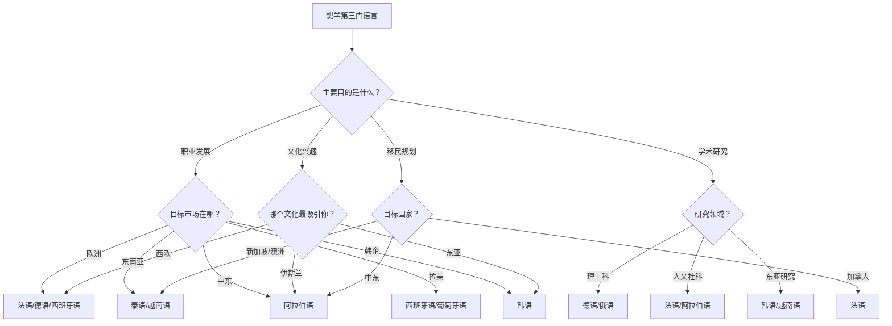

## 八、其他语言学习方案

英语是全球通用语言，日语对中国学习者有汉字优势，这两种语言在前文已有详细方案。但全球化时代，掌握第三门甚至第四门语言能带来显著的竞争优势——无论是职业发展、学术研究、移民规划还是纯粹的文化探索。本章覆盖除英语和日语之外最值得中国学习者考虑的八种语言，按使用人数和实用价值排列，每种语言都提供从零基础到高级水平的完整路线图。

### 8.1 语言选择决策框架

在投入数百小时学习一门新语言之前，值得花一小时做决策分析。不同语言的回报率差异巨大，选错方向意味着浪费数年时间。

**选语言的核心考量维度：**

| 维度 | 关键问题 | 权重 |
|------|----------|------|
| 实用性 | 这门语言在我的行业/领域有实际用途吗？ | ★★★★★ |
| 学习成本 | 中文学母语者学这门语言需要多少小时？ | ★★★★☆ |
| 资源可得性 | 中文/英文学习资源是否充足？ | ★★★☆☆ |
| 文化兴趣 | 我对这门语言的文化有持续兴趣吗？ | ★★★☆☆ |
| 未来发展 | 这门语言对应的地区经济前景如何？ | ★★★☆☆ |

**中文母语者学习各语言的难度参考（美国外交学院FSI分类）：**

| 语言 | FSI难度分类 | 预计学时 | 中文母语者额外优势 | 实用场景 |
|------|------------|----------|-------------------|----------|
| 韩语 | Category II | 1100-1200h | 大量汉字词借入（60%+词汇） | 韩企就业、韩国留学、文化产业 |
| 法语 | Category I | 600-750h | 英语同源词辅助 | 非洲法语区（54国）、国际组织 |
| 西班牙语 | Category I | 600-750h | 英语同源词辅助 | 拉美市场、美国第二大语言 |
| 德语 | Category II | 900h | 与英语同族，逻辑性强 | 工程/制造业、学术研究、留学 |
| 意大利语 | Category I | 600-750h | 与法语/西语互通 | 文艺复兴文化、设计/时尚行业 |
| 葡萄牙语 | Category I | 600-750h | 巴西华人社区 | 巴西市场、葡语非洲 |
| 俄语 | Category II | 1100h | 西里尔字母可系统学习 | 中亚/东欧贸易、军事技术文献 |
| 阿拉伯语 | Category IV | 2200h | 无显著优势 | 中东市场、石油行业、伊斯兰研究 |
| 泰语 | Category III | 1100h | 部分词汇借自中文 | 东南亚旅游/贸易、泰国华人社区 |
| 越南语 | Category III | 1100h | 大量汉越词（60-70%词汇） | 中越贸易、制造业转移 |

### 8.2 韩语学习方案

#### 8.2.1 韩语概况与学习价值

韩语（한국어）是朝鲜半岛的官方语言，全球约7700万使用者。近年来受K-pop、韩剧、韩国游戏产业的影响，韩语成为中国学习者增长最快的第三语言。

**中文母语者的核心优势：**
韩语词汇中约60%以上是汉字词（한자어），这些词汇的发音与中古汉语有系统性的对应关系。例如"도서관"（图书馆，do-seo-gwan）、"학생"（学生，hak-saeng）、"음악"（音乐，eum-ak），听到发音就能联想到中文含义。这是西方学习者完全没有的优势。

**学习难点：**
- **语序差异**：韩语是SOV语序（主语-宾语-动词），与中文SVO完全不同。"我吃饭"在韩语中是"나 밥 먹는다"（我 饭 吃）。
- **敬语系统**：韩语有7个敬语层级（对上、对等、对下），比日语更复杂。同一个动词"吃"可以是먹다、먹어요、드시다、잡수시다等多种形式。
- **收音（받침）**：韩语有27种收音组合，影响后一个音节的发音，这是口语流利的关键难点。

#### 8.2.2 分阶段学习路线

**第一阶段：字母与基础（0-2个月）**

韩文字母（한글）是世界上最科学的书写系统之一，由世宗大王于1443年创制。每个韩字由辅音和元音组合而成，像搭积木一样拼读。

学习步骤：
1. 先学10个基本元音：ㅏ ㅓ ㅗ ㅜ ㅡ ㅣ ㅐ ㅔ ㅚ ㅟ
2. 再学14个基本辅音：ㄱ ㄴ ㄷ ㄹ ㅁ ㅂ ㅅ ㅇ ㅈ ㅊ ㅋ ㅌ ㅍ ㅎ
3. 学习双辅音和复合元音：ㄲ ㄸ ㅃ ㅆ ㅉ、ㅑ ㅕ ㅛ ㅠ ㅘ ㅙ ㅝ ㅞ ㅢ
4. 通过抄写简单单词来巩固字母组合
5. 学习收音（받침）的发音规则

实战练习：
ㄱ+ㅏ = 가 (ga)
ㄴ+ㅏ = 나 (na)
ㅎ+ㅏ+ㄴ = 한 (han)
ㄱ+ㅜ+ㄱ = 국 (guk)
→ 한국 = hanguk = 韩国

推荐资源：
- 字母学习APP："Learn Korean"（Innovative Language）、"Hangul Punch"
- 视频：世宗学堂的韩文字母教学系列
- 练习方法：每天用韩文抄写10个自己认识的汉字词，同时标注发音

**第二阶段：初级会话（2-6个月）**

目标词汇量：1500-2500词
目标水平：TOPIK I（1-2级）

核心学习内容：
- 基本句型：~입니다/~이에요/이에요（是）、~에 있어요（在）、~을/를 좋아해요（喜欢）
- 助词系统：은/는（话题）、이/가（主语）、을/를（宾语）、에（在）、에서（在...做）
- 基本时态：现在、过去、将来
- 数字系统：韩语固有数词（하나, 둘, 셸...）和汉字数词（일, 이, 삼...），两套系统并存

每日学习安排（1.5-2小时）：
| 时段 | 内容 | 时长 |
|------|------|------|
| 早晨 | Anki韩语词汇卡片（新词30+复习） | 20min |
| 通勤 | 韩语音频课程或韩语播客 | 30min |
| 午间 | Talk To Me In Korean课程1课 | 15min |
| 晚间 | 韩剧/综艺（带韩文字幕） | 30min |
| 睡前 | 用韩语写3句话日记 | 15min |

推荐教材：
- 《标准韩国语》（北大出版社）——中国高校经典教材，语法讲解系统
- 《延世韩国语》——韩国延世大学编，更贴近实际用法
- 《Talk To Me In Korean》系列——轻松有趣，适合自学

**第三阶段：中级能力（6-18个月）**

目标词汇量：4000-6000词
目标水平：TOPIK II（3-4级）

重点突破：
1. **复合语法**：学习连接词尾（-아서/어서, -지만, -는데, -면）和间接引用（-다고 하다, -냐고 하다）
2. **汉字词深度学习**：系统整理高频汉字词根，利用中文优势批量扩展词汇。例如掌握"학"（学）→학생（学生）、학교（学校）、학원（学院）、학과（学科）、학위（学位）
3. **听力训练**：从慢速新闻过渡到正常语速的韩国广播
4. **写作练习**：从日记扩展到200-300字的短文

**第四阶段：高级水平（18个月以上）**

目标词汇量：8000+词
目标水平：TOPIK II（5-6级）

重点突破：
- 敬语的自然切换：根据场合、对象、关系自动选择合适的语体
- 成语和俗语：韩语有大量来自汉语的成语（사자성어），如"우물 안 개구리"（井底之蛙）
- 专业词汇：根据职业需要学习商务韩语、科技韩语等
- 韩国文化深层理解：理解语言背后的文化逻辑

#### 8.2.3 常见误区

| 误区 | 纠正 |
|------|------|
| 利用汉字词优势跳过发音练习 | 汉字词发音与中文仍有差异，必须认真练习收音 |
| 只学书面语不学口语 | 韩语口语有大量缩略和连音，书面语和口语差距大 |
| 忽视敬语 | 在韩国不使用敬语会被视为非常无礼 |
| 用中文语序套韩语 | 必须从一开始就习惯SOV语序 |
| 只看韩剧不学语法 | 自然输入需要语法框架支撑，否则只停留在"听得懂几个词" |

### 8.3 法语学习方案

#### 8.3.1 法语概况与学习价值

法语是全球29个国家的官方语言，约3.21亿使用者分布在欧洲、非洲、北美和加勒比海地区。法语是联合国、欧盟、国际奥委会、国际红十字会等国际组织的工作语言。更重要的是，法语是非洲大陆使用最广的通用语——随着非洲经济崛起，法语的战略价值正在快速上升。

**中文母语者的学习挑战：**
- **小舌音（R）**：法语的R发音位置在小舌，与中文和英语都不同。很多初学者会用英语的R或中文的"喝"来替代，都不准确。
- **鼻化元音**：法语有4个鼻化元音（an/on/in/un），中文完全没有这个发音类别。
- **动词变位**：法语动词按人称、时态、语气变位，一个动词有40+种变位形式。
- **名词阴阳性**：每个名词都有性别，影响冠词、形容词、代词的一致性。

**英语学习者的额外优势：**
法语和英语有大量同源词汇（约40-50%的英语词汇来源于法语或拉丁语），如information=information、restaurant=restaurant、difficile=difficult。英语基础好的学习者在法语词汇上有天然优势。

#### 8.3.2 分阶段学习路线

**第一阶段：发音与基础（0-3个月）**

法语发音是第一个必须攻克的堡垒。法语不是"看到什么读什么"的语言，有复杂的联诵（liaison）、省音（élision）和连诵（enchaînement）规则。

发音学习步骤：
1. 学习法语36个音素（16个元音+17个辅音+3个半元音）
2. 重点攻克小舌音R：含一小口水仰头漱口感受小舌振动，然后脱离水练习
3. 鼻化元音练习：an[ɑ̃]、on[ɔ̃]、in[ɛ̃]、un[œ̃]，通过对比听辨区分
4. 学习联诵规则：les‿amis [le.z‿a.mi]，在词末辅音与词首元音之间建立自然连接
5. 通过跟读法语音频素材巩固发音

推荐发音资源：
- 《法语语音》（外研社）——系统讲解法语发音规则
- YouTube频道"Français avec Pierre"——发音教学视频详细
- Forvo.com——查任何法语单词的真人发音

**第二阶段：初级语法与会话（3-9个月）**

目标水平：DELF A1-A2

核心语法：
- 名词阴阳性记忆策略：以-e结尾的名词75%是阴性，以辅音结尾的名词70%是阳性
- 三组动词变位：-er（第一组，如parler）、-ir（第二组，如finir）、不规则（第三组，如être/avoir/aller/faire）
- 基本时态：现在时（présent）、复合过去时（passé composé）、未完成过去时（imparfait）
- 代词系统：直接宾语代词（le/la/les）、间接宾语代词（lui/leur）、y和en

每日学习安排（1.5-2小时）：
| 时段 | 内容 | 时长 |
|------|------|------|
| 早晨 | Anki法语词汇+动词变位卡片 | 20min |
| 通勤 | Coffee Break French播客 | 30min |
| 午间 | Duolingo或Busuu法语课程 | 15min |
| 晚间 | 法语初级读物或动画片 | 30min |
| 睡前 | 动词变位抄写练习 | 15min |

**第三阶段：中级能力（9-18个月）**

目标水平：DELF B1-B2

重点突破：
1. **时态系统完善**：学习条件式（conditionnel）、虚拟式（subjonctif）、简单过去时（passé simple，阅读用）
2. **语速提升**：法语的语速比英语更快，需要大量的听力训练来适应
3. **写作训练**：学习法语书信格式、议论文结构
4. **口语突破**：通过italki找法语外教进行每周2-3次对话练习

推荐资源：
- 《Alter Ego+》系列——法语原版教材，循序渐进
- RFI Journal en français facile——慢速法语新闻，每天10分钟
- TV5Monde——法语学习网站，大量分级练习

**第四阶段：高级水平（18个月以上）**

目标水平：DALF C1-C2

重点突破：
- 法语修辞和文学鉴赏
- 专业法语（商务法语、科技法语）
- 法语方言和地区差异理解（法国法语 vs. 加拿大法语 vs. 非洲法语）
- 法语辩论和演讲能力

#### 8.3.3 法语口语突破的特殊策略

法语口语的核心难点不在单个音素，而在**节奏和联诵**。法语是"音节节拍语言"（syllable-timed language），每个音节的时长大致相同，这与英语的"重音节拍语言"（stress-timed）完全不同。

练习方法：
1. **影子跟读法（Shadowing）**：选择RFI新闻或法语播客，延迟0.5秒跟读，模仿语调和节奏
2. **歌词练习法**：学唱法语歌曲（如Édith Piaf的"La Vie en Rose"），音乐帮助记忆节奏
3. **录音对比**：录下自己的发音，与原音频逐句对比

### 8.4 西班牙语学习方案

#### 8.4.1 西班牙语概况与学习价值

西班牙语是全球第二大母语使用语言（约5亿母语者），是20个国家的官方语言，也是美国使用人数增长最快的第二语言（约4100万母语者）。随着中国与拉丁美洲贸易关系的加深，西班牙语人才的需求持续增长。

**西班牙语的独特优势：**
- **发音规则**：西班牙语是"怎么说就怎么写"的语言，发音规则几乎没有例外，比英语简单得多
- **拼写一致**：单词拼写与发音高度一致，不需要像英语那样单独记忆拼写
- **入门门槛低**：被FSI列为Category I语言，英语母语者600-750小时可达专业水平
- **拉美市场庞大**：巴西讲葡萄牙语但大部分拉美国家讲西班牙语，一门语言覆盖大半南美

#### 8.4.2 分阶段学习路线

**第一阶段：发音与基础（0-2个月）**

西班牙语发音非常规则，27个字母（含ñ）的发音基本固定。重点：

1. 五个元音 a/e/i/o/u 的发音——每个元音只有一个固定发音，不像英语有多种读法
2. 卷舌音rr：舌尖上翘快速振动，可以通过反复说"butter"（美式发音的tt接近）来过渡
3. ñ的发音：类似中文"捏"的声母，如"mañana"（明天）
4. j和g的发音：类似德语的ch（如"Bach"），喉咙摩擦音

**第二阶段：初级能力（2-8个月）**

目标水平：DELE A1-A2

核心语法：
- 动词变位是西班牙语的核心难点：三组动词（-ar/-er/-ir）各有变位规则
- 陈述式现在时、简单过去时、未完成过去时三种过去时态的区分
- 阴阳性：以-o结尾的名词多为阳性，以-a结尾的多为阴性（但有大量例外）
- ser与estar的区别：都是"是/在"，但用法完全不同（永久vs临时状态）

每日学习安排（1-1.5小时）：
| 时段 | 内容 | 时长 |
|------|------|------|
| 早晨 | SpanishDict每日一词+例句 | 10min |
| 通勤 | Coffee Break Spanish播客 | 25min |
| 午间 | Duolingo西班牙语课程 | 15min |
| 晚间 | 西班牙语初级读物/YouTube | 30min |
| 睡前 | 动词变位练习 | 10min |

推荐教材：
- 《现代西班牙语》（外研社）——中国西语专业经典教材
- 《Aula Internacional》——西班牙原版教材
- SpanishDict——在线词典+语法讲解+动词变位查询，免费且全面

**第三阶段：中级能力（8-18个月）**

目标水平：DELE B1-B2

重点突破：
1. **虚拟式（subjuntivo）**：西班牙语虚拟式使用频率远高于法语，表达愿望、怀疑、情感等
2. **ser/estar/过去时态的精确区分**：简单过去时vs未完成过去时是持久难点
3. **拉美西班牙语vs西班牙本土西班牙语**：发音（seseo/voseo）和词汇有显著差异
4. **口语表达**：学习常用的习语和口语表达，如"¡Qué padre!"（墨西哥口语"太棒了"）

**第四阶段：高级水平（18个月以上）**

目标水平：DELE C1-C2

重点：
- 西班牙语文学阅读（加西亚·马尔克斯、博尔赫斯等）
- 商务西班牙语
- 拉美各国方言差异理解
- 西班牙语学术写作

#### 8.4.3 西班牙语与英语的同源词陷阱

西班牙语和英语有大量同源词，但其中有一类"假朋友"（falsos amigos）——拼写相似但含义完全不同：

| 西班牙语 | 看起来像 | 实际含义 |
|----------|----------|----------|
| embarazada | embarrassed | 怀孕的 |
| actualmente | actually | 目前、现在 |
| simpático | sympathetic | 友善的、讨人喜欢的 |
| exitoso | exit | 成功的 |
| realizar | realize | 实现（不是"意识到"） |
| carpeta | carpet | 文件夹（不是"地毯"） |
| librería | library | 书店（图书馆是biblioteca） |

### 8.5 德语学习方案

#### 8.5.1 德语概况与学习价值

德语是欧盟内使用人数最多的母语（约1.3亿），是德国、奥地利、瑞士、列支敦士登的官方语言。德国是欧洲最大经济体，也是全球工程技术和制造业的标杆。对于理工科背景的学习者，德语有独特的价值：大量经典学术文献（尤其是哲学、物理学、化学、工程学）最初以德语写成。

**德语的核心难点：**
- **四个格（Kasus）**：主格、宾格、与格、所有格，影响冠词和形容词词尾
- **三种性（Genus）**：阳性der、阴性die、中性das，无法完全从词义推断词性
- **可分动词**：动词前缀在句子中会分离到句末，如"aufstehen"（起床）→"Ich stehe um 7 Uhr auf"（我7点起床）
- **长复合词**：德语以拼接长词闻名，如"Rindfleischetikettierungsüberwachungsaufgabenübertragungsgesetz"（牛肉标签监管任务委托法）

**中文母语者的优势：**
德语发音相对规则（比英语规则得多），语法逻辑性强，适合喜欢规则和体系的学习者。德语和英语同属日耳曼语族，英语基础好的学习者在词汇上有明显优势。

#### 8.5.2 分阶段学习路线

**第一阶段：发音与基础（0-3个月）**

德语字母与英语基本相同，但有一些特殊发音：
1. ch的两个发音：在a/o/u后发[x]（类似"喝"的声母），在e/i后发[ç]（类似"西"的声母）
2. ü的发音：嘴唇发"u"的同时舌头发"i"，中文"鱼"的韵母接近
3. ö的发音：嘴唇发"o"的同时舌头发"e"
4. β的发音：两个s写在一起，发清音[s]，如"straße"（街道）
5. r的发音：小舌颤音（类似法语R）或喉颤音

**第二阶段：初级能力（3-12个月）**

目标水平：Goethe-Zertifikat A1-A2

核心语法学习顺序：
1. 名词性数格系统——先掌握定冠词（der/die/das/die）和不定冠词（ein/eine/ein）在四个格的变化
2. 动词现在时变位——规则动词和最重要的不规则动词（sein/haben/werden/können/müssen）
3. 句子结构——德语的动词第二位规则（V2）和从句动词末尾规则
4. 三种过去时态——现在完成时（Perfekt，口语常用）、过去时（Präteritum，书面常用）、过去完成时（Plusquamperfekt）

每日学习安排（1.5-2小时）：
| 时段 | 内容 | 时长 |
|------|------|------|
| 早晨 | Anki德语词汇+名词性记忆卡片 | 20min |
| 通勤 | Deutsche Welle Langsam gesprochene Nachrichten | 25min |
| 午间 | 德语语法练习 | 15min |
| 晚间 | 德语教材/初级读物 | 30min |
| 睡前 | 名词性+格变化默写 | 15min |

推荐教材：
- 《新求精德语强化教程》（同济大学）——中国德语培训经典教材，语法讲解细致
- 《Menschen》——德国原版教材，场景化教学
- Deutsche Welle德语学习频道——免费的分级课程和慢速新闻

**第三阶段：中级能力（12-24个月）**

目标水平：B1-B2

重点突破：
1. **名词性记忆系统化**：掌握规律（如以-ung/-heit/-keit结尾的名词都是阴性），结合词典标注系统记忆
2. **虚拟式（Konjunktiv II）**：表达假设和礼貌请求，如"Ich hätte gerne..."（我想要...）
3. **被动语态和分词结构**：德语学术写作中大量使用
4. **听力突破**：从慢速新闻过渡到正常语速的德国电视节目

**第四阶段：高级水平（24个月以上）**

目标水平：C1-C2

重点：
- 德语学术写作（论文、报告、申请书）
- 德语文学和哲学经典阅读
- 瑞士德语和奥地利德语的方言差异
- 专业德语（法律德语、医学德语、工程德语）

#### 8.5.3 德语名词性别的记忆策略

德语名词性别是最大的记忆负担之一。有效的策略包括：

1. **词尾规律**：
   - 阳性：-ling（Frühling春天）、-ismus（Kapitalismus资本主义）、-ner（Rentner退休者）
   - 阴性：-ung（Zeitung报纸）、-heit/-keit（Freiheit自由）、-schaft（Freundschaft友谊）、-tion（Information信息）
   - 中性：-chen/-lein（Mädchen女孩）、-ment（Dokument文件）、-um（Museum博物馆）

2. **颜色编码法**：在Anki卡片中，阳性名词用蓝色标注，阴性用红色，中性用绿色，通过视觉强化记忆

3. **场景记忆法**：将名词放入场景中记忆，不要单独记"der Tisch"（桌子），而是记"Ich lege das Buch auf den Tisch"（我把书放到桌子上）

### 8.6 意大利语学习方案

#### 8.6.1 意大利语概况与学习价值

意大利语是意大利、瑞士（提契诺州）、圣马力诺和梵蒂冈的官方语言，约8500万使用者。意大利是文艺复兴的发源地，在艺术、设计、时尚、美食、歌剧等领域有深远影响。对于从事设计、时尚、建筑、音乐行业的学习者，意大利语有独特的专业价值。

**学习优势：**
- 发音极其规则——每个字母只有一个发音，重音位置90%在倒数第二个音节
- 与法语、西班牙语、葡萄牙语高度互通——学会意大利语后学其他罗曼语言事半功倍
- 入门容易——被FSI列为Category I语言
- 文化资源丰富——从但丁到现代电影，意大利文化产品极具吸引力

**学习难点：**
- 动词变位比西班牙语更复杂（有更多不规则动词）
- 虚拟式使用频率极高，且规则复杂
- 口语语速快，连读和省音频繁

#### 8.6.2 核心学习路径

**发音阶段（1-2周）：**
意大利语21个字母，发音规则简单。重点：
- c和g的软硬音变化：在e/i前发[tʃ]/[dʒ]（如cena晚饭、giorno天），在a/o/u前发[k]/[g]（如casa家、gatto猫）
- 双辅音的发音时长：pala（铲子）vs palla（球），双辅音需要拉长
- gn发[ɲ]（类似中文"捏"的声母），gl发[ʎ]（类似"列"的声母）

**初级阶段（1-6个月）：**
- 三组动词变位：-are（第一组，如parlare说）、-ere（第二组，如leggere读）、-ire（第三组，如dormire睡）
- 代词系统：直接宾语代词（lo/la/li/le）、间接宾语代词（mi/ti/gli/le）、组合代词
- 基本时态：现在时、近过去时（passato prossimo）、未完成过去时（imperfetto）

推荐资源：
- 《意大利语入门》（外研社）
- Duolingo意大利语课程
- "ItalianPod101"——播客式课程
- "Learn Italian with Lucrezia"——YouTube频道，讲解清晰

**中级阶段（6-18个月）：**
- 虚拟式（congiuntivo）：现在时、过去时、未完成过去时、愈过去时
- 条件式（condizionale）：表达假设和礼貌
- 远过去时（passato remoto）：文学和历史叙述中常用
- 开始阅读意大利原文（从简化版文学作品开始）

**高级阶段（18个月以上）：**
- 意大利文学精读（但丁《神曲》、薄伽丘《十日谈》）
- 商务意大利语
- 意大利各地方言了解（托斯卡纳方言、那不勒斯方言等）

### 8.7 葡萄牙语学习方案

#### 8.7.1 葡萄牙语概况与学习价值

葡萄牙语是全球第六大语言，约2.6亿使用者，是巴西、葡萄牙、莫桑比克、安哥拉等9个国家的官方语言。巴西作为金砖国家之一，是中国在拉美最大的贸易伙伴，葡萄牙语人才的需求持续增长。

**两种葡萄牙语：**
葡萄牙葡萄牙语（欧洲葡语）和巴西葡萄牙语差异显著，类似英式英语和美式英语的差别但更大：
- 发音差异：巴西葡语更开放、节奏更慢；欧洲葡语有大量元音弱化，语速更快
- 词汇差异：如"火车"——trem（巴西）vs comboio（葡萄牙）
- 语法差异：代词位置、现在分词vs动名词的使用不同

建议：初学者优先选择巴西葡语（使用者更多、发音更清晰、学习资源更丰富），后期根据需要扩展欧洲葡语。

#### 8.7.2 核心学习路径

**发音阶段（2-4周）：**
- 鼻化元音：ão[ãũ]、ã[ã]、õ[õ]（如nação国家、irmã姐妹）
- lh和nh：lh发[ʎ]（类似"列"），nh发[ɲ]（类似"捏"）
- r的多种发音：词首的rr发[h]或[ʁ]（类似法语R），单r在元音间发[r]（弹舌）
- 闭口e/o和开口é/ó的区别：如"e"（和）读[i]，"é"（是）读[ε]

**初级阶段（1-8个月）：**
- 动词变位：三组动词（-ar/-er/-ir）+大量不规则动词
- 时态系统：现在时、近过去时（pretérito perfeito）、未完成过去时（pretérito imperfeito）
- ser与estar的区别（与西班牙语类似）

推荐资源：
- 《葡萄牙语入门》（外研社）
- Semantica Portuguese——巴西葡语视频课程
- "Todo Mundo Pod"——巴西葡语播客

### 8.8 俄语学习方案

#### 8.8.1 俄语概况与学习价值

俄语是全球第五大语言，约2.5亿使用者，是俄罗斯、白俄罗斯、哈萨克斯坦、吉尔吉斯斯坦的官方语言，也是联合国六大工作语言之一。对于从事军事技术、航天航空、数学物理、能源贸易等领域的学习者，俄语有不可替代的价值。

**核心难点：**
- **西里尔字母**：需要从零学习一套全新的字母表（33个字母）
- **六个格**：主格、属格、与格、宾格、工具格、前置格，每个格都有名词、形容词、代词的变化
- **动词体**：每个动词都有完成体和未完成体两种形式，含义微妙不同
- **无冠词**：俄语没有冠词，但名词有性（阳/阴/中）和数的变化

#### 8.8.2 分阶段学习路线

**第一阶段：字母与发音（0-2个月）**

西里尔字母学习策略：
1. 先学与拉丁字母相同或相近的字母（A=А, K=К, M=М, O=О, T=Т），约10个
2. 再学与拉丁字母相同但发音不同的字母（B=В读V, H=Н读N, P=Р读R），约8个
3. 最后学全新的字母（Ж、Ц、Ч、Ш、Щ、Ъ、Ы、Ь、Э、Ю、Я），约15个
4. 每天抄写一段俄文短文来巩固字母识别

发音难点：
- ы的发音：舌位在"i"和"u"之间，没有对应的中文发音
- 软硬辅音对立：大部分辅音都有软（腭化）和硬两种形式
- 重音不固定：俄语重音位置不规则，同一个词在不同格中重音可能移动

**第二阶段：初级能力（2-12个月）**

目标水平：TORFL I（基础级）

核心语法学习顺序：
1. 名词六格变化（先掌握单数，再学复数）
2. 形容词的性数格一致
3. 动词现在时变位（第一变位法和第二变位法）
4. 过去时（非常简单，只按性变化，不按人称变化）
5. 运动动词（идти/ходить, ехать/ездить）——俄语独特的概念

每日学习安排（1.5-2小时）：
| 时段 | 内容 | 时长 |
|------|------|------|
| 早晨 | Anki俄语词汇+名词格变化 | 20min |
| 通勤 | RussianPod101播客 | 25min |
| 午间 | 六格变化填空练习 | 20min |
| 晚间 | 俄语教材+初级阅读 | 30min |
| 睡前 | 西里尔字母书写练习 | 10min |

推荐资源：
- 《大学俄语》（北外经典教材）
- 《Поехали!》（俄语原版教材）
- RussianPod101——分级播客课程
- RT Russian——慢速俄语新闻

**第三阶段：中级能力（12-24个月）**

目标水平：TORFL II（初级）

重点突破：
1. **动词体的精确运用**：完成体强调结果，未完成体强调过程，需要大量语境练习
2. **格的自然使用**：从刻意回忆变化规则到自然运用
3. **前缀动词**：俄语动词通过添加前缀改变意义，如писать（写）→написать/записать/описать/выписать等

**第四阶段：高级水平（24个月以上）**

目标水平：TORFL III-IV

重点：
- 俄语文学经典阅读（普希金、陀思妥耶夫斯基、托尔斯泰）
- 俄语学术写作
- 俄语口语中的俚语和俗语

### 8.9 阿拉伯语学习方案

#### 8.9.1 阿拉伯语概况与学习价值

阿拉伯语是26个国家的官方语言，约4.2亿使用者，是伊斯兰教的宗教语言。随着中国"一带一路"倡议在中东和北非的推进，阿拉伯语人才的需求持续增长。石油行业、基建工程、国际贸易等领域对阿拉伯语人才有稳定需求。

**阿拉伯语的特殊性：**
- **从右到左书写**：阅读和书写方向与中文完全相反
- **标准阿拉伯语（MSA）vs方言**：MSA用于新闻、教育、正式场合，但日常口语使用各地方言（埃及方言、黎凡特方言、海湾方言、马格里布方言），差异巨大，类似文言文vs方言的差别
- **根词系统**：大多数阿拉伯语词汇由三个辅音组成的词根派生，掌握词根可以批量扩展词汇
- **发音难度高**：有多个喉音和咽音（ع、ح、خ、غ、ق），中文母语者需要专门训练

**学习策略建议：**
初学者先学MSA，打下读写基础后再选择一种方言深入学习。埃及方言（使用者最多且影视资源丰富）或黎凡特方言（黎巴嫩、叙利亚、约旦）是推荐的首选方言。

#### 8.9.2 核心学习路径

**第一阶段：字母与书写（0-3个月）**

阿拉伯语有28个字母，每个字母根据在词首、词中、词末的位置有不同的写法。

学习步骤：
1. 先学13个没有点的字母：ا ب ج د ر س ص ط ع م ه و ي
2. 再学有点的字母，通过点的位置和数量区分
3. 练习连写——阿拉伯语字母大多可以连写，像中文行书
4. 学习元音标注符号：开口符َ（a）、齐口符ِ（i）、合口符ُ（u）、静音符ْ（sukun）

推荐资源：
- 《新编阿拉伯语》（北外经典教材）
- "ArabicPod101"——分级播客课程
- Al Jazeera Learning Arabic——半岛电视台阿拉伯语学习平台

**第二阶段：初级能力（3-18个月）**

核心学习内容：
- 名词的性（阳性/阴性）、数（单数/双数/复数）、格（主格/宾格/属格）
- 动词过去时和现在时变位
- 根词系统入门——掌握最常见的50个三辅音词根
- 基本会话和阅读简单文本

**第三阶段：中级能力（18-36个月）**

重点突破：
- 复杂名词句和动词句
- 虚拟式和命令式
- 选择一种方言深入学习（建议每天30分钟方言+30分钟MSA）
- 阅读阿拉伯新闻（Al Jazeera、BBC Arabic）

**第四阶段：高级水平（36个月以上）**

重点：
- 古兰经和古典阿拉伯文学阅读
- 阿拉伯语学术写作
- 跨方言交际能力
- 商务阿拉伯语

### 8.10 东南亚语言学习方案

#### 8.10.1 泰语学习方案

泰语是泰国的官方语言，约6000万使用者。泰国是中国游客最多的目的地之一，也是中国企业在东南亚投资的重要目的地。

**核心特点：**
- **声调语言**：泰语有5个声调（中平、低平、降调、高升、升调），与中文的四声+轻声不同但概念类似
- **泰文字母**：44个辅音、21个元音符号、4个声调符号，从左到右书写，无空格分词
- **敬语系统**：泰国是等级社会，语言中有大量敬语和皇室用语

学习路径：
1. 学习泰文字母和声调规则（1-2个月）
2. 基本会话和购物、问路等场景用语（3-6个月）
3. 泰语阅读和书写能力（6-12个月）
4. 流利对话和泰语文化理解（12个月以上）

推荐资源：
- 《基础泰语》（北大出版社）
- "ThaiPod101"——分级播客课程
- "Learn Thai with Mod"——YouTube频道

#### 8.10.2 越南语学习方案

越南语是越南的官方语言，约1亿使用者。随着中国制造业向越南转移，越南语人才的需求急剧增长。

**中文母语者的核心优势：**
越南语词汇中约60-70%是汉越词（từ Hán Việt），这些词汇的发音与中古汉语有系统性对应。例如"国家"（quốc gia）、"经济"（kinh tế）、"社会"（xã hội）、"文化"（văn hóa），发音与粤语或闽南语更接近。这种词汇量优势使中文母语者学习越南语的速度远快于西方学习者。

**核心难点：**
- **六个声调**：越南语有6个声调（平声、玄声、问声、跌声、锐声、重声），比中文多两个，是学习的最大障碍
- **越南文字**：使用拉丁字母（国语字），但有大量变音符号，如"đ"、"ơ"、"ư"
- **量词系统**：越南语的量词比中文更复杂，不同名词需要搭配不同的量词

学习路径：
1. 声调训练——这是越南语的生命线，投入至少1个月专攻声调
2. 国语字和基本发音规则（1-2个月）
3. 基本会话和汉越词系统整理（3-6个月）
4. 中级语法和越南语阅读（6-12个月）
5. 高级口语和越南文化理解（12个月以上）

推荐资源：
- 《越南语基础教程》（北大出版社）
- "VietnamesePod101"
- "Learn Vietnamese with Annie"——YouTube频道

### 8.11 多语言学习的通用策略

学习第三门及以上语言时，有一些通用策略可以显著提高效率。

#### 8.11.1 语系关联利用

同一语系的语言有大量共性，可以利用已学语言加速新语言学习：

| 语系 | 包含语言 | 关联利用方式 |
|------|----------|------------|
| 罗曼语族 | 法语、西班牙语、意大利语、葡萄牙语 | 掌握一门后，其他三门的词汇和语法可快速迁移 |
| 日耳曼语族 | 英语、德语 | 英语词汇可辅助德语学习 |
| 汉藏语系 | 中文、越南语（借词） | 汉越词可直接关联中文含义 |
| 韩日系 | 韩语、日语 | 语法结构高度相似（SOV、敬语、助词） |

#### 8.11.2 避免语言干扰

同时学习多种语言时容易出现"语言干扰"——把A语言的语法规则错误地用到B语言。

避免方法：
1. **不同时学习两种同一语系的语言**：如不要同时开始学法语和西班牙语，太容易混淆
2. **为每种语言建立独立的语境**：用不同颜色的笔记本、不同的学习APP、不同的时间段
3. **定期切换练习**：一周中每天学习不同语言，而不是每天混着学
4. **从已有基础出发**：先将一门语言学到B1水平再开始下一门

#### 8.11.3 高效资源组合

无论学哪种语言，最有效的学习组合是：

| 组件 | 作用 | 推荐工具 |
|------|------|----------|
| 结构化课程 | 打基础 | Duolingo、Busuu、Pimsleur |
| 记忆工具 | 词汇积累 | Anki（首选）、Memrise |
| 语法规则书 | 系统理解 | 每门语言的经典语法书 |
| 母语者交流 | 口语突破 | italki、Tandem、HelloTalk |
| 沉浸材料 | 自然习得 | Netflix（字幕）、播客、YouTube |
| 正式考试 | 目标驱动 | 每门语言对应的官方考试 |

### 8.12 常见误区与纠正

#### 8.12.1 通用误区

| 误区 | 真相 | 纠正方法 |
|------|------|----------|
| "我有英语基础，学法语/西语很快" | 同源词确实有帮助，但语法和发音是全新的 | 利用词汇优势但不要跳过语法基础 |
| "学语言靠天赋" | 语言学习80%靠方法和投入时间 | 使用科学方法（间隔重复、沉浸输入），保证每天1-2小时 |
| "必须先学好语法再开口" | 语法是工具不是目的，过度追求语法正确会阻碍口语发展 | 从第一周就开始说，允许犯错 |
| "看美剧/韩剧就能学好" | 被动娱乐和主动学习完全不同 | 带字幕精听+跟读，而不是中文字幕看剧情 |
| "第三门语言比第二门容易" | 同一语系的确实容易，不同语系的可能更难 | 根据语系关联合理规划学习顺序 |
| "翻译软件这么好，不需要学语言" | 机器翻译无法替代深层的文化理解和社交能力 | 明确学语言的真实动机，翻译工具是辅助不是替代 |

#### 8.12.2 学习瓶颈期的应对

任何语言学习都会在中级阶段遇到瓶颈期（通常在B1-B2之间），表现为：
- 觉得自己的水平停滞不前
- 能听懂大概但抓不住细节
- 能表达基本意思但不精确
- 学习动力明显下降

应对策略：
1. **换一种输入方式**：如果一直看教材，换成看剧或听播客
2. **设定短期可达成的小目标**：如"本周学会用虚拟式写5个句子"
3. **找母语者交流**：italki上30分钟的对话胜过一周的自学
4. **回顾自己的进步**：录下3个月前和现在的口语对比
5. **降低频率但不要停止**：瓶颈期每天30分钟也比完全停止好

### 8.13 本节小结

选择第三门语言是一个需要深思熟虑的决策。核心建议：

1. **优先考虑实用价值**：语言是工具，选择与你的职业、学术或生活目标最匹配的语言
2. **利用已有的语言基础**：英语好的学罗曼语言和德语有优势，中文母语者学韩语、越南语有优势
3. **做好长期投入的准备**：任何一门语言都需要600-2200小时的学习量，不可能速成
4. **选一门先学到B1再开始下一门**：同时启动三门语言是最大的错误
5. **保持文化兴趣**：语言学习的持久动力来自对这门语言背后文化的真实兴趣

无论选择哪种语言，坚持每天1-2小时、使用科学的学习方法（间隔重复+沉浸输入+主动输出），在1-3年内达到实用水平是完全可以实现的目标。
